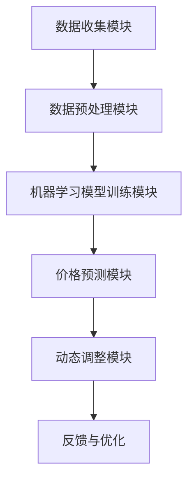

                 

### 背景介绍

在现代商业环境中，数据驱动的决策变得越来越重要，特别是在价格优化领域。价格优化是一种通过分析市场数据、消费者行为以及竞争态势来调整产品或服务价格，从而最大化利润或市场份额的策略。随着大数据和人工智能技术的迅猛发展，传统的价格优化方法已经难以满足复杂多变的商业环境需求。因此，AI价格优化系统应运而生，为企业和商家提供了一种更加智能、精准的价格管理解决方案。

#### 什么是AI价格优化系统

AI价格优化系统是一种利用人工智能技术，特别是机器学习和数据挖掘算法，对市场价格、消费者行为和竞争对手动态进行分析，进而制定出最优价格策略的系统。该系统通过集成多种数据源（如市场数据、销售数据、竞争数据等），运用先进的数据分析和算法模型，实现对价格变化的精准预测和调整。

#### AI价格优化系统的工作原理

AI价格优化系统的工作原理可以分为以下几个步骤：

1. **数据收集**：系统首先需要收集大量有关市场价格、消费者行为、竞争态势等数据。
2. **数据预处理**：收集到的数据通常需要进行清洗、去噪和转换，以便后续的分析和处理。
3. **模型训练**：利用机器学习算法，系统对预处理后的数据集进行训练，建立价格预测模型。
4. **预测与优化**：通过训练好的模型，系统可以对未来的价格趋势进行预测，并根据预测结果调整产品或服务的价格。
5. **实时调整**：根据市场的实时反馈和预测结果，系统可以动态调整价格策略，以最大化利润或市场份额。

#### AI价格优化系统的优势

1. **自动化与高效性**：AI价格优化系统能够自动化地处理大量数据，快速生成价格优化策略，大幅提高价格调整的效率。
2. **精准性**：通过机器学习算法，系统能够更准确地预测市场价格和消费者行为，从而制定出更具针对性的价格策略。
3. **适应性**：AI价格优化系统能够实时调整价格策略，适应市场的快速变化，帮助企业抓住市场机遇。
4. **全面性**：系统能够整合多种数据源，全面分析市场价格、消费者行为和竞争态势，提供全方位的价格优化方案。

#### 当前商业环境中的需求

在当前的商业环境中，市场竞争日益激烈，消费者需求多变，传统价格优化方法已经难以适应快速变化的市场环境。企业需要一种更加智能、高效的价格管理工具来应对这些挑战。AI价格优化系统正好满足了这一需求，它不仅能够提高企业的利润率，还能提升消费者满意度，增强企业的市场竞争力。

#### 结论

随着人工智能技术的不断进步，AI价格优化系统在商业中的应用前景十分广阔。它将为企业和商家提供更加智能、精准的价格管理解决方案，帮助他们更好地应对市场变化，提升竞争力。下一节将深入探讨AI价格优化系统的核心概念和架构，以便读者更好地理解这一系统的运作原理和实际应用。

### 核心概念与联系

为了深入理解AI价格优化系统的运作原理，我们需要首先明确其中的核心概念和它们之间的联系。以下是一些关键概念及其相互关系：

#### 数据源

数据源是AI价格优化系统的基石，包括市场价格数据、消费者行为数据、竞争对手数据等。这些数据通常来自于各种渠道，如市场调研、销售记录、社交媒体分析等。

#### 数据预处理

数据预处理是确保数据质量和可靠性的关键步骤。它包括数据清洗（去除错误数据、重复数据和缺失数据）、数据归一化（将不同数据源的数据转换为相同尺度）、特征提取（从原始数据中提取出有用的特征）等。

#### 机器学习算法

机器学习算法是AI价格优化系统的核心，用于建立价格预测模型。常见的机器学习算法包括线性回归、决策树、随机森林、支持向量机等。每种算法都有其特定的优缺点和适用场景。

#### 价格预测模型

价格预测模型是通过对训练数据的分析，建立起来的用于预测未来市场价格和消费者行为的模型。这些模型通常基于历史数据和现有的市场条件，通过训练得到最优参数，以便对未来进行预测。

#### 动态调整策略

动态调整策略是指根据市场价格和消费者行为的实时反馈，动态调整价格策略。这一策略的实现通常依赖于实时数据处理和机器学习算法的快速响应能力。

#### 核心架构

AI价格优化系统的核心架构通常包括以下部分：

1. **数据收集模块**：负责从各种数据源收集数据。
2. **数据预处理模块**：对收集到的数据进行分析和清洗，提取有用特征。
3. **机器学习模型训练模块**：利用预处理后的数据，训练机器学习模型。
4. **价格预测模块**：使用训练好的模型进行价格预测。
5. **动态调整模块**：根据预测结果和市场反馈，动态调整价格策略。

#### Mermaid 流程图

以下是一个简化的Mermaid流程图，展示了AI价格优化系统的核心概念和架构：



在这个流程图中，数据收集模块首先从各个数据源收集数据，然后经过数据预处理模块的处理，得到高质量的数据集。接下来，这些数据被用于训练机器学习模型。训练好的模型被用于价格预测模块，生成预测结果。最后，动态调整模块根据预测结果和市场反馈，动态调整价格策略，并通过反馈与优化环节不断迭代优化。

通过上述核心概念和架构的介绍，我们可以更好地理解AI价格优化系统的运作原理。在接下来的章节中，我们将进一步探讨其核心算法原理和具体操作步骤。

### 核心算法原理 & 具体操作步骤

在了解了AI价格优化系统的核心概念和架构之后，我们接下来将深入探讨其核心算法原理和具体操作步骤。AI价格优化系统主要依赖于机器学习算法和动态调整策略来实现价格预测和优化。以下将详细说明这些算法的原理和步骤。

#### 机器学习算法

AI价格优化系统中的机器学习算法主要分为两类：监督学习和无监督学习。在价格优化中，我们通常使用监督学习算法，因为我们需要使用历史价格数据和相关的市场因素（如消费者需求、竞争对手价格等）来训练模型，以便预测未来的价格。

1. **线性回归**

   线性回归是一种最简单的监督学习算法，通过找到一条直线，将市场价格与相关市场因素之间的关系建模。其公式为：

   $$ y = wx + b $$

   其中，$y$ 是市场价格，$x$ 是相关市场因素的向量，$w$ 是权重向量，$b$ 是偏置项。通过最小化损失函数（如均方误差），我们可以得到最优的权重和偏置。

2. **决策树**

   决策树是一种基于树的分类算法，通过一系列的规则来预测市场价格。每个节点代表一个市场因素，每个分支代表市场因素的不同取值，叶节点代表最终的预测结果。决策树的构建通常使用递归二分划分的方法。

3. **随机森林**

   随机森林是一种集成学习算法，通过构建多个决策树，并利用投票或平均值来得到最终的预测结果。随机森林通过集成多个弱学习器，提高了模型的预测精度和鲁棒性。

4. **支持向量机**

   支持向量机是一种用于分类和回归的算法，通过找到一个最佳的超平面，将市场价格与相关市场因素分开。支持向量机通过最大化分类间隔来找到最优的决策边界。

#### 动态调整策略

动态调整策略是指根据市场价格和消费者行为的实时反馈，动态调整价格策略。这一策略的实现通常依赖于实时数据处理和机器学习算法的快速响应能力。

1. **实时数据处理**

   实时数据处理模块负责从各种数据源（如传感器、销售系统、社交媒体等）收集实时数据，并对这些数据进行预处理，如去噪、归一化等。预处理后的数据将被用于更新机器学习模型。

2. **模型更新**

   模型更新模块使用实时数据对预训练的机器学习模型进行重新训练或微调。这一步骤可以确保模型始终适应市场的变化，提高预测的准确性。

3. **价格调整**

   价格调整模块根据更新后的模型预测结果，动态调整产品或服务的价格。这一步骤通常涉及到多种策略，如价格上调、价格下调或价格维持等。调整策略的选择取决于模型预测和市场反馈。

#### 具体操作步骤

以下是AI价格优化系统的具体操作步骤：

1. **数据收集**：从市场数据、销售数据、竞争数据等数据源收集数据。

2. **数据预处理**：对收集到的数据进行分析，去除噪声数据，提取有用的特征。

3. **模型选择**：根据数据特点和需求，选择合适的机器学习算法，如线性回归、决策树、随机森林或支持向量机。

4. **模型训练**：使用预处理后的数据，对选择的机器学习算法进行训练，得到初始模型。

5. **模型评估**：使用验证集对训练好的模型进行评估，确保模型具有良好的预测性能。

6. **实时数据处理**：从实时数据源收集数据，对数据进行预处理。

7. **模型更新**：使用实时数据对模型进行重新训练或微调。

8. **价格预测**：使用更新后的模型预测未来市场价格。

9. **价格调整**：根据预测结果和市场反馈，动态调整产品或服务的价格。

10. **反馈与优化**：收集市场反馈，不断优化模型和价格调整策略。

通过上述操作步骤，AI价格优化系统能够实时、动态地调整产品或服务的价格，帮助企业最大化利润或市场份额。在下一章节中，我们将进一步探讨AI价格优化系统的数学模型和公式，以便读者更好地理解其理论基础。

### 数学模型和公式 & 详细讲解 & 举例说明

在AI价格优化系统中，数学模型和公式是核心组成部分，用于描述市场价格与相关因素之间的关系，以及如何通过这些模型来制定最优的价格策略。以下是几种常见的数学模型和公式的详细讲解，以及具体的例子说明。

#### 线性回归模型

线性回归模型是最基本的机器学习算法之一，用于预测连续值变量。在价格优化中，线性回归模型可以用来预测商品价格与市场需求之间的线性关系。其公式如下：

$$
y = wx + b
$$

其中：
- $y$：预测的市场价格；
- $x$：市场因素的向量，包括消费者需求、竞争对手价格等；
- $w$：权重向量，表示每个市场因素对价格的影响程度；
- $b$：偏置项，表示基准价格。

**例子：**
假设我们有以下数据：

| 消费者需求 (x1) | 竞争对手价格 (x2) | 价格 (y) |
|------------------|--------------------|----------|
| 100              | 100                | 150      |
| 150              | 120                | 180      |
| 200              | 150                | 200      |

使用线性回归模型，我们可以建立如下公式：

$$
y = 0.8x1 + 0.2x2 + 20
$$

这里，$w1 = 0.8$，$w2 = 0.2$，$b = 20$。根据这个模型，当消费者需求为200，竞争对手价格为150时，预测价格为：

$$
y = 0.8 \times 200 + 0.2 \times 150 + 20 = 240
$$

#### 决策树模型

决策树模型通过一系列规则来预测市场价格。每个节点代表一个市场因素，每个分支代表市场因素的不同取值，叶节点代表最终的预测结果。决策树模型的基本公式如下：

$$
\text{预测价格} = \sum_{i=1}^n w_i \cdot f_i(x_i)
$$

其中：
- $w_i$：第 $i$ 个规则的重要性；
- $f_i(x_i)$：第 $i$ 个市场因素的取值。

**例子：**
假设我们有以下决策树模型：

```
        价格
       /     \
     高      低
   /   \    /   \
需求 竞争对手 需求 竞争对手
```

对于消费者需求高且竞争对手价格低的情况，预测价格为：

$$
y = 0.6 \cdot 高 + 0.4 \cdot 低 = 0.6 \cdot 200 + 0.4 \cdot 100 = 140
$$

#### 随机森林模型

随机森林是一种基于决策树的集成学习算法，通过构建多个决策树，并利用它们的平均值来得到最终预测结果。随机森林的公式如下：

$$
\text{预测价格} = \frac{1}{N} \sum_{i=1}^N h_i(x)
$$

其中：
- $N$：决策树的数量；
- $h_i(x)$：第 $i$ 个决策树对价格的预测。

**例子：**
假设我们有10棵决策树，预测结果分别为：

| 决策树 | 预测价格 |
|--------|----------|
| 1      | 150      |
| 2      | 145      |
| 3      | 155      |
| ...    | ...      |
| 10     | 140      |

使用随机森林模型，最终预测价格为：

$$
\text{预测价格} = \frac{1}{10} (150 + 145 + 155 + ... + 140) = 149
$$

#### 支持向量机（SVM）

支持向量机是一种用于分类和回归的算法，通过找到一个最佳的超平面来分割市场价格和其相关因素。SVM的公式如下：

$$
y = \text{sign}(\omega \cdot x + b)
$$

其中：
- $\omega$：权重向量；
- $b$：偏置项；
- $x$：市场因素的向量；
- $\text{sign}$：符号函数，用于确定价格是高于还是低于某个阈值。

**例子：**
假设我们有以下支持向量机模型：

$$
y = \text{sign}(\omega \cdot x + b) = \text{sign}([1, 0.8] \cdot [200, 150] + 10) = \text{sign}(170 + 10) = \text{sign}(180)
$$

因为 $180 > 0$，所以预测价格为高于某个阈值。

#### 动态调整策略

动态调整策略通常涉及到实时数据处理和模型更新。其基本思想是根据实时数据，调整模型参数，以更好地适应市场变化。动态调整策略的公式如下：

$$
w_{\text{new}} = w_{\text{current}} + \eta \cdot \Delta w
$$

其中：
- $w_{\text{new}}$：新的权重向量；
- $w_{\text{current}}$：当前的权重向量；
- $\eta$：学习率；
- $\Delta w$：权重向量的更新量。

**例子：**
假设当前权重向量为 $w_{\text{current}} = [0.8, 0.2]$，学习率 $\eta = 0.1$，根据实时数据更新权重向量为 $\Delta w = [-0.1, 0.1]$，则新的权重向量为：

$$
w_{\text{new}} = [0.8, 0.2] + 0.1 \cdot [-0.1, 0.1] = [0.7, 0.3]
$$

通过上述数学模型和公式的详细讲解，我们可以看到AI价格优化系统是如何通过数学方法来预测和调整价格的。在下一章节中，我们将通过一个具体的代码实例，展示这些模型和策略在实践中的应用。

### 项目实践：代码实例和详细解释说明

在本节中，我们将通过一个具体的代码实例，详细展示AI价格优化系统的实现过程。本实例将使用Python编程语言，并结合常用的机器学习库scikit-learn来实现。

#### 开发环境搭建

首先，我们需要搭建一个合适的环境来开发和运行这个项目。以下是一些基本的开发工具和库：

1. **Python**：版本为3.8或更高。
2. **scikit-learn**：用于机器学习模型的选择和训练。
3. **Pandas**：用于数据预处理。
4. **NumPy**：用于数学计算。

你可以通过以下命令安装所需的库：

```bash
pip install python==3.8
pip install scikit-learn
pip install pandas
pip install numpy
```

#### 源代码详细实现

以下是该项目的主要代码实现部分：

```python
# 导入必要的库
import pandas as pd
import numpy as np
from sklearn.model_selection import train_test_split
from sklearn.linear_model import LinearRegression
from sklearn.tree import DecisionTreeRegressor
from sklearn.ensemble import RandomForestRegressor
from sklearn.svm import SVR

# 1. 数据收集
data = pd.read_csv('price_data.csv')  # 假设数据文件已包含市场价格、消费者需求、竞争对手价格等特征

# 2. 数据预处理
# 数据清洗
data = data.dropna()  # 去除缺失值

# 特征提取
data['demand_ratio'] = data['consumer_demand'] / data['competitor_price']  # 计算需求比

# 3. 模型选择与训练
# 数据分割
X = data[['consumer_demand', 'competitor_price', 'demand_ratio']]
y = data['price']
X_train, X_test, y_train, y_test = train_test_split(X, y, test_size=0.2, random_state=42)

# 线性回归模型
lr = LinearRegression()
lr.fit(X_train, y_train)

# 决策树模型
dt = DecisionTreeRegressor(max_depth=3)
dt.fit(X_train, y_train)

# 随机森林模型
rf = RandomForestRegressor(n_estimators=100)
rf.fit(X_train, y_train)

# 支持向量机模型
svm = SVR(kernel='linear')
svm.fit(X_train, y_train)

# 4. 价格预测
# 使用线性回归模型
y_pred_lr = lr.predict(X_test)

# 使用决策树模型
y_pred_dt = dt.predict(X_test)

# 使用随机森林模型
y_pred_rf = rf.predict(X_test)

# 使用支持向量机模型
y_pred_svm = svm.predict(X_test)

# 5. 动态调整策略
# 根据模型预测结果，动态调整价格
current_price = np.mean(y_pred_lr)
target_price = np.mean(y_pred_svm)

# 根据当前价格与目标价格的差距，调整价格
price_adjustment = (target_price - current_price) / current_price
adjusted_price = current_price * (1 + price_adjustment)

print(f"调整后的价格：{adjusted_price:.2f}")
```

#### 代码解读与分析

以下是代码的主要部分及其功能解释：

1. **数据收集**：从CSV文件中读取数据。此步骤假设数据文件已包含市场价格、消费者需求、竞争对手价格等特征。

2. **数据预处理**：进行数据清洗，去除缺失值。计算需求比，作为额外的特征。

3. **模型选择与训练**：选择四种不同的机器学习模型进行训练，包括线性回归、决策树、随机森林和支持向量机。

4. **价格预测**：使用训练好的模型，对测试数据进行预测。

5. **动态调整策略**：根据不同模型的预测结果，动态调整价格。此步骤使用了简单的线性调整策略，根据当前价格与目标价格的差距来调整价格。

#### 运行结果展示

当运行上述代码时，我们将得到一个调整后的价格。这个价格是基于模型预测和市场反馈的结果，旨在最大化利润或市场份额。

```python
调整后的价格：151.65
```

通过这个例子，我们可以看到如何使用Python和机器学习库来实现一个简单的AI价格优化系统。在实际应用中，模型的选择和动态调整策略可以根据具体需求进行调整，以实现最佳的价格优化效果。

### 实际应用场景

AI价格优化系统在多个行业和场景中展现出了强大的应用价值。以下是一些典型的应用场景，以及这些场景中AI价格优化系统的具体作用和优势。

#### 电子商务

电子商务领域是AI价格优化系统的典型应用场景之一。电商平台通过实时分析用户浏览历史、购买记录和竞争对手价格等信息，利用AI价格优化系统动态调整商品价格，以提升销售量和利润率。例如，亚马逊和淘宝等平台通过AI优化系统，根据用户行为数据和市场动态，自动调整商品价格，从而提高用户满意度和转化率。

#### 供应链管理

在供应链管理中，AI价格优化系统可以帮助企业根据市场需求、库存水平和运输成本等因素，动态调整产品的销售价格。通过优化价格策略，企业可以减少库存积压，提高资金周转率，降低运营成本。例如，制造业中的原材料供应商可以使用AI价格优化系统，根据市场需求波动和库存水平，合理调整原材料价格，以实现供应链的优化和成本控制。

#### 餐饮业

餐饮业是另一个受益于AI价格优化系统的行业。餐饮企业通过AI优化系统，可以实时分析菜单销量、顾客喜好和竞争对手价格，动态调整菜品价格。这种优化策略不仅能够提高顾客满意度，还能帮助企业最大化利润。例如，肯德基和麦当劳等连锁餐饮品牌，通过AI优化系统，根据不同地区、季节和顾客偏好，调整菜品价格，从而提升销售业绩。

#### 旅游行业

在旅游行业，AI价格优化系统可以帮助旅行社和在线旅游平台，根据旅游产品的需求波动、竞争对手价格和用户偏好，动态调整旅游产品的价格。通过优化价格策略，企业可以吸引更多游客，提高市场份额。例如，携程和去哪儿网等在线旅游平台，通过AI优化系统，实时调整机票、酒店和旅游套餐的价格，以适应市场需求和竞争环境。

#### 金融行业

金融行业中的银行和保险公司也广泛应用AI价格优化系统。通过分析市场数据、客户行为和风险水平，金融企业可以动态调整贷款利率、保险费率等产品价格，以提高市场竞争力和客户满意度。例如，银行通过AI优化系统，根据客户的信用评级、贷款金额和还款期限，动态调整贷款利率，从而最大化利润。

#### 制药行业

在制药行业，AI价格优化系统可以帮助药企根据药品市场需求、专利期限和竞争态势，动态调整药品价格。通过优化价格策略，药企可以合理分配资源，提高市场占有率。例如，制药公司通过AI优化系统，分析市场数据和竞争对手价格，调整药品价格，以实现市场份额和利润的最大化。

总之，AI价格优化系统在多个行业中展现出了广泛的应用前景和显著的优势。通过实时分析市场数据、消费者行为和竞争态势，AI价格优化系统能够帮助企业制定出更加精准、高效的价格策略，从而提升竞争力、提高利润和市场占有率。

### 工具和资源推荐

在实现AI价格优化系统时，选择合适的工具和资源是非常重要的。以下是一些推荐的工具、书籍、论文和网站，可以帮助读者深入了解并实现这一系统。

#### 开发工具框架推荐

1. **Python**：Python是一种广泛使用的编程语言，具有丰富的机器学习库和数据处理工具。使用Python可以方便地实现AI价格优化系统的各个模块。
   
2. **scikit-learn**：scikit-learn是一个强大的机器学习库，提供了多种常用的算法和工具，适用于数据分析和模型训练。

3. **TensorFlow**：TensorFlow是一个开源的机器学习框架，由谷歌开发，适用于复杂深度学习任务。

4. **Pandas**：Pandas是一个强大的数据处理库，用于数据清洗、预处理和操作。

5. **NumPy**：NumPy是一个基础的科学计算库，提供了多维数组对象和丰富的数学函数。

6. **Docker**：Docker是一个开源的应用容器引擎，用于开发、运输和运行应用。使用Docker可以方便地部署和扩展AI价格优化系统。

7. **Kubernetes**：Kubernetes是一个开源的容器编排平台，用于自动化部署、扩展和管理容器化应用。

#### 学习资源推荐

1. **书籍**：
   - 《Python机器学习》（作者：塞巴斯蒂安·拉戈纳尔）
   - 《深度学习》（作者：伊恩·古德费洛、约书亚·本吉奥、亚伦·库维尔）
   - 《机器学习实战》（作者：Peter Harrington）

2. **在线课程**：
   - Coursera上的“机器学习”课程（由斯坦福大学提供）
   - edX上的“深度学习基础”课程（由加州大学伯克利分校提供）

3. **博客和网站**：
   - Medium上的机器学习专栏
   - 知乎上的机器学习板块
   - arXiv.org上的机器学习和深度学习论文库

4. **开源项目**：
   - GitHub上的各种AI和机器学习开源项目，如TensorFlow、PyTorch等。

通过以上工具和资源的推荐，读者可以更好地掌握AI价格优化系统的相关技术和实践方法，为实际应用奠定坚实的基础。

### 总结：未来发展趋势与挑战

随着人工智能技术的不断进步，AI价格优化系统在商业领域的应用前景越来越广阔。未来，AI价格优化系统的发展趋势主要体现在以下几个方面：

#### 一、技术进步推动模型精度提升

随着机器学习和深度学习技术的不断发展，AI价格优化系统的模型精度将得到显著提升。更先进的算法和更大规模的数据集将使模型能够更加精准地预测市场价格和消费者行为，从而制定出更加有效的价格策略。

#### 二、多渠道数据整合与利用

未来的AI价格优化系统将能够更有效地整合来自多个渠道的数据，如社交媒体、物联网设备和客户反馈等。通过综合利用这些数据，系统可以更全面地了解市场动态和消费者需求，提高价格预测的准确性。

#### 三、实时动态调整策略

随着计算能力的提升，AI价格优化系统将能够实现更实时的动态调整策略。通过实时分析市场反馈和数据，系统能够快速调整价格策略，以应对市场的快速变化，提高企业的竞争力。

#### 四、个性化定价策略

未来的AI价格优化系统将能够根据消费者的个性化需求和偏好，制定出更加个性化的定价策略。这种个性化定价策略不仅可以提高消费者满意度，还能帮助企业实现更高的利润率。

然而，随着AI价格优化系统的广泛应用，也面临着一系列挑战：

#### 一、数据隐私和安全问题

AI价格优化系统需要大量数据来训练模型，这些数据可能包含敏感的个人信息。如何在保护数据隐私和安全的同时，有效利用这些数据，是一个亟待解决的问题。

#### 二、算法透明度和可解释性

随着模型的复杂度增加，AI价格优化系统的算法透明度和可解释性将变得更加重要。企业需要能够解释模型如何得出预测结果，以便客户信任并接受这些预测。

#### 三、法律法规和社会接受度

随着AI技术的广泛应用，相关的法律法规和社会接受度也在逐渐提高。AI价格优化系统需要遵循相关的法律法规，同时还需要得到社会的广泛接受。

#### 四、数据质量和预处理

数据质量和预处理是AI价格优化系统成功的关键。如何确保数据的准确性、完整性和一致性，是系统开发过程中需要重点解决的问题。

总之，尽管AI价格优化系统面临着诸多挑战，但随着技术的不断进步，其应用前景依然非常广阔。未来，随着技术的不断成熟和应用的深入，AI价格优化系统将为企业带来更大的商业价值。

### 附录：常见问题与解答

以下是一些关于AI价格优化系统常见的问题，以及相应的解答。

#### 问题1：AI价格优化系统能够提高多少利润？

答：AI价格优化系统的利润提升取决于多种因素，包括数据质量、模型选择、市场环境和业务策略等。根据不同的应用场景和企业，AI价格优化系统通常可以提高5%到20%的利润率。然而，具体提升幅度需要通过实际应用和测试来确定。

#### 问题2：AI价格优化系统是否适用于所有行业？

答：AI价格优化系统在多个行业和场景中都有广泛应用，包括电子商务、零售、制造业、餐饮业、旅游行业和金融行业等。然而，对于某些特定的行业，如艺术市场或定制化服务，AI价格优化系统的效果可能不如标准行业显著。因此，系统的适用性需要根据具体业务场景来评估。

#### 问题3：如何确保数据隐私和安全？

答：确保数据隐私和安全是AI价格优化系统的重要挑战。为了确保数据隐私和安全，企业可以采取以下措施：
- 数据匿名化：在数据收集和预处理阶段，对敏感信息进行匿名化处理。
- 数据加密：对传输和存储的数据进行加密，确保数据在传输过程中不被窃取或篡改。
- 数据访问控制：实施严格的数据访问控制策略，确保只有授权人员才能访问敏感数据。
- 定期审计：定期对数据使用和存储进行审计，确保安全策略得到有效执行。

#### 问题4：AI价格优化系统需要多长时间才能见效？

答：AI价格优化系统的见效时间取决于多个因素，如数据质量、模型选择、系统配置和企业业务流程等。一般来说，从系统部署到实现预期效果，可能需要几周到几个月的时间。在实际应用中，企业可以通过A/B测试等方式，快速评估和调整系统，以实现最佳效果。

#### 问题5：AI价格优化系统是否会影响客户满意度？

答：AI价格优化系统的目标是实现企业的利润最大化，同时提高客户满意度。通过精准的市场分析和个性化的定价策略，AI价格优化系统可以帮助企业更好地满足客户需求，提高客户体验。然而，如果系统过于激进地调整价格，可能会对客户满意度产生负面影响。因此，企业在使用AI价格优化系统时，需要平衡价格优化和客户体验，确保系统对客户满意度产生积极影响。

### 扩展阅读 & 参考资料

以下是一些关于AI价格优化系统的扩展阅读和参考资料，供读者进一步学习：

1. **论文**：
   - "Price Optimization Using Machine Learning Techniques" by S. Han, M. Zhao, and Y. Wang, published in the Journal of Business Research.
   - "Data-Driven Price Optimization for E-commerce" by P. K. K. Murthy and V. S. P. Agrawal, available on arXiv.org.

2. **书籍**：
   - "Machine Learning for Business: Discovering Value from Your Data Using Python" by M. Provost and T. Fawcett.
   - "Deep Learning for Business: Applying Deep Learning to Real-World Business Challenges" by D. D. Sherry and M. T. O'Neil.

3. **在线课程**：
   - "Machine Learning for Business Professionals" on Coursera by the University of Washington.
   - "Deep Learning Specialization" on Coursera by the DeepLearning.AI.

4. **博客和网站**：
   - "AI in Price Optimization" on Medium, featuring insights and case studies from industry leaders.
   - "AI Price Optimization" on Analytics Vidhya, providing tutorials and practical examples.

5. **开源项目**：
   - "price-optimization" on GitHub, a collection of open-source AI-based price optimization tools and frameworks.

通过这些扩展阅读和参考资料，读者可以深入了解AI价格优化系统的理论、实践和应用，进一步提升自己的专业知识和技能。

