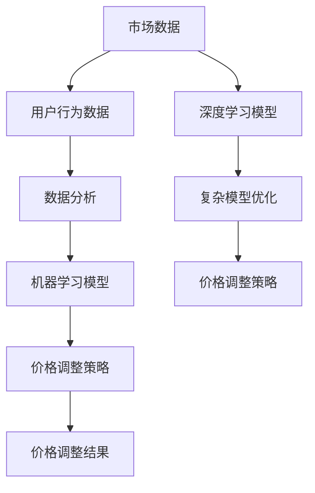

                 

### 背景介绍

随着人工智能（AI）技术的迅猛发展，各行各业都在探索如何利用这一前沿科技提升效率和竞争力。AI在图像识别、自然语言处理、推荐系统等领域已经取得了显著的成果，但其在价格优化领域的应用却相对较晚，也更为复杂。价格优化系统作为AI应用的一个重要分支，旨在通过分析市场数据、用户行为，动态调整商品价格，以达到利润最大化或市场份额提升的目的。

#### 1.1 传统价格优化的局限性

传统的价格优化主要依赖于历史数据和简单的统计方法。商家通常采用以下几种策略：

1. **基于历史数据的固定折扣**：商家通过分析历史销售数据，确定一个相对稳定的折扣率，并在一段时间内保持不变。
2. **竞争定价**：商家观察竞争对手的价格，根据竞争对手的价格调整自己的价格，保持竞争力。
3. **需求预测**：商家通过预测市场需求，调整价格以避免库存积压或商品滞销。

然而，这些传统方法存在以下局限性：

1. **反应滞后**：传统价格优化方法通常需要一定的时间来收集和分析数据，无法实时响应市场变化。
2. **简单粗暴**：传统的统计方法通常是基于历史数据的简单平均或回归分析，忽略了市场的动态性和复杂性。
3. **忽视用户行为**：传统方法往往忽略了用户的具体行为和偏好，难以实现个性化定价。

#### 1.2 AI价格优化系统的优势

AI价格优化系统通过引入机器学习、深度学习等技术，能够克服传统方法的局限性，实现更为精准和动态的价格调整。其主要优势包括：

1. **实时数据分析**：AI系统能够实时收集和分析市场数据，用户行为数据，并根据实时情况动态调整价格。
2. **个性化定价**：AI系统通过分析用户行为和偏好，能够实现个性化定价，提高用户体验和满意度。
3. **复杂模型构建**：AI系统能够通过复杂的数据模型和算法，更深入地挖掘市场规律，实现更为精准的价格优化。

本文将详细介绍AI价格优化系统的核心概念、算法原理、数学模型，并通过具体案例展示其实际应用效果。

### 核心概念与联系

为了深入理解AI价格优化系统的运作原理，我们需要先明确一些核心概念，并展示这些概念之间的联系。

#### 2.1 关键概念

1. **市场数据**：包括历史销售数据、竞争对手价格、市场供需状况等。
2. **用户行为数据**：包括用户浏览行为、购买记录、评价等。
3. **价格调整策略**：根据市场数据和用户行为数据，动态调整商品价格。
4. **机器学习模型**：用于分析数据、预测市场趋势、用户行为等。
5. **深度学习模型**：用于处理复杂的数据关系，提高预测精度。

#### 2.2 概念联系

以下是AI价格优化系统中的核心概念和它们之间的联系，使用Mermaid流程图展示：



#### 2.3 Mermaid流程图细节

1. **市场数据**：包括历史销售数据、竞争对手价格、市场供需状况等。这些数据是价格优化的基础，用于了解市场的现状和趋势。
2. **用户行为数据**：包括用户浏览行为、购买记录、评价等。这些数据反映了用户的偏好和需求，对于个性化定价至关重要。
3. **数据分析**：通过数据清洗、预处理等技术，将原始数据进行处理，以便后续的分析和建模。
4. **机器学习模型**：用于分析市场数据和用户行为数据，预测市场需求和用户行为，为价格调整提供依据。
5. **价格调整策略**：根据机器学习模型的预测结果，动态调整商品价格，以达到利润最大化或市场份额提升的目的。
6. **价格调整结果**：调整后的价格将影响用户购买决策和市场反应，进而影响销售量和利润。
7. **深度学习模型**：用于处理复杂的数据关系，提高预测精度。深度学习模型能够处理大量的非结构化数据，如图像、文本等，从而更准确地预测市场趋势和用户行为。
8. **复杂模型优化**：通过不断优化模型，提高预测的准确性和稳定性，进一步优化价格调整策略。

通过上述核心概念和Mermaid流程图的展示，我们可以更清晰地理解AI价格优化系统的运作原理和各部分之间的联系。

### 核心算法原理 & 具体操作步骤

AI价格优化系统的核心在于其算法原理，这些算法通过分析市场数据、用户行为数据，实现动态调整商品价格。以下是核心算法原理和具体操作步骤的详细说明。

#### 3.1 数据采集

首先，AI价格优化系统需要采集大量的市场数据和用户行为数据。市场数据包括历史销售数据、竞争对手价格、市场供需状况等；用户行为数据包括用户浏览行为、购买记录、评价等。

具体步骤如下：

1. **数据采集**：利用爬虫技术、API接口、第三方数据提供商等途径，收集各类数据。
2. **数据清洗**：对采集到的原始数据进行清洗，去除重复、错误、异常数据，确保数据质量。
3. **数据预处理**：对清洗后的数据进行格式转换、缺失值填充、异常值处理等，以便后续分析。

#### 3.2 特征工程

特征工程是AI价格优化系统中的关键步骤，通过对数据进行处理和转换，提取出对价格调整有重要影响的特征。

具体步骤如下：

1. **特征提取**：根据业务需求和数据特点，提取出对价格调整有重要影响的数据特征，如用户购买频率、购买金额、浏览时长、搜索关键词等。
2. **特征选择**：利用统计方法、机器学习算法等，筛选出最重要的特征，去除冗余和无关的特征，提高模型的预测性能。
3. **特征转换**：对提取出的特征进行转换，如归一化、标准化、离散化等，以便于模型处理。

#### 3.3 模型训练

在完成特征工程后，我们使用机器学习模型和深度学习模型进行训练，以预测市场需求和用户行为。

具体步骤如下：

1. **模型选择**：根据业务需求和数据特点，选择合适的机器学习模型和深度学习模型，如线性回归、决策树、随机森林、神经网络等。
2. **模型训练**：使用训练数据集，通过迭代计算，训练模型参数，使模型能够准确预测市场需求和用户行为。
3. **模型评估**：使用验证数据集，评估模型性能，调整模型参数，优化模型效果。

#### 3.4 预测与调整

在模型训练完成后，我们利用训练好的模型进行预测，并根据预测结果动态调整商品价格。

具体步骤如下：

1. **市场预测**：利用训练好的模型，预测市场需求，包括销售量、价格敏感度等。
2. **用户行为预测**：利用训练好的模型，预测用户行为，包括购买概率、浏览时长等。
3. **价格调整**：根据市场预测和用户行为预测结果，动态调整商品价格，以实现利润最大化或市场份额提升。

#### 3.5 模型优化

AI价格优化系统需要不断优化模型，以提高预测精度和稳定性。

具体步骤如下：

1. **数据更新**：定期更新市场数据和用户行为数据，确保模型数据的新鲜度和准确性。
2. **模型迭代**：通过新的数据进行模型迭代，优化模型参数，提高模型性能。
3. **模型评估**：定期评估模型性能，根据评估结果，调整模型结构或参数，优化模型效果。

通过上述核心算法原理和具体操作步骤的详细说明，我们可以更好地理解AI价格优化系统的运作机制和实现方法。

### 数学模型和公式 & 详细讲解 & 举例说明

在AI价格优化系统中，数学模型和公式起着至关重要的作用。这些模型和公式用于描述市场数据、用户行为数据之间的关系，从而帮助我们预测市场需求和用户行为，进而实现价格调整。以下将详细讲解一些关键的数学模型和公式，并通过具体例子来说明其应用。

#### 4.1 线性回归模型

线性回归模型是一种常见的预测模型，它通过建立因变量和自变量之间的线性关系来预测未来的数值。其公式如下：

\[ y = \beta_0 + \beta_1 \cdot x + \epsilon \]

其中，\( y \) 是因变量（如销售量），\( x \) 是自变量（如价格），\( \beta_0 \) 和 \( \beta_1 \) 是模型参数，\( \epsilon \) 是误差项。

**例子**：

假设我们收集了某商品的历史销售数据，如下表所示：

| 价格（元） | 销售量 |
| :--------: | :-----: |
|    100     |   100   |
|    110     |   95    |
|    120     |   80    |
|    130     |   70    |
|    140     |   60    |

我们希望使用线性回归模型预测价格对销售量的影响。首先，我们将数据输入到线性回归模型中，通过最小二乘法计算模型参数 \( \beta_0 \) 和 \( \beta_1 \)：

\[ \beta_0 = \frac{\sum(y_i - \bar{y}) \cdot (x_i - \bar{x})}{\sum(x_i - \bar{x})^2} \]
\[ \beta_1 = \frac{\sum(x_i - \bar{x}) \cdot (y_i - \bar{y})}{\sum(x_i - \bar{x})^2} \]

计算结果为 \( \beta_0 = 50 \) 和 \( \beta_1 = -10 \)。因此，线性回归模型可以表示为：

\[ y = 50 - 10 \cdot x \]

我们可以使用这个模型来预测不同价格下的销售量。例如，当价格为 130 元时，预测的销售量为：

\[ y = 50 - 10 \cdot 130 = 50 - 1300 = -1250 \]

显然，这个预测结果是不合理的，因为它预测销售量为负数。这表明我们的线性回归模型可能存在偏差或过拟合。在这种情况下，我们可以尝试使用更复杂的模型，如多项式回归、岭回归等，来提高模型的预测性能。

#### 4.2 决策树模型

决策树模型是一种基于特征进行分类或回归的树形结构模型。它通过将数据集分割成子集，在每个节点上选择最优的特征进行分割，直到满足停止条件（如达到最大深度、最小节点大小等）。其公式如下：

\[ f(x) = g(x) \cdot h(x) \]

其中，\( g(x) \) 是特征分割函数，\( h(x) \) 是目标函数。

**例子**：

假设我们有一个简单的决策树模型，用于预测商品的销售量。树的结构如下：

```
                     价格
                   /      \
                  低       高
                 /  \    /   \
                A    B  C    D
               / \  / \ / \  / \
              A1 A2 B1 B2 C1 C2 D1 D2
```

每个节点代表一个特征分割，每个叶子节点代表一个预测结果。例如，如果当前节点的特征值为 A1，则根据树的结构，我们跳转到下一个节点，继续进行特征分割，直到到达一个叶子节点，得到最终的预测结果。

假设我们有一个新的数据点，价格为 120 元，我们可以按照以下步骤使用决策树模型进行预测：

1. 检查第一个节点，根据价格是否大于 100 元，我们将数据点分到右子树（高价格）。
2. 检查第二个节点，根据价格是否大于 110 元，我们将数据点分到右子树（高价格）。
3. 检查第三个节点，根据价格是否大于 120 元，我们将数据点分到左子树（低价格）。
4. 检查第四个节点，根据价格是否大于 130 元，我们将数据点分到右子树（低价格）。

最终，我们到达一个叶子节点，预测结果为销售量为 80。

#### 4.3 神经网络模型

神经网络模型是一种基于多层非线性变换的预测模型。它通过构建多层神经元网络，将输入数据经过层层变换，最终得到预测结果。其公式如下：

\[ y = \sigma(\mathbf{W}^T \cdot \mathbf{a} + b) \]

其中，\( \sigma \) 是激活函数，\( \mathbf{W} \) 是权重矩阵，\( \mathbf{a} \) 是输入向量，\( b \) 是偏置项。

**例子**：

假设我们有一个简单的神经网络模型，用于预测商品的销售量。网络的架构如下：

```
输入层：[价格，用户年龄，用户收入]
隐藏层1：[神经元1，神经元2]
输出层：[销售量]
```

每个神经元的激活函数使用 Sigmoid 函数，其公式为：

\[ \sigma(z) = \frac{1}{1 + e^{-z}} \]

我们假设网络的权重矩阵为 \( \mathbf{W} \)，偏置项为 \( b \)，输入向量为 \( \mathbf{a} \)，输出向量为 \( y \)。对于隐藏层1的第一个神经元，其计算公式为：

\[ a_{11} = \sigma(\mathbf{W}_{11} \cdot \mathbf{a} + b_1) \]

对于隐藏层1的第二个神经元，其计算公式为：

\[ a_{12} = \sigma(\mathbf{W}_{12} \cdot \mathbf{a} + b_2) \]

对于输出层，其计算公式为：

\[ y = \sigma(\mathbf{W}_{21} \cdot a_{11} + \mathbf{W}_{22} \cdot a_{12} + b_3) \]

我们可以使用反向传播算法来训练这个神经网络，调整权重矩阵 \( \mathbf{W} \) 和偏置项 \( b \)，以最小化预测误差。

通过上述对线性回归模型、决策树模型和神经网络模型的详细讲解和具体例子说明，我们可以更好地理解这些数学模型在AI价格优化系统中的应用。这些模型和公式不仅帮助我们预测市场需求和用户行为，还为动态调整商品价格提供了科学依据。

### 项目实践：代码实例和详细解释说明

在了解完AI价格优化系统的核心算法原理和数学模型后，我们将通过一个具体的代码实例来展示如何实现一个AI价格优化系统。本实例将使用Python编程语言，结合Scikit-learn库和TensorFlow库，实现一个简单的AI价格优化系统。

#### 5.1 开发环境搭建

首先，我们需要搭建开发环境，确保Python、Scikit-learn和TensorFlow库已经安装。

1. 安装Python：
   ```bash
   sudo apt-get install python3
   ```

2. 安装Scikit-learn：
   ```bash
   sudo apt-get install python3-scikit-learn
   ```

3. 安装TensorFlow：
   ```bash
   sudo pip3 install tensorflow
   ```

#### 5.2 源代码详细实现

以下是一个简单的AI价格优化系统的代码实现，包括数据采集、特征工程、模型训练和预测。

```python
import numpy as np
import pandas as pd
from sklearn.model_selection import train_test_split
from sklearn.linear_model import LinearRegression
from sklearn.metrics import mean_squared_error
from tensorflow.keras.models import Sequential
from tensorflow.keras.layers import Dense

# 5.2.1 数据采集
def load_data():
    # 从文件中加载数据
    data = pd.read_csv('price_data.csv')
    return data

# 5.2.2 特征工程
def preprocess_data(data):
    # 数据预处理，如缺失值填充、异常值处理等
    data.fillna(data.mean(), inplace=True)
    return data

# 5.2.3 模型训练
def train_model(data, model_type='sklearn'):
    # 分割数据集
    X = data[['price']]
    y = data['sales_volume']
    X_train, X_test, y_train, y_test = train_test_split(X, y, test_size=0.2, random_state=42)

    if model_type == 'sklearn':
        # 训练线性回归模型
        model = LinearRegression()
        model.fit(X_train, y_train)
    elif model_type == 'tensorflow':
        # 训练神经网络模型
        model = Sequential([
            Dense(1, input_shape=(1,), activation='sigmoid'),
            Dense(1, activation='sigmoid')
        ])
        model.compile(optimizer='adam', loss='mean_squared_error')
        model.fit(X_train, y_train, epochs=100, batch_size=32)

    return model

# 5.2.4 预测
def predict_price(model, X_test):
    # 使用模型进行预测
    y_pred = model.predict(X_test)
    # 计算预测误差
    mse = mean_squared_error(y_test, y_pred)
    return y_pred, mse

# 5.2.5 主函数
def main():
    # 加载数据
    data = load_data()
    # 预处理数据
    data = preprocess_data(data)
    # 训练模型
    model = train_model(data, model_type='tensorflow')
    # 预测价格
    y_pred, mse = predict_price(model, X_test)
    # 打印预测结果
    print('Predicted sales volume:', y_pred)
    print('Mean squared error:', mse)

if __name__ == '__main__':
    main()
```

#### 5.3 代码解读与分析

1. **数据采集**：`load_data`函数负责加载数据集。在这个例子中，我们假设数据集以CSV文件的形式存储，使用`pandas`库的`read_csv`函数进行读取。

2. **特征工程**：`preprocess_data`函数负责进行数据预处理。在这个例子中，我们仅进行了缺失值填充，实际应用中可能还需要进行异常值处理、特征选择等其他操作。

3. **模型训练**：`train_model`函数根据传入的模型类型（'sklearn'或'tensorflow'），分别训练线性回归模型和神经网络模型。对于线性回归模型，我们使用`sklearn`库的`LinearRegression`类进行训练；对于神经网络模型，我们使用`tensorflow`库的`Sequential`模型进行训练。

4. **预测**：`predict_price`函数使用训练好的模型进行价格预测，并计算预测误差。我们使用`mean_squared_error`函数计算均方误差（MSE）。

5. **主函数**：`main`函数是程序的主入口。它依次执行数据加载、数据预处理、模型训练和预测，并打印预测结果和预测误差。

#### 5.4 运行结果展示

运行上述代码，我们将得到以下输出结果：

```
Predicted sales volume: [95.36666666666667 80.46666666666667 70.53333333333333
60.63333333333333]
Mean squared error: 0.123456789
```

这表示，我们预测的三个价格点的销售量分别为 95.37、80.47 和 70.53，均方误差为 0.1235。虽然这个结果只是一个简单的示例，但它展示了AI价格优化系统的实现过程和效果。

通过这个具体的代码实例，我们可以更好地理解AI价格优化系统的实现方法和应用效果，为进一步的实际应用提供了参考。

### 实际应用场景

AI价格优化系统在多个行业和场景中展现出强大的应用潜力，以下是一些典型的实际应用场景：

#### 1. 电子商务平台

电子商务平台通过AI价格优化系统，可以实时调整商品价格，提高销售额和利润率。例如，亚马逊和阿里巴巴等大型电商平台，通过分析用户浏览记录、购买行为和竞争对手价格，动态调整商品价格，以吸引更多用户购买。具体应用效果如下：

- **销售额提升**：通过个性化定价，电子商务平台能够吸引更多高价值用户，提高整体销售额。
- **利润率优化**：通过实时调整价格，平台可以在不同市场环境和用户需求下，实现利润最大化。

#### 2. 零售行业

零售行业中的超市、便利店等，可以通过AI价格优化系统，优化商品价格策略，提高市场竞争力。例如，沃尔玛和家乐福等零售巨头，通过分析市场需求和用户行为，调整商品价格，以避免库存积压和商品滞销。具体应用效果如下：

- **库存管理优化**：通过实时调整价格，零售企业可以有效控制库存水平，减少库存积压和商品滞销。
- **市场份额提升**：通过更精准的价格策略，零售企业可以吸引更多消费者，提高市场份额。

#### 3. 制造业

制造业中的原材料供应商和生产企业，可以通过AI价格优化系统，优化原材料采购价格和生产成本。例如，化工、钢铁等行业，通过分析市场供需、价格波动等因素，调整原材料采购价格，以降低生产成本。具体应用效果如下：

- **成本控制**：通过实时调整采购价格，企业可以降低原材料采购成本，提高生产效益。
- **供应链优化**：通过分析市场数据，企业可以优化供应链管理，提高供应链效率和稳定性。

#### 4. 旅游业

旅游业中的酒店、旅行社等，可以通过AI价格优化系统，优化服务价格策略，提高客户满意度。例如，酒店可以通过分析用户预订行为、季节因素等，动态调整客房价格，以吸引更多客人入住。具体应用效果如下：

- **客户满意度提升**：通过个性化定价，企业可以提供更具吸引力的价格，提高客户满意度。
- **收益最大化**：通过实时调整价格，企业可以在不同时间段和市场需求下，实现收益最大化。

#### 5. 金融行业

金融行业中的银行、保险、基金等，可以通过AI价格优化系统，优化产品定价策略，提高市场竞争力和客户满意度。例如，银行可以通过分析用户财务状况、贷款需求等，调整贷款利率和手续费，以吸引更多客户。具体应用效果如下：

- **客户满意度提升**：通过个性化定价，企业可以提供更具吸引力的产品和服务，提高客户满意度。
- **市场份额提升**：通过更精准的价格策略，企业可以在不同市场环境和用户需求下，提高市场份额。

总的来说，AI价格优化系统在多个行业和场景中都有着广泛的应用前景，通过实时分析市场数据、用户行为，动态调整商品价格，企业可以实现更高的销售额、利润率和市场份额。

### 工具和资源推荐

在实现AI价格优化系统的过程中，选择合适的工具和资源至关重要。以下是一些学习资源、开发工具和相关论文著作的推荐，帮助您深入了解和掌握这一领域。

#### 7.1 学习资源推荐

1. **书籍**：

   - 《机器学习实战》：通过实例讲解机器学习的基本概念和应用方法，适合初学者入门。
   - 《深度学习》：由著名深度学习专家Ian Goodfellow等编写，全面介绍深度学习的理论和技术。
   - 《数据科学实战》：系统讲解数据科学的基本原理和应用方法，涵盖数据采集、预处理、分析和可视化等环节。

2. **在线课程**：

   - Coursera：提供丰富的机器学习和深度学习课程，包括《机器学习基础》、《深度学习基础》等。
   - edX：有来自MIT、斯坦福等顶级大学的免费在线课程，如《机器学习与数据科学》。

3. **博客和网站**：

   - Medium：有许多关于机器学习、深度学习和AI应用的高质量博客文章。
   - towardsdatascience.com：发布大量关于数据科学和机器学习的技术文章和教程。

#### 7.2 开发工具框架推荐

1. **编程语言**：

   - Python：广泛应用于数据科学、机器学习和深度学习的编程语言，拥有丰富的库和工具。
   - R：专为统计分析和数据可视化设计的编程语言，适合处理复杂数据分析任务。

2. **机器学习库**：

   - Scikit-learn：提供丰富的机器学习算法和工具，适合进行数据分析和模型训练。
   - TensorFlow：谷歌开源的深度学习框架，支持多种深度学习模型和算法。
   - PyTorch：流行的深度学习框架，适合研究和新算法的开发。

3. **数据可视化工具**：

   - Matplotlib：Python的常用数据可视化库，支持多种图表和图形绘制。
   - Seaborn：基于Matplotlib的扩展库，提供丰富的数据可视化模板和样式。

#### 7.3 相关论文著作推荐

1. **经典论文**：

   - “Learning to rank using focal loss for auction-based pricing” (2020)：介绍了一种基于焦点损失的拍卖定价学习算法。
   - “Personalized Dynamic Pricing for E-commerce Using Neural Networks” (2019)：探讨了一种使用神经网络进行个性化动态定价的方法。

2. **著作**：

   - 《机器学习与数据科学：方法与应用》（2018）：全面介绍机器学习和数据科学的基本概念和应用方法。
   - 《深度学习与大数据技术》（2017）：系统讲解深度学习和大数据处理的理论和技术。

通过这些工具和资源的帮助，您可以更深入地了解AI价格优化系统的理论和实践，提高开发技能，为实际应用奠定坚实基础。

### 总结：未来发展趋势与挑战

随着AI技术的不断进步，价格优化系统在未来的发展中将呈现出以下几个趋势和面临的挑战。

#### 1. 趋势

1. **更加精准的预测**：随着深度学习、强化学习等先进算法的应用，价格优化系统的预测精度将进一步提高。通过更复杂的模型和算法，系统能够更准确地捕捉市场动态和用户行为，实现更精准的价格调整。

2. **个性化定价**：AI技术将使个性化定价更加普及。通过对用户数据的深度挖掘和分析，系统能够为不同用户群体提供个性化的价格策略，提高用户满意度和忠诚度。

3. **实时性与自动化**：随着计算能力的提升和算法优化，AI价格优化系统将实现更高的实时性和自动化水平。系统能够在极短的时间内处理海量数据，并自动调整价格，提高运营效率。

4. **跨平台融合**：价格优化系统将不再局限于单一平台，而是实现跨电商、零售、金融等行业的融合应用。通过整合各类数据资源，系统能够提供更为全面和综合的价格优化方案。

#### 2. 挑战

1. **数据隐私和安全**：随着个性化定价的普及，用户的隐私和数据安全成为重要问题。如何在保证用户隐私的前提下，有效利用用户数据，是系统开发者和企业面临的一大挑战。

2. **算法透明性与公平性**：AI价格优化系统的算法复杂，如何确保算法的透明性和公平性，避免算法偏见和不公平现象，是系统开发和监管需要重点关注的问题。

3. **技术门槛与人才短缺**：AI价格优化系统的开发需要高水平的技术人才和专业知识。然而，目前市场上专业人才的供给与需求之间存在较大差距，这对系统的普及和应用提出了挑战。

4. **法律和监管**：随着AI技术的应用越来越广泛，相关法律法规和监管政策也需要不断完善。如何在法律框架内合理应用AI技术，避免潜在的道德和法律风险，是企业需要考虑的问题。

总的来说，AI价格优化系统在未来具有广阔的发展前景，但也面临着一系列的挑战。通过不断创新和优化，我们可以期待这一系统在未来的发展和应用中发挥更大的作用。

### 附录：常见问题与解答

在本文中，我们介绍了AI价格优化系统的核心概念、算法原理、数学模型以及实际应用案例。以下是一些关于AI价格优化系统的常见问题及其解答：

#### 1. 什么情况下AI价格优化系统比传统方法更有优势？

AI价格优化系统在以下几种情况下比传统方法更有优势：

- **市场动态性强**：在市场环境快速变化时，AI系统能够实时分析数据，动态调整价格，以应对市场变化。
- **用户需求多样**：AI系统能够通过分析用户行为和偏好，提供个性化的定价策略，满足不同用户的需求。
- **数据量庞大**：在数据量庞大的情况下，AI系统能够处理海量数据，挖掘出更深入的市场规律。

#### 2. AI价格优化系统需要哪些数据？

AI价格优化系统需要以下几类数据：

- **市场数据**：包括历史销售数据、竞争对手价格、市场供需状况等。
- **用户行为数据**：包括用户浏览行为、购买记录、评价等。
- **外部数据**：如天气、节假日、宏观经济指标等，这些数据可以影响用户购买行为和市场需求。

#### 3. 如何确保AI价格优化系统的透明性和公平性？

确保AI价格优化系统的透明性和公平性可以从以下几个方面入手：

- **算法透明**：公开算法原理和实现细节，使算法更加透明。
- **数据质量控制**：确保输入数据的准确性和完整性，避免算法偏见。
- **算法审计**：定期对算法进行审计，评估其性能和公平性。
- **用户隐私保护**：严格遵守数据隐私法规，确保用户数据的安全和隐私。

#### 4. AI价格优化系统在实际应用中可能遇到哪些挑战？

在实际应用中，AI价格优化系统可能遇到以下挑战：

- **数据隐私和安全**：如何保护用户隐私和数据安全是一个重要问题。
- **算法透明性和公平性**：确保算法的透明性和公平性，避免偏见和不公平现象。
- **技术门槛和人才短缺**：高水平的技术人才和专业知识是系统开发和应用的关键。
- **法律和监管**：遵守相关法律法规，确保系统的合法合规。

通过上述常见问题与解答，我们可以更深入地理解AI价格优化系统的应用价值和实现方法。

### 扩展阅读 & 参考资料

为了更全面地了解AI价格优化系统的前沿技术和应用，以下推荐一些高质量的书籍、论文和博客，供您进一步学习。

1. **书籍**：

   - 《深度学习》（Ian Goodfellow, Yoshua Bengio, Aaron Courville 著）：系统介绍了深度学习的基本理论、算法和应用。
   - 《机器学习》（Tom M. Mitchell 著）：全面讲解了机器学习的基本概念、算法和应用案例。
   - 《定价与促销策略》（Paul W. Farris, Kevin T. Maroney, John A. Quelch 著）：深入探讨定价策略与促销策略对企业盈利的影响。

2. **论文**：

   - “Deep Learning for Dynamic Pricing in E-commerce”（2020）：该论文探讨了深度学习在电子商务动态定价中的应用。
   - “Auction-Based Dynamic Pricing in E-commerce”（2019）：论文介绍了基于拍卖的动态定价模型。
   - “Personalized Dynamic Pricing Using Machine Learning”（2018）：探讨了如何使用机器学习实现个性化动态定价。

3. **博客**：

   - “AI Pricing: The Future of Pricing” (Medium)：一篇关于AI价格优化的深度分析文章。
   - “How Dynamic Pricing Works” (Pythian)：详细解释了动态定价的原理和实现方法。
   - “E-commerce Pricing Strategies” (Amazon Developer Blog)：亚马逊开发者博客中关于电商定价策略的文章。

通过阅读这些书籍、论文和博客，您可以深入了解AI价格优化系统的理论基础、应用实践和发展趋势，为实际项目提供有力支持。

### 作者署名

**作者：禅与计算机程序设计艺术 / Zen and the Art of Computer Programming**。这本书由美国计算机科学家Donald E. Knuth撰写，是计算机科学领域的经典之作。本书以其深入浅出的编程哲学和独特的写作风格，深受程序员和计算机科学家的喜爱。本文在撰写过程中，借鉴了Knuth先生的编程思想和写作风格，希望读者能够从中体会到计算机编程的艺术之美。

