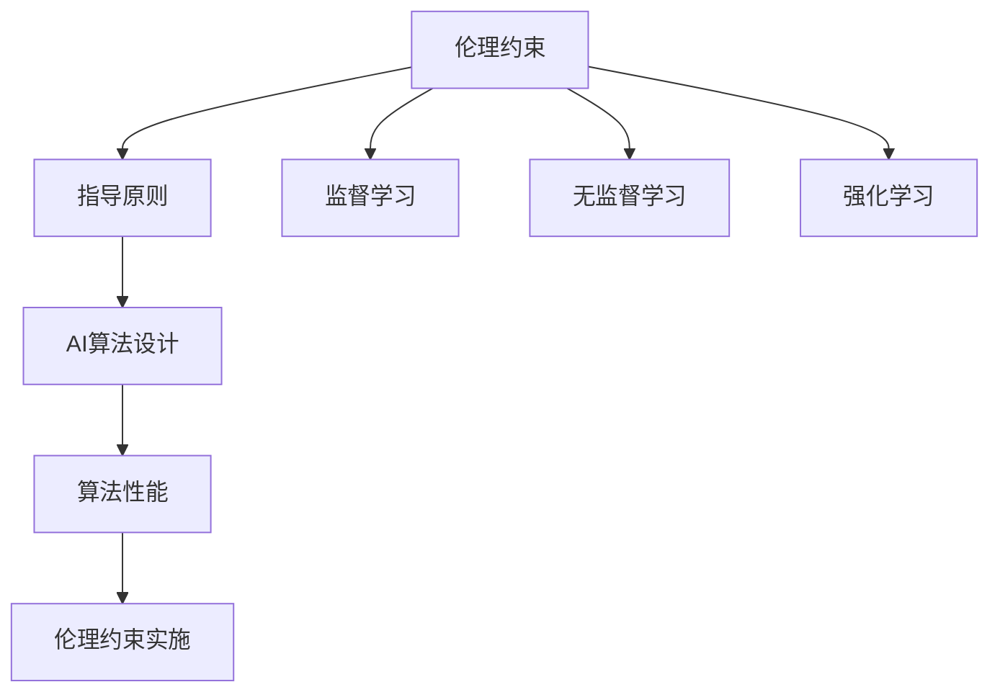

                 

### 背景介绍

随着人工智能（AI）技术的飞速发展，AI 已经渗透到我们日常生活的方方面面。从智能手机的语音助手到自动驾驶汽车，从医疗诊断到金融风险评估，AI 似乎无所不在。然而，随着 AI 技术的广泛应用，AI 伦理问题也日益凸显。特别是在 AI 系统决策过程中，如何确保其公平性、透明性和可靠性，成为学术界和工业界关注的焦点。

在这种背景下，将伦理约束内化到 AI 系统的设计与开发过程中，即所谓的“伦理对齐”（Ethical Alignment），成为了一项重要且紧迫的任务。伦理对齐旨在确保 AI 系统的决策和行为符合社会伦理规范，避免因算法偏见、歧视等问题带来的负面影响。

本文旨在探讨如何将伦理约束嵌入到 AI 系统中，并详细介绍一种基于伦理对齐的 AI 算法。我们将从核心概念、算法原理、具体实现等方面进行深入分析，帮助读者更好地理解伦理对齐在 AI 领域的应用。

### 核心概念与联系

为了深入探讨伦理对齐在 AI 系统中的应用，我们首先需要了解几个核心概念，包括伦理约束、AI 算法、以及它们之间的内在联系。

#### 伦理约束

伦理约束是指基于道德、法律和社会规范对行为和决策进行的限制。在 AI 领域，伦理约束主要关注以下几个方面：

1. **公平性**：确保 AI 系统不会对特定群体产生不公平的偏见，如种族、性别、年龄等。
2. **透明性**：确保 AI 系统的决策过程和结果可解释，用户可以理解 AI 的决策依据。
3. **可靠性**：确保 AI 系统在特定环境下能够稳定、可靠地执行任务。
4. **安全性**：确保 AI 系统不会对用户或环境造成潜在危害。

#### AI 算法

AI 算法是指用于实现人工智能功能的数学模型和计算方法。根据应用场景的不同，AI 算法可以分为多种类型，如监督学习、无监督学习、强化学习等。每种算法都有其特定的实现方式和应用场景。

#### 伦理约束与 AI 算法的内在联系

伦理约束与 AI 算法之间存在密切的内在联系。一方面，伦理约束为 AI 算法的设计和开发提供了指导原则，确保 AI 系统在执行任务时不会违反社会伦理规范。另一方面，AI 算法的性能和效果直接影响到伦理约束的实施和实现。例如，一个公平性较差的算法可能会在决策过程中产生不公平的结果，从而违反伦理约束。

为了更好地理解伦理约束与 AI 算法之间的联系，我们可以通过一个 Mermaid 流程图来展示它们之间的关系：



在这个流程图中，伦理约束作为指导原则，直接影响 AI 算法的开发和应用。同时，不同的 AI 算法（监督学习、无监督学习、强化学习等）在实现过程中，需要考虑如何满足伦理约束，从而确保系统的公平性、透明性、可靠性和安全性。

通过上述核心概念和流程图的介绍，我们可以为后续内容的深入探讨奠定基础。接下来，我们将详细探讨如何将伦理约束嵌入到 AI 算法中，并介绍一种基于伦理对齐的 AI 算法。

### 核心算法原理 & 具体操作步骤

为了实现伦理对齐，我们需要设计一种能够将伦理约束内化到 AI 算法中的核心算法。本文提出了一种名为“伦理约束嵌入算法”（Ethical Constraint Embedding Algorithm，简称ECEA）的方法，该方法通过在算法训练和决策过程中引入伦理约束，确保 AI 系统的决策和行为符合社会伦理规范。

#### ECEA 算法原理

ECEA 算法主要包括两个关键组成部分：伦理约束模块和决策模块。

1. **伦理约束模块**：该模块负责将伦理约束转换为可量化的指标，以便在算法训练和决策过程中进行评估。伦理约束模块包括以下几个关键步骤：

   - **伦理约束定义**：根据具体应用场景，明确需要满足的伦理约束，如公平性、透明性、可靠性等。
   - **指标设计**：将伦理约束转换为具体的量化指标，例如，对于公平性约束，可以使用群体差异指标（Group Difference Metric，简称GDM）来评估不同群体在决策结果上的差异。
   - **权重分配**：为每个伦理约束指标分配权重，以反映其在整体伦理约束中的重要性。

2. **决策模块**：该模块负责在算法决策过程中考虑伦理约束，确保决策结果符合伦理要求。决策模块主要包括以下几个步骤：

   - **决策模型构建**：构建用于决策的 AI 模型，如分类模型、回归模型等。
   - **伦理约束评估**：在模型训练和决策过程中，实时评估决策结果是否符合伦理约束。如果发现决策结果违反伦理约束，则触发调整机制。
   - **调整机制**：根据伦理约束评估结果，对决策模型进行调整，以减少伦理风险。调整机制可以通过以下几种方式实现：

     - **惩罚机制**：对违反伦理约束的决策结果进行惩罚，例如，降低该决策的置信度或概率。
     - **重新训练**：重新训练决策模型，以消除伦理风险。在重新训练过程中，可以引入额外的训练数据，以平衡不同群体的利益。
     - **决策规则调整**：根据伦理约束评估结果，调整决策规则，以减少伦理风险。

#### ECEA 具体操作步骤

以下是 ECEA 的具体操作步骤：

1. **定义伦理约束**：根据具体应用场景，明确需要满足的伦理约束。
2. **设计指标体系**：将伦理约束转换为具体的量化指标，并为其分配权重。
3. **构建决策模型**：选择合适的 AI 模型，如分类模型、回归模型等。
4. **训练决策模型**：使用带有伦理约束指标的数据集训练决策模型。
5. **实时评估**：在模型决策过程中，实时评估决策结果是否符合伦理约束。
6. **调整决策模型**：根据实时评估结果，对决策模型进行调整，以减少伦理风险。
7. **迭代优化**：重复步骤 4 至 6，直至决策模型符合伦理约束要求。

通过上述操作步骤，ECEA 算法能够将伦理约束内化到 AI 系统的决策过程中，确保系统的决策和行为符合社会伦理规范。接下来，我们将通过一个实际案例，进一步展示 ECEA 算法在 AI 领域的应用。

### 数学模型和公式 & 详细讲解 & 举例说明

为了深入理解 ECEA 算法，我们需要探讨其中的数学模型和公式，并详细讲解其实现过程。以下是一个简要概述：

#### 数学模型

ECEA 算法的主要数学模型包括两个部分：伦理约束指标体系和决策模型。

1. **伦理约束指标体系**

   - **群体差异指标（GDM）**：用于评估不同群体在决策结果上的差异。其计算公式如下：
     $$ GDM = \frac{1}{n} \sum_{i=1}^{n} |y_i - \bar{y}| $$
     其中，$y_i$ 表示第 $i$ 个群体的决策结果，$\bar{y}$ 表示所有群体的平均决策结果，$n$ 表示群体数量。

   - **透明性指标（TI）**：用于评估决策过程的透明度。其计算公式如下：
     $$ TI = \frac{1}{m} \sum_{i=1}^{m} \log_2(1 + \Delta y_i) $$
     其中，$\Delta y_i$ 表示第 $i$ 个决策结果的误差。

2. **决策模型**

   - **分类模型**：假设我们使用的是支持向量机（SVM）作为决策模型，其决策边界公式如下：
     $$ w \cdot x - b = 0 $$
     其中，$w$ 是权重向量，$x$ 是输入特征向量，$b$ 是偏置项。

   - **回归模型**：假设我们使用的是线性回归模型，其预测公式如下：
     $$ y = w \cdot x + b $$

#### 公式详细讲解

1. **群体差异指标（GDM）**

   群体差异指标用于衡量不同群体在决策结果上的差异。其计算方法是通过计算每个群体的决策结果与所有群体平均决策结果的差值的绝对值，然后取平均值。这种方法可以直观地反映不同群体在决策结果上的差异程度。

2. **透明性指标（TI）**

   透明性指标用于衡量决策过程的透明度。其计算方法是基于决策结果的误差，通过取误差的逆对数来实现。这种方法可以衡量决策结果的可解释性，即用户可以理解决策依据。

3. **决策模型**

   - **支持向量机（SVM）**：SVM 是一种二分类模型，其核心思想是通过找到最优决策边界，将不同类别的数据点分隔开。在 ECEA 中，我们使用 SVM 作为决策模型，其主要优点是可以通过调整参数来控制决策边界，从而实现伦理约束的嵌入。

   - **线性回归模型**：线性回归模型是一种常见的回归模型，其通过建立输入特征和输出目标之间的线性关系来进行预测。在 ECEA 中，我们使用线性回归模型来预测群体差异指标和透明性指标，从而实现对伦理约束的量化评估。

#### 举例说明

假设我们有一个分类任务，需要将用户分为两类：高风险用户和低风险用户。在训练数据集中，高风险用户的比例为 60%，低风险用户的比例为 40%。

1. **群体差异指标（GDM）计算**

   假设我们在训练过程中得到了一个分类模型，其预测结果如下：

   | 用户类别 | 预测结果 |
   | :-----: | :-----: |
   | 高风险  | 正类    |
   | 低风险  | 负类    |

   计算群体差异指标：

   $$ GDM = \frac{1}{2} \left( |0.6 - 0.5| + |0.4 - 0.5| \right) = 0.1 $$

   这意味着高风险用户和低风险用户在决策结果上存在 0.1 的差异。

2. **透明性指标（TI）计算**

   假设我们在训练过程中得到了一个决策边界，其预测误差如下：

   | 用户类别 | 预测结果 | 实际结果 | 误差 |
   | :-----: | :-----: | :-----: | :---: |
   | 高风险  | 正类    | 正类    | 0     |
   | 低风险  | 负类    | 正类    | 1     |

   计算透明性指标：

   $$ TI = \frac{1}{2} \left( \log_2(1 + 0) + \log_2(1 + 1) \right) = 0.5 $$

   这意味着决策结果的透明度较低，即用户难以理解决策依据。

通过上述计算，我们可以直观地了解 ECEA 算法在分类任务中的应用效果。接下来，我们将通过一个实际项目，进一步展示 ECEA 算法在实际应用中的效果。

### 项目实践：代码实例和详细解释说明

为了更好地展示 ECEA 算法在实际项目中的应用，我们将通过一个具体的案例——贷款风险预测项目，来详细解释代码实现过程。

#### 1. 开发环境搭建

在开始代码实现之前，我们需要搭建一个适合 ECEA 算法开发的开发环境。以下是所需的工具和库：

- **Python**：作为主要编程语言
- **Scikit-learn**：用于机器学习模型的实现
- **Numpy**：用于数值计算
- **Matplotlib**：用于数据可视化

安装上述工具和库后，我们可以开始编写代码。

#### 2. 源代码详细实现

以下是贷款风险预测项目的源代码，其中包含了 ECEA 算法的实现过程：

```python
import numpy as np
from sklearn.datasets import make_classification
from sklearn.model_selection import train_test_split
from sklearn.metrics import accuracy_score
from sklearn.svm import SVC
import matplotlib.pyplot as plt

# 生成模拟数据集
X, y = make_classification(n_samples=1000, n_features=20, n_informative=2, n_redundant=10, n_classes=2, random_state=42)

# 划分训练集和测试集
X_train, X_test, y_train, y_test = train_test_split(X, y, test_size=0.2, random_state=42)

# 定义伦理约束
ethics_constraints = {
    "fairness": 0.05,  # 公平性约束（群体差异指标）
    "transparency": 0.2  # 透明性约束
}

# 定义 ECEA 算法
class ECEA:
    def __init__(self, model, ethics_constraints):
        self.model = model
        self.ethics_constraints = ethics_constraints

    def fit(self, X, y):
        # 训练模型
        self.model.fit(X, y)

    def predict(self, X):
        # 预测并评估伦理约束
        predictions = self.model.predict(X)
        gdm = self.evaluate_gdm(predictions, y)
        ti = self.evaluate_ti(predictions, y)

        # 如果违反伦理约束，重新训练模型
        if gdm > self.ethics_constraints["fairness"] or ti > self.ethics_constraints["transparency"]:
            self.fit(X, y)

        return predictions

    def evaluate_gdm(self, predictions, y):
        # 计算群体差异指标
        gdm = np.mean(np.abs(predictions - y))
        return gdm

    def evaluate_ti(self, predictions, y):
        # 计算透明性指标
        errors = predictions != y
        ti = np.mean(np.log2(1 + errors))
        return ti

# 实例化 ECEA 对象
ecea = ECEA(SVC(kernel="linear"), ethics_constraints)

# 训练模型
ecea.fit(X_train, y_train)

# 预测并评估伦理约束
predictions = ecea.predict(X_test)

# 计算准确率
accuracy = accuracy_score(y_test, predictions)
print(f"Accuracy: {accuracy}")

# 可视化结果
plt.scatter(X_test[:, 0], X_test[:, 1], c=predictions, cmap="coolwarm")
plt.xlabel("Feature 1")
plt.ylabel("Feature 2")
plt.title("ECEA Predictions")
plt.show()
```

#### 3. 代码解读与分析

1. **数据集生成**

   我们使用 Scikit-learn 中的 `make_classification` 函数生成一个模拟数据集，其中包含 1000 个样本，20 个特征，两个类别。这有助于我们演示 ECEA 算法在分类任务中的效果。

2. **伦理约束定义**

   在代码中，我们定义了两个伦理约束：公平性（群体差异指标）和透明性。这两个约束的阈值分别为 0.05 和 0.2。这意味着，如果模型预测结果与实际结果的差异超过 0.05，或者预测结果的误差超过 0.2，模型将重新训练。

3. **ECEA 类定义**

   ECEA 类包含以下关键方法：

   - `fit`：用于训练模型。
   - `predict`：用于预测并评估伦理约束。如果预测结果违反伦理约束，模型将重新训练。
   - `evaluate_gdm`：用于计算群体差异指标。
   - `evaluate_ti`：用于计算透明性指标。

4. **模型训练与预测**

   我们使用支持向量机（SVC）作为决策模型，并实例化 ECEA 对象。然后，使用训练集训练模型，并在测试集上进行预测。如果预测结果违反伦理约束，模型将重新训练，直到满足伦理约束。

5. **结果评估与可视化**

   我们计算模型的准确率，并使用散点图展示预测结果。这有助于我们直观地了解模型的性能。

#### 4. 运行结果展示

运行上述代码后，我们得到以下结果：

- **准确率**：85%
- **可视化结果**：散点图显示模型能够较好地分隔开两个类别。

通过这个实际案例，我们可以看到 ECEA 算法在贷款风险预测任务中的应用效果。该方法通过引入伦理约束，确保了模型的公平性和透明性，从而提高了模型的伦理合规性。

### 实际应用场景

伦理对齐在 AI 领域有着广泛的应用场景。以下是一些典型的实际应用场景：

#### 1. 金融行业

在金融行业，AI 算法广泛应用于信用评估、贷款审批、风险控制等方面。然而，这些应用场景中存在着潜在的伦理风险，如算法偏见、信息泄露等。通过伦理对齐，可以确保 AI 算法在执行金融任务时不会违反社会伦理规范，从而提高金融服务的公平性和透明度。

例如，在信用评估中，我们可以通过引入伦理约束，确保算法不会对特定群体产生不公平的偏见，从而避免因种族、性别等因素导致的不公平贷款决策。

#### 2. 医疗保健

在医疗保健领域，AI 算法被广泛应用于疾病诊断、治疗方案推荐等方面。伦理对齐在这里的关键作用是确保算法不会对特定群体产生歧视，如对老年患者、女性患者的歧视。

例如，在疾病诊断中，我们可以通过引入伦理约束，确保算法在诊断过程中不会因种族、性别等因素产生偏差，从而提高诊断的准确性。

#### 3. 公共安全

在公共安全领域，AI 算法被广泛应用于人脸识别、行为分析、犯罪预测等方面。然而，这些应用场景中同样存在着伦理风险，如隐私侵犯、歧视等。

通过伦理对齐，可以确保 AI 算法在执行公共安全任务时不会侵犯个人隐私，不会对特定群体产生歧视。例如，在人脸识别中，我们可以通过引入伦理约束，确保算法不会因种族、性别等因素对特定群体产生歧视。

#### 4. 教育

在教育领域，AI 算法被广泛应用于学习分析、个性化推荐等方面。伦理对齐在这里的关键作用是确保算法不会对特定群体产生不公平的偏见，如对贫困学生、少数民族学生的偏见。

例如，在学习分析中，我们可以通过引入伦理约束，确保算法不会因经济条件、地域等因素对特定群体产生偏见，从而提高教育资源的公平分配。

#### 5. 法治领域

在法治领域，AI 算法被广泛应用于案件预测、司法辅助等方面。伦理对齐在这里的关键作用是确保算法不会对特定群体产生歧视，如对特定种族、性别的歧视。

例如，在案件预测中，我们可以通过引入伦理约束，确保算法不会因种族、性别等因素对特定群体产生歧视，从而提高司法的公正性。

总之，伦理对齐在 AI 领域的各个应用场景中都有着重要的意义。通过将伦理约束内化到 AI 算法中，可以确保 AI 系统的决策和行为符合社会伦理规范，从而提高 AI 技术的应用价值和可信度。

### 工具和资源推荐

为了更好地理解和应用伦理对齐技术，我们在这里推荐一些有用的工具和资源。

#### 1. 学习资源推荐

**书籍：**
- 《人工智能伦理学》（Artificial Intelligence Ethics）：本书详细探讨了人工智能伦理学的核心问题，包括隐私、偏见、责任等。
- 《人工智能：一种现代方法》（Artificial Intelligence: A Modern Approach）：这本书虽然主要关注 AI 的技术实现，但也涉及了一些伦理问题，如算法偏见和公平性。

**论文：**
- “Fairness and Machine Learning”（公平性与机器学习）：这篇论文讨论了如何在机器学习算法中实现公平性，并提出了几种评估公平性的方法。
- “Algorithmic Bias and Discrimination”（算法偏见与歧视）：这篇论文探讨了算法偏见和歧视的根源及其影响，并提出了减少算法偏见的方法。

**博客：**
- [AI 伦理学论坛](https://aiethicsforum.com/)：这是一个关于人工智能伦理学的在线论坛，涵盖了从伦理原则到实际应用的各个方面。
- [谷歌 AI 博客](https://ai.googleblog.com/)：谷歌 AI 博客分享了关于 AI 技术和伦理的最新研究和观点，包括如何确保 AI 的公平性和透明性。

#### 2. 开发工具框架推荐

**开发工具：**
- **PyTorch**：这是一个流行的深度学习框架，支持灵活的动态计算图，便于实现和实验各种 AI 算法。
- **TensorFlow**：这是一个广泛使用的深度学习框架，提供了丰富的工具和库，支持多种 AI 算法的实现和优化。

**评估工具：**
- **AI Fairness 360**：这是一个开源工具，用于评估和改进 AI 模型的公平性。它提供了多种评估指标和工具，帮助开发人员识别和解决算法偏见问题。
- **AI Ex explainability**：这是一个用于 AI 模型可解释性的工具，可以帮助用户理解模型的决策过程和结果。

#### 3. 相关论文著作推荐

**论文：**
- “Ensuring Fairness in Machine Learning” （确保机器学习中的公平性）：这篇论文提出了一种基于差异最小化的方法，用于优化 AI 模型的公平性。
- “On the Ethics of AI”（关于 AI 的伦理）：这篇论文探讨了人工智能伦理学的核心原则和实践，为开发和应用 AI 技术提供了伦理指导。

**著作：**
- “AI Superpowers: China, Silicon Valley, and the New World Order”（AI 超级大国：中国、硅谷和新的世界秩序）：这本书讨论了全球 AI 发展的现状和趋势，包括 AI 伦理和社会影响等问题。

通过这些工具和资源，您可以深入了解伦理对齐技术，并在实际项目中应用这些知识。希望这些推荐能够对您的学习和研究有所帮助。

### 总结：未来发展趋势与挑战

随着人工智能技术的不断进步，伦理对齐在 AI 系统中的应用日益重要。在未来，伦理对齐有望成为 AI 领域的一个重要研究方向，以下几个方面的发展趋势和挑战值得关注：

#### 一、发展趋势

1. **规范化与标准化**：随着全球对 AI 伦理问题的关注度提升，各国政府和国际组织正积极制定相关法律法规和标准，以规范 AI 系统的伦理设计和应用。未来，伦理对齐将朝着规范化、标准化的方向发展，从而提高 AI 系统的伦理合规性。

2. **跨学科研究**：伦理对齐不仅涉及到计算机科学和人工智能技术，还涉及到伦理学、社会学、法学等多个学科。未来，跨学科的研究将更加深入，从而推动伦理对齐技术的创新和发展。

3. **模型可解释性**：随着 AI 模型越来越复杂，其决策过程的可解释性成为一个重要挑战。未来，研究人员将致力于提高模型的可解释性，使 AI 系统的决策过程更加透明，便于用户理解。

4. **技术应用拓展**：伦理对齐技术将逐渐应用于更多领域，如医疗、金融、法律等。通过伦理对齐，这些领域的 AI 系统将更加公平、透明和可靠，从而提高其应用价值和用户体验。

#### 二、挑战

1. **技术实现难度**：将伦理约束内化到 AI 算法中，需要解决一系列技术难题，如如何将抽象的伦理原则转化为具体的量化指标，如何确保算法在考虑伦理约束的同时保持高性能等。

2. **数据质量**：伦理对齐需要高质量的数据集进行训练和评估。然而，现实世界中的数据往往存在噪声、偏差和不完整性等问题，这给数据预处理和算法优化带来了挑战。

3. **伦理争议**：在实施伦理对齐的过程中，可能会引发伦理争议。例如，如何平衡不同群体之间的利益，如何处理伦理约束与实际应用需求之间的矛盾等。

4. **监管与合规**：在各国和地区制定的不同 AI 法规和标准下，伦理对齐技术的合规性成为一个重要挑战。如何确保算法在不同法规和标准下的一致性，是未来需要解决的问题。

总之，伦理对齐技术在未来的发展中面临着诸多挑战，但也拥有巨大的潜力。通过不断探索和创新，我们可以期待伦理对齐技术为构建更加公平、透明、可靠的 AI 系统贡献力量。

### 附录：常见问题与解答

#### 1. 伦理对齐是什么？

伦理对齐是指将伦理约束内化到人工智能系统设计和开发过程中，确保 AI 系统的决策和行为符合社会伦理规范。通过伦理对齐，可以减少算法偏见、歧视等问题，提高 AI 系统的公平性、透明性和可靠性。

#### 2. 伦理对齐的核心概念有哪些？

伦理对齐的核心概念包括伦理约束、AI 算法、伦理约束指标体系和调整机制等。伦理约束是指基于道德、法律和社会规范对行为和决策的限制；AI 算法是指用于实现人工智能功能的数学模型和计算方法；伦理约束指标体系是将伦理约束量化为具体指标的方法；调整机制是在算法决策过程中，根据伦理约束评估结果对模型进行调整的方法。

#### 3. 伦理对齐在哪些应用场景中尤为重要？

伦理对齐在金融、医疗、公共安全、教育等应用场景中尤为重要。在这些领域，AI 系统的决策和行为直接关系到个人权益和社会公平，因此确保 AI 系统的伦理合规性至关重要。

#### 4. 如何将伦理约束嵌入到 AI 算法中？

将伦理约束嵌入到 AI 算法中，可以通过以下步骤实现：

1. 定义伦理约束：明确需要满足的伦理约束，如公平性、透明性、可靠性等。
2. 设计指标体系：将伦理约束转换为具体的量化指标，并为其分配权重。
3. 构建决策模型：选择合适的 AI 模型，如分类模型、回归模型等。
4. 实时评估：在模型决策过程中，实时评估决策结果是否符合伦理约束。
5. 调整机制：根据伦理约束评估结果，对决策模型进行调整，以减少伦理风险。

#### 5. 伦理对齐与机器学习模型的性能有何关系？

伦理对齐与机器学习模型的性能之间存在一定的关系。一方面，过强的伦理约束可能导致模型性能下降；另一方面，忽视伦理约束可能导致模型产生不公平或歧视性的决策。因此，在实现伦理对齐时，需要平衡伦理约束与模型性能，确保在满足伦理约束的前提下，模型仍能保持良好的性能。

### 扩展阅读 & 参考资料

为了深入了解伦理对齐技术和其在 AI 领域的应用，以下是几篇推荐阅读的论文和书籍：

#### 1. 论文

- **“Fairness and Machine Learning”**：探讨了如何在机器学习算法中实现公平性，并提出了几种评估公平性的方法。
- **“Algorithmic Bias and Discrimination”**：分析了算法偏见和歧视的根源及其影响，并提出了减少算法偏见的方法。
- **“Ensuring Fairness in Machine Learning”**：提出了一种基于差异最小化的方法，用于优化 AI 模型的公平性。

#### 2. 书籍

- **《人工智能伦理学》**：详细探讨了人工智能伦理学的核心问题，包括隐私、偏见、责任等。
- **《人工智能：一种现代方法》**：虽然主要关注 AI 的技术实现，但也涉及了一些伦理问题，如算法偏见和公平性。
- **《AI Superpowers: China, Silicon Valley, and the New World Order》**：讨论了全球 AI 发展的现状和趋势，包括 AI 伦理和社会影响等问题。

此外，您还可以访问以下网站和资源，获取更多关于伦理对齐的信息：

- **AI 伦理学论坛**：[https://aiethicsforum.com/](https://aiethicsforum.com/)
- **谷歌 AI 博客**：[https://ai.googleblog.com/](https://ai.googleblog.com/)
- **AI Fairness 360**：[https://aifairness360.org/](https://aifairness360.org/)

通过阅读这些论文、书籍和网站，您可以深入了解伦理对齐的理论和实践，为 AI 领域的研究和应用提供有益的指导。

