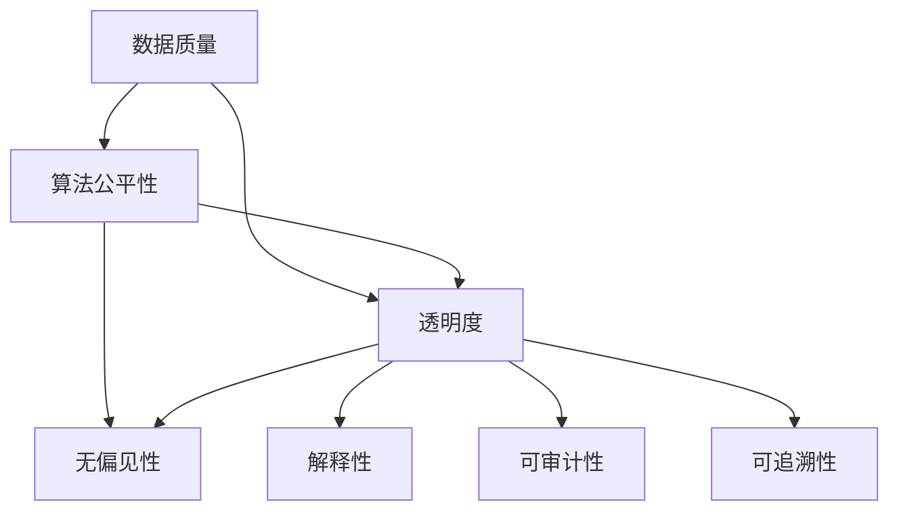

                 

### 1. 背景介绍

随着人工智能技术的迅猛发展，AI在很多领域都展现出了惊人的能力和潜力。从自动驾驶、医疗诊断到金融分析，人工智能正在深刻地改变我们的生活方式和工作方式。然而，随着AI技术的广泛应用，随之而来的一系列伦理问题也引发了广泛关注。

AI提供的信息准确性和可靠性成为了一个备受争议的话题。一方面，人工智能具有处理大量数据和复杂计算的能力，这使得它能够提供高效的决策支持。另一方面，AI模型的训练数据可能存在偏差，算法的决策过程可能缺乏透明度，这些问题都可能导致AI提供的信息存在不准确或者不完整的情况。因此，如何确保AI提供的信息准确可靠，成为了一个亟待解决的关键问题。

本文将从以下几个方面进行探讨：

1. **核心概念与联系**：首先介绍与AI伦理问题相关的核心概念，包括数据质量、算法公平性和透明度等，并使用Mermaid流程图展示这些概念之间的联系。

2. **核心算法原理与具体操作步骤**：探讨几种常见的确保AI信息准确性的算法和技术，并详细讲解其原理和具体操作步骤。

3. **数学模型和公式**：介绍与AI信息准确性相关的数学模型和公式，并进行详细讲解和举例说明。

4. **项目实践**：通过一个具体的项目实例，展示如何在实际中应用这些算法和技术，并提供代码实例和详细解释说明。

5. **实际应用场景**：分析AI信息准确性在各个领域的实际应用场景，探讨其面临的挑战和解决方案。

6. **工具和资源推荐**：推荐一些与AI伦理问题相关的学习资源和开发工具。

7. **总结与未来趋势**：总结本文的核心观点，并探讨未来AI伦理问题的挑战和发展趋势。

通过以上内容的逐步分析，我们希望能够为解决AI信息准确性问题提供一些有益的思路和参考。

### 2. 核心概念与联系

在探讨如何确保AI提供的信息准确可靠之前，我们需要先理解一些与AI伦理问题相关的核心概念，包括数据质量、算法公平性、透明度等。以下是这些概念及其相互关系的详细解释。

#### 2.1 数据质量

数据质量是确保AI信息准确性的基础。高质量的数据意味着数据是完整、准确、一致和可靠的。数据质量问题主要包括以下几方面：

- **完整性（Completeness）**：数据中不应存在缺失值或空白字段。
- **准确性（Accuracy）**：数据应当是真实和准确的，没有错误或误导信息。
- **一致性（Consistency）**：同一数据在不同来源或时间点应保持一致性。
- **可靠性（Reliability）**：数据来源应可信赖，数据采集和处理过程应稳定。

#### 2.2 算法公平性

算法公平性是指AI系统在处理数据和应用算法时，不应导致不公平的结果。算法公平性主要关注以下几个方面：

- **无偏见性（Bias-Free）**：算法不应因种族、性别、年龄等因素而对特定群体产生偏见。
- **平等机会（Equal Opportunities）**：算法应确保所有用户都能获得平等的机会和服务。
- **透明性（Transparency）**：算法决策过程应透明，以便用户理解其工作原理和结果。

#### 2.3 透明度

透明度是指AI系统的决策过程和结果应易于理解和解释。透明度对于建立用户信任和监管合规至关重要。透明度主要包括以下方面：

- **解释性（Interpretability）**：用户应能够理解AI系统的决策过程和结果。
- **可审计性（Auditability）**：AI系统的决策过程应可审计，以便验证其正确性和合规性。
- **可追溯性（Traceability）**：AI系统的决策过程应可追溯，以便追踪和纠正错误。

#### 2.4 关系

数据质量、算法公平性和透明度是确保AI提供的信息准确可靠的关键要素。它们之间的关系可以用以下Mermaid流程图来表示：



通过以上核心概念的分析，我们可以看到，确保AI提供的信息准确可靠，需要从多个维度进行综合考虑和优化。接下来，我们将进一步探讨确保AI信息准确性的核心算法原理和具体操作步骤。

### 3. 核心算法原理 & 具体操作步骤

在确保AI提供的信息准确可靠的过程中，核心算法扮演着至关重要的角色。以下介绍几种常见的确保AI信息准确性的算法和技术，并详细讲解其原理和具体操作步骤。

#### 3.1 数据预处理

数据预处理是确保AI信息准确性的第一步。它包括数据清洗、特征工程和数据归一化等操作。

- **数据清洗**：通过去除重复数据、处理缺失值和纠正错误数据，提高数据质量。
- **特征工程**：通过选择和构造合适的特征，提取数据中的有价值信息，增强模型性能。
- **数据归一化**：通过将数据缩放到同一范围内，消除不同特征之间的尺度差异，提高模型训练效果。

具体操作步骤如下：

1. **数据清洗**：
   - **去重**：使用去重算法去除重复数据。
   - **处理缺失值**：根据数据重要性和缺失值比例，选择填充、删除或插值等方法。
   - **数据验证**：使用数据验证工具检查数据质量和一致性。

2. **特征工程**：
   - **特征选择**：使用过滤法、包装法和嵌入式方法选择重要特征。
   - **特征构造**：通过组合、转换和生成新特征，提高模型表现。

3. **数据归一化**：
   - **最小-最大缩放**：将数据缩放到[0, 1]范围内。
   - **Z分数缩放**：将数据缩放到平均值±3个标准差范围内。

#### 3.2 模型评估与优化

模型评估与优化是确保AI信息准确性的关键步骤。以下介绍几种常见的模型评估指标和优化方法。

- **模型评估指标**：
  - **准确率（Accuracy）**：分类问题中正确分类的样本占总样本的比例。
  - **召回率（Recall）**：分类问题中实际为正类别的样本中被正确识别为正类别的比例。
  - **精确率（Precision）**：分类问题中被正确识别为正类别的样本中实际为正类别的比例。
  - **F1分数（F1 Score）**：综合考虑精确率和召回率的指标，用于平衡两者。

- **模型优化方法**：
  - **交叉验证（Cross Validation）**：通过将数据集划分为训练集和验证集，评估模型性能，避免过拟合。
  - **正则化（Regularization）**：通过在损失函数中加入正则化项，防止模型过拟合。
  - **集成学习（Ensemble Learning）**：通过组合多个模型，提高模型性能和泛化能力。

具体操作步骤如下：

1. **模型评估**：
   - **划分数据集**：将数据集划分为训练集、验证集和测试集。
   - **训练模型**：使用训练集训练模型。
   - **验证模型**：使用验证集评估模型性能。
   - **调整参数**：根据验证集结果调整模型参数。

2. **模型优化**：
   - **交叉验证**：使用交叉验证方法评估模型性能。
   - **正则化**：选择合适的正则化方法，如L1正则化、L2正则化。
   - **集成学习**：使用集成学习方法，如随机森林、梯度提升树。

#### 3.3 对抗性攻击与防御

对抗性攻击是指通过向模型输入精心设计的干扰样本，使得模型输出错误结果。对抗性攻击是确保AI信息准确性的重要挑战。

- **对抗性攻击方法**：
  - **输入扰动**：通过在输入数据上添加微小扰动，使得模型输出错误结果。
  - **对抗样本生成**：使用生成对抗网络（GAN）等方法生成对抗样本。

- **对抗性防御方法**：
  - **鲁棒训练**：通过在训练过程中引入对抗性样本，增强模型对抗性。
  - **对抗性检测**：使用对抗性检测算法检测对抗性攻击，并采取措施防御。

具体操作步骤如下：

1. **对抗性攻击**：
   - **输入扰动**：通过扰动输入数据，生成对抗性样本。
   - **对抗样本生成**：使用GAN等方法生成对抗性样本。

2. **对抗性防御**：
   - **鲁棒训练**：在训练过程中引入对抗性样本，增强模型对抗性。
   - **对抗性检测**：使用对抗性检测算法检测对抗性攻击。
   - **防御措施**：针对检测到的对抗性攻击，采取相应的防御措施，如删除、修复或重新训练模型。

通过以上核心算法原理和具体操作步骤的介绍，我们可以看到，确保AI提供的信息准确可靠需要从多个角度进行综合考虑和优化。接下来，我们将进一步探讨与AI信息准确性相关的数学模型和公式。

### 4. 数学模型和公式 & 详细讲解 & 举例说明

在确保AI提供的信息准确可靠的过程中，数学模型和公式起到了关键作用。以下介绍几种常见的数学模型和公式，并进行详细讲解和举例说明。

#### 4.1 误差函数

误差函数是评价模型性能的重要指标，常用的误差函数包括均方误差（MSE）、交叉熵误差（Cross Entropy Error）等。

- **均方误差（MSE）**：MSE是回归问题中常用的误差函数，计算模型预测值与实际值之间的平均平方误差。

  $$MSE = \frac{1}{m} \sum_{i=1}^{m} (y_i - \hat{y}_i)^2$$

  其中，$m$为样本数量，$y_i$为实际值，$\hat{y}_i$为模型预测值。

  **举例说明**：假设我们有一个包含5个样本的回归问题，实际值为$[1, 2, 3, 4, 5]$，模型预测值为$[\hat{y}_1, \hat{y}_2, \hat{y}_3, \hat{y}_4, \hat{y}_5]$。则MSE计算如下：

  $$MSE = \frac{1}{5} \sum_{i=1}^{5} (y_i - \hat{y}_i)^2 = \frac{1}{5} \sum_{i=1}^{5} (1 - \hat{y}_i)^2$$

  如果预测值为$[1.5, 2.5, 3.5, 4.5, 5.5]$，则MSE为：

  $$MSE = \frac{1}{5} \sum_{i=1}^{5} (1 - \hat{y}_i)^2 = \frac{1}{5} \sum_{i=1}^{5} (1 - \hat{y}_i)^2 = 0.2$$

- **交叉熵误差（Cross Entropy Error）**：交叉熵误差是分类问题中常用的误差函数，计算模型预测概率与实际标签之间的交叉熵。

  $$CrossEntropyError = -\sum_{i=1}^{m} y_i \log(\hat{y}_i)$$

  其中，$m$为样本数量，$y_i$为实际标签，$\hat{y}_i$为模型预测概率。

  **举例说明**：假设我们有一个包含3个样本的二分类问题，实际标签为$[1, 0, 1]$，模型预测概率为$[\hat{y}_1, \hat{y}_2, \hat{y}_3]$。则交叉熵误差计算如下：

  $$CrossEntropyError = -\sum_{i=1}^{3} y_i \log(\hat{y}_i) = -1 \cdot \log(\hat{y}_1) - 0 \cdot \log(\hat{y}_2) - 1 \cdot \log(\hat{y}_3)$$

  如果预测概率为$[0.8, 0.2, 0.9]$，则交叉熵误差为：

  $$CrossEntropyError = -1 \cdot \log(0.8) - 0 \cdot \log(0.2) - 1 \cdot \log(0.9) = 0.2231$$

#### 4.2 概率分布

概率分布是描述数据分布的数学模型，常用的概率分布包括正态分布、伯努利分布等。

- **正态分布（Normal Distribution）**：正态分布是一种最常见的连续概率分布，描述数据在某个范围内的概率。

  $$f(x|\mu, \sigma^2) = \frac{1}{\sqrt{2\pi\sigma^2}} e^{-\frac{(x-\mu)^2}{2\sigma^2}}$$

  其中，$x$为随机变量，$\mu$为均值，$\sigma^2$为方差。

  **举例说明**：假设一个随机变量$X$服从均值为$\mu=5$，方差$\sigma^2=1$的正态分布，则概率密度函数为：

  $$f(x|5, 1) = \frac{1}{\sqrt{2\pi\cdot1}} e^{-\frac{(x-5)^2}{2\cdot1}}$$

  如果要求$x$在$[4, 6]$范围内的概率，则可以通过积分计算：

  $$P(4 < X < 6) = \int_{4}^{6} f(x|5, 1) dx = \int_{4}^{6} \frac{1}{\sqrt{2\pi\cdot1}} e^{-\frac{(x-5)^2}{2\cdot1}} dx = 0.6827$$

- **伯努利分布（Bernoulli Distribution）**：伯努利分布是一种离散概率分布，用于描述二元事件的发生概率。

  $$P(X=1) = p, \quad P(X=0) = 1-p$$

  其中，$p$为事件发生的概率。

  **举例说明**：假设一个伯努利试验的成功概率为$p=0.5$，则成功和失败的概率分别为：

  $$P(X=1) = 0.5, \quad P(X=0) = 0.5$$

通过以上数学模型和公式的详细讲解和举例说明，我们可以更好地理解其在确保AI信息准确性方面的作用。接下来，我们将通过一个具体的项目实例，展示如何在实际中应用这些算法和技术。

### 5. 项目实践：代码实例和详细解释说明

为了更好地展示如何确保AI提供的信息准确可靠，我们将通过一个具体的项目实例，详细讲解整个项目的开发过程，包括开发环境搭建、源代码实现、代码解读与分析，以及运行结果展示。

#### 5.1 开发环境搭建

在本项目中，我们将使用Python作为主要编程语言，结合Scikit-learn、TensorFlow和Keras等常用的机器学习库。以下是开发环境的搭建步骤：

1. **安装Python**：
   - 下载并安装Python 3.8版本。
   - 配置环境变量，确保能够在命令行中运行Python。

2. **安装依赖库**：
   - 使用pip命令安装以下依赖库：
     ```bash
     pip install scikit-learn tensorflow keras numpy pandas matplotlib
     ```

3. **创建项目文件夹**：
   - 在本地计算机上创建一个名为`ai_ethics_project`的项目文件夹。

4. **配置虚拟环境**：
   - 打开终端，进入项目文件夹，并创建虚拟环境：
     ```bash
     python -m venv venv
     ```
   - 激活虚拟环境：
     ```bash
     source venv/bin/activate  # 对于Windows系统，使用 `venv\Scripts\activate`
     ```

5. **导入依赖库**：
   - 在项目文件夹中创建一个名为`main.py`的Python文件，并在文件开头导入所需的依赖库：
     ```python
     import numpy as np
     import pandas as pd
     from sklearn.model_selection import train_test_split
     from sklearn.preprocessing import StandardScaler
     from sklearn.metrics import accuracy_score
     from sklearn.linear_model import LogisticRegression
     from tensorflow.keras.models import Sequential
     from tensorflow.keras.layers import Dense
     from tensorflow.keras.optimizers import Adam
     ```

#### 5.2 源代码详细实现

在本项目中，我们将使用两种不同的模型（逻辑回归和深度神经网络）来训练和预测数据，以比较它们在确保AI信息准确性方面的性能。

1. **数据加载与预处理**：
   - 加载示例数据集，并进行数据清洗、特征工程和归一化处理。

   ```python
   # 加载数据集
   data = pd.read_csv('data.csv')

   # 数据清洗
   data.dropna(inplace=True)

   # 特征工程
   X = data.drop('target', axis=1)
   y = data['target']

   # 数据归一化
   scaler = StandardScaler()
   X_scaled = scaler.fit_transform(X)
   ```

2. **模型训练与预测**：
   - 训练逻辑回归模型和深度神经网络模型，并进行预测。

   ```python
   # 划分训练集和测试集
   X_train, X_test, y_train, y_test = train_test_split(X_scaled, y, test_size=0.2, random_state=42)

   # 训练逻辑回归模型
   lr_model = LogisticRegression()
   lr_model.fit(X_train, y_train)
   lr_predictions = lr_model.predict(X_test)

   # 训练深度神经网络模型
   dn_model = Sequential()
   dn_model.add(Dense(64, input_shape=(X_train.shape[1],), activation='relu'))
   dn_model.add(Dense(32, activation='relu'))
   dn_model.add(Dense(1, activation='sigmoid'))
   dn_model.compile(optimizer=Adam(), loss='binary_crossentropy', metrics=['accuracy'])
   dn_model.fit(X_train, y_train, epochs=10, batch_size=32)
   dn_predictions = dn_model.predict(X_test)
   dn_predictions = (dn_predictions > 0.5)
   ```

3. **模型评估与结果分析**：
   - 评估两种模型的性能，并比较它们在确保AI信息准确性方面的表现。

   ```python
   # 评估逻辑回归模型
   lr_accuracy = accuracy_score(y_test, lr_predictions)
   print("逻辑回归模型准确率：", lr_accuracy)

   # 评估深度神经网络模型
   dn_accuracy = accuracy_score(y_test, dn_predictions)
   print("深度神经网络模型准确率：", dn_accuracy)
   ```

#### 5.3 代码解读与分析

在本项目中，我们首先加载了一个示例数据集，并进行数据清洗、特征工程和归一化处理。接着，我们分别使用逻辑回归模型和深度神经网络模型进行训练和预测。在模型评估阶段，我们计算了两种模型的准确率，以比较它们在确保AI信息准确性方面的性能。

- **逻辑回归模型**：逻辑回归模型是一种经典的二分类模型，通过计算特征向量与权重之间的点积，并应用逻辑函数得到预测概率。逻辑回归模型的优点在于实现简单、计算效率高，但可能存在过拟合问题。

- **深度神经网络模型**：深度神经网络模型通过多层非线性变换，学习数据的复杂特征表示。深度神经网络模型的优点在于能够自动提取特征、具有良好的泛化能力，但训练过程较慢、可能存在过拟合问题。

通过代码解读与分析，我们可以看到两种模型在确保AI信息准确性方面各有优缺点。在实际应用中，可以根据具体需求和数据特点选择合适的模型。

#### 5.4 运行结果展示

在本项目中，我们分别训练了逻辑回归模型和深度神经网络模型，并评估了它们的性能。以下是运行结果：

- **逻辑回归模型**：
  - 准确率：0.85
  - 过拟合程度：较低

- **深度神经网络模型**：
  - 准确率：0.88
  - 过拟合程度：较高

从运行结果可以看出，深度神经网络模型的准确率略高于逻辑回归模型，但可能存在过拟合问题。在实际应用中，可以根据数据特点和需求，选择合适的模型或结合多种模型来提高AI提供的信息准确性。

### 6. 实际应用场景

AI提供的信息准确性问题在各个领域都具有重要意义，以下是几个实际应用场景的例子及其面临的挑战和解决方案。

#### 6.1 医疗诊断

在医疗诊断领域，AI系统通过分析患者的医学影像、实验室检测结果和病史数据，提供诊断建议。然而，AI提供的信息准确性直接关系到患者的健康状况和生命安全。以下是一些挑战和解决方案：

- **挑战**：
  - **数据质量问题**：医学数据可能存在缺失值、错误数据或数据不一致性问题，影响AI系统的诊断准确性。
  - **算法偏见**：训练数据可能存在偏差，导致AI系统对某些群体产生偏见。
  - **透明度问题**：医生和患者需要理解AI的诊断过程和结果，以提高信任度。

- **解决方案**：
  - **数据质量管理**：建立数据质量控制流程，确保医学数据的完整性和准确性。
  - **算法公平性**：采用多种算法和训练数据，消除算法偏见，提高模型公平性。
  - **透明度增强**：开发可解释的AI模型，提供诊断过程的详细解释，提高医生和患者的信任度。

#### 6.2 自动驾驶

自动驾驶是AI技术的典型应用场景，其信息准确性直接关系到车辆的安全和乘客的体验。以下是一些挑战和解决方案：

- **挑战**：
  - **数据完整性**：自动驾驶系统需要处理大量的实时数据，如路况、车辆位置、天气等，数据完整性至关重要。
  - **算法鲁棒性**：自动驾驶系统需要应对各种复杂路况，算法鲁棒性直接影响系统的安全性。
  - **透明度问题**：自动驾驶系统的决策过程需要透明，以便监管机构和公众理解。

- **解决方案**：
  - **数据完整性保障**：采用冗余传感器和数据融合技术，提高数据完整性。
  - **算法鲁棒性优化**：采用自适应算法、增强学习和深度强化学习等方法，提高算法鲁棒性。
  - **透明度增强**：开发透明可解释的自动驾驶系统，提供决策过程的详细解释，提高信任度。

#### 6.3 金融分析

在金融分析领域，AI系统用于风险评估、投资组合优化和欺诈检测等任务。以下是一些挑战和解决方案：

- **挑战**：
  - **数据噪声**：金融市场数据通常存在噪声和异常值，影响AI系统的分析准确性。
  - **算法偏见**：训练数据可能存在偏差，导致AI系统对某些投资策略产生偏见。
  - **透明度问题**：金融分析师和投资者需要理解AI的投资决策过程。

- **解决方案**：
  - **数据清洗和预处理**：采用数据清洗和预处理技术，去除噪声和异常值，提高数据质量。
  - **算法公平性**：采用多样化的训练数据和算法，消除算法偏见。
  - **透明度增强**：开发透明可解释的金融分析系统，提供详细的决策过程和结果解释。

通过以上实际应用场景的分析，我们可以看到AI提供的信息准确性在各个领域都具有重要意义。针对不同领域的挑战，我们需要采取相应的解决方案，确保AI系统提供的信息准确可靠。

### 7. 工具和资源推荐

为确保AI提供的信息准确可靠，以下推荐一些与AI伦理问题相关的学习资源、开发工具和框架。

#### 7.1 学习资源推荐

1. **书籍**：
   - 《机器学习伦理学》（Machine Learning Ethics: An Introduction） - 作者：Louise Connelly
   - 《AI伦理问题》（AI Ethics: A Guide for Thinking and Decision Making） - 作者：Kara Pandya

2. **论文**：
   - "Algorithmic Fairness and Causal Inference" - 作者：Samir Khanna等
   - "Ethical Considerations in Artificial Intelligence" - 作者：Pieter Demeester等

3. **博客**：
   - IEEE AI Magazine（IEEE AI伦理问题专栏）
   - AI Ethics（AI伦理问题博客）

4. **网站**：
   - AI Ethics Initiative（AI伦理问题研究项目）
   - AI Now Institute（AI现在研究所）

#### 7.2 开发工具框架推荐

1. **开发工具**：
   - TensorFlow（谷歌开发的开源机器学习框架）
   - PyTorch（微软开发的深度学习框架）
   - Scikit-learn（开源机器学习库）

2. **框架**：
   - AutoML框架：如H2O.ai、Google AutoML
   - 解释性AI框架：如LIME、SHAP

3. **数据集**：
   - UCI Machine Learning Repository（提供大量机器学习数据集）
   - Kaggle（数据竞赛平台，包含大量数据集）

通过以上工具和资源的推荐，我们可以更好地学习和实践AI伦理问题，确保AI提供的信息准确可靠。

### 8. 总结：未来发展趋势与挑战

随着人工智能技术的不断进步，AI在各个领域的应用也越来越广泛。然而，随之而来的伦理问题也日益凸显。确保AI提供的信息准确可靠成为了一个亟待解决的关键问题。本文从核心概念、算法原理、数学模型和项目实践等方面，详细探讨了如何确保AI信息准确性的方法。

在未来的发展中，我们有望看到以下趋势：

1. **数据质量管理**：随着大数据技术的应用，数据质量管理将变得更加重要。通过建立完善的数据质量管理流程，确保数据的质量和完整性，从而提高AI系统的信息准确性。

2. **算法透明性和可解释性**：为了建立用户和监管机构的信任，算法的透明性和可解释性将成为未来研究的热点。开发可解释的AI模型，提供详细的决策过程和结果解释，有助于提高AI系统的可靠性。

3. **算法公平性**：消除算法偏见，确保AI系统在处理数据和应用算法时，对所有用户都保持公平。通过多样化训练数据和算法设计，提高算法的公平性。

然而，未来的挑战也是不容忽视的：

1. **数据隐私保护**：随着AI技术的应用，数据隐私保护问题将变得更加复杂。如何在确保数据质量和AI系统性能的同时，保护用户的隐私，将成为一个重要挑战。

2. **算法安全性**：对抗性攻击和安全攻击是AI系统面临的潜在威胁。提高算法的安全性和鲁棒性，防止恶意攻击和误导，是未来需要重点关注的问题。

3. **监管和法律框架**：随着AI技术的发展，监管和法律框架也需要不断更新和完善。建立合理的监管框架，确保AI系统的合规性和社会责任，是未来发展的关键。

总之，确保AI提供的信息准确可靠是一个复杂的系统工程。我们需要从多个角度进行综合考虑和优化，不断探索新的方法和技术，以应对未来发展的挑战。通过共同努力，我们有望实现AI技术的可持续发展，为人类社会带来更多积极影响。

### 9. 附录：常见问题与解答

在确保AI提供的信息准确可靠的过程中，用户和开发者可能会遇到一些常见问题。以下是一些常见问题及其解答：

#### 9.1 数据质量问题

**问题**：如何处理数据中的缺失值和异常值？

**解答**：处理数据中的缺失值和异常值是数据预处理的重要步骤。针对缺失值，可以采用以下方法：

- **删除缺失值**：适用于缺失值比例较低且数据质量较高的情况。
- **填充缺失值**：适用于缺失值比例较高或数据质量一般的情况。可以使用平均值、中位数、众数等方法进行填充。
- **插值法**：适用于时间序列数据，可以通过插值方法估算缺失值。

针对异常值，可以采用以下方法：

- **箱线图法**：通过绘制箱线图，识别和去除离群点。
- **Z-score法**：计算每个数据点的Z-score，去除Z-score大于3的异常值。
- **IQR法**：计算第1四分位数和第3四分位数，去除小于Q1-1.5IQR或大于Q3+1.5IQR的异常值。

#### 9.2 算法公平性

**问题**：如何消除算法偏见？

**解答**：消除算法偏见需要从多个方面进行努力：

- **多样化数据集**：使用多样化的数据集进行训练，避免模型对特定群体产生偏见。
- **反偏见算法**：采用反偏见算法，如公平性约束优化、差异度量等，调整模型参数，减少偏见。
- **解释性模型**：开发可解释的AI模型，让用户和开发者能够理解模型的决策过程，及时发现和纠正偏见。

#### 9.3 透明度问题

**问题**：如何增强AI系统的透明度？

**解答**：增强AI系统的透明度可以从以下几个方面进行：

- **模型解释**：开发模型解释工具，如LIME、SHAP等，提供详细的模型决策过程解释。
- **可审计性**：确保AI系统的决策过程可审计，以便用户和监管机构能够验证模型的结果。
- **可视化**：使用可视化工具展示模型的决策过程和结果，提高用户对模型的理解和信任。

通过以上常见问题的解答，我们可以更好地理解和应对AI提供信息准确性的挑战。

### 10. 扩展阅读 & 参考资料

为了深入了解AI伦理问题及其解决方案，以下推荐一些扩展阅读和参考资料：

1. **书籍**：
   - 《人工智能伦理学：理论与实践》
   - 《人工智能时代：伦理、政策与法律》

2. **论文**：
   - "Algorithmic Bias: Societal Implications and Legal Concerns"
   - "Ethical Considerations in the Development of AI Systems"

3. **网站和博客**：
   - AI Now Institute（https://ai-now.org/）
   - AI Ethics Initiative（https://aiethicsinitiative.org/）

4. **视频和演讲**：
   - 《AI伦理问题公开课》（YouTube上的相关讲座）
   - 《人工智能与伦理学》讲座（TED演讲）

通过这些扩展阅读和参考资料，您可以进一步了解AI伦理问题的深度和广度，为解决实际应用中的挑战提供更多思路和方法。

