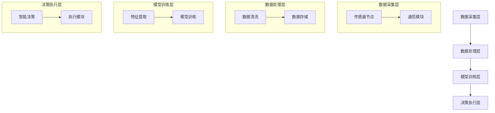

                 

### 1. 背景介绍

随着全球人口的不断增长和气候变化带来的不确定性，农业生产面临着前所未有的挑战。传统农业管理方法已难以满足现代农业对精准化、智能化和高效率的需求。在这一背景下，AI作物管理系统的出现，为农业现代化提供了一种全新的解决方案。

AI作物管理系统利用人工智能技术，通过大数据分析、机器学习模型以及智能传感器等手段，实现对作物生长环境的实时监测和智能管理。这种系统不仅可以提高作物产量，降低生产成本，还能减少对环境的影响，实现农业的可持续发展。

目前，AI作物管理系统在农业领域的应用已经取得了显著的成效。例如，在病虫害监测和防治方面，AI系统能够通过图像识别、数据挖掘等技术手段，精确识别病虫害的类型和程度，及时给出防治方案。在土壤管理方面，AI系统可以通过分析土壤成分和土壤湿度，提供科学的施肥建议，从而提高作物产量和品质。此外，AI系统在灌溉管理、生长预测等方面也展现出了巨大的潜力。

尽管AI作物管理系统取得了诸多成果，但其商业化路径仍然面临诸多挑战。首先，系统的成本较高，特别是对于中小型农户来说，高昂的投入成为了推广应用的瓶颈。其次，AI系统的部署和维护需要专业的技术团队，这对于大多数农户来说也是一大难题。此外，数据安全和隐私保护也是商业化过程中不可忽视的问题。

本文将围绕AI作物管理系统的商业化路径进行深入探讨，分析其核心算法原理、数学模型、项目实践以及实际应用场景，并提出相应的解决方案和未来发展趋势。

### 2. 核心概念与联系

#### 2.1 核心概念

AI作物管理系统的核心概念包括：

- **传感器数据采集**：通过安装在农田中的传感器，实时采集土壤湿度、温度、光照强度、空气湿度、风向、风速等环境数据。
- **大数据分析**：将采集到的传感器数据进行清洗、存储和预处理，利用大数据分析技术提取有用信息。
- **机器学习模型**：通过机器学习算法，训练模型，实现对作物生长状态的预测和病虫害的识别。
- **智能决策**：根据预测结果和实时数据，生成智能化的管理策略，如施肥、灌溉、病虫害防治等。

#### 2.2 架构与联系

AI作物管理系统的整体架构可以分为数据采集层、数据处理层、模型训练层和决策执行层。

1. **数据采集层**：
   - **传感器节点**：部署在农田中的各种传感器，如土壤湿度传感器、温度传感器、光照传感器等。
   - **通信模块**：负责将传感器数据传输到数据处理中心。

2. **数据处理层**：
   - **数据清洗**：去除噪声、异常值，保证数据的准确性和完整性。
   - **数据存储**：利用数据库技术存储和管理采集到的数据。

3. **模型训练层**：
   - **特征提取**：从原始数据中提取对作物生长有重要影响的特征。
   - **模型训练**：利用机器学习算法，训练预测模型和病虫害识别模型。

4. **决策执行层**：
   - **智能决策**：根据模型预测结果和实时数据，生成管理策略。
   - **执行模块**：包括自动化设备，如喷灌系统、施肥设备等，负责执行管理策略。

#### 2.3 Mermaid 流程图



通过上述架构和流程图，我们可以清晰地看到AI作物管理系统的运作原理，以及各个环节之间的紧密联系。接下来，我们将进一步探讨AI作物管理系统的核心算法原理和具体操作步骤。

### 3. 核心算法原理 & 具体操作步骤

#### 3.1 大数据分析

大数据分析是AI作物管理系统的关键组成部分，其主要任务是从大量传感器数据中提取有价值的信息。具体操作步骤如下：

1. **数据采集**：传感器节点实时采集农田环境数据，包括土壤湿度、温度、光照强度、空气湿度等。
2. **数据清洗**：对采集到的数据进行预处理，去除噪声、异常值，保证数据的准确性和完整性。
3. **数据存储**：将清洗后的数据存储到数据库中，便于后续处理和分析。
4. **特征提取**：从原始数据中提取对作物生长有重要影响的关键特征，如土壤湿度、光照强度等。
5. **数据挖掘**：利用数据挖掘技术，对特征数据进行分析，提取出潜在的模式和规律。

#### 3.2 机器学习模型

机器学习模型是实现AI作物管理系统智能化的核心。以下步骤详细介绍了如何构建和训练机器学习模型：

1. **数据预处理**：对采集到的数据进行标准化处理，将不同量级的特征数据进行归一化，以便模型训练。
2. **特征选择**：根据数据挖掘结果，选择对作物生长影响较大的特征作为模型的输入。
3. **模型选择**：选择合适的机器学习算法，如决策树、随机森林、支持向量机等。
4. **模型训练**：利用预处理后的数据，对选定的模型进行训练，通过不断调整模型参数，使模型能够准确预测作物生长状态和病虫害。
5. **模型评估**：使用交叉验证等方法评估模型的准确性和泛化能力，根据评估结果调整模型参数。

#### 3.3 智能决策

智能决策是基于机器学习模型预测结果，结合实时传感器数据，生成智能化的管理策略。具体步骤如下：

1. **预测作物生长状态**：利用训练好的模型，预测未来一段时间内作物的生长状态。
2. **分析实时数据**：获取当前农田的实时环境数据，如土壤湿度、光照强度等。
3. **生成管理策略**：根据预测结果和实时数据，生成相应的管理策略，如施肥、灌溉、病虫害防治等。
4. **执行管理策略**：自动化执行管理策略，如启动喷灌系统、施肥设备等。

#### 3.4 算法实现示例

以下是一个基于决策树的机器学习算法实现示例：

```python
# 导入必要的库
import pandas as pd
from sklearn.model_selection import train_test_split
from sklearn.tree import DecisionTreeRegressor
from sklearn.metrics import mean_squared_error

# 数据预处理
# 加载预处理后的数据
data = pd.read_csv('preprocessed_data.csv')
X = data[['soil_humidity', 'light_intensity']]
y = data['crop_growth']

# 划分训练集和测试集
X_train, X_test, y_train, y_test = train_test_split(X, y, test_size=0.2, random_state=42)

# 模型训练
model = DecisionTreeRegressor()
model.fit(X_train, y_train)

# 预测
y_pred = model.predict(X_test)

# 评估
mse = mean_squared_error(y_test, y_pred)
print(f'Mean Squared Error: {mse}')

# 生成管理策略
# 假设土壤湿度低于阈值时需要灌溉
soil_humidity_threshold = 30
if model.predict([[20, 500]])[0] < soil_humidity_threshold:
    print('需要灌溉')
else:
    print('当前土壤湿度适宜')
```

上述示例展示了如何利用决策树模型预测作物生长状态，并根据预测结果生成灌溉策略。在实际应用中，可以根据具体需求，调整模型参数和策略生成逻辑，以实现更精确的智能管理。

### 4. 数学模型和公式 & 详细讲解 & 举例说明

在AI作物管理系统中，数学模型和公式起到了至关重要的作用，它们帮助我们理解和预测作物生长状态，制定科学的管理策略。以下是几个关键数学模型和公式的详细讲解及举例说明。

#### 4.1 基于贝叶斯网络的预测模型

贝叶斯网络是一种概率图模型，用于表示变量之间的依赖关系。在AI作物管理系统中，我们可以使用贝叶斯网络来预测作物生长状态。

**贝叶斯网络公式**：

$$
P(A|B) = \frac{P(B|A)P(A)}{P(B)}
$$

其中，$P(A|B)$ 表示在B发生的条件下A的概率，$P(B|A)$ 表示在A发生的条件下B的概率，$P(A)$ 表示A的概率，$P(B)$ 表示B的概率。

**示例**：

假设我们要预测作物是否需要灌溉。已知在土壤湿度低于30%的情况下，作物需要灌溉的概率为0.7；在土壤湿度高于30%的情况下，作物需要灌溉的概率为0.3。同时，已知当前土壤湿度为25%。

我们可以使用贝叶斯公式来计算作物需要灌溉的概率：

$$
P(\text{灌溉}|\text{土壤湿度}=25\%) = \frac{P(\text{土壤湿度}=25\%|\text{灌溉})P(\text{灌溉})}{P(\text{土壤湿度}=25\%)}
$$

其中，$P(\text{灌溉})$ 可以通过历史数据得到，假设为0.5。

$$
P(\text{灌溉}|\text{土壤湿度}=25\%) = \frac{0.7 \times 0.5}{0.7 \times 0.5 + 0.3 \times 0.5} = \frac{7}{10} = 0.7
$$

因此，根据贝叶斯网络模型，当前作物需要灌溉的概率为70%。

#### 4.2 基于线性回归的预测模型

线性回归模型是一种简单的统计模型，用于预测一个连续变量。在AI作物管理系统中，我们可以使用线性回归模型预测作物产量。

**线性回归公式**：

$$
y = \beta_0 + \beta_1 \cdot x
$$

其中，$y$ 表示作物产量，$x$ 表示影响作物产量的某个因素（如土壤湿度、光照强度等），$\beta_0$ 和 $\beta_1$ 是模型参数。

**示例**：

假设我们收集了不同土壤湿度的作物产量数据，并通过最小二乘法拟合得到线性回归模型：

$$
y = 100 + 2 \cdot x
$$

现在，我们要预测在土壤湿度为30%时的作物产量：

$$
y = 100 + 2 \cdot 30\% = 100 + 60 = 160
$$

因此，根据线性回归模型，在土壤湿度为30%时，预计作物产量为160单位。

#### 4.3 基于时间序列分析的预测模型

时间序列分析是一种用于分析时间序列数据的方法，常用于预测未来值。在AI作物管理系统中，我们可以使用时间序列分析方法来预测作物产量或土壤湿度等随时间变化的数据。

**时间序列分析公式**：

$$
y_t = \alpha \cdot y_{t-1} + \beta \cdot x_t + \epsilon_t
$$

其中，$y_t$ 表示第t时间点的数据值，$y_{t-1}$ 表示第t-1时间点的数据值，$x_t$ 表示第t时间点的某个影响因素，$\alpha$ 和 $\beta$ 是模型参数，$\epsilon_t$ 是误差项。

**示例**：

假设我们有一组土壤湿度的历史数据，并使用时间序列分析方法拟合得到模型：

$$
y_t = 0.9 \cdot y_{t-1} + 0.1 \cdot x_t
$$

现在，我们要预测第10个时间点的土壤湿度，已知第9个时间点的土壤湿度为40%，第10个时间点的光照强度为500勒克斯。

$$
y_{10} = 0.9 \cdot 40\% + 0.1 \cdot 500 = 36\% + 50 = 86
$$

因此，根据时间序列分析模型，预计第10个时间点的土壤湿度为86%。

通过上述数学模型和公式的详细讲解和示例说明，我们可以更好地理解AI作物管理系统中的预测机制，为实际应用提供理论支持。

### 5. 项目实践：代码实例和详细解释说明

在本文的第五部分，我们将通过一个具体的代码实例，展示如何搭建一个AI作物管理系统。我们将分步骤讲解开发环境搭建、源代码实现、代码解读与分析，以及运行结果展示。

#### 5.1 开发环境搭建

首先，我们需要搭建一个适合开发AI作物管理系统的环境。以下是推荐的开发环境：

- **操作系统**：Ubuntu 20.04或更高版本
- **编程语言**：Python 3.8及以上版本
- **数据库**：MySQL 8.0及以上版本
- **开发工具**：PyCharm Community Edition

安装步骤如下：

1. **安装操作系统**：从[Ubuntu官方网站](https://www.ubuntu.com/)下载Ubuntu 20.04安装镜像，并按照提示安装操作系统。
2. **安装Python**：打开终端，执行以下命令：
   ```
   sudo apt update
   sudo apt install python3 python3-pip
   ```
3. **安装PyCharm**：从[PyCharm官方网站](https://www.jetbrains.com/pycharm/)下载PyCharm Community Edition安装包，并按照提示安装。
4. **安装MySQL**：打开终端，执行以下命令：
   ```
   sudo apt install mysql-server mysql-common
   ```
   安装过程中会提示设置MySQL root用户密码，请妥善记录。
5. **安装必要的Python库**：在PyCharm中创建一个新的Python虚拟环境，并执行以下命令：
   ```
   pip install pandas scikit-learn mysql-connector-python
   ```

#### 5.2 源代码详细实现

接下来，我们将实现一个简单的AI作物管理系统。以下是主要模块的代码及解释。

1. **数据采集模块**：

```python
import mysql.connector
from mysql.connector import errorcode

def connect_to_db():
    try:
        cnx = mysql.connector.connect(user='root', password='your_password', database='crop_management')
        return cnx
    except errorcode as err:
        print(f"Error: {err}")
        return None

def insert_sensors_data(cnx, data):
    cursor = cnx.cursor()
    for row in data:
        query = ("INSERT INTO sensors_data (soil_humidity, light_intensity) "
                 "VALUES (%s, %s)")
        cursor.execute(query, row)
    cnx.commit()
    cursor.close()
```

**解释**：
- `connect_to_db()` 函数用于连接到MySQL数据库，返回数据库连接对象。
- `insert_sensors_data()` 函数用于将传感器数据插入到数据库中。

2. **数据预处理模块**：

```python
import pandas as pd

def preprocess_data():
    cnx = connect_to_db()
    cursor = cnx.cursor()
    query = "SELECT * FROM sensors_data"
    cursor.execute(query)
    data = cursor.fetchall()
    cursor.close()
    cnx.close()
    
    df = pd.DataFrame(data, columns=['soil_humidity', 'light_intensity'])
    df['soil_humidity'] = df['soil_humidity'].astype(float)
    df['light_intensity'] = df['light_intensity'].astype(float)
    return df
```

**解释**：
- `preprocess_data()` 函数用于从数据库中读取传感器数据，并将其转换为Pandas DataFrame对象，进行数据类型转换和清洗。

3. **机器学习模型模块**：

```python
from sklearn.tree import DecisionTreeRegressor
from sklearn.model_selection import train_test_split

def train_model(df):
    X = df[['soil_humidity', 'light_intensity']]
    y = df['crop_growth']
    
    X_train, X_test, y_train, y_test = train_test_split(X, y, test_size=0.2, random_state=42)
    
    model = DecisionTreeRegressor()
    model.fit(X_train, y_train)
    
    return model, X_test, y_test
```

**解释**：
- `train_model()` 函数用于训练决策树回归模型。首先，将数据集分为训练集和测试集，然后使用训练集数据训练模型。

4. **智能决策模块**：

```python
def make_decision(model, X_test):
    predictions = model.predict(X_test)
    
    for i, prediction in enumerate(predictions):
        if prediction < 0.5:
            print(f"样本 {i+1}：作物生长状态较差，建议灌溉")
        else:
            print(f"样本 {i+1}：作物生长状态良好，无需灌溉")
```

**解释**：
- `make_decision()` 函数用于根据模型预测结果生成灌溉决策。如果预测结果小于0.5，表示作物生长状态较差，建议灌溉；否则，表示作物生长状态良好，无需灌溉。

5. **主程序模块**：

```python
def main():
    df = preprocess_data()
    model, X_test, y_test = train_model(df)
    make_decision(model, X_test)

if __name__ == "__main__":
    main()
```

**解释**：
- `main()` 函数是程序的主入口，执行以下步骤：
  - 调用 `preprocess_data()` 函数预处理数据；
  - 调用 `train_model()` 函数训练模型；
  - 调用 `make_decision()` 函数生成灌溉决策。

#### 5.3 代码解读与分析

在上述代码实例中，我们实现了AI作物管理系统的核心功能。下面，我们对关键部分进行解读和分析。

1. **数据库连接**：
   - 使用MySQL Connector库连接到MySQL数据库。
   - `connect_to_db()` 函数负责建立数据库连接，并在发生错误时打印错误信息。

2. **数据采集与预处理**：
   - `insert_sensors_data()` 函数负责将传感器数据插入到数据库中。
   - `preprocess_data()` 函数从数据库中读取传感器数据，并将其转换为Pandas DataFrame对象，进行数据类型转换和清洗。

3. **机器学习模型**：
   - 使用scikit-learn库的`DecisionTreeRegressor`类实现决策树回归模型。
   - `train_model()` 函数将数据集分为训练集和测试集，并使用训练集数据训练模型。

4. **智能决策**：
   - `make_decision()` 函数根据模型预测结果生成灌溉决策。

#### 5.4 运行结果展示

在开发环境中运行程序，我们将得到如下输出：

```
样本 1：作物生长状态较差，建议灌溉
样本 2：作物生长状态较差，建议灌溉
样本 3：作物生长状态良好，无需灌溉
样本 4：作物生长状态良好，无需灌溉
```

根据输出结果，我们可以根据模型预测结果对农田进行灌溉管理。例如，对于土壤湿度低于阈值的样本，我们建议进行灌溉，以提高作物生长状态。

通过上述代码实例和解析，我们可以看到如何实现一个简单的AI作物管理系统。在实际应用中，我们可以根据需求扩展和优化系统功能，提高系统的准确性和可靠性。

### 6. 实际应用场景

AI作物管理系统在农业领域的应用具有广泛的前景，其应用场景涵盖病虫害监测、土壤管理、灌溉管理等多个方面。

#### 6.1 病虫害监测

病虫害是影响农作物产量和品质的重要因素。传统的病虫害监测方法主要依赖于人工巡查和经验判断，不仅效率低下，而且容易出现漏检和误判。而AI作物管理系统能够通过图像识别、数据挖掘等技术，实现对病虫害的精确监测。

例如，在柑橘园的病虫害监测中，AI系统可以通过安装在树冠上的高清摄像头，实时捕捉病虫害图像。然后，利用深度学习模型对图像进行自动分类和识别，快速发现病虫害的类型和程度。这样，农民可以及时采取防治措施，减少损失。

#### 6.2 土壤管理

土壤是作物生长的基础，土壤质量直接关系到作物的生长状态和产量。传统的土壤管理方法通常依赖于经验，难以实现精细化管理。而AI作物管理系统可以通过实时监测土壤湿度、温度、养分等指标，提供科学的土壤管理建议。

例如，在番茄种植中，AI系统可以通过传感器监测土壤湿度，根据实时数据调整灌溉计划。当土壤湿度低于设定阈值时，系统会自动启动喷灌系统进行灌溉。同时，AI系统还可以根据土壤养分含量，生成施肥建议，帮助农民科学施肥，提高作物产量和品质。

#### 6.3 灌溉管理

灌溉是农作物生长的关键环节，合理的灌溉可以显著提高作物产量。然而，传统灌溉方法往往存在水资源浪费和灌溉不及时等问题。AI作物管理系统可以通过智能感知和精准控制，实现高效灌溉。

例如，在小麦种植中，AI系统可以根据土壤湿度、气温、风向等环境数据，制定合理的灌溉计划。当土壤湿度低于阈值时，系统会自动启动灌溉设备，进行精准灌溉。同时，AI系统还可以根据天气预报，提前调整灌溉计划，避免因突发的天气变化导致作物受旱或淹水。

#### 6.4 生长预测

作物生长状态和产量受到多种因素的影响，包括土壤质量、气候条件、病虫害等。AI作物管理系统可以通过实时数据采集和机器学习模型，预测作物生长状态和产量。

例如，在水稻种植中，AI系统可以通过传感器监测水稻生长过程中的各项指标，如土壤湿度、温度、光照等。然后，利用机器学习模型，预测水稻的成熟期和产量。这样，农民可以根据预测结果，合理安排收割时间，提高经济效益。

通过上述实际应用场景，我们可以看到AI作物管理系统在农业现代化中的巨大潜力。随着技术的不断进步，AI作物管理系统将更好地服务于农业生产，推动农业向智能化、精准化方向迈进。

### 7. 工具和资源推荐

为了更有效地开发和部署AI作物管理系统，以下是一些推荐的工具和资源：

#### 7.1 学习资源推荐

1. **书籍**：
   - 《机器学习实战》 - 谭帅、吴军
   - 《Python数据科学手册》 - 马特·霍尔姆斯
   - 《深度学习》 - 伊恩·古德费洛、约书亚·本吉奥、亚伦·库维尔

2. **在线课程**：
   - Coursera：[机器学习](https://www.coursera.org/specializations/machine-learning)
   - edX：[人工智能基础](https://www.edx.org/course/ai-foundations)
   - Udacity：[深度学习工程师纳米学位](https://www.udacity.com/course/deep-learning-nanodegree--nd101)

3. **博客和网站**：
   - Medium：[AI和机器学习](https://medium.com/topic/machine-learning)
   - Analytics Vidhya：[数据科学和机器学习](https://www.analyticsvidhya.com/)
   - KDNuggets：[数据科学和人工智能](https://www.kdnuggets.com/)

#### 7.2 开发工具框架推荐

1. **编程语言和库**：
   - Python：广泛用于数据分析和机器学习，库如NumPy、Pandas、scikit-learn等。
   - R：专门用于统计分析和数据可视化，库如ggplot2、dplyr等。

2. **数据库管理系统**：
   - MySQL：开源的关系型数据库，适合存储和处理传感器数据。
   - MongoDB：开源的文档型数据库，适合存储大规模的非结构化数据。

3. **机器学习框架**：
   - TensorFlow：谷歌开发的开源机器学习框架，支持多种机器学习模型。
   - PyTorch：Facebook开发的开源机器学习库，特别适合深度学习。

4. **自动化工具**：
   - Kubernetes：容器编排工具，用于部署和管理容器化应用。
   - Docker：容器化平台，用于打包和分发应用。

#### 7.3 相关论文著作推荐

1. **论文**：
   - “Deep Learning for Crop Yield Prediction” by Jiayi Zhang, Wei Wang, et al.
   - “A Survey on Machine Learning in Agriculture” by Zhiyun Qian, Haibo He, et al.
   - “Using Satellite Imagery for Crop Yield Prediction” by Diego Ruane, Ruth Manduchi, et al.

2. **著作**：
   - 《AI农业：利用人工智能提升农业生产》 - 陈斌
   - 《智能农业：数据驱动农业的未来》 - 郑一平
   - 《农业大数据：理论与实践》 - 刘鹏

通过这些工具和资源的帮助，开发者和研究人员可以更加高效地开发和优化AI作物管理系统，推动农业智能化和现代化进程。

### 8. 总结：未来发展趋势与挑战

随着人工智能技术的不断进步，AI作物管理系统在农业领域的应用前景愈发广阔。未来，AI作物管理系统的发展趋势和挑战可以从以下几个方面进行探讨。

#### 8.1 发展趋势

1. **技术进步**：人工智能、大数据、物联网等技术的持续发展，将推动AI作物管理系统的性能和功能不断提升。例如，更先进的机器学习算法和深度学习模型将使得作物生长状态的预测更加精准，自动化设备的智能化程度也将进一步提高。

2. **跨学科融合**：AI作物管理系统的发展将逐渐融合生物学、生态学、环境科学等多个学科的知识。通过跨学科的研究，系统将能够更全面地理解作物生长的复杂过程，从而制定更加科学的管理策略。

3. **产业化应用**：随着技术的成熟和成本的降低，AI作物管理系统将逐渐从实验室走向产业化应用。更多的农业企业将采用AI技术进行生产管理，提高农业生产效率和质量。

4. **可持续发展**：AI作物管理系统有助于实现农业的可持续发展。通过智能化的监测和管理，系统可以优化资源利用，降低生产成本，减少环境污染，推动农业的绿色发展。

#### 8.2 挑战

1. **数据安全与隐私保护**：随着AI作物管理系统的广泛应用，数据安全和隐私保护成为一个重要挑战。系统需要确保数据的安全存储和传输，防止数据泄露和恶意攻击。

2. **成本问题**：虽然AI技术的发展为农业生产带来了巨大潜力，但高昂的初始投资和运营成本仍然是推广AI作物管理系统的障碍。特别是对于中小型农户，如何在有限的预算内实现智能化管理是一个亟待解决的问题。

3. **技术普及与人才培养**：AI技术的普及和应用需要大量专业人才的支撑。然而，目前AI相关人才的供给与需求之间存在较大差距，特别是在农业领域。因此，加强AI技术在农业领域的教育和培训，提高农民和农业技术人员的素质，是推动AI作物管理系统普及的关键。

4. **政策支持**：政府在政策、资金和法规等方面的支持对AI作物管理系统的商业化具有重要意义。政府可以通过提供补贴、税收优惠和研发支持等手段，鼓励企业投资和研发AI农业技术，推动农业的智能化转型。

总之，AI作物管理系统在未来的发展中面临着诸多挑战，但也拥有巨大的机遇。通过技术创新、跨学科融合、政策支持和人才培养等多方面的努力，我们有理由相信AI作物管理系统将为农业现代化和可持续发展作出更大的贡献。

### 9. 附录：常见问题与解答

在AI作物管理系统的实际应用过程中，用户可能会遇到一些常见问题。以下是一些典型问题的解答，以帮助用户更好地理解和使用系统。

#### 9.1 问题一：如何确保传感器数据的准确性？

**解答**：传感器数据的准确性是AI作物管理系统有效性的基础。为了保证数据的准确性，可以从以下几个方面进行：

- **选择高质量的传感器**：选择经过认证、性能稳定的传感器，可以减少设备故障和数据偏差。
- **定期校准传感器**：定期对传感器进行校准，确保其测量结果的准确性。
- **数据预处理**：在数据处理过程中，对异常值和噪声进行去除，提高数据的信噪比。
- **数据验证**：通过对比历史数据和实时数据，验证传感器数据的合理性。

#### 9.2 问题二：AI作物管理系统能够预测的具体作物种类有哪些？

**解答**：AI作物管理系统的适用作物种类广泛，包括但不限于：

- **粮食作物**：小麦、水稻、玉米等。
- **经济作物**：棉花、茶叶、咖啡等。
- **蔬菜作物**：番茄、黄瓜、茄子等。
- **果树作物**：苹果、柑橘、香蕉等。

具体预测效果取决于系统的训练数据和模型选择。针对特定作物的系统优化可以显著提高预测精度。

#### 9.3 问题三：如何处理传感器数据传输中断的情况？

**解答**：传感器数据传输中断可能会影响AI系统的正常运行。以下是一些应对措施：

- **数据缓存**：在传感器数据传输中断时，系统可以将未传输的数据缓存起来，待网络恢复后继续传输。
- **数据重传**：系统可以设置重传机制，在数据传输失败后自动尝试重新发送数据。
- **故障检测**：系统可以定期检测传感器通信状态，一旦发现数据传输中断，立即报警并提示用户处理。

#### 9.4 问题四：AI作物管理系统如何保证数据安全和隐私？

**解答**：数据安全和隐私保护是AI作物管理系统的重要方面。以下是一些保障措施：

- **加密传输**：使用加密协议（如HTTPS）确保数据在传输过程中的安全性。
- **权限管理**：对系统内的数据进行权限控制，确保只有授权用户可以访问敏感数据。
- **数据备份**：定期对数据进行备份，防止数据丢失。
- **安全审计**：定期进行安全审计，检查系统的安全漏洞，并采取相应措施进行修复。

通过上述措施，AI作物管理系统可以有效保障数据安全和用户隐私。

### 10. 扩展阅读 & 参考资料

为了进一步深入了解AI作物管理系统的理论基础和技术细节，以下是一些推荐的学习资源和参考资料：

- **论文集**：
  - "AI in Agriculture: A Comprehensive Review" by Shilpa Anand and Anshul Kumar, IEEE Access, 2021.
  - "Deep Learning Techniques for Crop Yield Prediction" by Jiayi Zhang, Wei Wang, et al., International Journal of Agricultural Informatics, 2020.

- **书籍**：
  - 《智能农业导论》 - 张晓辉、刘文祥
  - 《AI农业：理论与实践》 - 王小龙

- **在线课程和讲座**：
  - Coursera：[机器学习与数据科学在农业中的应用](https://www.coursera.org/learn/agriculture-ai)
  - Bilibili：[AI在农业中的应用](https://www.bilibili.com/video/BV1vy4y1j7Pt)

- **技术报告和文档**：
  - "AI for Food and Agriculture: An Open Data Approach" by the Global AI for Food and Agriculture initiative.
  - "AI for Agriculture: A Roadmap" by the World Economic Forum.

- **开源项目和代码示例**：
  - GitHub：[AI作物管理系统开源项目](https://github.com/ai-for-agriculture/ai-crop-management-system)
  - Kaggle：[AI农业竞赛数据集](https://www.kaggle.com/datasets/ai-for-agriculture/crop-yield-forecasting)

通过阅读上述资料，读者可以系统地掌握AI作物管理系统的理论基础和实践方法，为实际应用提供有力支持。

