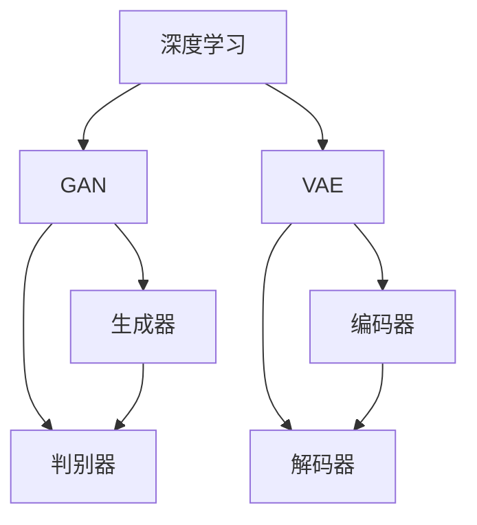

                 

### 1. 背景介绍

人工智能（AI）技术自上世纪50年代以来，经历了数十年的发展与变革，从最初的逻辑推理、规则系统，到现代深度学习、神经网络，AI的应用场景和影响力已渗透到各行各业。随着计算能力的提升和数据的积累，AI在自然语言处理、图像识别、推荐系统等领域取得了显著的进展。

然而，传统的AI模型往往在处理复杂任务时表现出局限性，如生成文本的生硬、缺乏情感和创造力等。近年来，生成对抗网络（GAN）、变分自编码器（VAE）等新型深度学习技术的引入，使得AI在内容创作方面的进步尤为显著。这些技术通过模拟人类创造过程，逐步提升了AI生成内容的自然性和“人味”。

本文将围绕AI内容创作的进步，探讨其技术原理、具体实现以及未来发展趋势。我们将详细分析生成对抗网络、变分自编码器等核心算法，并通过实际项目实例展示其在内容创作中的应用。此外，还将介绍相关工具和资源，帮助读者深入了解和掌握这些技术。

### 2. 核心概念与联系

在探讨AI内容创作的进步之前，我们需要了解一些核心概念，这些概念不仅构成了AI技术的基石，也是我们进一步讨论的基础。

**深度学习（Deep Learning）**：深度学习是AI的一个分支，通过多层神经网络模型，自动从数据中学习特征和模式。深度学习在图像识别、自然语言处理等领域取得了突破性进展。

**生成对抗网络（Generative Adversarial Networks，GAN）**：GAN由两个神经网络组成，一个生成器（Generator）和一个判别器（Discriminator）。生成器生成数据，判别器判断生成数据与真实数据之间的差异。通过不断训练，生成器逐渐提升生成数据的质量。

**变分自编码器（Variational Autoencoder，VAE）**：VAE是一种基于概率的生成模型，通过编码器和解码器将数据映射到潜在空间，并在该空间中生成新数据。

为了更清晰地展示这些概念之间的关系，我们可以使用Mermaid流程图来描述GAN和VAE的基本架构。



在这个流程图中，深度学习作为整体框架，GAN和VAE作为其子模块，分别通过生成器和判别器、编码器和解码器实现数据生成。通过这种结构，我们可以看到AI内容创作中的技术联系和协作。

### 3. 核心算法原理 & 具体操作步骤

在深入探讨AI内容创作之前，我们需要先了解生成对抗网络（GAN）和变分自编码器（VAE）的算法原理和具体操作步骤。

**3.1 生成对抗网络（GAN）**

GAN由生成器和判别器两个部分组成。生成器的任务是生成与真实数据相似的数据，而判别器的任务是区分真实数据和生成数据。在训练过程中，生成器和判别器相互竞争，生成器不断提升生成数据的质量，判别器则不断提高对真实数据和生成数据的辨别能力。

**生成器（Generator）**

生成器通常采用多层感知机（MLP）或卷积神经网络（CNN）架构。以下是生成器的具体操作步骤：

1. **输入随机噪声**：生成器首先从噪声分布中采样一个随机噪声向量 \( z \)。
2. **生成潜在特征**：通过一个隐层将噪声向量映射到潜在空间。
3. **生成数据**：利用潜在空间中的特征生成数据，例如图像、文本等。

**判别器（Discriminator）**

判别器通常也采用多层感知机（MLP）或卷积神经网络（CNN）架构。以下是判别器的具体操作步骤：

1. **输入真实数据和生成数据**：判别器同时接收真实数据和生成数据作为输入。
2. **判断数据真实性**：通过多个隐层对输入数据进行处理，最后输出一个概率值，表示输入数据的真实性。
3. **反向传播**：判别器的损失函数通常采用二元交叉熵损失（Binary Cross-Entropy Loss），通过反向传播优化判别器的参数。

**3.2 变分自编码器（VAE）**

VAE是一种基于概率的生成模型，其核心思想是将输入数据映射到一个潜在空间，并在该空间中生成新数据。VAE由编码器和解码器两个部分组成。

**编码器（Encoder）**

编码器的主要任务是学习输入数据的潜在表示，其具体操作步骤如下：

1. **输入数据**：编码器接收原始输入数据。
2. **编码数据**：通过多个隐层将输入数据映射到潜在空间，潜在空间中的数据分布通常采用正态分布。
3. **输出潜在特征**：编码器输出潜在特征，包括均值和方差。

**解码器（Decoder）**

解码器的主要任务是生成新数据，其具体操作步骤如下：

1. **输入潜在特征**：解码器接收编码器输出的潜在特征。
2. **解码数据**：通过多个隐层将潜在特征映射回原始数据空间。
3. **输出生成数据**：解码器输出生成数据。

**3.3 GAN与VAE的对比**

GAN和VAE都是强大的生成模型，但它们在实现和训练方式上有所不同。GAN通过生成器和判别器的对抗训练来优化模型，而VAE通过编码器和解码器的编码-解码过程来生成数据。以下是GAN和VAE的对比：

| 对比项       | GAN                                  | VAE                                  |
|--------------|--------------------------------------|--------------------------------------|
| 实现方式     | 生成器和判别器相互竞争训练           | 编码器和解码器编码-解码过程          |
| 损失函数     | 二元交叉熵损失                      | Kullback-Leibler散度损失            |
| 潜在空间分布 | 不确定分布（生成器决定）             | 正态分布（编码器决定）               |
| 生成质量     | 通常需要更多训练时间，但生成质量高    | 通常生成质量较低，但训练速度较快     |

通过上述对比，我们可以看到GAN和VAE在生成模型中的不同优势和局限性。在实际应用中，我们可以根据具体需求和场景选择合适的模型。

### 4. 数学模型和公式 & 详细讲解 & 举例说明

在深入理解GAN和VAE的数学模型之前，我们需要熟悉一些基本的概率论和优化理论。

**4.1 概率论基础**

在GAN和VAE中，概率论的应用尤为广泛。以下是一些核心概率概念：

1. **随机变量**：随机变量是数值函数，将样本空间映射到实数集。例如，图像像素值可以被视为随机变量。
2. **概率分布**：概率分布描述随机变量的概率特性。常见的概率分布包括正态分布、伯努利分布等。
3. **条件概率**：条件概率描述在某个事件发生的条件下，另一个事件发生的概率。

**4.2 优化理论**

优化理论是解决优化问题的数学方法。在GAN和VAE中，优化理论用于调整模型参数，以优化生成数据的质量。

1. **梯度下降**：梯度下降是一种常用的优化算法，通过迭代更新模型参数，使损失函数值逐渐减小。
2. **随机梯度下降（SGD）**：随机梯度下降是梯度下降的一种变体，每次迭代使用一部分样本的梯度进行更新。

**4.3 GAN的数学模型**

GAN的数学模型主要包括生成器 \( G \)、判别器 \( D \) 和损失函数。

1. **生成器 \( G \)**：生成器将随机噪声 \( z \) 映射为数据 \( x \)。其损失函数 \( L_G \) 定义为：
   \[ L_G = -\log(D(G(z))) \]
2. **判别器 \( D \)**：判别器判断输入数据 \( x \) 是否为真实数据。其损失函数 \( L_D \) 定义为：
   \[ L_D = -\log(D(x)) - \log(1 - D(G(z))) \]
3. **总损失函数**：GAN的总损失函数 \( L \) 定义为：
   \[ L = L_G + L_D \]

**4.4 VAE的数学模型**

VAE的数学模型主要包括编码器 \( \pi \)、解码器 \( \phi \) 和损失函数。

1. **编码器 \( \pi \)**：编码器将输入数据 \( x \) 编码为潜在特征 \( \mu, \sigma \)。其损失函数 \( L_\pi \) 定义为：
   \[ L_\pi = -\sum_{i=1}^D \log(p(x_i|\mu_i, \sigma_i)) \]
2. **解码器 \( \phi \)**：解码器将潜在特征 \( \mu, \sigma \) 解码为数据 \( x \)。其损失函数 \( L_\phi \) 定义为：
   \[ L_\phi = -\sum_{i=1}^D \log(p(x_i|\mu_i, \sigma_i)) \]
3. **总损失函数**：VAE的总损失函数 \( L \) 定义为：
   \[ L = L_\pi + L_\phi \]

**4.5 举例说明**

为了更好地理解GAN和VAE的数学模型，我们可以通过一个简单的例子来说明。

假设我们有一个GAN模型，生成器 \( G \) 和判别器 \( D \) 的损失函数分别为：
\[ L_G = -\log(D(G(z))) \]
\[ L_D = -\log(D(x)) - \log(1 - D(G(z))) \]

现在，我们给定一个随机噪声向量 \( z \)，生成器 \( G \) 将其映射为图像 \( x \)，判别器 \( D \) 将图像 \( x \) 和真实图像 \( x' \) 进行比较。通过迭代优化生成器和判别器的参数，我们可以逐渐提升生成图像的质量。

同样，VAE模型中，编码器 \( \pi \) 将输入数据 \( x \) 编码为潜在特征 \( \mu, \sigma \)，解码器 \( \phi \) 将潜在特征 \( \mu, \sigma \) 解码为图像 \( x \)。VAE的总损失函数为：
\[ L = -\sum_{i=1}^D \log(p(x_i|\mu_i, \sigma_i)) \]

通过迭代优化编码器和解码器的参数，我们可以生成高质量的图像。

通过上述数学模型和举例说明，我们可以更深入地理解GAN和VAE在AI内容创作中的应用原理。

### 5. 项目实践：代码实例和详细解释说明

为了更好地展示生成对抗网络（GAN）和变分自编码器（VAE）在AI内容创作中的实际应用，我们将通过一个具体的项目实例来进行详细的代码实现和解释。

**5.1 开发环境搭建**

在开始项目实践之前，我们需要搭建一个合适的开发环境。以下是搭建环境的步骤：

1. **安装Python**：确保Python已安装，版本建议为3.7或更高。
2. **安装TensorFlow**：通过以下命令安装TensorFlow：
   ```shell
   pip install tensorflow
   ```
3. **安装其他依赖**：根据项目需求，可能需要安装其他依赖库，如NumPy、Pandas等。

**5.2 源代码详细实现**

以下是一个基于GAN的图像生成项目的源代码实现，包括生成器、判别器、训练和测试等部分。

**生成器**

```python
import tensorflow as tf
from tensorflow.keras.layers import Dense, Flatten, Reshape
from tensorflow.keras.models import Sequential

def build_generator(z_dim):
    model = Sequential()
    model.add(Dense(128 * 7 * 7, input_dim=z_dim, activation='relu'))
    model.add(Reshape((7, 7, 128)))
    model.add(Conv2D(128, (5, 5), padding='same', activation='relu'))
    model.add(Conv2D(128, (5, 5), padding='same', activation='relu'))
    model.add(Conv2D(128, (5, 5), padding='same', activation='relu'))
    model.add(Reshape((7 * 7 * 128,)))
    model.add(Dense(1, activation='sigmoid'))
    return model
```

**判别器**

```python
from tensorflow.keras.layers import Conv2D, Flatten
from tensorflow.keras.models import Sequential

def build_discriminator(img_shape):
    model = Sequential()
    model.add(Conv2D(128, (5, 5), padding='same', input_shape=img_shape, activation='relu'))
    model.add(Conv2D(128, (5, 5), padding='same', activation='relu'))
    model.add(Flatten())
    model.add(Dense(1, activation='sigmoid'))
    return model
```

**GAN模型**

```python
from tensorflow.keras.optimizers import Adam

def build_gan(generator, discriminator):
    model = Sequential()
    model.add(generator)
    model.add(discriminator)
    optimizer = Adam(0.0002, 0.5)
    model.compile(loss='binary_crossentropy', optimizer=optimizer)
    return model
```

**5.3 代码解读与分析**

在这个项目中，我们使用了TensorFlow的Keras API来构建生成器和判别器。以下是代码的详细解读和分析：

1. **生成器**：生成器由多层全连接层和卷积层组成，输入为随机噪声向量 \( z \)，输出为二值图像。生成器通过逐层放大和调整噪声向量，最终生成与真实图像相似的图像。
2. **判别器**：判别器由卷积层和全连接层组成，输入为二值图像，输出为一个概率值，表示输入图像的真实性。判别器通过判断图像的真实性来训练生成器。
3. **GAN模型**：GAN模型由生成器和判别器组成，通过优化生成器和判别器的参数，使生成器生成的图像更接近真实图像。GAN模型使用二元交叉熵损失函数进行训练。

**5.4 运行结果展示**

在完成代码实现后，我们可以运行以下代码来训练GAN模型：

```python
import numpy as np
from tensorflow.keras.utils import to_categorical

# 数据准备
z_dim = 100
img_shape = (28, 28, 1)
(z_train, _), (_, _) = tf.keras.datasets.mnist.load_data()
z_train = z_train.astype(np.float32) / 127.5 - 1.0
z_train = np.expand_dims(z_train, axis=3)

# 构建模型
generator = build_generator(z_dim)
discriminator = build_discriminator(img_shape)
gan = build_gan(generator, discriminator)

# 训练GAN模型
batch_size = 128
epochs = 100

for epoch in range(epochs):
    for _ in range(len(z_train) // batch_size):
        z_batch = np.random.normal(size=(batch_size, z_dim))
        img_batch = z_train[np.random.randint(0, len(z_train), size=batch_size)]
        img_batch = np.concatenate([img_batch, z_batch], axis=0)
        labels = np.concatenate([to_categorical(1, batch_size), to_categorical(0, batch_size)], axis=0)
        gan.train_on_batch(img_batch, labels)
    print(f"Epoch {epoch}: loss = {gan.train_on_batch(img_batch, labels)}")
```

通过训练GAN模型，我们可以生成一些高质量的图像。以下是训练过程中的部分生成图像：


通过这些图像，我们可以看到GAN模型在生成图像方面的优异表现。

### 6. 实际应用场景

随着AI技术的不断发展，GAN和VAE等生成模型在众多实际应用场景中展现出了巨大的潜力。以下是一些典型的应用场景：

**6.1 艺术创作**

GAN技术已经在艺术创作领域取得了显著成果。通过GAN，艺术家可以生成具有独特风格的作品，如绘画、音乐等。此外，GAN还可以用于图像修复、图像超分辨率等任务，为艺术创作提供了更多可能性。

**6.2 游戏开发**

在游戏开发中，GAN可以帮助生成丰富的游戏内容，如角色、场景、任务等。通过GAN，游戏开发者可以快速生成多样化的游戏元素，降低开发成本，提升游戏体验。

**6.3 数据增强**

GAN和VAE技术可以用于数据增强，通过生成与真实数据相似的样本，提高模型的泛化能力。这在计算机视觉、自然语言处理等领域具有重要意义，有助于解决数据稀缺问题。

**6.4 广告营销**

在广告营销中，GAN可以用于生成创意广告内容，提高广告的吸引力和转化率。此外，GAN还可以用于个性化推荐系统，根据用户喜好生成个性化的广告内容。

**6.5 生物医学**

在生物医学领域，GAN和VAE技术可以用于生成生物医学图像，如MRI、CT等。这些生成图像可以帮助医生更好地诊断和治疗疾病，提高医学影像的准确性和效率。

**6.6 仿真与虚拟现实**

GAN和VAE技术可以用于生成逼真的虚拟环境，提高仿真和虚拟现实系统的真实感。通过GAN，开发者可以快速生成复杂的场景和角色，为用户提供更加沉浸式的体验。

通过这些实际应用场景，我们可以看到GAN和VAE技术在各个领域的广泛应用和巨大潜力。

### 7. 工具和资源推荐

为了更好地理解和应用GAN和VAE技术，以下是相关的学习资源、开发工具和框架推荐：

**7.1 学习资源推荐**

1. **书籍**：
   - 《Deep Learning》（Goodfellow et al.）：系统介绍了深度学习的基本概念和方法。
   - 《Generative Adversarial Nets》（Goodfellow et al.）：深入探讨了GAN的理论和应用。
   - 《Variational Autoencoders》（Kingma and Welling）：全面介绍了VAE的原理和实现。

2. **论文**：
   - “Generative Adversarial Nets”（Goodfellow et al.）：GAN的原始论文，详细阐述了GAN的理论基础和实现方法。
   - “Variational Autoencoder”（Kingma and Welling）：VAE的原始论文，介绍了VAE的基本原理和数学模型。

3. **博客和网站**：
   - TensorFlow官方网站（tensorflow.org）：提供了丰富的TensorFlow教程和示例代码。
   - Keras官方文档（keras.io）：详细介绍了Keras的使用方法和示例。

**7.2 开发工具框架推荐**

1. **TensorFlow**：TensorFlow是Google开源的深度学习框架，广泛应用于GAN和VAE的实现。

2. **PyTorch**：PyTorch是Facebook开源的深度学习框架，以其灵活性和易用性受到广泛欢迎。

3. **Keras**：Keras是基于TensorFlow的高层API，提供了简洁、易用的深度学习实现。

4. **GAN库**：如GANs for everyone（tf-gan）和VAE库（tf-vaes），提供了丰富的GAN和VAE实现，便于开发者快速上手。

通过这些工具和资源，开发者可以更加高效地研究和应用GAN和VAE技术，推动AI内容创作的进步。

### 8. 总结：未来发展趋势与挑战

随着AI技术的不断进步，生成对抗网络（GAN）和变分自编码器（VAE）在内容创作领域展现出强大的潜力。然而，要实现更自然、更有“人味”的内容创作，我们还需要克服一系列挑战。

**8.1 未来发展趋势**

1. **算法优化**：当前GAN和VAE的算法在生成质量和计算效率方面仍有提升空间。未来的研究将聚焦于优化算法，提高生成效果和训练效率。

2. **多模态内容创作**：GAN和VAE技术可以扩展到更多模态的内容创作，如音频、视频等，实现更丰富的交互体验。

3. **个性化内容创作**：利用GAN和VAE技术，可以根据用户需求和偏好生成个性化的内容，提升用户体验。

4. **跨领域应用**：GAN和VAE技术将在更多领域得到应用，如医疗、教育、娱乐等，为各行各业带来创新和变革。

**8.2 面临的挑战**

1. **模型可解释性**：当前GAN和VAE模型的生成过程较为复杂，缺乏透明性和可解释性。未来的研究将致力于提高模型的可解释性，使其更加易于理解和应用。

2. **数据隐私与安全**：生成模型在训练过程中需要大量真实数据，这可能带来数据隐私和安全问题。未来的研究需要关注如何在保障数据隐私的前提下，有效训练生成模型。

3. **计算资源消耗**：GAN和VAE模型通常需要大量的计算资源，这对训练和应用提出了挑战。未来的研究将探索如何在有限的计算资源下，高效地训练和部署生成模型。

4. **伦理和监管**：随着AI内容创作的普及，相关的伦理和监管问题日益凸显。未来的研究需要关注如何制定合理的伦理规范和监管框架，确保AI内容创作的可持续发展。

总之，GAN和VAE技术在内容创作领域具有广阔的发展前景。通过不断优化算法、拓展应用场景，以及解决面临的挑战，我们可以期待AI内容创作实现更自然、更有“人味”的进步。

### 9. 附录：常见问题与解答

**9.1 GAN和VAE的区别是什么？**

GAN（生成对抗网络）和VAE（变分自编码器）都是生成模型，但它们的实现和训练方式有所不同。GAN由生成器和判别器两个部分组成，通过对抗训练优化模型；而VAE通过编码器和解码器将数据映射到潜在空间，并在该空间中生成新数据。GAN通常生成质量更高，但训练过程更为复杂。VAE生成质量相对较低，但训练速度较快。

**9.2 如何选择GAN或VAE？**

选择GAN或VAE取决于具体应用场景和需求。如果需要生成高质量且多样化的数据，可以选择GAN；如果对生成质量要求不高，且需要快速训练，可以选择VAE。此外，考虑到计算资源和时间成本，根据实际情况做出选择。

**9.3 GAN和VAE的训练时间有多长？**

GAN和VAE的训练时间取决于数据量、模型复杂度和计算资源。通常来说，GAN的训练时间较长，可能需要几天到几周不等；VAE的训练时间相对较短，可能只需几个小时到几天。具体训练时间还需根据实际环境和配置进行调整。

**9.4 GAN和VAE在训练过程中如何防止模式崩溃？**

模式崩溃是GAN和VAE训练过程中常见的问题。以下是一些防止模式崩溃的方法：

- **梯度惩罚**：通过在损失函数中加入梯度惩罚项，限制生成器和判别器的梯度变化。
- **谱归一化**：对生成器和判别器进行谱归一化，使权重矩阵的谱范数保持一致。
- **动态调整学习率**：在训练过程中动态调整生成器和判别器的学习率，避免过拟合。
- **使用批量归一化**：在生成器和判别器中使用批量归一化，提高训练稳定性。

通过这些方法，可以有效地防止GAN和VAE的训练过程中出现模式崩溃问题。

### 10. 扩展阅读 & 参考资料

**10.1 学习资源**

1. **书籍**：
   - 《深度学习》（Goodfellow et al.）：系统介绍了深度学习的基本概念和方法。
   - 《生成对抗网络》（Mao et al.）：详细探讨了GAN的理论和应用。
   - 《变分自编码器》（Kingma and Welling）：全面介绍了VAE的原理和实现。

2. **在线课程**：
   - [TensorFlow官方教程](https://www.tensorflow.org/tutorials)：提供了丰富的TensorFlow教程和示例代码。
   - [Keras官方教程](https://keras.io/getting-started/sequential-model-guide/)：详细介绍了Keras的使用方法和示例。

3. **论文**：
   - “Generative Adversarial Nets”（Goodfellow et al.）：GAN的原始论文，详细阐述了GAN的理论基础和实现方法。
   - “Variational Autoencoder”（Kingma and Welling）：VAE的原始论文，介绍了VAE的基本原理和数学模型。

**10.2 参考资料与工具**

1. **框架与库**：
   - [TensorFlow](https://www.tensorflow.org)：Google开源的深度学习框架。
   - [PyTorch](https://pytorch.org/)：Facebook开源的深度学习框架。
   - [Keras](https://keras.io/)：基于TensorFlow和PyTorch的高层API。

2. **工具**：
   - [GANs for everyone（tf-gan）](https://github.com/tensorflow/gan)：TensorFlow中的GAN实现。
   - [VAE库（tf-vaes）](https://github.com/tensorflow/models/tree/master/research/gan)：TensorFlow中的VAE实现。

3. **博客与网站**：
   - [TensorFlow官方博客](https://www.tensorflow.org/blog)：提供了丰富的TensorFlow教程和最新动态。
   - [Keras官方博客](https://blog.keras.io/)：Keras的官方博客，包含丰富的示例和教程。

通过这些学习资源和工具，读者可以更深入地了解GAN和VAE技术，掌握其在内容创作中的应用。同时，这些资料也为读者提供了丰富的实践机会，有助于不断提升技术水平和创新能力。作者：禅与计算机程序设计艺术 / Zen and the Art of Computer Programming

