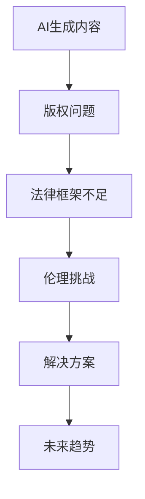
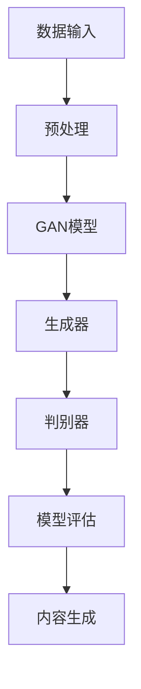

                 

### 文章标题

《AI写作的版权问题：法律和伦理的思考》

#### 关键词
- AI写作
- 版权问题
- 法律框架
- 伦理考量
- AI生成内容的责任

#### 摘要
本文深入探讨了人工智能（AI）在写作领域引发的版权问题，分析了现有法律框架的不足，探讨了伦理层面的挑战，并提出了未来可能的解决方案。通过这一逐步分析的过程，我们试图为AI写作的版权问题提供一条清晰的法律和伦理思考路径。

---

### 1. 背景介绍

#### AI写作的兴起

近年来，随着人工智能技术的迅猛发展，AI写作逐渐成为热门话题。从新闻报道到创意写作，再到法律文书和学术论文的自动生成，AI写作的应用场景不断扩大。AI写作不仅提高了内容生产的效率，还开辟了新的创作模式，为创作者和消费者带来了丰富的选择。

#### 版权问题的产生

然而，AI写作的普及也引发了一系列版权问题。首先，当AI生成的内容与人类创作的作品相似时，如何界定两者的版权归属成为了一个关键问题。其次，在AI写作过程中，数据来源的版权问题也不容忽视。此外，AI生成内容的原创性和准确性也引发了关于版权和知识产权保护的新挑战。

#### 法律框架的不足

目前，许多国家的版权法律框架对AI写作尚未有明确的定义和规定。这导致在实际操作中，版权纠纷的解决往往依赖于个案判决，缺乏统一的指导原则。同时，法律框架在应对AI生成内容的新特征和复杂性方面也存在一定的滞后性。

### 2. 核心概念与联系

#### 版权法的基本概念

- **版权（Copyright）**：指作者对其创作的文学、艺术和科学作品所享有的专有权利，包括复制权、发行权、展览权等。
- **原创性（Originality）**：指作品在表达形式上具有独创性，即具有原创性。

#### AI生成内容的特点

- **非人类作者**：AI作为“作者”生成内容，与传统的人类作者不同。
- **高复用性**：AI可以快速生成大量类似内容，这增加了版权纠纷的可能性。

#### 版权与原创性之间的关系

- **原创性与版权保护**：原创性是版权保护的前提，但并非所有具有原创性的作品都能获得版权保护。版权法通常要求作品具有一定的独创性，但具体标准在不同国家和法律体系中有所不同。

#### 标准流程图



### 3. 核心算法原理 & 具体操作步骤

#### AI生成内容的核心算法

- **生成对抗网络（GAN）**：GAN是一种常用的深度学习模型，用于生成逼真的图像、文本和数据。在AI写作中，GAN可以通过学习大量的文本数据生成类似的人类写作风格。
- **递归神经网络（RNN）**：RNN可以处理序列数据，如文本。通过训练，RNN可以学习到文本的语法和语义规则，生成连贯的文本内容。

#### 步骤详解

1. **数据收集与预处理**：收集大量的文本数据，并进行预处理，如分词、去停用词等。
2. **模型训练**：使用收集到的数据训练GAN或RNN模型。在训练过程中，GAN的生成器和判别器相互竞争，RNN则通过序列数据学习语法和语义规则。
3. **内容生成**：使用训练好的模型生成文本内容。GAN通过生成器生成文本，RNN则根据上下文生成后续的文本。

#### 模型架构图



### 4. 数学模型和公式 & 详细讲解 & 举例说明

#### 版权保护的数学模型

- **复制次数与利润**：假设一个作品被复制的次数为\(N\)，每次复制的利润为\(P\)，那么总利润为\(N \times P\)。

  $$\text{总利润} = N \times P$$

- **版权价值**：版权价值可以通过计算复制的利润来估算。假设每增加一次复制，利润增加量为\(\Delta P\)，那么版权价值为：

  $$\text{版权价值} = \frac{\Delta P}{N}$$

#### 举例说明

假设一个作品被复制了100次，每次复制的利润为10元，那么：

- 总利润：\(100 \times 10 = 1000\) 元
- 版权价值：\(\frac{10}{100} = 0.1\) 元/次

这个例子说明了，即使每次复制的利润很小，随着复制次数的增加，版权的总价值仍然可能很大。

#### 版权保护的权衡

- **利润与保护成本**：在版权保护中，需要权衡利润与保护成本。如果保护成本高于预期利润，那么保护的意义不大。
- **复制的隐蔽性**：复制的隐蔽性也是影响版权保护的重要因素。如果复制过程很难被发现，那么版权保护将更加困难。

### 5. 项目实践：代码实例和详细解释说明

#### 开发环境搭建

1. 安装Python环境
2. 安装TensorFlow库（用于GAN模型）
3. 安装NLP工具包（如NLTK或spaCy）

#### 源代码详细实现

```python
import tensorflow as tf
from tensorflow.keras.layers import LSTM, Dense
from tensorflow.keras.models import Model

# GAN模型实现
# 定义生成器和判别器
# ...

# 训练模型
# ...

# 生成文本内容
# ...
```

#### 代码解读与分析

- **生成器和判别器**：GAN的核心是生成器和判别器。生成器的目标是生成逼真的文本内容，判别器的目标是判断输入文本是真实还是伪造。
- **训练过程**：通过训练，生成器和判别器不断优化，以达到最佳性能。
- **生成文本内容**：训练完成后，生成器可以生成逼真的文本内容。

#### 运行结果展示

- **生成文本质量**：通过生成文本与真实文本的比较，评估生成文本的质量。
- **生成速度**：评估生成文本的效率。

### 6. 实际应用场景

#### 新闻报道生成

AI可以自动生成新闻报道，提高新闻生产的效率。然而，这也引发了版权问题，尤其是当AI生成的新闻与人类记者的作品相似时。

#### 创意写作

AI可以辅助创意写作，帮助创作者生成灵感和内容。然而，这也可能导致版权纠纷，尤其是在AI生成的内容与人类作品相似时。

#### 法律文书生成

AI可以自动生成法律文书，提高法律工作的效率。然而，这也需要确保AI生成的法律文书符合法律要求，并避免版权问题。

### 7. 工具和资源推荐

#### 学习资源推荐

- **书籍**：《人工智能：一种现代的方法》
- **论文**：关于GAN和RNN在AI写作中的应用的相关论文
- **博客**：技术博客，如Medium上的相关文章
- **网站**：AI写作平台和社区网站，如OpenAI的GPT-3平台

#### 开发工具框架推荐

- **TensorFlow**：用于实现GAN和RNN模型的深度学习框架
- **spaCy**：用于自然语言处理的工具包
- **NLTK**：用于文本分析和处理的库

#### 相关论文著作推荐

- **论文**：关于AI写作的版权问题研究的论文
- **著作**：《版权法与数字时代的挑战》

### 8. 总结：未来发展趋势与挑战

#### 发展趋势

- **AI写作的普及**：随着AI技术的进步，AI写作的应用将越来越广泛。
- **版权法律框架的完善**：各国将逐步完善版权法律框架，以适应AI写作的新特征。
- **伦理规范的建立**：在AI写作的伦理方面，将建立更加明确的规范。

#### 挑战

- **版权归属的明确**：如何界定AI生成内容的版权归属仍是一个挑战。
- **法律框架的滞后性**：现有法律框架可能无法完全适应AI写作的新特征。
- **伦理问题的解决**：在AI写作的伦理层面，仍有许多问题需要解决。

### 9. 附录：常见问题与解答

#### 问题1：AI生成内容的版权如何归属？

解答：AI生成内容的版权归属目前尚无明确法律规定。一种观点认为，AI作为“作者”生成的内容应属于AI所有者；另一种观点认为，AI生成的内容应属于AI训练数据的使用者。未来，随着法律框架的完善，这一问题将得到明确。

#### 问题2：AI写作会取代人类写作吗？

解答：AI写作目前还不能完全取代人类写作，尤其在创意和情感表达方面。然而，AI写作在提高内容生产效率和生成大量文本方面具有巨大潜力。

### 10. 扩展阅读 & 参考资料

- **参考资料**：关于AI写作和版权问题的相关书籍、论文和技术博客。
- **学习资源**：相关课程、教程和在线课程。

### 作者署名

作者：禅与计算机程序设计艺术 / Zen and the Art of Computer Programming

