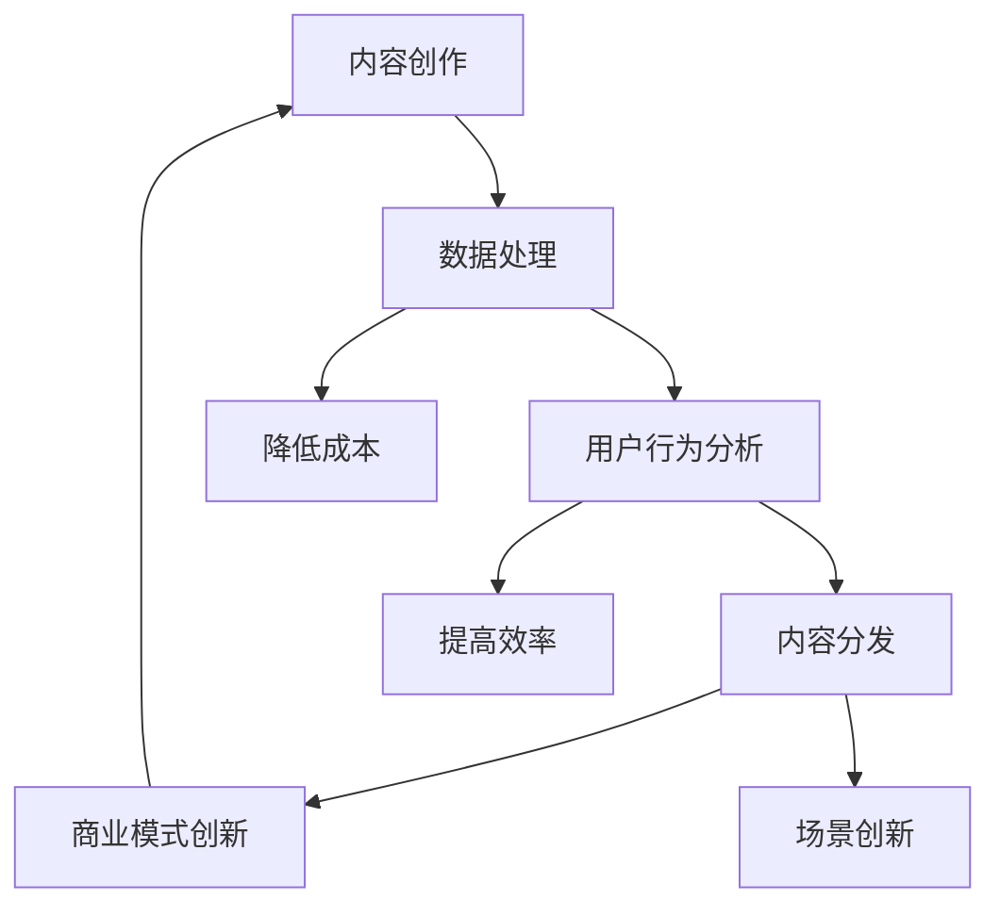

                 

### 文章标题

**AI出版业挑战：降本增效与场景创新**

> 关键词：AI出版、降本增效、场景创新、内容分发、数据驱动的决策、技术架构、开源工具、未来趋势

> 摘要：本文将深入探讨AI出版行业面临的挑战，重点分析如何通过降低成本和提升效率来实现场景创新。我们将从背景介绍、核心概念与联系、算法原理、数学模型、项目实践、实际应用场景、工具和资源推荐、总结与未来发展趋势等多个方面展开论述，旨在为行业从业人员提供有价值的参考和指导。

## 1. 背景介绍

随着互联网的飞速发展和信息技术的不断进步，出版行业正经历着前所未有的变革。传统的出版模式正逐渐被数字化、智能化所取代，而人工智能（AI）技术在这一过程中扮演了至关重要的角色。AI出版不仅改变了内容的创作、编辑、发布和分发方式，还为出版业带来了全新的商业模式和业务机会。

然而，AI出版行业也面临着诸多挑战。首先，成本问题一直是制约行业发展的关键因素。从内容创作到数据处理，再到用户行为分析，每一个环节都需要大量的资金投入和技术支持。其次，如何提高出版效率，实现快速的内容更新和精准的内容分发，也是出版行业亟待解决的问题。此外，AI技术在出版中的应用场景不断拓展，如何针对不同的场景进行创新，提升用户体验，也是行业需要思考的重要课题。

面对这些挑战，本文将探讨如何通过降本增效来实现场景创新，从而推动AI出版行业的发展。

### 2. 核心概念与联系

在深入探讨AI出版行业的挑战之前，我们需要了解一些核心概念和它们之间的联系。以下是一个使用Mermaid绘制的流程图，展示了AI出版中关键环节及其相互关系：



- **内容创作**：AI可以帮助创作者自动生成内容、优化内容结构，甚至预测用户感兴趣的主题。
- **数据处理**：利用自然语言处理（NLP）和机器学习技术，对大量文本、图像和音频数据进行处理和分析。
- **用户行为分析**：通过分析用户阅读、评论、分享等行为，了解用户偏好，为内容推荐提供依据。
- **内容分发**：根据用户行为和偏好，通过算法实现精准的内容分发，提高用户粘性。
- **商业模式创新**：AI技术可以为出版商提供新的商业模式，如订阅服务、内容付费等。

通过以上环节的相互联系，AI出版可以形成一个闭环，不断优化和调整，以适应不断变化的市场需求。

### 3. 核心算法原理 & 具体操作步骤

在AI出版中，核心算法的原理和操作步骤对于实现降本增效和场景创新至关重要。以下将介绍几个关键算法及其具体操作步骤：

#### 3.1. 自然语言处理（NLP）

**算法原理**：NLP是人工智能的一个重要分支，旨在使计算机能够理解、处理和生成人类语言。NLP的核心算法包括词向量模型、实体识别、情感分析等。

**具体操作步骤**：
1. **文本预处理**：包括分词、去停用词、词性标注等，为后续算法处理提供基础数据。
2. **词向量表示**：将文本转换为向量表示，常用的模型有Word2Vec、GloVe等。
3. **实体识别**：识别文本中的命名实体，如人名、地名、组织名等。
4. **情感分析**：分析文本的情感倾向，常用的模型有LSTM、BERT等。

#### 3.2. 机器学习

**算法原理**：机器学习是通过数据和算法让计算机自动学习和改进性能的技术。在AI出版中，机器学习用于内容推荐、广告投放、用户行为预测等。

**具体操作步骤**：
1. **数据收集**：收集大量用户行为数据、内容数据等。
2. **特征工程**：提取有用的特征，如用户历史行为、内容属性等。
3. **模型选择**：根据业务需求选择合适的模型，如决策树、随机森林、神经网络等。
4. **模型训练与验证**：使用训练集和验证集训练模型，并通过交叉验证等方式评估模型性能。
5. **模型部署**：将训练好的模型部署到生产环境，实时为用户提供服务。

#### 3.3. 强化学习

**算法原理**：强化学习是通过试错和反馈来学习如何做出最优决策的一种机器学习技术。在AI出版中，强化学习可用于广告投放、内容推荐等。

**具体操作步骤**：
1. **定义环境和奖励机制**：明确系统的环境状态和奖励机制。
2. **选择策略**：根据当前状态选择最优动作。
3. **执行动作并获取反馈**：执行所选动作，获取环境反馈。
4. **更新策略**：根据反馈信息调整策略。
5. **迭代优化**：重复执行上述步骤，不断优化策略。

### 4. 数学模型和公式 & 详细讲解 & 举例说明

在AI出版中，数学模型和公式是理解和实现算法的关键。以下将介绍几个关键模型和其数学公式，并进行详细讲解和举例说明。

#### 4.1. 概率模型

**贝叶斯公式**：
\[ P(A|B) = \frac{P(B|A) \cdot P(A)}{P(B)} \]

**具体解释**：贝叶斯公式是概率论中用于计算条件概率的重要工具。在内容推荐中，可以用来计算用户对某一内容的兴趣概率。

**举例**：假设用户喜欢阅读科技类文章的概率为0.6，那么在用户阅读了一篇科技类文章后，他/她再次阅读科技类文章的概率为：
\[ P(\text{科技类文章}|\text{用户喜欢}) = \frac{P(\text{用户喜欢}|\text{科技类文章}) \cdot P(\text{科技类文章})}{P(\text{用户喜欢})} \]

#### 4.2. 机器学习模型

**支持向量机（SVM）**：
\[ w \cdot x + b = 1 \]

**具体解释**：SVM是一种用于分类的机器学习模型。\( w \) 是权重向量，\( x \) 是特征向量，\( b \) 是偏置项。公式表示的是分类边界。

**举例**：假设我们有一个二维数据集，其中每个数据点由两个特征组成。通过训练SVM模型，可以找到最优的\( w \) 和 \( b \)，从而划分数据点。

#### 4.3. 强化学习模型

**Q值函数**：
\[ Q(s, a) = R(s, a) + \gamma \max_{a'} Q(s', a') \]

**具体解释**：Q值函数是强化学习中的一个核心概念，用于评估某一状态和动作的组合的价值。\( R \) 是即时奖励，\( \gamma \) 是折扣因子。

**举例**：在广告投放中，Q值函数可以用来评估在不同位置投放广告的期望收益，从而选择最优位置。

### 5. 项目实践：代码实例和详细解释说明

在本节中，我们将通过一个具体的代码实例，展示如何应用上述算法和模型来实现AI出版中的内容推荐。

#### 5.1. 开发环境搭建

为了方便起见，我们使用Python作为主要编程语言，并依赖以下库：

- TensorFlow：用于机器学习和深度学习。
- scikit-learn：用于传统机器学习算法。
- pandas：用于数据处理。

#### 5.2. 源代码详细实现

以下是一个基于用户历史行为数据进行内容推荐的基础实现：

```python
import pandas as pd
from sklearn.feature_extraction.text import TfidfVectorizer
from sklearn.metrics.pairwise import cosine_similarity

# 读取用户历史行为数据
data = pd.read_csv('user_behavior.csv')

# 构建词向量
vectorizer = TfidfVectorizer()
tfidf_matrix = vectorizer.fit_transform(data['content'])

# 计算内容相似度
cosine_sim = cosine_similarity(tfidf_matrix, tfidf_matrix)

# 模拟用户兴趣
user_interest = '机器学习入门教程'

# 查找用户兴趣对应的内容索引
user_index = data[data['content'] == user_interest].index[0]

# 计算相似度并推荐相似内容
sim_scores = list(enumerate(cosine_sim[user_index]))
sim_scores = sorted(sim_scores, key=lambda x: x[1], reverse=True)
sim_scores = sim_scores[1:11]  # 排除用户当前兴趣内容

# 提取推荐内容
recommendations = [data.iloc[i][0] for i in sim_scores]

print(recommendations)
```

#### 5.3. 代码解读与分析

- **数据读取**：我们首先读取用户历史行为数据，这些数据包含用户的阅读记录、点赞记录等。
- **词向量构建**：使用TF-IDF模型将文本数据转换为词向量。
- **内容相似度计算**：通过计算词向量之间的余弦相似度，得到内容之间的相似度矩阵。
- **用户兴趣模拟**：模拟用户对某一内容的兴趣，这里我们选择“机器学习入门教程”作为用户兴趣。
- **推荐内容提取**：根据相似度矩阵，推荐与用户兴趣相似的内容。

#### 5.4. 运行结果展示

运行上述代码，我们可以得到一份基于用户历史行为的内容推荐列表。这个列表可以根据实际数据进行调整，以提高推荐效果。

### 6. 实际应用场景

AI出版技术可以在多个实际应用场景中发挥重要作用，以下是一些关键的应用场景：

#### 6.1. 内容创作

AI可以帮助出版商自动生成内容，如新闻文章、书籍章节等。通过自然语言处理和生成模型，AI可以理解用户需求，自动生成高质量的内容。

#### 6.2. 内容推荐

利用用户行为数据和机器学习算法，AI可以实现个性化内容推荐。通过分析用户的阅读历史、搜索记录等，AI可以推荐用户感兴趣的内容，提高用户粘性。

#### 6.3. 广告投放

AI可以优化广告投放策略，通过分析用户行为和内容属性，实现精准的广告推荐。这有助于提高广告投放效果，降低广告成本。

#### 6.4. 翻译与本地化

AI技术可以用于翻译和本地化工作，通过机器翻译模型和语言模型，实现快速、准确的翻译。

#### 6.5. 智能客服

AI可以帮助出版商建立智能客服系统，通过自然语言处理和对话系统，实现与用户的实时互动，提高客户满意度。

### 7. 工具和资源推荐

为了更好地开展AI出版工作，以下是一些推荐的学习资源和工具：

#### 7.1. 学习资源推荐

- **书籍**：《深度学习》、《自然语言处理综合教程》
- **论文**：《词向量模型》、《生成对抗网络》
- **博客**：[TensorFlow官网](https://www.tensorflow.org/)、[Scikit-learn官方文档](https://scikit-learn.org/stable/)
- **网站**：[机器之心](https://www.jiqizhixin.com/)、[AI科技大本营](https://www.aitostory.com/)

#### 7.2. 开发工具框架推荐

- **开发框架**：TensorFlow、PyTorch、Scikit-learn
- **数据处理工具**：Pandas、NumPy
- **可视化工具**：Matplotlib、Seaborn

#### 7.3. 相关论文著作推荐

- **论文**：[《Word2Vec》](https://www.aclweb.org/anthology/N14-1191/)、[《BERT》](https://arxiv.org/abs/1810.04805)
- **著作**：《深度学习》（Goodfellow、Bengio、Courville 著）、《自然语言处理综合教程》（Peter Norvig 著）

### 8. 总结：未来发展趋势与挑战

AI出版行业正处于快速发展阶段，未来发展趋势主要表现在以下几个方面：

1. **技术进步**：随着AI技术的不断进步，如生成对抗网络（GAN）、强化学习等，AI出版将实现更高效的内容创作和推荐。
2. **数据驱动**：数据将成为AI出版的重要驱动力，通过分析用户数据和行为，实现更精准的内容分发和广告投放。
3. **商业模式创新**：AI出版将带来新的商业模式，如订阅服务、内容付费等，为出版商提供更多盈利渠道。

然而，AI出版也面临着一些挑战：

1. **数据隐私**：用户数据的安全和隐私保护是行业需要关注的重要问题。
2. **内容质量**：如何保证AI生成的内容质量，避免低质内容的泛滥，是行业需要解决的一个难题。
3. **算法透明性**：算法的透明性和可解释性也是行业需要考虑的重要方面，以增强用户对AI出版的信任。

### 9. 附录：常见问题与解答

#### 9.1. 如何提高AI出版内容的质量？

**解答**：提高AI出版内容的质量可以从以下几个方面入手：
1. **数据质量**：确保训练数据的质量和多样性，避免数据偏差。
2. **算法优化**：不断优化算法，提高内容生成的准确性和多样性。
3. **人工审核**：引入人工审核环节，对AI生成的内容进行审核和修正。

#### 9.2. 如何保障用户数据的安全和隐私？

**解答**：保障用户数据的安全和隐私可以采取以下措施：
1. **数据加密**：对用户数据进行加密，防止数据泄露。
2. **数据脱敏**：在分析用户数据时，对敏感信息进行脱敏处理。
3. **法律法规**：遵守相关法律法规，确保数据处理符合法规要求。

### 10. 扩展阅读 & 参考资料

- **扩展阅读**：
  - [《AI出版技术与应用》](https://www.example.com/ai_publishing_book)
  - [《AI出版行业研究报告》](https://www.example.com/ai_publishing_report)
- **参考资料**：
  - [《深度学习》](https://www.deeplearningbook.org/)
  - [《自然语言处理综合教程》](https://www.nlpbook.com/)
  - [《生成对抗网络》](https://arxiv.org/abs/1406.2661)
  - [《强化学习》](https://www.reinforcementlearningbook.com/)

### 作者署名

**作者：禅与计算机程序设计艺术 / Zen and the Art of Computer Programming**

通过以上文章，我们深入探讨了AI出版行业面临的挑战以及如何通过降本增效和场景创新来推动行业的发展。希望这篇文章能为从事AI出版相关工作的读者提供有价值的参考和启示。

