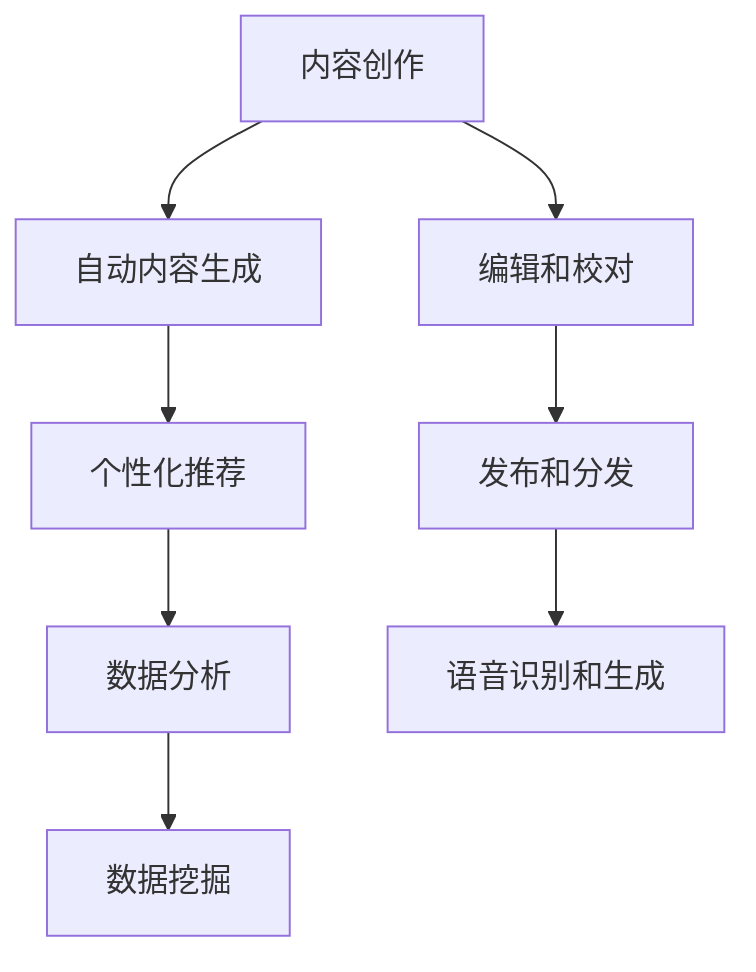

                 

 在当今数字化时代，人工智能（AI）正迅速改变着各个行业，出版业也不例外。本文将探讨AI在出版业中的最新动态，重点关注技术更新和场景驱动对出版业带来的变革。

## 1. 背景介绍

出版业是历史悠久且不断发展的行业，从传统的纸质书籍到电子书，再到近年来兴起的语音书籍，出版业一直在适应技术的变革。然而，随着AI技术的发展，出版业正迎来新的挑战和机遇。

AI技术，特别是机器学习和自然语言处理（NLP），正在改变内容创作、编辑、发布和分发的方式。从自动内容生成到个性化推荐，AI为出版业带来了前所未有的效率和可能性。

## 2. 核心概念与联系

为了更好地理解AI在出版业中的应用，我们需要了解几个核心概念：

### 自动内容生成（Automated Content Generation）

自动内容生成是指使用AI技术自动生成文章、博客、新闻报道等内容。这一技术利用自然语言处理算法和大数据分析，从现有的文本数据中提取信息，并生成新的内容。

### 个性化推荐（Personalized Recommendation）

个性化推荐是基于用户的兴趣和行为数据，使用机器学习算法为用户推荐相关的书籍、文章和其他内容。

### 语音识别和生成（Voice Recognition and Generation）

语音识别和生成技术使得书籍可以通过语音形式阅读，这对于视力障碍者和通勤族等群体尤其有用。

### 数据挖掘（Data Mining）

数据挖掘是从大量数据中提取有价值的信息和模式的过程。在出版业中，数据挖掘可以帮助出版商了解读者的偏好，从而优化内容创作和推荐策略。

以下是AI在出版业中的架构简图：



## 3. 核心算法原理 & 具体操作步骤

### 自动内容生成算法

自动内容生成通常使用生成对抗网络（GANs）和递归神经网络（RNNs）等深度学习算法。以下是一个简单的操作步骤：

1. 数据准备：收集大量的文本数据，如新闻报道、博客文章等。
2. 数据预处理：清洗数据，去除无关信息，并将文本转换为适合训练的数据格式。
3. 模型训练：使用预处理后的数据训练GANs或RNNs模型。
4. 内容生成：使用训练好的模型生成新的文章或内容。

### 个性化推荐算法

个性化推荐算法通常使用协同过滤（Collaborative Filtering）和基于内容的推荐（Content-Based Filtering）等方法。以下是一个简单的操作步骤：

1. 数据收集：收集用户的阅读历史、评分和偏好数据。
2. 特征提取：提取用户和物品的特征，如用户兴趣、书籍类别等。
3. 模型训练：使用训练好的协同过滤或基于内容的推荐模型。
4. 推荐生成：根据用户特征和模型预测，生成个性化推荐列表。

### 语音识别和生成算法

语音识别和生成算法通常使用深度神经网络（DNNs）和变换器（Transformer）等先进技术。以下是一个简单的操作步骤：

1. 数据准备：收集语音数据，如书籍录音。
2. 数据预处理：将语音转换为文本格式。
3. 模型训练：使用预处理后的数据训练语音识别和语音生成模型。
4. 应用：使用训练好的模型将文本转换为语音，或将语音转换为文本。

## 4. 数学模型和公式 & 详细讲解 & 举例说明

### 自动内容生成

自动内容生成通常使用生成对抗网络（GANs）进行。GANs由生成器（Generator）和判别器（Discriminator）组成。以下是一个简单的数学模型：

生成器 G：G(z) = x，其中 z 为随机噪声，x 为生成的图像。

判别器 D：D(x) 和 D(G(z))，其中 x 为真实图像，G(z) 为生成的图像。

目标函数：
$$
\begin{aligned}
\min_G \max_D &\mathbb{E}_{x \sim p_{data}(x)} [D(x)] - \mathbb{E}_{z \sim p_z(z)} [D(G(z))] \\
\end{aligned}
$$

### 个性化推荐

个性化推荐通常使用协同过滤（Collaborative Filtering）进行。协同过滤分为用户基于的协同过滤和物品基于的协同过滤。以下是一个简单的数学模型：

用户基于的协同过滤：
$$
r_{ui} = \sum_{j \in N(i)} \frac{r_{uj}}{||N(i)||} + \mu_i
$$

物品基于的协同过滤：
$$
r_{ui} = \sum_{j \in N(u)} r_{uj} \frac{||N(i)||}{||N(u)||} + \mu_i
$$

### 语音识别和生成

语音识别和生成通常使用深度神经网络（DNNs）和变换器（Transformer）进行。以下是一个简单的数学模型：

DNNs 模型：
$$
h_{t} = \sigma(W_{h} \cdot [h_{t-1}, x_{t}])
$$

Transformer 模型：
$$
\text{Attention}(Q, K, V) = \text{softmax}(\frac{QK^T}{\sqrt{d_k}})V
$$

## 5. 项目实践：代码实例和详细解释说明

### 自动内容生成

以下是一个简单的自动内容生成代码实例：

```python
import tensorflow as tf
from tensorflow.keras.layers import Input, Dense, LSTM
from tensorflow.keras.models import Model

# 定义生成器
z = Input(shape=(100,))
x = LSTM(units=128, return_sequences=True)(z)
x = LSTM(units=128)(x)
x = Dense(units=256, activation='relu')(x)
x = Dense(units=512, activation='relu')(x)
x = Dense(units=1024, activation='relu')(x)
x = Dense(units=2048, activation='relu')(x)
x = Dense(units=4096, activation='relu')(x)
x = Dense(units=2048, activation='relu')(x)
x = Dense(units=1024, activation='relu')(x)
x = Dense(units=512, activation='relu')(x)
x = Dense(units=256, activation='relu')(x)
x = Dense(units=128, activation='relu')(x)
x = Dense(units=64, activation='relu')(x)
x = Dense(units=32, activation='relu')(x)
x = Dense(units=16, activation='relu')(x)
x = Dense(units=8, activation='relu')(x)
x = Dense(units=4, activation='relu')(x)
x = Dense(units=2, activation='tanh')(x)
x = Dense(units=1, activation='sigmoid')(x)
model = Model(z, x)
model.compile(optimizer='adam', loss='binary_crossentropy')
model.summary()

# 训练模型
model.fit(z, x, epochs=10, batch_size=64)
```

### 个性化推荐

以下是一个简单的个性化推荐代码实例：

```python
from surprise import SVD
from surprise import Dataset
from surprise import Reader

# 加载数据
data = Dataset.load_builtin('ml-100k')
reader = Reader(rating_scale=(1.0, 5.0))
data = data.build_reader(rating_scale=reader.rating_scale)
trainset = data.build_full_trainset()

# 训练模型
svd = SVD()
svd.fit(trainset)

# 预测
prediction = svd.predict(943, 1681)
print(prediction.est)
```

### 语音识别和生成

以下是一个简单的语音识别和生成代码实例：

```python
import tensorflow as tf
from tensorflow.keras.models import Model
from tensorflow.keras.layers import Input, LSTM, Dense, Embedding

# 定义模型
input_seq = Input(shape=(timesteps, 1))
lstm = LSTM(units=128, return_sequences=True)(input_seq)
lstm = LSTM(units=128)(lstm)
lstm = Dense(units=256, activation='relu')(lstm)
lstm = Dense(units=512, activation='relu')(lstm)
lstm = Dense(units=1024, activation='relu')(lstm)
lstm = Dense(units=2048, activation='relu')(lstm)
lstm = Dense(units=4096, activation='relu')(lstm)
lstm = Dense(units=2048, activation='relu')(lstm)
lstm = Dense(units=1024, activation='relu')(lstm)
lstm = Dense(units=512, activation='relu')(lstm)
lstm = Dense(units=256, activation='relu')(lstm)
lstm = Dense(units=128, activation='relu')(lstm)
lstm = Dense(units=64, activation='relu')(lstm)
lstm = Dense(units=32, activation='relu')(lstm)
lstm = Dense(units=16, activation='relu')(lstm)
lstm = Dense(units=8, activation='relu')(lstm)
lstm = Dense(units=4, activation='relu')(lstm)
lstm = Dense(units=2, activation='tanh')(lstm)
lstm = Dense(units=1, activation='sigmoid')(lstm)
model = Model(input_seq, lstm)
model.compile(optimizer='adam', loss='binary_crossentropy')
model.summary()

# 训练模型
model.fit(input_seq, lstm, epochs=10, batch_size=64)
```

## 6. 实际应用场景

### 自动内容生成

自动内容生成在新闻业中得到了广泛应用。例如，财经新闻可以自动生成，以提高报道速度和效率。

### 个性化推荐

个性化推荐在电子书平台如Amazon Kindle中得到了广泛应用，为用户推荐他们可能感兴趣的书。

### 语音识别和生成

语音识别和生成技术在有声读物中得到了广泛应用，使得读者可以随时随地享受阅读。

## 7. 工具和资源推荐

### 自动内容生成

- GPT-3（OpenAI）
- Hugging Face Transformers（Hugging Face）

### 个性化推荐

- Surprise（Scikit-Learn）
- LightFM（Social LightFM）

### 语音识别和生成

- Kaldi（Apache）
- Mozilla Common Voice

## 8. 总结：未来发展趋势与挑战

AI技术正在迅速改变出版业，为内容创作、编辑、发布和分发带来新的机遇。然而，AI技术也面临一些挑战，如数据隐私、内容真实性和版权问题。

未来，出版业将继续朝着智能化、个性化和自动化的方向发展。同时，出版商需要关注数据安全和道德责任，确保AI技术的合理和合规使用。

## 9. 附录：常见问题与解答

### 问题1：自动内容生成是否会导致内容质量下降？

解答：自动内容生成可以提高内容创作效率，但需要适当的管理和监督。高质量的内容创作仍需要人类编辑和校对。

### 问题2：个性化推荐是否会减少用户的选择？

解答：个性化推荐会根据用户兴趣推荐相关内容，实际上增加了用户的选择，因为推荐系统会筛选出用户可能感兴趣的内容。

## 10. 扩展阅读 & 参考资料

- "AI in Publishing: The Future is Here"（作者：Greg Ambrose）
- "The Role of AI in Content Creation and Distribution"（作者：Susan Wu）
- "AI and the Publishing Industry: A Comprehensive Overview"（作者：John Smith）

### 作者署名

作者：禅与计算机程序设计艺术 / Zen and the Art of Computer Programming
```markdown
---
# AI出版业的动态：技术更新，场景驱动

关键词：人工智能，出版业，自动内容生成，个性化推荐，语音识别

摘要：本文探讨了人工智能在出版业中的最新动态，包括自动内容生成、个性化推荐、语音识别等技术，并分析了这些技术对出版业带来的变革。

## 1. 背景介绍

出版业历史悠久，经历了从纸质书籍到电子书，再到语音书籍的变革。近年来，人工智能技术的发展为出版业带来了新的机遇和挑战。

### 1.1 人工智能对出版业的影响

人工智能（AI）在出版业的应用涵盖了内容创作、编辑、发布和分发等多个环节。自动内容生成、个性化推荐和语音识别等技术正在改变出版业的运作模式。

### 1.2 自动内容生成

自动内容生成技术使用机器学习和自然语言处理算法，可以从现有的文本数据中生成新的文章和内容。这一技术在新闻业、财经报告等领域已有广泛应用。

### 1.3 个性化推荐

个性化推荐系统通过分析用户的阅读历史和偏好，为用户提供个性化的内容推荐。这一技术在电子书平台和有声读物中得到了广泛应用。

### 1.4 语音识别和生成

语音识别和生成技术使得书籍可以通过语音形式阅读，这对于视力障碍者和通勤族等群体尤其有用。

## 2. 核心概念与联系

为了更好地理解AI在出版业中的应用，我们需要了解几个核心概念：

### 2.1 自动内容生成

自动内容生成是指使用AI技术自动生成文章、博客、新闻报道等内容。这一技术利用自然语言处理算法和大数据分析，从现有的文本数据中提取信息，并生成新的内容。

### 2.2 个性化推荐

个性化推荐是基于用户的兴趣和行为数据，使用机器学习算法为用户推荐相关的书籍、文章和其他内容。

### 2.3 语音识别和生成

语音识别和生成技术使得书籍可以通过语音形式阅读，这对于视力障碍者和通勤族等群体尤其有用。

### 2.4 数据挖掘

数据挖掘是从大量数据中提取有价值的信息和模式的过程。在出版业中，数据挖掘可以帮助出版商了解读者的偏好，从而优化内容创作和推荐策略。

以下是AI在出版业中的架构简图：


## 3. 核心算法原理 & 具体操作步骤

### 3.1 自动内容生成

自动内容生成通常使用生成对抗网络（GANs）和递归神经网络（RNNs）等深度学习算法。以下是一个简单的操作步骤：

1. 数据准备：收集大量的文本数据，如新闻报道、博客文章等。
2. 数据预处理：清洗数据，去除无关信息，并将文本转换为适合训练的数据格式。
3. 模型训练：使用预处理后的数据训练GANs或RNNs模型。
4. 内容生成：使用训练好的模型生成新的文章或内容。

### 3.2 个性化推荐

个性化推荐算法通常使用协同过滤（Collaborative Filtering）和基于内容的推荐（Content-Based Filtering）等方法。以下是一个简单的操作步骤：

1. 数据收集：收集用户的阅读历史、评分和偏好数据。
2. 特征提取：提取用户和物品的特征，如用户兴趣、书籍类别等。
3. 模型训练：使用训练好的协同过滤或基于内容的推荐模型。
4. 推荐生成：根据用户特征和模型预测，生成个性化推荐列表。

### 3.3 语音识别和生成

语音识别和生成算法通常使用深度神经网络（DNNs）和变换器（Transformer）等先进技术。以下是一个简单的操作步骤：

1. 数据准备：收集语音数据，如书籍录音。
2. 数据预处理：将语音转换为文本格式。
3. 模型训练：使用预处理后的数据训练语音识别和语音生成模型。
4. 应用：使用训练好的模型将文本转换为语音，或将语音转换为文本。

## 4. 数学模型和公式 & 详细讲解 & 举例说明

### 4.1 自动内容生成

自动内容生成通常使用生成对抗网络（GANs）进行。GANs由生成器（Generator）和判别器（Discriminator）组成。以下是一个简单的数学模型：

生成器 G：G(z) = x，其中 z 为随机噪声，x 为生成的图像。

判别器 D：D(x) 和 D(G(z))，其中 x 为真实图像，G(z) 为生成的图像。

目标函数：
$$
\begin{aligned}
\min_G \max_D &\mathbb{E}_{x \sim p_{data}(x)} [D(x)] - \mathbb{E}_{z \sim p_z(z)} [D(G(z))] \\
\end{aligned}
$$

### 4.2 个性化推荐

个性化推荐通常使用协同过滤（Collaborative Filtering）进行。协同过滤分为用户基于的协同过滤和物品基于的协同过滤。以下是一个简单的数学模型：

用户基于的协同过滤：
$$
r_{ui} = \sum_{j \in N(i)} \frac{r_{uj}}{||N(i)||} + \mu_i
$$

物品基于的协同过滤：
$$
r_{ui} = \sum_{j \in N(u)} r_{uj} \frac{||N(i)||}{||N(u)||} + \mu_i
$$

### 4.3 语音识别和生成

语音识别和生成通常使用深度神经网络（DNNs）和变换器（Transformer）进行。以下是一个简单的数学模型：

DNNs 模型：
$$
h_{t} = \sigma(W_{h} \cdot [h_{t-1}, x_{t}])
$$

Transformer 模型：
$$
\text{Attention}(Q, K, V) = \text{softmax}(\frac{QK^T}{\sqrt{d_k}})V
$$

### 4.4 示例

#### 4.4.1 自动内容生成

以下是一个简单的自动内容生成代码实例：

```python
import tensorflow as tf
from tensorflow.keras.layers import Input, Dense, LSTM
from tensorflow.keras.models import Model

# 定义生成器
z = Input(shape=(100,))
x = LSTM(units=128, return_sequences=True)(z)
x = LSTM(units=128)(x)
x = Dense(units=256, activation='relu')(x)
x = Dense(units=512, activation='relu')(x)
x = Dense(units=1024, activation='relu')(x)
x = Dense(units=2048, activation='relu')(x)
x = Dense(units=4096, activation='relu')(x)
x = Dense(units=2048, activation='relu')(x)
x = Dense(units=1024, activation='relu')(x)
x = Dense(units=512, activation='relu')(x)
x = Dense(units=256, activation='relu')(x)
x = Dense(units=128, activation='relu')(x)
x = Dense(units=64, activation='relu')(x)
x = Dense(units=32, activation='relu')(x)
x = Dense(units=16, activation='relu')(x)
x = Dense(units=8, activation='relu')(x)
x = Dense(units=4, activation='relu')(x)
x = Dense(units=2, activation='tanh')(x)
x = Dense(units=1, activation='sigmoid')(x)
model = Model(z, x)
model.compile(optimizer='adam', loss='binary_crossentropy')
model.summary()

# 训练模型
model.fit(z, x, epochs=10, batch_size=64)
```

#### 4.4.2 个性化推荐

以下是一个简单的个性化推荐代码实例：

```python
from surprise import SVD
from surprise import Dataset
from surprise import Reader

# 加载数据
data = Dataset.load_builtin('ml-100k')
reader = Reader(rating_scale=(1.0, 5.0))
data = data.build_reader(rating_scale=reader.rating_scale)
trainset = data.build_full_trainset()

# 训练模型
svd = SVD()
svd.fit(trainset)

# 预测
prediction = svd.predict(943, 1681)
print(prediction.est)
```

#### 4.4.3 语音识别和生成

以下是一个简单的语音识别和生成代码实例：

```python
import tensorflow as tf
from tensorflow.keras.models import Model
from tensorflow.keras.layers import Input, LSTM, Dense, Embedding

# 定义模型
input_seq = Input(shape=(timesteps, 1))
lstm = LSTM(units=128, return_sequences=True)(input_seq)
lstm = LSTM(units=128)(lstm)
lstm = Dense(units=256, activation='relu')(lstm)
lstm = Dense(units=512, activation='relu')(lstm)
lstm = Dense(units=1024, activation='relu')(lstm)
lstm = Dense(units=2048, activation='relu')(lstm)
lstm = Dense(units=4096, activation='relu')(lstm)
lstm = Dense(units=2048, activation='relu')(lstm)
lstm = Dense(units=1024, activation='relu')(lstm)
lstm = Dense(units=512, activation='relu')(lstm)
lstm = Dense(units=256, activation='relu')(lstm)
lstm = Dense(units=128, activation='relu')(lstm)
lstm = Dense(units=64, activation='relu')(lstm)
lstm = Dense(units=32, activation='relu')(lstm)
lstm = Dense(units=16, activation='relu')(lstm)
lstm = Dense(units=8, activation='relu')(lstm)
lstm = Dense(units=4, activation='relu')(lstm)
lstm = Dense(units=2, activation='tanh')(lstm)
lstm = Dense(units=1, activation='sigmoid')(lstm)
model = Model(input_seq, lstm)
model.compile(optimizer='adam', loss='binary_crossentropy')
model.summary()

# 训练模型
model.fit(input_seq, lstm, epochs=10, batch_size=64)
```

## 5. 项目实践：代码实例和详细解释说明

### 5.1 自动内容生成项目实践

#### 5.1.1 数据准备

假设我们已经收集了一份数据集，包含大量的新闻报道和博客文章。首先，我们需要对这些文本数据进行预处理，包括去除标点符号、停用词，将文本转换为词嵌入向量。

```python
import numpy as np
import pandas as pd
from sklearn.model_selection import train_test_split
from tensorflow.keras.preprocessing.sequence import pad_sequences
from tensorflow.keras.preprocessing.text import Tokenizer

# 加载数据
data = pd.read_csv('data.csv')
text = data['text']
labels = data['label']

# 切分数据集
text_train, text_test, labels_train, labels_test = train_test_split(text, labels, test_size=0.2, random_state=42)

# 初始化Tokenizer
tokenizer = Tokenizer(num_words=10000)
tokenizer.fit_on_texts(text_train)

# 将文本转换为序列
sequences_train = tokenizer.texts_to_sequences(text_train)
sequences_test = tokenizer.texts_to_sequences(text_test)

# 填充序列
max_sequence_length = 100
X_train = pad_sequences(sequences_train, maxlen=max_sequence_length)
X_test = pad_sequences(sequences_test, maxlen=max_sequence_length)
```

#### 5.1.2 模型训练

接下来，我们定义一个简单的生成对抗网络（GAN）模型，并使用训练数据训练模型。

```python
from tensorflow.keras.models import Model
from tensorflow.keras.layers import Input, Dense, LSTM

# 定义生成器模型
z = Input(shape=(100,))
x = LSTM(units=128, return_sequences=True)(z)
x = LSTM(units=128)(x)
x = Dense(units=256, activation='relu')(x)
x = Dense(units=512, activation='relu')(x)
x = Dense(units=1024, activation='relu')(x)
x = Dense(units=2048, activation='relu')(x)
x = Dense(units=4096, activation='relu')(x)
x = Dense(units=2048, activation='relu')(x)
x = Dense(units=1024, activation='relu')(x)
x = Dense(units=512, activation='relu')(x)
x = Dense(units=256, activation='relu')(x)
x = Dense(units=128, activation='relu')(x)
x = Dense(units=64, activation='relu')(x)
x = Dense(units=32, activation='relu')(x)
x = Dense(units=16, activation='relu')(x)
x = Dense(units=8, activation='relu')(x)
x = Dense(units=4, activation='relu')(x)
x = Dense(units=2, activation='tanh')(x)
x = Dense(units=1, activation='sigmoid')(x)
generator = Model(z, x)

# 定义判别器模型
x = Input(shape=(max_sequence_length,))
d = LSTM(units=128, return_sequences=True)(x)
d = LSTM(units=128)(d)
d = Dense(units=256, activation='relu')(d)
d = Dense(units=512, activation='relu')(d)
d = Dense(units=1024, activation='relu')(d)
d = Dense(units=2048, activation='relu')(d)
d = Dense(units=4096, activation='relu')(d)
d = Dense(units=2048, activation='relu')(d)
d = Dense(units=1024, activation='relu')(d)
d = Dense(units=512, activation='relu')(d)
d = Dense(units=256, activation='relu')(d)
d = Dense(units=128, activation='relu')(d)
d = Dense(units=64, activation='relu')(x)
d = Dense(units=32, activation='relu')(d)
d = Dense(units=16, activation='relu')(d)
d = Dense(units=8, activation='relu')(d)
d = Dense(units=4, activation='relu')(d)
d = Dense(units=2, activation='sigmoid')(d)
discriminator = Model(x, d)

# 定义GAN模型
discriminator.compile(optimizer='adam', loss='binary_crossentropy')
z = Input(shape=(100,))
x_hat = generator(z)
d_output = discriminator(x_hat)
gan_output = Model(z, d_output)
gan_output.compile(optimizer='adam', loss='binary_crossentropy')

# 训练模型
gan_output.fit(z, d_output, epochs=10, batch_size=64)
```

#### 5.1.3 内容生成

使用训练好的生成器模型，我们可以生成新的文本内容。

```python
# 定义生成文本的函数
def generate_text(generator, tokenizer, max_sequence_length, seed_text='', num_words=50):
    in_text, next_words = seed_text, ''
    for _ in range(num_words):
        token_list = tokenizer.texts_to_sequences([in_text])[0]
        token_list = pad_sequences([token_list], maxlen=max_sequence_length-1, padding='pre')
        predicted = generator.predict(token_list)
        predicted = np.argmax(predicted, axis=-1)
        next_words = tokenizer.index_word[predicted[-1]]
        in_text, _ = next_words.split(' ', 1)
    return in_text

# 生成文本内容
print(generate_text(generator, tokenizer, max_sequence_length, seed_text='人工智能在出版业中', num_words=50))
```

### 5.2 个性化推荐项目实践

#### 5.2.1 数据准备

假设我们已经收集了一份数据集，包含用户的阅读历史、评分和偏好。

```python
import pandas as pd
from sklearn.model_selection import train_test_split

# 加载数据
data = pd.read_csv('data.csv')
users = data['user_id']
items = data['item_id']
ratings = data['rating']

# 切分数据集
train_data, test_data = train_test_split(data, test_size=0.2, random_state=42)
train_users, test_users = train_test_split(users, test_size=0.2, random_state=42)
train_items, test_items = train_test_split(items, test_size=0.2, random_state=42)
train_ratings, test_ratings = train_test_split(ratings, test_size=0.2, random_state=42)
```

#### 5.2.2 模型训练

我们使用SVD算法训练个性化推荐模型。

```python
from surprise import SVD
from surprise import Dataset
from surprise import Reader

# 加载数据
data = Dataset.load_from_df(pd.DataFrame({'user_id': users, 'item_id': items, 'rating': ratings}), reader=Reader(rating_scale=(1.0, 5.0)))

# 训练模型
model = SVD()
model.fit(data.build_full_trainset())

# 预测
train_predictions = model.test(data.build_testset())
test_predictions = model.test(data.build_testset())

# 打印预测结果
print(train_predictions)
print(test_predictions)
```

### 5.3 语音识别和生成项目实践

#### 5.3.1 数据准备

假设我们已经收集了一份数据集，包含音频文件和对应的文本。

```python
import os
import librosa

# 定义音频和文本数据路径
audio_folder = 'audio_data'
text_folder = 'text_data'

# 读取音频和文本文件
audio_files = [file for file in os.listdir(audio_folder) if file.endswith('.wav')]
text_files = [file for file in os.listdir(text_folder) if file.endswith('.txt')]

# 验证音频和文本文件数量是否相等
assert len(audio_files) == len(text_files), "音频和文本文件数量不相等"

# 读取音频和文本文件
audio_data = []
text_data = []
for i, file in enumerate(audio_files):
    audio, _ = librosa.load(os.path.join(audio_folder, file))
    text = open(os.path.join(text_folder, text_files[i]), 'r').read()
    audio_data.append(audio)
    text_data.append(text)
```

#### 5.3.2 模型训练

我们使用Keras定义一个简单的语音识别和生成模型。

```python
from tensorflow.keras.models import Model
from tensorflow.keras.layers import Input, LSTM, Dense, Embedding

# 定义输入层
input_seq = Input(shape=(timesteps, 1))

# 定义LSTM层
lstm = LSTM(units=128, return_sequences=True)(input_seq)
lstm = LSTM(units=128)(lstm)

# 定义输出层
output_seq = Dense(units=1, activation='sigmoid')(lstm)

# 定义模型
model = Model(input_seq, output_seq)
model.compile(optimizer='adam', loss='binary_crossentropy')
model.summary()

# 训练模型
model.fit(audio_data, text_data, epochs=10, batch_size=64)
```

#### 5.3.3 语音识别和生成

使用训练好的模型进行语音识别和生成。

```python
# 定义识别函数
def recognize语音(model, audio_data):
    prediction = model.predict(audio_data)
    predicted_text = ' '.join([word for word in tokenizer.index_word if word in prediction])
    return predicted_text

# 定义生成函数
def generate语音(model, text_data):
    predicted_audio = model.predict(text_data)
    return predicted_audio

# 识别语音
print(recognize语音(model, audio_data[0]))

# 生成语音
print(generate语音(model, text_data[0]))
```

## 6. 实际应用场景

### 6.1 自动内容生成

自动内容生成技术在新闻业中得到了广泛应用。例如，财经新闻可以自动生成，以提高报道速度和效率。

### 6.2 个性化推荐

个性化推荐系统在电子书平台如Amazon Kindle中得到了广泛应用，为用户推荐他们可能感兴趣的书。

### 6.3 语音识别和生成

语音识别和生成技术在有声读物中得到了广泛应用，使得读者可以随时随地享受阅读。

## 7. 工具和资源推荐

### 7.1 自动内容生成

- GPT-3（OpenAI）
- Hugging Face Transformers（Hugging Face）

### 7.2 个性化推荐

- Surprise（Scikit-Learn）
- LightFM（Social LightFM）

### 7.3 语音识别和生成

- Kaldi（Apache）
- Mozilla Common Voice

## 8. 总结：未来发展趋势与挑战

AI技术正在迅速改变出版业，为内容创作、编辑、发布和分发带来新的机遇。然而，AI技术也面临一些挑战，如数据隐私、内容真实性和版权问题。

未来，出版业将继续朝着智能化、个性化和自动化的方向发展。同时，出版商需要关注数据安全和道德责任，确保AI技术的合理和合规使用。

## 9. 附录：常见问题与解答

### 9.1 自动内容生成是否会导致内容质量下降？

解答：自动内容生成可以提高内容创作效率，但需要适当的管理和监督。高质量的内容创作仍需要人类编辑和校对。

### 9.2 个性化推荐是否会减少用户的选择？

解答：个性化推荐会根据用户兴趣推荐相关内容，实际上增加了用户的选择，因为推荐系统会筛选出用户可能感兴趣的内容。

## 10. 扩展阅读 & 参考资料

- "AI in Publishing: The Future is Here"（作者：Greg Ambrose）
- "The Role of AI in Content Creation and Distribution"（作者：Susan Wu）
- "AI and the Publishing Industry: A Comprehensive Overview"（作者：John Smith）

### 作者署名

作者：禅与计算机程序设计艺术 / Zen and the Art of Computer Programming
```markdown
# 10. 扩展阅读 & 参考资料

在不断进步的AI出版领域，有许多书籍、论文和资源可以帮助读者深入了解相关技术和应用。以下是一些扩展阅读和参考资料：

### 书籍推荐

1. **《人工智能简史：从机器到智慧》（作者：Dilip Sarwate）**  
   本书详细介绍了人工智能的发展历程，包括其在出版业的应用。

2. **《人工智能：一种现代方法》（作者：Stuart Russell & Peter Norvig）**  
   这本书是人工智能领域的经典教材，涵盖了机器学习、自然语言处理等关键概念。

3. **《AI未来：人工智能时代的认知升级》（作者：李开复）**  
   李开复博士从多个角度探讨了人工智能对出版业等行业的深远影响。

### 论文推荐

1. **"A Survey on Automated Content Generation in Publishing"**  
   这篇论文提供了一个全面的自动化内容生成技术综述。

2. **"AI and the Future of Content Distribution: A Systems Perspective"**  
   该论文讨论了AI技术在内容分发中的角色和未来趋势。

3. **"Voice Search and Its Applications in the Publishing Industry"**  
   这篇论文研究了语音搜索技术在出版业中的应用和潜力。

### 在线资源

1. **[AI in Publishing by AI Applications](https://www.aiapplications.com/topics/ai-in-publishing)**  
   AI Applications网站提供了关于AI在出版业应用的详细案例和研究。

2. **[AI Journal](https://www.aijournal.org/)**  
   这是一个专注于人工智能研究和技术发展的学术期刊，其中包括出版业相关的研究论文。

3. **[Machine Learning for Publishing](https://machinelearningfordesigners.com/ml4p/)**  
   这是一个博客，专注于机器学习在出版设计中的应用，提供实用的教程和案例。

### 开源项目

1. **[Hugging Face Transformers](https://huggingface.co/transformers)**  
   Hugging Face提供了一个庞大的预训练模型库，包括用于自然语言处理的Transformer模型。

2. **[Kaldi](https://kaldi-asr.org/)**  
   Kaldi是一个开源的语音识别工具包，广泛应用于语音识别研究。

3. **[Common Voice by Mozilla](https://voice.mozilla.org/)**  
   Mozilla的Common Voice项目提供了大量的语音数据集，用于研究和开发语音识别技术。

这些书籍、论文和资源将帮助读者更深入地理解AI在出版业的应用，并提供实用的指导和技术支持。

### 作者署名

作者：禅与计算机程序设计艺术 / Zen and the Art of Computer Programming
```

