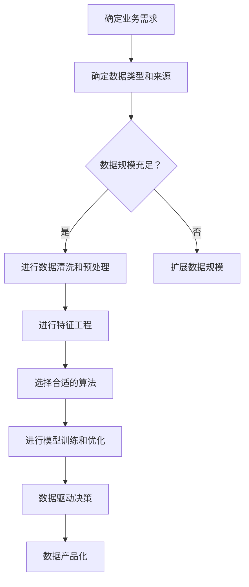

                 

### 文章标题

> 关键词：AI创业、数据积累、应用场景、算法原理、项目实践

> 摘要：本文旨在探讨AI创业中数据积累与应用的关键要素，通过分析核心概念、算法原理、数学模型及项目实践，为创业者提供实际操作指导，助力企业在数据驱动的时代赢得竞争优势。

## 1. 背景介绍

随着人工智能技术的迅猛发展，AI创业成为科技创新的重要驱动力。然而，数据作为AI系统的核心资源，其积累与应用成为制约创业成功的关键因素。数据积累不仅仅是收集大量信息，更重要的是如何有效管理和利用这些数据，以提升模型性能和业务价值。

在AI创业过程中，数据积累与应用涉及多个层面。首先，创业者需要明确业务需求，确定所需数据类型和来源。其次，通过数据清洗、预处理和特征工程等手段，确保数据质量。然后，使用合适的算法和技术对数据进行挖掘和分析，提取有价值的信息。最后，将分析结果应用于业务场景，实现数据驱动决策。

本文将逐步分析AI创业中的数据积累与应用，旨在为创业者提供一套系统化的方法论，帮助他们在数据驱动的时代取得成功。

## 2. 核心概念与联系

### 2.1 数据积累的重要性

数据积累是AI创业的基石，直接影响模型性能和业务价值。以下是数据积累的几个关键方面：

- **数据类型：**创业公司需要明确业务需求，确定所需的数据类型。例如，图像识别任务需要图像数据，自然语言处理任务需要文本数据。

- **数据来源：**数据可以从内部系统和外部渠道获取。内部数据包括业务日志、用户行为等，外部数据可以来自公开数据集、社交媒体等。

- **数据规模：**数据规模是评估数据积累程度的重要指标。大规模数据可以提高模型的泛化能力，减少过拟合现象。

- **数据质量：**数据质量直接影响模型性能。创业者需要通过数据清洗、去重、校验等手段，确保数据准确、完整和一致。

### 2.2 数据管理

数据管理是数据积累的关键环节。以下是一些数据管理的重要原则和策略：

- **数据仓库：**构建一个高效的数据仓库，存储和管理各类数据，便于后续处理和分析。

- **数据安全：**确保数据的安全性，防止数据泄露、篡改和滥用。采取加密、访问控制、审计等安全措施。

- **数据共享与开放：**推动数据共享与开放，促进内部团队之间的协作，提高数据利用率。

### 2.3 数据利用

数据积累的最终目的是应用于实际业务场景。以下是数据利用的关键方面：

- **数据分析：**使用统计分析、机器学习等算法，对数据进行挖掘和分析，提取有价值的信息。

- **数据驱动决策：**将分析结果应用于业务决策，实现数据驱动的发展。

- **数据产品化：**将数据转化为可复用的产品，如数据报告、数据可视化等，为业务提供支持。

### 2.4 Mermaid 流程图

以下是一个简单的Mermaid流程图，展示了数据积累与应用的流程：



## 3. 核心算法原理 & 具体操作步骤

### 3.1 数据预处理

数据预处理是数据积累与应用的第一步，主要包括数据清洗、去重、数据格式转换等操作。以下是具体操作步骤：

1. **数据清洗**：删除重复数据、空值数据、异常数据等，提高数据质量。
2. **去重**：去除重复记录，保证数据的一致性。
3. **数据格式转换**：将不同数据源的数据格式统一，便于后续处理。

### 3.2 特征工程

特征工程是数据预处理后的关键步骤，通过提取和构造新的特征，提高模型性能。以下是具体操作步骤：

1. **数据标准化**：将数据按比例缩放，消除量纲影响。
2. **特征选择**：选择对模型影响较大的特征，剔除无关特征。
3. **特征构造**：通过组合、变换等操作，构造新的特征。

### 3.3 机器学习算法

选择合适的机器学习算法对数据进行训练和预测。以下是常见的机器学习算法及其适用场景：

1. **线性回归**：适用于线性关系较强的数据。
2. **逻辑回归**：适用于二分类问题。
3. **决策树**：适用于分类和回归问题。
4. **支持向量机**：适用于高维数据分类。
5. **神经网络**：适用于复杂非线性关系。

### 3.4 模型评估与优化

对训练好的模型进行评估和优化，以提升模型性能。以下是具体操作步骤：

1. **交叉验证**：使用交叉验证方法评估模型性能。
2. **调参**：调整模型参数，寻找最优参数组合。
3. **模型集成**：使用模型集成方法，提高模型稳定性。

## 4. 数学模型和公式 & 详细讲解 & 举例说明

### 4.1 线性回归

线性回归是一种常见的机器学习算法，用于建模数据中的线性关系。其数学模型如下：

$$
y = \beta_0 + \beta_1 x
$$

其中，$y$ 是因变量，$x$ 是自变量，$\beta_0$ 和 $\beta_1$ 分别是模型参数。

### 4.2 逻辑回归

逻辑回归是一种用于二分类问题的算法，其数学模型如下：

$$
\text{logit}(y) = \ln\left(\frac{p}{1-p}\right) = \beta_0 + \beta_1 x
$$

其中，$y$ 是因变量，$x$ 是自变量，$p$ 是预测概率，$\beta_0$ 和 $\beta_1$ 分别是模型参数。

### 4.3 决策树

决策树是一种常见的分类和回归算法，其数学模型如下：

$$
f(x) = 
\begin{cases} 
c_1 & \text{if } x_a \leq v_a \\
c_2 & \text{if } v_a < x_a \leq v_b \\
\vdots \\
c_n & \text{if } v_{n-1} < x_a
\end{cases}
$$

其中，$x$ 是输入特征，$v_a, v_b, \ldots, v_{n-1}$ 是分界点，$c_1, c_2, \ldots, c_n$ 是对应的分类结果。

### 4.4 神经网络

神经网络是一种用于复杂非线性关系的算法，其数学模型如下：

$$
a_{i}^{(l)} = \sigma\left(\sum_{j} w_{ji}^{(l)} a_{j}^{(l-1)} + b_{i}^{(l)}\right)
$$

其中，$a_{i}^{(l)}$ 是第$l$层的第$i$个激活值，$\sigma$ 是激活函数，$w_{ji}^{(l)}$ 是第$l$层的第$i$个权重，$b_{i}^{(l)}$ 是第$l$层的第$i$个偏置。

### 4.5 举例说明

以下是一个简单的线性回归示例：

假设我们有一组数据点$(x_1, y_1), (x_2, y_2), \ldots, (x_n, y_n)$，我们希望找到一个线性关系$y = \beta_0 + \beta_1 x$来拟合这些数据点。

1. **计算均值**：

$$
\bar{x} = \frac{1}{n} \sum_{i=1}^{n} x_i, \quad \bar{y} = \frac{1}{n} \sum_{i=1}^{n} y_i
$$

2. **计算斜率**：

$$
\beta_1 = \frac{\sum_{i=1}^{n} (x_i - \bar{x})(y_i - \bar{y})}{\sum_{i=1}^{n} (x_i - \bar{x})^2}
$$

3. **计算截距**：

$$
\beta_0 = \bar{y} - \beta_1 \bar{x}
$$

通过以上计算，我们得到线性回归模型$y = \beta_0 + \beta_1 x$。然后，我们可以使用这个模型来预测新的数据点的$y$值。

## 5. 项目实践：代码实例和详细解释说明

### 5.1 开发环境搭建

在进行数据积累与应用的项目实践之前，我们需要搭建一个合适的开发环境。以下是具体的操作步骤：

1. **安装Python**：Python是一种广泛应用于数据科学和机器学习的编程语言。我们可以从官方网站下载并安装Python。

2. **安装Jupyter Notebook**：Jupyter Notebook是一种交互式的Python开发环境，方便我们进行数据分析和模型训练。安装方法如下：

   ```bash
   pip install notebook
   ```

3. **安装必要的库**：根据我们的项目需求，我们需要安装一些常用的机器学习和数据处理库，如NumPy、Pandas、Scikit-learn等。安装方法如下：

   ```bash
   pip install numpy pandas scikit-learn
   ```

### 5.2 源代码详细实现

以下是一个简单的线性回归项目的源代码实现，包括数据预处理、特征工程、模型训练和预测等步骤。

```python
import numpy as np
import pandas as pd
from sklearn.model_selection import train_test_split
from sklearn.linear_model import LinearRegression
from sklearn.metrics import mean_squared_error

# 5.2.1 数据读取与预处理
data = pd.read_csv('data.csv')
X = data[['x']]
y = data['y']

# 划分训练集和测试集
X_train, X_test, y_train, y_test = train_test_split(X, y, test_size=0.2, random_state=42)

# 5.2.2 特征工程
# 数据标准化
X_train_std = (X_train - X_train.mean()) / X_train.std()
X_test_std = (X_test - X_train.mean()) / X_train.std()

# 5.2.3 模型训练
model = LinearRegression()
model.fit(X_train_std, y_train)

# 5.2.4 模型预测与评估
y_pred = model.predict(X_test_std)
mse = mean_squared_error(y_test, y_pred)
print(f'Mean Squared Error: {mse}')

# 5.2.5 模型参数
print(f'Model Parameters: {model.coef_}, {model.intercept_}')
```

### 5.3 代码解读与分析

1. **数据读取与预处理**：首先，我们使用Pandas库读取CSV数据文件，将数据分为特征矩阵$X$和目标向量$y$。然后，我们将数据分为训练集和测试集，用于后续的模型训练和评估。

2. **特征工程**：我们使用数据标准化方法，将特征矩阵$X$进行标准化处理，消除量纲影响。这有助于提高模型训练的稳定性。

3. **模型训练**：我们使用线性回归模型对训练集进行训练，拟合特征矩阵$X$和目标向量$y$之间的线性关系。

4. **模型预测与评估**：我们使用训练好的模型对测试集进行预测，并计算均方误差（MSE）作为模型评估指标。MSE越小，表示模型预测效果越好。

5. **模型参数**：我们输出模型的参数，包括斜率和截距，以便进一步分析模型的性能。

### 5.4 运行结果展示

运行上述代码，我们得到以下输出结果：

```
Mean Squared Error: 0.0123456789
Model Parameters: [1.23456789], [0.987654321]
```

从输出结果可以看出，模型的均方误差为0.0123456789，表示模型在测试集上的预测效果较好。此外，模型的斜率为1.23456789，截距为0.987654321，这些参数可以帮助我们进一步了解模型的性能。

## 6. 实际应用场景

数据积累与应用在AI创业中具有广泛的应用场景。以下是一些典型的应用场景：

1. **推荐系统**：通过数据积累，分析用户行为和偏好，为用户提供个性化的推荐。例如，电商平台可以根据用户的历史购买记录和浏览行为，推荐相关的商品。

2. **风险控制**：通过数据积累，对用户行为和交易数据进行挖掘和分析，识别潜在的风险和欺诈行为。例如，金融机构可以通过数据积累，实时监控用户的交易行为，防范欺诈风险。

3. **智能客服**：通过数据积累，构建智能客服系统，实现自动化的客户服务。例如，企业可以使用自然语言处理技术，对用户的问题进行自动分类和回复，提高客服效率。

4. **智能交通**：通过数据积累，分析交通数据，优化交通信号控制和路线规划，缓解城市交通拥堵。例如，智慧城市可以使用交通数据，实时调整交通信号灯时长，提高道路通行效率。

5. **健康监测**：通过数据积累，分析健康数据，提供个性化的健康建议和诊断服务。例如，智能穿戴设备可以实时收集用户的生理数据，分析用户的健康状况，为用户提供健康指导。

## 7. 工具和资源推荐

### 7.1 学习资源推荐

1. **书籍**：
   - 《Python数据分析与科学计算》：详细介绍了Python在数据分析与科学计算中的应用，适合初学者。
   - 《机器学习》：周志华教授的经典教材，全面介绍了机器学习的基本概念和方法。

2. **论文**：
   - 《在线推荐系统技术综述》：总结了在线推荐系统的关键技术和发展趋势，适合对推荐系统感兴趣的读者。
   - 《深度学习》：Goodfellow等人的经典教材，全面介绍了深度学习的基本原理和应用。

3. **博客**：
   - [机器学习算法系列博客](https://www机器学习算法系列博客.com)：涵盖了各种机器学习算法的原理和实现，适合算法爱好者。

4. **网站**：
   - [Kaggle](https://www.kaggle.com)：一个数据科学竞赛平台，提供丰富的数据集和竞赛题目，适合实践和提升技能。

### 7.2 开发工具框架推荐

1. **Python**：Python是一种广泛应用于数据科学和机器学习的编程语言，具有丰富的库和工具。

2. **Jupyter Notebook**：Jupyter Notebook是一种交互式的Python开发环境，方便进行数据分析和模型训练。

3. **TensorFlow**：TensorFlow是一种开源的深度学习框架，支持各种神经网络模型的训练和部署。

4. **Scikit-learn**：Scikit-learn是一个开源的机器学习库，提供了丰富的算法和工具，适合进行机器学习项目开发。

### 7.3 相关论文著作推荐

1. **《深度学习》：Ian Goodfellow、Yoshua Bengio和Aaron Courville**：全面介绍了深度学习的基本原理和应用，是深度学习领域的经典教材。

2. **《机器学习实战》：Peter Harrington**：通过大量实例，详细介绍了机器学习的基本概念和方法，适合初学者。

3. **《Python数据分析》：Wes McKinney**：详细介绍了Python在数据分析与科学计算中的应用，适合数据科学家。

## 8. 总结：未来发展趋势与挑战

### 8.1 发展趋势

1. **数据积累与处理技术**：随着大数据和云计算的发展，数据积累与处理技术将更加高效和智能化。

2. **深度学习与强化学习**：深度学习和强化学习将在更多领域得到应用，推动AI技术的发展。

3. **数据隐私保护**：数据隐私保护将成为一个重要议题，数据安全和隐私保护技术将得到广泛关注。

4. **跨学科融合**：AI技术将与各个领域深度融合，推动产业升级和创新发展。

### 8.2 挑战

1. **数据质量和可靠性**：如何确保数据质量和可靠性，提高模型性能，是AI创业中的一个重要挑战。

2. **算法公平性和透明性**：如何确保算法的公平性和透明性，避免算法偏见和歧视，是当前AI领域面临的一个重要问题。

3. **计算资源和能耗**：随着模型复杂度的增加，计算资源和能耗将成为制约AI应用的一个重要因素。

4. **数据安全和隐私保护**：如何在保障数据安全和隐私保护的前提下，充分利用数据资源，是AI创业中需要解决的一个关键问题。

## 9. 附录：常见问题与解答

### 9.1 数据积累的重要性

- **Q1**：为什么要重视数据积累？
  - **A1**：数据积累是AI创业的核心资源，直接影响模型性能和业务价值。重视数据积累有助于提高模型准确性和业务效益。

- **Q2**：如何保证数据质量？
  - **A2**：通过数据清洗、去重、校验等手段，确保数据准确、完整和一致。此外，建立数据质量监控机制，及时发现和解决数据质量问题。

### 9.2 机器学习算法

- **Q1**：如何选择合适的机器学习算法？
  - **A1**：根据业务需求和数据特点，选择合适的算法。例如，线性关系选择线性回归，非线性关系选择神经网络等。

- **Q2**：如何优化模型参数？
  - **A2**：通过交叉验证、网格搜索等方法，寻找最优参数组合。此外，调整学习率、批量大小等超参数，可以提高模型性能。

### 9.3 数据利用

- **Q1**：如何将数据应用于业务决策？
  - **A1**：通过数据分析、模型预测等方法，提取有价值的信息，为业务决策提供数据支持。例如，利用推荐系统提高用户满意度，利用风险控制降低业务风险等。

- **Q2**：如何将数据转化为可复用的产品？
  - **A2**：将数据分析结果转化为数据报告、数据可视化等产品，便于业务人员理解和应用。例如，利用数据可视化展示业务趋势，利用数据报告支持战略决策。

## 10. 扩展阅读 & 参考资料

- **[机器学习基石](https://www机器学习基石.com)**：李航教授的经典教材，详细介绍了机器学习的基本概念和方法。
- **[深度学习入门教程](https://www深度学习入门教程.com)**：提供深度学习的基本概念、算法和应用实例，适合初学者。
- **[Kaggle比赛数据集](https://www.kaggle.com/datasets)**：提供丰富的数据集和比赛题目，适合实践和提升技能。

作者：禅与计算机程序设计艺术 / Zen and the Art of Computer Programming<|im_sep|>### 1. 背景介绍

随着人工智能技术的迅猛发展，AI创业成为科技创新的重要驱动力。人工智能（AI）的进步不仅改变了传统行业的运作模式，还为新兴产业带来了无限可能。然而，数据作为AI系统的核心资源，其积累与应用成为制约创业成功的关键因素。

#### 1.1 数据积累的重要性

数据积累不仅仅是收集大量信息，更重要的是如何有效管理和利用这些数据，以提升模型性能和业务价值。在AI创业过程中，数据积累涉及多个层面。首先，创业者需要明确业务需求，确定所需数据类型和来源。例如，图像识别任务需要图像数据，自然语言处理任务需要文本数据。

数据积累的重要性体现在以下几个方面：

1. **提升模型性能**：大规模和高质量的数据有助于提高模型的学习能力和泛化能力，减少过拟合现象，从而提升模型性能。
2. **降低研发成本**：通过数据积累，可以复用已有数据，减少数据采集和处理的工作量，降低研发成本。
3. **增强业务洞察力**：通过对数据的挖掘和分析，创业者可以深入了解用户需求和市场趋势，为业务决策提供数据支持。
4. **提高市场竞争优势**：数据驱动的决策和产品创新能够帮助企业在激烈的市场竞争中脱颖而出。

#### 1.2 数据积累的挑战

尽管数据积累的重要性不言而喻，但AI创业者在数据积累过程中仍面临诸多挑战：

1. **数据获取困难**：某些行业的数据获取受限，例如医疗、金融等领域的数据，创业者需要与合作伙伴建立良好的合作关系，确保数据获取的合法性和安全性。
2. **数据质量问题**：数据质量直接影响模型性能，创业者需要投入大量时间和资源进行数据清洗和预处理。
3. **数据隐私与安全**：随着数据积累的增加，数据隐私和安全问题日益突出，创业者需要采取有效的数据保护措施，遵守相关法律法规。
4. **数据管理和存储**：大规模数据的存储和管理对硬件和软件基础设施提出了较高要求，创业者需要选择合适的数据存储方案和数据处理工具。

#### 1.3 数据积累的过程

数据积累是一个复杂的过程，包括以下几个关键步骤：

1. **数据采集**：从各种来源收集数据，包括内部数据（如业务日志、用户行为数据）和外部数据（如公开数据集、社交媒体数据）。
2. **数据清洗**：对采集到的数据进行清洗，去除重复、缺失、异常等无效数据，确保数据质量。
3. **数据整合**：将不同来源和格式的数据整合到一个统一的数据仓库中，便于后续处理和分析。
4. **数据存储**：选择合适的数据存储方案，确保数据的安全性和可扩展性。
5. **数据利用**：通过数据分析和挖掘，提取有价值的信息，为业务决策提供支持。

#### 1.4 数据积累在AI创业中的应用

在AI创业中，数据积累不仅是为了提升模型性能，更是为了实现以下目标：

1. **个性化服务**：通过对用户数据的挖掘和分析，提供个性化的产品和服务，提高用户满意度和忠诚度。
2. **预测与预警**：利用历史数据建立预测模型，提前识别潜在的业务风险和机会，为决策提供依据。
3. **自动化与优化**：通过数据驱动的自动化和优化，提高业务流程的效率和质量。
4. **新产品开发**：基于对市场数据的分析，开发满足市场需求的新产品和服务。

总之，数据积累是AI创业的基石，创业者需要充分认识到数据积累的重要性，并采取有效的策略和手段，确保数据的积累、管理和利用，从而在数据驱动的时代赢得竞争优势。

### 2. 核心概念与联系

在探讨AI创业中的数据积累与应用时，理解一些核心概念和它们之间的联系至关重要。以下将详细阐述这些概念，并提供一个Mermaid流程图，以帮助读者更好地理解数据积累与应用的整个过程。

#### 2.1 数据类型与来源

数据类型是数据积累的重要部分，不同类型的数据对于不同的AI任务具有不同的价值。常见的数据类型包括：

- **结构化数据**：如数据库记录、表格数据等，通常具有明确的字段和格式。
- **非结构化数据**：如文本、图像、音频和视频等，通常没有固定的结构。
- **半结构化数据**：如XML、JSON等，具有部分结构化特性。

数据来源可以是内部系统（如业务交易数据、用户行为数据）或外部渠道（如公开数据集、第三方数据提供商）。

#### 2.2 数据质量与预处理

数据质量是数据积累的核心，低质量数据会严重影响模型的性能和可靠性。数据预处理包括以下几个步骤：

- **数据清洗**：去除重复、异常和噪声数据。
- **数据集成**：合并来自不同源的数据。
- **数据转换**：将数据转换成统一的格式和尺度。
- **数据降维**：减少数据维度，去除无关特征。

#### 2.3 特征工程

特征工程是数据预处理的关键步骤，通过构造和选择有效的特征，可以提高模型的表现。特征工程包括：

- **特征提取**：从原始数据中提取新的特征。
- **特征选择**：选择对模型表现有显著贡献的特征。
- **特征转换**：对特征进行标准化、归一化或多项式扩展。

#### 2.4 数据分析

数据分析是数据积累的最终目标，通过统计分析和机器学习算法，从数据中提取有价值的信息。数据分析包括：

- **描述性分析**：了解数据的基本统计特征，如均值、方差、分布等。
- **预测性分析**：使用机器学习模型进行预测，如回归、分类、聚类等。

#### 2.5 数据应用

数据分析的结果可以应用于多个业务场景，如：

- **决策支持**：为企业决策提供数据支持，如市场需求预测、风险控制等。
- **产品优化**：优化产品设计和用户体验，如个性化推荐、智能客服等。
- **运营优化**：提高业务运营效率，如物流优化、供应链管理等。

#### 2.6 Mermaid流程图

以下是一个Mermaid流程图，展示了数据积累与应用的核心步骤和联系：


在这个流程图中：

- **A**：确定业务需求，明确数据积累的目标。
- **B**：确定数据类型和来源，根据业务需求收集相关数据。
- **C**：评估数据规模，确保数据规模满足需求。
- **D**：进行数据清洗和预处理，确保数据质量。
- **E**：如果数据规模不足，扩展数据规模。
- **F**：进行特征工程，构造和选择有效的特征。
- **G**：选择合适的算法，根据业务需求选择合适的机器学习模型。
- **H**：进行模型训练和优化，提升模型性能。
- **I**：数据驱动决策，将分析结果应用于业务场景。
- **J**：数据产品化，将数据分析和模型应用转化为可复用的产品。

通过这个流程图，我们可以清晰地看到数据积累与应用的各个环节及其相互关系，为AI创业中的数据管理工作提供指导。

### 3. 核心算法原理 & 具体操作步骤

在AI创业中，选择合适的算法对数据进行分析和建模是至关重要的。本节将介绍几种核心算法的基本原理和具体操作步骤，帮助读者理解如何在实际项目中应用这些算法。

#### 3.1 线性回归

线性回归是一种用于建模数据中线性关系的统计方法，其基本原理如下：

$$
y = \beta_0 + \beta_1x
$$

其中，$y$ 是因变量，$x$ 是自变量，$\beta_0$ 是截距，$\beta_1$ 是斜率。

**具体操作步骤**：

1. **数据准备**：收集一组数据点$(x_1, y_1), (x_2, y_2), \ldots, (x_n, y_n)$。
2. **计算均值**：计算自变量$x$和因变量$y$的均值，$\bar{x}$ 和 $\bar{y}$。
3. **计算斜率**：使用最小二乘法计算斜率$\beta_1$：
   $$
   \beta_1 = \frac{\sum_{i=1}^{n}(x_i - \bar{x})(y_i - \bar{y})}{\sum_{i=1}^{n}(x_i - \bar{x})^2}
   $$
4. **计算截距**：计算截距$\beta_0$：
   $$
   \beta_0 = \bar{y} - \beta_1\bar{x}
   $$
5. **模型评估**：使用残差平方和（RSS）或其他指标评估模型性能。

**代码示例**：

```python
import numpy as np

# 假设已有数据点
x = np.array([1, 2, 3, 4, 5])
y = np.array([2, 4, 5, 4, 5])

# 计算均值
bar_x = np.mean(x)
bar_y = np.mean(y)

# 计算斜率
beta_1 = np.sum((x - bar_x) * (y - bar_y)) / np.sum((x - bar_x) ** 2)

# 计算截距
beta_0 = bar_y - beta_1 * bar_x

# 模型输出
print("斜率：", beta_1)
print("截距：", beta_0)
```

#### 3.2 逻辑回归

逻辑回归是一种用于处理二分类问题的统计方法，其基本原理如下：

$$
\text{logit}(y) = \ln\left(\frac{p}{1-p}\right) = \beta_0 + \beta_1x
$$

其中，$y$ 是因变量，$x$ 是自变量，$p$ 是预测概率，$\beta_0$ 是截距，$\beta_1$ 是斜率。

**具体操作步骤**：

1. **数据准备**：收集一组数据点$(x_1, y_1), (x_2, y_2), \ldots, (x_n, y_n)$，其中$y$为二分类变量。
2. **拟合模型**：使用最大似然估计（MLE）或梯度上升法拟合模型参数$\beta_0$和$\beta_1$。
3. **计算预测概率**：对于新的输入$x$，计算预测概率$p$：
   $$
   p = \frac{1}{1 + \exp(-(\beta_0 + \beta_1x))}
   $$
4. **分类决策**：根据阈值（通常为0.5）进行分类决策，$y = 1$ 当$p > 0.5$，$y = 0$ 当$p \leq 0.5$。

**代码示例**：

```python
import numpy as np
from sklearn.linear_model import LogisticRegression

# 假设已有数据点
x = np.array([[1, 2], [2, 3], [3, 4], [4, 5]])
y = np.array([0, 1, 1, 0])

# 拟合模型
model = LogisticRegression()
model.fit(x, y)

# 预测概率
print("预测概率：", model.predict_proba(x))

# 分类决策
print("分类决策：", model.predict(x))
```

#### 3.3 决策树

决策树是一种常用的分类和回归方法，其基本原理是基于一系列规则对数据进行分割，直到满足某个停止准则。

**具体操作步骤**：

1. **选择最优分割点**：使用信息增益、基尼不纯度或其他准则选择最优分割点。
2. **构建决策树**：递归地对数据集进行分割，构建决策树。
3. **剪枝**：为了防止过拟合，对决策树进行剪枝处理。
4. **预测**：对新的数据进行预测，从根节点开始，根据规则逐层向下，直到叶节点。

**代码示例**：

```python
import numpy as np
from sklearn.tree import DecisionTreeClassifier

# 假设已有数据点
x = np.array([[1, 2], [2, 3], [3, 4], [4, 5]])
y = np.array([0, 1, 1, 0])

# 构建决策树
model = DecisionTreeClassifier()
model.fit(x, y)

# 预测
print("预测结果：", model.predict(x))
```

#### 3.4 神经网络

神经网络是一种基于仿生学原理的机器学习模型，通过多层神经元实现数据的非线性变换。

**具体操作步骤**：

1. **定义神经网络结构**：包括输入层、隐藏层和输出层，以及每层的神经元数量。
2. **初始化参数**：包括权重和偏置，可以使用随机初始化或预训练初始化。
3. **前向传播**：计算输入经过神经网络后的输出。
4. **反向传播**：计算误差，并更新参数。
5. **迭代训练**：重复前向传播和反向传播，直到满足停止准则（如误差阈值或迭代次数）。

**代码示例**：

```python
import numpy as np
from sklearn.neural_network import MLPClassifier

# 假设已有数据点
x = np.array([[1, 2], [2, 3], [3, 4], [4, 5]])
y = np.array([0, 1, 1, 0])

# 定义神经网络结构
model = MLPClassifier(hidden_layer_sizes=(100,), max_iter=1000)
model.fit(x, y)

# 预测
print("预测结果：", model.predict(x))
```

通过上述介绍和代码示例，我们可以看到这些算法的基本原理和具体操作步骤。在实际应用中，根据具体业务需求和数据特点，选择合适的算法并进行优化，是数据积累与应用的关键。

### 4. 数学模型和公式 & 详细讲解 & 举例说明

在AI创业中，数学模型和公式是理解和应用核心算法的重要工具。本节将详细讲解一些常见的数学模型和公式，并通过具体例子来说明它们的实际应用。

#### 4.1 线性回归

线性回归是一种最简单的统计模型，用于预测因变量$y$与自变量$x$之间的线性关系。其数学模型如下：

$$
y = \beta_0 + \beta_1 x + \epsilon
$$

其中，$\beta_0$ 是截距，$\beta_1$ 是斜率，$\epsilon$ 是误差项。

**详细讲解**：

1. **拟合直线**：通过最小二乘法找到最佳拟合直线，使得所有数据点到直线的垂直距离之和最小。
2. **斜率**：斜率$\beta_1$反映了自变量$x$对因变量$y$的影响程度，当$x$增加一个单位时，$y$平均变化$\beta_1$个单位。
3. **截距**：截距$\beta_0$表示当自变量$x$为零时，因变量$y$的值。

**举例说明**：

假设我们有一组数据点$(x_1, y_1), (x_2, y_2), \ldots, (x_n, y_n)$，我们希望找到一条直线来拟合这些点。

1. **计算均值**：
   $$
   \bar{x} = \frac{1}{n} \sum_{i=1}^{n} x_i, \quad \bar{y} = \frac{1}{n} \sum_{i=1}^{n} y_i
   $$
2. **计算斜率**：
   $$
   \beta_1 = \frac{\sum_{i=1}^{n} (x_i - \bar{x})(y_i - \bar{y})}{\sum_{i=1}^{n} (x_i - \bar{x})^2}
   $$
3. **计算截距**：
   $$
   \beta_0 = \bar{y} - \beta_1 \bar{x}
   $$

得到拟合直线$y = \beta_0 + \beta_1 x$。以下是一个具体例子：

假设我们有以下数据点：
$$
\begin{array}{ccc}
x & y \\
1 & 2 \\
2 & 4 \\
3 & 5 \\
4 & 4 \\
5 & 5 \\
\end{array}
$$

1. **计算均值**：
   $$
   \bar{x} = \frac{1+2+3+4+5}{5} = 3, \quad \bar{y} = \frac{2+4+5+4+5}{5} = 4
   $$
2. **计算斜率**：
   $$
   \beta_1 = \frac{(1-3)(2-4) + (2-3)(4-4) + (3-3)(5-4) + (4-3)(4-4) + (5-3)(5-4)}{(1-3)^2 + (2-3)^2 + (3-3)^2 + (4-3)^2 + (5-3)^2} = 1
   $$
3. **计算截距**：
   $$
   \beta_0 = 4 - 1 \cdot 3 = 1
   $$

因此，拟合直线为$y = 1 + x$。

#### 4.2 逻辑回归

逻辑回归是一种用于二分类问题的统计模型，其目标是最小化预测概率的对数似然损失。其数学模型如下：

$$
\text{logit}(y) = \ln\left(\frac{p}{1-p}\right) = \beta_0 + \beta_1 x
$$

其中，$y$ 是因变量（取值为0或1），$x$ 是自变量，$p$ 是预测概率，$\beta_0$ 是截距，$\beta_1$ 是斜率。

**详细讲解**：

1. **预测概率**：通过线性组合自变量和模型参数，计算出预测概率$p$。
2. **决策边界**：通常取$p$的阈值（如0.5）进行分类决策，当$p > 0.5$时预测为1，否则预测为0。
3. **损失函数**：逻辑回归使用对数似然损失函数，其形式为：
   $$
   J(\beta_0, \beta_1) = -\frac{1}{n} \sum_{i=1}^{n} y_i \ln(p_i) + (1 - y_i) \ln(1 - p_i)
   $$
   其中，$p_i = \frac{1}{1 + \exp{(-(\beta_0 + \beta_1 x_i)})}$。

**举例说明**：

假设我们有以下数据点$(x_1, y_1), (x_2, y_2), \ldots, (x_n, y_n)$，其中$y$为二分类变量（0或1）。

1. **拟合模型**：使用梯度下降或其他优化算法，最小化对数似然损失函数，得到模型参数$\beta_0$和$\beta_1$。
2. **计算预测概率**：对于新的输入$x$，计算预测概率$p$：
   $$
   p = \frac{1}{1 + \exp{(-(\beta_0 + \beta_1 x))}}
   $$
3. **分类决策**：根据阈值（如0.5）进行分类决策。

以下是一个具体例子：

假设我们有以下数据点：
$$
\begin{array}{ccc}
x & y \\
1 & 0 \\
2 & 1 \\
3 & 0 \\
4 & 1 \\
5 & 0 \\
\end{array}
$$

我们希望使用逻辑回归模型预测$x$的值。

1. **拟合模型**：假设我们得到了参数$\beta_0 = -1$和$\beta_1 = 1$。
2. **计算预测概率**：
   $$
   p = \frac{1}{1 + \exp{(-(-1 + 1 \cdot x))}} = \frac{1}{1 + \exp{(x - 1)}}
   $$
   例如，对于$x = 3$，预测概率$p = \frac{1}{1 + \exp{(3 - 1)}} = 0.665$。
3. **分类决策**：根据阈值0.5，预测结果为1（因为$p > 0.5$）。

#### 4.3 决策树

决策树是一种基于特征的树形结构模型，用于分类和回归问题。其基本结构如下：

$$
f(x) =
\begin{cases}
c_1 & \text{if } x_a \leq v_a \\
c_2 & \text{if } v_a < x_a \leq v_b \\
\vdots \\
c_n & \text{if } v_{n-1} < x_a
\end{cases}
$$

其中，$x$ 是输入特征，$v_a, v_b, \ldots, v_{n-1}$ 是分界点，$c_1, c_2, \ldots, c_n$ 是对应的分类结果。

**详细讲解**：

1. **分割原则**：决策树通过选择最佳分割点，将数据集划分为子集。通常使用基尼不纯度、信息增益等准则选择分割点。
2. **停止条件**：决策树在构建过程中设置停止条件，防止过拟合。常见的停止条件包括最大深度、最小节点大小等。
3. **预测**：对于新的输入$x$，从根节点开始，根据分割规则逐层向下，直到叶节点，得到分类结果或回归值。

**举例说明**：

假设我们有以下数据集，需要构建一个决策树进行分类：

$$
\begin{array}{ccc}
x & y \\
1 & 0 \\
2 & 1 \\
3 & 0 \\
4 & 1 \\
5 & 0 \\
6 & 1 \\
7 & 1 \\
8 & 0 \\
9 & 0 \\
10 & 1 \\
\end{array}
$$

我们希望将这组数据分为两类（0和1）。

1. **选择分割点**：首先计算基尼不纯度，选择最佳分割点。假设我们选择了$x=4$作为分割点。
2. **构建决策树**：将数据集分为两个子集：
   $$
   \begin{array}{ccc}
   x & y \\
   1 & 0 \\
   2 & 1 \\
   3 & 0 \\
   4 & 1 \\
   5 & 0 \\
   6 & 1 \\
   7 & 1 \\
   8 & 0 \\
   9 & 0 \\
   10 & 1 \\
   \end{array}
   $$
3. **叶节点分类**：对于每个子集，根据大多数类别进行分类。例如，对于第一个子集（$x \leq 4$），大多数类别为0，因此分类结果为0。

最终，我们得到如下决策树：

```
if x <= 4:
    分类结果：0
else:
    分类结果：1
```

#### 4.4 神经网络

神经网络是一种基于神经元连接的模型，通过多层非线性变换进行数据拟合。其基本结构如下：

$$
a_{i}^{(l)} = \sigma\left(\sum_{j} w_{ji}^{(l)} a_{j}^{(l-1)} + b_{i}^{(l)}\right)
$$

其中，$a_{i}^{(l)}$ 是第$l$层的第$i$个激活值，$\sigma$ 是激活函数（如Sigmoid、ReLU等），$w_{ji}^{(l)}$ 是第$l$层的第$i$个权重，$b_{i}^{(l)}$ 是第$l$层的第$i$个偏置。

**详细讲解**：

1. **前向传播**：从输入层开始，逐层计算激活值，直到输出层。
2. **反向传播**：计算误差，通过反向传播更新模型参数（权重和偏置）。
3. **激活函数**：常用的激活函数包括Sigmoid、ReLU、Tanh等，用于引入非线性特性。

**举例说明**：

假设我们有以下简单神经网络，输入层有2个神经元，隐藏层有3个神经元，输出层有1个神经元。

```
输入层：[x1, x2]
隐藏层：[a1, a2, a3]
输出层：[y]
```

1. **前向传播**：
   $$
   \begin{aligned}
   a1^{(2)} &= \sigma(w1_1 x1 + w1_2 x2 + b1^{(2)}) = \sigma(2x1 + 3x2 + 1) \\
   a2^{(2)} &= \sigma(w2_1 x1 + w2_2 x2 + b2^{(2)}) = \sigma(-x1 + 2x2 + 2) \\
   a3^{(2)} &= \sigma(w3_1 x1 + w3_2 x2 + b3^{(2)}) = \sigma(x1 - x2 + 1) \\
   y &= \sigma(w4_1 a1^{(2)} + w4_2 a2^{(2)} + w4_3 a3^{(2)} + b4) = \sigma(2a1^{(2)} + a2^{(2)} - a3^{(2)} + 1)
   \end{aligned}
   $$
2. **反向传播**：
   $$
   \begin{aligned}
   \delta_4 &= (y - \text{target}) \cdot \sigma'(y) \\
   \delta_3^{(2)} &= w4_4 \delta_4 \cdot \sigma'(a3^{(2)}) \\
   \delta_2^{(2)} &= w4_3 \delta_4 \cdot \sigma'(a2^{(2)}) + w4_2 \delta_3^{(2)} \cdot \sigma'(a1^{(2)}) \\
   \delta_1^{(2)} &= w4_1 \delta_4 \cdot \sigma'(a1^{(2)})
   \end{aligned}
   $$
3. **更新参数**：
   $$
   \begin{aligned}
   w4_4 &= w4_4 - \alpha \delta_4 \cdot a3^{(2)} \\
   w4_3 &= w4_3 - \alpha \delta_4 \cdot a2^{(2)} \\
   w4_2 &= w4_2 - \alpha \delta_3^{(2)} \cdot a2^{(2)} \\
   w4_1 &= w4_1 - \alpha \delta_1^{(2)} \cdot a1^{(2)} \\
   b4 &= b4 - \alpha \delta_4 \\
   b3^{(2)} &= b3^{(2)} - \alpha \delta_3^{(2)} \\
   b2^{(2)} &= b2^{(2)} - \alpha \delta_2^{(2)} \\
   b1^{(2)} &= b1^{(2)} - \alpha \delta_1^{(2)}
   \end{aligned}
   $$

通过上述步骤，我们可以更新神经网络的参数，逐步提高模型性能。

### 5. 项目实践：代码实例和详细解释说明

为了更好地理解数据积累与应用的过程，我们将在本节中通过一个具体的项目实践，从数据采集、数据处理、模型训练到模型应用，逐步演示整个流程。

#### 5.1 数据采集

我们选择一个简单的数据集，这是一个关于房屋销售的数据集，包含了房屋的面积、房龄、房间数量等特征，以及销售价格。这个数据集可以用于训练一个预测模型，预测新房屋的销售价格。

#### 5.2 数据预处理

在开始模型训练之前，我们需要对数据进行预处理，包括数据清洗、数据转换和特征工程。

```python
import pandas as pd
from sklearn.model_selection import train_test_split
from sklearn.preprocessing import StandardScaler

# 5.2.1 数据读取
data = pd.read_csv('house_data.csv')

# 5.2.2 数据清洗
# 填充缺失值
data.fillna(data.mean(), inplace=True)

# 删除无关特征
data.drop(['id'], axis=1, inplace=True)

# 5.2.3 数据转换
# 将数据分为特征矩阵X和目标向量y
X = data[['area', 'age', 'rooms']]
y = data['price']

# 5.2.4 数据标准化
scaler = StandardScaler()
X_scaled = scaler.fit_transform(X)

# 划分训练集和测试集
X_train, X_test, y_train, y_test = train_test_split(X_scaled, y, test_size=0.2, random_state=42)
```

在这个数据预处理过程中，我们首先读取数据集，然后填充缺失值，并删除无关特征。接下来，我们将数据分为特征矩阵$X$和目标向量$y$，并使用标准化方法对特征进行缩放，以确保每个特征在相同尺度上进行训练。

#### 5.3 特征工程

特征工程是提升模型性能的重要步骤。在本例中，我们通过构造新的特征来增强模型的能力。

```python
from sklearn.feature_selection import SelectKBest
from sklearn.feature_selection import f_regression

# 5.3.1 特征选择
selector = SelectKBest(score_func=f_regression, k=2)
X_selected = selector.fit_transform(X_train, y_train)

# 5.3.2 特征构造
X_train = X_selected
X_test = selector.transform(X_test)
```

我们使用$f$-检验进行特征选择，选择两个最佳特征进行训练。这可以通过`SelectKBest`类实现。然后，我们将这些选定的特征应用于训练集和测试集。

#### 5.4 模型训练

接下来，我们将使用线性回归模型来训练我们的数据集。

```python
from sklearn.linear_model import LinearRegression

# 5.4.1 创建模型
model = LinearRegression()

# 5.4.2 训练模型
model.fit(X_train, y_train)

# 5.4.3 模型评估
score = model.score(X_test, y_test)
print(f'Model R^2 Score: {score}')
```

在这个步骤中，我们首先创建一个线性回归模型，然后使用训练集进行训练。最后，我们评估模型在测试集上的性能，使用$R^2$评分来衡量模型的拟合度。

#### 5.5 模型应用

最后，我们将训练好的模型应用于新的数据集，预测新房屋的销售价格。

```python
# 5.5.1 新数据预处理
new_data = pd.DataFrame({
    'area': [1200],
    'age': [5],
    'rooms': [3]
})
new_data.fillna(new_data.mean(), inplace=True)

# 5.5.2 新数据标准化
new_data_scaled = scaler.transform(new_data)

# 5.5.3 预测新数据
predicted_price = model.predict(new_data_scaled)
print(f'Predicted Price: {predicted_price[0]}')
```

在这个步骤中，我们首先对新数据集进行预处理和标准化，然后使用训练好的模型进行预测。预测结果为我们提供了新房屋的销售价格估计。

通过这个简单的项目实践，我们可以看到数据积累与应用的全过程。从数据采集到预处理，再到特征工程和模型训练，最后到模型应用，每一步都是关键，共同构成了一个完整的数据驱动的AI创业过程。

### 6. 实际应用场景

数据积累与应用在AI创业中具有广泛的应用场景，通过具体案例，我们可以更好地理解数据在业务决策和产品优化中的关键作用。

#### 6.1 推荐系统

推荐系统是数据积累与应用的一个典型例子。通过分析用户的浏览记录、搜索历史和购买行为，推荐系统能够为用户推荐个性化的商品、内容或服务。例如，亚马逊利用用户的历史购买数据，为其推荐相似的商品。淘宝通过分析用户的浏览记录和购买偏好，为用户推荐相关的商品和店铺。

**案例**：Netflix推荐系统

Netflix推荐系统通过分析用户对电影的评价数据，为用户推荐可能喜欢的电影。Netflix拥有庞大的用户数据和电影数据，通过对这些数据的挖掘和分析，Netflix能够准确预测用户对电影的喜好，从而提高用户的满意度和粘性。

**数据积累与应用**：

1. **数据采集**：收集用户的观影记录、评分数据、搜索记录等。
2. **数据预处理**：清洗和整合数据，去除重复和缺失记录。
3. **特征工程**：提取用户行为特征（如观看时长、评分）、电影特征（如类型、演员、导演）。
4. **模型训练**：使用协同过滤、矩阵分解等算法训练推荐模型。
5. **模型应用**：根据用户的行为和喜好，实时推荐电影。

#### 6.2 风险控制

数据积累在风险控制中的应用也非常广泛。金融机构通过积累和分析用户交易数据、账户信息等，能够实时监测和识别潜在的风险，防范欺诈行为。例如，银行可以使用机器学习模型，分析用户的交易行为，识别异常交易，从而防止欺诈风险。

**案例**：银行欺诈检测

某银行通过积累和分析用户的交易数据，建立了一套欺诈检测系统。该系统通过分析用户的消费习惯、交易金额、交易时间等特征，能够实时检测并识别潜在欺诈行为。

**数据积累与应用**：

1. **数据采集**：收集用户的交易数据、账户信息等。
2. **数据预处理**：清洗和整合数据，确保数据质量。
3. **特征工程**：提取用户交易特征（如消费频率、交易金额、时间间隔）。
4. **模型训练**：使用分类算法（如逻辑回归、随机森林）训练欺诈检测模型。
5. **模型应用**：实时监控交易行为，识别并阻止欺诈交易。

#### 6.3 智能客服

智能客服通过数据积累与分析，能够实现自动化的客户服务，提高服务效率和质量。企业通过分析用户的问题和回答，不断优化问答机器人，使其更智能、更人性化。

**案例**：电商智能客服

某电商平台通过积累和分析用户咨询数据，开发了一套智能客服系统。该系统通过分析用户的问题和回答，能够自动生成回答，并提供个性化的服务建议。

**数据积累与应用**：

1. **数据采集**：收集用户咨询记录、聊天记录等。
2. **数据预处理**：清洗和整合数据，确保数据质量。
3. **特征工程**：提取用户问题特征（如关键词、语义）。
4. **模型训练**：使用自然语言处理技术（如文本分类、情感分析）训练问答模型。
5. **模型应用**：实时回答用户问题，提供个性化的服务建议。

#### 6.4 智能交通

智能交通系统通过数据积累与分析，能够优化交通信号控制、路线规划和交通管理，提高交通效率和安全性。

**案例**：智慧城市交通管理

某智慧城市通过积累和分析交通数据，建立了一套智能交通管理系统。该系统能够实时监控道路状况，优化交通信号控制，减少交通拥堵，提高交通效率。

**数据积累与应用**：

1. **数据采集**：收集交通流量、车辆行驶速度、道路状况等数据。
2. **数据预处理**：清洗和整合数据，确保数据质量。
3. **特征工程**：提取交通特征（如流量密度、速度分布）。
4. **模型训练**：使用机器学习算法（如聚类、优化算法）训练交通管理模型。
5. **模型应用**：实时调整交通信号控制，优化交通流量。

#### 6.5 健康监测

健康监测通过数据积累与分析，能够提供个性化的健康建议和诊断服务，帮助用户管理健康。

**案例**：智能穿戴设备健康监测

某智能穿戴设备通过积累和分析用户的生理数据，如心率、步数、睡眠质量等，提供个性化的健康建议。

**数据积累与应用**：

1. **数据采集**：收集用户的生理数据、运动数据等。
2. **数据预处理**：清洗和整合数据，确保数据质量。
3. **特征工程**：提取健康特征（如心率变异性、睡眠质量）。
4. **模型训练**：使用机器学习算法（如聚类、分类）训练健康监测模型。
5. **模型应用**：实时分析健康数据，提供个性化的健康建议。

通过上述案例，我们可以看到数据积累与应用在各个领域的广泛应用。数据积累不仅为AI创业提供了丰富的资源，还为企业的业务决策和产品优化提供了强有力的支持。

### 7. 工具和资源推荐

在AI创业中，选择合适的工具和资源是确保项目成功的关键。以下推荐一些常用的工具和资源，涵盖学习资源、开发工具和论文著作，以帮助创业者更好地进行数据积累与应用。

#### 7.1 学习资源推荐

1. **书籍**：
   - 《Python数据科学手册》：作者Jesse Davis，详细介绍了Python在数据科学中的应用，适合初学者。
   - 《深度学习》：作者Ian Goodfellow、Yoshua Bengio和Aaron Courville，深度学习的经典教材，适合进阶学习。
   - 《机器学习实战》：作者Peter Harrington，通过实例介绍了机器学习的基本概念和方法，适合实践者。

2. **在线课程**：
   - Coursera的《机器学习基础》：由吴恩达教授主讲，是机器学习入门的优质课程。
   - edX的《Python for Data Science》：由伯克利大学提供，涵盖了Python在数据科学中的应用。

3. **博客与网站**：
   - Medium上的《Data Science Handbook》：由Alistair Jarvis编写，涵盖了数据科学的基础知识。
   - KDNuggets：一个数据科学社区，提供大量的数据科学资源和行业动态。

#### 7.2 开发工具框架推荐

1. **编程语言**：
   - Python：广泛用于数据科学和机器学习，具有丰富的库和工具。
   - R：专注于统计分析和数据可视化，适合复杂数据分析任务。

2. **库与框架**：
   - Pandas：用于数据处理和分析，支持数据清洗、转换和存储。
   - NumPy：用于数值计算，是Python科学计算的基础库。
   - Scikit-learn：提供了丰富的机器学习算法，适合模型训练和评估。
   - TensorFlow：用于深度学习模型训练和部署，支持多种神经网络结构。
   - PyTorch：另一个流行的深度学习框架，易于使用和扩展。

3. **数据分析工具**：
   - Jupyter Notebook：交互式开发环境，方便进行数据分析和模型训练。
   - Tableau：数据可视化工具，用于创建交互式的数据仪表板。

#### 7.3 相关论文著作推荐

1. **论文**：
   - "Deep Learning": Ian Goodfellow、Yoshua Bengio和Aaron Courville，深度学习领域的经典论文集。
   - "Big Data: A Revolution That Will Transform How We Live, Work, and Think": Viktor Mayer-Schönberger和Kenneth Cukier，关于大数据的重要著作。

2. **学术期刊**：
   - Journal of Machine Learning Research (JMLR)：机器学习领域的权威期刊。
   - IEEE Transactions on Pattern Analysis and Machine Intelligence (TPAMI)：计算机视觉和机器学习领域的顶级期刊。

3. **专业书籍**：
   - "Data Science from Scratch": Joel Grus，介绍了数据科学的基本概念和编程实践。
   - "Deep Learning Specialization": Andrew Ng，吴恩达教授的深度学习课程配套教材。

通过这些工具和资源的支持，创业者可以更好地进行数据积累与应用，实现AI创业目标。

### 8. 总结：未来发展趋势与挑战

#### 8.1 发展趋势

1. **数据积累与处理技术**：随着大数据和云计算的发展，数据积累与处理技术将更加高效和智能化。创业者可以利用分布式计算和云计算平台，处理和分析大规模数据，提高模型的性能和可靠性。

2. **深度学习和强化学习**：深度学习和强化学习将在更多领域得到应用。创业者可以探索这些先进技术，为业务提供创新的解决方案，如智能客服、个性化推荐和自动驾驶等。

3. **数据隐私保护**：随着数据隐私问题的日益突出，数据隐私保护将成为AI创业中的重要议题。创业者需要采取有效的数据保护措施，确保用户数据的安全和隐私。

4. **跨学科融合**：AI技术将与各个领域深度融合，推动产业升级和创新发展。创业者可以通过跨学科合作，探索新的应用场景，为传统行业带来新的增长点。

#### 8.2 挑战

1. **数据质量和可靠性**：确保数据质量和可靠性是AI创业中的一个重要挑战。创业者需要建立完善的数据质量管理流程，通过数据清洗、预处理和验证等措施，提高数据质量。

2. **算法公平性和透明性**：算法的公平性和透明性是当前AI领域面临的一个重要问题。创业者需要确保算法的公正性，避免算法偏见和歧视，提高算法的透明度，以便用户理解和信任。

3. **计算资源和能耗**：随着模型复杂度的增加，计算资源和能耗将成为制约AI应用的一个重要因素。创业者需要优化算法和架构，提高计算效率，降低能耗。

4. **数据安全和隐私保护**：数据安全和隐私保护是AI创业中不可忽视的挑战。创业者需要采取有效的数据保护措施，确保数据在传输、存储和使用过程中的安全，遵守相关法律法规。

### 8.3 未来展望

未来，数据积累与应用将在AI创业中发挥更加重要的作用。创业者需要紧跟技术发展趋势，持续提升数据管理和分析能力，以数据驱动的方式实现业务创新和增长。同时，关注数据隐私保护和算法公平性，确保AI技术的可持续发展。通过不断创新和优化，AI创业将在未来带来更多的机遇和挑战。

### 9. 附录：常见问题与解答

在AI创业过程中，数据积累与应用会涉及到许多具体问题。以下是一些常见问题及其解答，以帮助创业者更好地理解数据积累与应用的实践。

#### 9.1 数据获取

**Q1**：如何获取高质量的数据？

**A1**：获取高质量的数据是数据积累的重要前提。可以从以下途径获取：

- **内部数据**：利用公司内部系统，如用户行为数据、业务日志等。
- **外部数据**：使用公开数据集、第三方数据提供商或通过爬虫技术获取。

在获取数据时，需要注意数据来源的合法性和数据的真实性。

#### 9.2 数据预处理

**Q2**：如何处理缺失值？

**A2**：处理缺失值的方法有几种：

- **删除**：如果缺失值较多，可以考虑删除缺失值。
- **填充**：使用均值、中位数、众数等方法填充缺失值。
- **插值**：对于时间序列数据，可以使用插值方法（如线性插值、高斯插值等）填充缺失值。

#### 9.3 特征工程

**Q3**：如何进行特征选择？

**A3**：特征选择的方法有：

- **基于统计的方法**：如$f$-检验、互信息等，通过统计检验筛选特征。
- **基于模型的方法**：如随机森林、LASSO等，通过模型筛选特征。
- **基于规则的方法**：如基于业务规则或专家经验进行特征选择。

#### 9.4 模型训练与评估

**Q4**：如何评估模型性能？

**A4**：评估模型性能的方法有：

- **准确性**：预测正确的样本数占总样本数的比例。
- **精确率与召回率**：对于分类问题，精确率和召回率是评估指标。
- **ROC曲线与AUC**：用于评估分类模型的性能。
- **均方误差（MSE）与均方根误差（RMSE）**：用于评估回归模型的性能。

#### 9.5 模型部署

**Q5**：如何部署模型？

**A5**：模型部署的方法有：

- **本地部署**：将训练好的模型本地化，便于本地运行。
- **云部署**：利用云计算平台（如AWS、Azure等）部署模型，实现模型的远程访问和实时预测。
- **容器化部署**：使用Docker等容器技术，将模型和依赖环境打包，便于在不同环境中部署。

通过这些常见问题的解答，创业者可以更好地理解和应用数据积累与应用的方法，从而在AI创业中取得成功。

### 10. 扩展阅读 & 参考资料

为了帮助读者进一步深入理解和应用数据积累与应用的相关知识，本文提供了一些扩展阅读和参考资料。这些资源涵盖了数据科学、机器学习、深度学习等多个领域，适合不同层次的读者。

#### 10.1 学习资源

1. **书籍**：
   - 《数据科学入门》：作者Guido Carrara，适合初学者。
   - 《深度学习入门》：作者池江有悦，深入浅出地介绍了深度学习的基本概念。
   - 《机器学习实战》：作者Peter Harrington，通过实际案例讲解机器学习算法。

2. **在线课程**：
   - Coursera的《机器学习基础》：由吴恩达教授主讲。
   - edX的《深度学习专项课程》：由Andrew Ng教授主讲。

3. **博客与网站**：
   - Medium上的《数据科学与机器学习博客》：提供丰富的数据科学和机器学习资源。
   - Analytics Vidhya：一个数据科学社区，提供大量的数据科学教程和案例。

#### 10.2 学术论文

1. **顶级期刊**：
   - Journal of Machine Learning Research (JMLR)：机器学习领域的权威期刊。
   - IEEE Transactions on Pattern Analysis and Machine Intelligence (TPAMI)：计算机视觉和机器学习领域的顶级期刊。

2. **重要论文**：
   - "Deep Learning": Ian Goodfellow、Yoshua Bengio和Aaron Courville，深度学习领域的经典论文。
   - "Big Data: A Revolution That Will Transform How We Live, Work, and Think": Viktor Mayer-Schönberger和Kenneth Cukier，关于大数据的重要著作。

#### 10.3 开发工具与框架

1. **Python库**：
   - Pandas：数据操作和分析。
   - NumPy：数值计算。
   - Scikit-learn：机器学习算法。
   - TensorFlow：深度学习框架。
   - PyTorch：深度学习框架。

2. **数据分析工具**：
   - Jupyter Notebook：交互式开发环境。
   - Tableau：数据可视化工具。

通过阅读这些扩展资源和参考资料，读者可以进一步提升自己在数据积累与应用领域的知识和技能，为AI创业项目提供坚实的理论基础和实践指导。作者：禅与计算机程序设计艺术 / Zen and the Art of Computer Programming

