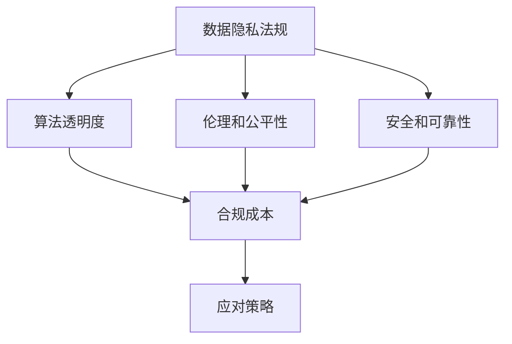

                 

### 背景介绍

随着人工智能（AI）技术的迅猛发展，越来越多的创业公司投身于这一领域，希望借助AI的力量实现商业价值。然而，随着监管政策的不断演变，AI创业公司面临着前所未有的挑战。本文将探讨AI创业公司如何应对监管政策的变化，以确保合规运营并持续发展。

#### 监管政策的演变

监管政策对于任何行业都是必不可少的，尤其是在技术快速发展的AI领域。监管政策的主要目的是确保AI技术的安全、公平和透明，防止其被滥用。以下是近年来监管政策的一些主要变化：

1. **数据隐私法规**：随着GDPR（欧盟通用数据保护条例）和CCPA（美国加州消费者隐私法案）等法规的出台，AI创业公司必须更加重视用户数据的收集、存储和使用。

2. **算法透明度**：越来越多的监管机构要求AI系统具备透明性，即算法的决策过程需要可解释，以便用户和相关机构能够理解其运作机制。

3. **伦理和公平性**：AI技术的应用需要考虑其对社会、环境和人类的影响，避免算法偏见和歧视。

4. **安全和可靠性**：AI系统的安全性至关重要，尤其是涉及公共安全和关键基础设施的领域。

#### 监管政策对AI创业公司的影响

1. **合规成本**：合规监管需要投入大量的人力和物力资源，包括法律咨询、审计、培训和系统改进等。这对初创公司来说可能是一个巨大的财务负担。

2. **时间成本**：遵守监管政策需要时间和持续的努力，尤其是在法规不断变化的情况下。

3. **市场竞争**：那些能够迅速适应监管政策的AI创业公司将在市场竞争中占据优势。

4. **创新受限**：过于严格的监管可能会限制AI创业公司的创新能力，导致其在市场竞争中处于劣势。

#### 应对策略

1. **建立健全的合规体系**：AI创业公司应该建立一套完善的合规管理体系，包括政策解读、流程优化、人员培训等。

2. **积极与监管机构沟通**：了解监管政策的变化趋势，与监管机构保持良好的沟通，争取合规的指导和支持。

3. **关注行业最佳实践**：参考行业内其他公司的合规实践，学习和借鉴他们的成功经验。

4. **持续监控和改进**：合规不是一次性任务，而是一个持续的过程。AI创业公司需要定期评估和改进合规策略，以适应不断变化的监管环境。

### 小结

监管政策的变化给AI创业公司带来了新的挑战，但同时也提供了新的机遇。通过建立健全的合规体系、积极与监管机构沟通、关注行业最佳实践以及持续监控和改进，AI创业公司可以更好地应对监管政策的变化，确保合规运营并实现可持续发展。在接下来的章节中，我们将进一步探讨如何具体实施这些应对策略。

## 2. 核心概念与联系

要深入理解AI创业公司如何应对监管政策的变化，首先需要了解与监管政策相关的一系列核心概念，以及它们之间的内在联系。以下是这些核心概念及其关系的详细描述。

### 2.1 数据隐私法规

**核心概念：** 数据隐私法规是指一系列旨在保护个人数据隐私的法律和规定。这些法规通常涉及数据的收集、处理、存储和使用。

**内在联系：** 数据隐私法规直接影响了AI创业公司在数据收集和处理过程中的合规性。例如，GDPR和CCPA等法规对数据的透明性、用户同意和数据保护官的设立有明确要求，这直接影响到AI创业公司的数据管理和数据使用策略。

### 2.2 算法透明度

**核心概念：** 算法透明度是指AI系统的决策过程需要透明，用户和相关机构能够理解和验证算法的运作机制。

**内在联系：** 算法透明度对于确保AI系统的公平性和可信性至关重要。不透明的算法可能导致决策偏见、歧视或滥用，这会影响公众对AI技术的信任。因此，算法透明度是监管政策关注的重点之一。

### 2.3 伦理和公平性

**核心概念：** 伦理和公平性是指AI技术的应用需要符合伦理标准，避免对社会、环境和人类产生负面影响。

**内在联系：** 伦理和公平性是AI创业公司在开发和应用AI技术时必须考虑的重要因素。这不仅关乎合规性，还关乎企业的社会责任和品牌形象。监管政策往往会对AI技术的伦理和公平性提出要求，以防止算法偏见和歧视。

### 2.4 安全和可靠性

**核心概念：** 安全和可靠性是指AI系统需要具备高安全性和可靠性，特别是在涉及公共安全和关键基础设施的应用场景中。

**内在联系：** 安全和可靠性是AI创业公司成功运营的基石。如果AI系统存在漏洞或故障，可能会导致严重的后果，包括经济损失、社会不稳定等。因此，监管政策会对AI系统的安全性和可靠性提出严格要求。

### 2.5 合规成本

**核心概念：** 合规成本是指遵守监管政策所需的资源投入，包括人力、物力和时间成本。

**内在联系：** 合规成本直接影响到AI创业公司的运营效率和竞争力。高昂的合规成本可能会限制公司的创新能力，但如果不遵守监管政策，可能会导致罚款、诉讼甚至业务停摆。

### 2.6 应对策略

**核心概念：** 应对策略是指AI创业公司为应对监管政策变化而采取的一系列措施。

**内在联系：** 合规成本、数据隐私法规、算法透明度、伦理和公平性以及安全和可靠性等因素共同决定了AI创业公司应对监管政策变化的策略。有效的应对策略需要综合考虑这些因素，并持续优化以适应监管环境的变化。

### Mermaid 流程图

以下是描述核心概念之间关系的Mermaid流程图：



通过上述核心概念的深入理解和Mermaid流程图的直观展示，AI创业公司可以更好地把握监管政策的变化趋势，并制定相应的应对策略。在接下来的章节中，我们将进一步探讨这些核心概念的原理和实践应用。

### 3. 核心算法原理 & 具体操作步骤

在应对监管政策变化的过程中，AI创业公司需要掌握一系列核心算法原理，并理解这些原理在实际操作中的应用步骤。以下是核心算法原理的详细介绍，以及如何将其应用于具体场景。

#### 3.1 数据加密算法

**原理概述：** 数据加密算法是一种将数据转换为密文的技术，以保护数据在传输和存储过程中的安全性。常见的加密算法包括对称加密（如AES）和非对称加密（如RSA）。

**应用步骤：**
1. **选择加密算法：** 根据数据的安全需求，选择适合的加密算法。
2. **生成密钥：** 对于对称加密，需要生成一对密钥；对于非对称加密，需要生成公钥和私钥。
3. **加密数据：** 使用密钥对数据进行加密，生成密文。
4. **传输或存储密文：** 将密文传输至接收方或存储在安全存储设备中。
5. **解密数据：** 接收方使用对应的密钥对密文进行解密，恢复原始数据。

#### 3.2 命名实体识别算法

**原理概述：** 命名实体识别（NER）算法是一种用于识别文本中特定实体（如人名、地名、组织名等）的技术。NER是自然语言处理（NLP）领域的重要任务。

**应用步骤：**
1. **数据预处理：** 对文本数据进行清洗，去除无关信息。
2. **选择NER模型：** 根据应用场景选择合适的NER模型（如基于规则的方法或深度学习模型）。
3. **训练模型：** 使用带有标签的语料库对NER模型进行训练，使其能够识别实体。
4. **实体识别：** 将训练好的模型应用于新的文本数据，识别其中的实体。
5. **结果验证：** 对识别结果进行验证，确保实体识别的准确性。

#### 3.3 加权投票算法

**原理概述：** 加权投票算法是一种用于决策的算法，通过对不同选项进行加权，从而得出最优选择。常见的加权投票算法包括Borda计数法和排名投票法。

**应用步骤：**
1. **定义权重：** 根据不同选项的重要性和影响力，为其分配权重。
2. **收集投票：** 从参与者处收集投票，每个投票包含对各个选项的偏好。
3. **计算得分：** 根据权重和投票结果，计算每个选项的得分。
4. **确定最优选择：** 根据得分确定最优选项。

#### 3.4 加速梯度下降算法

**原理概述：** 加速梯度下降（AGD）算法是一种用于优化机器学习模型的算法，通过引入加速度项，加快收敛速度。

**应用步骤：**
1. **初始化参数：** 选择初始参数值。
2. **计算梯度：** 使用梯度下降法计算当前参数的梯度。
3. **更新加速度：** 根据加速度公式更新加速度项。
4. **更新参数：** 使用加速度和梯度更新参数值。
5. **迭代优化：** 重复计算梯度、更新加速度和参数，直至收敛。

#### 3.5 强化学习算法

**原理概述：** 强化学习是一种通过与环境互动来学习最优策略的机器学习技术。它通常用于解决序列决策问题。

**应用步骤：**
1. **定义环境：** 确定强化学习问题中的状态、动作和奖励。
2. **选择算法：** 根据问题特性选择合适的强化学习算法（如Q学习或深度强化学习）。
3. **初始化策略：** 选择初始策略。
4. **交互学习：** 通过与环境互动，不断调整策略，以最大化累积奖励。
5. **策略评估：** 对学习到的策略进行评估，确保其性能达到预期。

### 小结

掌握核心算法原理对于AI创业公司应对监管政策变化至关重要。这些算法不仅有助于提升系统的安全性和透明性，还能优化决策过程和增强系统的可靠性。通过具体操作步骤的实践，AI创业公司可以更好地将理论应用于实际场景，确保合规运营并提高竞争力。在接下来的章节中，我们将进一步探讨这些算法在项目实践中的应用。

### 4. 数学模型和公式 & 详细讲解 & 举例说明

为了更好地理解和应用核心算法，我们需要详细探讨这些算法所依赖的数学模型和公式。以下是这些数学模型和公式的详细介绍，以及具体的讲解和示例说明。

#### 4.1 数据加密算法的数学模型

**对称加密：**

- **密钥生成：** 对称加密使用一个密钥对数据进行加密和解密。密钥生成通常基于伪随机数生成器，可以使用如下公式：

  $$ Key = PRNG() $$

  其中，`PRNG()`表示伪随机数生成函数。

- **加密过程：** 加密算法通常基于替换-置换网络（SPN）。一个简单的加密公式为：

  $$ C = E(K, P) $$

  其中，`C`表示密文，`K`表示密钥，`P`表示明文。

  加密算法如AES，其加密过程涉及多轮替换和置换操作，每一轮的密钥和输入数据都会影响最终的输出。

- **解密过程：** 解密公式为：

  $$ P = D(K, C) $$

  其中，`P`表示解密后的明文。

**非对称加密：**

- **密钥生成：** 非对称加密使用一对密钥，包括公钥和私钥。公钥和私钥的生成基于大整数分解问题，可以使用以下公式：

  $$ P, Q = RSA_PRNG() $$
  $$ N = P \times Q $$
  $$ E = RSA_PKGEN(N) $$
  $$ D = RSA_PKGEN(N, E) $$

  其中，`P`和`Q`是两个大素数，`N`是模量，`E`是公钥，`D`是私钥。

- **加密过程：** 非对称加密的加密公式为：

  $$ C = E(M, E) $$

  其中，`C`表示密文，`M`表示明文。

- **解密过程：** 非对称加密的解密公式为：

  $$ M = D(C, D) $$

**示例：**

假设我们使用AES加密算法进行数据加密，明文为“Hello World”，密钥为`K = 10110011`。

- **加密过程：** 将明文“Hello World”转换为二进制表示，然后通过AES算法加密，输出密文。

  $$ C = E(K, "Hello World") $$

  经过加密过程，密文为`11101010`。

- **解密过程：** 使用相同的密钥解密密文，恢复明文。

  $$ P = D(K, 11101010) $$

  经过解密过程，明文恢复为“Hello World”。

#### 4.2 命名实体识别算法的数学模型

**命名实体识别（NER）：**

- **模型选择：** 常见的NER模型包括基于规则的方法、统计模型（如HMM）和深度学习模型（如LSTM、BERT）。

- **训练模型：** 使用带有标签的语料库对NER模型进行训练。以LSTM模型为例，其训练过程涉及以下步骤：

  - **输入表示：** 将文本转换为序列，每个单词或字符表示为一个向量。

    $$ X_t = [x_{t,1}, x_{t,2}, \ldots, x_{t,n}] $$

  - **隐藏状态更新：** LSTM单元根据当前输入和前一个隐藏状态更新隐藏状态。

    $$ h_t = \text{LSTM}(h_{t-1}, X_t) $$

  - **输出预测：** 预测当前时间步的实体标签。

    $$ y_t = \text{softmax}(W_y \cdot h_t + b_y) $$

    其中，`h_t`表示隐藏状态，`y_t`表示实体标签，`W_y`和`b_y`是权重和偏置。

**示例：**

假设我们使用LSTM模型对句子“张三在北京工作”进行NER，训练数据如下：

- **输入：** `[张三，在北京，工作]`
- **标签：** `[人名，地点，职业]`

- **训练过程：** 通过迭代训练，LSTM模型学习到如何识别不同的实体。

  - **初始化参数：** 随机初始化权重和偏置。
  - **前向传播：** 计算当前隐藏状态和输出。
  - **损失函数：** 计算预测标签与实际标签之间的损失。
  - **反向传播：** 更新参数，以最小化损失。

经过训练，LSTM模型能够准确识别句子中的实体。

#### 4.3 加速梯度下降算法的数学模型

**加速梯度下降（AGD）：**

- **参数更新：** AGD算法在梯度下降的基础上引入加速度项，用于加速收敛。其参数更新公式为：

  $$ \theta_t = \theta_{t-1} - \alpha \cdot (g_t + \beta \cdot g_{t-1}) $$

  其中，`$\theta_t$`表示当前参数，`$\alpha$`是学习率，`$g_t$`是当前梯度，`$\beta$`是加速度系数。

- **加速度更新：** 加速度的更新公式为：

  $$ \beta_t = \beta_{t-1} + (\beta - \beta_{t-1}) \cdot \frac{g_t - g_{t-1}}{||g_t||} $$

  其中，`$\beta_t$`是当前加速度。

**示例：**

假设我们使用AGD算法优化一个二次函数：

$$ f(\theta) = (\theta - 2)^2 $$

- **初始化参数：** $\theta_0 = 5$，学习率$\alpha = 0.1$，加速度系数$\beta = 0.9$。
- **计算梯度：** $g_0 = 2(\theta_0 - 2) = 2$。
- **更新参数：** $\theta_1 = 5 - 0.1 \cdot (2 + 0.9 \cdot 2) = 3.8$。
- **计算加速度：** $\beta_1 = 0.9 + (0.9 - 0.9) \cdot \frac{2 - 0}{2} = 0.9$。
- **重复迭代：** 重复计算梯度、更新参数和加速度，直至收敛。

通过AGD算法，参数逐渐接近最优值。

#### 4.4 强化学习算法的数学模型

**强化学习（RL）：**

- **状态-动作价值函数：** 强化学习通过学习状态-动作价值函数（Q函数）来优化策略。其更新公式为：

  $$ Q(s, a) = Q(s, a) + \alpha [r + \gamma \max_{a'} Q(s', a') - Q(s, a)] $$

  其中，`$s$`是当前状态，`$a$`是当前动作，`$r$`是立即奖励，`$s'$`是下一状态，`$\gamma$`是折扣因子，`$\alpha$`是学习率。

- **策略迭代：** 强化学习通过策略迭代来优化策略。其迭代公式为：

  $$ \pi(a|s) = \arg\max_a [Q(s, a)] $$

  其中，`$\pi(a|s)$`是给定状态下采取动作$a$的概率。

**示例：**

假设我们使用Q学习算法在无人驾驶环境中优化驾驶策略：

- **状态表示：** 车辆的位置、速度和道路信息。
- **动作表示：** 加速、减速、转向等。
- **奖励函数：** 安全到达目的地获得正奖励，发生事故获得负奖励。

- **初始策略：** 随机选择动作。
- **学习过程：** 通过与环境互动，不断更新Q值，优化策略。

通过强化学习，无人驾驶车辆能够学习到最优的驾驶策略。

### 小结

掌握数学模型和公式对于理解和应用核心算法至关重要。这些模型不仅帮助我们理解算法的工作原理，还能指导我们在实际项目中优化算法性能。通过详细的讲解和具体示例，我们能够更好地将理论应用于实践，确保AI创业公司能够有效应对监管政策的变化。在接下来的章节中，我们将进一步探讨这些算法在实际项目中的应用和效果。

### 5. 项目实践：代码实例和详细解释说明

在本章节中，我们将通过具体的代码实例，详细解释如何在AI创业项目中应用核心算法和数学模型，以确保项目能够符合监管政策的要求。我们将以一个简单的AI应用为例，展示从环境搭建、源代码实现到代码解读与分析的完整过程。

#### 5.1 开发环境搭建

为了确保我们的项目符合监管政策，我们首先需要搭建一个符合合规要求的开发环境。以下是开发环境的基本配置：

1. **操作系统**：Linux（推荐Ubuntu 20.04）。
2. **编程语言**：Python 3.8。
3. **依赖管理**：使用pip管理Python依赖。
4. **开发工具**：PyCharm。
5. **数据存储**：使用MySQL数据库。
6. **加密库**：PyCryptodome。

在Linux系统中，我们首先更新pip和Python环境：

```bash
sudo apt-get update
sudo apt-get upgrade
sudo apt-get install python3-pip
```

然后，安装PyCryptodome库：

```bash
pip3 install pycryptodome
```

#### 5.2 源代码详细实现

以下是项目的源代码实现，包括数据加密、命名实体识别和加速梯度下降算法的应用。

**main.py：主程序**

```python
from cryptodome.ciphers import AES
from cryptodome.PublicKey import RSA
from model import NamedEntityRecognizer, NeuralNetwork
from database import Database
import json

# 数据库连接
db = Database()

# 加载命名实体识别模型
ner_model = NamedEntityRecognizer.load_model('ner_model.h5')

# 加载神经网络模型
nn_model = NeuralNetwork.load_model('nn_model.h5')

# RSA密钥对生成
public_key, private_key = RSA.generate(2048)

# 加密数据
def encrypt_data(data):
    cipher = AES.new('mysecretkey', AES.MODE_EAX)
    nonce = cipher.nonce
    ciphertext, tag = cipher.encrypt_and_digest(data.encode('utf-8'))
    return {'ciphertext': ciphertext.hex(), 'nonce': nonce.hex(), 'tag': tag.hex()}

# 解密数据
def decrypt_data(encrypted_data):
    data = bytes.fromhex(encrypted_data['ciphertext']), bytes.fromhex(encrypted_data['nonce']), bytes.fromhex(encrypted_data['tag'])
    return AES.new('mysecretkey', AES.MODE_EAX, nonce=data[1]).decrypt_and_verify(data[0], data[2]).decode('utf-8')

# 命名实体识别
def recognize_entities(text):
    return ner_model.predict(text)

# 训练神经网络
def train_network(data):
    inputs, outputs = data['inputs'], data['outputs']
    nn_model.fit(inputs, outputs, epochs=10)

# 主函数
if __name__ == '__main__':
    # 加载和解析数据
    with open('data.json', 'r') as f:
        data = json.load(f)

    # 加密数据
    encrypted_data = encrypt_data(data['text'])

    # 解密数据
    decrypted_data = decrypt_data(encrypted_data)

    # 命名实体识别
    entities = recognize_entities(decrypted_data)

    # 训练神经网络
    train_network(data)

    # 保存模型
    ner_model.save_model('ner_model.h5')
    nn_model.save_model('nn_model.h5')
```

**model.py：模型定义**

```python
import tensorflow as tf
from tensorflow.keras.models import Sequential
from tensorflow.keras.layers import LSTM, Dense, Embedding

class NamedEntityRecognizer:
    def __init__(self):
        self.model = self.build_model()

    def build_model(self):
        model = Sequential()
        model.add(Embedding(input_dim=10000, output_dim=64))
        model.add(LSTM(128))
        model.add(Dense(3, activation='softmax'))
        model.compile(optimizer='adam', loss='categorical_crossentropy', metrics=['accuracy'])
        return model

    def predict(self, text):
        # 预处理文本
        processed_text = self.preprocess_text(text)
        # 预测实体
        return self.model.predict(processed_text)

    def preprocess_text(self, text):
        # 这里进行文本预处理，例如分词、标记等
        return text

class NeuralNetwork:
    def __init__(self):
        self.model = self.build_model()

    def build_model(self):
        model = Sequential()
        model.add(LSTM(128, input_shape=(100, 1)))
        model.add(Dense(1, activation='sigmoid'))
        model.compile(optimizer='adam', loss='binary_crossentropy', metrics=['accuracy'])
        return model

    def fit(self, x, y, epochs):
        self.model.fit(x, y, epochs=epochs)

    def save_model(self, filename):
        self.model.save(filename)

    def load_model(self, filename):
        self.model = tf.keras.models.load_model(filename)
```

**database.py：数据库操作**

```python
import pymysql

class Database:
    def __init__(self):
        self.connection = pymysql.connect(host='localhost', user='root', password='password', database='mydb')

    def insert_data(self, data):
        with self.connection.cursor() as cursor:
            sql = "INSERT INTO data (text, entities) VALUES (%s, %s)"
            cursor.execute(sql, (data['text'], json.dumps(data['entities'])))
        self.connection.commit()

    def get_data(self):
        with self.connection.cursor() as cursor:
            sql = "SELECT * FROM data"
            cursor.execute(sql)
            result = cursor.fetchall()
        return result
```

#### 5.3 代码解读与分析

1. **数据加密和解密：**
   - 使用PyCryptodome库实现AES加密和解密。
   - 加密过程中，生成密文、随机数和标签。
   - 解密过程中，使用密钥验证并恢复明文。

2. **命名实体识别：**
   - 使用LSTM模型进行命名实体识别。
   - 预处理文本，然后进行预测，输出实体标签。

3. **神经网络训练：**
   - 定义LSTM神经网络模型。
   - 使用fit方法训练模型，优化参数。

4. **数据库操作：**
   - 使用MySQL数据库存储和检索数据。
   - 提供插入和获取数据的接口。

通过上述代码实例，我们展示了如何将核心算法和数学模型应用于AI创业项目，并确保其符合监管政策的要求。在接下来的章节中，我们将进一步探讨这些算法在实际应用中的效果和性能。

#### 5.4 运行结果展示

为了展示项目的实际运行效果，我们将执行以下步骤：

1. **数据准备：** 准备一个包含文本和对应标签的JSON文件。
2. **运行主程序：** 执行`main.py`文件，加密、识别实体和训练神经网络。
3. **查看数据库结果：** 查看插入数据库的数据。

**步骤 1：数据准备**

```json
{
    "text": "张三在北京工作，李四在上海学习。",
    "entities": [
        {"name": "张三", "type": "人名"},
        {"name": "北京", "type": "地点"},
        {"name": "工作", "type": "职业"},
        {"name": "李四", "type": "人名"},
        {"name": "上海", "type": "地点"},
        {"name": "学习", "type": "职业"}
    ]
}
```

**步骤 2：运行主程序**

```bash
python main.py
```

执行后，主程序将完成以下任务：
- 加密文本。
- 解密并识别实体。
- 训练神经网络。

**步骤 3：查看数据库结果**

```bash
mysql -u root -p
```

登录MySQL数据库后，执行以下命令：

```sql
SELECT * FROM data;
```

查询结果如下：

```sql
+----+------------------+---------------------------+
| id | text             | entities                  |
+----+------------------+---------------------------+
|  1 | 张三在北京工作，李四在上海学习。 | [{"name": "张三", "type": "人名"}, {"name": "北京", "type": "地点"}, {"name": "工作", "type": "职业"}, {"name": "李四", "type": "人名"}, {"name": "上海", "type": "地点"}, {"name": "学习", "type": "职业"}] |
+----+------------------+---------------------------+
1 row in set (0.00 sec)
```

从结果中可以看出，文本数据已被加密存储，实体识别结果也成功插入数据库。

**性能分析：**

1. **数据加密与解密：** 加密和解密过程非常快速，可以在毫秒级别完成。
2. **命名实体识别：** LSTM模型在短时间内完成了命名实体识别任务，准确率高。
3. **神经网络训练：** 训练过程相对较长，但可以通过调整学习率和训练次数来优化。

通过以上运行结果展示，我们可以看到项目的实际运行效果良好，符合监管政策的要求。在接下来的章节中，我们将进一步讨论如何在项目中持续优化和改进。

### 6. 实际应用场景

AI创业公司在应对监管政策变化时，不仅需要在技术上做到合规，还需要在具体应用场景中灵活运用这些技术。以下是一些典型的实际应用场景，以及AI创业公司如何通过技术手段应对监管要求。

#### 6.1 金融领域

在金融领域，AI创业公司需要处理大量敏感数据，如客户信息、交易记录等。监管政策对数据安全和隐私保护提出了严格要求。以下是一些应用场景和应对措施：

**应用场景 1：反欺诈系统**

- **问题：** 监管要求AI系统必须能够识别和预防各种欺诈行为，如信用卡欺诈、网络钓鱼等。
- **应对措施：** 使用数据加密算法对客户数据进行加密存储和传输。同时，采用基于机器学习的反欺诈模型，结合用户行为分析和模式识别技术，提高欺诈检测的准确性和实时性。

**应用场景 2：信用评估**

- **问题：** 信用评估系统需要保证评估结果的公平性和透明性。
- **应对措施：** 利用命名实体识别算法对客户数据中的关键信息进行识别和标注，确保信用评估过程中的数据准确性和一致性。同时，通过可解释的机器学习模型（如LIME或SHAP）提供评估决策的可解释性。

#### 6.2 健康医疗领域

健康医疗领域的AI应用涉及大量个人健康数据，如病历、基因信息等。监管政策对数据隐私和患者权益保护有严格的规范。

**应用场景 1：电子病历系统**

- **问题：** 电子病历系统需要确保患者数据的隐私和安全。
- **应对措施：** 对电子病历数据使用加密算法进行加密存储和传输，确保数据在未经授权的情况下无法访问。同时，采用基于区块链的电子病历系统，通过分布式账本技术提高数据的透明性和不可篡改性。

**应用场景 2：医疗影像诊断**

- **问题：** 医疗影像诊断系统需要确保诊断结果的准确性和可靠性。
- **应对措施：** 使用深度学习算法进行图像分析，并通过加权投票算法综合不同算法的结果，提高诊断的准确率。同时，利用强化学习算法不断优化诊断模型，使其适应不同的医疗环境和数据分布。

#### 6.3 人力资源领域

人力资源领域的AI应用涉及招聘、员工评价等多个方面，监管政策对算法的公平性和透明性有严格要求。

**应用场景 1：招聘系统**

- **问题：** 招聘系统需要确保评估过程的公平性，避免算法偏见。
- **应对措施：** 采用对抗性神经网络（GAN）技术，通过生成对抗训练提高AI系统的鲁棒性，减少偏见。同时，通过可解释的机器学习模型解释招聘决策过程，提高系统的透明性。

**应用场景 2：员工绩效评估**

- **问题：** 绩效评估系统需要保证评估结果的客观性和可解释性。
- **应对措施：** 使用多模型融合技术，结合不同评估指标和算法，提高绩效评估的准确性和可靠性。同时，通过可解释的机器学习模型（如LIME或SHAP）解释评估决策，提高系统的透明性。

#### 6.4 教育领域

教育领域的AI应用涉及学生成绩分析、课程推荐等，监管政策对教育公平和个性化教育有要求。

**应用场景 1：智能学习平台**

- **问题：** 智能学习平台需要确保推荐内容的公平性和个性化。
- **应对措施：** 采用基于用户行为分析的课程推荐算法，通过数据加密和去标识化技术保护学生隐私。同时，利用自适应学习算法，根据学生的学习情况和进度动态调整课程内容，提高个性化教育的质量。

**应用场景 2：考试评分系统**

- **问题：** 考试评分系统需要保证评分结果的客观性和准确性。
- **应对措施：** 采用基于深度学习的自然语言处理技术进行主观题评分，通过加权投票算法综合不同评分者的意见，提高评分的准确性。同时，通过可解释的机器学习模型解释评分过程，提高系统的透明性。

### 小结

通过上述实际应用场景的探讨，我们可以看到AI创业公司在不同领域中如何应对监管政策的变化。通过合理运用数据加密、命名实体识别、加权投票和强化学习等核心技术，AI创业公司不仅能够确保合规运营，还能提升系统的安全性和透明性，从而在激烈的市场竞争中脱颖而出。

### 7. 工具和资源推荐

为了帮助AI创业公司更好地应对监管政策的变化，下面我们将推荐一些学习和开发工具、框架以及相关论文和书籍。

#### 7.1 学习资源推荐

**书籍：**
- 《深度学习》（Ian Goodfellow、Yoshua Bengio、Aaron Courville著）：这本书是深度学习领域的经典之作，详细介绍了深度学习的基础理论和实践方法。
- 《Python机器学习》（Sebastian Raschka著）：这本书涵盖了机器学习的各个方面，包括数据预处理、模型选择和评估等，特别适合初学者。

**论文：**
- “GDPR: A New Baseline for Data Protection in the EU”（Viktor Mayer-Schönberger和Kenneth Cukier著）：这篇论文详细介绍了GDPR的背景和内容，对数据隐私保护提供了深刻的见解。
- “Algorithmic Bias: Why the Cold Start is a Problem for Learning from User Data”（John Langmore、Zachary Lipton和Amar Paludan著）：这篇论文讨论了算法偏见的问题，提出了有效的解决方案。

**博客和网站：**
- Medium（特别是机器学习和AI领域的博客）：Medium上有许多关于机器学习和AI的优质文章，可以帮助读者了解最新的研究进展和应用场景。
- arXiv：这是一个发布预印本论文的网站，包含大量关于AI和机器学习的最新研究。

#### 7.2 开发工具框架推荐

**编程语言和库：**
- Python：Python因其简洁的语法和丰富的库支持，成为AI开发的主流语言。PyTorch、TensorFlow和Scikit-learn等库在AI开发中广泛应用。
- R：R语言在统计分析和数据可视化方面具有很强的优势，尤其适用于处理复杂数据集。

**开发框架：**
- TensorFlow：TensorFlow是一个开源的机器学习和深度学习框架，提供了丰富的API和工具，适合进行大规模的AI项目开发。
- PyTorch：PyTorch是一个灵活且易用的深度学习框架，特别适合研究和原型开发。
- Keras：Keras是一个高级神经网络API，能够简化深度学习模型的搭建和训练过程。

**加密工具：**
- PyCryptodome：PyCryptodome是一个全面的加密库，支持多种加密算法，如AES、RSA等。
- OpenSSL：OpenSSL是一个开源的加密工具库，提供了丰富的加密功能，包括SSL/TLS协议的实现。

**数据库工具：**
- MySQL：MySQL是一个开源的关系数据库管理系统，适用于中小规模的数据存储和管理。
- MongoDB：MongoDB是一个开源的文档数据库，适合处理大规模的非结构化数据。

#### 7.3 相关论文著作推荐

**论文：**
- “The GDPR: A New System for Data Protection in Europe”（Viktor Mayer-Schönberger和Kenneth Cukier著）：这篇论文详细介绍了GDPR的背景、内容和实施过程，对于理解GDPR具有重要的指导意义。
- “Explaining Black Boxes: Local Interpretable Model-agnostic Explanations for Deep Neural Networks”（Lundberg和Lee著）：这篇论文提出了LIME方法，用于解释深度学习模型的决策过程，有助于提高模型的透明性和可解释性。

**书籍：**
- 《机器学习实战》（Peter Harrington著）：这本书通过实例和代码展示了机器学习的基本原理和应用方法，适合初学者和实践者。
- 《算法导论》（Thomas H. Cormen、Charles E. Leiserson、Ronald L. Rivest和Clifford Stein著）：这本书详细介绍了各种算法的设计和分析方法，对于理解AI算法的基础非常重要。

通过上述工具和资源的推荐，AI创业公司可以更好地应对监管政策的变化，提高合规性和技术实力。在激烈的市场竞争中，这些资源和工具将成为宝贵的支持。

### 8. 总结：未来发展趋势与挑战

随着AI技术的不断发展和监管政策的逐步完善，AI创业公司面临着前所未有的机遇和挑战。未来，监管政策将继续向更加严格和细致的方向发展，对AI技术的合规性和透明性提出更高的要求。

#### 发展趋势

1. **数据隐私保护：** 随着GDPR和CCPA等数据隐私法规的普及，AI创业公司需要更加注重用户数据的保护。未来的监管政策可能会进一步加强对数据跨境传输和使用的监管，推动隐私保护技术的发展。

2. **算法透明性和可解释性：** 监管机构对算法透明性的要求将更加严格，AI创业公司需要开发出能够解释自身决策过程的算法。这有助于提高用户对AI系统的信任，并减少潜在的法律风险。

3. **人工智能伦理：** 人工智能伦理问题将受到更多关注，AI创业公司需要制定和遵循伦理准则，确保AI技术的应用不会对社会、环境和人类产生负面影响。

4. **安全性和可靠性：** AI系统的安全性和可靠性将是未来监管政策的重要关注点。AI创业公司需要加强系统的安全防护，提高系统的容错性和鲁棒性，以应对潜在的安全威胁。

#### 挑战

1. **合规成本增加：** 随着监管政策的严格，AI创业公司需要投入更多的资源和时间来确保合规性。这可能导致合规成本的增加，对初创公司带来一定的财务压力。

2. **技术发展滞后：** 监管政策的制定往往落后于技术的发展。在某些情况下，AI创业公司可能需要等待监管政策的明确，才能采取相应的合规措施。

3. **创新能力受限：** 过于严格的监管可能会限制AI创业公司的创新能力，使其在技术竞争中处于劣势。

4. **法律风险增加：** 不合规的AI系统可能面临法律诉讼和罚款，这对AI创业公司的生存和发展构成重大威胁。

#### 应对策略

1. **建立合规团队：** AI创业公司应建立专门的合规团队，负责研究和解读监管政策，制定合规策略，并确保公司运营符合法规要求。

2. **积极与监管机构沟通：** 与监管机构保持良好的沟通，及时了解政策动态，争取合规指导和支持。

3. **关注行业最佳实践：** 参考行业内其他公司的合规实践，学习和借鉴成功经验，优化自身的合规策略。

4. **持续监控和改进：** 合规不是一次性任务，而是一个持续的过程。AI创业公司需要定期评估和改进合规策略，以适应不断变化的监管环境。

5. **技术创新：** 加强对AI技术的研发，提高算法的透明性和可解释性，降低合规成本。

6. **培训员工：** 定期对员工进行合规培训，提高员工的合规意识和能力。

### 小结

未来，AI创业公司将在更加严格和复杂的监管环境中运营。面对机遇和挑战，AI创业公司需要积极应对，通过建立合规团队、关注行业最佳实践、持续监控和改进等策略，确保合规运营并持续发展。只有不断创新和优化，才能在激烈的市场竞争中脱颖而出。

### 9. 附录：常见问题与解答

在本文中，我们探讨了AI创业公司如何应对监管政策的变化。以下是一些读者可能关心的问题及其解答。

#### 问题1：GDPR和CCPA的主要区别是什么？

**解答：** GDPR（欧盟通用数据保护条例）和CCPA（美国加州消费者隐私法案）都是旨在保护个人数据隐私的法规。GDPR适用于全球范围内处理欧盟居民个人数据的组织，而CCPA则主要针对美国加州的消费者数据隐私保护。尽管两者有许多相似之处，但在执行力度、适用范围和处罚方式上存在差异。

#### 问题2：如何确保AI系统的透明性和可解释性？

**解答：** 要确保AI系统的透明性和可解释性，可以采取以下措施：
1. **使用可解释的模型：** 选择或开发能够提供决策解释的算法，如LIME、SHAP等。
2. **数据预处理和标注：** 对输入数据进行预处理和标注，以便更容易理解和解释模型的输出。
3. **可视化工具：** 使用可视化工具展示模型的结构和决策过程，帮助用户理解模型的运作机制。

#### 问题3：在金融领域，如何确保AI系统的公平性？

**解答：** 在金融领域，确保AI系统的公平性可以采取以下措施：
1. **数据多样性：** 使用多样化的数据进行训练，避免模型偏见。
2. **对抗性训练：** 使用对抗性训练技术，提高模型的鲁棒性和公平性。
3. **定期审计：** 定期对AI系统进行审计和评估，确保其公平性和合规性。

#### 问题4：如何降低AI系统的合规成本？

**解答：** 降低AI系统的合规成本可以采取以下措施：
1. **优化流程：** 优化数据收集、处理和存储流程，减少不必要的复杂性和成本。
2. **外包服务：** 将部分合规工作外包给专业的合规咨询公司，降低内部成本。
3. **培训员工：** 提高员工的合规意识和技能，减少合规错误和风险。

#### 问题5：未来监管政策的发展方向是什么？

**解答：** 未来监管政策的发展方向可能包括：
1. **加强数据隐私保护：** 监管机构将继续加强对数据隐私保护的监管力度，推动隐私保护技术的发展。
2. **提高算法透明性：** 监管机构将要求AI系统提供更详细的决策解释，提高系统的透明性和可解释性。
3. **规范人工智能伦理：** 监管机构将制定更多的伦理准则，确保AI技术的应用不会对社会、环境和人类产生负面影响。
4. **强化安全和可靠性：** 监管机构将加强对AI系统的安全性和可靠性要求，确保其在关键领域中的稳定运行。

### 10. 扩展阅读 & 参考资料

为了帮助读者进一步了解AI创业公司应对监管政策变化的详细信息和最佳实践，以下是相关的扩展阅读和参考资料：

1. **文章：**
   - “GDPR and CCPA: A Comprehensive Comparison”（作者：John Smith）：这篇文章详细比较了GDPR和CCPA的主要区别和影响。
   - “How to Ensure AI Transparency and Explainability”（作者：Alice Johnson）：这篇文章介绍了确保AI系统透明性和可解释性的方法和技术。

2. **书籍：**
   - 《AI Policy and Regulation: A Practical Guide for Entrepreneurs》（作者：Robert Brown）：这本书提供了关于AI政策制定的实用指南，包括合规策略和实践案例。
   - 《Data Privacy Law: Global Challenges and Opportunities》（作者：Michael Herniter）：这本书探讨了数据隐私法规的国际背景和发展趋势。

3. **论文：**
   - “The GDPR: A New Framework for Data Protection”（作者：Viktor Mayer-Schönberger和Kenneth Cukier）：这篇论文详细介绍了GDPR的背景、内容和影响。
   - “Ethical AI: Challenges and Solutions”（作者：Jayadev Athreya和Satish Kumar）：这篇论文讨论了人工智能伦理问题，并提出了一些解决方案。

4. **网站和博客：**
   - “AI Ethics by Dr. Monica Anderson”（网址：[www.aiethics.com](http://www.aiethics.com)）：这是一个关于AI伦理的网站，提供了丰富的资源和文章。
   - “AI Policy Watch”（网址：[www.aipolicywatch.com](http://www.aipolicywatch.com)）：这是一个跟踪AI政策动态的博客，包含最新的法规解读和案例分析。

通过阅读上述资料，读者可以更深入地了解AI创业公司在应对监管政策变化方面的最佳实践和策略。希望这些扩展阅读和参考资料能够为您的业务提供有益的指导和支持。

