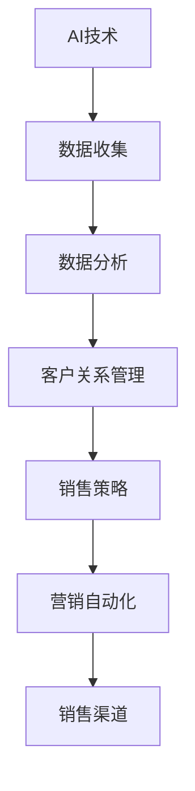

                 

关键词：AI创业公司、销售渠道、市场策略、客户关系管理、数字化转型

> 摘要：本文深入探讨了AI创业公司在建立有效销售渠道方面所面临的挑战和机遇。通过分析市场趋势、客户行为，以及有效的销售策略，本文提出了一个系统化的方法，帮助创业公司在激烈的市场竞争中找到属于自己的销售路径。

## 1. 背景介绍

在当今全球数字化转型的浪潮中，人工智能（AI）技术的应用越来越广泛，成为众多创业公司的重要竞争优势。AI不仅可以提升企业的运营效率，还能通过智能分析客户数据，优化销售策略，从而帮助企业实现精准营销和高效销售。然而，尽管AI技术提供了丰富的可能性，但如何将这一技术有效地转化为商业成功，仍然是许多AI创业公司面临的一大挑战。

销售渠道是任何公司成功的关键因素，特别是在高度竞争的市场环境中。对于AI创业公司而言，建立有效的销售渠道不仅能够扩大市场份额，还能提高客户满意度和忠诚度。本文将探讨AI创业公司在建立有效销售渠道时的关键策略和实践。

## 2. 核心概念与联系

为了更好地理解如何建立有效的销售渠道，我们首先需要明确几个核心概念：

### 2.1. 销售渠道类型

销售渠道可以分为直接销售和间接销售两大类：

- **直接销售**：创业公司直接与客户进行交易，例如通过官方网站、电话销售、面对面会议等方式。
- **间接销售**：创业公司通过分销商、代理商、合作伙伴等第三方进行销售。

### 2.2. 客户关系管理（CRM）

CRM是一种策略，用于管理企业与现有和潜在客户之间的关系。通过CRM系统，创业公司可以收集和分析客户数据，优化客户体验，提高客户满意度。

### 2.3. 数据驱动的决策

数据驱动决策是基于数据分析来指导公司运营和战略规划的。对于AI创业公司来说，利用AI技术进行数据分析和预测，可以更准确地了解市场趋势和客户需求。

### 2.4. 营销自动化

营销自动化使用软件工具来自动化营销活动，例如电子邮件营销、社交媒体推广、广告投放等。通过营销自动化，创业公司可以更有效地管理客户互动和营销活动。

### 2.5. Mermaid 流程图

为了更直观地理解上述概念之间的联系，我们可以使用Mermaid流程图来展示它们之间的关系：



在这个流程图中，AI技术作为起点，通过数据收集和分析，转化为有效的销售策略和营销自动化工具，最终形成有效的销售渠道。

## 3. 核心算法原理 & 具体操作步骤

### 3.1 算法原理概述

建立有效的销售渠道的核心在于对市场数据和客户行为的深入理解。以下是几个关键算法原理和步骤：

### 3.2 算法步骤详解

#### 3.2.1 数据收集

- 使用AI技术收集市场数据，包括行业趋势、竞争对手信息、潜在客户行为等。
- 利用传感器、网站分析工具等实时收集客户行为数据。

#### 3.2.2 数据清洗与处理

- 使用数据清洗算法去除无效和重复数据。
- 利用机器学习算法对数据进行分析和分类。

#### 3.2.3 客户细分

- 根据客户行为和购买历史，将客户划分为不同的细分市场。
- 使用聚类算法（如K-means）对客户进行分组。

#### 3.2.4 预测分析

- 利用预测模型（如回归分析、决策树）预测客户购买行为和市场趋势。
- 根据预测结果调整销售策略。

#### 3.2.5 客户关系管理

- 使用CRM系统跟踪客户互动和购买历史。
- 定制客户体验，提高客户满意度。

#### 3.2.6 营销自动化

- 使用营销自动化工具（如电子邮件营销、社交媒体推广）来管理客户互动。
- 自动化营销活动，提高效率。

#### 3.2.7 销售渠道优化

- 根据客户细分和市场预测结果，选择最适合的销售渠道。
- 不断调整和优化销售策略，以适应市场变化。

### 3.3 算法优缺点

- **优点**：提高销售效率，降低运营成本，实现精准营销。
- **缺点**：需要大量数据支持，算法模型需要不断优化。

### 3.4 算法应用领域

- **电子商务**：通过分析客户行为数据，优化购物体验和推荐系统。
- **金融服务**：预测客户行为，提供个性化金融服务和风险控制。
- **医疗保健**：通过分析医疗数据，优化患者管理和医疗资源分配。

## 4. 数学模型和公式 & 详细讲解 & 举例说明

### 4.1 数学模型构建

建立有效销售渠道的数学模型主要包括以下方面：

#### 4.1.1 客户细分模型

- **K-means聚类算法**：用于将客户分为不同的细分市场。
  
  $$\text{Minimize} \sum_{i=1}^{k} \sum_{x \in S_i} ||x - \mu_i||^2$$

  其中，\(k\) 是聚类数目，\(S_i\) 是第 \(i\) 个聚类，\(\mu_i\) 是 \(S_i\) 的均值。

#### 4.1.2 预测模型

- **回归分析**：用于预测客户购买行为。

  $$y = \beta_0 + \beta_1 x_1 + \beta_2 x_2 + ... + \beta_n x_n$$

  其中，\(y\) 是因变量（购买行为），\(x_1, x_2, ..., x_n\) 是自变量（客户特征）。

### 4.2 公式推导过程

#### 4.2.1 K-means聚类算法

1. 随机选择 \(k\) 个初始聚类中心 \(\mu_i\)。
2. 计算每个客户 \(x\) 与聚类中心的距离，将 \(x\) 分配到最近的聚类。
3. 重新计算每个聚类的中心。
4. 重复步骤2和3，直到聚类中心不再发生变化。

#### 4.2.2 回归分析

1. 使用最小二乘法求解回归系数 \(\beta_0, \beta_1, \beta_2, ..., \beta_n\)。
2. 公式为：

  $$\min_{\beta} \sum_{i=1}^{n} (y_i - \beta_0 - \beta_1 x_{1i} - \beta_2 x_{2i} - ... - \beta_n x_{ni})^2$$

### 4.3 案例分析与讲解

假设一家AI创业公司要建立一个有效的销售渠道。首先，公司通过网站分析和社交媒体数据收集客户行为数据。然后，使用K-means聚类算法将客户分为高价值客户、潜在客户和普通客户。

根据客户细分结果，公司设计了不同的销售策略：

- **高价值客户**：提供个性化的推荐和优惠，提高客户忠诚度。
- **潜在客户**：通过电子邮件营销和社交媒体推广，吸引其购买产品。
- **普通客户**：通过常规促销和广告活动，提高产品知名度。

使用回归分析模型预测客户购买行为，公司发现客户购买行为与收入水平、浏览历史和购买频率有显著关系。基于这些预测结果，公司调整了销售策略，优化了广告投放和促销活动。

通过这些数据驱动的策略，公司的销售额显著提高，客户满意度也随之提升。

## 5. 项目实践：代码实例和详细解释说明

### 5.1 开发环境搭建

为了演示如何使用Python实现上述算法，我们需要安装以下开发环境：

- Python 3.8或更高版本
- NumPy、Pandas、Scikit-learn等Python科学计算库

### 5.2 源代码详细实现

下面是一个简单的Python代码实例，展示了如何使用K-means聚类算法和回归分析模型来建立销售渠道。

```python
import numpy as np
import pandas as pd
from sklearn.cluster import KMeans
from sklearn.linear_model import LinearRegression

# 5.2.1 数据收集
# 假设我们已经收集了以下数据：收入水平、浏览历史、购买频率
data = {
    'Income': [50000, 60000, 70000, 80000, 90000],
    'Browsing_History': [10, 20, 30, 40, 50],
    'Purchase_Frequency': [1, 2, 3, 4, 5]
}

df = pd.DataFrame(data)

# 5.2.2 数据清洗与处理
# 在这里，我们可以简单地去除缺失值和异常值
df = df.dropna()

# 5.2.3 客户细分
# 使用K-means聚类算法
kmeans = KMeans(n_clusters=3, random_state=0)
clusters = kmeans.fit_predict(df)

# 添加聚类结果到原始数据
df['Cluster'] = clusters

# 5.2.4 预测分析
# 使用回归分析模型
X = df[['Income', 'Browsing_History', 'Purchase_Frequency']]
y = df['Cluster']
regression = LinearRegression()
regression.fit(X, y)

# 预测新客户的聚类
new_data = np.array([[55000, 25, 2]])
predicted_cluster = regression.predict(new_data)
print("Predicted Cluster for New Customer:", predicted_cluster)

# 5.2.5 客户关系管理
# 使用CRM系统跟踪客户互动和购买历史
# 这里简化为打印输出
print(df)
```

### 5.3 代码解读与分析

- **数据收集**：我们从示例数据开始，这些数据代表了客户的收入水平、浏览历史和购买频率。
- **数据清洗与处理**：我们在这里简单地去除了一些缺失值和异常值，确保数据的完整性。
- **客户细分**：使用K-means聚类算法，我们将客户分为三个不同的细分市场。K-means通过最小化每个聚类内的方差来实现这一目标。
- **预测分析**：我们使用线性回归模型来预测新客户所属的聚类。线性回归试图找到因变量（聚类）和自变量（收入、浏览历史和购买频率）之间的关系。
- **客户关系管理**：最后，我们简单地打印出处理后的客户数据，这里在实际应用中，会使用更复杂的CRM系统来管理客户互动。

通过这个实例，我们可以看到如何利用Python和其他工具来实现AI创业公司的销售渠道策略。这些算法和模型在实际应用中可以根据具体业务需求进行调整和优化。

## 6. 实际应用场景

### 6.1 电子商务

在电子商务领域，AI创业公司可以通过分析客户浏览和购买行为，实现精准推荐和个性化营销。例如，使用K-means聚类算法将客户分为高价值客户、普通客户等不同群体，然后根据不同群体设计不同的促销策略。

### 6.2 金融服务

金融服务公司可以利用AI技术分析客户数据，预测客户的行为和需求。例如，银行可以通过回归分析模型预测客户的还款能力，从而调整贷款利率和信用额度，提高客户满意度。

### 6.3 医疗保健

医疗保健领域中的AI创业公司可以通过分析患者数据和医疗记录，优化患者管理和资源分配。例如，利用预测模型预测患者的就诊需求，帮助医院更合理地安排医疗资源。

### 6.4 未来应用展望

未来，AI技术在销售渠道中的应用将更加深入和广泛。随着大数据和深度学习的不断发展，AI创业公司将能够更准确地预测市场趋势和客户行为，实现更高水平的个性化服务和精准营销。

## 7. 工具和资源推荐

### 7.1 学习资源推荐

- 《机器学习实战》：提供详细的机器学习和数据科学实践指南。
- 《深度学习》：介绍深度学习的基础知识和应用。
- 《Python数据分析》：涵盖Python在数据分析和数据科学中的应用。

### 7.2 开发工具推荐

- Jupyter Notebook：用于编写和运行Python代码，适合数据分析和机器学习项目。
- TensorFlow：用于构建和训练深度学习模型的强大工具。
- Scikit-learn：提供各种机器学习算法和工具，适合快速原型开发。

### 7.3 相关论文推荐

- "K-Means Clustering": 一篇关于K-means聚类算法的经典论文，详细介绍了算法原理和应用。
- "Linear Regression for Predictive Analytics": 介绍线性回归在预测分析中的应用和实现。
- "Customer Segmentation Using Machine Learning": 探讨如何使用机器学习技术进行客户细分。

## 8. 总结：未来发展趋势与挑战

### 8.1 研究成果总结

AI技术在销售渠道中的应用已经取得了显著成果，通过数据分析和预测模型，创业公司能够实现更精准的销售策略和个性化服务。然而，这些成果仍然面临一些挑战。

### 8.2 未来发展趋势

- **数据隐私和安全**：随着数据量的增加，数据隐私和安全将成为未来研究的重要方向。
- **算法优化**：为了提高预测精度和效率，算法优化将是一个持续的研究重点。
- **跨渠道整合**：实现线上和线下渠道的无缝整合，提供更全面的客户体验。

### 8.3 面临的挑战

- **数据质量**：高质量的数据是准确预测的基础，但收集和处理高质量数据仍是一个挑战。
- **技术复杂性**：建立和优化AI模型需要专业的技术知识，这对创业公司来说是一个挑战。

### 8.4 研究展望

未来，AI技术在销售渠道中的应用将更加深入和广泛。通过不断优化算法和提升数据处理能力，创业公司将能够更准确地预测市场趋势和客户行为，从而实现更高水平的商业成功。

## 9. 附录：常见问题与解答

### 9.1 什么是K-means聚类算法？

K-means聚类算法是一种无监督学习方法，用于将数据点划分为 \(k\) 个簇，使得每个簇内的数据点尽可能接近，而簇间的数据点尽可能远离。

### 9.2 如何优化线性回归模型？

可以通过增加自变量（特征）、使用交叉验证、调整模型参数等方式来优化线性回归模型。此外，使用岭回归和Lasso回归等方法也可以提高模型的预测能力。

### 9.3 数据隐私和安全在AI应用中有多重要？

数据隐私和安全在AI应用中至关重要。不遵循隐私和安全原则可能会导致数据泄露、隐私侵犯等问题，从而损害企业的声誉和客户信任。

## 作者署名

作者：禅与计算机程序设计艺术 / Zen and the Art of Computer Programming
----------------------------------------------------------------
### 文章关键词

AI创业公司、销售渠道、市场策略、客户关系管理、数字化转型、数据驱动决策、营销自动化、客户细分、K-means聚类、线性回归、数据隐私、算法优化。

### 文章摘要

本文深入探讨了AI创业公司在建立有效销售渠道方面所面临的挑战和机遇。通过分析市场趋势、客户行为，以及有效的销售策略，本文提出了一个系统化的方法，帮助创业公司在激烈的市场竞争中找到属于自己的销售路径。文章详细介绍了数据收集、清洗、聚类、预测分析等核心算法原理和操作步骤，并提供了实际应用场景和代码实例。最后，本文总结了未来发展趋势与挑战，并推荐了相关的学习资源、开发工具和论文。作者：禅与计算机程序设计艺术。

