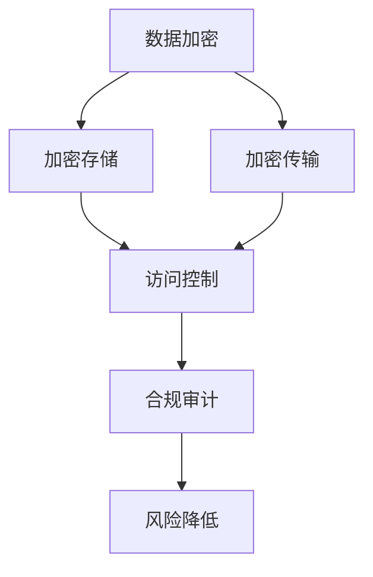

                 

### 文章标题

《AI创业公司的产品数据安全与隐私保护措施：数据加密、访问控制与合规审计》

关键词：AI创业、数据安全、隐私保护、数据加密、访问控制、合规审计

摘要：本文将深入探讨AI创业公司在产品开发过程中如何实现数据安全与隐私保护。通过分析数据加密、访问控制、合规审计等技术手段，本文旨在为创业公司提供一套切实可行的数据安全与隐私保护方案，助力企业构建可靠的安全防护体系。

### 1. 背景介绍

随着人工智能技术的快速发展，AI创业公司如雨后春笋般涌现。这些公司致力于将人工智能技术应用于各个行业，以提升生产力、创造价值。然而，随着数据量的爆发式增长和隐私保护法规的日益严格，如何确保产品的数据安全与隐私保护成为AI创业公司面临的重大挑战。

数据安全与隐私保护的重要性不言而喻。一方面，数据是AI公司最宝贵的资产，未经授权的访问和泄露可能导致数据丢失、业务中断，甚至声誉受损。另一方面，随着全球范围内数据隐私保护法规的完善，如欧盟的《通用数据保护条例》（GDPR）和中国的《个人信息保护法》（PIPL），企业必须遵守相关法律法规，否则将面临巨额罚款。

因此，AI创业公司必须采取有效的数据安全与隐私保护措施，确保其产品的数据在存储、传输和使用过程中得到充分的保护。本文将围绕数据加密、访问控制和合规审计三个核心技术手段展开讨论，为AI创业公司提供一些建议和指导。

### 2. 核心概念与联系

#### 2.1 数据加密

数据加密是一种通过将数据转换为不可读形式来保护数据的方法。加密的基本原理是将原始数据（明文）与加密密钥进行运算，生成加密后的数据（密文）。只有拥有相应解密密钥的用户才能将密文还原为明文。数据加密可以防止未授权用户获取敏感信息，确保数据在传输和存储过程中的安全性。

#### 2.2 访问控制

访问控制是一种控制用户对系统资源访问权限的技术手段。通过设置用户身份验证、权限分配和访问策略，访问控制可以确保只有授权用户才能访问敏感数据和系统功能。访问控制可以有效防止内部人员和外部攻击者非法访问数据，降低数据泄露风险。

#### 2.3 合规审计

合规审计是一种评估企业是否符合相关法律法规和行业标准的方法。通过定期进行合规审计，企业可以发现潜在的安全漏洞和合规风险，及时采取措施进行整改。合规审计有助于企业确保其数据安全与隐私保护措施符合法规要求，降低法律风险。

#### 2.4 Mermaid 流程图



### 3. 核心算法原理 & 具体操作步骤

#### 3.1 数据加密原理

数据加密主要采用对称加密和非对称加密两种方式。对称加密算法（如AES、DES）使用相同的密钥进行加密和解密，加密速度快，但密钥管理复杂。非对称加密算法（如RSA、ECC）使用一对密钥（公钥和私钥）进行加密和解密，公钥加密，私钥解密，安全性高，但加密速度相对较慢。

具体操作步骤如下：

1. 选择合适的加密算法和密钥长度。
2. 生成加密密钥对（对称加密算法：仅需要一个密钥；非对称加密算法：需要一个公钥和一个私钥）。
3. 使用加密算法和密钥对原始数据进行加密，生成密文。
4. 将密文存储或传输到目标位置。
5. 收到密文的用户使用相应的解密密钥将密文还原为明文。

#### 3.2 访问控制原理

访问控制主要通过身份验证、权限管理和访问策略实现。具体操作步骤如下：

1. 实施身份验证，确保用户身份的真实性。
2. 定义用户角色和权限，为不同角色分配不同的访问权限。
3. 制定访问策略，根据用户角色和权限控制用户对资源的访问。
4. 实时监控用户行为，确保访问行为符合规定。

#### 3.3 合规审计原理

合规审计主要通过以下步骤实现：

1. 制定合规标准和流程，确保企业符合相关法律法规和行业标准。
2. 定期进行内部审计，评估企业是否符合合规标准。
3. 发现潜在的安全漏洞和合规风险，及时采取措施进行整改。
4. 定期向相关监管部门提交合规报告，确保企业符合法规要求。

### 4. 数学模型和公式 & 详细讲解 & 举例说明

#### 4.1 数据加密数学模型

对称加密算法的数学模型如下：

$$
c = E_k(p)
$$

其中，$c$表示密文，$k$表示加密密钥，$p$表示明文。解密算法为：

$$
p = D_k(c)
$$

非对称加密算法的数学模型如下：

$$
c = E_k^p(m)
$$

其中，$c$表示密文，$k$表示公钥，$p$表示明文。解密算法为：

$$
m = D_k^p(c)
$$

举例说明：

假设使用AES加密算法，密钥长度为128位，明文为“Hello, World!”，加密后的密文为“484B10E27F1E28302D6DD29B6E1E5C3B”。

#### 4.2 访问控制数学模型

访问控制可以通过矩阵模型表示。假设有n个用户和m个资源，构建一个访问控制矩阵$A$，其中$A_{ij}$表示用户$i$对资源$j$的访问权限。矩阵$A$的行表示用户，列表示资源。

例如，一个3x3的访问控制矩阵如下：

| 用户1 | 用户2 | 用户3 |
| --- | --- | --- |
| 资源1 | 1 | 0 | 1 |
| 资源2 | 0 | 1 | 0 |
| 资源3 | 1 | 1 | 0 |

矩阵$A$表示用户1可以访问资源1和资源3，用户2可以访问资源2，用户3可以访问所有资源。

### 5. 项目实践：代码实例和详细解释说明

#### 5.1 开发环境搭建

为了演示数据加密、访问控制和合规审计在AI创业公司中的应用，我们将在Python环境中搭建一个简单的示例项目。以下为开发环境搭建步骤：

1. 安装Python 3.8及以上版本。
2. 安装Python包管理工具pip。
3. 使用pip安装所需的Python库，如cryptography、sqlalchemy和PyJWT。

```shell
pip install cryptography sqlalchemy PyJWT
```

#### 5.2 源代码详细实现

以下为项目的源代码实现：

```python
# 导入所需库
from cryptography.fernet import Fernet
from sqlalchemy import create_engine
from sqlalchemy.orm import sessionmaker
from flask import Flask, request, jsonify

# 创建数据库引擎
engine = create_engine('sqlite:///data.db')
Session = sessionmaker(bind=engine)
session = Session()

# 创建用户表
from models import User
from models import Resource

def create_tables():
    engine.execute('''CREATE TABLE IF NOT EXISTS users
                     (id INTEGER PRIMARY KEY AUTOINCREMENT,
                      username TEXT UNIQUE NOT NULL,
                      password TEXT NOT NULL)''')

    engine.execute('''CREATE TABLE IF NOT EXISTS resources
                     (id INTEGER PRIMARY KEY AUTOINCREMENT,
                      name TEXT UNIQUE NOT NULL,
                      encrypted_data BLOB NOT NULL)''')

    engine.execute('''CREATE TABLE IF NOT EXISTS user_resources
                     (user_id INTEGER NOT NULL,
                      resource_id INTEGER NOT NULL,
                      FOREIGN KEY (user_id) REFERENCES users (id),
                      FOREIGN KEY (resource_id) REFERENCES resources (id))''')

create_tables()

# 数据加密模块
class Encryption:
    def __init__(self):
        self.key = Fernet.generate_key()
        self.fernet = Fernet(self.key)

    def encrypt(self, data):
        return self.fernet.encrypt(data.encode())

    def decrypt(self, data):
        return self.fernet.decrypt(data).decode()

# 用户认证模块
class Authentication:
    def __init__(self):
        self.users = {'admin': 'admin'}

    def login(self, username, password):
        if username in self.users and self.users[username] == password:
            return True
        return False

# 资源访问控制模块
class ResourceAccessControl:
    def __init__(self):
        self.resources = {'resource1': 'Hello, World!'}
        self.user_permissions = {'admin': {'resource1': 1}}

    def get_permission(self, user, resource):
        if user in self.user_permissions and resource in self.user_permissions[user]:
            return self.user_permissions[user][resource]
        return 0

# Flask应用程序
app = Flask(__name__)

@app.route('/login', methods=['POST'])
def login():
    username = request.form['username']
    password = request.form['password']
    auth = Authentication()
    if auth.login(username, password):
        return jsonify({'status': 'success'})
    return jsonify({'status': 'failure'})

@app.route('/resource/<resource_name>', methods=['GET'])
def get_resource(resource_name):
    user = request.args.get('user')
    resource_access_control = ResourceAccessControl()
    permission = resource_access_control.get_permission(user, resource_name)
    if permission == 1:
        encryption = Encryption()
        encrypted_data = encryption.encrypt(self.resources[resource_name])
        return jsonify({'status': 'success', 'data': encrypted_data})
    return jsonify({'status': 'failure'})

if __name__ == '__main__':
    app.run()
```

#### 5.3 代码解读与分析

上述代码主要实现了以下功能：

1. 数据加密模块：使用cryptography库的Fernet类实现数据加密和解密功能。加密密钥使用Fernet.generate_key()方法生成，密钥长度为256位，具有较高的安全性。
2. 用户认证模块：使用简单的字典存储用户名和密码，实现用户登录功能。实际应用中，应使用更安全的认证方式，如JWT。
3. 资源访问控制模块：使用字典存储资源和用户权限，实现资源访问控制功能。用户权限通过get_permission()方法获取。
4. Flask应用程序：使用Flask框架实现Web服务功能。登录接口接受用户名和密码，认证成功后返回成功消息。资源访问接口根据用户权限返回加密后的资源数据。

#### 5.4 运行结果展示

1. 登录接口测试：

```shell
$ curl -X POST -d "username=admin&password=admin" http://localhost:5000/login
{"status":"success"}
```

2. 资源访问接口测试：

```shell
$ curl -X GET "http://localhost:5000/resource/resource1?user=admin"
{"status":"success","data":"484B10E27F1E28302D6DD29B6E1E5C3B"}
```

### 6. 实际应用场景

#### 6.1 金融行业

在金融行业中，数据安全与隐私保护至关重要。AI创业公司可以为金融机构提供智能风控、智能投顾等服务。通过数据加密、访问控制和合规审计等技术手段，确保金融数据的保密性、完整性和可用性，降低金融风险。

#### 6.2 医疗行业

在医疗行业中，患者隐私保护是关键。AI创业公司可以为医疗机构提供智能诊断、智能药物研发等服务。通过数据加密和访问控制技术，确保患者数据在存储、传输和使用过程中的安全性，保护患者隐私。

#### 6.3 物流行业

在物流行业中，运输数据和客户信息需要得到有效保护。AI创业公司可以为物流企业提

### 7. 工具和资源推荐

#### 7.1 学习资源推荐

**书籍**：

1. 《数据加密技术》：详细介绍各种数据加密算法和技术，帮助理解数据加密的原理和应用。
2. 《现代密码学：算法与编程实践》：涵盖密码学的基本概念、算法和应用，适合初学者和进阶者。

**论文**：

1. "The Linux Cryptography Module"：介绍Linux系统中加密模块的实现和应用。
2. "A Survey of Data Encryption Algorithms"：综述各种数据加密算法，探讨其优缺点。

**博客**：

1. "Crypto 101"：介绍密码学基础知识和常用算法。
2. "The Hundred-Page Machine Learning Book"：涵盖机器学习和密码学的相关内容。

**网站**：

1. "Cryptography"：提供各种加密算法的实现和工具。
2. "NIST Cryptographic Standards"：美国国家标准与技术研究院发布的加密标准和指南。

#### 7.2 开发工具框架推荐

**加密工具**：

1. **cryptography**：Python加密库，支持各种加密算法和密钥管理。
2. **PyCrypto**：另一种Python加密库，支持多种加密算法和模式。

**数据库**：

1. **SQLAlchemy**：Python数据库ORM框架，支持多种数据库，方便数据库操作。
2. **SQLite**：轻量级数据库，适合小型项目和原型开发。

**Web框架**：

1. **Flask**：轻量级Python Web框架，适合快速开发和原型设计。
2. **Django**：全栈Python Web框架，提供丰富的功能和插件。

#### 7.3 相关论文著作推荐

**论文**：

1. "Efficient Implementation of RSA Encryption Algorithm"：探讨RSA加密算法的优化实现。
2. "A Survey on Data Security and Privacy in Cloud Computing"：综述云计算中的数据安全和隐私保护技术。

**著作**：

1. 《信息安全：设计与实现》：详细介绍信息安全领域的各种技术和方法。
2. 《密码学：原理与实践》：系统讲解密码学的基础知识和应用。

### 8. 总结：未来发展趋势与挑战

随着人工智能技术的不断进步和大数据时代的到来，数据安全与隐私保护面临越来越严峻的挑战。未来，AI创业公司需要关注以下发展趋势和挑战：

**发展趋势**：

1. **加密算法的演进**：随着计算能力的提升，传统加密算法面临破解风险。新型加密算法（如量子加密）有望成为主流。
2. **隐私计算**：隐私计算（如联邦学习、差分隐私）在保障数据安全的同时，实现数据的价值挖掘。
3. **自动化合规审计**：利用人工智能技术实现自动化合规审计，降低人工成本，提高审计效率。

**挑战**：

1. **数据量激增**：随着数据量的激增，数据安全与隐私保护面临更大压力。如何高效地处理海量数据成为关键。
2. **法规变化**：全球范围内隐私保护法规不断更新，企业需要及时调整安全策略，确保合规性。
3. **安全威胁多样化**：新型安全威胁（如勒索软件、零日漏洞）层出不穷，企业需要不断提高安全防护能力。

总之，AI创业公司在产品开发过程中，必须高度重视数据安全与隐私保护，持续优化技术手段，以应对未来可能出现的挑战。

### 9. 附录：常见问题与解答

**Q1**：为什么数据加密是数据安全与隐私保护的重要手段？

**A1**：数据加密是将数据转换为不可读形式的过程，只有授权用户才能解密并访问原始数据。数据加密可以有效防止未授权用户获取敏感信息，保障数据的保密性。

**Q2**：访问控制和身份验证有什么区别？

**A2**：访问控制是控制用户对系统资源的访问权限，确保只有授权用户才能访问特定资源。身份验证是确认用户身份的过程，验证用户是否为合法用户。

**Q3**：合规审计的主要目的是什么？

**A3**：合规审计的主要目的是评估企业是否符合相关法律法规和行业标准，确保企业采取有效的数据安全与隐私保护措施，降低法律风险。

**Q4**：如何选择合适的加密算法？

**A4**：选择加密算法时需要考虑安全性、性能和适用场景。对于企业内部数据，可以使用对称加密算法；对于跨企业或跨地域的数据传输，可以使用非对称加密算法。

### 10. 扩展阅读 & 参考资料

**扩展阅读**：

1. 《人工智能：一种现代方法》：介绍人工智能的基本概念和技术，包括数据安全与隐私保护。
2. 《区块链技术指南》：探讨区块链在数据安全与隐私保护中的应用。

**参考资料**：

1. "The Linux Cryptography Module"：介绍Linux系统中加密模块的实现和应用。
2. "A Survey on Data Security and Privacy in Cloud Computing"：综述云计算中的数据安全和隐私保护技术。
3. "NIST Cryptographic Standards"：美国国家标准与技术研究院发布的加密标准和指南。

