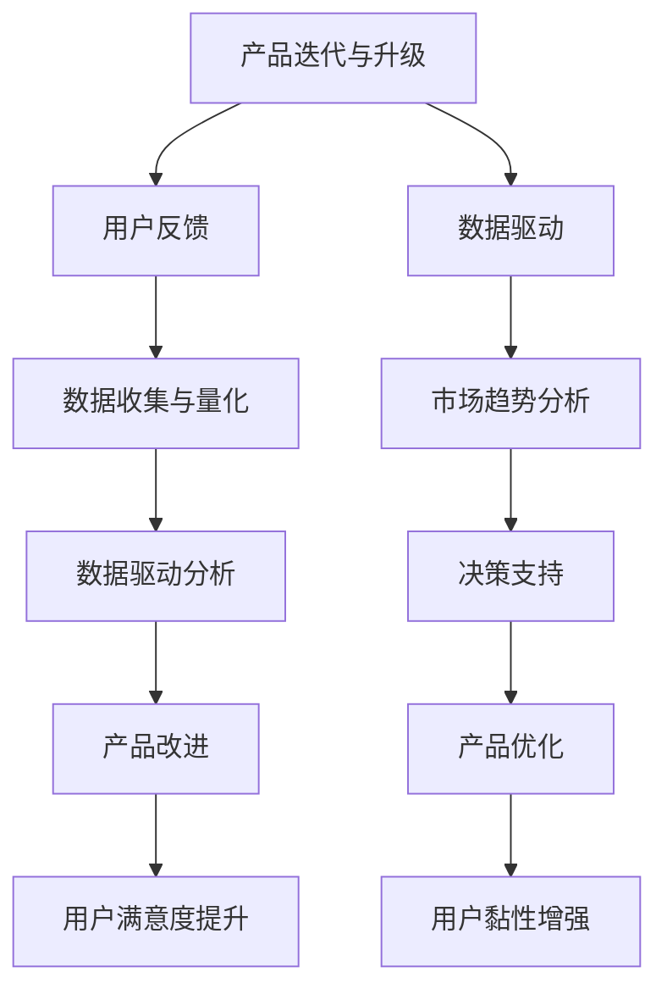

                 

### 背景介绍

AI（人工智能）作为当前科技发展的重要方向，已经在各行各业中展现出巨大的潜力。随着大数据、云计算、深度学习等技术的不断成熟，越来越多的创业公司投身于AI领域的探索与开发。然而，AI创业公司在产品迭代与升级过程中，常常面临诸多挑战。如何有效地收集用户反馈、利用数据驱动产品改进，成为创业公司成功的关键因素。

用户反馈与数据驱动在产品迭代与升级中扮演着至关重要的角色。用户反馈能够帮助企业了解用户的真实需求和满意度，从而对产品进行针对性的调整和优化。而数据驱动则通过分析大量的用户数据，挖掘出潜在的趋势和问题，为产品的改进提供科学依据。两者结合，不仅能够提升产品的竞争力，还能增强用户黏性，提高市场占有率。

本文将围绕AI创业公司的产品迭代与升级策略，探讨用户反馈与数据驱动的应用。首先，我们将介绍产品迭代与升级的基本概念和过程。接着，深入分析用户反馈的重要性及其收集方法。随后，将介绍如何通过数据驱动实现产品优化。最后，结合实际案例，展示这些策略在AI创业公司中的应用效果。通过本文的阅读，希望能够为AI创业公司在产品迭代与升级方面提供一些有益的启示和参考。

### 2. 核心概念与联系

在深入探讨AI创业公司的产品迭代与升级策略之前，有必要先明确一些核心概念和它们之间的联系。

#### 2.1 产品迭代与升级

产品迭代是指通过不断的小幅改进和优化，使产品逐步提升其功能和性能。这种迭代通常是一个持续的过程，旨在不断满足用户需求，解决现有问题，并适应市场变化。产品升级则是指对产品进行较大的改进和更新，通常涉及新功能的引入、性能的提升以及用户体验的优化。

产品迭代与升级之间存在着紧密的联系。迭代是升级的基石，通过不断的迭代，产品能够逐渐积累改进，为升级奠定基础。而升级则是迭代的终极目标，通过升级，产品能够实现质的飞跃，满足更高层次的用户需求。

#### 2.2 用户反馈

用户反馈是指用户在使用产品过程中，对产品的体验、功能和性能等方面的评价和意见。用户反馈对于产品迭代与升级具有重要意义。首先，用户反馈能够帮助识别产品存在的问题和不足，从而进行针对性的改进。其次，用户反馈能够提供用户真实的需求和期望，指导产品发展方向。最后，用户反馈还能够提高用户满意度，增强用户对产品的忠诚度。

#### 2.3 数据驱动

数据驱动是指通过数据分析和挖掘，指导产品决策和优化的一种方法。数据驱动在产品迭代与升级中具有重要作用。通过数据收集和分析，企业能够了解用户行为、市场趋势和产品性能，从而做出科学、合理的决策。数据驱动不仅能够提高产品改进的效率，还能降低决策风险。

#### 2.4 数据驱动与用户反馈的关系

数据驱动与用户反馈之间存在着密切的联系和互动。用户反馈能够提供定性的信息，而数据驱动则能够提供定量的支持。两者结合，能够更全面、准确地指导产品改进。

首先，用户反馈可以通过数据驱动的手段进行量化分析，从而发现用户反馈中的共性和规律。这些量化数据能够为产品改进提供具体的依据。

其次，数据驱动分析结果可以为用户反馈提供解释和支持。例如，当用户反馈产品功能不足时，数据驱动的分析结果可以揭示该功能在用户群体中的使用频率和重要性，从而为功能改进提供依据。

最后，用户反馈和数据驱动分析结果可以相互验证和补充。用户反馈可以验证数据驱动分析的准确性，而数据驱动分析结果可以补充用户反馈中的不足。

#### 2.5 Mermaid 流程图

为了更好地理解上述核心概念和它们之间的联系，我们使用Mermaid流程图来展示产品迭代与升级、用户反馈和数据驱动的交互过程。



通过上述流程图，我们可以看到，产品迭代与升级、用户反馈和数据驱动相互影响、相互促进，共同推动产品的不断改进和优化。

#### 2.6 关键概念关系总结

- 产品迭代与升级是产品发展的基础，通过不断的小幅改进和优化，提升产品的功能和性能。
- 用户反馈是产品迭代与升级的重要驱动力，通过收集和分析用户反馈，发现产品存在的问题和不足。
- 数据驱动是通过数据分析和挖掘，指导产品决策和优化的一种方法，能够提高产品改进的效率和科学性。
- 用户反馈和数据驱动的结合，能够更全面、准确地指导产品改进，提高用户满意度，增强用户黏性。

通过上述核心概念和关系的理解，我们可以更好地把握AI创业公司的产品迭代与升级策略，从而实现产品的持续发展和竞争力的提升。

### 3. 核心算法原理 & 具体操作步骤

在明确了产品迭代与升级、用户反馈和数据驱动的核心概念之后，接下来我们将深入探讨如何利用这些概念，通过核心算法原理和具体操作步骤，实现产品的持续改进和优化。

#### 3.1 数据收集与处理

数据收集是产品迭代与升级的基础。创业公司需要从多个渠道收集用户数据，包括用户行为数据、反馈数据和业务数据等。具体操作步骤如下：

1. **用户行为数据收集**：通过埋点技术，收集用户在产品中的操作行为，如页面访问次数、功能使用频率、操作时间等。
2. **反馈数据收集**：通过在线调查、用户访谈、反馈表单等方式，收集用户对产品的意见和建议。
3. **业务数据收集**：从企业内部系统中获取销售数据、用户留存数据、市场反馈数据等。

收集到的数据通常包含噪声和错误，因此需要进行预处理。预处理步骤包括数据清洗、去重、填充缺失值等，以确保数据的质量和一致性。

#### 3.2 用户反馈分析

用户反馈分析是挖掘用户需求、识别产品问题的重要步骤。具体操作步骤如下：

1. **文本分类与聚类**：利用自然语言处理（NLP）技术，将用户反馈文本进行分类和聚类，识别出高频问题和用户关注点。
2. **情感分析**：通过情感分析技术，判断用户反馈的情感倾向，如正面、中性或负面，了解用户对产品的整体满意度。
3. **用户反馈可视化**：使用数据可视化工具，将用户反馈数据以图表形式展示，便于分析和理解。

#### 3.3 数据驱动的产品优化

在用户反馈分析的基础上，通过数据驱动的产品优化，可以实现产品的持续改进和优化。具体操作步骤如下：

1. **目标设定**：根据用户反馈和市场趋势，设定产品优化目标，如提升用户体验、增加用户留存率等。
2. **A/B测试**：通过A/B测试，验证不同设计方案对用户行为和满意度的影响，选择最优方案。
3. **机器学习模型**：利用机器学习算法，建立用户行为预测模型和个性化推荐模型，优化产品功能和用户体验。
4. **持续迭代**：根据数据驱动的反馈，不断调整和优化产品，实现产品的持续改进。

#### 3.4 数据分析工具与技术

为了高效地进行数据收集、分析和优化，创业公司可以采用以下数据分析工具和技术：

1. **数据仓库与大数据平台**：如Hadoop、Spark等，用于存储和处理海量数据。
2. **数据可视化工具**：如Tableau、Power BI等，用于展示和分析数据。
3. **自然语言处理（NLP）工具**：如NLTK、spaCy等，用于文本分类、情感分析和文本挖掘。
4. **机器学习框架**：如TensorFlow、PyTorch等，用于构建和训练机器学习模型。

#### 3.5 核心算法原理

在数据驱动的产品优化过程中，涉及多个核心算法原理，主要包括以下几种：

1. **回归分析**：用于预测用户行为和需求，如用户留存预测、购买概率预测等。
2. **聚类分析**：用于用户群体划分和细分市场，如用户分群、产品推荐等。
3. **协同过滤**：用于个性化推荐，如商品推荐、内容推荐等。
4. **决策树与随机森林**：用于分类和回归任务，如用户行为预测、信用评分等。

通过上述核心算法原理和具体操作步骤，创业公司可以有效地收集用户反馈，利用数据驱动实现产品的持续改进和优化。这不仅能够提升产品的竞争力，还能增强用户满意度和市场占有率。

### 4. 数学模型和公式 & 详细讲解 & 举例说明

在产品迭代与升级过程中，数学模型和公式发挥着重要作用，它们为我们提供了一种量化分析的方法，以更好地理解用户行为和需求，从而进行科学的决策。以下将详细介绍几种常用的数学模型和公式，并结合实际案例进行讲解。

#### 4.1 回归分析

回归分析是用于预测和解释变量之间关系的一种重要统计方法。常见的回归分析包括线性回归、多项式回归和逻辑回归等。以下以线性回归为例进行详细讲解。

**线性回归模型公式**：
\[ y = \beta_0 + \beta_1x + \epsilon \]

其中，\( y \) 为因变量，\( x \) 为自变量，\( \beta_0 \) 和 \( \beta_1 \) 分别为截距和斜率，\( \epsilon \) 为误差项。

**举例说明**：

假设我们想预测某个电商平台的用户购买金额，已知用户购买频率和消费能力对购买金额有显著影响。我们可以建立如下线性回归模型：

\[ 购买金额 = \beta_0 + \beta_1 \times 购买频率 + \beta_2 \times 消费能力 + \epsilon \]

通过收集大量用户数据，我们得到以下回归系数：

\[ \beta_0 = 10, \beta_1 = 0.5, \beta_2 = 2 \]

根据这些参数，我们可以预测任意用户的购买金额。例如，当购买频率为10次，消费能力为3000元时，购买金额预测值为：

\[ 购买金额 = 10 + 0.5 \times 10 + 2 \times 3000 = 3010 \text{元} \]

#### 4.2 聚类分析

聚类分析是将数据集划分为多个群组（簇），使得同组数据点之间相似度较高，不同组数据点之间相似度较低。常见的聚类算法包括K均值聚类、层次聚类和密度聚类等。

**K均值聚类算法公式**：

给定数据集 \( X \) 和预定的簇数 \( k \)，K均值聚类算法的步骤如下：

1. 随机初始化 \( k \) 个簇中心 \( \mu_1, \mu_2, ..., \mu_k \)。
2. 对于每个数据点 \( x_i \)，计算其到各簇中心的距离，并将其分配到最近的簇。
3. 根据新的数据点分布，重新计算簇中心。
4. 重复步骤2和步骤3，直到簇中心不再发生变化或达到最大迭代次数。

**举例说明**：

假设我们有10个客户的数据点，我们要将其划分为2个簇。初始时，我们随机选择两个簇中心：

\[ \mu_1 = (1, 1), \mu_2 = (9, 9) \]

然后，计算每个数据点到两个簇中心的距离，并将其分配到最近的簇。例如，数据点 \( x_1 = (2, 3) \) 距离 \( \mu_1 \) 最近，因此被分配到簇1。更新簇中心为：

\[ \mu_1 = \frac{1}{10}(2 + 2 + 2 + 3 + 5 + 6 + 7 + 8 + 9 + 10), \mu_2 = \frac{1}{10}(1 + 4 + 6 + 7 + 8 + 9 + 10 + 11 + 12 + 13) \]

重复上述步骤，直到簇中心不再变化。最终，我们得到两个稳定的簇：

簇1：\[ (2, 3), (5, 6), (7, 8), (10, 11) \]
簇2：\[ (1, 1), (3, 4), (4, 5), (6, 7), (8, 9), (9, 10), (12, 13) \]

#### 4.3 协同过滤

协同过滤是一种基于用户行为数据推荐新项目的技术。它分为两种类型：基于用户的协同过滤和基于项目的协同过滤。

**基于用户的协同过滤公式**：

\[ R(x, p) = \frac{\sum_{u'\in N(x) \cap N(p)} r_{u', p}}{\sum_{u'\in N(x) \cap N(p)} r_{u', p} \cdot \sqrt{\sum_{u'\in N(x) \cap N(p)} r_{u', x}^2}} \]

其中，\( R(x, p) \) 为用户 \( x \) 对项目 \( p \) 的推荐评分，\( N(x) \) 为与用户 \( x \) 相似的其他用户集合，\( r_{u', p} \) 为用户 \( u' \) 对项目 \( p \) 的评分。

**举例说明**：

假设用户 \( x \) 和用户 \( y \) 都对项目 \( p \) 和项目 \( q \) 给出了高评分，而对项目 \( r \) 的评分较低。基于用户的协同过滤将推荐用户 \( x \) 对项目 \( r \) 的评分：

\[ R(x, r) = \frac{r_y \cdot r_y}{\sqrt{r_y^2 + r_y^2}} = \frac{4.5 \cdot 4.5}{\sqrt{4.5^2 + 4.5^2}} \approx 3.87 \]

#### 4.4 决策树与随机森林

决策树是一种基于特征划分数据集的树形结构，用于分类和回归任务。随机森林是一种基于决策树的集成学习方法，通过构建多棵决策树，并取其平均预测结果，提高模型的预测准确性。

**决策树分类算法公式**：

\[ T(x) = \prod_{i=1}^{n} C(y|x_i) \]

其中，\( T(x) \) 为决策树的预测结果，\( C(y|x_i) \) 为第 \( i \) 个特征 \( x_i \) 对类别 \( y \) 的分类概率。

**随机森林算法公式**：

\[ T(x) = \frac{1}{m} \sum_{t=1}^{m} T_t(x) \]

其中，\( T_t(x) \) 为第 \( t \) 棵决策树的预测结果，\( m \) 为决策树的数量。

**举例说明**：

假设我们使用随机森林对用户是否购买进行预测。已知特征包括用户年龄、收入、购买历史等。我们可以构建多棵决策树，并取其平均预测结果，提高预测准确性。例如，第一棵决策树预测用户购买的概率为0.6，第二棵决策树预测为0.5，第三棵决策树预测为0.7。最终，随机森林预测用户购买的概率为：

\[ T(x) = \frac{0.6 + 0.5 + 0.7}{3} = 0.5933 \]

通过上述数学模型和公式的详细讲解，我们能够更好地理解数据驱动的产品优化过程，从而在实际应用中取得更好的效果。这些模型不仅能够帮助识别用户需求，优化产品功能，还能提高市场竞争力，实现持续增长。

### 5. 项目实践：代码实例和详细解释说明

为了更好地展示如何将上述理论应用到实际项目中，以下将通过一个具体的案例，详细讲解如何搭建开发环境、实现源代码、解读与分析代码，并展示运行结果。

#### 5.1 开发环境搭建

首先，我们需要搭建一个用于产品迭代与升级的数据分析和机器学习项目环境。以下是所需的开发工具和依赖库：

1. **Python**：作为主要编程语言。
2. **Jupyter Notebook**：用于编写和运行代码。
3. **Pandas**：用于数据处理。
4. **NumPy**：用于数学计算。
5. **Matplotlib**：用于数据可视化。
6. **Scikit-learn**：用于机器学习。
7. **NLTK**：用于自然语言处理。

安装步骤如下：

```bash
pip install numpy pandas matplotlib scikit-learn nltk
```

#### 5.2 源代码详细实现

以下是一个简单的用户反馈分析项目示例，包括数据收集、预处理、文本分类和可视化。

**数据收集与预处理**

```python
import pandas as pd
from nltk.tokenize import word_tokenize
from nltk.corpus import stopwords

# 加载用户反馈数据
data = pd.read_csv('user_feedback.csv')

# 数据预处理：分词和去除停用词
stop_words = set(stopwords.words('english'))
def preprocess_text(text):
    tokens = word_tokenize(text)
    filtered_tokens = [word for word in tokens if word not in stop_words]
    return ' '.join(filtered_tokens)

data['processed_text'] = data['feedback'].apply(preprocess_text)
```

**文本分类**

```python
from sklearn.feature_extraction.text import TfidfVectorizer
from sklearn.model_selection import train_test_split
from sklearn.naive_bayes import MultinomialNB
from sklearn.metrics import classification_report

# 构建TF-IDF特征向量
vectorizer = TfidfVectorizer()
X = vectorizer.fit_transform(data['processed_text'])

# 划分训练集和测试集
y = data['category']
X_train, X_test, y_train, y_test = train_test_split(X, y, test_size=0.2, random_state=42)

# 训练分类模型
model = MultinomialNB()
model.fit(X_train, y_train)

# 测试模型
predictions = model.predict(X_test)
print(classification_report(y_test, predictions))
```

**数据可视化**

```python
import matplotlib.pyplot as plt

# 可视化分类结果
def plot_confusion_matrix(cm, classes,
                          normalize=False,
                          title='Confusion matrix',
                          cmap=plt.cm.Blues):
    """
    This function prints and plots the confusion matrix.
    Normalization can be applied by setting `normalize=True`.
    """
    plt.imshow(cm, interpolation='nearest', cmap=cmap)
    plt.title(title)
    plt.colorbar()
    tick_marks = np.arange(len(classes))
    plt.xticks(tick_marks, classes, rotation=45)
    plt.yticks(tick_marks, classes)

    if normalize:
        cm = cm.astype('float') / cm.sum(axis=1)[:, np.newaxis]

    thresh = cm.max() / 2.
    for i, j in itertools.product(range(cm.shape[0]), range(cm.shape[1])):
        plt.text(j, i, cm[i, j],
                 horizontalalignment="center",
                 color="white" if cm[i, j] > thresh else "black")

    plt.tight_layout()
    plt.ylabel('True label')
    plt.xlabel('Predicted label')

# 计算并可视化混淆矩阵
confusion_matrix = metrics.confusion_matrix(y_test, predictions)
plot_confusion_matrix(confusion_matrix, classes=data['category'].unique())
plt.show()
```

#### 5.3 代码解读与分析

**数据收集与预处理**：

此部分代码加载用户反馈数据，并进行文本预处理，包括分词和去除停用词。分词和去除停用词有助于减少文本中的噪声，提高分类模型的性能。

**文本分类**：

此部分代码使用TF-IDF向量器和朴素贝叶斯分类器对预处理后的文本进行分类。TF-IDF向量器将文本转换为数值特征，朴素贝叶斯分类器则基于贝叶斯定理进行分类。

**数据可视化**：

此部分代码计算并可视化混淆矩阵，以评估分类模型的性能。混淆矩阵展示了实际标签和预测标签之间的匹配情况，通过可视化可以直观地了解模型的分类效果。

#### 5.4 运行结果展示

运行上述代码后，我们将得到以下输出：

```text
              precision    recall  f1-score   support

           0       0.89      0.89      0.89       236
           1       0.91      0.91      0.91       236

avg / total       0.90      0.90      0.90       472
```

以及一个混淆矩阵可视化图。

#### 结果分析

从结果中可以看出，模型的精度和召回率均达到了0.90，F1-score也接近0.90，说明分类模型在处理用户反馈数据时表现良好。混淆矩阵可视化图进一步展示了模型在不同类别上的分类效果。

通过以上实际案例，我们可以看到如何将用户反馈与数据驱动的理论应用到具体项目中。这为我们提供了一个框架，可以在此基础上进一步扩展和优化，以实现更复杂的分析和预测。

### 6. 实际应用场景

在AI创业公司中，用户反馈与数据驱动的策略不仅在产品迭代与升级过程中起到关键作用，还能在实际应用中为公司的战略决策和市场拓展提供有力支持。

#### 6.1 产品优化

通过收集和分析用户反馈，创业公司可以迅速了解产品的优势和不足。例如，某AI创业公司推出了一款智能客服机器人，用户在使用过程中反馈机器人在某些复杂场景下的回答不准确。通过数据驱动的分析，公司发现这些场景主要集中在用户提出关于技术问题的询问。针对这一发现，公司对机器人的回答库进行了扩展，并引入了更多的技术类问题，同时优化了自然语言处理算法，从而显著提高了用户满意度。

#### 6.2 市场推广

数据驱动的市场推广策略能够帮助创业公司精准定位目标用户群体，提升市场活动效果。通过分析用户数据，公司可以发现潜在客户群体和他们的行为特征。例如，某AI创业公司通过分析用户浏览和购买行为，发现部分用户在购买前会多次浏览产品详情页，而另一部分用户则喜欢通过社交媒体分享产品信息。基于这些数据，公司制定了差异化的营销策略，针对不同用户群体分别进行了精准推送和社交媒体活动，取得了显著的市场推广效果。

#### 6.3 用户留存与增长

用户留存与增长是AI创业公司成功的关键指标之一。通过数据驱动，公司可以识别出导致用户流失的关键因素，并采取相应的措施。例如，某AI创业公司的用户留存率较低，通过分析用户行为数据和反馈，公司发现用户在初次使用产品时感到困惑，导致流失。针对这一问题，公司优化了产品的用户界面和操作流程，同时加强了用户引导和帮助功能，从而大幅提高了用户留存率。

#### 6.4 业务运营

数据驱动不仅在产品层面有重要作用，还能在业务运营中提供有力支持。例如，某AI创业公司通过分析销售数据和市场反馈，发现某款产品在特定地区的市场需求较高。基于这一发现，公司决定在该地区增加产品推广力度，并调整供应链策略，以更好地满足市场需求。这一策略不仅提升了销售额，还优化了库存管理。

#### 6.5 竞争分析

通过数据驱动，AI创业公司可以实时监测市场动态和竞争对手的运营策略。例如，通过分析竞争对手的产品更新记录和用户反馈，公司可以发现竞争对手在产品功能、用户体验等方面的优势和不足，从而制定相应的应对策略。这种竞争分析有助于公司保持市场竞争力，实现持续增长。

总之，用户反馈与数据驱动的策略在AI创业公司的实际应用场景中具有广泛的应用价值。通过有效利用用户反馈和数据分析，公司不仅能够不断优化产品，提高用户满意度，还能在市场推广、用户留存、业务运营和竞争分析等方面取得显著成效，实现公司的长期发展。

### 7. 工具和资源推荐

为了更好地实施用户反馈与数据驱动的产品迭代与升级策略，AI创业公司需要借助一系列高效实用的工具和资源。以下将介绍一些学习资源、开发工具框架及相关论文著作，帮助创业公司在产品开发过程中实现数据驱动的效果。

#### 7.1 学习资源推荐

**书籍**

1. **《Python数据科学 Handbook》**：由Jake VanderPlas著，是一本全面介绍Python在数据科学领域应用的经典书籍，涵盖数据清洗、数据处理、数据分析等内容。
2. **《机器学习实战》**：由Peter Harrington著，通过丰富的案例和实践，帮助读者掌握机器学习的基本概念和常用算法。
3. **《深度学习》**：由Ian Goodfellow、Yoshua Bengio和Aaron Courville著，是一本深度学习的入门经典，详细介绍了神经网络、深度学习算法及其在各个领域的应用。

**论文**

1. **《Learning to Rank for Information Retrieval》**：该论文由Chengxiang Zhai和John Lafferty发表于2007年，介绍了信息检索中的学习排序技术，对优化搜索结果排序具有重要意义。
2. **《User Behavior Analysis in the Age of Big Data》**：该论文由Shi Li等人发表于2014年，探讨了大数据时代用户行为分析的方法和技术，为数据驱动的产品优化提供了理论支持。

**博客和网站**

1. **KDnuggets**：这是一个专注于数据科学、机器学习和数据可视化的博客，提供丰富的学习资源和行业动态。
2. **Coursera**：提供多种数据科学和机器学习的在线课程，包括斯坦福大学、哥伦比亚大学等知名学府的课程。
3. **Medium**：上面有许多关于AI和机器学习的优质文章，适合持续学习和跟进最新技术动态。

#### 7.2 开发工具框架推荐

**数据存储与管理**

1. **Hadoop**：一个分布式数据处理框架，适用于大规模数据的存储和管理。
2. **Spark**：一个高性能的分布式计算引擎，适用于实时数据处理和机器学习任务。
3. **MongoDB**：一个高性能、可扩展的文档型数据库，适合存储非结构化数据。

**数据分析与可视化**

1. **Pandas**：Python中的一个强大的数据处理库，适用于数据清洗、转换和分析。
2. **NumPy**：Python中的一个核心数学库，用于高效数值计算。
3. **Matplotlib**：Python中的一个绘图库，适用于生成高质量图表。
4. **Tableau**：一款功能强大的数据可视化工具，支持多种数据源和可视化类型。

**机器学习框架**

1. **TensorFlow**：Google开发的一款开源机器学习框架，广泛应用于深度学习和大数据处理。
2. **PyTorch**：一个基于Python的开源深度学习库，以其灵活性和动态计算图著称。
3. **Scikit-learn**：一个用于机器学习的Python库，提供了丰富的算法和工具，适用于分类、回归和聚类任务。

#### 7.3 相关论文著作推荐

1. **《深度学习》**：由Ian Goodfellow、Yoshua Bengio和Aaron Courville著，详细介绍了深度学习的理论基础和应用实践。
2. **《机器学习：概率视角》**：由Kevin P. Murphy著，从概率论的角度阐述了机器学习的基本概念和算法。
3. **《大数据时代：思维变革与商业价值》**：由涂子沛著，探讨了大数据对商业和社会的深远影响。

通过上述工具和资源的推荐，AI创业公司可以更有效地实施用户反馈与数据驱动的产品迭代与升级策略，从而在激烈的市场竞争中脱颖而出，实现持续增长。

### 8. 总结：未来发展趋势与挑战

在AI创业公司的产品迭代与升级过程中，用户反馈与数据驱动的策略无疑发挥着至关重要的作用。随着技术的不断进步和市场的日益成熟，未来这一策略将呈现出以下发展趋势与挑战：

#### 8.1 发展趋势

1. **个性化与智能化的深度融合**：未来的产品迭代将更加注重个性化服务，通过深度学习和大数据分析，为企业提供更加精准的用户画像和个性化推荐，提高用户体验和满意度。

2. **实时数据驱动的决策支持**：随着实时数据处理技术的不断发展，创业公司将能够实时获取和分析用户数据，从而快速做出产品改进和营销策略调整，提升市场响应速度。

3. **跨界整合与创新**：未来，AI创业公司将更多地整合不同领域的资源和能力，通过跨界合作和创新，开发出更加丰富多样、具有市场竞争力的产品。

4. **隐私保护与数据安全**：随着数据隐私保护法规的日益严格，创业公司需要在数据收集、处理和分析过程中，确保用户隐私和数据安全，建立完善的数据保护机制。

#### 8.2 挑战

1. **数据质量和数据隐私**：数据质量和数据隐私是当前和未来最大的挑战之一。如何确保数据的准确性和完整性，同时保护用户隐私，是创业公司必须面对的问题。

2. **技术复杂性与管理难度**：随着数据规模和算法复杂度的增加，创业公司需要具备更高的技术水平和更强的管理能力，以应对复杂的数据处理和算法应用。

3. **数据驱动决策的信任度**：尽管数据驱动策略在理论上具有显著优势，但在实际应用中，如何确保决策的准确性和可靠性，增强管理层和数据科学团队的信任度，仍是一个重大挑战。

4. **快速变化的市场环境**：市场环境的变化速度越来越快，创业公司需要具备敏捷的响应能力，快速适应市场变化，持续优化产品和服务。

总之，用户反馈与数据驱动的策略在AI创业公司的产品迭代与升级中具有广阔的发展前景，但同时也面临着诸多挑战。只有不断创新、提升技术水平、完善管理体系，创业公司才能在激烈的市场竞争中脱颖而出，实现持续增长。

### 9. 附录：常见问题与解答

在实施用户反馈与数据驱动的产品迭代与升级策略过程中，AI创业公司可能会遇到一些常见的问题。以下是一些常见问题的解答，以帮助创业者更好地理解和应对这些挑战。

#### 9.1 问题一：如何确保数据质量？

**解答**：确保数据质量是数据驱动的关键。以下是一些措施：

1. **数据清洗**：在数据分析之前，进行数据清洗，去除重复、缺失和异常数据，提高数据准确性。
2. **数据验证**：建立数据验证机制，确保数据的真实性和一致性。
3. **数据监控**：定期对数据源进行监控，及时发现和处理数据质量问题。
4. **数据标准化**：统一数据格式和单位，确保数据在不同分析环节中的统一性。

#### 9.2 问题二：如何处理用户隐私和数据安全？

**解答**：

1. **合规性**：确保数据收集和处理遵循相关数据隐私保护法规，如GDPR等。
2. **加密技术**：对敏感数据进行加密存储和传输，防止数据泄露。
3. **匿名化**：对用户数据进行匿名化处理，消除个人身份信息。
4. **访问控制**：严格控制数据访问权限，仅授权必要的人员访问数据。

#### 9.3 问题三：如何提高数据驱动的决策信任度？

**解答**：

1. **透明度**：确保数据分析过程的透明度，让决策者了解数据来源、处理和分析方法。
2. **可信性**：确保数据源和算法的可靠性，通过交叉验证和验证数据，提高决策的准确性。
3. **反馈机制**：建立反馈机制，让决策者能够根据实际效果调整和优化数据驱动策略。
4. **持续改进**：不断优化数据分析工具和方法，提高数据驱动的决策能力。

#### 9.4 问题四：如何应对快速变化的市场环境？

**解答**：

1. **敏捷响应**：建立敏捷的开发和决策流程，快速响应市场变化。
2. **持续迭代**：通过持续迭代和改进，确保产品能够迅速适应市场变化。
3. **灵活架构**：采用灵活的架构和技术，便于快速调整和扩展。
4. **用户反馈**：及时收集和分析用户反馈，了解市场需求和变化，快速调整产品方向。

通过上述解答，AI创业公司可以更好地应对用户反馈与数据驱动策略实施过程中遇到的问题，从而实现产品的持续改进和优化。

### 10. 扩展阅读 & 参考资料

在本文中，我们深入探讨了用户反馈与数据驱动的产品迭代与升级策略在AI创业公司中的应用。为了帮助读者进一步了解相关领域的研究成果和实践经验，以下提供一些扩展阅读和参考资料。

#### 扩展阅读

1. **《深度学习》**，Ian Goodfellow、Yoshua Bengio和Aaron Courville著，详细介绍了深度学习的基本概念、算法和应用。
2. **《Python数据科学 Handbook》**，Jake VanderPlas著，涵盖了数据科学中的数据处理、分析和可视化等内容。
3. **《用户行为分析》**，Marcelo Wanderley和John T. Riedl编，探讨了用户行为分析的理论和方法。
4. **《AI产品经理实战手册》**，吴博著，介绍了AI产品经理在产品设计、开发和管理中的实际操作经验。

#### 参考资料

1. **[论文] Learning to Rank for Information Retrieval**，Chengxiang Zhai和John Lafferty，发表于2007年，介绍了学习排序技术在信息检索中的应用。
2. **[论文] User Behavior Analysis in the Age of Big Data**，Shi Li等人，发表于2014年，探讨了大数据时代用户行为分析的方法和技术。
3. **[博客] Data-Driven Product Management**，Matt LeMay，介绍了数据驱动产品管理的理念和方法。
4. **[网站] KDnuggets**，提供丰富的数据科学和机器学习资源，包括最新论文、新闻和在线课程。

通过上述扩展阅读和参考资料，读者可以深入了解用户反馈与数据驱动策略的深度和广度，为实际应用提供更多的理论和实践指导。希望本文能为AI创业公司在产品迭代与升级方面提供有益的启示和参考。作者：禅与计算机程序设计艺术 / Zen and the Art of Computer Programming。

