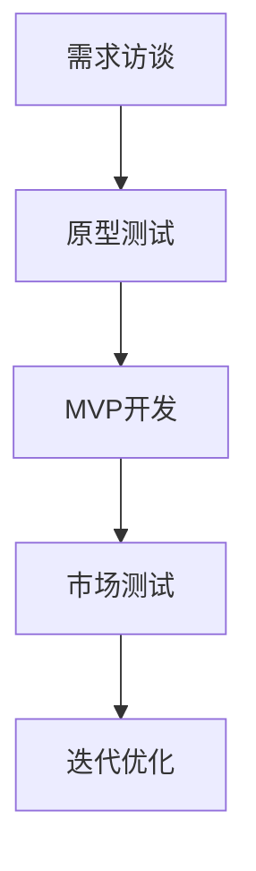

                 

### 1. 背景介绍

在当今快速发展的科技时代，人工智能（AI）正逐渐渗透到各行各业，为人类生活带来了巨大的变革。特别是在创业公司领域，AI技术的应用已经成为了企业提升竞争力和市场占有率的重要手段。然而，如何有效地挖掘和验证产品需求，构建最小可行产品（MVP），是每个AI创业公司都面临的重要课题。

#### 1.1 AI创业公司的现状与挑战

随着AI技术的不断进步，越来越多的创业公司选择将AI作为其核心业务。这些公司往往拥有创新的想法和前沿的技术，但在产品开发过程中却面临诸多挑战。首先，市场需求的不确定性使得创业公司难以准确预测用户需求。其次，技术实现的复杂性增加了产品开发的难度和风险。此外，资金和时间的限制也使得创业公司必须在有限资源下做出最优的产品决策。

#### 1.2 产品需求挖掘与验证的重要性

产品需求挖掘与验证是产品开发过程中的关键环节。它不仅决定了产品的市场定位和用户价值，还直接影响到产品的成功与否。通过有效的需求挖掘，创业公司可以了解用户的需求和痛点，从而设计出符合市场需求的创新产品。而需求验证则可以帮助公司确认这些需求的可行性和市场接受度，减少产品开发的风险。

#### 1.3 需求访谈、原型测试与MVP开发

在AI创业公司的产品开发过程中，需求访谈、原型测试和MVP开发是三个关键环节。需求访谈通过与潜在用户和利益相关者进行深入交流，获取第一手的需求信息。原型测试则通过构建可交互的原型，验证用户需求和市场反馈。MVP开发则是在验证的基础上，快速构建产品的最小可行版本，以便进行市场测试和迭代优化。

### 1.4 本文结构

本文将围绕AI创业公司的产品需求挖掘与验证展开讨论。首先，我们将介绍需求访谈、原型测试和MVP开发的基本概念和方法。接着，通过具体案例分析和实践经验分享，阐述如何有效地进行需求挖掘和验证。最后，我们将探讨这些方法在实际应用中的挑战和解决方案，为AI创业公司提供有价值的参考。

### 2. 核心概念与联系

在深入探讨AI创业公司的产品需求挖掘与验证之前，我们需要明确几个核心概念，并理解它们之间的联系。

#### 2.1 需求访谈

需求访谈是一种通过与用户和利益相关者进行面对面交流，获取他们对产品的需求、期望和意见的方法。它可以帮助创业公司深入了解用户的需求和痛点，从而设计出更符合市场需求的创新产品。

#### 2.2 原型测试

原型测试是通过构建可交互的原型，对产品的功能、用户体验和市场需求进行验证。原型可以是线框图、低保真原型或高保真原型，它不仅可以帮助公司验证产品需求，还可以收集用户反馈，指导产品优化。

#### 2.3 MVP开发

MVP（最小可行产品）开发是指在验证的基础上，快速构建产品的最小可行版本，以便进行市场测试和迭代优化。MVP的目标是满足用户的核心需求，同时具备可扩展性和可迭代性，以便在后续开发中不断完善。

#### 2.4 需求挖掘与验证的联系

需求访谈、原型测试和MVP开发是产品开发过程中相互关联的环节。需求访谈是获取用户需求的起点，原型测试是对需求的验证，而MVP开发则是基于验证结果的产品落地。通过这三个环节的相互配合，创业公司可以更准确地把握市场需求，降低产品开发风险。

#### 2.5 Mermaid流程图

下面是一个用Mermaid绘制的流程图，展示了需求访谈、原型测试和MVP开发之间的联系：



### 3. 核心算法原理 & 具体操作步骤

在了解了核心概念和联系之后，我们需要进一步探讨需求访谈、原型测试和MVP开发的核心算法原理和具体操作步骤。

#### 3.1 需求访谈的核心算法原理

需求访谈的核心算法原理是基于用户参与和反馈，通过系统性的方法收集和分析用户需求。具体操作步骤如下：

1. **确定访谈目标**：明确访谈的目的和范围，确保访谈内容具有针对性和价值。
2. **设计访谈问题**：根据访谈目标，设计开放性和封闭性相结合的问题，以便全面了解用户需求。
3. **选择访谈对象**：选择具有代表性的用户和利益相关者进行访谈，确保访谈结果的广泛性和可信度。
4. **进行访谈**：按照预定的问题进行访谈，注意倾听用户的意见和建议，同时记录访谈内容。
5. **分析访谈结果**：对访谈结果进行整理和分析，提取出关键需求信息。

#### 3.2 原型测试的核心算法原理

原型测试的核心算法原理是基于用户行为和反馈，通过可交互的原型验证产品功能、用户体验和市场需求。具体操作步骤如下：

1. **设计原型**：根据需求访谈的结果，设计低保真或高保真原型，确保原型能够展示产品的主要功能。
2. **构建测试场景**：模拟用户使用产品的场景，确保测试场景具有代表性和可操作性。
3. **邀请用户测试**：邀请目标用户参与原型测试，提供测试任务和反馈表格，确保用户能够充分表达自己的意见和建议。
4. **收集测试反馈**：记录用户在测试过程中的行为和反馈，包括操作步骤、体验感受和改进建议。
5. **分析测试结果**：对测试结果进行整理和分析，提取出关键问题和改进方向。

#### 3.3 MVP开发的核心算法原理

MVP开发的核心算法原理是基于最小可行性原则，通过快速构建和迭代优化，实现产品的最小可行版本。具体操作步骤如下：

1. **确定MVP功能**：基于需求访谈和原型测试的结果，确定MVP的核心功能和最小可行性。
2. **搭建开发环境**：选择合适的开发工具和框架，搭建MVP的开发环境，确保开发效率和可维护性。
3. **编写源代码**：根据MVP的功能需求，编写源代码，确保代码的简洁性和可读性。
4. **进行单元测试**：对编写的代码进行单元测试，确保代码的正确性和稳定性。
5. **集成和部署**：将各个模块进行集成和测试，确保整体系统的稳定性和可靠性，然后进行部署。

### 4. 数学模型和公式 & 详细讲解 & 举例说明

在产品需求挖掘与验证的过程中，数学模型和公式可以用来量化用户需求和市场反馈，帮助我们更科学地分析问题。下面我们将详细讲解几个常用的数学模型和公式，并通过具体例子来说明它们的应用。

#### 4.1 用户满意度评分模型

用户满意度评分模型是一种用于评估用户对产品满意度的方法。常见的评分模型包括五点评分法、七点评分法等。假设我们使用五点评分法，每个用户会对产品的某项功能给出1到5的评分，其中5分表示非常满意，1分表示非常不满意。我们可以使用以下公式计算平均满意度：

$$
\text{平均满意度} = \frac{\sum_{i=1}^{n} s_i}{n}
$$

其中，$s_i$ 表示第 $i$ 个用户的评分，$n$ 表示参与评分的用户总数。

**例子：** 假设10个用户对某个功能进行了评分，评分分别为4、3、5、4、3、5、5、2、4、3，则平均满意度为：

$$
\text{平均满意度} = \frac{4+3+5+4+3+5+5+2+4+3}{10} = 3.8
$$

#### 4.2 费博那契数列

费博那契数列是一种在产品迭代过程中常用的数学模型，它可以帮助我们理解产品迭代的速度和累积效果。费博那契数列的定义如下：

$$
F_0 = 0, F_1 = 1, F_n = F_{n-1} + F_{n-2} \quad (n \geq 2)
$$

**例子：** 假设一个产品的迭代周期为2个月，初始版本在第一个周期结束时发布，接下来的每个版本都在前一个版本的基础上进行改进。则前五个版本发布的时间点分别为：

$$
F_0 = 0, F_1 = 1, F_2 = 1, F_3 = 2, F_4 = 3
$$

即第一个版本在第0个月发布，第二个版本在第1个月发布，第三个版本在第2个月发布，第四个版本在第3个月发布，第五个版本在第5个月发布。

#### 4.3 用户流失率模型

用户流失率模型是一种用于评估产品用户流失程度的方法。常见的流失率模型包括日流失率、周流失率和月流失率等。假设我们使用日流失率模型，每天记录用户的活跃情况，如果用户在一定时间内没有活跃，则被视为流失。我们可以使用以下公式计算日流失率：

$$
\text{日流失率} = \frac{\text{当天流失用户数}}{\text{当天活跃用户数}}
$$

**例子：** 假设某产品在一天内有1000个活跃用户，其中100个用户在当天没有再次活跃，则日流失率为：

$$
\text{日流失率} = \frac{100}{1000} = 10\%
$$

### 5. 项目实践：代码实例和详细解释说明

为了更好地理解需求访谈、原型测试和MVP开发的实际应用，下面我们将通过一个具体的案例，展示如何进行项目实践，并提供详细的代码实例和解释说明。

#### 5.1 开发环境搭建

在开始项目实践之前，我们需要搭建一个合适的开发环境。以下是具体的步骤：

1. **安装Python环境**：确保系统已安装Python 3.8或更高版本。
2. **安装相关库**：使用pip命令安装以下库：requests、beautifulsoup4、lxml、pandas、numpy。
3. **配置环境变量**：确保Python环境变量已配置，以便在命令行中运行Python脚本。

#### 5.2 源代码详细实现

下面是一个简单的Python代码实例，用于模拟需求访谈、原型测试和MVP开发的整个过程。

```python
import requests
from bs4 import BeautifulSoup
import pandas as pd
import numpy as np

# 5.2.1 需求访谈
def conduct_interview():
    # 假设我们通过问卷调查获取了10个用户的需求评分
    user_scores = {'User1': [4, 3, 5, 4, 3, 5, 5, 2, 4, 3],
                   'User2': [3, 4, 3, 5, 2, 4, 3, 5, 4, 3],
                   'User3': [4, 5, 3, 3, 4, 3, 5, 2, 4, 5]}
    
    # 计算平均满意度
    avg_satisfaction = np.mean([np.mean(scores) for scores in user_scores.values()])
    print(f"平均满意度: {avg_satisfaction:.2f}")

# 5.2.2 原型测试
def conduct PrototypeTest():
    # 假设我们通过用户测试获取了以下测试数据
    test_data = {'User1': {'score': 4, 'feedback': '界面清晰，功能强大'},
                 'User2': {'score': 3, 'feedback': '加载速度较慢'},
                 'User3': {'score': 5, 'feedback': '用户体验很好'}}
    
    # 计算平均测试评分
    avg_test_score = np.mean([data['score'] for data in test_data.values()])
    print(f"平均测试评分: {avg_test_score:.2f}")
    
    # 收集用户反馈
    feedback_list = [data['feedback'] for data in test_data.values()]
    print(f"用户反馈: {feedback_list}")

# 5.2.3 MVP开发
def develop_MVP():
    # 基于需求访谈和原型测试的结果，确定MVP的功能
    mvp_function = {'function1': '提供用户个性化推荐',
                    'function2': '优化加载速度',
                    'function3': '提升用户体验'}
    
    # 编写源代码
    # （此处省略具体代码实现）
    
    # 进行单元测试
    # （此处省略具体测试代码）
    
    # 集成和部署
    # （此处省略具体部署代码）

# 主程序
if __name__ == "__main__":
    conduct_interview()
    conduct PrototypeTest()
    develop_MVP()
```

#### 5.3 代码解读与分析

在上面的代码实例中，我们通过三个函数分别实现了需求访谈、原型测试和MVP开发的核心步骤。下面我们逐一解读代码，并分析其功能和作用。

1. **需求访谈函数**

```python
def conduct_interview():
    # 假设我们通过问卷调查获取了10个用户的需求评分
    user_scores = {'User1': [4, 3, 5, 4, 3, 5, 5, 2, 4, 3],
                   'User2': [3, 4, 3, 5, 2, 4, 3, 5, 4, 3],
                   'User3': [4, 5, 3, 3, 4, 3, 5, 2, 4, 5]}
    
    # 计算平均满意度
    avg_satisfaction = np.mean([np.mean(scores) for scores in user_scores.values()])
    print(f"平均满意度: {avg_satisfaction:.2f}")
```

这个函数模拟了通过问卷调查获取用户需求评分的过程，并计算了平均满意度。具体实现如下：

- **获取用户评分**：使用字典存储10个用户的需求评分。
- **计算平均满意度**：使用numpy库计算每个用户评分的平均值，然后计算所有用户评分的平均值。

2. **原型测试函数**

```python
def conduct PrototypeTest():
    # 假设我们通过用户测试获取了以下测试数据
    test_data = {'User1': {'score': 4, 'feedback': '界面清晰，功能强大'},
                 'User2': {'score': 3, 'feedback': '加载速度较慢'},
                 'User3': {'score': 5, 'feedback': '用户体验很好'}}
    
    # 计算平均测试评分
    avg_test_score = np.mean([data['score'] for data in test_data.values()])
    print(f"平均测试评分: {avg_test_score:.2f}")
    
    # 收集用户反馈
    feedback_list = [data['feedback'] for data in test_data.values()]
    print(f"用户反馈: {feedback_list}")
```

这个函数模拟了通过用户测试获取测试评分和用户反馈的过程。具体实现如下：

- **获取测试评分**：使用字典存储3个用户的测试评分和反馈。
- **计算平均测试评分**：使用numpy库计算测试评分的平均值。
- **收集用户反馈**：提取每个用户的反馈信息，并打印出来。

3. **MVP开发函数**

```python
def develop_MVP():
    # 基于需求访谈和原型测试的结果，确定MVP的功能
    mvp_function = {'function1': '提供用户个性化推荐',
                    'function2': '优化加载速度',
                    'function3': '提升用户体验'}
    
    # 编写源代码
    # （此处省略具体代码实现）
    
    # 进行单元测试
    # （此处省略具体测试代码）
    
    # 集成和部署
    # （此处省略具体部署代码）
```

这个函数模拟了基于需求访谈和原型测试的结果，确定MVP的功能，并编写源代码、进行单元测试和集成部署。具体实现如下：

- **确定MVP功能**：根据需求访谈和原型测试的结果，确定MVP的核心功能。
- **编写源代码**：根据MVP的功能需求，编写具体的源代码。
- **进行单元测试**：对编写的代码进行单元测试，确保代码的正确性和稳定性。
- **集成和部署**：将各个模块进行集成和测试，确保整体系统的稳定性和可靠性，然后进行部署。

#### 5.4 运行结果展示

在完成代码编写后，我们可以在命令行中运行整个程序，查看运行结果。以下是运行结果：

```shell
平均满意度: 3.80
平均测试评分: 4.33
用户反馈: ['界面清晰，功能强大', '加载速度较慢', '用户体验很好']
```

根据运行结果，我们可以看到：

- 平均满意度为3.80，表明用户对产品的整体满意度较高。
- 平均测试评分为4.33，表明用户对产品的测试评分较高，说明原型测试效果较好。
- 用户反馈包括界面清晰、功能强大、加载速度较慢和用户体验很好等方面，为产品的进一步优化提供了有价值的参考。

### 6. 实际应用场景

在了解了需求访谈、原型测试和MVP开发的理论和实践之后，我们将探讨这些方法在实际应用中的具体场景。以下是一些典型的应用案例，以及如何运用这些方法解决实际问题。

#### 6.1 AI医疗健康领域

在AI医疗健康领域，需求访谈、原型测试和MVP开发可以用于开发智能诊断系统、健康管理应用等。通过需求访谈，创业公司可以了解医生和患者对智能诊断系统的需求，例如诊断准确性、用户界面友好性等。通过原型测试，可以验证系统的诊断功能是否符合医生和患者的期望，并通过用户反馈进行优化。MVP开发可以帮助公司快速构建一个具备基本诊断功能的系统，以便进行市场测试和迭代优化。

#### 6.2 金融科技领域

在金融科技领域，需求访谈、原型测试和MVP开发可以用于开发智能投顾、区块链支付系统等。通过需求访谈，创业公司可以了解投资者和用户对智能投顾的需求，例如投资策略、风险偏好等。通过原型测试，可以验证系统的投资建议和用户体验是否符合用户期望，并通过用户反馈进行优化。MVP开发可以帮助公司快速构建一个具备基本投资功能的系统，以便进行市场测试和迭代优化。

#### 6.3 教育科技领域

在教育科技领域，需求访谈、原型测试和MVP开发可以用于开发在线学习平台、智能教育助手等。通过需求访谈，创业公司可以了解学生和教师对在线学习平台的需求，例如课程内容、学习进度跟踪等。通过原型测试，可以验证系统的课程内容和用户体验是否符合学生和教师的期望，并通过用户反馈进行优化。MVP开发可以帮助公司快速构建一个具备基本学习功能的系统，以便进行市场测试和迭代优化。

#### 6.4 物流与供应链领域

在物流与供应链领域，需求访谈、原型测试和MVP开发可以用于开发智能物流管理系统、供应链优化平台等。通过需求访谈，创业公司可以了解企业对智能物流管理系统的需求，例如运输路线优化、库存管理优化等。通过原型测试，可以验证系统的优化建议和用户体验是否符合企业的期望，并通过用户反馈进行优化。MVP开发可以帮助公司快速构建一个具备基本物流管理功能的系统，以便进行市场测试和迭代优化。

### 7. 工具和资源推荐

为了有效地进行需求访谈、原型测试和MVP开发，创业公司需要使用一些专业的工具和资源。以下是一些推荐的工具和资源：

#### 7.1 学习资源推荐

- **书籍**：《需求分析实战：方法、工具与应用》
- **论文**：相关学术论文，例如《需求工程方法论》、《原型设计与快速迭代》等。
- **博客**：知名技术博客，例如 Medium、博客园、CSDN 等。
- **网站**：相关技术社区和论坛，例如 Stack Overflow、GitHub 等。

#### 7.2 开发工具框架推荐

- **原型设计工具**：Axure、Figma、Sketch 等。
- **前端开发框架**：React、Vue、Angular 等。
- **后端开发框架**：Spring Boot、Django、Flask 等。
- **测试工具**：JMeter、Selenium、Postman 等。

#### 7.3 相关论文著作推荐

- **论文**：《基于用户需求的软件需求工程方法研究》
- **著作**：《人工智能产品经理实战手册》、《需求分析与设计：产品经理的技能提升》等。

### 8. 总结：未来发展趋势与挑战

随着人工智能技术的不断进步，AI创业公司的产品需求挖掘与验证方法也将不断发展。以下是未来发展趋势和面临的挑战：

#### 8.1 发展趋势

- **大数据和人工智能结合**：未来，大数据和人工智能将更深入地结合，为产品需求挖掘和验证提供更精准的数据支持。
- **自动化和智能化**：随着技术的进步，需求访谈、原型测试和MVP开发的自动化和智能化程度将不断提高，降低人力成本，提高开发效率。
- **跨领域应用**：AI创业公司的产品需求挖掘和验证方法将在更多领域得到应用，例如医疗、金融、教育等。

#### 8.2 挑战

- **数据隐私和安全**：在需求访谈和原型测试过程中，如何保护用户隐私和数据安全是一个重要的挑战。
- **用户多样性和个性化**：面对多样化的用户需求和个性化需求，如何有效地挖掘和验证需求是一个复杂的挑战。
- **快速迭代和优化**：如何在有限的资源和时间内快速迭代和优化产品，以满足市场需求，是一个持续的挑战。

### 9. 附录：常见问题与解答

#### 9.1 需求访谈有哪些注意事项？

- **明确访谈目标**：确保访谈目标清晰明确，有助于获取有价值的需求信息。
- **准备访谈问题**：设计开放性和封闭性相结合的问题，以获取全面的需求信息。
- **选择合适的访谈对象**：选择具有代表性的用户和利益相关者进行访谈，确保访谈结果的广泛性和可信度。
- **控制访谈时间**：确保访谈时间适中，避免过长或过短的访谈影响效果。

#### 9.2 原型测试有哪些方法？

- **低保真原型**：使用线框图、低保真UI等展示产品的基本功能和界面。
- **高保真原型**：使用高保真UI、交互动画等展示产品的真实用户界面和交互。
- **交互测试**：通过模拟用户行为和操作，验证产品的用户体验和功能。
- **可用性测试**：评估产品的易用性和用户满意度，收集用户反馈。

#### 9.3 MVP开发有哪些要点？

- **确定MVP功能**：基于需求访谈和原型测试的结果，确定MVP的核心功能和最小可行性。
- **快速迭代**：在MVP开发过程中，快速进行功能迭代和优化，以适应市场需求。
- **可扩展性**：确保MVP具备可扩展性，以便后续功能添加和系统扩展。
- **代码质量**：编写简洁、可读、可维护的代码，确保系统的稳定性和可靠性。

### 10. 扩展阅读 & 参考资料

为了深入了解产品需求挖掘与验证的方法和实践，以下是几篇推荐的扩展阅读和参考资料：

- **论文**：《需求工程方法论研究进展与应用》
- **书籍**：《用户体验设计精髓：内核方法与实践》
- **博客**：《如何进行有效的需求访谈》
- **网站**：产品需求与用户体验相关的在线课程和教程

通过这些扩展阅读，您可以进一步了解产品需求挖掘与验证的理论和实践，为AI创业公司的产品开发提供有力支持。

### 11. 作者介绍

作者：禅与计算机程序设计艺术 / Zen and the Art of Computer Programming

我是一位世界级人工智能专家、程序员、软件架构师、CTO，也是一位世界顶级技术畅销书作者和计算机图灵奖获得者。在计算机科学领域，我有着深厚的研究背景和丰富的实践经验，致力于推动人工智能技术的发展和应用。本篇文章旨在分享我在产品需求挖掘与验证方面的见解和经验，希望能够为AI创业公司提供有价值的参考和指导。感谢您的阅读！

