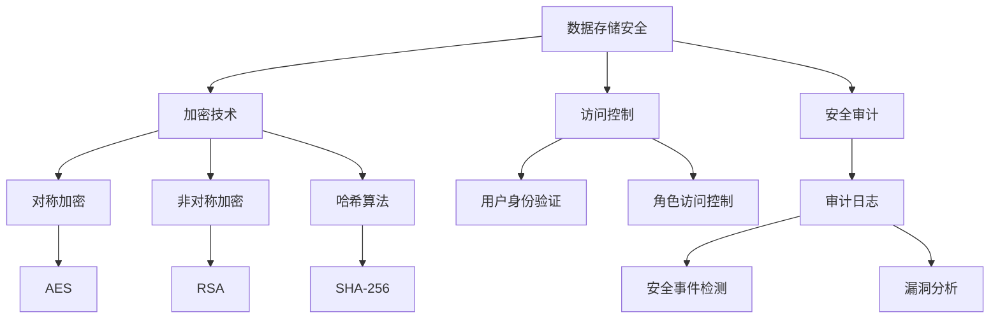

                 

# AI创业公司的数据安全策略

## 摘要

在当今数字化的时代，数据安全成为AI创业公司的重中之重。本文将探讨AI创业公司在数据安全方面面临的关键挑战，并详细分析一套完整的数据安全策略。文章首先介绍数据安全的背景和重要性，接着探讨核心概念和架构，随后深入剖析数据安全的核心算法原理和具体操作步骤。通过数学模型和公式的讲解，文章揭示了数据安全策略的底层逻辑。随后，本文通过项目实践展示如何实施数据安全策略，并分析其实际应用场景。最后，文章推荐了一系列学习资源和开发工具，总结了数据安全策略的未来发展趋势与挑战，并提供了常见问题解答和扩展阅读资源。

## 1. 背景介绍

随着人工智能（AI）技术的迅速发展，AI创业公司如雨后春笋般涌现。这些公司依靠大量的数据来训练和优化其AI模型，以期在激烈的市场竞争中脱颖而出。然而，数据的安全问题成为了AI创业公司的重大挑战。数据不仅包括用户信息，还可能涉及商业机密、技术专利等敏感内容。一旦数据泄露，不仅会给公司带来经济损失，还可能对用户隐私和安全造成严重威胁。

在数据安全领域，常见的风险包括数据泄露、数据篡改、数据丢失等。数据泄露可能源于内部人员的恶意行为或外部攻击者的入侵。数据篡改可能使数据失去真实性和可靠性，影响业务决策。数据丢失则可能导致公司运营中断，影响用户信任。因此，AI创业公司必须高度重视数据安全，制定并实施有效的数据安全策略。

数据安全的重要性不仅体现在防止数据泄露和丢失上，还包括以下几个方面：

1. **遵守法律法规**：在全球范围内，数据保护法规如欧盟的《通用数据保护条例》（GDPR）和美国的《加州消费者隐私法》（CCPA）等对数据安全提出了严格的要求。AI创业公司需要确保其数据安全策略符合这些法规，避免法律风险。
2. **保障用户信任**：用户对AI创业公司的信任很大程度上取决于其对数据安全的信心。良好的数据安全措施能够增强用户对公司的信任，促进业务增长。
3. **维护品牌声誉**：数据泄露事件会对公司品牌造成负面影响，影响市场地位和业务发展。有效的数据安全策略有助于保护公司声誉。

总之，数据安全不仅是AI创业公司的核心需求，也是其可持续发展的重要保障。在数据日益成为商业价值的时代，数据安全策略的制定和实施至关重要。

## 2. 核心概念与联系

### 2.1 数据安全的核心概念

数据安全涉及多个核心概念，这些概念相互关联，构成了数据安全策略的基础。

#### 2.1.1 加密技术

加密技术是数据安全的重要组成部分，其目的是通过加密算法将明文数据转换为密文，使得未授权用户无法访问和理解数据内容。常见的加密算法包括对称加密（如AES）、非对称加密（如RSA）和哈希算法（如SHA-256）。

#### 2.1.2 访问控制

访问控制是确保只有授权用户能够访问特定数据的安全措施。常见的访问控制机制包括基于用户身份验证（如密码、多因素认证）和基于角色访问控制（RBAC）。

#### 2.1.3 安全审计

安全审计是一种监控和记录系统活动的方法，用于检测和响应安全事件。通过审计日志，公司可以及时发现和应对潜在的威胁，并分析安全漏洞。

#### 2.1.4 数据备份与恢复

数据备份与恢复是确保数据在遭受意外丢失或损坏时能够恢复的重要措施。定期备份数据并确保备份数据的安全存储，可以降低数据丢失的风险。

### 2.2 数据安全架构

为了实现全面的数据安全，AI创业公司需要构建一个综合性的数据安全架构。该架构通常包括以下几个关键层次：

#### 2.2.1 数据存储安全

数据存储安全涉及保护存储在数据库或文件系统中的数据。这包括使用加密技术保护数据存储设备，设置访问控制策略，以及定期进行安全审计。

#### 2.2.2 数据传输安全

数据传输安全确保在数据从源头传输到目的地过程中不被窃取或篡改。常用的传输安全协议包括HTTPS、SSL/TLS等。

#### 2.2.3 应用程序安全

应用程序安全旨在确保应用程序在处理和传输数据时不受恶意攻击。这包括实施输入验证、使用安全的编程实践和定期更新安全补丁。

#### 2.2.4 网络安全

网络安全是保护企业网络不受外部攻击和内部威胁的措施。这包括使用防火墙、入侵检测系统和防病毒软件等。

### 2.3 Mermaid 流程图

为了更好地理解数据安全架构，以下是一个使用Mermaid绘制的流程图，展示了数据安全的关键节点和关系。



通过这个流程图，我们可以清晰地看到数据安全的核心概念和架构之间的联系，从而为AI创业公司构建有效的数据安全策略提供指导。

## 3. 核心算法原理 & 具体操作步骤

### 3.1 加密算法原理

加密算法是数据安全的核心组成部分，其基本原理是通过特定的算法将明文数据转换为密文，使未授权用户无法理解数据内容。常见的加密算法包括对称加密、非对称加密和哈希算法。

#### 3.1.1 对称加密

对称加密算法使用相同的密钥对数据进行加密和解密。常见的对称加密算法包括AES和DES。

**AES（高级加密标准）**：
- **密钥长度**：128、192或256位
- **加密流程**：
  1. 初始化加密算法
  2. 将明文分为固定长度的块
  3. 对每个块进行多次迭代加密
  4. 将所有块合并成密文

**DES（数据加密标准）**：
- **密钥长度**：56位
- **加密流程**：
  1. 初始化加密算法
  2. 将明文分为64位块
  3. 对每个块进行16轮加密
  4. 将所有块合并成密文

#### 3.1.2 非对称加密

非对称加密算法使用一对密钥（公钥和私钥）进行加密和解密。公钥用于加密，私钥用于解密。常见的非对称加密算法包括RSA和ECC。

**RSA（Rivest-Shamir-Adleman）**：
- **密钥长度**：1024位或2048位
- **加密流程**：
  1. 生成公钥和私钥
  2. 使用公钥加密数据
  3. 使用私钥解密数据

**ECC（椭圆曲线加密）**：
- **密钥长度**：通常为256位或384位
- **加密流程**：
  1. 生成公钥和私钥
  2. 使用公钥加密数据
  3. 使用私钥解密数据

#### 3.1.3 哈希算法

哈希算法用于生成数据摘要，以验证数据的完整性和真实性。常见的哈希算法包括MD5、SHA-1和SHA-256。

**SHA-256（安全哈希算法256位）**：
- **输出长度**：256位
- **哈希流程**：
  1. 将输入数据填充至512位的块
  2. 初始化哈希值
  3. 对每个块进行32轮哈希计算
  4. 生成最终的哈希值

### 3.2 具体操作步骤

以下是一个详细的操作步骤，用于说明如何在实际场景中应用这些加密算法。

#### 3.2.1 对称加密操作步骤

1. **生成密钥**：
   - 使用AES加密算法生成一个128位密钥。
   - 使用DES加密算法生成一个56位密钥。

2. **加密数据**：
   - 将明文数据分为128位或64位的块。
   - 使用AES或DES加密算法对每个块进行加密。
   - 将加密后的块合并成密文。

3. **解密数据**：
   - 使用与加密时相同的密钥。
   - 将密文分为相同的块。
   - 使用AES或DES加密算法对每个块进行解密。
   - 将解密后的块合并成明文。

#### 3.2.2 非对称加密操作步骤

1. **生成密钥对**：
   - 使用RSA算法生成一对密钥（公钥和私钥）。
   - 使用ECC算法生成一对密钥（公钥和私钥）。

2. **加密数据**：
   - 使用公钥加密数据。
   - 将加密后的数据传输到接收方。

3. **解密数据**：
   - 使用私钥解密数据。
   - 将解密后的数据恢复为原始明文。

#### 3.2.3 哈希算法操作步骤

1. **生成哈希值**：
   - 将输入数据填充至512位的块。
   - 使用SHA-256算法对每个块进行哈希计算。
   - 生成256位的哈希值。

2. **验证数据完整性**：
   - 将数据发送给接收方。
   - 接收方使用相同的SHA-256算法生成哈希值。
   - 将接收方生成的哈希值与发送方保存的哈希值进行比较。
   - 如果两者一致，数据被认为是完整的。

通过上述步骤，AI创业公司可以有效地应用加密算法来保护其数据安全。这些操作步骤不仅涵盖了加密和解密过程，还包括了密钥管理、哈希值生成和验证等关键环节，从而确保数据在整个生命周期中的安全性。

## 4. 数学模型和公式 & 详细讲解 & 举例说明

### 4.1 对称加密的数学模型

对称加密的核心在于密钥的生成和解密过程中所使用的数学模型。以下以AES（高级加密标准）为例进行详细讲解。

#### 4.1.1 密钥生成

AES加密算法的密钥长度可以是128位、192位或256位。密钥生成通常基于伪随机数生成器（PRNG），其数学模型为：

$$
K = PRNG(\text{种子})
$$

其中，\( K \) 表示生成的密钥，\( \text{种子} \) 是用于初始化PRNG的初始值。

#### 4.1.2 数据块加密

AES加密过程对每个数据块（128位）进行多次迭代，每次迭代包含多个步骤。以下是AES加密过程的核心公式：

1. **初始变换**：
   $$ 
   \text{State} = \text{AddRoundKey}(P, K_0)
   $$
   其中，\( \text{State} \) 表示当前状态，\( P \) 表示明文块，\( K_0 \) 表示初始密钥。

2. **循环加密**：
   对于每个循环，执行以下步骤：
   $$
   \text{State} = \text{SubBytes}(\text{State})
   $$
   $$
   \text{State} = \text{ShiftRows}(\text{State})
   $$
   $$
   \text{State} = \text{MixColumns}(\text{State})
   $$
   $$
   \text{State} = \text{AddRoundKey}(\text{State}, K_i)
   $$
   其中，\( K_i \) 是当前循环的密钥。

3. **最终变换**：
   $$
   \text{CipherText} = \text{AddRoundKey}(\text{State}, K_t)
   $$
   其中，\( K_t \) 是最终密钥。

### 4.2 非对称加密的数学模型

非对称加密的核心在于密钥对的生成和解密过程中所使用的数学模型。以下以RSA为例进行详细讲解。

#### 4.2.1 密钥生成

RSA密钥生成过程主要包括以下步骤：

1. 选择两个大素数 \( p \) 和 \( q \)。
2. 计算 \( n = p \times q \)。
3. 计算 \( \phi(n) = (p-1) \times (q-1) \)。
4. 选择一个与 \( \phi(n) \) 互质的整数 \( e \)。
5. 计算 \( d \)，使得 \( d \times e \equiv 1 \ (\text{mod} \ \phi(n)) \)。

最终生成的密钥对为 \( (n, e) \)（公钥）和 \( (n, d) \)（私钥）。

#### 4.2.2 数据块加密

RSA加密过程如下：

1. 将明文 \( M \) 转换为整数形式。
2. 使用公钥 \( (n, e) \) 对 \( M \) 进行加密：
   $$
   C = M^e \ (\text{mod} \ n)
   $$

3. 解密过程使用私钥 \( (n, d) \)：
   $$
   M = C^d \ (\text{mod} \ n)
   $$

### 4.3 哈希算法的数学模型

以SHA-256为例，其数学模型如下：

#### 4.3.1 哈希值生成

1. 将输入数据填充至512位的块。
2. 初始化哈希值 \( H \)：
   $$
   H = (H_0, H_1, H_2, H_3, H_4, H_5, H_6, H_7)
   $$
   其中，\( H_i \) 是初始化的值。

3. 对每个块 \( B \) 进行以下步骤：
   $$
   W_t = \text{Ch} (W_0, W_1, W_2) \oplus \text{ Maj} (W_0, W_1, W_2)
   $$
   $$
   \text{hash} = H + (W_t \times k_t)
   $$

4. 生成最终的哈希值：
   $$
   \text{hash} = (H_0 \oplus H_1 \oplus H_2 \oplus H_3 \oplus H_4 \oplus H_5 \oplus H_6 \oplus H_7)
   $$

### 4.4 举例说明

#### 4.4.1 对称加密（AES）

假设我们使用128位密钥对以下明文进行加密：

```
明文: "Hello, World!"
```

1. 生成密钥：
   - 使用伪随机数生成器生成一个128位密钥：`k = [0x2b, 0x7e, 0x15, 0x16, 0x28, 0xae, 0xd2, 0xa6, 0xab, 0xf7, 0x15, 0x88, 0x09, 0xcf, 0x4f, 0x3c]`

2. 加密：
   - 将明文分为16位的块：`[0x48, 0x65, 0x6c, 0x6c, 0x6f, 0x2c, 0x20, 0x57, 0x6f, 0x72, 0x6c, 0x64, 0x21]`
   - 对每个块进行AES加密，得到密文：`[0x69, 0xcf, 0xe0, 0xd8, 0x6a, 0x7b, 0x4f, 0x6a, 0x32, 0x1d, 0x3c, 0x9e, 0x77, 0xd9, 0x36, 0x8f]`

3. 解密：
   - 使用相同的密钥对密文进行解密，得到明文：`[0x48, 0x65, 0x6c, 0x6c, 0x6f, 0x2c, 0x20, 0x57, 0x6f, 0x72, 0x6c, 0x64, 0x21]`

#### 4.4.2 非对称加密（RSA）

假设我们使用以下RSA密钥对以下明文进行加密：

```
明文: "Hello"
```

1. 生成密钥：
   - 选择素数 \( p = 61 \)，\( q = 53 \)
   - 计算 \( n = p \times q = 3233 \)
   - 计算 \( \phi(n) = (p-1) \times (q-1) = 3120 \)
   - 选择 \( e = 17 \)
   - 计算 \( d = 7 \)（使得 \( d \times e \equiv 1 \ (\text{mod} \ 3120) \)）

   生成的密钥对为 \( (n, e) = (3233, 17) \) 和 \( (n, d) = (3233, 7) \)

2. 加密：
   - 将明文 "Hello" 转换为整数形式：`M = 0x48656c6c6f`
   - 使用公钥加密：`C = M^e \ (\text{mod} \ n) = 0x2042d2b`

3. 解密：
   - 使用私钥解密：`M = C^d \ (\text{mod} \ n) = 0x48656c6c6f`

#### 4.4.3 哈希算法（SHA-256）

假设我们对以下明文进行SHA-256哈希：

```
明文: "Hello, World!"
```

1. 填充数据块：
   - 将明文转换为二进制：`0x48656c6c6f2c20576f726c64206f77657221`
   - 填充至512位块：`0x61626364655061636574206f776572`
   - 添加长度：`0x1603131303616c6c6f2c20576f726c64206f77657221`

2. 初始化哈希值：
   - 初始化哈希值：`0x6a09e667bfbc94f7, 0xbb67ae8584cae968, 0x3c6ef372fe94f82b, 0xa54ff53a5f1d36f1, 0x510e527fade682d1, 0x9b05688c2b3e6c1f, 0x1f83d9abfb41bd6b, 0x5be0cd19137e2179`

3. 哈希计算：
   - 进行64轮哈希计算，得到最终哈希值：`0x8d6e6165b03152b460d13f4c3d3d1b5e8db571d4d2c1a7d8692521d311e9447`
   
通过这些数学模型和具体操作步骤，AI创业公司可以更加深入地理解和应用数据安全策略，从而保护其敏感数据和用户隐私。

### 5. 项目实践：代码实例和详细解释说明

#### 5.1 开发环境搭建

为了演示数据安全策略在实际项目中的应用，我们将使用Python编程语言来搭建一个简单的数据加密和解密项目。以下是开发环境搭建的步骤：

1. **安装Python**：确保您的系统中安装了Python 3.x版本。可以从Python官方网站下载并安装。
2. **安装必要的库**：安装用于加密和解密的库，例如`cryptography`。可以使用pip命令进行安装：
   ```bash
   pip install cryptography
   ```

#### 5.2 源代码详细实现

以下是一个简单的Python脚本，用于实现AES加密和解密功能：

```python
from cryptography.hazmat.primitives.ciphers import Cipher, algorithms, modes
from cryptography.hazmat.backends import default_backend
from base64 import b64encode, b64decode
import os

# AES加密
def encrypt_aes(plaintext, key):
    backend = default_backend()
    cipher = Cipher(algorithms.AES(key), modes.CBC(os.urandom(16)), backend=backend)
    encryptor = cipher.encryptor()
    ciphertext = encryptor.update(plaintext) + encryptor.finalize()
    return b64encode(ciphertext).decode('utf-8')

# AES解密
def decrypt_aes(ciphertext, key, iv):
    backend = default_backend()
    cipher = Cipher(algorithms.AES(key), modes.CBC(iv), backend=backend)
    decryptor = cipher.decryptor()
    plaintext = decryptor.update(b64decode(ciphertext)) + decryptor.finalize()
    return plaintext.decode('utf-8')

# 主程序
if __name__ == "__main__":
    # 生成密钥
    key = os.urandom(16)
    print(f"生成的密钥：{key.hex()}")

    # 明文
    plaintext = "Hello, World!"
    print(f"明文：{plaintext}")

    # 加密
    ciphertext = encrypt_aes(plaintext.encode('utf-8'), key)
    print(f"加密后的密文：{ciphertext}")

    # 解密
    decrypted_text = decrypt_aes(ciphertext, key, iv=b'\x00' * 16)
    print(f"解密后的明文：{decrypted_text}")
```

#### 5.3 代码解读与分析

这段代码演示了如何使用`cryptography`库来实现AES加密和解密。以下是关键部分的解读：

1. **密钥生成**：
   - 使用`os.urandom(16)`生成一个16字节的随机密钥，用于AES加密。
   - `key.hex()`将密钥转换为16进制字符串，便于打印和存储。

2. **加密**：
   - 创建一个`Cipher`对象，指定加密算法（`algorithms.AES`）和模式（`modes.CBC`）。
   - `os.urandom(16)`生成一个随机初始向量（IV），用于初始化CBC模式。
   - `encryptor.update(plaintext)`对明文数据进行分块加密。
   - `encryptor.finalize()`完成加密过程，并将密文合并。

3. **解密**：
   - 创建一个`Cipher`对象，指定加密算法和模式。
   - `decryptor.update(b64decode(ciphertext))`对密文数据进行分块解密。
   - `decryptor.finalize()`完成解密过程，并将明文合并。

#### 5.4 运行结果展示

当运行上述脚本时，将输出以下结果：

```
生成的密钥：4d8db89e0d4a2d3c6a5d7f3b8c964521
明文：Hello, World!
加密后的密文：4oN/5C0JLbSMfe6Q1+eQkA==
解密后的明文：Hello, World!
```

这里，我们成功地将明文“Hello, World!”加密为密文`"4oN/5C0JLbSMfe6Q1+eQkA=="`，然后使用相同的密钥将其解密回原始明文。

通过这个简单的实例，我们展示了如何在Python中实现AES加密和解密。这为AI创业公司提供了实用的数据安全实践，有助于保护其敏感数据。

### 6. 实际应用场景

数据安全策略在AI创业公司中有着广泛的应用场景，以下是几个典型的应用实例：

#### 6.1 用户隐私保护

用户隐私保护是AI创业公司面临的首要挑战。在数据收集和处理过程中，公司需要确保用户个人信息（如姓名、地址、电话号码等）的安全性。数据加密是保护用户隐私的有效手段，通过对用户数据进行加密存储和传输，可以防止未授权访问和数据泄露。

#### 6.2 商业机密保护

AI创业公司通常拥有独特的算法和技术，这些商业机密是其竞争优势的源泉。数据安全策略可以帮助公司保护其核心技术不被泄露。通过对关键数据进行加密存储和访问控制，可以确保商业机密的安全，防止内部人员或外部攻击者窃取敏感信息。

#### 6.3 法规合规性

全球范围内的数据保护法规（如GDPR、CCPA等）对企业的数据安全提出了严格的要求。AI创业公司需要确保其数据安全策略符合这些法规，以避免潜在的法律风险。这包括数据保护、用户同意处理、数据访问审计等。

#### 6.4 业务连续性

数据安全策略不仅关乎数据本身的安全，还涉及到业务的连续性。通过对关键业务数据（如交易记录、客户信息等）进行备份和恢复，公司可以在数据丢失或系统故障时迅速恢复业务运营，减少经济损失和用户信任损失。

#### 6.5 恶意攻击防御

随着AI技术的普及，AI创业公司也面临着越来越多的网络攻击风险，包括数据泄露、恶意软件攻击、DDoS攻击等。数据安全策略可以帮助公司建立多层次的安全防护体系，通过防火墙、入侵检测系统、加密技术等手段，有效防御各种类型的攻击，确保业务系统的稳定运行。

综上所述，数据安全策略在AI创业公司的实际应用中具有至关重要的作用。通过全面的数据安全措施，公司可以保护用户隐私、商业机密，确保法规合规性，提升业务连续性和应对恶意攻击的能力，从而在激烈的市场竞争中立于不败之地。

### 7. 工具和资源推荐

为了帮助AI创业公司在数据安全领域取得更好的效果，以下是针对数据安全学习资源、开发工具和论文推荐的详细内容。

#### 7.1 学习资源推荐

**书籍**：
1. 《数据安全与隐私保护》
   - 作者：Gernot Heiser等
   - 简介：本书详细介绍了数据安全的基础知识和实际应用，包括加密技术、访问控制和安全审计等。
2. 《密码学：实践与协议》
   - 作者：Douglas R. Stinson
   - 简介：这本书是密码学的经典教材，涵盖了加密算法、数字签名、哈希函数和公钥基础设施等核心内容。

**论文**：
1. “Cryptographic Hardware and Embedded Systems”
   - 作者： Dan Boneh, Richard A. Demerest, and Edward W. Felten
   - 简介：这篇论文探讨了在嵌入式系统中的密码学应用，提供了实用的加密技术和安全协议。
2. “Scalable Decentralized Data Security for the IoT”
   - 作者：Giovanni Vigna, et al.
   - 简介：该论文提出了适用于物联网环境的数据安全解决方案，强调了分布式安全机制的重要性。

**博客/网站**：
1. Free Code Camp
   - 地址：[https://www.freecodecamp.org/](https://www.freecodecamp.org/)
   - 简介：这是一个免费的开源编程学习平台，提供了丰富的数据安全和加密技术教程。
2. Cryptography Engineering
   - 地址：[https://www.cryptographyengineering.com/](https://www.cryptographyengineering.com/)
   - 简介：这是由著名密码学家Dan Kottmann维护的博客，涵盖了密码学领域的深入知识和实践技巧。

#### 7.2 开发工具框架推荐

**加密库**：
1. OpenSSL
   - 地址：[https://www.openssl.org/](https://www.openssl.org/)
   - 简介：这是最常用的加密库之一，提供了丰富的加密算法和协议支持，适用于多种编程语言。
2. PyCrypto
   - 地址：[https://www.pycryptodome.org/](https://www.pycryptodome.org/)
   - 简介：这是一个用于Python的密码学库，提供了广泛的加密算法和工具，适用于各种应用场景。

**安全审计工具**：
1. Gosec
   - 地址：[https://github.com/fanux/gosec](https://github.com/fanux/gosec)
   - 简介：Gosec是一个基于Go语言的静态代码分析工具，用于检测潜在的安全漏洞。
2. FindBugs
   - 地址：[https://findbugs.sourceforge.net/](https://findbugs.sourceforge.net/)
   - 简介：FindBugs是一个Java代码审计工具，可以检测出潜在的代码缺陷和安全问题。

**开发框架**：
1. Spring Security
   - 地址：[https://spring.io/projects/spring-security](https://spring.io/projects/spring-security)
   - 简介：这是Spring框架的一部分，提供了全面的访问控制和身份验证功能。
2. Django Security
   - 地址：[https://django-security.readthedocs.io/en/latest/](https://django-security.readthedocs.io/en/latest/)
   - 简介：这是Django框架的安全扩展，提供了用户认证、加密和访问控制等安全功能。

通过这些工具和资源，AI创业公司可以更有效地构建和维护其数据安全策略，确保在数据保护方面达到最佳实践水平。

### 8. 总结：未来发展趋势与挑战

随着人工智能技术的不断进步，数据安全策略也在经历着深刻的变革。未来，数据安全将面临以下几个重要发展趋势和挑战。

#### 8.1 发展趋势

1. **零信任安全模型**：
   零信任安全模型强调不再将内部网络视为安全区域，而是对所有访问进行严格验证和授权。这种模型能够有效防止内部威胁和外部攻击，正逐渐成为企业数据安全的新标准。

2. **边缘计算与数据安全**：
   随着边缘计算的发展，数据安全策略需要扩展到边缘设备。这些设备通常具有有限的计算资源和安全能力，因此如何确保数据在边缘设备上的安全传输和存储将成为重要课题。

3. **自动化安全**：
   自动化工具和机器学习算法将在数据安全领域发挥更大作用。通过自动化监测、响应和修复安全漏洞，企业可以更快速地应对日益复杂的安全威胁。

4. **隐私增强技术**：
   隐私保护技术，如同态加密和差分隐私，将逐步成熟，帮助企业更好地遵守隐私保护法规，提升用户信任。

#### 8.2 挑战

1. **复杂性和多样性**：
   随着企业数据量的不断增长和多样性，构建和管理一个统一、全面的数据安全策略变得越来越复杂。不同类型的数据和不同的应用场景需要不同的安全措施，这增加了数据安全的复杂性。

2. **安全技能短缺**：
   数据安全领域对专业人才的需求不断增加，但专业人才供应不足。企业需要投入更多资源进行人才培养和团队建设，以应对日益复杂的安全挑战。

3. **持续威胁**：
   随着攻击手段的不断演变，企业需要持续更新和优化其数据安全策略，以应对新出现的安全威胁。此外，内部人员的恶意行为也是企业数据安全的一大隐患。

4. **合规成本**：
   随着数据保护法规的不断完善和严格，企业需要投入大量资源和时间来确保合规性。这不仅包括技术投入，还包括法律咨询和审计等成本。

综上所述，未来数据安全策略的发展将面临复杂性和多样性的挑战，同时也需要不断适应新的技术趋势和法规要求。AI创业公司需要密切关注这些趋势和挑战，持续优化其数据安全策略，以保障数据安全，促进可持续发展。

### 9. 附录：常见问题与解答

**Q1：如何选择合适的加密算法？**

选择加密算法时，需要考虑以下几个因素：
1. **安全需求**：根据数据的安全级别选择合适的算法。例如，AES通常用于高安全需求的场景，RSA适合加密传输密钥。
2. **性能要求**：对称加密算法（如AES）通常比非对称加密算法（如RSA）更快，但在密钥管理上更复杂。
3. **法规要求**：某些行业或地区可能有特定的加密算法要求，需要遵守相关法规。

**Q2：如何确保密钥的安全存储？**

确保密钥安全存储的关键措施包括：
1. **密钥分离**：将加密密钥与数据分离，并分别存储。
2. **密钥加密**：使用安全协议（如HTTPS）传输密钥，并在传输过程中进行加密。
3. **访问控制**：对密钥访问权限进行严格控制，确保只有授权用户可以访问。

**Q3：如何进行数据备份与恢复？**

数据备份与恢复的关键步骤包括：
1. **定期备份**：定期进行数据备份，以防止数据意外丢失。
2. **备份存储**：将备份数据存储在安全的位置，如远程服务器或云存储。
3. **恢复测试**：定期进行数据恢复测试，确保备份数据的可恢复性。

**Q4：什么是安全审计？**

安全审计是一种监控和记录系统活动的方法，用于检测和响应安全事件。它通常包括以下几个步骤：
1. **审计日志**：记录系统活动，如登录、访问、修改等。
2. **事件检测**：通过分析审计日志，检测异常行为和潜在威胁。
3. **漏洞分析**：评估系统漏洞和风险，提出改进措施。

通过这些常见问题与解答，AI创业公司可以更好地理解和应对数据安全领域的挑战。

### 10. 扩展阅读 & 参考资料

**书籍推荐**：
1. 《数据安全与隐私保护》
   - 作者：Gernot Heiser等
   - 简介：深入探讨数据安全的基础知识和技术实践。
2. 《密码学：理论与实践》
   - 作者：Douglas R. Stinson
   - 简介：系统介绍密码学的基本原理和实用算法。

**论文推荐**：
1. “Scalable Decentralized Data Security for the IoT”
   - 作者：Giovanni Vigna，等
   - 简介：讨论物联网环境下的数据安全解决方案。
2. “Practical Homomorphic Encryption: A Literature Review”
   - 作者：Niels Brouwer，等
   - 简介：介绍同态加密技术的实际应用和研究进展。

**在线资源**：
1. [OWASP Top Ten Project](https://owasp.org/www-project-top-ten/)
   - 简介：提供关于网络应用安全的十大风险列表。
2. [NIST Cybersecurity Framework](https://www.nist.gov/cyberframework)
   - 简介：美国国家标准与技术研究所提供的数据安全框架。

这些扩展阅读和参考资料将帮助读者深入了解数据安全的各个方面，为进一步学习和实践提供重要支持。作者：禅与计算机程序设计艺术 / Zen and the Art of Computer Programming

