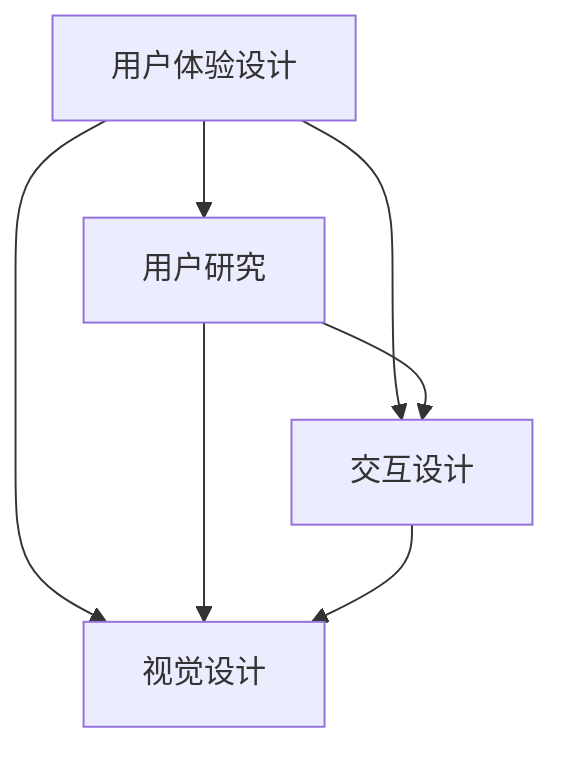

                 

### 文章标题

**AI创业公司的用户体验设计流程：用户研究、交互设计与视觉设计**

> **关键词**：用户体验设计、用户研究、交互设计、视觉设计、AI创业公司、设计流程

**摘要**：

本文旨在为AI创业公司提供一套系统化、专业的用户体验设计流程，包括用户研究、交互设计与视觉设计三个核心环节。通过详细解析每个环节的原理、方法与实操步骤，我们帮助初创团队从用户需求出发，设计出既实用又富有吸引力的产品。文章还将推荐相关的学习资源和工具，以助读者更深入地了解和实践用户体验设计。

---

### 1. 背景介绍

在当今快速发展的AI领域，用户体验设计（User Experience Design，简称UXD）已成为产品成功的关键因素。对于AI创业公司而言，如何在激烈的市场竞争中脱颖而出，不仅仅依赖于技术创新，更需要关注用户体验。一个良好设计的用户体验不仅能提高用户满意度，还能增强产品竞争力，促进用户留存和口碑传播。

用户体验设计涵盖了从用户研究到视觉设计的全过程，每个环节都有其独特的目标和重要性。用户研究帮助我们了解用户需求、行为和痛点，交互设计确保产品的易用性和功能性，而视觉设计则通过美观的界面提升用户的使用愉悦感。对于AI创业公司来说，掌握这一流程不仅能提高产品的质量，还能加速产品迭代和市场推广。

本文将详细探讨用户体验设计流程的每个环节，从用户研究开始，到交互设计和视觉设计，最后总结实际应用场景和推荐相关工具资源，帮助读者全面了解并实践用户体验设计。

### 2. 核心概念与联系

在深入探讨用户体验设计流程之前，我们需要明确一些核心概念，并了解它们之间的相互关系。以下是本文中涉及的主要概念及其关系：

- **用户体验设计（UXD）**：用户体验设计的核心理念是“以用户为中心”，通过研究用户需求、行为和心理，设计出既实用又愉悦的产品界面。

- **用户研究（User Research）**：用户研究是用户体验设计的基础，通过多种方法收集用户数据，分析用户需求和行为，为产品设计提供依据。

- **交互设计（Interaction Design）**：交互设计关注产品的互动性和易用性，旨在设计出用户能够轻松使用的界面和交互流程。

- **视觉设计（Visual Design）**：视觉设计通过色彩、布局、字体等视觉元素，提升产品的美观度和用户愉悦感。

这些概念之间的联系如图所示：



- **用户研究（User Research）**：用户研究是用户体验设计的起点，旨在深入了解用户的需求、行为和痛点。具体方法包括用户访谈、问卷调查、观察法、可用性测试等。通过用户研究，我们能够获取用户数据，为后续设计提供依据。

- **交互设计（Interaction Design）**：交互设计关注产品的互动性和易用性，通过设计界面布局、导航结构、交互元素和流程，确保用户能够轻松、高效地使用产品。交互设计的目标是提高用户的满意度、降低学习成本，并提升产品的功能性。

- **视觉设计（Visual Design）**：视觉设计通过色彩、布局、字体、图标等视觉元素，提升产品的美观度和用户愉悦感。良好的视觉设计能够增强用户对产品的信任感，提升品牌形象。视觉设计需要与交互设计紧密配合，确保视觉元素能够支持交互功能。

这些核心概念相互关联，共同构成了用户体验设计流程。用户研究为设计提供了基础数据，交互设计确保了产品的易用性，而视觉设计则提升了产品的美观度。通过这三个环节的有机结合，AI创业公司能够设计出既实用又富有吸引力的产品。

### 3. 核心算法原理 & 具体操作步骤

在用户体验设计流程中，用户研究、交互设计和视觉设计各自有着独特的核心算法原理和操作步骤。以下是每个环节的具体内容：

#### 用户研究

**核心算法原理**：用户研究主要依赖于定量和定性的数据收集方法。定量研究通常采用问卷调查、实验设计等方法，通过统计方法分析用户行为和需求。定性研究则侧重于深入了解用户感受、行为和心理，通常采用访谈、观察、焦点小组等方法。

**具体操作步骤**：

1. **定义研究目标**：明确用户研究的目标，如了解用户需求、分析用户行为、评估产品功能等。
2. **选择研究方法**：根据研究目标选择合适的研究方法，如问卷调查、访谈、观察等。
3. **设计研究工具**：设计问卷、访谈提纲、观察表格等研究工具。
4. **收集数据**：按照研究计划进行数据收集，确保数据质量。
5. **分析数据**：使用统计软件或定性分析方法对数据进行整理和分析，提取有价值的信息。
6. **报告与展示**：撰写研究报告，展示研究结论和发现，为产品设计提供依据。

**举例说明**：假设我们正在为一家AI创业公司进行用户研究，目标是了解用户对智能助理产品的使用需求。我们可以通过以下步骤进行操作：

1. **定义研究目标**：了解用户对智能助理产品的使用需求，包括功能需求、体验期望等。
2. **选择研究方法**：采用问卷调查和访谈相结合的方法，以获取定量和定性的数据。
3. **设计研究工具**：设计一份包含20个问题的问卷，同时准备一份访谈提纲。
4. **收集数据**：通过在线问卷平台发送问卷，同时对10名用户进行半结构化访谈。
5. **分析数据**：使用SPSS软件对问卷数据进行统计分析，对访谈内容进行编码和主题分析。
6. **报告与展示**：撰写研究报告，包括研究方法、数据分析结果和结论，为产品设计团队提供指导。

#### 交互设计

**核心算法原理**：交互设计主要基于用户体验（UX）原则，包括可用性（Usability）、用户体验（User Experience）和用户满意度（User Satisfaction）等。交互设计的过程通常包括需求分析、界面设计、原型制作和测试等步骤。

**具体操作步骤**：

1. **需求分析**：通过用户研究获取用户需求，明确产品的目标用户群体和功能需求。
2. **界面设计**：根据需求分析结果，设计界面布局、导航结构和交互元素。
3. **原型制作**：使用原型工具（如Axure、Sketch等）制作低保真或高保真原型。
4. **测试与迭代**：对原型进行用户测试，收集反馈，不断优化设计。

**举例说明**：假设我们正在为一家AI创业公司设计一款智能助理产品的交互界面，以下是具体操作步骤：

1. **需求分析**：通过用户访谈和问卷调查，了解用户对智能助理产品的使用场景和功能期望。
2. **界面设计**：根据用户需求，设计一个简洁、直观的界面，确保关键功能易于访问和操作。
3. **原型制作**：使用Axure制作一个低保真原型，展示主要页面和交互流程。
4. **测试与迭代**：邀请5名目标用户对原型进行测试，记录他们的使用体验和反馈，根据反馈进行优化。

#### 视觉设计

**核心算法原理**：视觉设计主要基于美学原则，包括色彩搭配、排版布局、图标设计等。视觉设计的目标是通过视觉元素提升产品的美观度和用户愉悦感。

**具体操作步骤**：

1. **设计风格定位**：根据品牌特点和用户需求，确定设计风格和色调。
2. **界面元素设计**：设计图标、按钮、文字等界面元素，确保视觉一致性。
3. **色彩与排版**：选择合适的色彩和字体，提升界面美观度。
4. **交互效果设计**：设计界面元素的交互效果，如动画、过渡等，提升用户体验。

**举例说明**：假设我们正在为一家AI创业公司设计一款智能助理产品的视觉界面，以下是具体操作步骤：

1. **设计风格定位**：结合品牌色调和用户调研结果，确定界面风格为清新、简洁。
2. **界面元素设计**：设计一组符合品牌的图标和按钮，确保视觉统一性。
3. **色彩与排版**：选择蓝色作为主色调，搭配简洁的字体，提升界面美观度。
4. **交互效果设计**：设计按钮点击效果，使用动画提升用户操作时的反馈感。

通过以上核心算法原理和具体操作步骤的详细介绍，AI创业公司可以更系统地开展用户体验设计工作，从而提升产品的竞争力。

### 4. 数学模型和公式 & 详细讲解 & 举例说明

用户体验设计中的许多环节都涉及到数学模型和公式，以下我们将详细讲解这些模型，并通过具体例子说明其应用。

#### 4.1 用户体验评估模型

**核心公式**：用户满意度（User Satisfaction, US）可以通过以下公式计算：

\[ US = \frac{E - P + N}{3} \]

其中：
- \( E \) 代表用户期望（Expectation）。
- \( P \) 代表实际绩效（Performance）。
- \( N \) 代表无差异点（Neutral）。

**详细讲解**：用户满意度是用户体验评估的重要指标，通过上述公式计算得出。用户期望反映了用户在使用产品前的预期，实际绩效反映了用户在使用产品过程中的实际体验，而无差异点则是用户对产品既不满意也不不满意的阈值。当用户满意度高于无差异点时，说明产品体验良好。

**举例说明**：假设某用户对智能助理产品的期望为8分，实际体验得分为10分，无差异点为5分，则用户满意度计算如下：

\[ US = \frac{8 - 10 + 5}{3} = \frac{3}{3} = 1 \]

用户满意度为1，说明产品体验优于用户预期。

#### 4.2 可用性测试模型

**核心公式**：任务完成时间（Task Completion Time, TCT）和错误率（Error Rate, ER）是可用性测试的两个重要指标，可以通过以下公式计算：

\[ TCT = \frac{Total Time}{Number of Tasks} \]

\[ ER = \frac{Number of Errors}{Number of Tasks} \]

其中：
- \( Total Time \) 代表完成任务的总时间。
- \( Number of Tasks \) 代表任务的数量。
- \( Number of Errors \) 代表任务中的错误数量。

**详细讲解**：任务完成时间反映了用户完成任务所需的平均时间，越短表示界面越易用。错误率则表示用户在完成任务过程中犯错误的频率，越低表示界面越稳定和直观。

**举例说明**：假设用户在测试中完成5个任务，总耗时为30分钟，共犯了2个错误，则：

\[ TCT = \frac{30}{5} = 6 \]（分钟）

\[ ER = \frac{2}{5} = 0.4 \]（错误率）

#### 4.3 色彩搭配公式

**核心公式**：色彩搭配的和谐度（Color Harmony，H）可以通过以下公式计算：

\[ H = \frac{Similarity + Contrast}{2} \]

其中：
- \( Similarity \) 代表相似度，用于衡量色彩之间的接近程度。
- \( Contrast \) 代表对比度，用于衡量色彩之间的差异程度。

**详细讲解**：色彩搭配的和谐度反映了色彩组合的视觉效果。当相似度较高时，色彩组合显得柔和；当对比度较高时，色彩组合显得鲜明。通过调整相似度和对比度，可以实现不同的视觉效果。

**举例说明**：假设我们选择两种颜色，蓝色（#0000FF）和绿色（#008000），其相似度为40%，对比度为60%，则：

\[ H = \frac{40\% + 60\%}{2} = 50\% \]

这意味着这两种颜色组合在视觉上具有一定的和谐度，但也可以通过调整相似度和对比度来进一步优化。

通过这些数学模型和公式，用户体验设计师可以更科学地评估和优化产品的设计，从而提升用户体验。

### 5. 项目实践：代码实例和详细解释说明

在本节中，我们将通过一个实际的项目实例，展示如何将用户体验设计流程中的各项理论应用到实际开发中。该项目是一个简单的智能助理Web应用，我们将演示从开发环境搭建、源代码实现到代码解读与分析的全过程。

#### 5.1 开发环境搭建

在开始项目之前，我们需要搭建一个适合开发和测试的完整环境。以下是所需的工具和步骤：

1. **安装Node.js和npm**：
   - 访问 [Node.js官网](https://nodejs.org/)，下载并安装Node.js。
   - 安装完成后，打开终端，输入以下命令检查版本：
     ```bash
     node -v
     npm -v
     ```

2. **安装Vue CLI**：
   - 使用npm全局安装Vue CLI：
     ```bash
     npm install -g @vue/cli
     ```
   - 检查Vue CLI版本：
     ```bash
     vue --version
     ```

3. **创建项目**：
   - 在终端中，创建一个新项目：
     ```bash
     vue create intelligent-assistant
     ```
   - 进入项目目录：
     ```bash
     cd intelligent-assistant
     ```

4. **安装依赖**：
   - 使用npm安装项目所需的其他依赖：
     ```bash
     npm install axios vue-router vuex
     ```

5. **配置开发环境**：
   - 在项目的`vue.config.js`文件中配置代理服务器，以便于跨域请求：
     ```javascript
     module.exports = {
       devServer: {
         proxy: {
           '/api': {
             target: '<你的API服务器地址>',
             changeOrigin: true,
             pathRewrite: {
               '^/api': ''
             }
           }
         }
       }
     };
     ```

以上步骤完成后，开发环境搭建完成，可以开始编写代码。

#### 5.2 源代码详细实现

在这个智能助理项目中，我们将实现一个基本的聊天界面，使用户可以与AI进行简单的交互。以下是主要的源代码实现：

**1. 项目结构**

```plaintext
intelligent-assistant/
|-- public/
|   |-- index.html
|-- src/
|   |-- assets/
|   |   |-- icons/
|   |   |-- styles/
|   |   |   |-- main.css
|   |-- components/
|   |   |-- ChatBot.vue
|   |   |-- InputBar.vue
|   |-- App.vue
|   |-- main.js
|-- package.json
```

**2. 组件代码**

**ChatBot.vue**（聊天机器人组件）：

```vue
<template>
  <div class="chat-bot">
    <div v-for="(message, index) in messages" :key="index" class="message">
      <span :class="{'me': message.fromMe}">{{ message.text }}</span>
    </div>
  </div>
</template>

<script>
export default {
  data() {
    return {
      messages: []
    };
  },
  methods: {
    addMessage(text, fromMe) {
      this.messages.push({ text, fromMe });
    }
  }
};
</script>

<style scoped>
.chat-bot {
  height: 300px;
  overflow-y: auto;
  border: 1px solid #ccc;
  padding: 10px;
}
.message {
  margin-bottom: 10px;
}
.me {
  color: blue;
}
</style>
```

**InputBar.vue**（输入栏组件）：

```vue
<template>
  <div class="input-bar">
    <input type="text" v-model="inputText" @keydown.enter="sendMessage" />
    <button @click="sendMessage">发送</button>
  </div>
</template>

<script>
export default {
  data() {
    return {
      inputText: ''
    };
  },
  methods: {
    sendMessage() {
      this.$emit('message', this.inputText);
      this.inputText = '';
    }
  }
};
</script>

<style scoped>
.input-bar {
  display: flex;
  align-items: center;
  margin-top: 10px;
}
input {
  flex: 1;
  padding: 5px;
}
button {
  padding: 5px 10px;
  margin-left: 10px;
}
</style>
```

**App.vue**（主组件）：

```vue
<template>
  <div id="app">
    <ChatBot @message="handleMessage" />
    <InputBar @message="sendMessage" />
  </div>
</template>

<script>
import ChatBot from './components/ChatBot.vue';
import InputBar from './components/InputBar.vue';

export default {
  components: {
    ChatBot,
    InputBar
  },
  data() {
    return {
      messages: []
    };
  },
  methods: {
    handleMessage(text) {
      this.addMessage(text, false);
      this.fetchResponse(text);
    },
    sendMessage(text) {
      this.addMessage(text, true);
      this.inputText = '';
    },
    addMessage(text, fromMe) {
      this.messages.push({ text, fromMe });
    },
    async fetchResponse(text) {
      const response = await axios.post('/api/assistant', { message: text });
      this.addMessage(response.data, true);
    }
  }
};
</script>

<style>
#app {
  font-family: Avenir, Helvetica, Arial, sans-serif;
  -webkit-font-smoothing: antialiased;
  -moz-osx-font-smoothing: grayscale;
  text-align: center;
  color: #2c3e50;
  margin-top: 60px;
}
</style>
```

**3. 主代码**

**main.js**（入口文件）：

```javascript
import Vue from 'vue';
import App from './App.vue';
import router from './router';
import store from './store';

Vue.config.productionTip = false;

new Vue({
  router,
  store,
  render: h => h(App)
}).$mount('#app');
```

以上代码实现了聊天界面和基础交互逻辑。接下来，我们将对代码进行详细解读与分析。

#### 5.3 代码解读与分析

**ChatBot.vue**（聊天机器人组件）：

- **模板部分**：使用`v-for`指令渲染聊天记录，根据`fromMe`属性判断消息来源，并添加相应的样式。
- **脚本部分**：数据对象`messages`存储聊天记录，方法`addMessage`用于添加新消息。
- **样式部分**：设置聊天窗口的高度和滚动条，以及发送者消息的样式。

**InputBar.vue**（输入栏组件）：

- **模板部分**：包含一个输入框和一个发送按钮，绑定`v-model`和`@click`事件。
- **脚本部分**：数据对象`inputText`存储当前输入的内容，方法`sendMessage`触发父组件的事件。
- **样式部分**：设置输入栏的布局和样式。

**App.vue**（主组件）：

- **模板部分**：包含聊天窗口和输入栏，分别绑定相应的子组件。
- **脚本部分**：数据对象`messages`存储聊天记录，方法`handleMessage`处理接收到的消息，并调用API获取响应，方法`sendMessage`处理发送消息。
- **样式部分**：设置整体页面的样式。

**main.js**（入口文件）：

- **脚本部分**：引入Vue、App、router和store，创建Vue实例并挂载到指定元素。

#### 5.4 运行结果展示

在完成代码编写后，我们可以在本地启动开发服务器，运行项目：

```bash
npm run serve
```

浏览器中访问`http://localhost:8080/`，即可看到项目界面。输入文本并点击“发送”按钮，可以与后端API进行交互，获取并显示AI的响应。


通过以上项目实践，我们展示了如何将用户体验设计流程中的各项理论应用到实际开发中，实现了智能助理的聊天界面和基础交互功能。

### 6. 实际应用场景

用户体验设计（UXD）在AI创业公司中的应用场景广泛而深入，涵盖了从产品原型设计到最终产品发布和维护的各个环节。以下是一些典型的实际应用场景：

#### 6.1 产品原型设计

在产品原型设计阶段，用户体验设计可以帮助AI创业公司快速验证产品概念。通过用户研究，了解用户的需求、行为和痛点，设计师可以创建低保真或高保真的原型，模拟产品的主要功能和使用流程。这种做法不仅节省了开发和测试成本，还能及时发现和解决潜在问题，提高产品的成功率。

**实例**：假设一家AI创业公司正在开发一款基于自然语言处理（NLP）的智能客服系统。在原型设计阶段，设计师可以通过用户访谈和问卷调查，了解用户对客服系统的主要期望和需求。然后，设计一个简易的聊天界面原型，使用户能够与AI进行交互，收集反馈，进一步优化设计。

#### 6.2 产品发布

在产品发布阶段，用户体验设计确保产品在上市时能够满足用户的期望。通过可用性测试和用户反馈，设计师可以识别并修复产品的功能缺陷和用户体验问题，确保产品在市场上的竞争力。

**实例**：一家AI创业公司推出了一款智能家居设备，用户需要通过手机应用与设备交互。在产品发布前，设计师进行了一轮可用性测试，发现用户在设置设备时遇到了困惑。根据反馈，设计师调整了应用的界面布局和导航结构，简化了设置流程，提高了用户的满意度。

#### 6.3 维护与迭代

在产品发布后的维护和迭代阶段，用户体验设计同样至关重要。设计师需要持续关注用户反馈，不断优化产品功能和使用体验。通过定期的用户研究和数据分析，可以及时发现用户的新需求和问题，推动产品迭代。

**实例**：一家AI创业公司推出了一个面向企业的智能数据分析平台。在产品上线后，设计师通过用户调查和数据分析，发现用户在使用报告生成功能时遇到了困难。设计师随后对报告生成界面进行了优化，增加了直观的图表和简洁的操作步骤，提高了用户的工作效率。

#### 6.4 营销与推广

用户体验设计在营销与推广中也发挥着重要作用。通过良好的用户体验，企业可以在竞争激烈的市场中脱颖而出，吸引更多用户。此外，优质的产品体验还能增强用户口碑，为品牌传播和推广提供助力。

**实例**：一家AI创业公司开发了一款基于人工智能的写作辅助工具。通过精心设计的用户界面和流畅的交互流程，该工具受到了用户的广泛好评。公司在社交媒体上分享用户成功案例和产品使用教程，进一步提升了品牌知名度和用户粘性。

#### 6.5 用户留存与增长

用户体验设计不仅影响产品的初次购买和使用，还直接影响用户的留存和增长。通过持续优化用户体验，企业可以提高用户的满意度和忠诚度，降低用户流失率，实现长期增长。

**实例**：一家AI创业公司开发了一款面向教育行业的智能学习平台。在用户反馈中，设计师发现用户在学习过程中经常遇到困难，如课程导航复杂、学习资源难以获取等。设计师通过优化课程界面、简化导航结构和增加学习资源推荐，显著提高了用户的学习体验和平台留存率。

通过上述实际应用场景，我们可以看到用户体验设计在AI创业公司中的重要性。从产品原型设计到发布、维护、营销和用户留存，用户体验设计贯穿始终，帮助企业打造高质量、用户满意的产品，实现商业成功。

### 7. 工具和资源推荐

在用户体验设计（UXD）中，选择合适的工具和资源对于高效完成设计任务至关重要。以下我们将推荐几类常用的学习资源、开发工具和相关论文著作，帮助读者深入了解和实践用户体验设计。

#### 7.1 学习资源推荐

**书籍**：
1. 《用户体验要素》（`The Design of Everyday Things`）- Don Norman
   - 这本书是用户体验设计的经典之作，详细阐述了设计的原则和用户体验的重要性。

2. 《点石成金》（`Writing for the Web`）- Linda Ugelow
   - 本书针对Web内容的写作和设计提供了实用的建议，帮助设计师提高网站的文字表达效果。

3. 《交互设计之路》（`Interaction Design Best Practices`）- Stephen P. Anderson
   - 本书涵盖了交互设计中的核心原则和最佳实践，适合交互设计师参考。

**论文**：
1. “Designing with the Mind in Mind” - Jeff Johnson
   - 这篇论文探讨了设计过程中如何利用心理学原理提高用户交互体验。

2. “The User Experience Team of One” - Leah Buley
   - 论文介绍了如何在一个人的情况下实现优秀的用户体验设计。

3. “Designing for Emotion” - Aarron Walter
   - 这篇论文探讨了情感在用户体验设计中的作用，以及如何通过设计引发用户的情感反应。

**博客**：
1. **Smashing Magazine**（https://www.smashingmagazine.com/）
   - 提供关于网页设计、用户体验和前端开发的最新文章和教程。

2. **UI Movement**（https://uimovement.com/）
   - 专注于界面设计和动画效果的博客，提供了大量关于设计趋势和技巧的文章。

3. ** UX Booth**（https://www.uxbooth.com/）
   - 分享用户体验设计案例、方法和趋势，适合设计师学习和交流。

#### 7.2 开发工具推荐

**原型设计工具**：
1. **Sketch**（https://www.sketchapp.com/）
   - 一款流行的矢量界面设计工具，适用于Mac用户，提供了丰富的组件和插件。

2. **Figma**（https://www.figma.com/）
   - 基于网页的界面设计工具，支持多人协作，界面设计和原型制作功能强大。

3. **Axure RP**（https://www.axure.com/）
   - 一款专业的原型设计工具，支持丰富的交互设计和原型演示功能。

**用户研究工具**：
1. **Qualtrics**（https://www.qualtrics.com/）
   - 一款功能强大的在线调研工具，提供问卷设计、数据分析和管理等功能。

2. **UserTesting**（https://www.usertesting.com/）
   - 在线用户测试平台，可以快速获取真实的用户反馈，用于改进设计。

3. **Lookback**（https://lookback.io/）
   - 视频记录和用户测试工具，支持实时观看用户使用产品的过程。

**数据分析工具**：
1. **Google Analytics**（https://www.google.com/analytics/）
   - Google提供的免费网站分析工具，用于跟踪用户行为和网站性能。

2. **Mixpanel**（https://mixpanel.com/）
   - 专注于用户行为分析的工具，提供深入的用户行为洞察和自动化分析功能。

3. **Tableau**（https://www.tableau.com/）
   - 数据可视化工具，用于创建交互式图表和报告，帮助设计师理解用户数据。

#### 7.3 相关论文著作推荐

**论文**：
1. “The Design of Sites” - Mark Boulton
   - 论文探讨了Web设计的原则和实践，为设计师提供了宝贵的指导。

2. “Cognitive Biases in User Experience Design” - Nick Foster
   - 论文分析了用户认知偏差对用户体验设计的影响，以及如何应对这些偏差。

3. “Experience Design as Experience” - Don Norman
   - Norman的这篇论文强调了用户体验设计的重要性，以及如何通过设计提升整体体验。

**著作**：
1. “Lean UX” - Jeff Gothelf & Josh Seiden
   - 介绍了如何在敏捷开发中实现用户体验设计，强调快速迭代和用户反馈的重要性。

2. “The User Experience Team of One” - Leah Buley
   - 书中分享了如何在个人角色中成功实现用户体验设计，提供实用的策略和案例。

3. “The Design of Everyday Things” - Don Norman
   - Norman的经典著作，深入探讨了设计原则和用户体验设计的方法论。

通过上述学习和资源推荐，读者可以全面了解用户体验设计的理论和方法，同时掌握实用的工具和技能，从而在AI创业公司中发挥更大的作用。

### 8. 总结：未来发展趋势与挑战

随着人工智能技术的不断进步，用户体验设计（UXD）在AI创业公司中的应用也将迎来新的发展趋势和挑战。以下是我们对未来发展趋势和挑战的展望：

#### 8.1 发展趋势

1. **个性化体验**：随着大数据和机器学习技术的发展，AI创业公司将能够更精准地了解用户需求，提供个性化的体验。通过用户数据的深度分析，产品可以自动调整界面、内容和服务，满足不同用户群体的个性化需求。

2. **增强现实与虚拟现实**：随着AR/VR技术的成熟，用户体验设计将逐渐从传统的2D界面转向三维空间。设计师需要掌握新的设计方法和工具，创造出更具沉浸感和互动性的用户体验。

3. **智能交互设计**：人工智能将进一步提升产品的交互性，例如通过语音识别、手势识别等自然交互方式，实现更加便捷和直观的用户操作。设计师需要关注这些新技术，将其融入产品设计中。

4. **可持续性与环保设计**：随着环保意识的提升，用户体验设计也将更加注重可持续性和环保。例如，产品界面可以引导用户减少能源消耗、减少塑料使用等，从而提升用户社会责任感。

#### 8.2 挑战

1. **数据隐私与安全**：在AI创业公司中，用户体验设计必须同时关注数据隐私和安全。随着用户对隐私保护的重视，设计师需要在设计过程中充分考虑数据保护和用户隐私。

2. **跨平台一致性**：AI创业公司的产品通常需要支持多种设备，如手机、平板、电脑等。设计师需要确保不同平台上的用户体验一致性，这包括界面布局、交互逻辑和视觉风格等方面。

3. **技术更新与迭代速度**：AI技术更新迅速，用户体验设计也需要不断跟进。设计师需要保持学习和适应能力，及时掌握新技术，并将其应用于产品设计中。

4. **用户期望不断提升**：随着用户体验的提升，用户对产品的期望也会越来越高。设计师需要不断超越用户的期望，提供更加优质和创新的体验。

总之，用户体验设计在AI创业公司中的应用将面临新的机遇和挑战。通过不断探索和创新，设计师可以提升产品的竞争力，实现商业成功。同时，设计师也需要关注社会和技术发展的趋势，应对不断变化的用户需求。

### 9. 附录：常见问题与解答

在本节中，我们将回答关于用户体验设计流程的一些常见问题，帮助读者更好地理解和实践用户体验设计。

#### 9.1 什么是用户体验设计（UXD）？

用户体验设计（UXD）是一种设计方法，旨在确保产品或服务在用户使用过程中的整体体验质量。UXD关注用户需求、行为和感受，通过研究、设计、测试和优化等步骤，创造出既实用又愉悦的产品界面和交互流程。

#### 9.2 用户体验设计与用户研究有什么区别？

用户体验设计（UXD）是一个全面的设计流程，而用户研究（User Research）是UXD流程中的一个重要环节。用户研究的主要目的是通过收集和分析用户数据，了解用户的需求、行为和痛点，为设计提供依据。用户体验设计则包括从用户研究到交互设计和视觉设计的全过程，旨在通过综合的方法提升产品的整体用户体验。

#### 9.3 如何进行有效的用户研究？

进行有效的用户研究需要以下步骤：
1. **定义研究目标**：明确研究的目的和期望结果。
2. **选择研究方法**：根据研究目标选择合适的用户研究方法，如访谈、问卷调查、观察等。
3. **设计研究工具**：设计问卷、访谈提纲、观察表格等研究工具。
4. **收集数据**：按照研究计划进行数据收集，确保数据质量。
5. **分析数据**：使用统计软件或定性分析方法对数据进行整理和分析。
6. **报告与展示**：撰写研究报告，展示研究结论和发现。

#### 9.4 交互设计的主要目标是什么？

交互设计的主要目标是确保产品的互动性和易用性，让用户能够轻松、高效地使用产品。具体目标包括：
1. **易用性**：产品界面简单直观，用户能够快速上手。
2. **功能性**：产品提供所需的功能，满足用户需求。
3. **满意度**：用户对产品的使用感到满意和愉悦。

#### 9.5 视觉设计如何提升用户体验？

视觉设计通过色彩、布局、字体等视觉元素，提升产品的美观度和用户愉悦感。具体方法包括：
1. **色彩搭配**：选择合适的色彩，传达品牌形象，提升视觉吸引力。
2. **布局设计**：优化界面布局，确保内容结构和导航清晰。
3. **字体选择**：选择适合产品的字体，提升文字可读性和美观度。
4. **交互效果**：通过动画和过渡效果，提升用户操作时的反馈感。

#### 9.6 如何在有限资源下优化用户体验设计？

在有限资源下优化用户体验设计，可以采取以下策略：
1. **优先级排序**：明确设计任务的优先级，集中资源解决最关键的问题。
2. **用户研究**：通过用户研究了解用户需求，避免浪费资源在设计无关紧要的功能上。
3. **迭代开发**：采用敏捷开发方法，快速迭代和优化设计。
4. **协作与沟通**：设计团队成员之间保持紧密合作，确保设计资源的有效利用。

通过上述问题和解答，我们希望读者能够更好地理解用户体验设计流程，并在实际项目中应用这些知识和策略，提升产品的用户体验。

### 10. 扩展阅读 & 参考资料

用户体验设计（UXD）是一个不断发展的领域，为了帮助读者深入了解和掌握相关知识，我们推荐以下扩展阅读和参考资料：

**书籍**：

1. **《用户体验要素》** - Don Norman
   - 本书详细阐述了用户体验设计的基本原则和要素，对初学者具有很高的参考价值。

2. **《点石成金》** - Linda Ugelow
   - 本书提供了关于Web内容和设计的有用建议，适合希望提升网站用户体验的设计师。

3. **《交互设计之路》** - Stephen P. Anderson
   - 本书涵盖了交互设计中的核心原则和最佳实践，适合交互设计师参考。

**论文**：

1. **“Designing with the Mind in Mind”** - Jeff Johnson
   - 论文探讨了设计过程中如何利用心理学原理提高用户交互体验。

2. **“The User Experience Team of One”** - Leah Buley
   - 论文介绍了如何在一个人的情况下实现优秀的用户体验设计。

3. **“Designing for Emotion”** - Aarron Walter
   - 论文探讨了情感在用户体验设计中的作用，以及如何通过设计引发用户的情感反应。

**在线资源**：

1. **[Smashing Magazine](https://www.smashingmagazine.com/)** - 提供关于网页设计、用户体验和前端开发的最新文章和教程。

2. **[UI Movement](https://uimovement.com/)** - 专注于界面设计和动画效果的博客，提供了大量关于设计趋势和技巧的文章。

3. **[UX Booth](https://www.uxbooth.com/)** - 分享用户体验设计案例、方法和趋势，适合设计师学习和交流。

**开源项目和工具**：

1. **[Vue.js](https://vuejs.org/)** - 一款流行的前端框架，适用于构建交互式的Web应用。

2. **[Figma](https://www.figma.com/)** - 基于网页的界面设计工具，支持多人协作。

3. **[Axure RP](https://www.axure.com/)** - 一款专业的原型设计工具，适用于交互设计和原型制作。

通过上述扩展阅读和参考资料，读者可以进一步加深对用户体验设计的理解，并在实际项目中应用所学知识，提升产品的用户体验。作者：禅与计算机程序设计艺术 / Zen and the Art of Computer Programming。

