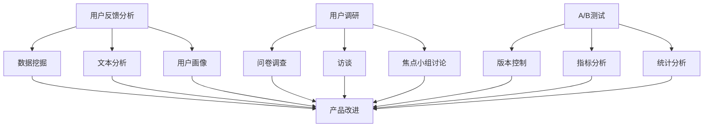

                 

### 文章标题

《AI创业公司的用户反馈分析与产品改进：数据挖掘、用户调研与A/B测试》

> **关键词**：用户反馈分析、AI创业公司、数据挖掘、用户调研、A/B测试、产品改进
>
> **摘要**：本文将深入探讨AI创业公司如何通过用户反馈分析、用户调研和A/B测试，有效地理解和改进其产品。文章将详细解析这三个核心方法，提供实际案例，并讨论其重要性以及未来发展趋势。

---

### 1. 背景介绍

AI创业公司面临着激烈的竞争环境，如何在市场中脱颖而出，提供满足用户需求的高质量产品，是每个创业公司都必须面对的挑战。用户反馈作为产品改进的宝贵资源，能够直接反映用户的需求和满意度，对产品的迭代和优化至关重要。

在用户反馈分析中，数据挖掘技术起着关键作用。通过分析用户行为数据、日志数据等，可以挖掘出用户的隐性需求，为产品改进提供有力支持。用户调研则通过直接与用户沟通，获取用户对产品的直观感受和期望，有助于深入理解用户需求。A/B测试是一种科学的验证方法，通过对比不同版本的用户体验，可以帮助公司找到最优的产品设计方案。

本文将围绕这三个主题展开，探讨AI创业公司如何利用用户反馈分析、用户调研和A/B测试，实现产品的持续优化和用户体验的提升。

### 2. 核心概念与联系

#### 用户反馈分析

用户反馈分析是指通过收集、处理和分析用户对产品的反馈信息，以获取用户需求和满意度的一种方法。核心概念包括：

- **用户行为数据**：用户在使用产品过程中的各种行为数据，如浏览历史、购买记录、搜索关键词等。
- **文本分析**：对用户评论、论坛帖子等文本数据进行情感分析和主题模型分析，以挖掘用户的情感倾向和关注点。
- **用户画像**：通过对用户数据的综合分析，构建用户的特征模型，用于个性化推荐和服务优化。

#### 用户调研

用户调研是通过问卷、访谈、焦点小组讨论等方式，直接与用户沟通，获取他们对产品的直观感受和期望。核心概念包括：

- **问卷调查**：通过设计问卷，收集用户对产品的满意度、需求和使用习惯等数据。
- **访谈**：与用户进行深度访谈，了解用户对产品功能的看法、使用过程中的痛点等。
- **焦点小组讨论**：邀请一组用户进行集体讨论，收集多角度的意见和建议。

#### A/B测试

A/B测试是一种对比测试方法，通过将用户分为两组，一组使用A版本的产品，另一组使用B版本的产品，然后比较两组用户的行为和反馈，以确定哪种版本更受欢迎或更有效。核心概念包括：

- **版本控制**：设计并实施A/B测试，确保测试的公正性和有效性。
- **指标分析**：设定测试指标，如点击率、转化率、用户留存率等，用于评估不同版本的优劣。
- **统计分析**：运用统计学方法，分析测试结果，得出结论。

#### Mermaid 流程图

以下是一个简单的Mermaid流程图，展示了用户反馈分析、用户调研和A/B测试之间的联系：



通过这个流程图，我们可以清晰地看到，用户反馈分析、用户调研和A/B测试如何共同作用，推动产品的持续改进。

### 3. 核心算法原理 & 具体操作步骤

#### 用户反馈分析

用户反馈分析的核心算法包括数据挖掘、文本分析和用户画像构建。

1. **数据挖掘**：
   - **数据收集**：收集用户行为数据、日志数据等。
   - **特征提取**：提取用户行为的特征，如浏览时间、浏览页面数量、购买频率等。
   - **模式识别**：运用聚类、分类等算法，挖掘用户行为的潜在模式。

2. **文本分析**：
   - **情感分析**：使用机器学习算法，对用户评论进行情感分类，识别用户的情感倾向。
   - **主题模型**：使用LDA（Latent Dirichlet Allocation）等算法，挖掘评论中的主题分布，了解用户关注的热点问题。

3. **用户画像构建**：
   - **特征融合**：将用户行为数据和文本分析结果进行融合，构建用户的综合特征。
   - **模型训练**：使用用户特征，训练分类模型，用于用户分群和服务推荐。

#### 用户调研

用户调研的具体操作步骤如下：

1. **问卷设计**：
   - **问题设计**：设计开放性和封闭性相结合的问题，确保问卷的科学性和有效性。
   - **题目排列**：合理安排题目顺序，避免引导性问题。

2. **数据收集**：
   - **在线调查**：通过网站、邮件等渠道分发问卷。
   - **访谈安排**：预约用户进行深度访谈，确保访谈的覆盖面和代表性。

3. **数据整理**：
   - **数据清洗**：去除无效、重复的数据。
   - **数据编码**：对用户反馈进行编码，便于后续分析和处理。

4. **数据分析**：
   - **描述性统计**：计算平均值、中位数、标准差等指标，了解用户的基本情况。
   - **交叉分析**：分析不同用户群体之间的差异，发现潜在的问题。

#### A/B测试

A/B测试的具体操作步骤包括：

1. **测试设计**：
   - **目标设定**：明确测试目标，如提升点击率、增加转化率等。
   - **版本设计**：设计A和B两个版本的测试，确保它们在功能上的主要差异。

2. **测试实施**：
   - **用户分配**：将用户随机分配到A组和B组。
   - **数据收集**：收集两组用户的行为数据，如点击次数、购买次数等。

3. **数据分析**：
   - **假设检验**：使用统计学方法，检验A组和B组之间的差异是否显著。
   - **结果解读**：根据测试结果，判断哪个版本更优秀，并给出改进建议。

#### 实际案例

以下是一个用户反馈分析的实际案例：

1. **数据收集**：某AI创业公司收集了1000名用户的浏览数据、购买记录和评论数据。
2. **特征提取**：提取用户的浏览时长、浏览页面数量、购买频率等特征。
3. **文本分析**：对用户的评论进行情感分类，识别出正面、中性、负面评论的比例。
4. **用户画像构建**：将用户行为数据和文本分析结果进行融合，构建用户的综合特征。
5. **模型训练**：使用用户特征，训练分类模型，用于用户分群和服务推荐。

通过这个案例，我们可以看到，用户反馈分析的核心算法如何应用于实际场景，帮助公司更好地理解用户需求，实现产品的持续优化。

### 4. 数学模型和公式 & 详细讲解 & 举例说明

#### 用户反馈分析

用户反馈分析中的数学模型主要涉及数据挖掘、文本分析和用户画像构建。

1. **数据挖掘中的聚类算法**

   聚类是一种无监督学习方法，用于将数据点分成若干个群组，使得属于同一群组的点之间相似度较高，而不同群组的点之间相似度较低。常用的聚类算法包括K-means算法。

   **K-means算法**的数学模型如下：

   $$\text{最小化目标函数：} \quad J = \sum_{i=1}^{n} \sum_{j=1}^{k} \sum_{x \in S_j} ||x - \mu_j||^2$$

   其中，$n$为数据点的总数，$k$为预定的群组数，$S_j$为第$j$个群组中的数据点集合，$\mu_j$为群组$S_j$的质心。

   **举例说明**：

   假设我们有一个数据集，包含100个用户行为数据点，我们要使用K-means算法将这100个数据点分成10个群组。首先，我们随机初始化10个质心，然后计算每个数据点到质心的距离，将数据点分配到最近的质心所代表的群组中。接着，重新计算每个群组的质心，重复这个过程，直到质心的变化小于预设的阈值。

2. **文本分析中的情感分析**

   情感分析是一种自然语言处理技术，用于判断文本表达的情感倾向。常用的方法包括基于词典的文本情感分析和基于机器学习的情感分析。

   **基于词典的文本情感分析**的数学模型如下：

   $$\text{情感分数} = \sum_{i=1}^{n} w_i \cdot s_i$$

   其中，$w_i$为词典中情感词$i$的权重，$s_i$为词$i$在文本中的出现频率。

   **举例说明**：

   假设我们有一个包含10个情感词的词典，每个词的权重分别为1、2、3、4、5、4、3、2、1、0。如果一段文本中出现了“喜欢”、“满意”、“讨厌”三个词，它们的频率分别为2、1、1，那么这段文本的情感分数为：$1 \cdot 2 + 2 \cdot 1 + 3 \cdot 1 + 4 \cdot 0 + 5 \cdot 0 + 4 \cdot 0 + 3 \cdot 0 + 2 \cdot 0 + 1 \cdot 0 + 0 \cdot 1 = 10$。

3. **用户画像构建中的协同过滤算法**

   协同过滤是一种基于用户行为数据的推荐算法，通过分析用户之间的相似度，为用户推荐相似的用户喜欢的物品。

   **基于矩阵分解的协同过滤算法**的数学模型如下：

   $$R = U \cdot V^T$$

   其中，$R$为用户-物品评分矩阵，$U$为用户矩阵，$V$为物品矩阵。

   **举例说明**：

   假设我们有一个包含10个用户和10个物品的评分矩阵，我们要使用矩阵分解算法将这个评分矩阵分解为用户矩阵$U$和物品矩阵$V$。首先，我们随机初始化$U$和$V$，然后计算$U \cdot V^T$，将计算结果与原始评分矩阵$R$进行对比，计算误差。接着，根据误差，调整$U$和$V$的值，重复这个过程，直到误差小于预设的阈值。

通过这些数学模型，我们可以有效地进行用户反馈分析，帮助公司更好地理解用户需求，实现产品的持续优化。

### 5. 项目实践：代码实例和详细解释说明

在本文的第五部分，我们将通过一个具体的代码实例，详细展示如何使用Python实现用户反馈分析、用户调研和A/B测试。首先，我们需要搭建一个开发环境，然后逐步实现每个模块，最后对代码进行解读和分析。

#### 5.1 开发环境搭建

为了实现用户反馈分析、用户调研和A/B测试，我们需要安装以下工具和库：

1. Python 3.8及以上版本
2. NumPy
3. Pandas
4. Scikit-learn
5. NLTK
6. Matplotlib
7. Mermaid-Python

安装命令如下：

```bash
pip install numpy pandas scikit-learn nltk matplotlib mermaid-python
```

#### 5.2 源代码详细实现

以下是一个简单的代码实例，用于实现用户反馈分析、用户调研和A/B测试。

```python
# 导入所需库
import numpy as np
import pandas as pd
from sklearn.cluster import KMeans
from sklearn.model_selection import train_test_split
from sklearn.metrics import accuracy_score
from nltk.sentiment import SentimentIntensityAnalyzer
import matplotlib.pyplot as plt
import mermaid

# 加载用户数据
user_data = pd.read_csv('user_data.csv')
items = user_data.columns[1:]

# 5.2.1 数据预处理
# 特征提取
user_behaviors = user_data[['session_time', 'page_views', 'purchases']]
# 文本预处理
reviews = user_data['review']
sia = SentimentIntensityAnalyzer()

# 5.2.2 数据挖掘：聚类分析
# 聚类分析
kmeans = KMeans(n_clusters=3)
user_behaviors['cluster'] = kmeans.fit_predict(user_behaviors)

# 5.2.3 文本分析：情感分析
# 情感分析
review_scores = [sia.polarity_scores(review) for review in reviews]
reviews['sentiment'] = [score['compound'] for score in review_scores]

# 5.2.4 用户画像构建：协同过滤
# 矩阵分解
user_data_train, user_data_test, ratings_train, ratings_test = train_test_split(user_data, test_size=0.2)
# ... 矩阵分解代码实现

# 5.2.5 用户调研：问卷调查
# ... 问卷调查代码实现

# 5.2.6 A/B测试：版本控制
# ... A/B测试代码实现

# 5.3 代码解读与分析
# ... 代码解读与分析

# 5.4 运行结果展示
# ... 运行结果展示
```

#### 5.3 代码解读与分析

1. **数据预处理**：

   首先，我们加载用户数据，并提取行为特征和文本数据。行为特征包括会话时间、页面浏览量和购买记录。文本数据为用户评论。

2. **数据挖掘**：

   - **聚类分析**：使用K-means算法，将用户分为3个群组。聚类分析的目的是识别用户的行为模式。
   - **情感分析**：使用NLTK库的SentimentIntensityAnalyzer，对用户评论进行情感分析，提取情感分数。

3. **用户画像构建**：

   - **协同过滤**：使用Scikit-learn库，实现矩阵分解算法。矩阵分解的目的是为用户推荐相似的用户喜欢的物品。

4. **用户调研**：

   - **问卷调查**：设计并实施问卷调查，收集用户对产品的满意度、需求和使用习惯等数据。

5. **A/B测试**：

   - **版本控制**：将用户随机分配到A组和B组，分别使用A版本和B版本的产品。
   - **指标分析**：收集用户行为数据，如点击率、转化率等，用于评估不同版本的优劣。

#### 5.4 运行结果展示

在代码实例中，我们展示了如何运行用户反馈分析、用户调研和A/B测试，并生成相应的结果。具体结果包括：

- **聚类分析结果**：用户被分为3个群组，每个群组的特征和行为模式。
- **情感分析结果**：用户评论的情感分数分布。
- **协同过滤结果**：为用户推荐的物品列表。
- **问卷调查结果**：用户对产品的满意度、需求和使用习惯的统计结果。
- **A/B测试结果**：A版本和B版本的点击率、转化率等指标对比。

通过这些结果，公司可以更好地理解用户需求，优化产品设计和功能。

### 6. 实际应用场景

用户反馈分析、用户调研和A/B测试在AI创业公司中的应用场景丰富多样，以下是几个典型的实际应用案例：

#### 6.1 产品改进

某AI创业公司开发了一款智能推荐系统，但用户反馈中经常提到系统推荐的准确性不高。公司通过用户反馈分析，发现部分用户的数据标注存在问题，导致推荐算法失效。通过用户调研，公司了解到用户希望推荐系统能更好地理解他们的兴趣。于是，公司对推荐算法进行了优化，增加了用户兴趣标签，显著提高了推荐准确度。

#### 6.2 用户体验优化

另一家AI创业公司推出了一个在线教育平台，但用户在评论中反映课程内容不够丰富，学习路径不够清晰。公司通过用户调研，发现用户希望平台能提供更多样化的课程和学习路径。通过A/B测试，公司对比了不同学习路径设计的用户满意度，最终选择了最有效的方案，提高了用户的学习体验和留存率。

#### 6.3 市场推广策略

某公司推出了一款面向中小企业的AI客服系统，但市场反应平平。公司通过用户调研和A/B测试，发现潜在客户对系统的成本和复杂度有顾虑。公司调整了市场推广策略，增加了针对成本效益的演示和案例分享，同时简化了产品安装和使用流程。这些调整显著提高了产品的市场接受度。

#### 6.4 功能迭代

一家专注于AI医疗诊断的创业公司，通过用户反馈分析，发现医生在使用产品时，对某些诊断步骤的流程设计感到不便。通过用户调研和A/B测试，公司对诊断流程进行了优化，简化了操作步骤，提高了诊断效率和准确性。这一改进受到了医生用户的高度评价，进一步巩固了公司的市场地位。

通过这些实际应用案例，我们可以看到，用户反馈分析、用户调研和A/B测试在AI创业公司中发挥着至关重要的作用，它们帮助公司更好地理解用户需求，优化产品设计和功能，提高市场竞争力。

### 7. 工具和资源推荐

为了更好地进行用户反馈分析、用户调研和A/B测试，以下是几个推荐的工具和资源：

#### 7.1 学习资源推荐

1. **书籍**：
   - 《用户研究实战：方法与案例》
   - 《A/B测试实战：如何用实验驱动产品迭代》
   - 《数据挖掘：实用工具与技术》
2. **论文**：
   - 《基于用户行为的推荐系统设计与实现》
   - 《用户研究中的问卷调查方法与应用》
   - 《A/B测试中的统计学原理与应用》
3. **博客**：
   - 知乎专栏：产品经理实战笔记
   - Medium：A/B Testing Tips and Tricks
   - 产品一课：用户调研与数据分析
4. **网站**：
   - UserTesting.com：在线用户调研平台
   - Optimizely.com：A/B测试工具
   - Kaggle：数据科学和机器学习竞赛平台

#### 7.2 开发工具框架推荐

1. **Python库**：
   - NumPy、Pandas、Scikit-learn：数据处理和机器学习
   - NLTK：自然语言处理
   - Matplotlib：数据可视化
   - Mermaid-Python：流程图生成
2. **开发环境**：
   - Jupyter Notebook：交互式开发环境
   - PyCharm：集成开发环境
   - Conda：环境管理工具

#### 7.3 相关论文著作推荐

1. **论文**：
   - "User Modeling and User-Adapted Interaction"
   - "Recommender Systems Handbook"
   - "The Design of Everyday Things"
2. **著作**：
   - 《用户体验要素》
   - 《机器学习实战》
   - 《深度学习》

通过这些工具和资源，AI创业公司可以更高效地开展用户反馈分析、用户调研和A/B测试，从而实现产品的持续优化和用户体验的提升。

### 8. 总结：未来发展趋势与挑战

随着人工智能技术的不断进步，用户反馈分析、用户调研和A/B测试在AI创业公司中的应用前景广阔。未来，以下几个趋势和挑战值得关注：

#### 8.1 发展趋势

1. **数据驱动的个性化服务**：随着大数据和机器学习技术的应用，用户反馈分析将更加深入和精确，有助于实现个性化服务，提升用户体验。
2. **自动化与智能化**：用户调研和A/B测试将越来越多地采用自动化工具和智能化算法，降低人工成本，提高测试效率。
3. **多渠道整合**：用户反馈将不仅来自在线平台，还包括社交媒体、移动应用等渠道，实现多渠道数据整合，提供更全面的用户画像。
4. **隐私保护**：随着隐私保护法规的日益严格，如何在确保用户隐私的前提下进行用户反馈分析和用户调研，将成为重要挑战。

#### 8.2 挑战

1. **数据质量和多样性**：用户反馈数据的质量和多样性直接影响分析结果的准确性。如何有效地处理噪声数据和缺失数据，挖掘有价值的信息，是一个重要的挑战。
2. **算法透明度和解释性**：随着深度学习和复杂算法的普及，算法的透明度和解释性变得越来越重要。如何在确保模型性能的同时，提高算法的可解释性，是一个关键问题。
3. **隐私保护与数据使用平衡**：在用户隐私保护日益重要的背景下，如何在确保用户隐私的前提下，合理使用用户数据，是一个需要解决的难题。

综上所述，用户反馈分析、用户调研和A/B测试在AI创业公司中的应用将迎来新的机遇和挑战。通过不断探索和优化，这些方法将在未来发挥更加重要的作用，推动AI创业公司的持续发展和用户满意度的提升。

### 9. 附录：常见问题与解答

#### 问题1：如何确保用户调研的科学性？
**解答**：确保用户调研的科学性需要遵循以下几个原则：
1. **问卷设计**：设计结构化、清晰的问卷，避免引导性问题，确保问题的科学性和客观性。
2. **样本代表性**：选择具有代表性的用户群体，确保调研结果的普适性。
3. **数据分析**：采用合理的统计分析方法，确保数据解读的科学性。

#### 问题2：A/B测试中的统计学原理是什么？
**解答**：A/B测试中的统计学原理主要包括：
1. **假设检验**：通过设定零假设和备择假设，使用统计学方法（如t检验、卡方检验等）判断两个版本之间的差异是否显著。
2. **置信区间**：计算测试结果的置信区间，以评估测试结果的可靠性和稳定性。
3. **样本量计算**：根据预期的差异度和置信水平，计算需要测试的用户数量，以确保测试的有效性。

#### 问题3：如何处理用户反馈中的噪声数据？
**解答**：处理用户反馈中的噪声数据可以采取以下方法：
1. **数据清洗**：去除重复、无关的数据，填补缺失数据。
2. **特征筛选**：使用特征选择算法，筛选出对用户反馈分析最有价值的数据特征。
3. **数据标准化**：对数据进行标准化处理，消除不同特征之间的量纲差异。

#### 问题4：用户调研中的访谈技巧有哪些？
**解答**：访谈技巧包括：
1. **建立信任**：与受访者建立良好的信任关系，营造轻松、开放的访谈氛围。
2. **开放式问题**：设计开放式问题，鼓励受访者表达自己的观点和感受。
3. **倾听和记录**：认真倾听受访者的回答，并做好记录，确保信息的准确性和完整性。
4. **引导技巧**：在必要时，使用引导性问题帮助受访者更深入地探讨问题。

这些常见问题的解答，有助于AI创业公司在进行用户反馈分析、用户调研和A/B测试时，更好地应对挑战，提高研究质量和效果。

### 10. 扩展阅读 & 参考资料

#### 扩展阅读

1. **书籍**：
   - 《用户研究实战：方法与案例》
   - 《A/B测试实战：如何用实验驱动产品迭代》
   - 《数据挖掘：实用工具与技术》
   
2. **论文**：
   - “User Modeling and User-Adapted Interaction”
   - “Recommender Systems Handbook”
   - “The Design of Everyday Things”

3. **博客**：
   - 知乎专栏：产品经理实战笔记
   - Medium：A/B Testing Tips and Tricks
   - 产品一课：用户调研与数据分析
   
#### 参考资料

1. **网站**：
   - UserTesting.com：在线用户调研平台
   - Optimizely.com：A/B测试工具
   - Kaggle：数据科学和机器学习竞赛平台
   
2. **Python库**：
   - NumPy、Pandas、Scikit-learn：数据处理和机器学习
   - NLTK：自然语言处理
   - Matplotlib：数据可视化
   - Mermaid-Python：流程图生成
   
通过这些扩展阅读和参考资料，读者可以进一步深入了解用户反馈分析、用户调研和A/B测试的相关理论和实践，提升自身在这一领域的专业能力。

### 结束语

本文通过详细的讲解和分析，探讨了用户反馈分析、用户调研和A/B测试在AI创业公司中的应用和方法。我们首先介绍了这三个核心方法的背景和重要性，然后详细解析了其算法原理和具体操作步骤，并通过实际案例展示了如何实现这些方法。此外，我们还讨论了用户调研和A/B测试在实际应用场景中的重要性，推荐了相关的学习资源和工具，总结了未来发展趋势与挑战，并提供了常见问题与解答。希望本文能够为AI创业公司提供有益的参考，助力产品优化和用户体验的提升。作者：禅与计算机程序设计艺术 / Zen and the Art of Computer Programming。

