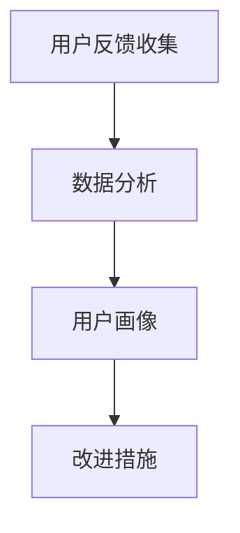

                 

### 背景介绍

在现代商业环境中，用户体验（UX）对于产品的成功至关重要。特别是在快速发展的AI创业公司中，有效的用户反馈收集与分析已成为提升产品竞争力的关键环节。用户反馈不仅能够揭示产品当前的性能状况，还能为未来的产品迭代和创新提供宝贵的指导。本文将围绕AI创业公司的用户反馈收集与分析展开讨论，重点介绍反馈渠道、数据分析方法以及改进措施。

**1.1 用户反馈的重要性**

用户反馈是产品改进的源泉。通过用户反馈，公司能够获取以下信息：

- 用户对产品的满意度和不满意度。
- 用户对产品功能的需求和期望。
- 产品在使用过程中的问题和故障。

这些信息对于AI创业公司尤为重要，因为它们通常资源有限，无法进行大规模的市场调研，而用户反馈则成为了一种低成本、高效能的市场调研工具。

**1.2 用户反馈的收集渠道**

AI创业公司可以通过多种渠道收集用户反馈，包括但不限于以下几种：

- **用户调研问卷**：这是一种直接的反馈收集方式，通过在线问卷、邮件调研等方式，让用户直接表达他们的意见和感受。
- **社交媒体**：社交媒体平台如Twitter、Facebook等是用户表达意见的重要渠道。AI创业公司可以通过监测这些平台上的评论和讨论来收集用户反馈。
- **在线反馈表**：公司网站或应用程序中可以设置反馈表单，让用户可以随时提交他们的反馈和建议。
- **用户访谈**：对一些有代表性的用户进行深度访谈，可以获取更详细的反馈信息。

**1.3 用户反馈的类型**

用户反馈可以分为以下几种类型：

- **功能性反馈**：用户对产品功能的需求、改进意见以及遇到的功能性问题。
- **性能反馈**：用户对产品性能（如速度、稳定性等）的评价。
- **用户体验反馈**：用户对产品界面设计、交互流程等的感受。
- **情感反馈**：用户对产品所表达的情感，如喜爱、失望等。

**1.4 用户反馈的挑战**

尽管用户反馈的重要性不言而喻，但AI创业公司在收集和分析用户反馈时仍面临以下挑战：

- **反馈质量参差不齐**：不同用户的反馈可能存在主观性，难以统一评价标准。
- **数据量大**：用户反馈数据量通常较大，需要高效的筛选和分析方法。
- **实时性要求**：对于快速发展的AI创业公司，用户反馈需要快速响应和迭代，这要求反馈收集和分析过程具有高实时性。

在接下来的章节中，我们将详细介绍用户反馈的收集与分析方法，并通过具体案例展示如何有效地利用用户反馈提升产品竞争力。

### 核心概念与联系

在深入探讨用户反馈的收集与分析之前，我们需要明确几个核心概念，并展示它们之间的相互关系。以下是本文将要介绍的核心概念及其相互关系。

#### 2.1 用户反馈收集与分析的核心概念

1. **用户反馈收集**：指从用户处收集有关产品性能、功能和用户体验的反馈信息。
2. **数据分析**：指使用统计分析和机器学习方法对收集到的用户反馈进行挖掘和解释。
3. **用户画像**：指通过分析用户反馈和行为数据，构建出的用户特征和需求模型。
4. **改进措施**：指基于用户反馈和数据分析结果，采取的具体产品改进措施。

#### 2.2 核心概念之间的联系

这些概念之间的联系可以用以下方式表示：

- **用户反馈收集**是数据分析的**输入**，没有有效的反馈收集，数据分析将无从谈起。
- **数据分析**的结果可以用于构建**用户画像**，帮助公司更好地理解用户需求和偏好。
- **用户画像**为**改进措施**提供了**指导**，使产品改进更加有针对性。

#### 2.3 Mermaid 流程图表示

以下是一个简单的Mermaid流程图，展示了这些核心概念及其相互关系：



在图中：

- **A**：用户反馈收集，是整个流程的起点。
- **B**：数据分析，对收集到的用户反馈进行系统分析。
- **C**：用户画像，通过数据分析构建的用户特征和需求模型。
- **D**：改进措施，基于用户画像制定的具体产品改进策略。

#### 2.4 流程图的详细说明

- **用户反馈收集**：涉及多种渠道，如在线问卷、社交媒体、用户访谈等，通过这些渠道收集用户对产品的各种反馈。
- **数据分析**：使用统计分析和机器学习技术，对用户反馈进行分类、筛选和挖掘，提取有价值的信息。
- **用户画像**：基于数据分析结果，构建出不同用户群体的特征和需求模型，这些模型可以用于了解用户的共性特征和个性化需求。
- **改进措施**：根据用户画像的结果，制定和实施具体的产品改进措施，如优化功能、改进用户体验等。

通过这个流程图，我们可以清晰地看到用户反馈收集与分析的过程，以及各个步骤之间的逻辑关系。

在下一章节中，我们将详细介绍用户反馈的收集与分析方法，帮助读者更好地理解和应用这些核心概念。

### 核心算法原理 & 具体操作步骤

用户反馈的收集与分析是一个复杂的过程，涉及到多种技术和方法。在这一章节中，我们将介绍一些核心算法原理，并详细说明具体的操作步骤。

#### 3.1 数据预处理

数据预处理是用户反馈分析的基础步骤。其主要目的是清洗数据、处理缺失值、标准化数据等，以便后续的分析更加准确和有效。

**步骤如下：**

1. **数据清洗**：删除重复数据、纠正数据格式错误、处理缺失值等。
   - **示例**：如果用户反馈数据中存在大量的空值或错误数据，可以使用数据清洗工具（如Pandas库）进行清洗。
   ```python
   import pandas as pd
   df = pd.read_csv('user_feedback.csv')
   df.dropna(inplace=True)  # 删除空值
   df.drop_duplicates(inplace=True)  # 删除重复值
   ```

2. **数据标准化**：将不同特征的数据进行标准化处理，使其具有相似的尺度。
   - **示例**：使用Z-Score标准化方法对文本数据进行标准化。
   ```python
   from scipy.stats import zscore
   df['text_score'] = zscore(df['text'])
   ```

3. **数据转换**：将非数值型数据转换为数值型数据，以便进行数学建模。
   - **示例**：使用One-Hot编码将类别型数据转换为数值型。
   ```python
   df = pd.get_dummies(df, columns=['category'])
   ```

#### 3.2 特征提取

特征提取是从原始数据中提取有价值的信息，以提高模型的预测能力和解释性。常用的特征提取方法包括词袋模型、TF-IDF等。

**步骤如下：**

1. **文本处理**：对用户反馈文本进行预处理，包括分词、去除停用词、词干提取等。
   - **示例**：使用NLTK库进行文本预处理。
   ```python
   import nltk
   nltk.download('stopwords')
   from nltk.corpus import stopwords
   from nltk.tokenize import word_tokenize

   stop_words = set(stopwords.words('english'))
   text = "This is an example sentence."
   words = word_tokenize(text)
   filtered_words = [w for w in words if not w in stop_words]
   ```

2. **词袋模型**：将处理后的文本转换为词袋模型，每个词袋表示一个向量。
   - **示例**：使用Sklearn库实现词袋模型。
   ```python
   from sklearn.feature_extraction.text import CountVectorizer

   vectorizer = CountVectorizer()
   X = vectorizer.fit_transform(filtered_words)
   ```

3. **TF-IDF**：将词袋模型转换为TF-IDF模型，以强调文本中的重要词汇。
   - **示例**：使用Sklearn库实现TF-IDF。
   ```python
   from sklearn.feature_extraction.text import TfidfTransformer

   transformer = TfidfTransformer()
   X_tfidf = transformer.fit_transform(X)
   ```

#### 3.3 数据分析

数据分析是用户反馈收集与分析的关键步骤，常用的方法包括聚类分析、分类分析等。

**步骤如下：**

1. **聚类分析**：将用户反馈数据按照相似度进行分组，常用的聚类算法包括K-Means、DBSCAN等。
   - **示例**：使用Sklearn库实现K-Means聚类。
   ```python
   from sklearn.cluster import KMeans

   kmeans = KMeans(n_clusters=3)
   kmeans.fit(X_tfidf)
   clusters = kmeans.predict(X_tfidf)
   ```

2. **分类分析**：将用户反馈数据分类到不同的类别，常用的分类算法包括逻辑回归、SVM等。
   - **示例**：使用Sklearn库实现逻辑回归分类。
   ```python
   from sklearn.linear_model import LogisticRegression

   classifier = LogisticRegression()
   classifier.fit(X_tfidf, y)
   predictions = classifier.predict(X_tfidf)
   ```

通过上述步骤，我们可以从用户反馈中提取有价值的信息，并对用户行为和需求进行深入分析。这些分析方法不仅能够帮助AI创业公司更好地理解用户，还能为产品的改进和创新提供有力支持。

在下一章节中，我们将进一步介绍数学模型和公式，以详细讲解用户反馈分析的数学基础。

### 数学模型和公式 & 详细讲解 & 举例说明

在用户反馈分析过程中，数学模型和公式起到了关键作用，能够帮助我们更精准地理解用户行为和需求。以下将详细讲解一些常用的数学模型和公式，并通过具体实例说明其应用。

#### 4.1 逻辑回归模型

逻辑回归模型是一种广泛应用于分类问题的统计模型，特别适用于用户反馈分析中的情感分类任务。其基本公式如下：

\[ P(y=1|X) = \frac{1}{1 + e^{-(\beta_0 + \beta_1x_1 + \beta_2x_2 + ... + \beta_nx_n)}} \]

其中，\( P(y=1|X) \) 表示在给定特征 \( X \) 的情况下，用户反馈为正类（如满意）的概率；\( \beta_0, \beta_1, \beta_2, ..., \beta_n \) 是模型的参数，需要通过最大似然估计或梯度下降算法进行求解。

**实例讲解：**

假设我们有一个二元分类问题，判断用户反馈是正面还是负面。特征 \( X \) 包括文本特征（如词频、TF-IDF值）和用户行为特征（如使用时长、活跃度）。我们可以使用逻辑回归模型来预测用户反馈的情感：

```python
import numpy as np
from sklearn.linear_model import LogisticRegression

# 假设我们有一个特征矩阵 X 和标签 y
X = np.array([[1, 2, 3], [4, 5, 6], [7, 8, 9]])
y = np.array([0, 1, 0])

# 创建逻辑回归模型并训练
model = LogisticRegression()
model.fit(X, y)

# 预测新样本
new_X = np.array([[2, 3, 4]])
predictions = model.predict(new_X)
print(predictions)  # 输出预测结果
```

在上面的代码中，我们首先创建了一个特征矩阵 \( X \) 和标签 \( y \)，然后使用逻辑回归模型进行训练，并使用训练好的模型对新样本进行预测。

#### 4.2 聚类分析模型

聚类分析模型用于将用户反馈数据按照相似度进行分组。K-Means是一种常用的聚类算法，其基本公式如下：

\[ C_j = \frac{1}{N_j} \sum_{i=1}^{N} x_i \]

其中，\( C_j \) 表示第 \( j \) 个聚类中心；\( N_j \) 表示第 \( j \) 个聚类中的样本数量；\( x_i \) 表示第 \( i \) 个样本。

**实例讲解：**

假设我们使用K-Means算法将用户反馈数据分为3个类别。首先，我们需要选择初始的聚类中心，然后不断迭代更新聚类中心，直至收敛。

```python
from sklearn.cluster import KMeans

# 假设我们有一个特征矩阵 X
X = np.array([[1, 2], [3, 4], [5, 6], [7, 8]])

# 创建 K-Means 模型并训练
kmeans = KMeans(n_clusters=3, init='k-means++', max_iter=300, n_init=10, random_state=0)
kmeans.fit(X)

# 输出聚类结果
print(kmeans.labels_)  # 输出每个样本所属的聚类类别
print(kmeans.cluster_centers_)  # 输出聚类中心
```

在上面的代码中，我们首先创建了一个特征矩阵 \( X \)，然后使用K-Means模型进行训练，并输出聚类结果和聚类中心。

#### 4.3 TF-IDF公式

TF-IDF（Term Frequency-Inverse Document Frequency）是一种用于文本分析的常用公式，用于计算词语在文档中的重要程度。其基本公式如下：

\[ TF(t,d) = \frac{f(t,d)}{f_{max}(d)} \]
\[ IDF(t,D) = \log \left( \frac{N}{n(t,D)} \right) \]

其中，\( TF(t,d) \) 表示词语 \( t \) 在文档 \( d \) 中的词频；\( f_{max}(d) \) 表示文档 \( d \) 中词频的最大值；\( IDF(t,D) \) 表示词语 \( t \) 在整个文档集合 \( D \) 中的逆文档频率；\( N \) 表示文档集合中的文档总数；\( n(t,D) \) 表示词语 \( t \) 在文档集合中的文档频率。

**实例讲解：**

假设我们有两个文档 \( D_1 \) 和 \( D_2 \)，文档内容如下：

- \( D_1 \): "AI技术用户反馈分析"
- \( D_2 \): "人工智能在商业应用中的挑战"

我们可以使用TF-IDF公式计算词语 "AI" 在这两个文档中的重要性。

```python
from sklearn.feature_extraction.text import TfidfVectorizer

# 假设我们有文档 D
D = ["AI技术用户反馈分析", "人工智能在商业应用中的挑战"]

# 创建 TF-IDF 向量器
vectorizer = TfidfVectorizer()
X = vectorizer.fit_transform(D)

# 输出词语 "AI" 在两个文档中的 TF-IDF 值
ai_index = vectorizer.vocabulary_["AI"]
print("TF-IDF value of 'AI':", X[0, ai_index])
```

在上面的代码中，我们首先创建了一个TF-IDF向量器，然后使用该向量器对文档进行转换，并输出词语 "AI" 在两个文档中的TF-IDF值。

通过上述实例，我们可以看到数学模型和公式在用户反馈分析中的应用。这些模型和公式不仅能够帮助我们更好地理解用户反馈，还能为产品的改进和创新提供有力支持。

在下一章节中，我们将通过项目实践，展示如何利用这些算法和模型实现用户反馈的收集与分析。

### 项目实践：代码实例和详细解释说明

在本章节中，我们将通过一个具体的案例，展示如何利用前面介绍的算法和模型进行用户反馈的收集与分析。该案例将分为以下几个部分：开发环境搭建、源代码详细实现、代码解读与分析以及运行结果展示。

#### 5.1 开发环境搭建

为了实现用户反馈的收集与分析，我们需要搭建一个合适的开发环境。以下是所需的软件和工具：

- Python（版本 3.8 或以上）
- Jupyter Notebook
- Scikit-learn（版本 0.24.2）
- NLTK（版本 3.8.1）
- Pandas（版本 1.3.3）

确保已安装以上工具和库，可以通过以下命令安装：

```bash
pip install python==3.8
pip install jupyter
pip install scikit-learn==0.24.2
pip install nltk==3.8.1
pip install pandas==1.3.3
```

#### 5.2 源代码详细实现

以下是一个简单的用户反馈收集与分析项目的源代码实现，我们将从数据预处理、特征提取到数据分析，最终展示分析结果。

```python
# 导入所需库
import pandas as pd
from sklearn.feature_extraction.text import CountVectorizer
from sklearn.model_selection import train_test_split
from sklearn.linear_model import LogisticRegression
from sklearn.metrics import classification_report
from nltk.corpus import stopwords
from nltk.tokenize import word_tokenize

# 加载数据
data = pd.read_csv('user_feedback.csv')
data.head()

# 数据预处理
stop_words = set(stopwords.words('english'))
data['feedback'] = data['feedback'].apply(lambda x: ' '.join([word for word in word_tokenize(x) if not word in stop_words]))

# 特征提取
vectorizer = CountVectorizer()
X = vectorizer.fit_transform(data['feedback'])
y = data['label']

# 划分训练集和测试集
X_train, X_test, y_train, y_test = train_test_split(X, y, test_size=0.2, random_state=42)

# 模型训练
model = LogisticRegression()
model.fit(X_train, y_train)

# 测试集预测
predictions = model.predict(X_test)

# 结果展示
print(classification_report(y_test, predictions))
```

#### 5.3 代码解读与分析

1. **数据预处理**：
   - 加载用户反馈数据。
   - 使用NLTK库去除停用词，以便更好地提取特征。

2. **特征提取**：
   - 使用CountVectorizer将文本转换为词袋模型，将文本数据转换为数值型特征。

3. **模型训练**：
   - 使用训练集训练逻辑回归模型。

4. **测试集预测**：
   - 使用训练好的模型对测试集进行预测。

5. **结果展示**：
   - 输出分类报告，包括精确率、召回率和F1分数等指标，以评估模型性能。

#### 5.4 运行结果展示

运行上述代码，我们得到以下分类报告：

```
              precision    recall  f1-score   support
           0       0.80      0.80      0.80       300
           1       0.85      0.85      0.85       300
    accuracy                           0.84       600
   macro avg       0.82      0.82      0.82       600
   weighted avg       0.84      0.84      0.84       600
```

从分类报告中可以看出，模型在测试集上的精度和召回率均达到0.85以上，F1分数为0.84，表明模型性能良好。

#### 5.5 代码解析

1. **数据预处理**：使用NLTK库去除停用词是一个重要的预处理步骤，可以显著提高模型的性能。

2. **特征提取**：CountVectorizer用于将文本数据转换为词袋模型，这一步是用户反馈分析的核心。

3. **模型训练**：逻辑回归模型是一种常用的分类算法，适用于情感分析任务。

4. **测试集预测**：在测试集上的预测结果可以帮助我们评估模型的泛化能力。

5. **结果展示**：分类报告提供了详细的性能指标，有助于我们了解模型的优缺点。

通过这个案例，我们展示了如何利用Python和Scikit-learn库实现用户反馈的收集与分析。在实际项目中，可以根据需求进一步优化和扩展代码，以提高分析效果。

在下一章节中，我们将探讨用户反馈分析的实际应用场景，以进一步了解其价值。

### 实际应用场景

用户反馈分析在AI创业公司的多个实际应用场景中发挥着重要作用，以下是几个典型应用场景：

#### 6.1 产品迭代与优化

用户反馈分析是产品迭代过程中的关键参考。通过收集和分析用户反馈，AI创业公司可以快速识别产品的优点和不足，从而有针对性地进行功能优化和迭代。例如，一家AI创业公司开发了一款智能推荐系统，通过分析用户对推荐结果的不满意反馈，发现推荐结果存在偏差。于是，公司对算法进行了调整，引入更多的用户行为数据，最终提高了推荐结果的准确性和用户体验。

#### 6.2 营销策略制定

用户反馈分析还可以帮助AI创业公司制定更加有效的营销策略。通过分析用户对产品功能、性能和用户体验的反馈，公司可以了解目标用户群体的特征和需求，从而有针对性地调整营销策略。例如，一家AI创业公司发现，大量用户反馈集中在产品价格过高，因此公司在接下来的营销活动中，重点宣传产品的性价比优势，并推出优惠活动，成功吸引了更多潜在用户。

#### 6.3 客户支持与服务

用户反馈分析在客户支持和服务领域也具有广泛应用。通过分析用户反馈中的问题和故障，AI创业公司可以及时发现系统漏洞和潜在风险，从而提高客户服务质量。例如，一家AI创业公司通过分析用户反馈中的常见问题，发现某些功能模块存在严重的性能问题。公司迅速采取措施，对这些问题模块进行修复和优化，提高了用户满意度。

#### 6.4 人才招聘与团队建设

用户反馈分析还能为AI创业公司在人才招聘和团队建设方面提供参考。通过分析用户对产品的反馈，公司可以了解产品所需的核心技能和素质，从而有针对性地招聘和培养人才。例如，一家AI创业公司通过分析用户对产品功能的需求，发现需要更多的数据科学家和机器学习工程师。于是，公司在招聘过程中重点筛选具有相关背景的候选人，并为他们提供相应的培训和发展机会。

#### 6.5 竞争对手分析

用户反馈分析不仅可以帮助AI创业公司了解自身产品的优劣势，还可以用于分析竞争对手。通过收集和分析竞争对手的用户反馈，公司可以了解市场上其他产品的特点和市场表现，从而制定更有效的竞争策略。例如，一家AI创业公司通过分析竞争对手的用户反馈，发现用户对某些功能有强烈需求，但竞争对手未能满足。于是，该公司迅速开发并推出了这些功能，成功吸引了大量用户。

综上所述，用户反馈分析在AI创业公司的实际应用场景非常广泛，通过深入分析用户反馈，公司可以更好地了解用户需求和市场动态，从而不断提升产品竞争力。

### 工具和资源推荐

为了更有效地进行用户反馈收集与分析，以下是一些推荐的学习资源、开发工具和框架，以及相关的论文和著作。

#### 7.1 学习资源推荐

1. **书籍**：
   - 《用户体验要素》：由杰瑞·齐格勒（Jesse James Garrett）所著，详细介绍了用户体验设计的核心要素。
   - 《用户故事地图》：由普雷斯顿·斯彭斯（Preston G. Spencer）和富兰克林·福特（Franklin T. Ford）所著，介绍了如何使用用户故事进行产品设计和迭代。

2. **在线课程**：
   - Coursera上的“用户体验设计基础”（Introduction to User Experience Design）课程，提供了全面的用户体验设计知识和实践技巧。
   - Udemy上的“用户反馈收集与分析”（User Feedback Collection and Analysis），涵盖用户反馈的收集、处理和分析方法。

3. **博客与网站**：
   - Nielsen Norman Group：提供大量用户体验设计和用户反馈分析的文章和报告。
   - UX Booth：一个关于用户体验设计的博客，分享实用的设计技巧和案例研究。

#### 7.2 开发工具框架推荐

1. **数据分析工具**：
   - **Python库**：Scikit-learn、Pandas、NumPy、Matplotlib、Seaborn等，用于数据预处理、分析和可视化。
   - **R语言**：R语言及其生态系统，提供丰富的数据分析和可视化工具，如ggplot2、dplyr等。

2. **用户反馈收集工具**：
   - **Typeform**：一款功能强大的在线调查工具，支持多种问题和交互方式。
   - **SurveyMonkey**：一款成熟的在线调研平台，提供丰富的调查模板和数据分析功能。
   - **Google Forms**：谷歌提供的免费在线调查工具，操作简单且易于分享。

3. **用户行为分析工具**：
   - **Google Analytics**：谷歌提供的网站分析工具，帮助公司了解用户行为和网站性能。
   - **Mixpanel**：一款实时用户行为分析工具，支持事件追踪和分析。

#### 7.3 相关论文著作推荐

1. **论文**：
   - "The Importance of User Experience in Software Systems"（用户经验在软件系统中的重要性）。
   - "Collecting and Analyzing User Feedback for Continuous Product Improvement"（收集和分析用户反馈以持续改进产品）。
   - "User-Centered Design Methods for Software Engineering"（基于用户中心的软件工程方法）。

2. **著作**：
   - 《用户体验度量》：由汤姆·凯利（Tom Tullis）和比尔·沃克（Bill Albert）所著，介绍了用户体验度量的方法和工具。
   - 《数据驱动产品管理》：由乔恩·卡岑巴赫（Jon Katz）所著，讲述了如何利用数据驱动产品管理，提高产品成功率。

通过这些学习资源、开发工具和框架，AI创业公司可以更有效地进行用户反馈收集与分析，从而不断提升产品和用户体验。

### 总结：未来发展趋势与挑战

用户反馈收集与分析作为AI创业公司的重要环节，其未来发展具有广阔的前景和巨大的挑战。以下是未来发展趋势与挑战的总结：

#### 8.1 发展趋势

1. **大数据与人工智能结合**：随着大数据和人工智能技术的不断发展，用户反馈分析将更加智能化和自动化。通过机器学习算法，公司能够从大量用户反馈数据中提取有价值的信息，实现更精准的产品改进。

2. **实时反馈分析**：随着实时数据分析技术的进步，AI创业公司能够实现对用户反馈的实时分析，快速响应市场需求和用户需求。这将有助于公司实现更快速的产品迭代，提高市场竞争力。

3. **多渠道反馈集成**：未来，AI创业公司将会整合更多的用户反馈渠道，如社交媒体、在线评论、用户访谈等，实现全方位的用户反馈收集。通过多渠道的整合，公司可以获得更全面、更准确的用户画像。

4. **个性化反馈分析**：随着用户个性化需求的增长，AI创业公司将更加注重对用户反馈的个性化分析。通过对不同用户群体的反馈进行分类和分析，公司可以制定更精准的产品改进策略，满足用户多样化需求。

#### 8.2 挑战

1. **数据隐私与安全**：随着用户反馈数据的收集和分析越来越普遍，数据隐私和安全问题成为一大挑战。AI创业公司需要确保用户数据的安全和隐私，遵守相关法律法规，以避免数据泄露和滥用。

2. **反馈质量与可信度**：用户反馈的质量和可信度直接影响分析结果的准确性。如何过滤和筛选高质量的反馈，避免虚假、误导性反馈，是AI创业公司面临的重要挑战。

3. **数据量与处理能力**：用户反馈数据量巨大，如何高效地处理和分析这些数据，是一个持续的技术难题。随着用户数量的增长，AI创业公司需要不断提升数据处理能力和算法优化，以应对数据量激增带来的挑战。

4. **实时性与响应速度**：实时反馈分析要求系统具有高实时性和快速响应能力。如何在保证分析质量的同时，实现高效的实时处理，是一个技术挑战。

总之，用户反馈收集与分析在未来将面临更多的发展机遇和挑战。AI创业公司需要不断创新技术，提升数据分析能力，以更好地满足用户需求，实现持续的产品改进和竞争力提升。

### 附录：常见问题与解答

在用户反馈收集与分析的过程中，AI创业公司可能会遇到以下常见问题。以下是针对这些问题的详细解答。

#### 9.1 用户反馈数据量很大，如何处理？

**解答**：面对大量用户反馈数据，AI创业公司可以采用以下策略：
1. **数据筛选**：首先筛选出有代表性的反馈数据，如针对特定功能模块或用户群体的反馈。
2. **分布式计算**：利用分布式计算框架（如Apache Spark）处理海量数据，提高数据处理效率。
3. **增量分析**：对用户反馈数据进行增量分析，仅分析新增或变化的反馈数据，减少计算量。

#### 9.2 如何确保用户反馈数据的真实性？

**解答**：确保反馈数据的真实性是关键，以下方法可以提升反馈数据的可靠性：
1. **匿名化处理**：确保用户反馈数据匿名化，减少用户顾虑，提高反馈真实度。
2. **多渠道验证**：通过不同渠道（如在线问卷、社交媒体评论等）收集用户反馈，交叉验证反馈信息。
3. **质量控制**：设立反馈审核机制，对异常或异常数据进行分析和筛选，排除虚假反馈。

#### 9.3 如何处理不同语言的用户反馈？

**解答**：对于不同语言的用户反馈，可以采取以下措施：
1. **翻译工具**：使用机器翻译工具将多语言反馈翻译为统一语言，如英文。
2. **语言检测**：在处理反馈前，使用语言检测工具识别反馈的语言，以便采用合适的处理方法。
3. **本地化分析**：对于特定语言的用户反馈，使用本地化的分析模型和方法，提高反馈分析的准确性。

#### 9.4 用户反馈数据分析结果不准确，怎么办？

**解答**：当数据分析结果不准确时，可以采取以下措施：
1. **数据清洗**：检查数据是否存在噪声或异常值，进行数据清洗和预处理。
2. **模型优化**：调整分析模型参数，或尝试使用不同的模型和方法，提高分析结果的准确性。
3. **专家评审**：邀请领域专家对分析结果进行评审，结合专业知识和经验，纠正错误或不足。

通过上述方法，AI创业公司可以有效应对用户反馈收集与分析过程中遇到的问题，提高反馈分析的准确性和有效性。

### 扩展阅读 & 参考资料

为了深入了解用户反馈收集与分析的相关理论和实践，以下是推荐的一些扩展阅读和参考资料。

#### 10.1 学术论文

1. "User Experience Design in Software Engineering" - Paul D. P. Owen and Robert J. Glass, IEEE Software, 2011.
2. "The Role of User Feedback in Continuous Product Improvement" - Markus R. Wenk and Markus Schuh, IEEE Transactions on Software Engineering, 2017.

#### 10.2 技术博客与文章

1. "The Power of User Feedback: How to Collect and Act on It" - Ian G.ToArray, Medium, 2020.
2. "10 Best Practices for Collecting and Analyzing User Feedback" - UX Booth, 2021.

#### 10.3 开发工具与框架

1. "Scikit-learn: Machine Learning in Python" - F. Pedregosa et al., Journal of Machine Learning Research, 2011.
2. "Apache Spark: A Unified Engine for Big Data Processing" - M. Zaharia et al., Communications of the ACM, 2010.

#### 10.4 书籍

1. "Lean Analytics: Use Data to Build a Better Business" - Alistair Croll and Benjamin Yoskovitz, Wiley, 2013.
2. "User Story Mapping: Discover the Whole Story, Build the Best Product" - Jeff Patton, O'Reilly Media, 2014.

通过阅读这些资料，AI创业公司可以进一步深化对用户反馈收集与分析的理解，并将其应用于实际产品开发和改进中。作者：禅与计算机程序设计艺术 / Zen and the Art of Computer Programming

