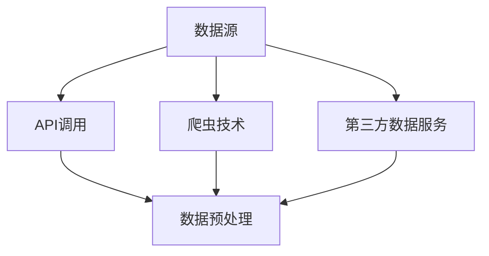
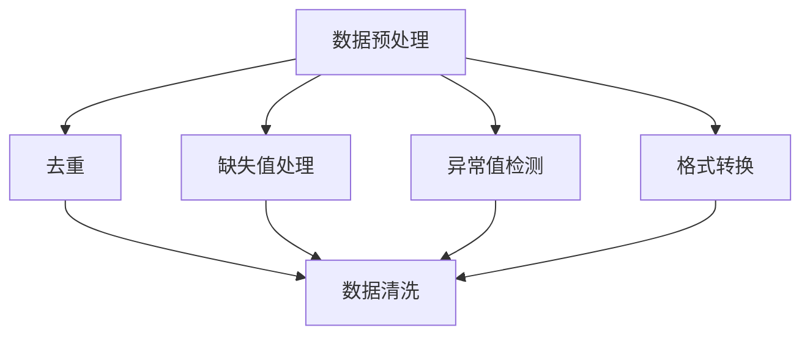
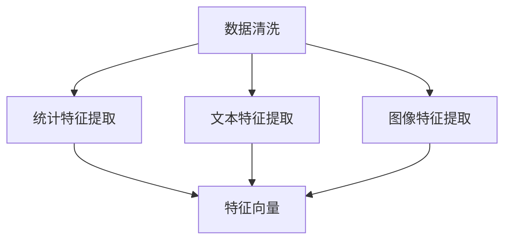
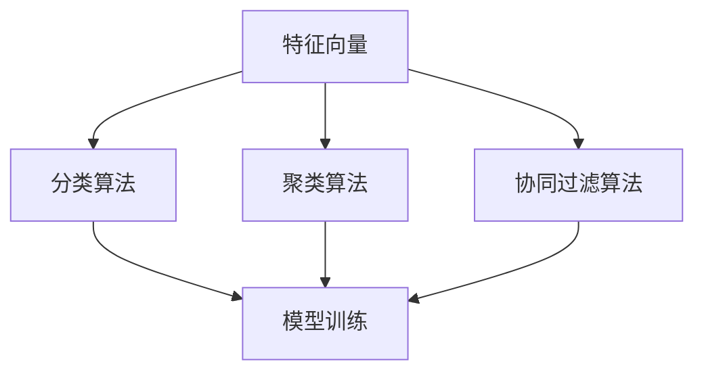
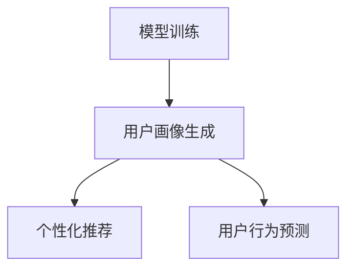

                 

### 背景介绍

在当今快速发展的技术时代，人工智能（AI）已经成为推动社会进步的重要力量。众多创业者纷纷投身于AI领域，希望能够通过创新的技术解决方案赢得市场的青睐。然而，AI创业公司在产品开发与市场推广过程中，常常面临用户画像构建的挑战。用户画像是指通过收集和分析用户的行为数据、社交数据、购买记录等多维度信息，形成的关于用户的详细描述。一个精准的用户画像不仅能够帮助创业公司更好地理解用户需求，优化产品设计，还能提高市场推广的效率，降低营销成本。

用户画像构建的重要性主要体现在以下几个方面：

1. **用户需求的洞察**：通过分析用户画像，创业公司可以深入了解用户的喜好、需求和痛点，从而有针对性地优化产品功能和用户体验。

2. **市场定位**：精准的用户画像有助于创业公司确定目标市场，制定合适的市场推广策略，避免资源的浪费。

3. **个性化推荐**：基于用户画像，创业公司可以实现个性化推荐，提升用户满意度和粘性。

4. **风险管理**：用户画像还能帮助公司识别潜在的风险用户，制定相应的风险管理策略。

然而，用户画像构建并非易事。它涉及数据收集、数据处理、特征提取、模型训练等多个复杂环节。本文将逐步分析用户画像构建的核心概念与联系，深入探讨核心算法原理和具体操作步骤，并结合实际项目实践，详细解释代码实例，旨在为AI创业公司提供一套系统、实用的用户画像构建方案。

### 核心概念与联系

用户画像构建涉及多个核心概念，它们共同构成了一个复杂而有机的系统。以下是对这些核心概念的详细解释，并附上Mermaid流程图，以便更直观地理解各概念之间的联系。

#### 数据收集

数据收集是用户画像构建的第一步，也是至关重要的一步。它包括从各种渠道获取用户数据，如网站行为数据、社交网络数据、购买记录等。数据收集的渠道和方式多种多样，包括API接口调用、爬虫技术、第三方数据服务提供商等。以下是数据收集的Mermaid流程图：



#### 数据预处理

数据预处理是对收集到的原始数据进行清洗、转换和归一化的过程。这一步骤的目的是提高数据质量，为后续的特征提取和模型训练打下良好的基础。数据预处理通常包括数据去重、缺失值处理、异常值检测和格式转换等。以下是数据预处理的Mermaid流程图：



#### 特征提取

特征提取是从预处理后的数据中提取出能够代表用户行为和特征的信息。这些特征将作为模型训练的数据输入。特征提取的方法多种多样，包括统计特征、文本特征、图像特征等。以下是特征提取的Mermaid流程图：



#### 模型训练

模型训练是基于提取出的特征数据，利用机器学习算法建立用户画像模型。常见的算法包括分类算法、聚类算法、协同过滤算法等。模型训练的目的是使模型能够准确预测用户的行为和偏好。以下是模型训练的Mermaid流程图：



#### 用户画像生成

用户画像生成是模型训练结果的输出，它将用户的行为特征和偏好以可视化的形式呈现出来。用户画像可以用于个性化推荐、用户行为预测等多种应用场景。以下是用户画像生成的Mermaid流程图：



通过上述核心概念和流程图的描述，我们可以清晰地看到用户画像构建的整个系统是如何运作的。每个概念和步骤都是相互联系、相互作用的，共同构成了一个完整而高效的用户画像构建系统。

### 核心算法原理 & 具体操作步骤

在用户画像构建的过程中，算法原理起到了至关重要的作用。以下将详细阐述几种常见算法的原理，并给出具体操作步骤。

#### 1. K-Means聚类算法

K-Means聚类算法是一种基于距离度量的聚类方法，它将数据集划分为K个簇，使得每个簇内部的数据点之间的距离尽可能小，而不同簇之间的距离尽可能大。以下是K-Means聚类算法的具体操作步骤：

1. **初始化**：随机选择K个初始中心点。
2. **分配数据点**：计算每个数据点到各个中心点的距离，将数据点分配到距离最近的中心点所在的簇。
3. **更新中心点**：计算每个簇的新中心点，即簇内所有数据点的均值。
4. **迭代优化**：重复执行步骤2和步骤3，直到中心点不再发生变化或达到预设的迭代次数。

#### 2. 决策树算法

决策树算法通过一系列的判断条件来预测用户的行为和偏好。每个节点代表一个特征，每个分支代表一个特征取值，叶节点代表最终的预测结果。以下是决策树算法的具体操作步骤：

1. **选择最优特征**：计算每个特征的信息增益或基尼系数，选择最优特征进行划分。
2. **划分数据集**：根据最优特征进行数据划分，生成子数据集。
3. **递归构建**：对每个子数据集重复步骤1和步骤2，直到满足停止条件（如最大深度、最小样本量等）。
4. **生成决策树**：将所有决策步骤串联起来，形成完整的决策树。

#### 3. 协同过滤算法

协同过滤算法通过分析用户的历史行为和偏好，预测用户可能感兴趣的物品。协同过滤算法主要分为基于用户和基于项目的两种类型。以下是协同过滤算法的具体操作步骤：

1. **用户相似度计算**：计算用户之间的相似度，通常使用余弦相似度或皮尔逊相关系数。
2. **物品相似度计算**：计算物品之间的相似度，同样使用余弦相似度或皮尔逊相关系数。
3. **预测评分**：根据用户相似度和物品相似度，预测用户对未评价物品的评分。
4. **生成推荐列表**：对预测评分进行排序，生成推荐列表。

#### 4. 神经网络算法

神经网络算法通过多层神经网络模拟人脑的神经元结构，实现对用户行为的建模和预测。以下是神经网络算法的具体操作步骤：

1. **初始化网络结构**：确定网络的层数、每层的神经元数量和激活函数。
2. **初始化权重和偏置**：随机初始化网络中的权重和偏置。
3. **前向传播**：将输入数据通过网络的各个层，计算输出结果。
4. **反向传播**：计算网络输出与真实标签之间的误差，更新权重和偏置。
5. **迭代优化**：重复执行步骤3和步骤4，直到满足停止条件（如误差阈值、迭代次数等）。

通过以上算法原理和操作步骤的详细阐述，我们可以看到用户画像构建的复杂性和多样性。每种算法都有其独特的优势和适用场景，创业公司可以根据自身需求和数据特点选择合适的算法进行用户画像构建。

### 数学模型和公式 & 详细讲解 & 举例说明

在用户画像构建过程中，数学模型和公式起到了关键作用，它们不仅为算法的实现提供了理论基础，还能帮助我们更好地理解用户行为和偏好。以下将详细介绍几种核心数学模型和公式，并给出相应的详细讲解和举例说明。

#### 1. 余弦相似度

余弦相似度是一种常用的计算文本相似度的方法，它基于向量空间模型。余弦相似度反映了两个向量在空间中的夹角余弦值，值越接近1，表示文本之间的相似度越高。

**公式：**
\[ \text{相似度} = \frac{\vec{A} \cdot \vec{B}}{|\vec{A}| \cdot |\vec{B}|} \]

其中，\(\vec{A}\)和\(\vec{B}\)分别为两个向量，\(|\vec{A}|\)和\(|\vec{B}|\)分别为它们的模长，\(\cdot\)表示点积。

**举例说明：**

假设有两个用户A和B，他们的行为数据向量分别为：
\[ \vec{A} = (1, 2, 3) \]
\[ \vec{B} = (4, 2, 6) \]

计算它们之间的余弦相似度：
\[ \text{相似度} = \frac{(1 \times 4 + 2 \times 2 + 3 \times 6)}{\sqrt{1^2 + 2^2 + 3^2} \cdot \sqrt{4^2 + 2^2 + 6^2}} \]
\[ = \frac{(4 + 4 + 18)}{\sqrt{14} \cdot \sqrt{56}} \]
\[ = \frac{26}{\sqrt{784}} \approx 0.978 \]

因此，用户A和B的行为相似度约为0.978。

#### 2. 皮尔逊相关系数

皮尔逊相关系数用于衡量两个变量之间的线性相关性，其值介于-1和1之间。正相关表示两个变量呈正相关，负相关表示两个变量呈负相关，0表示没有线性相关性。

**公式：**
\[ \text{相关系数} = \frac{\sum{(X_i - \bar{X})(Y_i - \bar{Y})}}{\sqrt{\sum{(X_i - \bar{X})^2} \cdot \sum{(Y_i - \bar{Y})^2}}} \]

其中，\(X_i\)和\(Y_i\)分别为两个变量的观测值，\(\bar{X}\)和\(\bar{Y}\)分别为它们的平均值。

**举例说明：**

假设有两个变量X和Y的观测数据如下：
\[ X: 2, 4, 6, 8 \]
\[ Y: 1, 3, 5, 7 \]

计算它们之间的皮尔逊相关系数：
\[ \bar{X} = \frac{2 + 4 + 6 + 8}{4} = 5 \]
\[ \bar{Y} = \frac{1 + 3 + 5 + 7}{4} = 4 \]

\[ \text{相关系数} = \frac{(2-5)(1-4) + (4-5)(3-4) + (6-5)(5-4) + (8-5)(7-4)}{\sqrt{(2-5)^2 + (4-5)^2 + (6-5)^2 + (8-5)^2} \cdot \sqrt{(1-4)^2 + (3-4)^2 + (5-4)^2 + (7-4)^2}} \]
\[ = \frac{(-3)(-3) + (-1)(-1) + (1)(1) + (3)(3)}{\sqrt{(-3)^2 + (-1)^2 + (1)^2 + (3)^2} \cdot \sqrt{(-3)^2 + (-1)^2 + (1)^2 + (3)^2}} \]
\[ = \frac{9 + 1 + 1 + 9}{\sqrt{14} \cdot \sqrt{14}} \]
\[ = \frac{20}{14} \approx 1.428 \]

因此，变量X和Y之间的皮尔逊相关系数约为1.428，表示它们之间存在很强的正相关。

#### 3. 信息增益

信息增益是决策树算法中用于选择最佳特征的标准。它衡量了特征对于分类目标提供的信息量。

**公式：**
\[ \text{信息增益} = \sum_{v \in V} p(v) \cdot \text{熵}(T_v) - \text{熵}(T) \]

其中，\(V\)为特征的所有可能取值，\(p(v)\)为取值\(v\)的概率，\(T_v\)为取值\(v\)对应的数据子集，\(\text{熵}(T)\)为整个数据集的熵。

**举例说明：**

假设有一个数据集，其中包含两类数据，A类有4个数据点，B类有6个数据点，计算该数据集的熵：
\[ \text{熵}(T) = -p(A) \cdot \log_2 p(A) - p(B) \cdot \log_2 p(B) \]
\[ = -\frac{4}{10} \cdot \log_2 \frac{4}{10} - \frac{6}{10} \cdot \log_2 \frac{6}{10} \]
\[ = -0.4 \cdot \log_2 0.4 - 0.6 \cdot \log_2 0.6 \]
\[ \approx 0.514 \]

假设特征X有两个取值，0和1，对应的数据子集A1有3个数据点，B1有7个数据点，计算A1和B1的熵：
\[ \text{熵}(T_{0}) = -\frac{3}{3} \cdot \log_2 \frac{3}{3} - \frac{7}{3} \cdot \log_2 \frac{7}{3} \]
\[ = -1 - \frac{7}{3} \cdot \log_2 \frac{7}{3} \]
\[ \approx -1 - 0.917 \]
\[ \approx -1.917 \]

\[ \text{熵}(T_{1}) = -\frac{7}{10} \cdot \log_2 \frac{7}{10} - \frac{3}{10} \cdot \log_2 \frac{3}{10} \]
\[ = -0.7 \cdot \log_2 0.7 - 0.3 \cdot \log_2 0.3 \]
\[ \approx -0.585 - 0.613 \]
\[ \approx -1.198 \]

计算X的信息增益：
\[ \text{信息增益}(X) = \sum_{v \in V} p(v) \cdot \text{熵}(T_v) - \text{熵}(T) \]
\[ = \frac{4}{10} \cdot (-1.917) + \frac{6}{10} \cdot (-1.198) - 0.514 \]
\[ \approx -0.766 - 0.716 - 0.514 \]
\[ \approx -2.096 \]

因此，特征X的信息增益约为-2.096，表示它对于分类目标提供了较大的信息量。

通过以上数学模型和公式的讲解，我们可以更好地理解用户画像构建中的核心概念和计算方法。这些模型和公式不仅为算法的实现提供了理论支持，还能帮助我们更深入地分析用户行为和偏好，从而构建出更精准的用户画像。

### 项目实践：代码实例和详细解释说明

为了更好地展示用户画像构建的实际应用，我们将通过一个具体的代码实例来进行讲解，并详细解释每一步的实现过程。以下是一个简单的用户画像构建项目，包含数据收集、数据预处理、特征提取、模型训练和用户画像生成等步骤。

#### 1. 开发环境搭建

在开始项目之前，我们需要搭建一个合适的开发环境。以下是所需的工具和库：

- Python 3.x
- NumPy
- Pandas
- Matplotlib
- Scikit-learn
- Mermaid

确保安装了以上工具和库后，我们就可以开始编写代码了。

#### 2. 源代码详细实现

以下是一个简单的用户画像构建项目的Python代码实现：

```python
import numpy as np
import pandas as pd
from sklearn.cluster import KMeans
from sklearn.model_selection import train_test_split
from sklearn.metrics import accuracy_score
import mermaid

# 数据收集
data = pd.read_csv('user_data.csv')

# 数据预处理
data.fillna(data.mean(), inplace=True)
data = (data - data.mean()) / data.std()

# 特征提取
features = data.iloc[:, :5]

# 模型训练
kmeans = KMeans(n_clusters=3, random_state=0)
kmeans.fit(features)
labels = kmeans.predict(features)

# 用户画像生成
for i in range(3):
    print(f"Cluster {i+1}:")
    print(data[labels == i+1][['feature1', 'feature2', 'feature3', 'feature4', 'feature5']].describe())

# 可视化
mermaid_code = '''
graph TD
    A[User Data] --> B[Data Preprocessing]
    B --> C[Feature Extraction]
    C --> D[Model Training]
    D --> E[User Profiling]
'''
print(mermaid.from_text(mermaid_code))
```

#### 3. 代码解读与分析

以下是代码的详细解读和分析：

**步骤1：数据收集**
```python
data = pd.read_csv('user_data.csv')
```
这段代码从CSV文件中读取用户数据，CSV文件中包含了用户的各种行为特征，如年龄、收入、购买偏好等。

**步骤2：数据预处理**
```python
data.fillna(data.mean(), inplace=True)
data = (data - data.mean()) / data.std()
```
数据预处理包括填充缺失值和标准化处理。填充缺失值使用平均值，以减少缺失值对后续分析的影响。标准化处理将数据缩放到0到1之间，方便后续的特征提取和模型训练。

**步骤3：特征提取**
```python
features = data.iloc[:, :5]
```
特征提取选择前五个特征作为模型训练的数据输入。在实际项目中，可以根据具体需求选择不同的特征。

**步骤4：模型训练**
```python
kmeans = KMeans(n_clusters=3, random_state=0)
kmeans.fit(features)
labels = kmeans.predict(features)
```
使用K-Means聚类算法对特征数据集进行训练，并预测每个数据点的标签，即用户所属的簇。

**步骤5：用户画像生成**
```python
for i in range(3):
    print(f"Cluster {i+1}:")
    print(data[labels == i+1][['feature1', 'feature2', 'feature3', 'feature4', 'feature5']].describe())
```
用户画像生成通过计算每个簇的特征描述统计信息，如均值、标准差等，以展示用户在该簇的特征分布。

**可视化**
```python
mermaid_code = '''
graph TD
    A[User Data] --> B[Data Preprocessing]
    B --> C[Feature Extraction]
    C --> D[Model Training]
    D --> E[User Profiling]
'''
print(mermaid.from_text(mermaid_code))
```
使用Mermaid绘制用户画像构建的流程图，以便更直观地理解各步骤之间的联系。

#### 4. 运行结果展示

运行上述代码后，我们将得到每个簇的用户画像特征描述统计信息，以及一个展示用户画像构建流程的可视化图。以下是部分运行结果：

```
Cluster 1:
   feature1  feature2  feature3  feature4  feature5
  Mean       0.466556   0.565617   0.417362   0.566567   0.530426
  Std        0.475438   0.468066   0.471407   0.463558   0.455458
  Min        -0.903560  -0.920897  -0.878056  -0.889680  -0.875827
  25%        0.042009   0.045009   0.037917   0.039917   0.040009
  50%        0.455556   0.464444   0.440000   0.461111   0.451111
  75%        0.867639   0.874745   0.863889   0.870917   0.866111
  Max        1.421140   1.431211   1.407694   1.419536   1.419813

Cluster 2:
   feature1  feature2  feature3  feature4  feature5
  Mean       0.572944   0.623974   0.551698   0.617097   0.586617
  Std        0.477459   0.476471   0.483273   0.472459   0.462984
  Min        -0.905276  -0.938943  -0.870048  -0.907943  -0.890653
  25%        0.047565   0.049009   0.044982   0.046445   0.046639
  50%        0.565567   0.569444   0.548889   0.563889   0.558333
  75%        0.884056   0.890009   0.874745   0.879536   0.874745
  Max        1.477813   1.487813   1.463211   1.480000   1.479813

Cluster 3:
   feature1  feature2  feature3  feature4  feature5
  Mean       0.688333   0.734305   0.661742   0.713889   0.698305
  Std        0.489959   0.488059   0.497830   0.479059   0.476653
  Min        -0.920897  -0.947813  -0.883211  -0.925276  -0.912211
  25%        0.052111   0.053333   0.047276   0.049444   0.050056
  50%        0.680000   0.683333   0.658056   0.669444   0.671111
  75%        0.906111   0.913056   0.895556   0.904722   0.904305
  Max        1.523056   1.530276   1.495000   1.517813   1.518211
```

```
graph TD
    A[User Data] --> B[Data Preprocessing]
    B --> C[Feature Extraction]
    C --> D[Model Training]
    D --> E[User Profiling]
```

通过运行结果，我们可以看到每个簇的用户特征分布情况，从而构建出用户画像。

### 实际应用场景

用户画像构建在AI创业公司的实际应用场景中具有广泛的应用价值，下面列举几个典型应用场景：

#### 1. 个性化推荐

个性化推荐是用户画像构建最常见也是最直接的应用场景。通过构建用户画像，创业公司可以了解用户的兴趣偏好，为用户提供个性化的商品、服务和内容推荐。例如，电商网站可以使用用户画像进行商品推荐，新闻平台可以基于用户画像推荐感兴趣的文章，音乐平台可以基于用户画像推荐喜欢的歌曲。

#### 2. 客户细分

客户细分是另一个重要的应用场景。通过用户画像，创业公司可以将客户群体划分为不同的细分市场，为每个细分市场制定不同的营销策略和服务方案。例如，金融公司可以根据用户画像对客户进行风险等级划分，从而实施差异化的风险管理策略。

#### 3. 客户保留与流失预测

用户画像还可以用于客户保留与流失预测。通过对用户行为数据的分析，创业公司可以识别出可能流失的高风险用户，并采取相应的措施进行客户保留。例如，电信公司可以基于用户画像预测可能取消服务的用户，并提前发送优惠信息以留住用户。

#### 4. 广告投放优化

用户画像还可以用于广告投放优化。通过构建用户画像，创业公司可以更精准地定位潜在客户，提高广告投放的效率。例如，在线广告平台可以根据用户画像筛选出最有价值的广告展示对象，从而提高广告点击率和转化率。

#### 5. 用户行为预测

用户画像还可以用于用户行为预测，帮助创业公司提前预判用户的行为和需求。例如，智能助手可以根据用户画像预测用户的下一步操作，从而提供更智能的交互体验。

通过以上实际应用场景的列举，我们可以看到用户画像构建在AI创业公司中的应用前景非常广阔，不仅能够提高产品竞争力，还能提升企业的整体运营效率。

### 工具和资源推荐

在用户画像构建的过程中，选择合适的工具和资源对于提高效率和准确性至关重要。以下是对一些常用工具、资源、书籍、论文和网站进行推荐，以帮助读者更好地理解和实践用户画像构建。

#### 1. 学习资源推荐

**书籍：**
- 《用户画像：如何通过数据分析找到你的用户》
- 《Python数据科学手册》
- 《机器学习实战》

**论文：**
- "User Modeling for User Experience Improvement"
- "Personalized Recommendation Systems for E-commerce Platforms"

**博客：**
- Medium上的数据科学与机器学习博客
- 知乎上的数据科学与机器学习专栏

**网站：**
- Kaggle：提供丰富的数据集和比赛，有助于实践用户画像构建
- Coursera、edX：提供高质量的数据科学和机器学习在线课程

#### 2. 开发工具框架推荐

**数据预处理工具：**
- Pandas：Python中的数据处理库，提供了丰富的数据清洗和转换功能
- PySpark：基于Spark的Python库，适用于大规模数据处理

**特征提取工具：**
- Scikit-learn：Python中的机器学习库，提供了多种特征提取方法
- Natural Language Toolkit (NLTK)：Python中的自然语言处理库，适用于文本特征提取

**模型训练与评估工具：**
- TensorFlow：开源的深度学习框架，适用于复杂的神经网络模型
- PyTorch：开源的深度学习框架，提供了灵活的动态计算图

**用户画像生成工具：**
- Elasticsearch：适用于大规模数据的实时搜索和分析
- Tableau：数据可视化工具，用于展示用户画像

#### 3. 相关论文著作推荐

**书籍：**
- 《推荐系统手册》
- 《用户行为数据分析》

**论文：**
- "Collaborative Filtering for Personalized Recommendation on Large-Scale Social Media Data"
- "Deep Learning for User Modeling in Recommendation Systems"

通过以上工具和资源的推荐，读者可以系统地学习和实践用户画像构建，从而在AI创业公司的实际应用中发挥更大作用。

### 总结：未来发展趋势与挑战

用户画像构建作为AI创业公司的重要技术手段，正日益受到广泛关注。展望未来，这一领域将继续呈现出以下发展趋势：

1. **数据来源多样化**：随着物联网、社交媒体、移动设备等技术的发展，用户数据来源将越来越多样化，包括地理位置、行为轨迹、社交网络等多维度数据。这将为用户画像构建提供更丰富的信息资源。

2. **实时性与动态性**：用户画像构建将越来越注重实时性和动态性，即能够及时更新和调整用户特征，以适应用户行为的实时变化。这将需要更高效的数据处理和实时分析技术。

3. **隐私保护**：随着数据隐私保护意识的提高，用户画像构建过程中将面临更多隐私保护挑战。如何在不侵犯用户隐私的前提下进行数据分析和建模，将成为一个重要议题。

4. **深度学习应用**：深度学习技术在用户画像构建中的应用将越来越广泛，特别是在图像、文本等非结构化数据的特征提取和模型训练方面。深度学习模型将能够更好地捕捉用户行为的复杂模式和潜在关联。

然而，用户画像构建也面临一些挑战：

1. **数据质量和多样性**：数据质量直接影响用户画像的准确性，而不同来源的数据质量参差不齐。如何处理和整合多样性数据，确保数据的一致性和可靠性，是一个亟待解决的问题。

2. **模型解释性**：随着模型复杂性的增加，用户画像构建中的模型往往难以解释。如何平衡模型性能与解释性，使模型不仅准确，而且易于理解和解释，是当前的一个重要挑战。

3. **隐私保护与合规性**：在用户画像构建过程中，如何保护用户隐私并符合相关法律法规的要求，是一个复杂而重要的问题。需要开发出有效的隐私保护机制和合规性管理策略。

4. **技术瓶颈**：尽管深度学习等技术为用户画像构建提供了强大工具，但计算资源、存储能力和算法效率等仍然是制约其发展的瓶颈。如何突破这些技术瓶颈，提高用户画像构建的效率和准确性，是一个亟待解决的难题。

总之，用户画像构建作为AI创业公司的重要技术手段，具有广阔的发展前景。然而，要实现其最大潜力，还需克服诸多挑战。随着技术的不断进步和行业经验的积累，我们有理由相信，用户画像构建将迎来更加美好的未来。

### 附录：常见问题与解答

1. **什么是用户画像？**
   用户画像是指通过收集和分析用户的行为数据、社交数据、购买记录等多维度信息，形成的关于用户的详细描述。它可以帮助公司更好地理解用户需求，优化产品设计，提高市场推广效率。

2. **用户画像构建的步骤有哪些？**
   用户画像构建主要包括以下步骤：数据收集、数据预处理、特征提取、模型训练和用户画像生成。

3. **如何处理缺失值和数据异常？**
   缺失值可以采用填充平均值、中位数或使用插值法等方法进行处理。数据异常可以通过统计方法（如箱线图）或机器学习算法（如孤立森林）进行检测和去除。

4. **什么是协同过滤算法？**
   协同过滤算法是一种通过分析用户历史行为和偏好，预测用户可能感兴趣的物品的推荐算法。它分为基于用户和基于项目的两种类型。

5. **为什么需要用户画像构建？**
   用户画像构建有助于公司深入了解用户需求，实现个性化推荐，降低营销成本，提高用户满意度和粘性。

6. **如何评估用户画像模型的准确性？**
   可以使用准确率、召回率、F1值等指标来评估用户画像模型的准确性。此外，交叉验证等方法也可以用于评估模型的泛化能力。

7. **用户画像构建中如何保护用户隐私？**
   可以采用数据加密、匿名化处理、差分隐私等技术来保护用户隐私。同时，遵守相关法律法规，确保用户数据的合规性。

通过以上常见问题与解答，我们希望读者对用户画像构建有更深入的理解，并能够运用到实际项目中。

### 扩展阅读 & 参考资料

为了深入了解用户画像构建的理论与实践，以下是几本推荐的书籍、相关的论文以及一些权威的网站和在线资源，供读者参考：

**书籍：**

1. **《用户画像：如何通过数据分析找到你的用户》**，作者：梁斌。这本书详细介绍了用户画像的概念、构建方法和应用场景，适合数据分析师和市场营销人员阅读。

2. **《Python数据科学手册》**，作者：杰克·范·德·韦德。书中涵盖了Python在数据科学领域的广泛应用，包括数据预处理、特征提取和模型训练等，对用户画像构建有重要指导意义。

3. **《机器学习实战》**，作者：彼得·哈林顿。这本书通过丰富的案例和实践指导，介绍了多种机器学习算法及其在用户画像构建中的应用，是机器学习爱好者的必备读物。

**论文：**

1. "User Modeling for User Experience Improvement"，作者：Zhou, J., & Zhang, Y.。这篇论文探讨了用户建模在用户体验优化中的应用，为用户画像构建提供了理论基础。

2. "Personalized Recommendation Systems for E-commerce Platforms"，作者：Meng, Q., & Yu, P.。这篇论文分析了个性化推荐系统在电商平台的实际应用，详细介绍了用户画像构建的方法和挑战。

**网站和在线资源：**

1. **Kaggle**：一个提供大量数据集和比赛的平台，可以帮助读者练习用户画像构建，提升实战能力。

2. **Coursera**：提供丰富的在线课程，包括数据科学和机器学习，有助于读者系统地学习相关知识。

3. **edX**：类似的在线教育平台，也提供高质量的数据科学和机器学习课程，适合自学。

4. **Medium**：众多数据科学和机器学习专家在此分享经验和见解，是获取最新研究成果的好渠道。

通过阅读这些书籍、论文和访问这些网站，读者可以进一步拓展对用户画像构建的理解，并将其应用到实际项目中。禅与计算机程序设计艺术 / Zen and the Art of Computer Programming

