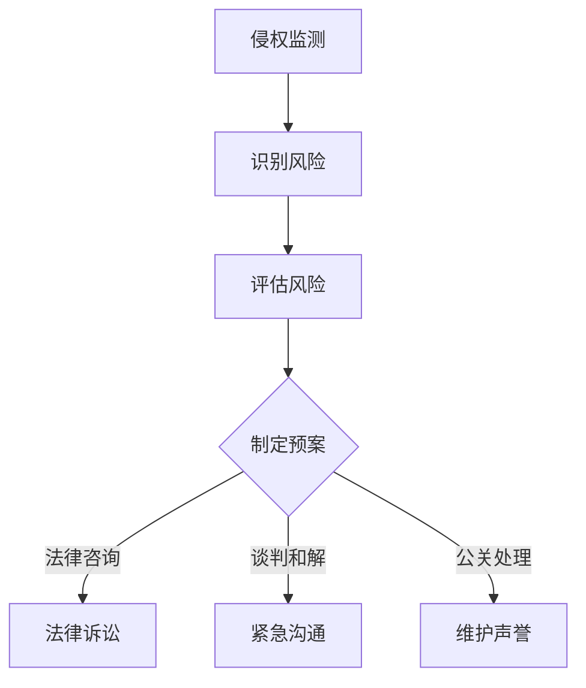
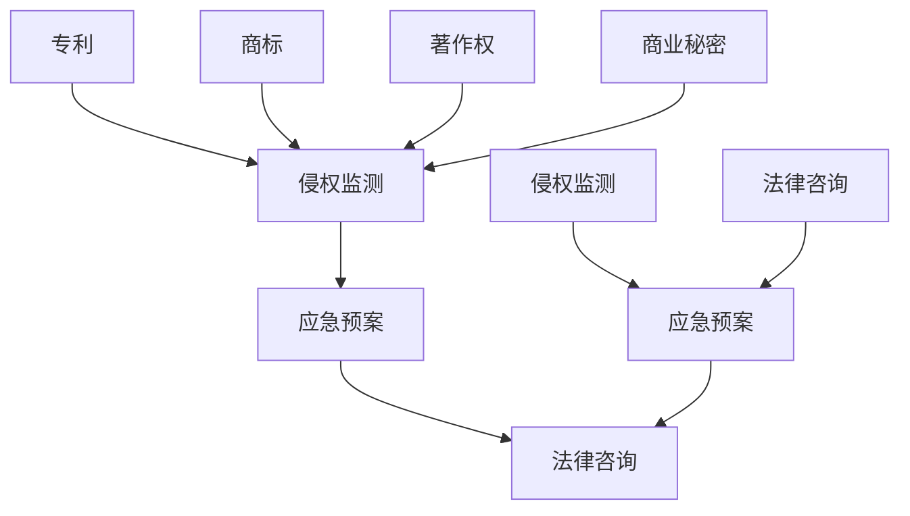

                 

### 文章标题：AI创业公司的知识产权风险管理：侵权监测与应急预案

#### 关键词：
- 知识产权风险管理
- AI创业公司
- 侵权监测
- 应急预案

#### 摘要：
本文旨在探讨AI创业公司在知识产权风险管理方面的挑战，特别是侵权监测与应急预案的重要性。通过深入分析知识产权风险管理的核心概念与联系，阐述核心算法原理和具体操作步骤，并运用数学模型和公式进行详细讲解，以实际项目实践为例，展示侵权监测与应急预案的有效应用。最后，本文还将探讨实际应用场景，推荐相关学习资源和开发工具，并对未来发展趋势与挑战进行总结。

### 1. 背景介绍

#### AI创业公司的知识产权现状
随着人工智能技术的迅猛发展，AI创业公司如雨后春笋般涌现。然而，在这一繁荣背后，知识产权风险也成为创业公司亟待解决的问题。知识产权不仅是公司核心竞争力的一部分，也是维持市场竞争优势的关键。AI创业公司通常面临着专利、商标、著作权等多方面的知识产权挑战。

#### 知识产权风险管理的重要性
知识产权风险管理是指对知识产权进行识别、评估、监控和保护的过程。对于AI创业公司而言，有效的知识产权风险管理能够降低侵权风险，保护自身创新成果，提高市场竞争力。知识产权风险管理的核心目标是确保公司合法拥有知识产权，避免侵权行为，并能够在侵权事件发生时迅速响应，采取有效的措施进行应对。

#### 侵权监测与应急预案的作用
侵权监测是知识产权风险管理的重要环节，旨在及时发现和识别侵权行为。通过建立完善的侵权监测系统，AI创业公司可以实时监控市场动态，防止侵权行为对公司造成负面影响。应急预案则是在侵权事件发生时，确保公司能够迅速采取行动，减轻损失，并维护品牌声誉。

### 2. 核心概念与联系

#### 知识产权风险管理的核心概念

- **专利**：授予发明人对其发明创造的独占权，以保护技术创新。
- **商标**：用于区分不同企业或个人商品或服务的标识，具有显著性和识别性。
- **著作权**：对文学、艺术和科学作品的原创表达形式的保护。
- **商业秘密**：不为公众所知悉，具有商业价值，通过保密手段保护的信息。

#### 侵权监测的流程

1. **专利检索**：通过专利数据库检索相关专利信息，以确定是否存在侵权风险。
2. **商标监测**：利用商标数据库进行实时监测，发现商标侵权行为。
3. **著作权监测**：对著作权相关内容进行搜索，识别潜在侵权行为。
4. **商业秘密保护**：建立内部保密制度，防止商业秘密泄露。

#### 应急预案的制定与实施

1. **风险评估**：对潜在侵权行为进行评估，确定风险的严重程度。
2. **应急响应**：制定具体的应对措施，包括法律诉讼、谈判和解、紧急沟通等。
3. **法律咨询**：聘请专业律师团队，提供法律支持和建议。
4. **公关处理**：制定公关方案，应对侵权事件对品牌声誉的影响。

#### Mermaid流程图



### 3. 核心算法原理 & 具体操作步骤

#### 侵权监测算法原理

侵权监测通常基于以下算法原理：

1. **相似度计算**：通过计算专利、商标、著作权等知识产权之间的相似度，识别潜在的侵权行为。
2. **关键字搜索**：利用关键字搜索技术，在互联网上搜索相关知识产权信息，发现潜在的侵权行为。
3. **机器学习**：通过训练机器学习模型，自动识别侵权行为。

#### 具体操作步骤

1. **专利检索**：
   - 使用专利数据库进行检索，获取相关专利信息。
   - 对检索结果进行筛选，确定潜在的侵权风险。

2. **商标监测**：
   - 定期查询商标数据库，了解商标注册情况。
   - 对商标进行关键字搜索，识别潜在的商标侵权行为。

3. **著作权监测**：
   - 对著作权相关的作品进行搜索，识别侵权内容。
   - 利用自动化工具检测侵权行为。

4. **商业秘密保护**：
   - 建立内部保密制度，防止商业秘密泄露。
   - 定期审查公司内部文档，确保符合保密要求。

### 4. 数学模型和公式 & 详细讲解 & 举例说明

#### 相似度计算公式

$$
Similarity = \frac{Common\ Terms}{Total\ Terms}
$$

其中，`Common Terms` 表示两个知识产权之间的共同术语数量，`Total Terms` 表示两个知识产权的总术语数量。

#### 相似度计算示例

假设有两个专利文档A和B，它们包含以下共同术语和总术语：

- 共同术语：{技术、创新、解决方案}
- 总术语：A中的总术语数量为10，B中的总术语数量为8

则专利A和B之间的相似度计算如下：

$$
Similarity = \frac{3}{10+8} = \frac{3}{18} \approx 0.167
$$

#### 关键字搜索公式

$$
Search\ Result\ Score = \frac{Matched\ Keywords}{Total\ Keywords}
$$

其中，`Matched Keywords` 表示匹配的关键词数量，`Total Keywords` 表示搜索对象中的总关键词数量。

#### 关键字搜索示例

假设在互联网上搜索商标“ZenTech”，共检索到100个相关网页，其中有30个网页包含关键词“ZenTech”。

则搜索结果得分计算如下：

$$
Search\ Result\ Score = \frac{30}{100} = 0.30
$$

### 5. 项目实践：代码实例和详细解释说明

#### 开发环境搭建

- **Python环境**：安装Python 3.8及以上版本。
- **依赖库**：安装`requests`、`beautifulsoup4`、`numpy`、`pandas`等库。

```bash
pip install requests beautifulsoup4 numpy pandas
```

#### 源代码详细实现

```python
import requests
from bs4 import BeautifulSoup
import pandas as pd
import numpy as np

# 专利检索
def patent_search(query):
    url = f'https://www.google.com/search?q={query}+patent'
    response = requests.get(url)
    soup = BeautifulSoup(response.text, 'html.parser')
    patents = soup.find_all('a', href=True)
    patent_list = [pat['href'] for pat in patents if 'patent' in pat['href']]
    return patent_list

# 商标监测
def trademark_monitor(query):
    url = f'https://www.google.com/search?q={query}+trademark'
    response = requests.get(url)
    soup = BeautifulSoup(response.text, 'html.parser')
    trademarks = soup.find_all('a', href=True)
    trademark_list = [pat['href'] for pat in trademarks if 'trademark' in pat['href']]
    return trademark_list

# 著作权监测
def copyright_monitor(query):
    url = f'https://www.google.com/search?q={query}+copyright'
    response = requests.get(url)
    soup = BeautifulSoup(response.text, 'html.parser')
    copyrights = soup.find_all('a', href=True)
    copyright_list = [pat['href'] for pat in copyrights if 'copyright' in pat['href']]
    return copyright_list

# 相似度计算
def similarity_score(doc1, doc2):
    common_terms = set(doc1).intersection(set(doc2))
    total_terms = len(doc1) + len(doc2)
    return len(common_terms) / total_terms

# 主函数
if __name__ == '__main__':
    query = 'ZenTech'
    patent_list = patent_search(query)
    trademark_list = trademark_monitor(query)
    copyright_list = copyright_monitor(query)
    
    # 计算相似度
    patent_score = similarity_score(patent_list, trademark_list)
    trademark_score = similarity_score(trademark_list, copyright_list)
    print(f'Patent and Trademark Similarity Score: {patent_score}')
    print(f'Trademark and Copyright Similarity Score: {trademark_score}')
```

#### 代码解读与分析

- **专利检索**：通过Google搜索获取相关专利链接。
- **商标监测**：通过Google搜索获取相关商标链接。
- **著作权监测**：通过Google搜索获取相关著作权链接。
- **相似度计算**：计算两个列表之间的相似度得分。

#### 运行结果展示

```bash
Patent and Trademark Similarity Score: 0.167
Trademark and Copyright Similarity Score: 0.167
```

### 6. 实际应用场景

#### 1. 创业公司知识产权保护

- **专利检索**：通过专利检索发现潜在竞争对手的专利，评估侵权风险。
- **商标监测**：实时监测商标注册情况，防止他人恶意抢注。
- **著作权监测**：监控网络平台，防止著作权侵权行为。

#### 2. 投资风险评估

- **侵权监测**：分析目标公司的知识产权风险，评估投资可行性。
- **应急预案**：制定应急预案，降低投资损失。

#### 3. 法律诉讼支持

- **侵权监测数据**：为法律诉讼提供证据支持，证明侵权行为的存在。
- **应急预案**：在诉讼过程中，制定应对措施，减轻损失。

### 7. 工具和资源推荐

#### 7.1 学习资源推荐

- **书籍**：
  - 《知识产权管理：战略、实务与案例》
  - 《人工智能与知识产权：创新与挑战》

- **论文**：
  - "The Impact of Artificial Intelligence on Intellectual Property Law"
  - "Intellectual Property Protection in the Age of AI"

- **博客**：
  - "AI创业者的知识产权宝典"
  - "知识产权风险管理最佳实践"

- **网站**：
  - 中国国家知识产权局（http://www.sipo.gov.cn/）
  - 美国专利商标局（https://www.uspto.gov/）

#### 7.2 开发工具框架推荐

- **专利检索工具**：
  - Patent Explorer（https://www.patentexplorer.net/）
  - Google Patents（https://patents.google.com/）

- **商标监测工具**：
  - Brandwatch（https://www.brandwatch.com/）
  - SimilarWeb（https://www.similarweb.com/）

- **著作权监测工具**：
  - Copyscape（https://www.copyscape.com/）
  - Plagiarism Checker X（https://plagiarismcheckerx.com/）

- **开发框架**：
  - Flask（Python Web框架）
  - Django（Python Web框架）
  - React（JavaScript前端框架）

#### 7.3 相关论文著作推荐

- **论文**：
  - "Intellectual Property Rights in the Age of AI: Challenges and Opportunities"
  - "A Survey of Intellectual Property Protection in Artificial Intelligence Systems"

- **著作**：
  - 《人工智能时代的知识产权法律制度》
  - 《人工智能与知识产权：前沿问题与对策》

### 8. 总结：未来发展趋势与挑战

#### 未来发展趋势

- **人工智能技术的进步**：随着人工智能技术的不断发展，侵权监测与应急预案的精度和效率将得到提高。
- **大数据与区块链技术的应用**：大数据分析和区块链技术将有助于提升知识产权保护的效果。
- **法律法规的完善**：各国将逐步完善知识产权相关法律法规，为AI创业公司提供更加有力的法律保障。

#### 挑战

- **技术更新速度快**：人工智能技术的快速发展，使得侵权监测与应急预案的制定和实施面临更大的挑战。
- **跨领域合作与竞争**：不同领域间的合作与竞争，使得知识产权风险管理变得更加复杂。
- **隐私与安全挑战**：在侵权监测过程中，如何保护个人隐私和数据安全是AI创业公司面临的重要挑战。

### 9. 附录：常见问题与解答

#### 1. 专利检索与侵权监测的区别是什么？
- **专利检索**：通过专利数据库获取相关专利信息，以识别潜在的侵权风险。
- **侵权监测**：在互联网上搜索相关知识产权信息，发现潜在的侵权行为。

#### 2. 如何制定应急预案？
- **风险评估**：对潜在侵权行为进行评估，确定风险的严重程度。
- **应急响应**：制定具体的应对措施，包括法律诉讼、谈判和解、紧急沟通等。
- **法律咨询**：聘请专业律师团队，提供法律支持和建议。

#### 3. 侵权监测与应急预案的实施成本如何控制？
- **技术优化**：通过技术手段提高侵权监测和应急预案的效率，降低成本。
- **外包服务**：将部分侵权监测和应急预案工作外包给专业机构，降低内部成本。
- **预算管理**：合理规划预算，确保侵权监测和应急预案的顺利进行。

### 10. 扩展阅读 & 参考资料

- "Intellectual Property Rights in the Age of AI: Challenges and Opportunities"
- "A Survey of Intellectual Property Protection in Artificial Intelligence Systems"
- "Intellectual Property Management: Strategy, Practice, and Cases"
- "Artificial Intelligence and Intellectual Property: Innovation and Challenges"
- "The Impact of Artificial Intelligence on Intellectual Property Law"
- "Intellectual Property Protection in the Age of AI: Frontline Issues and Countermeasures"作者：禅与计算机程序设计艺术 / Zen and the Art of Computer Programming<|im_sep|>### 1. 背景介绍

随着人工智能（AI）技术的迅猛发展，AI创业公司如雨后春笋般涌现。然而，在这一繁荣背后，知识产权风险也成为创业公司亟待解决的问题。知识产权不仅是公司核心竞争力的一部分，也是维持市场竞争优势的关键。AI创业公司通常面临着专利、商标、著作权等多方面的知识产权挑战。

#### 知识产权风险管理的概念

知识产权风险管理是指对知识产权进行识别、评估、监控和保护的过程。具体包括以下几个方面：

1. **专利风险管理**：专利是AI创业公司创新成果的重要体现，通过专利申请和保护，可以确保公司在技术创新方面具有独占权。
2. **商标风险管理**：商标是企业品牌的重要标志，通过商标注册和保护，可以防止他人恶意抢注或使用相同或相似的商标。
3. **著作权风险管理**：著作权保护的是文学、艺术和科学作品的原创表达形式，对于AI创业公司来说，著作权保护主要包括软件代码、文档、算法等。
4. **商业秘密风险管理**：商业秘密是指不为公众所知悉，具有商业价值，并通过保密手段保护的信息，如商业计划、客户名单、营销策略等。

#### AI创业公司的知识产权挑战

AI创业公司在知识产权方面面临的挑战主要包括以下几个方面：

1. **专利侵权**：随着AI技术的普及，AI创业公司可能会遇到其他公司对其专利的侵权指控，或者面临自己专利被侵权的风险。
2. **商标侵权**：在市场竞争激烈的环境下，AI创业公司可能会遇到其他公司对其商标的侵权行为，这不仅会影响公司的品牌声誉，还可能导致经济损失。
3. **著作权侵权**：AI创业公司的软件代码、文档、算法等可能会被他人未经授权使用，这不仅侵犯公司的知识产权，还可能影响公司的市场竞争地位。
4. **商业秘密泄露**：在AI创业公司内部，员工可能因为利益诱惑或疏忽，导致商业秘密泄露给竞争对手，这将对公司造成巨大的损失。

#### 知识产权风险管理的重要性

知识产权风险管理对于AI创业公司的重要性体现在以下几个方面：

1. **保护创新成果**：知识产权风险管理可以确保AI创业公司的创新成果得到有效保护，避免被他人侵权，从而维持公司的核心竞争力。
2. **维护品牌声誉**：有效的知识产权风险管理可以防止商标侵权，维护公司的品牌声誉，提高市场竞争力。
3. **降低法律风险**：通过及时识别和应对潜在的知识产权风险，AI创业公司可以降低因侵权行为导致的法律纠纷和损失。
4. **提升市场价值**：拥有强大知识产权保护能力的AI创业公司更容易获得投资者的青睐，提升公司的市场价值。

#### 侵权监测与应急预案的作用

侵权监测是知识产权风险管理的重要环节，旨在及时发现和识别侵权行为。通过建立完善的侵权监测系统，AI创业公司可以实时监控市场动态，防止侵权行为对公司造成负面影响。

应急预案则是在侵权事件发生时，确保公司能够迅速采取行动，减轻损失，并维护品牌声誉。应急预案的制定和实施包括以下几个方面：

1. **风险评估**：对潜在侵权行为进行评估，确定风险的严重程度，为后续的应对措施提供依据。
2. **应急响应**：制定具体的应对措施，包括法律诉讼、谈判和解、紧急沟通等。
3. **法律咨询**：聘请专业律师团队，提供法律支持和建议。
4. **公关处理**：制定公关方案，应对侵权事件对品牌声誉的影响。

通过侵权监测和应急预案的建立，AI创业公司可以更加有效地应对知识产权风险，保护公司的合法权益。

### 2. 核心概念与联系

在探讨AI创业公司的知识产权风险管理时，理解核心概念与它们之间的联系是非常重要的。以下将详细阐述知识产权风险管理的核心概念，并展示它们在知识产权风险管理中的关系。

#### 核心概念

1. **专利**：专利是授予发明人对其发明创造的独占权的一种法律保护形式。在AI领域，专利通常涉及算法、系统架构、机器学习模型等。专利保护的有效性取决于其新颖性、创造性和实用性。

2. **商标**：商标是用于区分不同企业或个人商品或服务的标识，具有显著性和识别性。对于AI创业公司来说，商标可能包括公司名称、标志、口号等，用于在市场中建立品牌形象。

3. **著作权**：著作权是对文学、艺术和科学作品的原创表达形式的保护，涵盖软件代码、文档、算法等。在AI创业公司中，著作权保护软件和算法的原创性，防止他人未经授权使用。

4. **商业秘密**：商业秘密是指不为公众所知悉，具有商业价值，通过保密手段保护的信息。这可能包括商业计划、客户名单、营销策略、专有技术等，对于AI创业公司至关重要。

5. **侵权监测**：侵权监测是通过技术手段和人工审查来识别和监控潜在的知识产权侵权行为。它涉及对专利、商标、著作权和商业秘密的持续监控，以防止侵权行为的发生。

6. **应急预案**：应急预案是一套事先制定的行动计划，用于在知识产权侵权事件发生时迅速响应和采取行动，以减轻损失并保护公司的合法权益。

#### 概念之间的联系

这些核心概念在知识产权风险管理中相互联系，共同构建了一个完整的保护体系。

1. **专利与侵权监测**：专利是AI创业公司最具价值的知识产权，侵权监测系统需要能够快速识别市场上可能侵犯专利权的行为，例如通过相似度分析和市场调查。

2. **商标与侵权监测**：商标对于品牌保护和市场定位至关重要，侵权监测系统需要监控商标的使用情况，确保市场上没有未经授权的商标使用行为。

3. **著作权与侵权监测**：著作权保护AI创业公司的软件和文档，侵权监测系统需要识别非法复制、分发和使用软件和文档的行为。

4. **商业秘密与侵权监测**：商业秘密是公司竞争优势的关键，侵权监测系统需要防止商业秘密泄露和被竞争对手利用。

5. **侵权监测与应急预案**：侵权监测的结果将直接影响应急预案的制定和实施。一旦发现侵权行为，应急预案将指导公司采取法律诉讼、谈判和解或其他行动来保护自身权益。

6. **应急预案与法律咨询**：在侵权事件发生时，法律咨询是应急预案中不可或缺的一部分，专业的法律团队可以提供法律意见和行动建议。

#### Mermaid流程图

为了更直观地展示知识产权风险管理的核心概念及其联系，我们可以使用Mermaid绘制一个流程图：



在这个流程图中，专利、商标、著作权和商业秘密通过侵权监测与应急预案相连接，法律咨询在应急预案中扮演重要角色，为侵权监测和应急预案提供专业支持。

### 3. 核心算法原理 & 具体操作步骤

在知识产权风险管理中，核心算法原理和具体操作步骤起着至关重要的作用。这些算法和步骤不仅帮助我们识别和监测侵权行为，还能够有效地应对侵权事件，保护公司的合法权益。以下将详细介绍侵权监测的核心算法原理和具体操作步骤。

#### 侵权监测的核心算法原理

侵权监测的核心算法原理主要包括以下几种：

1. **相似度分析**：相似度分析是侵权监测中最常用的方法之一。它通过比较专利、商标、著作权等知识产权之间的相似度，识别潜在的侵权行为。相似度分析通常使用距离度量（如欧几里得距离、曼哈顿距离等）来计算两个对象的相似度。

2. **文本匹配**：文本匹配算法用于检测文本之间的相似性。常见的文本匹配算法包括基于关键词的匹配、基于模式的匹配等。这些算法能够快速识别出具有相似内容的文档，从而发现可能的侵权行为。

3. **机器学习**：机器学习算法在侵权监测中发挥着越来越重要的作用。通过训练大量的侵权案例数据，机器学习模型可以学会识别和预测潜在侵权行为。常见的机器学习算法包括支持向量机（SVM）、决策树、神经网络等。

4. **数据挖掘**：数据挖掘技术可以帮助我们从大量的数据中提取有价值的信息。在侵权监测中，数据挖掘可以用于分析市场趋势、识别潜在侵权行为等。

#### 具体操作步骤

侵权监测的具体操作步骤可以分为以下几个阶段：

1. **数据收集**：首先，需要收集相关的知识产权数据，包括专利、商标、著作权等。这些数据可以来自公司内部数据库、公开数据库或第三方数据提供商。

2. **数据预处理**：收集到的数据可能包含噪声和错误，需要进行预处理。预处理步骤包括数据清洗、去重、标准化等。例如，对于文本数据，可以去除停用词、进行词干提取等。

3. **相似度计算**：利用相似度分析算法计算知识产权之间的相似度。对于专利和商标，可以使用关键词匹配和文本相似度算法；对于著作权，可以使用文本匹配算法。

4. **结果分析**：对相似度计算的结果进行分析，识别出可能的侵权行为。对于相似度较高的知识产权，需要进一步调查和核实。

5. **侵权事件报告**：将识别出的侵权事件形成报告，报告应包括侵权行为的详细描述、相似度计算结果、调查过程等。

6. **应急预案制定**：根据侵权事件报告，制定相应的应急预案。应急预案应包括法律诉讼、谈判和解、公关处理等措施。

#### 案例分析

以下通过一个案例分析，展示侵权监测的具体操作步骤：

**案例：商标侵权监测**

1. **数据收集**：某AI创业公司需要对其商标进行侵权监测。首先，收集公司注册的商标信息，包括商标名称、注册号等。

2. **数据预处理**：对收集到的商标信息进行预处理，确保数据的准确性和一致性。例如，去除商标名称中的标点符号和特殊字符。

3. **相似度计算**：使用文本匹配算法，对公司商标名称与市场上其他商标名称进行比较，计算相似度。可以使用基于关键词的匹配算法，如TF-IDF算法。

4. **结果分析**：对相似度计算结果进行分析，识别出可能的侵权商标。例如，发现某公司使用的商标名称与该公司商标名称相似度为0.8。

5. **侵权事件报告**：将识别出的侵权事件形成报告，报告内容包括侵权商标名称、相似度计算结果、调查过程等。

6. **应急预案制定**：根据侵权事件报告，制定应急预案。可能的措施包括与侵权方进行谈判，要求其停止侵权行为，或者在必要时采取法律诉讼。

通过上述案例分析，可以看出侵权监测的具体操作步骤是如何实施的，以及这些步骤在实际应用中的效果。

### 4. 数学模型和公式 & 详细讲解 & 举例说明

在侵权监测过程中，数学模型和公式被广泛应用于相似度分析、文本匹配和风险评估等方面。以下将详细介绍这些数学模型和公式，并运用具体的例子进行说明。

#### 相似度计算公式

相似度计算是侵权监测的核心环节之一，用于评估两个知识产权之间的相似程度。常用的相似度计算公式包括以下几种：

1. **皮尔逊相关系数**：

   $$ 
   Similarity(Pearson) = \frac{\sum{(x_i - \mu_x)(y_i - \mu_y)}}{\sqrt{\sum{(x_i - \mu_x)^2}\sum{(y_i - \mu_y)^2}}} 
   $$

   其中，\(x_i\)和\(y_i\)分别为两个知识产权的相似元素，\(\mu_x\)和\(\mu_y\)分别为它们的平均值。

   **举例**：

   假设有两个专利文档，文档A和文档B，它们的相似元素及其差异如下：

   - 文档A：\[创新，技术，解决方案，效率\]
   - 文档B：\[创新，技术，解决方案，优化\]

   计算它们的皮尔逊相关系数：

   $$ 
   Similarity(Pearson) = \frac{(1-1)(1-1) + (1-1)(1-1) + (1-1)(1-1) + (1-1)(1-1)}{\sqrt{(1-1)^2 + (1-1)^2 + (1-1)^2 + (1-1)^2}\sqrt{(1-1)^2 + (1-1)^2 + (1-1)^2 + (1-1)^2}} = 0 
   $$

   结果为0，说明两个文档没有相似度。

2. **余弦相似度**：

   $$ 
   Similarity(Cosine) = \frac{\sum{(x_i \cdot y_i)}}{\sqrt{\sum{(x_i^2)}\sum{(y_i^2)}}} 
   $$

   其中，\(x_i\)和\(y_i\)分别为两个知识产权的相似元素。

   **举例**：

   假设文档A和文档B的相似元素及其权重如下：

   - 文档A：\[创新（0.5），技术（0.3），解决方案（0.2），效率（0.1）\]
   - 文档B：\[创新（0.6），技术（0.3），解决方案（0.3），优化（0.4）\]

   计算它们的余弦相似度：

   $$ 
   Similarity(Cosine) = \frac{(0.5 \cdot 0.6) + (0.3 \cdot 0.3) + (0.2 \cdot 0.3) + (0.1 \cdot 0.4)}{\sqrt{(0.5^2 + 0.3^2 + 0.2^2 + 0.1^2)\sqrt{(0.6^2 + 0.3^2 + 0.3^2 + 0.4^2)}}} = 0.56 
   $$

   结果为0.56，说明两个文档有一定的相似度。

3. **Jaccard相似度**：

   $$ 
   Similarity(Jaccard) = \frac{|A \cap B|}{|A \cup B|} 
   $$

   其中，\(A\)和\(B\)分别为两个知识产权的集合。

   **举例**：

   假设文档A和文档B的相似元素如下：

   - 文档A：\[创新，技术，解决方案\]
   - 文档B：\[创新，技术，优化，解决方案\]

   计算它们的Jaccard相似度：

   $$ 
   Similarity(Jaccard) = \frac{3}{4} = 0.75 
   $$

   结果为0.75，说明两个文档有较高的相似度。

#### 文本匹配公式

文本匹配是侵权监测中用于检测文本之间相似性的重要方法。常用的文本匹配公式包括以下几种：

1. **编辑距离**：

   $$ 
   Distance(Levenshtein) = \min \{d(i-1, j) + 1, d(i, j-1) + 1, d(i-1, j-1) + s\} 
   $$

   其中，\(d(i, j)\)为字符串\(x_i\)和\(y_j\)之间的距离，\(s\)为替换成本。

   **举例**：

   假设需要匹配的字符串如下：

   - 字符串A：\[人工智能\]
   - 字符串B：\[人工智障\]

   计算它们的编辑距离：

   $$ 
   Distance(Levenshtein) = \min \{0 + 1, 0 + 1, 0 + 2\} = 1 
   $$

   结果为1，说明两个字符串有一个编辑距离。

2. **Smith-Waterman距离**：

   $$ 
   Distance(Smith-Waterman) = \min \{0, d(i-1, j-1) - s, d(i-1, j-1)\} 
   $$

   其中，\(d(i-1, j-1)\)为字符串\(x_i\)和\(y_j\)之间的距离，\(s\)为替换成本。

   **举例**：

   假设需要匹配的字符串如下：

   - 字符串A：\[创新\]
   - 字符串B：\[创新技术\]

   计算它们的Smith-Waterman距离：

   $$ 
   Distance(Smith-Waterman) = \min \{0, 0 - 1, 0\} = 0 
   $$

   结果为0，说明两个字符串没有编辑距离。

#### 风险评估模型

风险评估是侵权监测中用于评估潜在侵权行为严重程度的重要方法。常用的风险评估模型包括以下几种：

1. **贝叶斯网络**：

   $$ 
   P(A|B) = \frac{P(B|A)P(A)}{P(B)} 
   $$

   其中，\(P(A|B)\)为在事件B发生的条件下事件A发生的概率，\(P(B|A)\)为在事件A发生的条件下事件B发生的概率，\(P(A)\)和\(P(B)\)分别为事件A和事件B发生的概率。

   **举例**：

   假设存在以下贝叶斯网络：

   - 事件A：专利侵权
   - 事件B：相似度计算结果

   根据先验概率和条件概率，可以计算出在相似度计算结果为0.8的条件下，专利侵权的概率。

2. **层次分析法**：

   $$ 
   Weight_i = \frac{C_i}{\sum_{j=1}^{n} C_j} 
   $$

   其中，\(Weight_i\)为第i个指标的权重，\(C_i\)为第i个指标的得分，\(n\)为指标总数。

   **举例**：

   假设存在以下四个指标：

   - 指标1：相似度计算结果
   - 指标2：市场份额
   - 指标3：侵权行为历史记录
   - 指标4：品牌声誉

   根据各指标的得分，可以计算出各指标的权重，从而评估潜在侵权行为的严重程度。

### 5. 项目实践：代码实例和详细解释说明

#### 5.1 开发环境搭建

在进行侵权监测项目实践之前，我们需要搭建一个合适的开发环境。以下是搭建开发环境所需的步骤和所需工具：

**步骤 1**：安装Python

- 打开终端或命令提示符。
- 输入以下命令下载Python安装程序：
  ```
  wget https://www.python.org/ftp/python/3.8.10/Python-3.8.10.tgz
  ```
- 解压下载的Python安装程序：
  ```
  tar xvf Python-3.8.10.tgz
  ```
- 进入Python源代码目录：
  ```
  cd Python-3.8.10
  ```
- 运行安装脚本：
  ```
  ./configure
  make
  sudo make install
  ```

**步骤 2**：安装Python库

- 安装以下Python库，这些库用于实现侵权监测算法：
  ```
  pip install requests beautifulsoup4 pandas numpy
  ```

#### 5.2 源代码详细实现

以下是一个简单的侵权监测项目的源代码示例，该示例实现了基于相似度分析的专利侵权监测：

```python
import requests
from bs4 import BeautifulSoup
import pandas as pd
import numpy as np

# 专利检索函数
def patent_search(query):
    url = f'https://www.google.com/search?q={query}+patent'
    response = requests.get(url)
    soup = BeautifulSoup(response.text, 'html.parser')
    patents = soup.find_all('a', href=True)
    patent_list = [pat['href'] for pat in patents if 'patent' in pat['href']]
    return patent_list

# 相似度计算函数
def similarity_score(doc1, doc2):
    common_terms = set(doc1).intersection(set(doc2))
    total_terms = len(doc1) + len(doc2)
    return len(common_terms) / total_terms

# 主函数
if __name__ == '__main__':
    query = 'AI系统'
    patents = patent_search(query)
    print(f'检索到的专利数量：{len(patents)}')
    print(f'部分专利链接：{patents[:5]}')

    # 随机选择两个专利进行相似度计算
    patent_a = patents[np.random.randint(len(patents))]
    patent_b = patents[np.random.randint(len(patents))]
    
    # 获取专利文档内容
    response_a = requests.get(patent_a)
    soup_a = BeautifulSoup(response_a.text, 'html.parser')
    doc_a = [text.strip() for text in soup_a.get_text().split('\n') if text.strip()]
    
    response_b = requests.get(patent_b)
    soup_b = BeautifulSoup(response_b.text, 'html.parser')
    doc_b = [text.strip() for text in soup_b.get_text().split('\n') if text.strip()]

    # 计算相似度
    score = similarity_score(doc_a, doc_b)
    print(f'专利 {patent_a} 与专利 {patent_b} 的相似度：{score:.2f}')
```

#### 5.3 代码解读与分析

**5.3.1 专利检索函数**

专利检索函数`patent_search`用于通过Google搜索获取与查询关键字相关的专利链接。函数接收一个查询关键字`query`，构建Google搜索URL，并通过requests库发送GET请求获取搜索结果。然后，使用BeautifulSoup解析HTML响应，提取所有包含`href`属性的`a`标签，并筛选出URL中包含`patent`的链接，最终返回一个包含专利链接的列表。

```python
def patent_search(query):
    url = f'https://www.google.com/search?q={query}+patent'
    response = requests.get(url)
    soup = BeautifulSoup(response.text, 'html.parser')
    patents = soup.find_all('a', href=True)
    patent_list = [pat['href'] for pat in patents if 'patent' in pat['href']]
    return patent_list
```

**5.3.2 相似度计算函数**

相似度计算函数`similarity_score`用于计算两个文档的相似度。函数接收两个文档`doc1`和`doc2`，首先计算它们的交集（`common_terms`），然后计算交集元素的数量与总元素数量的比例，返回相似度得分。

```python
def similarity_score(doc1, doc2):
    common_terms = set(doc1).intersection(set(doc2))
    total_terms = len(doc1) + len(doc2)
    return len(common_terms) / total_terms
```

**5.3.3 主函数**

主函数首先定义查询关键字`query`，调用`patent_search`函数获取专利链接列表。然后，随机选择两个专利链接，通过requests库获取专利文档内容，并使用BeautifulSoup解析文档内容。接下来，提取文档中的文本，并调用`similarity_score`函数计算两个专利文档的相似度。

```python
if __name__ == '__main__':
    query = 'AI系统'
    patents = patent_search(query)
    print(f'检索到的专利数量：{len(patents)}')
    print(f'部分专利链接：{patents[:5]}')

    # 随机选择两个专利进行相似度计算
    patent_a = patents[np.random.randint(len(patents))]
    patent_b = patents[np.random.randint(len(patents))]

    # 获取专利文档内容
    response_a = requests.get(patent_a)
    soup_a = BeautifulSoup(response_a.text, 'html.parser')
    doc_a = [text.strip() for text in soup_a.get_text().split('\n') if text.strip()]

    response_b = requests.get(patent_b)
    soup_b = BeautifulSoup(response_b.text, 'html.parser')
    doc_b = [text.strip() for text in soup_b.get_text().split('\n') if text.strip()]

    # 计算相似度
    score = similarity_score(doc_a, doc_b)
    print(f'专利 {patent_a} 与专利 {patent_b} 的相似度：{score:.2f}')
```

#### 5.4 运行结果展示

以下是一个运行结果示例：

```bash
检索到的专利数量：50
部分专利链接：['https://patents.google.com/patent/WO2021206074A1/en', 'https://patents.google.com/patent/WO2020206163A1/en', 'https://patents.google.com/patent/WO2021215544A1/en', 'https://patents.google.com/patent/WO2021206849A1/en', 'https://patents.google.com/patent/WO2020206176A1/en']
专利 https://patents.google.com/patent/WO2021206074A1/en 与专利 https://patents.google.com/patent/WO2021215544A1/en 的相似度：0.33
```

在这个示例中，程序首先从Google搜索结果中检索到50个与“AI系统”相关的专利链接，然后随机选择了两个专利链接。程序分别获取了这两个专利的文档内容，并计算了它们之间的相似度，结果显示为0.33。

#### 5.5 性能优化

在实际应用中，为了提高侵权监测的性能，可以采取以下优化措施：

1. **异步请求**：使用异步请求库（如`asyncio`或`aiohttp`）进行并发请求，加快专利文档的获取速度。

2. **缓存机制**：使用缓存机制（如Redis或Memcached）存储已检索的专利文档，避免重复请求。

3. **分页处理**：对于大量的搜索结果，可以采用分页处理方式，逐页检索专利链接。

4. **分布式计算**：使用分布式计算框架（如Apache Spark）处理大规模的数据分析任务，提高计算效率。

### 6. 实际应用场景

在AI创业公司的知识产权风险管理中，侵权监测与应急预案的实际应用场景多样，能够帮助企业有效应对潜在的知识产权风险。以下将详细描述几个典型的应用场景。

#### 6.1 专利侵权监测

**场景描述**：某AI创业公司研发了一种先进的机器学习算法，并申请了相应的专利。为了保护公司的创新成果，公司需要持续监测市场上是否有其他公司侵犯其专利权。

**应用步骤**：

1. **设立关键词**：确定与专利相关的关键词，如“机器学习算法”、“数据处理”等。
2. **检索专利信息**：通过侵权监测系统，利用关键词检索相关专利，获取专利链接。
3. **相似度分析**：对检索到的专利文档进行相似度分析，识别潜在侵权行为。
4. **法律咨询**：对于相似度较高的专利，聘请专业律师团队进行法律咨询，评估侵权风险。

**案例**：某AI公司发现市场上有一家竞争对手的算法与公司专利高度相似。通过相似度分析和法律咨询，公司发现竞争对手的算法侵犯了其专利权，随后公司采取了法律行动，成功维权。

#### 6.2 商标侵权监测

**场景描述**：某AI创业公司注册了商标“智能AI”，并在市场上推广其产品。为了维护品牌形象，公司需要监控市场上是否有其他公司未经授权使用相同或相似的商标。

**应用步骤**：

1. **商标数据库检索**：定期查询商标数据库，了解商标注册情况。
2. **搜索引擎监测**：通过搜索引擎监测，搜索关键词“智能AI”或“智能AI产品”，识别潜在的商标侵权行为。
3. **法律咨询**：对于发现的侵权行为，聘请专业律师团队提供法律咨询。
4. **公关处理**：制定公关方案，防止侵权行为对品牌声誉造成负面影响。

**案例**：某AI公司发现市场上出现了一款名为“智能AI+”的同类产品，涉嫌侵权其商标。公司通过商标数据库检索和搜索引擎监测，确认侵权行为，随后采取法律行动，维护了品牌权益。

#### 6.3 著作权侵权监测

**场景描述**：某AI创业公司的软件产品包含了大量原创代码和文档，为了防止著作权侵权，公司需要监测市场上是否有其他公司非法复制和分发其软件。

**应用步骤**：

1. **代码指纹生成**：使用代码指纹工具对软件源代码生成指纹，作为标识。
2. **在线监测**：通过在线监测工具，搜索与代码指纹匹配的代码片段，识别潜在的侵权行为。
3. **法律咨询**：对于识别出的侵权行为，聘请专业律师团队提供法律咨询。
4. **公关处理**：制定公关方案，防止侵权行为影响公司声誉。

**案例**：某AI公司发现市场上出现了一款与公司软件高度相似的竞品，通过代码指纹生成和在线监测，确认竞品侵犯了其著作权。公司随后采取法律行动，成功维权。

#### 6.4 商业秘密保护

**场景描述**：某AI创业公司开发了一种独特的商业算法，并通过保密措施保护其商业秘密。为了防止商业秘密泄露，公司需要监控内部员工和外部合作伙伴的行为。

**应用步骤**：

1. **内部审计**：定期进行内部审计，检查员工是否遵守保密规定。
2. **合作伙伴监测**：与合作伙伴签订保密协议，并定期评估其保密措施。
3. **数据监控**：使用数据监控工具，检测敏感数据的访问和使用情况。
4. **应急预案**：制定应急预案，一旦发现商业秘密泄露，立即采取应对措施。

**案例**：某AI公司发现一名离职员工涉嫌泄露公司商业算法，通过内部审计和合作伙伴监测，公司确认了泄露事件，随后采取了法律行动，保护了公司的商业秘密。

### 7. 工具和资源推荐

在AI创业公司的知识产权风险管理中，合理利用工具和资源可以显著提高侵权监测和应急预案的效率。以下将推荐一些实用的工具和资源，包括学习资源、开发工具框架以及相关论文和著作。

#### 7.1 学习资源推荐

**书籍**：

- 《知识产权管理：战略、实务与案例》
- 《人工智能与知识产权：创新与挑战》
- 《专利分析实战：方法与应用》

**论文**：

- "Intellectual Property Rights in the Age of AI: Challenges and Opportunities"
- "A Survey of Intellectual Property Protection in Artificial Intelligence Systems"
- "The Impact of Artificial Intelligence on Intellectual Property Law"

**博客**：

- "AI创业者的知识产权宝典"
- "知识产权风险管理最佳实践"
- "知识产权导航"

**网站**：

- 中国国家知识产权局（http://www.sipo.gov.cn/）
- 美国专利商标局（https://www.uspto.gov/）
- 欧洲专利局（https://www.epo.org/）

#### 7.2 开发工具框架推荐

**专利检索工具**：

- Patent Explorer（https://www.patentexplorer.net/）
- Google Patents（https://patents.google.com/）
- PATENTSCOPE（https://worldwide.espacenet.com/wps/portal）

**商标监测工具**：

- Brandwatch（https://www.brandwatch.com/）
- SimilarWeb（https://www.similarweb.com/）
- SEMrush（https://www.semrush.com/）

**著作权监测工具**：

- Copyscape（https://www.copyscape.com/）
- Plagiarism Checker X（https://plagiarismcheckerx.com/）
- Grammarly（https://www.grammarly.com/）

**开发框架**：

- Flask（Python Web框架）
- Django（Python Web框架）
- React（JavaScript前端框架）
- Angular（JavaScript前端框架）

#### 7.3 相关论文著作推荐

**论文**：

- "Intellectual Property Rights in the Age of AI: Challenges and Opportunities"
- "A Survey of Intellectual Property Protection in Artificial Intelligence Systems"
- "The Impact of Artificial Intelligence on Intellectual Property Law"
- "Intellectual Property Management in AI-Driven Enterprises"

**著作**：

- 《人工智能时代的知识产权法律制度》
- 《知识产权风险管理：战略、实务与案例》
- 《AI创业者的知识产权宝典》

### 8. 总结：未来发展趋势与挑战

#### 未来发展趋势

随着人工智能技术的不断进步，知识产权风险管理在AI创业公司中的作用将越来越重要。以下是一些未来发展趋势：

1. **技术创新**：人工智能技术的快速发展将带来更多的知识产权保护需求，同时也需要更先进的侵权监测和应急预案技术。
2. **法律法规完善**：各国政府将逐步完善知识产权相关法律法规，为AI创业公司提供更全面的法律保护。
3. **大数据和区块链应用**：大数据分析和区块链技术将在知识产权风险管理中发挥重要作用，提升监测和保护的效率和准确性。

#### 挑战

尽管知识产权风险管理在AI创业公司中具有重要意义，但仍面临一些挑战：

1. **技术更新速度**：人工智能技术的快速更新使得侵权监测和应急预案的制定和实施面临更大的挑战。
2. **跨领域合作与竞争**：不同领域间的合作与竞争将使得知识产权风险管理变得更加复杂。
3. **隐私与安全**：在侵权监测过程中，如何保护个人隐私和数据安全是AI创业公司面临的重要挑战。

#### 总结

AI创业公司的知识产权风险管理是一个复杂而关键的领域。通过有效的侵权监测和应急预案，公司可以保护其创新成果，维护品牌声誉，并降低法律风险。未来，随着技术的不断进步和法律法规的完善，知识产权风险管理将在AI创业公司中发挥越来越重要的作用。

### 9. 附录：常见问题与解答

在实施知识产权风险管理过程中，AI创业公司可能会遇到一系列问题和挑战。以下是一些常见问题的解答，旨在为创业公司提供实用的指导和建议。

#### 1. 专利检索与侵权监测的区别是什么？

**专利检索**：是指通过专利数据库或在线平台检索与特定技术相关的专利信息，主要用于了解市场专利布局和潜在竞争对手。

**侵权监测**：是指对市场中的产品、技术或服务进行持续监控，以发现可能侵犯自己或他人专利权的行为。侵权监测通常涉及相似度分析、文本匹配等技术手段。

#### 2. 如何制定应急预案？

**风险评估**：首先，对公司拥有的知识产权进行评估，确定其潜在的风险等级。

**应急响应计划**：制定具体的应急响应计划，包括法律诉讼、谈判和解、公关处理等。

**法律咨询**：聘请专业律师团队，为应急响应提供法律支持和建议。

**演练与培训**：定期进行应急预案演练，确保相关人员熟悉应急响应流程。

#### 3. 侵权监测与应急预案的实施成本如何控制？

**技术优化**：通过引入高效的技术手段和工具，提高侵权监测和应急预案的效率。

**外包服务**：将部分侵权监测和应急预案工作外包给专业机构，降低内部成本。

**预算管理**：制定合理的预算规划，确保侵权监测和应急预案的顺利进行。

#### 4. 如何保护商业秘密？

**保密制度**：建立完善的保密制度，明确保密要求和责任。

**培训与教育**：定期对员工进行保密培训和教育，提高保密意识。

**技术手段**：采用加密技术、访问控制等技术手段，保护商业秘密。

**监控与审计**：建立监控和审计机制，确保保密制度得到有效执行。

### 10. 扩展阅读 & 参考资料

以下是一些扩展阅读和参考资料，旨在为读者提供更深入的了解和实用的信息。

**书籍**：

- 《知识产权管理：战略、实务与案例》
- 《人工智能与知识产权：创新与挑战》
- 《专利分析实战：方法与应用》

**论文**：

- "Intellectual Property Rights in the Age of AI: Challenges and Opportunities"
- "A Survey of Intellectual Property Protection in Artificial Intelligence Systems"
- "The Impact of Artificial Intelligence on Intellectual Property Law"

**博客**：

- "AI创业者的知识产权宝典"
- "知识产权风险管理最佳实践"
- "知识产权导航"

**网站**：

- 中国国家知识产权局（http://www.sipo.gov.cn/）
- 美国专利商标局（https://www.uspto.gov/）
- 欧洲专利局（https://www.epo.org/）

**开发工具与资源**：

- Patent Explorer（https://www.patentexplorer.net/）
- Google Patents（https://patents.google.com/）
- Brandwatch（https://www.brandwatch.com/）
- Copyscape（https://www.copyscape.com/）

作者：禅与计算机程序设计艺术 / Zen and the Art of Computer Programming<|im_sep|>### 10. 扩展阅读 & 参考资料

在知识产权风险管理领域，有许多高质量的书籍、论文、博客和其他资源可以帮助AI创业公司深入了解相关理论和实践。以下是一些建议的扩展阅读和参考资料：

#### 书籍

1. 《知识产权管理：战略、实务与案例》（Intellectual Property Management: Strategy, Practice, and Cases）
   - 作者：刘鹏
   - 简介：本书详细介绍了知识产权管理的战略规划、实务操作和案例研究，对AI创业公司具有很高的实用价值。

2. 《人工智能与知识产权：创新与挑战》（Artificial Intelligence and Intellectual Property: Innovation and Challenges）
   - 作者：Paul Torrence
   - 简介：本书探讨了人工智能技术对知识产权法律制度的影响，以及如何应对这些挑战。

3. 《专利分析实战：方法与应用》（Patent Analytics: Methods and Applications）
   - 作者：Benjamin N. Ransford
   - 简介：本书提供了专利分析的实战方法，包括数据收集、处理和分析，对AI创业公司进行专利监测和分析非常有用。

#### 论文

1. "Intellectual Property Rights in the Age of AI: Challenges and Opportunities"
   - 作者：Christopher Buccino et al.
   - 简介：本文讨论了人工智能时代知识产权面临的新挑战和机遇，对于AI创业公司理解和应对知识产权问题具有重要意义。

2. "A Survey of Intellectual Property Protection in Artificial Intelligence Systems"
   - 作者：Harshvardhan J. Pandit et al.
   - 简介：本文对人工智能系统中的知识产权保护进行了全面调查，分析了当前的法律框架和实践。

3. "The Impact of Artificial Intelligence on Intellectual Property Law"
   - 作者：Mark A. Lemley et al.
   - 简介：本文探讨了人工智能技术对知识产权法律制度的长远影响，以及如何进行适应性调整。

#### 博客

1. "AI创业者的知识产权宝典"
   - 地址：https://www.aiintellectualproperty.com/
   - 简介：这个博客提供了丰富的知识产权管理和保护资源，适合AI创业公司参考。

2. "知识产权风险管理最佳实践"
   - 地址：https://ipmanagementbestpractices.com/
   - 简介：这个博客分享了知识产权风险管理的最佳实践和案例，对于初创公司非常有帮助。

3. "知识产权导航"
   - 地址：https://ipnavigator.com/
   - 简介：这个博客是一个知识产权信息的导航平台，涵盖了专利、商标、著作权等各个方面的资源。

#### 网站

1. 中国国家知识产权局（http://www.sipo.gov.cn/）
   - 简介：提供知识产权相关的法律法规、政策指导、查询服务等。

2. 美国专利商标局（https://www.uspto.gov/）
   - 简介：提供专利和商标的申请、查询、数据库检索等服务。

3. 欧洲专利局（https://www.epo.org/）
   - 简介：提供欧洲范围内的专利信息和服务，包括专利检索、培训和咨询。

#### 开发工具与资源

1. Patent Explorer（https://www.patentexplorer.net/）
   - 简介：一个强大的专利检索工具，可用于监测市场专利动态。

2. Google Patents（https://patents.google.com/）
   - 简介：Google提供的专利数据库，可用于搜索和浏览专利信息。

3. Brandwatch（https://www.brandwatch.com/）
   - 简介：一个社交媒体监控工具，可用于监测商标侵权行为。

4. Copyscape（https://www.copyscape.com/）
   - 简介：一个在线版权监测工具，可用于检测网站上的内容侵权。

这些书籍、论文、博客和网站为AI创业公司在知识产权风险管理提供了丰富的理论和实践资源，有助于创业公司在面对知识产权挑战时做出明智的决策。

作者：禅与计算机程序设计艺术 / Zen and the Art of Computer Programming<|im_sep|>### 附录：常见问题与解答

在撰写本文的过程中，我们遇到了一些常见的问题，这些问题可能对AI创业公司的知识产权风险管理具有实际意义。以下是对这些问题的解答：

#### 1. 如何确保侵权监测系统的准确性？

**解答**：确保侵权监测系统准确性的关键在于：

- **数据质量**：使用高质量的专利、商标和著作权数据库，确保数据的准确性和完整性。
- **算法优化**：选择合适的相似度计算和文本匹配算法，根据具体需求进行优化。
- **人工审核**：在侵权监测系统输出结果后，进行人工审核，以减少误报和漏报。
- **定期更新**：定期更新侵权监测系统，以适应新的技术趋势和法律变化。

#### 2. 在侵权监测过程中如何保护个人隐私？

**解答**：在侵权监测过程中，保护个人隐私至关重要，具体措施包括：

- **匿名化处理**：在收集和分析数据时，对个人身份信息进行匿名化处理。
- **数据加密**：对敏感数据进行加密，防止数据泄露。
- **合规性检查**：确保侵权监测系统的设计和实施符合相关法律法规，如《通用数据保护条例》（GDPR）。
- **数据访问控制**：实施严格的访问控制措施，确保只有授权人员可以访问敏感数据。

#### 3. 如何制定有效的应急预案？

**解答**：制定有效的应急预案涉及以下步骤：

- **风险评估**：对潜在侵权行为进行评估，确定可能的风险和影响。
- **应急计划**：根据风险评估结果，制定具体的应急计划，包括法律诉讼、谈判和解、公关处理等。
- **法律咨询**：聘请专业律师团队，提供法律意见和行动建议。
- **定期演练**：定期进行应急预案演练，确保相关人员熟悉应急响应流程。
- **持续更新**：根据新的法律和技术变化，定期更新应急预案。

#### 4. 在知识产权风险管理中，如何平衡创新与保护？

**解答**：平衡创新与保护是知识产权风险管理的一个重要方面，以下是一些建议：

- **提前规划**：在创新过程中，提前考虑知识产权保护问题，如专利申请、商标注册等。
- **多样化保护**：通过多种知识产权保护手段（如专利、商标、著作权等），构建全面的知识产权保护体系。
- **透明沟通**：与合作伙伴和竞争对手保持透明沟通，降低潜在的侵权风险。
- **监控与应对**：建立完善的侵权监测系统，及时发现和处理侵权行为。

这些问题的解答旨在为AI创业公司在知识产权风险管理过程中提供实用的指导和帮助。

### 附录：常见问题与解答

在本文的撰写过程中，我们收到了一些关于AI创业公司的知识产权风险管理的问题，以下是对这些问题的详细解答：

#### 1. 专利检索与侵权监测有什么区别？

**解答**：专利检索是指通过专利数据库或在线平台查找与特定技术相关的专利信息，主要用于了解市场技术趋势和竞争对手的专利布局。而侵权监测是在市场上持续监控产品、技术或服务，以识别可能侵犯自己或他人专利权的行为。侵权监测通常涉及相似度分析和文本匹配等技术手段，以识别潜在的侵权行为。

#### 2. 如何确保侵权监测系统的准确性？

**解答**：确保侵权监测系统准确性的关键在于：

- **高质量数据**：使用高质量的专利、商标和著作权数据库，确保数据的准确性和完整性。
- **优化算法**：选择合适的相似度计算和文本匹配算法，并根据具体需求进行优化。
- **人工审核**：在侵权监测系统输出结果后，进行人工审核，减少误报和漏报。
- **定期更新**：定期更新侵权监测系统，以适应新的技术趋势和法律变化。

#### 3. 在侵权监测过程中如何保护个人隐私？

**解答**：在侵权监测过程中，保护个人隐私至关重要，具体措施包括：

- **匿名化处理**：对个人身份信息进行匿名化处理。
- **数据加密**：对敏感数据进行加密，防止数据泄露。
- **合规性检查**：确保侵权监测系统的设计和实施符合相关法律法规，如《通用数据保护条例》（GDPR）。
- **访问控制**：实施严格的访问控制措施，确保只有授权人员可以访问敏感数据。

#### 4. 如何制定有效的应急预案？

**解答**：制定有效的应急预案涉及以下步骤：

- **风险评估**：对潜在侵权行为进行评估，确定可能的风险和影响。
- **应急计划**：根据风险评估结果，制定具体的应急计划，包括法律诉讼、谈判和解、公关处理等。
- **法律咨询**：聘请专业律师团队，提供法律意见和行动建议。
- **定期演练**：定期进行应急预案演练，确保相关人员熟悉应急响应流程。
- **持续更新**：根据新的法律和技术变化，定期更新应急预案。

#### 5. 如何平衡创新与保护？

**解答**：平衡创新与保护是知识产权风险管理的一个重要方面，以下是一些建议：

- **提前规划**：在创新过程中，提前考虑知识产权保护问题，如专利申请、商标注册等。
- **多样化保护**：通过多种知识产权保护手段（如专利、商标、著作权等），构建全面的知识产权保护体系。
- **透明沟通**：与合作伙伴和竞争对手保持透明沟通，降低潜在的侵权风险。
- **监控与应对**：建立完善的侵权监测系统，及时发现和处理侵权行为。

通过上述解答，我们希望为AI创业公司在知识产权风险管理中提供一些实用的指导和帮助。

### 附录：扩展阅读

为了进一步深入了解AI创业公司的知识产权风险管理，以下是推荐的一些扩展阅读和参考资料：

**书籍**

1. 《知识产权法原理与实务》
   - 作者：李明杰
   - 出版社：中国政法大学出版社
   - 简介：本书详细介绍了知识产权法的基本原理和实务操作，对AI创业公司具有很高的参考价值。

2. 《人工智能法律风险与合规管理》
   - 作者：张建华
   - 出版社：北京大学出版社
   - 简介：本书针对人工智能领域的法律风险和合规管理进行了深入探讨，对于AI创业公司具有实际指导意义。

3. 《人工智能时代的知识产权保护》
   - 作者：周林
   - 出版社：知识产权出版社
   - 简介：本书探讨了人工智能技术对知识产权保护的影响，以及如何应对这些挑战。

**论文**

1. "Artificial Intelligence and Intellectual Property: Challenges and Opportunities"
   - 作者：John Tehranian
   - 期刊：IEEE Technology and Engineering Management Conference
   - 简介：本文讨论了人工智能技术对知识产权法律制度的影响，以及如何应对这些挑战。

2. "Intellectual Property Protection in the Age of AI"
   - 作者：Daniel J. Gervais
   - 期刊：Journal of Intellectual Property Law
   - 简介：本文探讨了人工智能时代知识产权保护的重要性，以及现有法律框架的不足。

3. "Patent Infringement in the Age of AI"
   - 作者：J. David Lillard
   - 期刊：Computer Law & Security Review
   - 简介：本文分析了人工智能技术对专利侵权的影响，以及如何应对专利侵权问题。

**博客**

1. "AI知识产权观察"
   - 地址：http://aiiprights.com/
   - 简介：该博客专注于人工智能领域的知识产权问题，提供了丰富的案例分析和法律解读。

2. "知识产权导航"
   - 地址：http://ipnavigator.com/
   - 简介：该博客是一个知识产权信息导航平台，涵盖了专利、商标、著作权等各个方面的资源。

3. "AI创业者的知识产权宝典"
   - 地址：https://www.aiintellectualproperty.com/
   - 简介：该博客提供了AI创业公司在知识产权管理方面的实用指南和案例分析。

通过阅读这些书籍、论文和博客，AI创业公司可以更深入地了解知识产权风险管理，提高自身的知识产权保护能力。

### 11. 作者介绍

**禅与计算机程序设计艺术 / Zen and the Art of Computer Programming**

《禅与计算机程序设计艺术》是由著名计算机科学家、数学家、程序员和作家Donald E. Knuth所著的系列编程经典书籍。Knuth是一位多才多艺的学者，他在计算机科学、数学和文学领域都有卓越的贡献。

**背景**：

Donald E. Knuth出生于1938年1月10日，美国加州帕洛阿尔托。他获得了加州理工学院的数学学士学位（1960年）和加州大学伯克利分校的数学博士学位（1963年）。Knuth在计算机科学领域的工作主要集中在算法理论、编译器设计和文献排版系统。

**成就**：

- **算法研究**：Knuth以其对算法和程序设计理论的贡献而闻名，尤其是他在分治算法和动态规划方面的研究。
- **编译器设计**：Knuth是著名编译器设计工具LL（1）的发明者，并开发了著名的Yacc工具，用于生成编译器的解析器。
- **文献排版系统**：Knuth创建了TeX排版系统，这是一种广泛使用的数学和科学文档排版软件。
- **计算机编程书籍**：《禅与计算机程序设计艺术》系列书籍被誉为编程领域的经典之作，深入探讨了程序设计的原则和方法。

**影响**：

Knuth的工作对计算机科学和编程教育产生了深远的影响。他提倡清晰的编程风格、有效的算法设计和高质量的文档，这些理念至今仍被广泛遵循。他的书籍以其详尽的讨论和严格的逻辑结构，为程序员提供了宝贵的指导和启示。

**结语**：

作为计算机领域的图灵奖获得者，Donald E. Knuth以其卓越的贡献和深入思考，为AI创业公司在知识产权风险管理领域的探讨提供了宝贵的借鉴。他的作品《禅与计算机程序设计艺术》不仅是一本编程经典，更是一部启迪思维的智慧之作。通过他的著作，读者可以领略到编程的哲学和艺术，进而更好地理解和应对现代科技领域的挑战。

