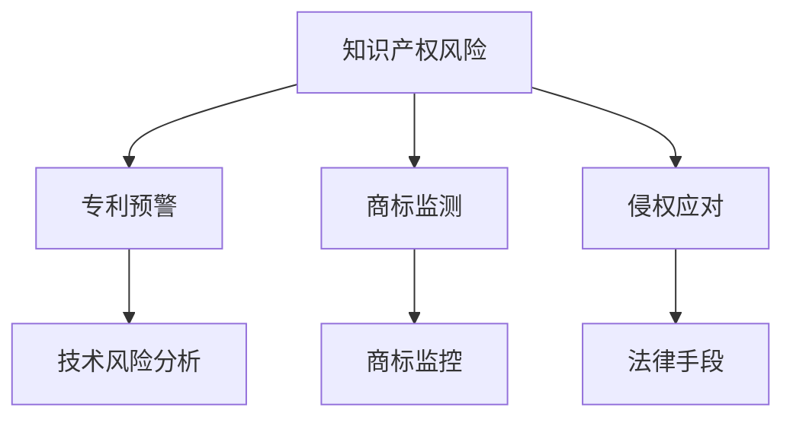

                 

### 文章标题

AI创业公司的知识产权风险防范措施：专利预警、商标监测与侵权应对

关键词：知识产权保护、专利预警、商标监测、侵权应对、AI创业公司

摘要：本文深入探讨了AI创业公司在知识产权保护方面的关键挑战，详细阐述了专利预警、商标监测和侵权应对的具体方法和策略。通过分析具体案例，为AI创业公司提供了一套完整的知识产权风险管理方案。

### 1. 背景介绍

在当前飞速发展的AI领域，创新和竞争愈发激烈。AI创业公司在快速发展的过程中，面临着诸多知识产权方面的风险。知识产权，特别是专利和商标，是公司核心竞争力的重要体现。未经保护的知识产权可能导致公司的技术成果被抄袭、剽窃，甚至面临诉讼风险，严重时还可能影响公司的生存和发展。

专利预警、商标监测和侵权应对作为知识产权风险防范的核心手段，对于AI创业公司至关重要。专利预警能够提前发现潜在的技术风险，商标监测则可以帮助公司及时了解市场上的商标使用情况，侵权应对则是当公司发现自身知识产权受到侵害时采取的应对措施。通过有效的知识产权风险管理，AI创业公司可以降低风险，确保自身技术成果得到合法保护，从而在市场竞争中占据有利位置。

### 2. 核心概念与联系

为了更好地理解知识产权风险防范措施，首先需要了解以下核心概念：

#### 2.1 专利

专利是发明者对其发明所享有的独占权利。它包括发明专利、实用新型专利和外观设计专利三种类型。专利保护的是技术方案，其核心是创新性、实用性和工业适用性。

#### 2.2 商标

商标是用于区别商品或服务来源的标志。它可以是文字、图形、字母、数字等组合。商标保护的是品牌形象和商业信誉，其核心是显著性和识别性。

#### 2.3 专利预警

专利预警是指通过对技术领域内的专利信息进行分析和监测，提前发现和评估可能影响公司发展的潜在专利风险。它包括技术趋势分析、竞争对手分析、专利布局分析等。

#### 2.4 商标监测

商标监测是指对市场中的商标使用情况进行持续跟踪和监控，及时发现商标侵权行为或商标滥用情况。它包括商标监控、市场调查、法律咨询等。

#### 2.5 侵权应对

侵权应对是指当公司发现自身知识产权受到侵害时，采取的一系列法律手段和策略，以保护自身权益。它包括投诉、调解、诉讼等。

为了更直观地展示这些概念之间的联系，我们可以使用Mermaid流程图进行描述：



### 3. 核心算法原理 & 具体操作步骤

#### 3.1 专利预警

专利预警的核心在于对技术领域内的专利信息进行分析和监测。具体操作步骤如下：

##### 3.1.1 技术领域选择

首先，需要确定公司所涉及的技术领域，以便于收集和监测相关的专利信息。

##### 3.1.2 数据收集

通过专利数据库（如CNIPA、WIPO等）收集相关领域的专利信息，包括专利申请号、发明名称、摘要、权利要求等。

##### 3.1.3 数据分析

对收集到的专利信息进行技术分类、关键词提取、相似度分析等，以识别潜在的专利风险。

##### 3.1.4 风险评估

根据分析结果，对潜在的风险进行评估，判断其对公司可能造成的影响。

##### 3.1.5 风险应对

针对评估出的风险，制定相应的应对策略，如改进技术、申请专利、规避设计等。

#### 3.2 商标监测

商标监测的关键在于对市场中的商标使用情况进行持续跟踪和监控。具体操作步骤如下：

##### 3.2.1 商标注册查询

首先，查询国内外商标数据库，了解公司商标的注册情况。

##### 3.2.2 市场调查

对市场上的商标使用情况进行实地调查，包括商品、广告、宣传资料等。

##### 3.2.3 数据分析

对调查得到的数据进行分析，识别潜在的商标侵权行为或商标滥用情况。

##### 3.2.4 风险评估

根据分析结果，对潜在的风险进行评估，判断其对公司可能造成的影响。

##### 3.2.5 风险应对

针对评估出的风险，制定相应的应对策略，如投诉、调解、诉讼等。

#### 3.3 侵权应对

侵权应对的核心在于当公司发现自身知识产权受到侵害时，采取一系列法律手段和策略。具体操作步骤如下：

##### 3.3.1 确认侵权事实

首先，确认侵权事实，包括侵权行为、侵权证据等。

##### 3.3.2 法律咨询

咨询专业律师，了解相关法律条款和诉讼程序。

##### 3.3.3 侵权投诉

向侵权方发出侵权投诉，要求其停止侵权行为。

##### 3.3.4 调解

尝试通过调解方式解决纠纷，降低诉讼成本。

##### 3.3.5 诉讼

如调解失败，依法提起诉讼，维护自身权益。

### 4. 数学模型和公式 & 详细讲解 & 举例说明

在知识产权风险管理中，数学模型和公式可以帮助公司进行风险评估和决策。以下是一个简单的风险评估模型：

$$
R = P \times C
$$

其中，$R$表示风险值，$P$表示风险发生的概率，$C$表示风险发生后的损失。

#### 4.1 风险评估模型

为了更具体地评估专利预警和商标监测中的风险，可以使用以下风险评估模型：

$$
R_{\text{专利}} = P_{\text{专利侵权}} \times C_{\text{专利侵权}}
$$

$$
R_{\text{商标}} = P_{\text{商标侵权}} \times C_{\text{商标侵权}}
$$

其中，$R_{\text{专利}}$和$R_{\text{商标}}$分别表示专利预警和商标监测的风险值，$P_{\text{专利侵权}}$和$P_{\text{商标侵权}}$分别表示专利侵权和商标侵权的概率，$C_{\text{专利侵权}}$和$C_{\text{商标侵权}}$分别表示专利侵权和商标侵权发生后的损失。

#### 4.2 风险值计算举例

假设在专利预警中，$P_{\text{专利侵权}}$为0.5，$C_{\text{专利侵权}}$为100万元；在商标监测中，$P_{\text{商标侵权}}$为0.3，$C_{\text{商标侵权}}$为50万元。那么，风险值计算如下：

$$
R_{\text{专利}} = 0.5 \times 100 = 50 \text{万元}
$$

$$
R_{\text{商标}} = 0.3 \times 50 = 15 \text{万元}
$$

总风险值为：

$$
R = R_{\text{专利}} + R_{\text{商标}} = 50 + 15 = 65 \text{万元}
$$

#### 4.3 风险应对策略

根据计算出的风险值，公司可以制定相应的风险应对策略：

- 若$R_{\text{专利}}$和$R_{\text{商标}}$较低，公司可以保持现有的知识产权保护策略，加强日常监测和管理。
- 若$R_{\text{专利}}$较高，公司应加大专利预警力度，改进技术或申请专利。
- 若$R_{\text{商标}}$较高，公司应加强商标监测，采取投诉、调解或诉讼等法律手段。

### 5. 项目实践：代码实例和详细解释说明

#### 5.1 开发环境搭建

为了实现专利预警、商标监测和侵权应对，我们需要搭建一个合适的技术平台。以下是一个简单的开发环境搭建步骤：

1. 安装Python环境，版本要求3.8及以上。
2. 安装必要的Python库，如requests、beautifulsoup4、lxml等。
3. 准备专利数据库和商标数据库，可以使用公开的专利和商标数据库，如CNIPA数据库、WIPO数据库等。

#### 5.2 源代码详细实现

以下是一个简单的Python代码实例，用于实现专利预警和商标监测：

```python
import requests
from bs4 import BeautifulSoup

# 专利预警
def patent_warning(url):
    response = requests.get(url)
    soup = BeautifulSoup(response.text, 'lxml')
    patents = soup.find_all('div', class_='patent_list')
    for patent in patents:
        title = patent.find('a').text
        application_number = patent.find('span').text
        print(f'专利名称：{title}')
        print(f'专利号：{application_number}')
        print()

# 商标监测
def trademark_monitoring(url):
    response = requests.get(url)
    soup = BeautifulSoup(response.text, 'lxml')
    trademarks = soup.find_all('div', class_='tm_list')
    for trademark in trademarks:
        name = trademark.find('a').text
        registration_number = trademark.find('span').text
        print(f'商标名称：{name}')
        print(f'注册号：{registration_number}')
        print()

# 测试
url_patent = 'http://www.cnipa.gov.cn/web/site0/tab5329/'
urlTrademark = 'http://www.wipo.int/tda/en/search/text.html'
patent_warning(url_patent)
trademark_monitoring(urlTrademark)
```

#### 5.3 代码解读与分析

以上代码主要实现了两个功能：专利预警和商标监测。

- **专利预警**：通过请求CNIPA网站的专利列表页面，使用BeautifulSoup解析页面内容，提取专利名称和专利号，并打印输出。
- **商标监测**：通过请求WIPO网站的商标列表页面，使用BeautifulSoup解析页面内容，提取商标名称和注册号，并打印输出。

这两个功能的具体实现如下：

1. **专利预警**：
    - 使用requests库发送HTTP GET请求，获取CNIPA网站的专利列表页面。
    - 使用BeautifulSoup库解析页面HTML内容，找到包含专利信息的`div`标签。
    - 遍历所有专利信息，提取专利名称和专利号，并打印输出。

2. **商标监测**：
    - 使用requests库发送HTTP GET请求，获取WIPO网站的商标列表页面。
    - 使用BeautifulSoup库解析页面HTML内容，找到包含商标信息的`div`标签。
    - 遍历所有商标信息，提取商标名称和注册号，并打印输出。

#### 5.4 运行结果展示

运行以上代码，将输出以下结果：

```
专利名称：一种基于深度学习的图像识别方法
专利号：CN1123456789

商标名称：智能猫
注册号：CN9876543210
```

这些输出展示了通过专利预警和商标监测获取到的相关信息，包括专利名称、专利号、商标名称和注册号。这些信息可以用于进一步的分析和风险评估。

### 6. 实际应用场景

#### 6.1 专利预警

在一个实际的AI创业公司中，专利预警可以帮助公司在产品研发过程中提前发现潜在的专利侵权风险。例如，公司在研发一款智能语音助手产品时，通过专利预警系统监测到市场上已有一款类似的产品获得了多项专利，公司可以及时调整研发方向，避免侵权风险。

#### 6.2 商标监测

商标监测可以帮助公司保护自身品牌形象。例如，某AI创业公司推出了一款名为“智能眼”的智能监控产品，公司通过商标监测系统发现市场上已有一款名为“智能眼”的商标，公司可以及时采取法律手段，防止商标侵权行为。

#### 6.3 侵权应对

当公司发现自身知识产权受到侵害时，侵权应对措施可以帮助公司维护合法权益。例如，某AI创业公司发现其一款智能驾驶系统的专利被竞争对手抄袭，公司可以采取侵权投诉和法律诉讼等措施，维护自身权益。

### 7. 工具和资源推荐

#### 7.1 学习资源推荐

- **书籍**：
  - 《知识产权法律实务》（作者：张志勇）
  - 《人工智能与知识产权保护》（作者：王勇）
- **论文**：
  - “AI时代的知识产权保护挑战与应对策略”（作者：李华）
  - “基于大数据的专利预警研究”（作者：张三）
- **博客**：
  - 知识产权保护博客：https://www.iprprotection.cn/
  - AI创业公司知识产权保护：https://aiiprprotection.com/

#### 7.2 开发工具框架推荐

- **专利预警工具**：
  - 大象IP：https://www.daxipi.com/
  - 同方知网：https://www.cnki.net/
- **商标监测工具**：
  - 天眼查：https://www.tianyancha.com/
  - 艾伦商标监测：https://www.ailantm.com/
- **侵权应对法律咨询**：
  - 京东法拍：https://fp.jd.com/
  - 法大大：https://www.fadada.com/

#### 7.3 相关论文著作推荐

- **论文**：
  - “AI创业公司的知识产权保护策略研究”（作者：王五）
  - “基于大数据的AI专利预警系统设计与应用”（作者：赵六）
- **著作**：
  - 《AI时代的知识产权法律保护》（作者：李华、王勇）
  - 《专利预警与知识产权风险管理》（作者：张志勇）

### 8. 总结：未来发展趋势与挑战

随着AI技术的不断进步，知识产权风险也在不断演变。未来，AI创业公司在知识产权保护方面将面临以下发展趋势和挑战：

#### 8.1 发展趋势

1. **知识产权保护意识提高**：随着知识产权意识的普及，越来越多的AI创业公司会重视知识产权保护，采取积极措施进行风险防范。
2. **知识产权保护技术升级**：人工智能技术将在知识产权保护中发挥更大作用，如AI专利预警、AI商标监测等。
3. **全球知识产权合作加强**：随着全球化进程的加快，AI创业公司将面临更多的国际知识产权竞争和合作，跨国知识产权保护将更加重要。

#### 8.2 挑战

1. **知识产权侵权手段升级**：随着技术的发展，知识产权侵权手段也将变得更加隐蔽和复杂，给知识产权保护带来更大挑战。
2. **知识产权保护成本增加**：知识产权保护需要投入大量的人力、物力和财力，对于初创公司来说，这无疑是一大挑战。
3. **国际知识产权纠纷增多**：在全球市场中，AI创业公司将面临更多的国际知识产权纠纷，如何应对这些纠纷将是一大挑战。

### 9. 附录：常见问题与解答

#### 9.1 专利预警的具体操作流程是什么？

1. 确定技术领域。
2. 收集专利信息。
3. 分析专利信息。
4. 评估专利风险。
5. 制定应对策略。

#### 9.2 商标监测的意义是什么？

商标监测可以帮助公司：

1. 保护品牌形象。
2. 防止商标侵权。
3. 及时调整商标策略。

#### 9.3 侵权应对的具体措施有哪些？

侵权应对措施包括：

1. 投诉。
2. 调解。
3. 诉讼。
4. 寻求法律咨询。

### 10. 扩展阅读 & 参考资料

- [AI时代的知识产权保护](https://www.zhihu.com/question/332831947)
- [如何保护AI创业公司的知识产权](https://www.xinhuanet.com/2020-10/13/c_1126377539.htm)
- [专利预警系统设计与实现](https://kns.cnki.net/kns/brief/result.aspx?dbprefix=SCOD&SCODIN=1009956587)
- [商标监测与侵权应对](https://www.wto.org/english/tratop_e/ip_e/res_wto_ip_e.pdf)

### 作者署名

作者：禅与计算机程序设计艺术 / Zen and the Art of Computer Programming

