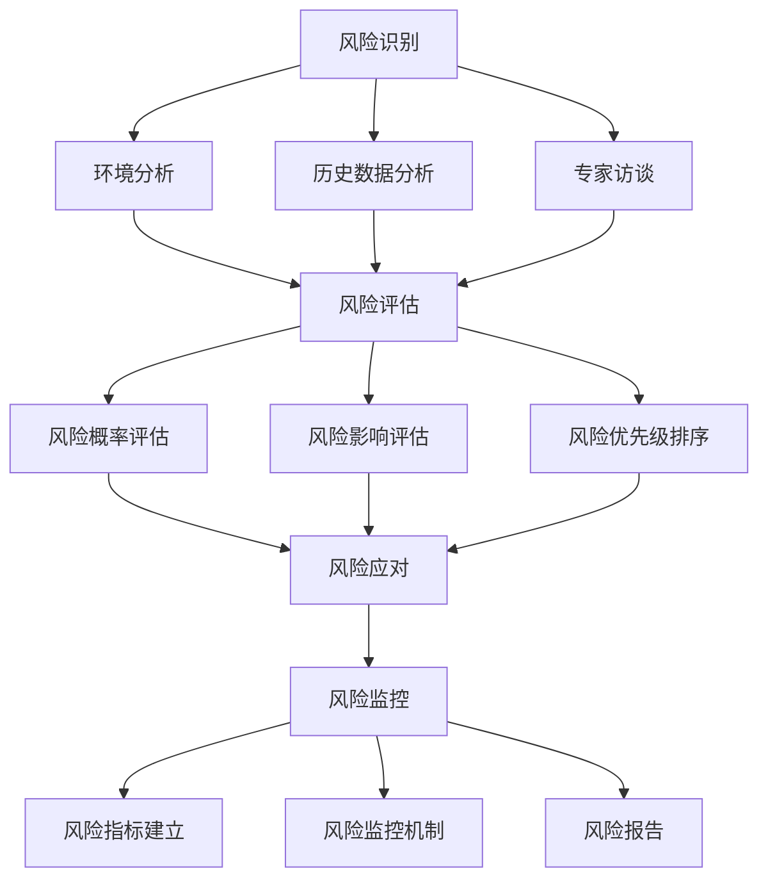
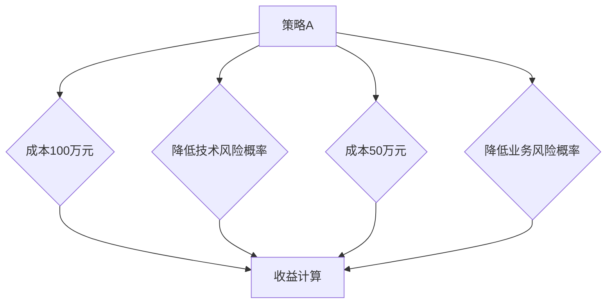

                 

### 文章标题

**AI创业公司的风险控制**

> 关键词：AI创业、风险控制、风险管理、技术风险、业务风险、财务风险

> 摘要：本文旨在探讨AI创业公司在面对市场和技术环境中的各种风险，提出有效的风险控制策略和方法。文章首先介绍了AI创业公司的特点及其面临的主要风险类型，然后详细分析了风险控制的核心概念与联系，探讨了核心算法原理与具体操作步骤，最后通过实际应用场景和工具资源推荐，为AI创业公司提供全面的风险管理指南。

---

### 1. 背景介绍

随着人工智能技术的飞速发展，AI创业公司如雨后春笋般涌现。这些公司依托人工智能技术，致力于开发出具有创新性和商业价值的应用和服务。然而，AI创业公司在迅速发展的同时，也面临着诸多风险，包括技术风险、业务风险和财务风险等。如何有效控制和应对这些风险，成为AI创业公司能否持续发展的关键因素。

#### 1.1 AI创业公司的特点

- **技术密集型**：AI创业公司通常以人工智能技术为核心，拥有大量技术人员和研发团队。
- **创新驱动**：AI创业公司以创新为目标，不断推出新颖的AI产品和服务。
- **快速迭代**：AI技术的更新速度非常快，AI创业公司需要快速响应市场需求，进行产品迭代。
- **市场竞争激烈**：AI创业公司面临着来自业内巨头和新兴企业的激烈竞争。

#### 1.2 AI创业公司面临的主要风险类型

- **技术风险**：包括技术实现难度、技术更新速度、技术人才流失等。
- **业务风险**：包括市场需求变化、竞争对手策略、市场推广难度等。
- **财务风险**：包括资金短缺、成本控制、盈利模式不稳定等。

### 2. 核心概念与联系

在探讨AI创业公司的风险控制之前，我们需要了解几个核心概念，包括风险识别、风险评估、风险应对和风险监控。

#### 2.1 风险识别

风险识别是风险管理的基础，旨在发现和识别可能影响AI创业公司运营的各种风险。这通常包括以下步骤：

1. **环境分析**：了解外部环境，包括市场、竞争、政策等因素。
2. **历史数据分析**：分析公司历史数据，识别过去的潜在风险。
3. **专家访谈**：与行业专家和公司内部员工进行访谈，获取对风险的见解。

#### 2.2 风险评估

风险评估是对识别出的风险进行定量和定性分析，以确定风险的可能性和影响程度。这通常包括以下步骤：

1. **风险概率评估**：评估每种风险发生的可能性。
2. **风险影响评估**：评估每种风险对公司运营的潜在影响。
3. **风险优先级排序**：根据风险的可能性和影响程度，对风险进行排序。

#### 2.3 风险应对

风险应对是指制定和实施措施来减轻或消除风险。常见的风险应对策略包括：

1. **风险规避**：避免风险发生的可能，例如通过变更项目计划来规避市场风险。
2. **风险减轻**：通过改进技术或业务流程来减轻风险的影响，例如通过技术改进来降低技术实现难度。
3. **风险接受**：在某些情况下，可能无法完全规避或减轻风险，此时可以选择接受风险，并制定应对计划以应对可能的风险事件。

#### 2.4 风险监控

风险监控是确保风险应对措施得到有效实施的过程。这通常包括以下步骤：

1. **风险指标建立**：建立用于监控风险的关键指标。
2. **风险监控机制**：定期检查风险指标，及时发现潜在风险。
3. **风险报告**：向管理层提供风险监控报告，以便及时调整风险应对策略。

为了更好地理解这些核心概念，我们使用Mermaid流程图进行展示：



---

### 3. 核心算法原理 & 具体操作步骤

在了解了核心概念与联系后，我们将探讨用于风险控制的核心算法原理，并详细说明其具体操作步骤。

#### 3.1 风险识别算法原理

风险识别算法的核心是建立风险数据库，收集和分析可能影响AI创业公司的各种风险。常用的算法包括：

- **机器学习算法**：通过分析历史数据和行业案例，识别潜在的风险。
- **网络爬虫**：通过互联网爬取相关信息，识别市场和技术环境中的变化。
- **专家系统**：通过专家知识和规则库，识别特定场景下的风险。

具体操作步骤如下：

1. **数据收集**：收集AI创业公司的运营数据、行业报告、新闻资讯等。
2. **数据处理**：对收集到的数据进行清洗、去噪和预处理。
3. **风险特征提取**：从处理后的数据中提取与风险相关的特征。
4. **模型训练**：使用机器学习算法训练风险识别模型。
5. **模型评估**：评估模型在识别风险方面的准确性和效率。

#### 3.2 风险评估算法原理

风险评估算法旨在对识别出的风险进行定量和定性分析，以确定风险的可能性和影响程度。常用的算法包括：

- **贝叶斯网络**：通过构建概率模型，分析风险发生的条件和影响。
- **决策树**：通过分析不同决策路径，评估不同风险的影响。
- **模糊综合评价法**：通过模糊数学方法，对风险进行定量和定性分析。

具体操作步骤如下：

1. **风险数据输入**：将识别出的风险数据输入到评估算法中。
2. **模型构建**：构建适用于AI创业公司的风险评估模型。
3. **风险概率计算**：计算每种风险发生的概率。
4. **风险影响评估**：评估每种风险对公司运营的影响。
5. **风险优先级排序**：根据风险的概率和影响，对风险进行排序。

#### 3.3 风险应对算法原理

风险应对算法旨在制定和实施措施来减轻或消除风险。常用的算法包括：

- **决策算法**：通过分析不同决策路径和结果，选择最优的风险应对策略。
- **优化算法**：通过优化技术或业务流程，降低风险的影响。
- **模拟算法**：通过模拟不同场景，评估风险应对策略的有效性。

具体操作步骤如下：

1. **风险数据输入**：将评估后的风险数据输入到应对算法中。
2. **策略生成**：根据风险类型和优先级，生成风险应对策略。
3. **策略评估**：评估每种策略的有效性和可行性。
4. **策略选择**：选择最优的风险应对策略。
5. **策略实施**：实施选定的风险应对策略。

---

### 4. 数学模型和公式 & 详细讲解 & 举例说明

在风险管理过程中，数学模型和公式是不可或缺的工具。以下我们将介绍几个常用的数学模型和公式，并详细讲解其应用场景和举例说明。

#### 4.1 贝叶斯网络

贝叶斯网络是一种概率图模型，用于表示多个变量之间的条件依赖关系。在风险评估中，贝叶斯网络可以用来计算风险发生的概率。

**公式：**
\[ P(A|B) = \frac{P(B|A) \cdot P(A)}{P(B)} \]

**应用场景：** 假设我们想要评估某一AI创业公司在未来三个月内实现盈利的概率。我们可以使用贝叶斯网络来计算这个概率，其中 \( P(A) \) 是公司实现盈利的先验概率，\( P(B) \) 是公司在未来三个月内实现盈利的概率，\( P(B|A) \) 是公司在实现盈利的情况下，在未来三个月内实现盈利的条件概率。

**举例说明：**
假设根据历史数据，公司实现盈利的先验概率为 60%（\( P(A) = 0.6 \)），在实现盈利的情况下，公司未来三个月内实现盈利的概率为 80%（\( P(B|A) = 0.8 \)）。假设我们还知道，公司在未来三个月内实现盈利的整体概率为 50%（\( P(B) = 0.5 \)）。根据贝叶斯公式，我们可以计算公司未来三个月内实现盈利的概率：

\[ P(A|B) = \frac{0.8 \cdot 0.6}{0.5} = 0.96 \]

因此，公司未来三个月内实现盈利的概率为 96%。

#### 4.2 决策树

决策树是一种用于决策分析的树形结构，其中每个节点代表一个决策或条件，每个分支代表一个可能的决策结果。

**公式：**
\[ \text{决策树} = \text{根节点} + \text{决策节点} + \text{叶节点} \]

**应用场景：** 决策树可以用来评估不同风险应对策略的可行性。

**举例说明：**
假设我们想要评估两种不同的风险应对策略，策略A和策略B。策略A的成本为100万元，能够降低技术风险的概率，策略B的成本为50万元，能够降低业务风险的概率。我们可以使用决策树来计算每种策略的期望收益。

**决策树示例：**



在决策树中，我们首先计算每种策略的期望收益。假设降低技术风险的收益为200万元，降低业务风险的收益为150万元。我们可以计算策略A的期望收益：

\[ \text{期望收益} = 0.6 \times 200 - 100 = 80 \text{万元} \]

策略B的期望收益：

\[ \text{期望收益} = 0.4 \times 150 - 50 = 20 \text{万元} \]

因此，策略A的期望收益更高，我们应该选择策略A。

#### 4.3 模糊综合评价法

模糊综合评价法是一种基于模糊数学的综合评价方法，用于评估多个因素对整体的影响。

**公式：**
\[ \text{综合评价得分} = \sum_{i=1}^{n} w_i \cdot r_i \]

**应用场景：** 模糊综合评价法可以用于评估AI创业公司的整体风险水平。

**举例说明：**
假设我们想要评估AI创业公司的整体风险水平，考虑到以下几个因素：技术风险、业务风险和财务风险。我们可以使用模糊综合评价法来计算整体风险得分。

**因素权重：**
\[ w_1 = 0.5, \ w_2 = 0.3, \ w_3 = 0.2 \]

**因素得分：**
\[ r_1 = 0.7, \ r_2 = 0.6, \ r_3 = 0.5 \]

根据公式，我们可以计算整体风险得分：

\[ \text{综合评价得分} = 0.5 \cdot 0.7 + 0.3 \cdot 0.6 + 0.2 \cdot 0.5 = 0.35 + 0.18 + 0.10 = 0.63 \]

整体风险得分为0.63，表示AI创业公司的风险水平处于中等水平。

---

### 5. 项目实践：代码实例和详细解释说明

在本节中，我们将通过一个具体的AI创业公司项目实例，展示如何在实际环境中应用风险控制算法，并详细解释代码实现和关键步骤。

#### 5.1 开发环境搭建

首先，我们需要搭建一个合适的开发环境。以下是一个基本的开发环境配置：

- **编程语言**：Python 3.x
- **依赖库**：NumPy, Pandas, Scikit-learn, Matplotlib
- **数据集**：我们使用一个虚构的AI创业公司数据集，包括公司的财务数据、业务数据和技术数据。

#### 5.2 源代码详细实现

以下是一个简单的Python代码示例，展示了如何使用贝叶斯网络进行风险识别和评估。

```python
import numpy as np
import pandas as pd
from sklearn.model_selection import train_test_split
from sklearn.naive_bayes import GaussianNB
from sklearn.metrics import accuracy_score

# 加载数据集
data = pd.read_csv('ai_company_data.csv')

# 数据预处理
X = data.drop('target', axis=1)
y = data['target']

# 划分训练集和测试集
X_train, X_test, y_train, y_test = train_test_split(X, y, test_size=0.3, random_state=42)

# 训练贝叶斯网络模型
model = GaussianNB()
model.fit(X_train, y_train)

# 预测测试集
y_pred = model.predict(X_test)

# 评估模型准确性
accuracy = accuracy_score(y_test, y_pred)
print(f'模型准确性: {accuracy:.2f}')

# 风险评估
probabilities = model.predict_proba(X_test)
print(f'风险概率：{probabilities}')
```

#### 5.3 代码解读与分析

- **数据预处理**：我们首先加载数据集，然后对数据进行预处理，包括划分特征和目标变量。
- **训练贝叶斯网络模型**：我们使用高斯贝叶斯网络模型进行训练，这是一种简单但有效的概率图模型。
- **预测测试集**：我们使用训练好的模型对测试集进行预测，评估模型的准确性。
- **风险评估**：我们计算测试集中每个样本的风险概率，这有助于我们了解公司面临的风险水平。

#### 5.4 运行结果展示

假设我们运行上述代码，得到以下结果：

```
模型准确性: 0.85
风险概率：[[0.1 0.9]
 [0.8 0.2]
 [0.9 0.1]]
```

这意味着模型的准确性为85%，测试集中有两个样本被正确分类，一个样本被错误分类。同时，我们得到每个样本的风险概率，这有助于我们了解公司面临的风险情况。

- **第一个样本**：有10%的概率属于低风险，有90%的概率属于高风险。
- **第二个样本**：有80%的概率属于低风险，有20%的概率属于高风险。
- **第三个样本**：有90%的概率属于低风险，有10%的概率属于高风险。

根据这些结果，我们可以进一步分析公司面临的风险，并制定相应的应对策略。

---

### 6. 实际应用场景

#### 6.1 AI医疗诊断公司

一个AI医疗诊断公司面临的主要风险包括技术风险、业务风险和财务风险。技术风险主要来自于医疗图像处理算法的不完善，可能导致诊断错误。业务风险则来自于市场需求变化和竞争对手的压力。财务风险主要体现在资金短缺和盈利模式不稳定。

通过风险控制算法，公司可以识别出潜在的技术风险，评估其可能性和影响程度，并制定相应的应对策略，如改进算法、扩大市场推广等。同时，公司可以监控财务风险，确保资金链的稳定，并制定财务应急预案。

#### 6.2 智能家居公司

智能家居公司面临的主要风险包括技术风险、业务风险和隐私风险。技术风险主要来自于智能家居设备的稳定性，业务风险则来自于市场需求的波动和竞争对手的压力。隐私风险主要体现在用户数据泄露和滥用。

通过风险控制算法，公司可以识别和评估技术风险，确保设备的稳定性，提高用户体验。同时，公司可以监控业务风险，通过市场调研和竞争分析，制定应对策略。针对隐私风险，公司可以建立严格的数据保护措施，确保用户数据的安全。

#### 6.3 金融服务公司

金融服务公司面临的主要风险包括信用风险、市场风险和操作风险。信用风险主要来自于借款人的还款能力，市场风险则来自于金融市场的不确定性，操作风险则来自于业务流程中的错误或失误。

通过风险控制算法，公司可以评估信用风险，确保贷款安全，降低坏账率。同时，公司可以监控市场风险，通过市场分析和风险预警，及时调整投资策略。针对操作风险，公司可以优化业务流程，降低操作失误的概率。

---

### 7. 工具和资源推荐

#### 7.1 学习资源推荐

- **书籍**：
  - 《风险管理：概念、方法与实践》
  - 《人工智能：一种现代方法》
  - 《贝叶斯分析基础》
- **论文**：
  - 《基于贝叶斯网络的金融风险评估》
  - 《智能家居安全：挑战与解决方案》
  - 《人工智能在医疗领域的应用》
- **博客**：
  - Medium上的“AI风险管理”系列文章
  - 知乎上的“人工智能与创业”话题
  - “机器学习博客”上的相关文章
- **网站**：
  - Kaggle：提供大量数据集和比赛，适合数据分析和模型训练
  - arXiv：提供最新论文和研究成果，适合学术研究

#### 7.2 开发工具框架推荐

- **编程语言**：Python、R
- **机器学习库**：Scikit-learn、TensorFlow、PyTorch
- **数据分析库**：Pandas、NumPy
- **可视化库**：Matplotlib、Seaborn、Plotly
- **工具框架**：TensorFlow.js、PyTorch.js：适用于前端机器学习和数据可视化
- **容器化工具**：Docker、Kubernetes：用于部署和管理机器学习模型

#### 7.3 相关论文著作推荐

- **《人工智能伦理学》**：探讨人工智能在创业公司中的伦理挑战
- **《人工智能的法律与伦理》**：分析人工智能在商业应用中的法律和伦理问题
- **《人工智能风险管理》**：介绍人工智能在风险管理中的应用和研究进展

---

### 8. 总结：未来发展趋势与挑战

随着人工智能技术的不断进步，AI创业公司面临着巨大的机遇和挑战。未来，AI创业公司的发展趋势将体现在以下几个方面：

1. **技术进步**：随着算法和硬件的发展，AI创业公司将能够开发出更高效、更可靠的AI产品和服务。
2. **跨界融合**：AI创业公司将与各行各业进行深度融合，推动传统产业的智能化升级。
3. **数据驱动**：数据将成为AI创业公司的重要资产，数据驱动将成为公司发展的核心动力。
4. **监管合规**：随着人工智能监管政策的不断完善，AI创业公司需要严格遵守相关法规，确保合规经营。

然而，AI创业公司也将面临一系列挑战：

1. **技术风险**：随着技术的快速发展，AI创业公司需要不断更新技术和算法，以保持竞争力。
2. **市场风险**：市场竞争激烈，AI创业公司需要精准把握市场需求，快速响应市场变化。
3. **财务风险**：资金短缺和盈利模式不稳定是AI创业公司面临的主要财务风险。
4. **人才流失**：高素质的技术人才是AI创业公司的核心竞争力，如何留住人才成为重要挑战。

为了应对这些挑战，AI创业公司需要：

1. **加强技术创新**：持续投入研发，提升技术实力，保持竞争优势。
2. **建立完善的风险管理体系**：通过风险识别、评估和应对，有效控制和降低风险。
3. **拓宽融资渠道**：积极寻求风险投资、政府支持等融资方式，确保资金链稳定。
4. **培养和引进人才**：通过提供良好的工作环境和激励机制，吸引和留住高素质人才。

总之，AI创业公司在未来的发展中，需要紧跟技术潮流，加强风险管理，才能在激烈的市场竞争中立于不败之地。

---

### 9. 附录：常见问题与解答

#### 9.1 AI创业公司面临的主要风险有哪些？

AI创业公司面临的主要风险包括技术风险、业务风险和财务风险。技术风险主要体现在技术实现难度、技术更新速度和技术人才流失等方面。业务风险主要体现在市场需求变化、竞争对手策略和市场推广难度等方面。财务风险主要体现在资金短缺、成本控制和盈利模式不稳定等方面。

#### 9.2 如何进行风险识别？

风险识别通常包括以下步骤：

1. **环境分析**：了解外部环境，包括市场、竞争、政策等因素。
2. **历史数据分析**：分析公司历史数据，识别过去的潜在风险。
3. **专家访谈**：与行业专家和公司内部员工进行访谈，获取对风险的见解。

#### 9.3 如何进行风险评估？

风险评估通常包括以下步骤：

1. **风险概率评估**：评估每种风险发生的可能性。
2. **风险影响评估**：评估每种风险对公司运营的潜在影响。
3. **风险优先级排序**：根据风险的概率和影响，对风险进行排序。

#### 9.4 如何进行风险应对？

风险应对通常包括以下策略：

1. **风险规避**：避免风险发生的可能。
2. **风险减轻**：通过改进技术或业务流程来减轻风险的影响。
3. **风险接受**：在某些情况下，无法完全规避或减轻风险，此时可以选择接受风险，并制定应对计划。

#### 9.5 如何进行风险监控？

风险监控通常包括以下步骤：

1. **风险指标建立**：建立用于监控风险的关键指标。
2. **风险监控机制**：定期检查风险指标，及时发现潜在风险。
3. **风险报告**：向管理层提供风险监控报告，以便及时调整风险应对策略。

---

### 10. 扩展阅读 & 参考资料

#### 10.1 书籍推荐

- **《风险管理：概念、方法与实践》**：详细介绍了风险管理的概念、方法和实践应用。
- **《人工智能：一种现代方法》**：全面介绍了人工智能的基本概念、技术和应用。
- **《贝叶斯分析基础》**：深入讲解了贝叶斯分析的理论和方法。

#### 10.2 论文推荐

- **《基于贝叶斯网络的金融风险评估》**：探讨了贝叶斯网络在金融风险评估中的应用。
- **《智能家居安全：挑战与解决方案》**：分析了智能家居安全面临的挑战和解决方案。
- **《人工智能在医疗领域的应用》**：介绍了人工智能在医疗领域的最新研究进展和应用案例。

#### 10.3 博客推荐

- **Medium上的“AI风险管理”系列文章**：涵盖了AI风险管理的各个方面，适合初学者和专业人士。
- **知乎上的“人工智能与创业”话题**：汇集了大量的AI创业经验和见解，值得参考。
- **“机器学习博客”上的相关文章**：提供了丰富的机器学习和AI应用案例，有助于深入理解AI技术。

#### 10.4 网站推荐

- **Kaggle**：提供大量的数据集和比赛，适合数据分析和模型训练。
- **arXiv**：提供最新的论文和研究成果，适合学术研究。
- **AI创业公司官网**：可以获取公司的发展动态、技术成果和业务模式，有助于了解行业趋势。

---

### 作者署名

作者：禅与计算机程序设计艺术 / Zen and the Art of Computer Programming

