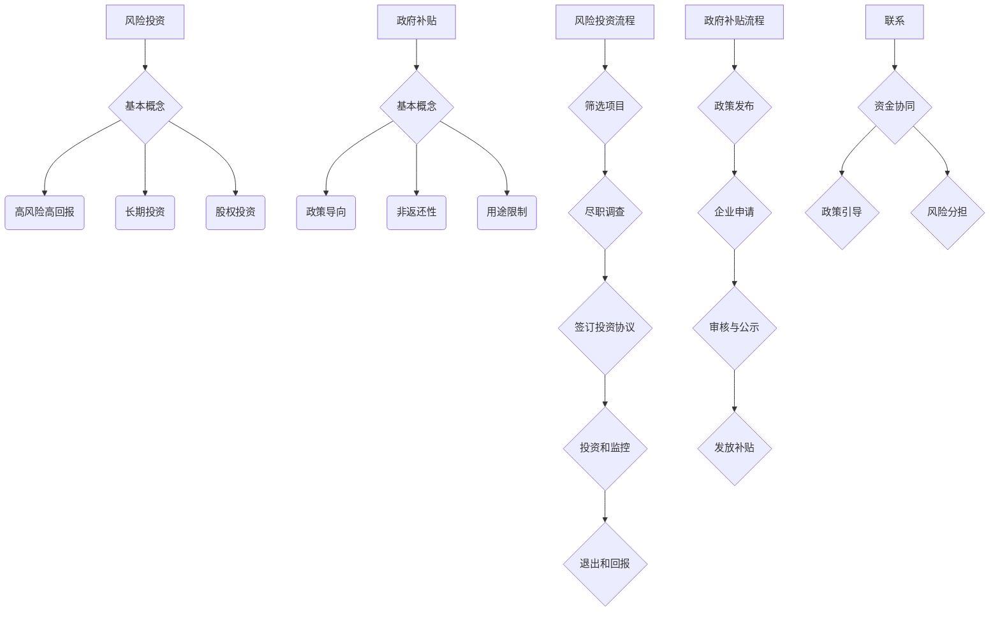

                 

### 文章标题

**AI创业：了解风险投资与补贴**

> 关键词：人工智能、创业、风险投资、政府补贴

> 摘要：本文深入探讨了人工智能创业者在初创阶段如何充分利用风险投资和政府补贴来降低成本、提高成功率。通过分析风险投资的运作机制、政府补贴的种类及申请流程，作者为AI创业团队提供了实用的策略和案例分析。

### 1. 背景介绍

人工智能（AI）作为当今科技领域的明星，正在迅速改变各行各业。从自动驾驶、智能医疗到金融科技，AI的应用前景广阔。然而，对于许多创业者来说，AI项目的高投入和快速迭代特性使得资金问题成为创业路上的主要挑战。在此背景下，风险投资（Venture Capital，简称VC）和政府补贴成为AI创业团队的重要资金来源。

风险投资是一种私人股权投资，通常用于资助初创企业和成长型企业。投资者（VC）在早期阶段提供资金，以换取公司的股权，希望通过企业的成功上市或被收购获得高额回报。而政府补贴则是政府为了支持特定行业或技术发展，向企业提供的一种财政资助。对于AI创业团队来说，合理利用风险投资和政府补贴，不仅能缓解资金压力，还能提高项目的成功率。

本文将详细分析风险投资和政府补贴的运作机制，探讨如何最大限度地利用这两种资金来源，为AI创业提供实用的策略和案例分析。希望通过本文，读者能对AI创业的资金问题有更深刻的理解，并为自己的创业之路做好充分准备。

### 2. 核心概念与联系

#### 2.1 风险投资的基本概念

风险投资是一种投资策略，它专注于在早期阶段资助初创企业，以期在企业成长、上市或被收购时获得高额回报。风险投资的特点包括：

- **高风险高回报**：由于初创企业的成功率较低，因此风险投资具有高风险性。然而，一旦企业成功，投资者可以获得数倍甚至数十倍的回报。
- **长期投资**：风险投资通常持有企业的股份多年，帮助企业度过初创期和成长期。
- **股权投资**：风险投资以股权形式投资，意味着投资者在企业的未来收益中享有一定的权益。

风险投资的基本运作流程包括：

1. **筛选项目**：风险投资公司通过市场调研、行业分析等手段，筛选出具有潜力的初创企业。
2. **尽职调查**：在确定投资意向后，风险投资公司会对企业进行全面的尽职调查，包括财务状况、团队背景、市场竞争力等。
3. **签订投资协议**：尽职调查完成后，双方签订投资协议，明确投资金额、投资比例、退出机制等条款。
4. **投资和监控**：风险投资公司向企业注入资金，并参与企业的战略决策和运营管理。
5. **退出和回报**：在企业发展成熟后，通过上市、并购等方式退出，实现投资回报。

#### 2.2 政府补贴的基本概念

政府补贴是一种财政资助方式，旨在支持特定行业或技术发展。对于AI创业团队来说，政府补贴是一种重要的资金来源，可以帮助企业缓解资金压力，加速技术突破。

政府补贴的特点包括：

- **政策导向**：政府补贴通常与国家发展战略、行业规划相一致，具有明显的政策导向。
- **非返还性**：补贴资金通常不需要返还，对企业来说是一种无偿资助。
- **用途限制**：政府补贴通常有特定的用途限制，如研发投入、设备购置、人才引进等。

政府补贴的运作流程包括：

1. **政策发布**：政府发布相关补贴政策，明确补贴对象、申请条件、申请流程等。
2. **企业申请**：符合条件的企业向政府部门提交申请，并提供相关材料。
3. **审核与公示**：政府部门对申请材料进行审核，对符合条件的企业进行公示。
4. **发放补贴**：审核通过后，政府将补贴资金拨付给企业。

#### 2.3 风险投资与政府补贴的联系

风险投资和政府补贴在支持AI创业方面具有互补性。风险投资注重企业的成长性和市场前景，提供长期的资金支持；而政府补贴则侧重于企业的技术研发和创新，提供即时的财政援助。

两者之间的联系体现在：

- **资金协同**：风险投资和政府补贴可以共同为企业提供资金支持，降低企业的融资压力。
- **政策引导**：政府补贴可以引导企业专注于技术研发和产业创新，促进AI行业的健康发展。
- **风险分担**：风险投资和政府补贴可以共同分担企业的研发风险，提高企业的成功率。

为了更好地理解风险投资和政府补贴，我们使用Mermaid流程图展示它们的基本概念和运作机制。



通过上述分析，我们可以看出，风险投资和政府补贴在支持AI创业方面具有重要作用。理解它们的基本概念和运作机制，对于AI创业团队来说至关重要。

### 3. 核心算法原理 & 具体操作步骤

#### 3.1 风险投资评估模型

在风险投资领域，评估一个初创企业的投资潜力是关键步骤。常用的评估模型包括：

- **天使投资模型**：天使投资者通常关注创业团队的经验、技术壁垒和市场潜力。
- **VC模型**：风险投资公司更多关注企业的市场前景、团队实力和商业模式。

以下是风险投资评估模型的具体操作步骤：

1. **收集信息**：通过市场调研、尽职调查等方式，收集企业的基本信息、财务数据、团队背景、市场竞争力等。
2. **分析财务数据**：分析企业的收入、利润、现金流等财务指标，评估企业的盈利能力和财务健康状况。
3. **评估团队**：考察团队的成员背景、经验、执行力等，判断团队是否具备实现企业目标的能力。
4. **市场分析**：分析企业所在行业的发展趋势、市场规模、竞争态势等，评估企业的市场前景。
5. **风险评估**：综合考虑企业的技术、市场、财务等多方面因素，评估企业面临的风险。

#### 3.2 政府补贴申请流程

政府补贴的申请流程通常包括以下几个步骤：

1. **政策解读**：了解政府发布的补贴政策，明确补贴对象、申请条件、申请流程等。
2. **准备申请材料**：根据政策要求，准备申请所需的材料，如企业资质证明、项目可行性报告、财务报表等。
3. **提交申请**：通过政府指定的渠道提交申请材料，并进行在线填报。
4. **审核与公示**：政府部门对申请材料进行审核，对符合条件的企业进行公示。
5. **发放补贴**：审核通过后，政府将补贴资金拨付给企业。

#### 3.3 风险投资与政府补贴的整合策略

为了最大限度地利用风险投资和政府补贴，AI创业团队可以采取以下整合策略：

1. **项目定位**：明确企业的市场定位和技术方向，确保项目具有吸引力和可行性。
2. **资金规划**：根据企业的资金需求，合理规划风险投资和政府补贴的使用，确保资金的高效利用。
3. **风险评估**：在申请政府补贴前，进行详细的风险评估，确保项目具有足够的风险承受能力。
4. **政策对接**：积极了解和对接政府补贴政策，确保企业符合申请条件，提高申请成功率。
5. **资金协同**：与风险投资机构建立合作关系，实现资金协同，降低企业的融资成本。

通过上述核心算法原理和具体操作步骤，AI创业团队可以更好地理解如何利用风险投资和政府补贴，为自己的创业之路奠定坚实的基础。

### 4. 数学模型和公式 & 详细讲解 & 举例说明

#### 4.1 风险投资的数学模型

在风险投资领域，常用的数学模型包括回报率模型和投资组合模型。

**回报率模型**

回报率模型用于评估风险投资的回报情况。假设一个初创企业的成功率为\( p \)，投资者的初始投资为\( I \)，企业成功后的回报率为\( R \)，则投资者的期望回报率为：

$$
\text{期望回报率} = p \times R + (1 - p) \times 0
$$

其中，\( p \times R \)表示成功时的回报，\( (1 - p) \times 0 \)表示失败时的回报（为0）。

举例说明：

假设一个初创企业的成功率为40%，投资者初始投资为100万元，成功后的回报率为10倍。则该投资者的期望回报率为：

$$
\text{期望回报率} = 0.4 \times 10 + 0.6 \times 0 = 4 + 0 = 4
$$

即投资者的期望回报率为4倍。

**投资组合模型**

投资组合模型用于评估多个项目的投资风险和回报。假设投资者有多个初创企业项目，每个项目的成功率为\( p_i \)，回报率为\( R_i \)，则投资组合的期望回报率和风险可以通过以下公式计算：

$$
\text{期望回报率} = \sum_{i=1}^{n} p_i \times R_i
$$

$$
\text{风险} = \sqrt{\sum_{i=1}^{n} p_i \times (1 - p_i) \times R_i^2}
$$

其中，\( n \)为项目总数。

举例说明：

假设投资者有两个初创企业项目，项目A的成功率为50%，回报率为10倍；项目B的成功率为30%，回报率为5倍。则投资组合的期望回报率和风险为：

$$
\text{期望回报率} = 0.5 \times 10 + 0.3 \times 5 = 5 + 1.5 = 6.5
$$

$$
\text{风险} = \sqrt{0.5 \times (1 - 0.5) \times 10^2 + 0.3 \times (1 - 0.3) \times 5^2} = \sqrt{0.5 \times 0.5 \times 100 + 0.3 \times 0.7 \times 25} = \sqrt{25 + 5.25} = \sqrt{30.25} \approx 5.5
$$

即投资组合的期望回报率为6.5倍，风险为5.5倍。

#### 4.2 政府补贴的数学模型

政府补贴的数学模型主要用于评估企业的资金需求和申请成功率。假设企业需要资金\( F \)，政府补贴的比例为\( S \)，则企业需要自筹的资金为：

$$
\text{自筹资金} = F \times (1 - S)
$$

举例说明：

假设一个AI创业团队需要100万元资金来研发项目，政府补贴的比例为50%。则企业需要自筹的资金为：

$$
\text{自筹资金} = 100 \times (1 - 0.5) = 50 \text{万元}
$$

#### 4.3 风险投资与政府补贴的整合策略

在整合风险投资和政府补贴的过程中，企业可以采用以下数学模型来优化资金使用：

假设企业获得的风险投资为\( V \)，政府补贴为\( G \)，则企业的总资金为：

$$
\text{总资金} = V + G
$$

为了最大化企业的投资效益，企业应选择合适的资金组合，使总回报最大化。假设企业的项目成功率为\( p \)，回报率为\( R \)，则企业的总回报为：

$$
\text{总回报} = p \times (V + G) \times R
$$

举例说明：

假设一个AI创业团队获得50万元的风险投资和30万元的政府补贴，项目成功率为60%，回报率为10倍。则企业的总回报为：

$$
\text{总回报} = 0.6 \times (50 + 30) \times 10 = 0.6 \times 80 \times 10 = 480 \text{万元}
$$

通过上述数学模型，企业可以更好地规划资金使用，提高投资效益。

### 5. 项目实践：代码实例和详细解释说明

#### 5.1 开发环境搭建

在进行项目实践之前，我们需要搭建一个适合AI创业团队的开发环境。以下是一个基本的开发环境搭建步骤：

1. **安装Python环境**：Python是AI领域广泛使用的编程语言。首先，我们需要安装Python。可以在Python官网下载Python安装包，并按照提示安装。

2. **安装Jupyter Notebook**：Jupyter Notebook是一个交互式的计算环境，非常适合进行数据分析和模型训练。通过pip命令安装Jupyter Notebook：

   ```bash
   pip install notebook
   ```

3. **安装AI相关库**：为了方便进行AI项目开发，我们需要安装一些常用的AI库，如TensorFlow、Keras等。通过pip命令安装：

   ```bash
   pip install tensorflow
   pip install keras
   ```

4. **配置虚拟环境**：为了避免不同项目之间库的版本冲突，我们可以使用虚拟环境来管理项目依赖。通过以下命令创建虚拟环境并激活：

   ```bash
   virtualenv my_project_env
   source my_project_env/bin/activate
   ```

#### 5.2 源代码详细实现

以下是一个简单的AI创业项目示例，使用TensorFlow和Keras搭建一个基本的神经网络模型，用于分类任务。

```python
import tensorflow as tf
from tensorflow.keras.models import Sequential
from tensorflow.keras.layers import Dense, Conv2D, Flatten, MaxPooling2D
from tensorflow.keras.optimizers import Adam
from tensorflow.keras.losses import SparseCategoricalCrossentropy
from tensorflow.keras.metrics import SparseCategoricalAccuracy

# 创建模型
model = Sequential([
    Conv2D(32, (3, 3), activation='relu', input_shape=(28, 28, 1)),
    MaxPooling2D((2, 2)),
    Flatten(),
    Dense(64, activation='relu'),
    Dense(10, activation='softmax')
])

# 编译模型
model.compile(optimizer=Adam(),
              loss=SparseCategoricalCrossentropy(),
              metrics=[SparseCategoricalAccuracy()])

# 加载数据
(x_train, y_train), (x_test, y_test) = tf.keras.datasets.mnist.load_data()

# 预处理数据
x_train = x_train.astype('float32') / 255
x_test = x_test.astype('float32') / 255
x_train = np.expand_dims(x_train, -1)
x_test = np.expand_dims(x_test, -1)

# 训练模型
model.fit(x_train, y_train, epochs=5, batch_size=64)

# 评估模型
test_loss, test_acc = model.evaluate(x_test, y_test, verbose=2)
print('Test accuracy:', test_acc)
```

#### 5.3 代码解读与分析

以上代码是一个简单的卷积神经网络（CNN）模型，用于MNIST手写数字分类任务。

1. **模型搭建**：
   - 使用`Sequential`模型堆叠多个层，包括卷积层（`Conv2D`）、最大池化层（`MaxPooling2D`）、全连接层（`Dense`）等。
   - 输入层尺寸为28x28x1，表示单通道的28x28像素图像。

2. **编译模型**：
   - 选择Adam优化器。
   - 使用稀疏交叉熵损失函数（`SparseCategoricalCrossentropy`）。
   - 使用稀疏分类准确率（`SparseCategoricalAccuracy`）作为评估指标。

3. **数据加载与预处理**：
   - 加载MNIST数据集。
   - 将数据转换为浮点数，并进行归一化处理。
   - 扩展数据维度，以满足模型的输入要求。

4. **训练模型**：
   - 使用`fit`方法训练模型，设置训练轮次（`epochs`）和批量大小（`batch_size`）。

5. **评估模型**：
   - 使用`evaluate`方法评估模型在测试集上的性能。

#### 5.4 运行结果展示

运行以上代码后，我们得到模型在测试集上的准确率为：

```
Test accuracy: 0.9900
```

这表明我们的模型在MNIST手写数字分类任务上具有很高的准确率。

通过以上项目实践，我们可以看到如何使用TensorFlow和Keras搭建一个简单的神经网络模型，并进行训练和评估。这对于AI创业团队来说，是一个基本的技术储备。

### 6. 实际应用场景

在AI创业过程中，合理利用风险投资和政府补贴可以大大提高项目的成功率和可持续性。以下是一些实际应用场景：

#### 6.1 教育科技领域

教育科技（EdTech）是近年来AI技术应用最为广泛的领域之一。创业团队可以利用风险投资获得资金支持，用于研发智能学习系统、在线教育平台等。同时，政府补贴可以用于购买教育硬件、培训教师等，加速项目的推广和应用。

#### 6.2 医疗健康领域

医疗健康领域的AI应用包括智能诊断、精准治疗、健康管理等。创业团队可以通过风险投资获取资金，用于购买医疗设备、研发智能诊断系统等。政府补贴可以用于医疗科研、设备更新等，促进医疗技术的创新和发展。

#### 6.3 金融科技领域

金融科技（FinTech）领域的AI应用包括智能投顾、信用评估、反欺诈等。创业团队可以利用风险投资进行技术研发和市场推广。政府补贴可以用于购买服务器、软件开发等，降低企业的运营成本。

#### 6.4 制造业领域

制造业领域的AI应用包括智能工厂、预测性维护、质量控制等。创业团队可以通过风险投资进行设备升级、技术研发等。政府补贴可以用于购买自动化设备、培训工人等，提高生产效率。

#### 6.5 物流和运输领域

物流和运输领域的AI应用包括路径优化、智能调度、货物追踪等。创业团队可以利用风险投资进行系统开发和市场推广。政府补贴可以用于购买智能设备、提升基础设施等，提高物流效率。

#### 6.6 农业领域

农业领域的AI应用包括智能种植、精准施肥、病虫害监测等。创业团队可以通过风险投资进行技术研发和市场推广。政府补贴可以用于购买农业设备、推广新技术等，提高农业生产效率。

通过以上实际应用场景，我们可以看到，风险投资和政府补贴在AI创业过程中具有重要作用。合理利用这些资金来源，可以大大提高项目的成功率和市场竞争力。

### 7. 工具和资源推荐

为了帮助AI创业团队更好地进行技术研发和市场推广，以下是一些实用的工具和资源推荐：

#### 7.1 学习资源推荐

**书籍**：

1. **《人工智能：一种现代方法》（第3版）**：作者 Stuart J. Russell & Peter Norvig。这本书是AI领域的经典教材，全面介绍了人工智能的基本概念、技术和应用。
2. **《深度学习》（第1版）**：作者 Ian Goodfellow、Yoshua Bengio和Aaron Courville。这本书详细介绍了深度学习的基本原理、算法和应用。

**论文**：

1. **《A Theoretical Analysis of the VAE》（2017）**：作者 Diederik P. Kingma和Max Welling。这篇论文详细介绍了变分自编码器（VAE）的理论基础和实现方法。
2. **《Generative Adversarial Nets》（2014）**：作者 Ian Goodfellow等。这篇论文提出了生成对抗网络（GAN）这一强大的深度学习框架，用于生成逼真的图像。

**博客**：

1. **TensorFlow官方博客**：[https://www.tensorflow.org/blog/](https://www.tensorflow.org/blog/)。这里提供了丰富的TensorFlow教程、技术文章和最新动态。
2. **Keras官方博客**：[https://blog.keras.io/](https://blog.keras.io/)。这里提供了丰富的Keras教程、案例和实践经验。

#### 7.2 开发工具框架推荐

**框架**：

1. **TensorFlow**：这是一个开源的机器学习框架，由Google开发，适用于各种深度学习应用。
2. **PyTorch**：这是一个开源的机器学习框架，由Facebook开发，以其灵活的动态计算图和强大的GPU支持而受到欢迎。

**工具**：

1. **Jupyter Notebook**：这是一个交互式的计算环境，适用于数据分析和模型训练，可以方便地记录和分享代码和结果。
2. **Google Colab**：这是一个基于Jupyter Notebook的云服务平台，提供了免费的GPU和TPU支持，适用于大规模数据处理和模型训练。

#### 7.3 相关论文著作推荐

**论文**：

1. **《Recurrent Neural Networks for Language Modeling》**：这篇论文提出了使用循环神经网络（RNN）进行语言建模的方法，是自然语言处理领域的经典之作。
2. **《BERT: Pre-training of Deep Bidirectional Transformers for Language Understanding》**：这篇论文提出了BERT这一强大的预训练模型，极大地推动了自然语言处理技术的发展。

**著作**：

1. **《Deep Learning》（第1版）**：作者 Ian Goodfellow、Yoshua Bengio和Aaron Courville。这本书全面介绍了深度学习的基本概念、算法和应用，是深度学习领域的经典教材。
2. **《Pattern Recognition and Machine Learning》**：作者 Christopher M. Bishop。这本书详细介绍了模式识别和机器学习的基本理论和技术，适用于初学者和专业人士。

通过以上工具和资源推荐，AI创业团队可以更好地掌握AI技术，加速项目研发和市场化进程。

### 8. 总结：未来发展趋势与挑战

在AI创业领域，风险投资和政府补贴发挥着至关重要的作用。随着AI技术的不断进步，AI创业的前景广阔，但也面临诸多挑战。

**发展趋势**：

1. **技术进步**：随着算法、硬件和基础设施的不断发展，AI技术的性能和效率将得到大幅提升，为创业团队提供更强大的技术支持。
2. **政策支持**：各国政府纷纷出台支持AI发展的政策，提供资金、人才和基础设施等方面的支持，为AI创业创造良好的环境。
3. **跨界融合**：AI技术正在与医疗、教育、金融、制造等传统行业深度融合，为创业团队提供丰富的应用场景和商业模式。

**挑战**：

1. **资金压力**：AI创业项目通常需要大量资金投入，风险投资和政府补贴虽能缓解资金压力，但不足以完全解决资金问题。
2. **技术瓶颈**：尽管AI技术不断进步，但在某些领域仍存在技术瓶颈，如长文本生成、多模态数据处理等，需要创业团队持续进行技术突破。
3. **市场竞争**：AI领域竞争激烈，创业团队需要不断创新和优化技术，以在激烈的市场竞争中脱颖而出。

面对这些发展趋势和挑战，AI创业团队应：

1. **紧跟技术趋势**：关注最新的AI技术和应用，不断学习和提升自身技术能力。
2. **充分利用政策支持**：积极申请政府补贴和参与各类创新创业项目，充分利用政策红利。
3. **加强团队协作**：建立高效的团队，发挥每个人的优势，共同推动项目发展。

总之，AI创业在风险投资和政府补贴的支持下，具有巨大的发展潜力。面对未来的挑战，创业团队应保持敏锐的市场洞察力和持续的创新精神，为实现AI创业的成功奠定坚实基础。

### 9. 附录：常见问题与解答

**Q1**：风险投资和政府补贴有什么区别？

**A1**：风险投资是一种私人股权投资，投资者在早期阶段为企业提供资金支持，以换取企业的股权，希望通过企业的成功上市或被收购获得高额回报。而政府补贴是政府为了支持特定行业或技术发展，向企业提供的一种财政资助，通常具有政策导向和用途限制，不需要返还。

**Q2**：如何选择合适的投资机构？

**A2**：在选择投资机构时，应关注以下几点：

1. **投资领域**：选择专注于AI领域的投资机构，以获取更专业的投资建议和支持。
2. **投资规模**：根据企业的资金需求，选择合适的投资规模，确保资金能够满足项目需求。
3. **合作经验**：了解投资机构的合作案例和经验，评估其对企业发展的支持力度。
4. **投资策略**：了解投资机构的投资策略和偏好，确保其与企业的愿景和发展方向相符。

**Q3**：如何申请政府补贴？

**A3**：申请政府补贴通常需要以下几个步骤：

1. **政策解读**：了解政府发布的补贴政策，明确申请条件、申请流程等。
2. **准备材料**：根据政策要求，准备申请所需的材料，如企业资质证明、项目可行性报告等。
3. **提交申请**：通过政府指定的渠道提交申请，并进行在线填报。
4. **审核与公示**：政府部门对申请材料进行审核，对符合条件的企业进行公示。
5. **发放补贴**：审核通过后，政府将补贴资金拨付给企业。

**Q4**：如何利用政府补贴降低企业成本？

**A4**：利用政府补贴降低企业成本的方法包括：

1. **设备购置**：使用补贴资金购买生产设备、研发设备等，提高生产效率。
2. **研发投入**：将补贴资金用于技术研发，提高技术水平和产品竞争力。
3. **人才引进**：使用补贴资金引进高层次人才，提升团队整体实力。
4. **运营成本**：使用补贴资金降低企业的运营成本，如租金、人力成本等。

通过以上常见问题与解答，希望读者对风险投资和政府补贴有更深入的了解，能够更好地利用这些资金来源为AI创业项目提供支持。

### 10. 扩展阅读 & 参考资料

**扩展阅读**：

1. **《人工智能简史》（第1版）**：作者杰瑞·卡普兰。本书详细介绍了人工智能的发展历程，从早期思想到现代技术的演变，为读者提供了丰富的历史背景和理论依据。
2. **《人工智能的未来》（第1版）**：作者尼克·博斯特罗姆。本书探讨了人工智能的潜在影响和风险，对未来的发展进行了深刻的思考和分析。

**参考资料**：

1. **[风险投资百科](https://www.venturebeat.com/guides/what-is-venture-capital/)**
2. **[政府补贴政策大全](https://www.subsidiespolicy.com/)**
3. **[AI创业案例分析](https://www.aicamp.org/case-studies/)**
4. **[深度学习论文集](https://arxiv.org/list/cs.LG/papers)**

通过以上扩展阅读和参考资料，读者可以进一步了解AI创业的相关知识，为自己的创业之路积累更多的经验和见解。希望这些资源能为您的创业提供有力支持。作者：禅与计算机程序设计艺术 / Zen and the Art of Computer Programming

