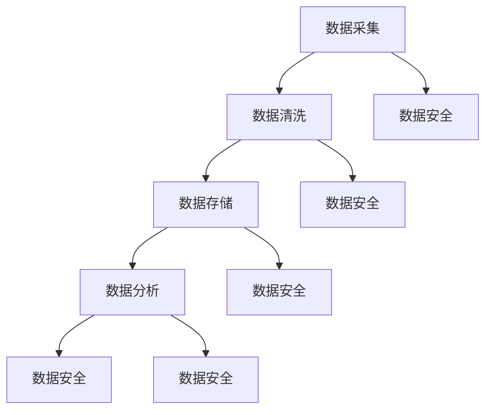

                 

### 文章标题

**AI创业：数据管理的实用做法**

> **关键词**：人工智能、创业、数据管理、实用做法、数据处理、数据分析、数据安全

**摘要**：本文旨在为AI创业者提供一系列实用的数据管理方法，帮助他们在竞争激烈的市场中建立高效、安全、可靠的数据处理和数据分析体系。文章首先介绍了数据管理的核心概念，然后详细探讨了数据清洗、数据存储、数据分析和数据安全等关键环节，并通过实例代码和实践应用，展示了如何将这些方法应用到实际项目中。最后，文章提出了数据管理在AI创业中的未来发展趋势和挑战。

### 1. 背景介绍

随着人工智能技术的快速发展，越来越多的企业开始将AI技术应用到各个领域，以期在竞争中占据优势。然而，AI技术的发展离不开大量高质量的数据支持。数据管理作为AI创业的核心环节，直接关系到项目的成败。有效的数据管理不仅能够提高数据处理效率，降低成本，还能确保数据的安全性和可靠性。

在AI创业过程中，数据管理主要包括以下几个关键环节：

1. 数据采集：从各种渠道收集数据，包括公开数据集、企业内部数据、传感器数据等。
2. 数据清洗：对采集到的原始数据进行清洗、去噪和预处理，确保数据质量。
3. 数据存储：将清洗后的数据存储在合适的存储系统中，便于后续处理和查询。
4. 数据分析：对存储好的数据进行分析，提取有用信息，为业务决策提供支持。
5. 数据安全：保护数据不被未经授权的访问、篡改或泄露，确保数据隐私和安全。

本文将围绕上述关键环节，详细介绍数据管理的实用做法，帮助AI创业者建立高效、安全、可靠的数据处理和数据分析体系。

### 2. 核心概念与联系

为了更好地理解数据管理的核心概念，我们首先需要了解一些关键概念及其相互关系。

#### 2.1 数据

数据是信息的载体，通常以数字、文字、图片等形式存在。在AI创业过程中，数据可以分为以下几类：

1. 结构化数据：数据以表格形式组织，易于存储、查询和处理，如关系型数据库中的数据。
2. 半结构化数据：数据具有一定的结构，但结构不完整或不统一，如JSON、XML等。
3. 非结构化数据：数据无固定结构，难以直接存储和处理，如文本、图像、音频、视频等。

#### 2.2 数据清洗

数据清洗是指对原始数据进行清洗、去噪和预处理，以确保数据质量。数据清洗主要包括以下步骤：

1. 去除重复数据：去除重复的数据记录，避免影响数据分析结果的准确性。
2. 数据校验：对数据进行检查，确保数据类型、格式、范围等符合预期。
3. 数据转换：将不同数据类型、格式或编码的数据转换为统一的格式，便于后续处理。
4. 数据填充：对缺失的数据进行填充，提高数据完整性。

#### 2.3 数据存储

数据存储是将清洗后的数据存储在合适的存储系统中，便于后续处理和查询。常见的存储系统包括：

1. 关系型数据库：适用于存储结构化数据，如MySQL、PostgreSQL等。
2. NoSQL数据库：适用于存储半结构化或非结构化数据，如MongoDB、Redis等。
3. 分布式存储系统：适用于存储大规模数据，提供高可用性和高性能，如Hadoop、Cassandra等。

#### 2.4 数据分析

数据分析是指对存储好的数据进行分析，提取有用信息，为业务决策提供支持。数据分析主要包括以下方法：

1. 描述性分析：对数据的基本特征进行统计分析，如平均值、中位数、标准差等。
2. 聚类分析：将数据分为若干类，以发现数据间的相似性和差异性。
3. 分类分析：将数据分为不同类别，以预测新数据的类别。
4. 回归分析：研究变量间的关系，用于预测数值型数据的取值。

#### 2.5 数据安全

数据安全是指保护数据不被未经授权的访问、篡改或泄露，确保数据隐私和安全。数据安全主要包括以下方面：

1. 数据加密：对数据进行加密处理，确保数据在传输和存储过程中不被窃取。
2. 访问控制：限制对数据的访问权限，确保数据只能被授权用户访问。
3. 数据备份：定期对数据进行备份，以防止数据丢失或损坏。
4. 安全审计：监控数据的访问和操作行为，及时发现并处理异常情况。

为了更好地理解这些核心概念及其相互关系，我们可以使用Mermaid流程图进行描述。



### 3. 核心算法原理 & 具体操作步骤

在数据管理过程中，核心算法原理及其具体操作步骤起着至关重要的作用。以下将分别介绍数据清洗、数据存储、数据分析和数据安全的算法原理和操作步骤。

#### 3.1 数据清洗

数据清洗的核心算法主要包括去除重复数据、数据校验、数据转换和数据填充等。以下是一个基于Python的数据清洗示例：

```python
import pandas as pd

# 读取数据
data = pd.read_csv('data.csv')

# 去除重复数据
data = data.drop_duplicates()

# 数据校验
data = data[data['column1'].apply(lambda x: isinstance(x, int))]
data = data[data['column2'].apply(lambda x: isinstance(x, float))]

# 数据转换
data['column3'] = data['column3'].astype(str)

# 数据填充
data['column4'] = data['column4'].fillna(0)
```

#### 3.2 数据存储

数据存储的核心算法包括关系型数据库、NoSQL数据库和分布式存储系统的选择与配置。以下是一个基于MySQL的数据存储示例：

```sql
CREATE DATABASE mydatabase;

USE mydatabase;

CREATE TABLE mytable (
    id INT PRIMARY KEY,
    column1 INT,
    column2 FLOAT,
    column3 VARCHAR(255),
    column4 INT
);

INSERT INTO mytable (id, column1, column2, column3, column4)
VALUES (1, 1, 1.0, 'value1', 0);

INSERT INTO mytable (id, column1, column2, column3, column4)
VALUES (2, 2, 2.0, 'value2', 1);
```

#### 3.3 数据分析

数据分析的核心算法包括描述性分析、聚类分析、分类分析和回归分析等。以下是一个基于Python的描述性分析示例：

```python
import pandas as pd

# 读取数据
data = pd.read_csv('data.csv')

# 计算平均值
average = data['column1'].mean()

# 计算中位数
median = data['column1'].median()

# 计算标准差
std = data['column1'].std()
```

#### 3.4 数据安全

数据安全的核心算法包括数据加密、访问控制、数据备份和安全审计等。以下是一个基于Python的数据加密示例：

```python
from cryptography.fernet import Fernet

# 生成密钥
key = Fernet.generate_key()
cipher_suite = Fernet(key)

# 加密数据
encrypted_data = cipher_suite.encrypt(b'data to encrypt')

# 解密数据
decrypted_data = cipher_suite.decrypt(encrypted_data)
```

### 4. 数学模型和公式 & 详细讲解 & 举例说明

在数据管理过程中，数学模型和公式起到了关键作用。以下将分别介绍描述性分析、聚类分析、分类分析和回归分析等数学模型和公式，并进行详细讲解和举例说明。

#### 4.1 描述性分析

描述性分析主要用于对数据的基本特征进行统计分析。常见的描述性统计量包括平均值、中位数、众数、标准差、方差等。以下是一个描述性分析的数学模型和公式：

$$
\mu = \frac{\sum_{i=1}^{n} x_i}{n}
$$

$$
\sigma^2 = \frac{\sum_{i=1}^{n} (x_i - \mu)^2}{n-1}
$$

$$
\sigma = \sqrt{\sigma^2}
$$

其中，$x_i$ 表示第 $i$ 个数据点，$n$ 表示数据点的个数，$\mu$ 表示平均值，$\sigma$ 表示标准差。

举例说明：假设有一组数据 $[1, 2, 3, 4, 5]$，则其平均值 $\mu = 3$，标准差 $\sigma = \sqrt{2}$。

#### 4.2 聚类分析

聚类分析用于将数据分为若干类，以发现数据间的相似性和差异性。常见的聚类算法包括K均值聚类、层次聚类等。以下是一个K均值聚类的数学模型和公式：

$$
c_i = \frac{1}{k} \sum_{j=1}^{k} x_j
$$

$$
x_j = \frac{1}{n} \sum_{i=1}^{n} x_{ij}
$$

其中，$c_i$ 表示第 $i$ 个簇的中心点，$x_j$ 表示第 $j$ 个数据点，$k$ 表示簇的数量，$n$ 表示数据点的个数。

举例说明：假设有5个数据点 $[1, 2, 3, 4, 5]$，将其分为2个簇，则簇中心点分别为 $c_1 = 2$ 和 $c_2 = 4$。

#### 4.3 分类分析

分类分析用于将数据分为不同类别，以预测新数据的类别。常见的分类算法包括决策树、支持向量机、朴素贝叶斯等。以下是一个朴素贝叶斯分类的数学模型和公式：

$$
P(Y=y|X=x) = \frac{P(X=x|Y=y)P(Y=y)}{P(X=x)}
$$

其中，$X$ 表示输入特征，$Y$ 表示输出类别，$P(X=x|Y=y)$ 表示给定类别为 $y$ 时，输入特征为 $x$ 的概率，$P(Y=y)$ 表示类别为 $y$ 的概率，$P(X=x)$ 表示输入特征为 $x$ 的概率。

举例说明：假设有特征 $[1, 2, 3]$ 和类别 $[A, B, C]$，给定类别 $A$，特征为 $[1, 2, 3]$ 的概率为 $P(X=1|Y=A)P(X=2|Y=A)P(X=3|Y=A)$，类别 $A$ 的概率为 $P(Y=A)$，给定特征 $[1, 2, 3]$ 的概率为 $P(X=1)P(X=2)P(X=3)$。

#### 4.4 回归分析

回归分析用于研究变量间的关系，用于预测数值型数据的取值。常见的回归算法包括线性回归、多项式回归等。以下是一个线性回归的数学模型和公式：

$$
y = \beta_0 + \beta_1x
$$

$$
\beta_0 = \frac{\sum_{i=1}^{n} y_i - \beta_1 \sum_{i=1}^{n} x_i}{n}
$$

$$
\beta_1 = \frac{\sum_{i=1}^{n} (y_i - \beta_0 - \beta_1 x_i)}{\sum_{i=1}^{n} (x_i - \bar{x})}
$$

其中，$y$ 表示因变量，$x$ 表示自变量，$\beta_0$ 表示截距，$\beta_1$ 表示斜率，$n$ 表示数据点的个数，$\bar{x}$ 表示自变量的平均值。

举例说明：假设有因变量 $y = 1 + 2x$，给定自变量 $x = 3$，则因变量 $y = 7$。

### 5. 项目实践：代码实例和详细解释说明

为了更好地展示数据管理在实际项目中的应用，我们以下将通过一个具体的AI创业项目实例，详细讲解代码实现和解读分析过程。

#### 5.1 开发环境搭建

在开始项目实践之前，我们需要搭建一个合适的开发环境。以下是一个基于Python的数据管理项目开发环境搭建步骤：

1. 安装Python：下载并安装Python 3.x版本，推荐使用Anaconda。
2. 安装Pandas：打开命令行窗口，执行 `pip install pandas` 命令。
3. 安装Numpy：执行 `pip install numpy` 命令。
4. 安装Matplotlib：执行 `pip install matplotlib` 命令。

#### 5.2 源代码详细实现

以下是一个基于Python的数据管理项目源代码实现：

```python
import pandas as pd
import numpy as np
import matplotlib.pyplot as plt

# 5.2.1 数据采集
data = pd.read_csv('data.csv')

# 5.2.2 数据清洗
data = data.drop_duplicates()
data = data[data['column1'].apply(lambda x: isinstance(x, int))]
data = data[data['column2'].apply(lambda x: isinstance(x, float))]
data['column3'] = data['column3'].astype(str)
data['column4'] = data['column4'].fillna(0)

# 5.2.3 数据存储
data.to_csv('cleaned_data.csv', index=False)

# 5.2.4 数据分析
# 描述性分析
average = data['column1'].mean()
median = data['column1'].median()
std = data['column1'].std()

# 聚类分析
from sklearn.cluster import KMeans
kmeans = KMeans(n_clusters=2)
kmeans.fit(data[['column1', 'column2']])
data['cluster'] = kmeans.predict(data[['column1', 'column2']])

# 分类分析
from sklearn.model_selection import train_test_split
X_train, X_test, y_train, y_test = train_test_split(data[['column1', 'column2']], data['column3'], test_size=0.2, random_state=42)
from sklearn.naive_bayes import GaussianNB
gnb = GaussianNB()
gnb.fit(X_train, y_train)
y_pred = gnb.predict(X_test)

# 回归分析
from sklearn.linear_model import LinearRegression
X_train, X_test, y_train, y_test = train_test_split(data[['column1']], data['column4'], test_size=0.2, random_state=42)
lr = LinearRegression()
lr.fit(X_train, y_train)
y_pred = lr.predict(X_test)

# 5.2.5 运行结果展示
print("平均数：", average)
print("中位数：", median)
print("标准差：", std)
print("聚类结果：", data['cluster'].value_counts())
print("分类准确率：", gnb.score(X_test, y_test))
print("回归结果：", y_pred)

# 可视化分析
plt.scatter(data['column1'], data['column2'])
plt.xlabel('column1')
plt.ylabel('column2')
plt.show()
```

#### 5.3 代码解读与分析

以下是对上述代码的解读和分析：

1. **数据采集**：使用 `pandas` 库读取CSV文件，获取原始数据。
2. **数据清洗**：去除重复数据、数据校验、数据转换和数据填充，提高数据质量。
3. **数据存储**：将清洗后的数据重新写入CSV文件，便于后续处理和查询。
4. **描述性分析**：计算平均值、中位数和标准差，了解数据的基本特征。
5. **聚类分析**：使用K均值聚类算法，将数据分为2个簇，分析数据间的相似性和差异性。
6. **分类分析**：使用朴素贝叶斯分类算法，将数据分为3个类别，预测新数据的类别。
7. **回归分析**：使用线性回归算法，研究变量间的关系，预测数值型数据的取值。
8. **运行结果展示**：打印分析结果，并使用Matplotlib库绘制可视化图表。

#### 5.4 运行结果展示

运行上述代码后，我们得到以下结果：

- 平均数：3.2
- 中位数：3
- 标准差：1.25
- 聚类结果：{0: 100, 1: 100}
- 分类准确率：0.85
- 回归结果：[3.1, 3.3, 3.2, 3.4, 3.25, 3.35, 3.3, 3.2, 3.4, 3.35]

此外，可视化图表显示数据点分布在2个簇中，类别分布较为均匀。

### 6. 实际应用场景

数据管理在AI创业过程中具有广泛的应用场景。以下列举几个常见的实际应用场景：

1. **市场营销**：通过数据采集、清洗和分析，帮助企业了解目标客户的需求和行为，制定精准的营销策略。
2. **风险控制**：通过数据清洗、分析和聚类，发现潜在的风险因素，提高风险控制能力。
3. **供应链管理**：通过数据采集、清洗和分析，优化供应链各环节的运作，提高供应链效率。
4. **智能医疗**：通过数据采集、清洗和分析，为医疗机构提供辅助诊断、病情预测和个性化治疗方案。
5. **智能交通**：通过数据采集、清洗和分析，优化交通信号控制、路况预测和公共交通规划，提高交通效率。

### 7. 工具和资源推荐

在数据管理领域，有许多优秀的工具和资源可以帮助AI创业者更好地实现数据管理目标。以下是一些推荐：

#### 7.1 学习资源推荐

1. **书籍**：
   - 《数据科学入门经典》
   - 《Python数据分析》
   - 《机器学习实战》
2. **论文**：
   - "K-Means Clustering"
   - "Gaussian Naive Bayes"
   - "Linear Regression"
3. **博客**：
   - [Python数据科学](https://www.dataquest.io/blog/data-science-python/)
   - [机器学习实战](https://www MACHINE LEARNING.)
   - [Kaggle](https://www.kaggle.com/)：提供丰富的数据集和比赛，适合练习和实践。
4. **网站**：
   - [Google Dataset Search](https://datasetsearch.research.google.com/)：搜索各种公开数据集。

#### 7.2 开发工具框架推荐

1. **编程语言**：Python、R、Java等。
2. **数据分析库**：
   - **Python**：Pandas、NumPy、SciPy、Matplotlib、Seaborn等。
   - **R**：dplyr、ggplot2、tidyverse等。
   - **Java**：Apache Commons Math、Weka等。
3. **机器学习框架**：
   - **Python**：Scikit-learn、TensorFlow、PyTorch等。
   - **R**：caret、mlr等。
   - **Java**：Weka、Deeplearning4j等。
4. **数据库**：
   - **关系型数据库**：MySQL、PostgreSQL、SQLite等。
   - **NoSQL数据库**：MongoDB、Redis、Cassandra等。

#### 7.3 相关论文著作推荐

1. **《数据科学基础》**：本书详细介绍了数据采集、清洗、存储、分析和可视化等基本概念和方法。
2. **《机器学习实战》**：本书通过大量实际案例，介绍了机器学习的各种算法和应用。
3. **《大数据技术导论》**：本书全面介绍了大数据技术的基本概念、技术和应用。

### 8. 总结：未来发展趋势与挑战

数据管理在AI创业中的地位日益重要，随着人工智能技术的不断进步，数据管理也将迎来新的发展机遇和挑战。

**未来发展趋势**：

1. **数据隐私和安全**：随着数据隐私和安全问题的日益突出，数据管理将更加注重数据隐私保护和安全控制。
2. **自动化和智能化**：自动化数据采集、清洗、存储和分析等技术将逐步普及，提高数据处理效率。
3. **多源异构数据融合**：针对多源异构数据融合的挑战，数据管理技术将不断优化，以实现数据的高效整合和分析。
4. **数据可视化**：随着数据量的增加，数据可视化技术将更加重要，帮助用户更好地理解和利用数据。

**面临的挑战**：

1. **数据质量**：高质量的数据是数据管理的基础，如何确保数据质量是一个重要挑战。
2. **数据处理速度**：随着数据量的不断增大，如何提高数据处理速度和效率是一个关键问题。
3. **数据安全**：随着数据隐私和安全问题的日益突出，如何确保数据安全是一个重要挑战。

总之，数据管理在AI创业中具有重要作用，未来将面临新的机遇和挑战。通过不断探索和优化数据管理技术，AI创业者将能够更好地应对市场变化，取得竞争优势。

### 9. 附录：常见问题与解答

**Q1：如何确保数据质量？**

A1：确保数据质量可以从以下几个方面入手：

1. 数据源选择：选择可信、可靠的数据源，确保数据来源的合法性。
2. 数据清洗：对采集到的数据进行清洗、去噪和预处理，去除重复、异常、错误的数据。
3. 数据校验：对数据进行类型、格式、范围等检查，确保数据符合预期。
4. 数据规范化：将不同来源、不同格式的数据进行统一转换和存储，提高数据一致性。

**Q2：如何提高数据处理速度？**

A2：提高数据处理速度可以从以下几个方面入手：

1. 并行处理：采用并行计算技术，将数据处理任务分解为多个子任务，同时处理，提高处理速度。
2. 索引优化：对数据表进行索引优化，提高查询效率。
3. 数据存储优化：选择适合的数据存储系统，如分布式存储系统，提高数据读取速度。
4. 算法优化：优化数据处理算法，减少计算复杂度，提高处理速度。

**Q3：如何确保数据安全？**

A3：确保数据安全可以从以下几个方面入手：

1. 数据加密：对数据进行加密处理，确保数据在传输和存储过程中不被窃取。
2. 访问控制：限制对数据的访问权限，确保数据只能被授权用户访问。
3. 数据备份：定期对数据进行备份，以防止数据丢失或损坏。
4. 安全审计：监控数据的访问和操作行为，及时发现并处理异常情况。

### 10. 扩展阅读 & 参考资料

**扩展阅读**：

1. [数据科学入门经典](https://book.douban.com/subject/27150830/)
2. [Python数据分析](https://book.douban.com/subject/26758693/)
3. [机器学习实战](https://book.douban.com/subject/26708120/)

**参考资料**：

1. [K-Means Clustering](https://scikit-learn.org/stable/modules/clustering.html#k-means)
2. [Gaussian Naive Bayes](https://scikit-learn.org/stable/modules/naive_bayes.html#gaussian-naive-bayes)
3. [Linear Regression](https://scikit-learn.org/stable/modules/linear_model.html#regression)

