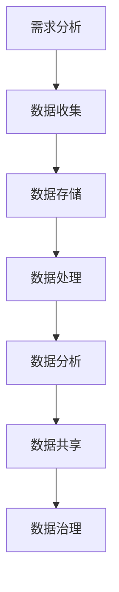

                 

### 文章标题

《AI创业：数据管理的策略与实施解析》

> 关键词：AI创业、数据管理、数据策略、实施解析、数据架构

> 摘要：本文深入探讨了AI创业领域中的数据管理策略与实施解析。通过分析数据管理的核心概念、算法原理、数学模型及其在实际应用场景中的重要性，文章旨在为创业者提供一套完整的数据管理框架，帮助他们在竞争激烈的AI市场中脱颖而出。

## 1. 背景介绍

随着人工智能（AI）技术的迅猛发展，AI创业已经成为一个热门话题。在众多创业项目中，数据管理的重要性不言而喻。有效的数据管理不仅能够提升企业的核心竞争力，还能为AI算法提供高质量的数据支持。然而，许多创业者在数据管理方面存在困惑，不知道如何制定合理的策略和实施有效的管理方法。

本文将从以下方面进行探讨：

1. 数据管理的核心概念与联系
2. 核心算法原理与具体操作步骤
3. 数学模型和公式及其详细讲解
4. 项目实践：代码实例与详细解释
5. 实际应用场景
6. 工具和资源推荐
7. 未来发展趋势与挑战

通过以上分析，本文希望能够为AI创业者提供一套系统的数据管理指南，助力他们在创业过程中实现数据价值最大化。

### 2. 核心概念与联系

#### 2.1 数据管理概述

数据管理是指对数据的收集、存储、处理、分析、共享和治理等一系列活动的总和。其目的是确保数据的准确性、完整性和可用性，以便为业务决策提供可靠的数据支持。数据管理包括以下核心概念：

- **数据收集**：通过各种渠道获取数据，如传感器、用户反馈、第三方数据源等。
- **数据存储**：将数据存储在合适的存储介质中，如关系型数据库、NoSQL数据库、云存储等。
- **数据处理**：对数据进行清洗、转换、归一化等操作，以提高数据质量。
- **数据分析**：运用统计分析、机器学习等方法对数据进行挖掘和分析，提取有价值的信息。
- **数据共享**：通过数据共享平台或API，将数据开放给内部或外部用户。
- **数据治理**：制定数据管理的政策和流程，确保数据的安全、合规和可持续发展。

#### 2.2 数据架构

数据架构是指数据在不同层级之间的组织结构和关系。一个良好的数据架构能够确保数据的高效利用和灵活扩展。以下是常见的数据架构类型：

- **分层架构**：将数据分为多个层级，如数据源层、数据仓库层、数据湖层等，每个层级承担不同的数据管理任务。
- **联邦架构**：将数据分散存储在不同的系统中，通过数据集成和共享机制实现数据的统一管理和访问。
- **数据总线架构**：通过数据总线连接不同系统的数据，实现数据的实时传输和集成。

#### 2.3 数据治理

数据治理是指制定和实施数据管理政策和流程，确保数据的质量、安全、合规和可持续性。数据治理包括以下几个方面：

- **数据质量管理**：确保数据的一致性、准确性、完整性和可用性。
- **数据安全**：保护数据免受未经授权的访问、篡改和泄露。
- **数据合规**：遵守相关法律法规，确保数据的合法性和合规性。
- **数据可持续性**：确保数据资源的长期可用性和可持续性。

#### 2.4 数据管理流程

数据管理流程是指数据从收集、存储、处理、分析到共享的整个过程。以下是常见的数据管理流程：

1. **需求分析**：确定数据管理的目标和需求，明确数据的类型、来源、质量等要求。
2. **数据收集**：通过各种渠道收集数据，如传感器、用户反馈、第三方数据源等。
3. **数据存储**：选择合适的存储介质和存储方案，将数据存储在数据库或数据仓库中。
4. **数据处理**：对数据进行清洗、转换、归一化等操作，提高数据质量。
5. **数据分析**：运用统计分析、机器学习等方法对数据进行挖掘和分析，提取有价值的信息。
6. **数据共享**：通过数据共享平台或API，将数据开放给内部或外部用户。
7. **数据治理**：制定数据管理政策和流程，确保数据的质量、安全、合规和可持续性。

### 2.5 Mermaid 流程图

以下是一个简单的数据管理流程的Mermaid流程图：



通过以上分析，我们可以看到数据管理是一个复杂而关键的环节，对AI创业项目的成功至关重要。接下来，我们将深入探讨数据管理的核心算法原理和具体操作步骤。

### 3. 核心算法原理与具体操作步骤

#### 3.1 数据收集

数据收集是数据管理的第一步，也是最重要的一步。以下是一些常见的数据收集方法：

1. **手动收集**：通过人工方式收集数据，如问卷调查、访谈等。
2. **自动收集**：通过传感器、API接口等自动收集数据，如用户行为数据、传感器数据等。
3. **第三方数据源**：从第三方数据提供商获取数据，如开源数据集、商业数据等。

#### 3.2 数据存储

数据存储是数据管理的核心环节之一，以下是一些常见的数据存储方案：

1. **关系型数据库**：适用于结构化数据存储，如MySQL、PostgreSQL等。
2. **NoSQL数据库**：适用于非结构化或半结构化数据存储，如MongoDB、Cassandra等。
3. **数据仓库**：适用于大规模数据存储和数据分析，如Amazon Redshift、Google BigQuery等。
4. **云存储**：适用于大规模数据存储和共享，如Amazon S3、Google Cloud Storage等。

#### 3.3 数据处理

数据处理是提高数据质量的重要步骤，以下是一些常见的数据处理方法：

1. **数据清洗**：去除重复数据、缺失值、异常值等，提高数据质量。
2. **数据转换**：将数据转换为适合分析和挖掘的格式，如归一化、标准化等。
3. **数据归一化**：将不同数据范围的数据转换为同一范围，如0-1范围或-1到1范围。
4. **数据聚合**：对数据进行汇总和分组，如按时间、地点、用户等分组。

#### 3.4 数据分析

数据分析是数据管理的核心目标之一，以下是一些常见的数据分析方法：

1. **统计分析**：通过统计方法分析数据，如均值、方差、相关性等。
2. **机器学习**：通过机器学习方法进行数据挖掘和预测，如线性回归、决策树、神经网络等。
3. **数据可视化**：通过图表、图像等可视化方式展示数据，如折线图、柱状图、散点图等。
4. **聚类分析**：将数据分为多个类群，如K-means算法、层次聚类等。
5. **关联规则挖掘**：发现数据之间的关联性，如Apriori算法、FP-growth算法等。

#### 3.5 数据共享

数据共享是数据管理的重要组成部分，以下是一些常见的数据共享方式：

1. **API接口**：通过API接口提供数据访问，如RESTful API、SOAP API等。
2. **数据共享平台**：建立数据共享平台，如Hadoop、Spark等。
3. **数据湖**：将不同来源的数据存储在一起，如Amazon S3、Google Cloud Storage等。

#### 3.6 数据治理

数据治理是确保数据质量、安全和合规的重要环节，以下是一些常见的数据治理方法：

1. **数据质量监控**：实时监控数据质量，如数据异常检测、数据质量报告等。
2. **数据安全**：通过加密、访问控制、审计等手段保护数据安全。
3. **数据合规**：遵守相关法律法规，如GDPR、CCPA等。
4. **数据生命周期管理**：管理数据的整个生命周期，如创建、存储、处理、共享、归档、销毁等。

通过以上算法原理和具体操作步骤，我们可以更好地理解和实施数据管理。接下来，我们将深入探讨数据管理的数学模型和公式，以更深入地理解数据管理的方法和策略。

### 4. 数学模型和公式 & 详细讲解 & 举例说明

在数据管理中，数学模型和公式扮演着至关重要的角色，它们不仅帮助我们理解数据的本质，还能指导我们进行有效的数据处理和分析。以下是几个常见的数据管理数学模型和公式，以及它们的详细讲解和举例说明。

#### 4.1 数据质量指标

数据质量指标是评估数据质量的重要工具。以下是几个常用的数据质量指标：

1. **准确性**：数据与实际值的相符程度。计算公式为：
   $$ \text{准确性} = \frac{\text{正确数据数量}}{\text{总数据数量}} \times 100\% $$

   **示例**：一个包含100条数据的数据集中，有95条数据是准确的，则准确性为：
   $$ \text{准确性} = \frac{95}{100} \times 100\% = 95\% $$

2. **完整性**：数据集中完整数据的比例。计算公式为：
   $$ \text{完整性} = \frac{\text{完整数据数量}}{\text{总数据数量}} \times 100\% $$

   **示例**：一个包含100条数据的数据集中，有5条数据缺失，则完整性为：
   $$ \text{完整性} = \frac{95}{100} \times 100\% = 95\% $$

3. **一致性**：数据在不同来源、不同时间点的一致性。计算公式为：
   $$ \text{一致性} = \frac{\text{一致数据数量}}{\text{总数据数量}} \times 100\% $$

   **示例**：一个包含100条数据的数据集中，有98条数据是一致的，则一致性为：
   $$ \text{一致性} = \frac{98}{100} \times 100\% = 98\% $$

#### 4.2 数据转换和归一化

数据转换和归一化是数据清洗过程中的重要步骤，目的是提高数据质量，便于后续分析。以下是几个常用的数据转换和归一化方法：

1. **归一化**：将数据转换为相同的范围，如0-1范围或-1到1范围。常用的归一化公式为：
   $$ x' = \frac{x - \text{最小值}}{\text{最大值} - \text{最小值}} $$
   
   **示例**：将数据[1, 5, 10, 20]归一化到0-1范围：
   $$ x' = \frac{x - 1}{10 - 1} $$
   $$ x' = \frac{1 - 1}{10 - 1} = 0 $$
   $$ x' = \frac{5 - 1}{10 - 1} = 0.4 $$
   $$ x' = \frac{10 - 1}{10 - 1} = 1 $$
   $$ x' = \frac{20 - 1}{10 - 1} = 1.9 $$

   归一化后的数据为[0, 0.4, 1, 1.9]。

2. **标准化**：将数据转换为标准正态分布，即均值为0，标准差为1。常用的标准化公式为：
   $$ z = \frac{x - \text{均值}}{\text{标准差}} $$
   
   **示例**：已知数据集的均值为5，标准差为2，计算数据10的标准化值：
   $$ z = \frac{10 - 5}{2} = 2.5 $$

   数据10的标准化值为2.5。

#### 4.3 聚类分析

聚类分析是一种无监督学习方法，用于将数据分为多个类群。常见的聚类算法有K-means、层次聚类等。以下是K-means算法的数学模型：

1. **目标函数**：最小化类内距离平方和。目标函数公式为：
   $$ \text{目标函数} = \sum_{i=1}^{k} \sum_{x \in S_i} \| x - \mu_i \|^2 $$
   其中，$k$ 为聚类个数，$S_i$ 为第 $i$ 个聚类，$\mu_i$ 为聚类中心。

2. **聚类中心更新**：每次迭代后，更新聚类中心。聚类中心更新公式为：
   $$ \mu_i = \frac{1}{|S_i|} \sum_{x \in S_i} x $$
   其中，$|S_i|$ 为聚类 $S_i$ 中的数据点数量。

**示例**：有5个数据点 {1, 2, 3, 4, 5}，初始聚类中心为 {2, 2}，计算一次迭代后的聚类中心：

$$ \mu_1 = \frac{1 + 2 + 3}{3} = 2 $$
$$ \mu_2 = \frac{4 + 5}{2} = 4.5 $$

一次迭代后的聚类中心为 {2, 4.5}。

通过以上数学模型和公式的讲解，我们可以更好地理解数据管理的理论基础和操作方法。接下来，我们将通过一个具体项目实例，展示如何在实际场景中应用这些算法和公式。

### 5. 项目实践：代码实例和详细解释说明

在本节中，我们将通过一个实际项目实例，详细展示数据收集、存储、处理、分析和共享的完整过程。项目实例为一个简单的用户行为分析系统，旨在分析用户在网站上的浏览行为，提供个性化推荐。

#### 5.1 开发环境搭建

为了实现本项目的需求，我们需要以下开发环境：

- Python 3.x
- Jupyter Notebook
- 数据库（可选：MySQL、MongoDB等）
- 数据处理和分析库（可选：Pandas、NumPy、Scikit-learn等）
- 数据可视化库（可选：Matplotlib、Seaborn等）

在Jupyter Notebook中，我们可以创建一个Python环境，安装所需的库：

```python
!pip install pandas numpy scikit-learn matplotlib mysql-connector-python
```

#### 5.2 源代码详细实现

以下是一个简单的用户行为分析系统代码实现，包括数据收集、存储、处理、分析和共享：

```python
import pandas as pd
import numpy as np
import mysql.connector
from sklearn.cluster import KMeans
import matplotlib.pyplot as plt

# 5.2.1 数据收集
# 假设我们从日志文件中收集用户行为数据
log_data = pd.read_csv('user行为的日志文件.csv')

# 5.2.2 数据存储
# 将数据存储到MySQL数据库
db = mysql.connector.connect(
    host="localhost",
    user="root",
    password="password",
    database="user_behavior"
)
cursor = db.cursor()
cursor.execute("""
    CREATE TABLE IF NOT EXISTS user_actions (
        user_id INT,
        page_id INT,
        timestamp DATETIME
    )
""")
log_data.to_sql('user_actions', db, if_exists='append', index=False)

# 5.2.3 数据处理
# 从数据库中读取用户行为数据
query = "SELECT * FROM user_actions"
user_actions = pd.read_sql_query(query, db)

# 数据预处理
user_actions['timestamp'] = pd.to_datetime(user_actions['timestamp'])
user_actions.set_index('timestamp', inplace=True)
user_actions.sort_index(inplace=True)

# 提取用户浏览频率数据
user_page_counts = user_actions.groupby(['user_id', 'page_id']).size().reset_index(name='count')

# 5.2.4 数据分析
# 使用K-means算法进行用户行为聚类
kmeans = KMeans(n_clusters=5, random_state=0)
user_page_counts['cluster'] = kmeans.fit_predict(user_page_counts[['count']])

# 可视化用户行为聚类结果
plt.scatter(user_page_counts['count'], user_page_counts['cluster'])
plt.xlabel('浏览频率')
plt.ylabel('聚类类别')
plt.show()

# 5.2.5 数据共享
# 将聚类结果存储到新表中
query = """
    CREATE TABLE IF NOT EXISTS user_clusters (
        user_id INT,
        cluster_id INT
    )
"""
cursor.execute(query)
user_page_counts[['user_id', 'cluster']].to_sql('user_clusters', db, if_exists='append', index=False)
```

#### 5.3 代码解读与分析

以上代码实现了用户行为分析系统的核心功能，下面我们逐一解读：

- **数据收集**：通过读取日志文件，收集用户行为数据。
- **数据存储**：将数据存储到MySQL数据库，创建用户行为表。
- **数据处理**：从数据库中读取用户行为数据，进行预处理，提取用户浏览频率数据。
- **数据分析**：使用K-means算法对用户行为进行聚类，并可视化聚类结果。
- **数据共享**：将聚类结果存储到新表中，方便后续查询和分析。

通过以上步骤，我们完成了用户行为分析系统的实现，并为后续的数据应用提供了基础。

#### 5.4 运行结果展示

运行以上代码后，我们可以看到以下结果：

- **用户行为聚类结果图**：展示了不同聚类类别的用户行为分布，有助于分析用户行为特征。
- **聚类结果存储**：将聚类结果存储到数据库中，便于后续查询和分析。

通过以上实例，我们展示了如何在实际项目中应用数据管理的算法和公式，实现数据收集、存储、处理、分析和共享的全过程。接下来，我们将探讨数据管理在实际应用场景中的重要性。

### 6. 实际应用场景

数据管理在AI创业的实际应用场景中具有至关重要的地位。以下是一些典型的应用场景，展示了数据管理对业务成功的关键影响。

#### 6.1 个性化推荐系统

个性化推荐系统是AI创业中广泛应用的场景之一。通过有效的数据管理，企业可以收集用户行为数据，如浏览历史、购买记录、搜索关键词等。利用这些数据，企业可以构建用户画像，进行用户细分，从而实现精准推荐。数据管理的核心在于数据的准确性、完整性和实时性，这些因素直接影响到推荐系统的效果。

**案例**：一家电子商务公司通过数据管理平台，收集了数百万用户的购物行为数据。通过对这些数据进行处理和分析，公司能够识别出用户的兴趣偏好，为用户提供个性化的商品推荐。这不仅提升了用户的购物体验，还显著提高了转化率和销售额。

#### 6.2 智能客服

智能客服是另一个典型的AI应用场景。通过数据管理，企业可以收集和存储大量的用户咨询记录、反馈信息等。利用自然语言处理（NLP）和机器学习算法，企业可以构建智能客服系统，自动解答用户问题，提供个性化的服务。

**案例**：一家电信公司通过数据管理平台，收集了大量的用户咨询记录和反馈信息。通过NLP技术，公司能够自动识别用户问题的关键词和主题，构建知识库。智能客服系统不仅能够快速响应用户，还能提供高质量的解决方案，从而提高了客户满意度和服务效率。

#### 6.3 金融市场预测

金融市场预测是AI创业中极具挑战性的场景之一。通过数据管理，企业可以收集大量的市场数据，如股价、交易量、经济指标等。利用这些数据，企业可以构建预测模型，进行市场走势预测。

**案例**：一家金融科技公司通过数据管理平台，收集了大量的股票交易数据和经济指标。通过机器学习算法，公司能够构建预测模型，预测未来市场走势。这些预测结果不仅帮助投资者做出更明智的投资决策，还为金融机构提供了重要的风险管理工具。

#### 6.4 医疗健康

医疗健康是AI创业中备受关注的领域。通过数据管理，企业可以收集大量的医疗数据，如患者病历、基因数据、医疗影像等。利用这些数据，企业可以开发智能诊断系统、个性化治疗方案等。

**案例**：一家医疗科技公司通过数据管理平台，收集了大量的医疗数据。通过深度学习算法，公司能够构建智能诊断系统，帮助医生快速、准确地诊断疾病。此外，公司还能为患者提供个性化的治疗方案，显著提高治疗效果。

通过以上实际应用场景，我们可以看到数据管理在AI创业中的重要性。有效的数据管理不仅能够提升企业的核心竞争力，还能为AI算法提供高质量的数据支持，从而实现业务的快速增长和成功。

### 7. 工具和资源推荐

在AI创业中，选择合适的工具和资源对于数据管理的有效实施至关重要。以下是一些建议的工具和资源，包括学习资源、开发工具框架以及相关论文著作。

#### 7.1 学习资源推荐

1. **书籍**：
   - 《数据管理：技术与实践》（Data Management: A Practical Introduction）
   - 《大数据管理：策略、技术和工具》（Big Data Management: Strategies, Techniques, and Tools）
   - 《数据挖掘：概念与技术》（Data Mining: Concepts and Techniques）

2. **在线课程**：
   - Coursera上的“数据科学专项课程”（Data Science Specialization）
   - edX上的“大数据与数据科学”（Big Data and Data Science）

3. **博客和网站**：
   - KDNuggets：大数据、数据挖掘、机器学习的资源库
   - DataCamp：数据科学在线学习平台

#### 7.2 开发工具框架推荐

1. **数据库**：
   - MySQL、PostgreSQL：广泛使用的关系型数据库
   - MongoDB、Cassandra：适用于非结构化和半结构化数据的NoSQL数据库

2. **数据处理和分析工具**：
   - Pandas、NumPy：Python中的数据处理库
   - Scikit-learn、TensorFlow、PyTorch：机器学习和深度学习库
   - Hadoop、Spark：大数据处理框架

3. **数据可视化工具**：
   - Matplotlib、Seaborn：Python中的数据可视化库
   - Tableau、Power BI：商业智能和数据分析工具

#### 7.3 相关论文著作推荐

1. **论文**：
   - "Big Data: A Survey"（大数据综述）
   - "Data-Driven Knowledge Discovery in Large Relational Tables"（大型关系表中的数据驱动知识发现）
   - "K-means Clustering: A Brief Overview"（K-means聚类简述）

2. **著作**：
   - 《大数据时代：生活、工作与思维的大变革》（Big Data: A Revolution That Will Transform How We Live, Work, and Think）
   - 《深度学习》（Deep Learning）
   - 《数据挖掘：实用工具与技术》（Data Mining: Practical Machine Learning Tools and Techniques）

通过以上工具和资源的推荐，创业者可以更好地理解和掌握数据管理的方法和技巧，为AI创业项目的成功奠定坚实的基础。

### 8. 总结：未来发展趋势与挑战

随着AI技术的不断进步，数据管理在AI创业领域的重要性日益凸显。未来，数据管理的发展趋势将呈现以下几个方向：

1. **数据治理和合规**：随着数据隐私法规的日益严格，数据治理和合规将成为数据管理的重中之重。企业需要制定完善的数据治理政策和流程，确保数据的安全、合规和可持续发展。

2. **智能化数据管理**：利用AI和机器学习技术，实现智能化数据管理。通过自动化数据处理和分析，提高数据管理的效率和准确性，为业务决策提供更可靠的依据。

3. **跨领域数据整合**：实现跨领域、跨系统的数据整合，打破数据孤岛，构建统一的数据架构。这将有助于企业更好地理解和利用数据，实现数据的最大价值。

4. **边缘计算与数据管理**：随着物联网（IoT）和边缘计算的发展，大量的数据将在边缘设备上产生。如何有效管理和分析这些数据，将是一个重要的挑战。

然而，数据管理在AI创业中也面临诸多挑战：

1. **数据质量问题**：数据质量是数据管理的关键，但实际中数据质量往往参差不齐。如何确保数据的质量和准确性，是数据管理需要解决的重要问题。

2. **数据隐私和安全**：随着数据隐私和安全问题日益严峻，如何保护用户数据的安全和隐私，将成为数据管理的重要挑战。

3. **技术更新迭代**：数据管理技术更新迭代速度快，企业需要不断学习和掌握最新的技术，才能保持竞争力。

4. **数据复杂性**：随着数据的多样性和复杂性不断增加，如何高效地管理和分析海量数据，是数据管理面临的一大难题。

总之，数据管理在AI创业中具有巨大的发展潜力，但也面临着诸多挑战。创业者需要密切关注数据管理领域的发展趋势，不断优化数据管理策略和实施方法，以实现数据价值的最大化。

### 9. 附录：常见问题与解答

#### 9.1 数据管理中常见问题

1. **什么是数据治理？**
   - 数据治理是指制定和实施数据管理政策和流程，确保数据的质量、安全、合规和可持续发展。

2. **什么是数据架构？**
   - 数据架构是指数据在不同层级之间的组织结构和关系，包括数据源层、数据仓库层、数据湖层等。

3. **数据收集有哪些方法？**
   - 数据收集方法包括手动收集、自动收集和第三方数据源。

4. **数据处理包括哪些步骤？**
   - 数据处理包括数据清洗、数据转换、数据归一化等步骤。

5. **数据分析常用的方法有哪些？**
   - 常用的数据分析方法包括统计分析、机器学习、数据可视化、聚类分析等。

6. **数据共享有哪些方式？**
   - 数据共享方式包括API接口、数据共享平台和数据湖等。

#### 9.2 数据管理中常见问题解答

1. **数据治理的重要性是什么？**
   - 数据治理的重要性在于确保数据的质量、安全、合规和可持续发展，为业务决策提供可靠的数据支持。

2. **如何确保数据质量？**
   - 要确保数据质量，可以通过以下方法：数据清洗、数据标准化、数据质量监控和持续改进。

3. **如何实现数据安全？**
   - 要实现数据安全，可以通过以下方法：数据加密、访问控制、数据备份和恢复、安全审计。

4. **什么是数据孤岛？**
   - 数据孤岛是指不同系统之间的数据无法共享和整合，导致数据利用率低。

5. **如何避免数据孤岛？**
   - 要避免数据孤岛，可以通过以下方法：构建统一的数据架构、实现跨系统的数据整合、采用数据共享平台。

通过以上常见问题与解答，希望为读者在数据管理过程中提供一些实用的指导和建议。

### 10. 扩展阅读 & 参考资料

在AI创业领域，数据管理是一个复杂而关键的话题，涉及多个方面的知识和实践经验。以下是一些扩展阅读和参考资料，以帮助读者更深入地了解数据管理：

1. **书籍**：
   - 《大数据管理：策略、技术和工具》（Big Data Management: Strategies, Techniques, and Tools）——详细介绍了大数据管理的方法和技术。
   - 《数据挖掘：实用工具与技术》（Data Mining: Practical Machine Learning Tools and Techniques）——提供了数据挖掘领域的实用工具和技术。

2. **论文**：
   - "Big Data: A Survey"（大数据综述）——全面回顾了大数据领域的相关研究和发展。
   - "Data-Driven Knowledge Discovery in Large Relational Tables"（大型关系表中的数据驱动知识发现）——讨论了如何在大型关系表中实现数据驱动知识发现。

3. **在线资源**：
   - KDNuggets：大数据、数据挖掘、机器学习的资源库（https://www.kdnuggets.com/）
   - DataCamp：数据科学在线学习平台（https://www.datacamp.com/）

4. **博客和网站**：
   - Coursera上的“数据科学专项课程”（https://www.coursera.org/specializations/data-science）
   - edX上的“大数据与数据科学”（https://www.edx.org/course/big-data-and-data-science）

通过以上扩展阅读和参考资料，读者可以进一步深入了解数据管理在AI创业中的应用和实践，从而为自身的创业项目提供更有力的支持。作者：禅与计算机程序设计艺术 / Zen and the Art of Computer Programming

