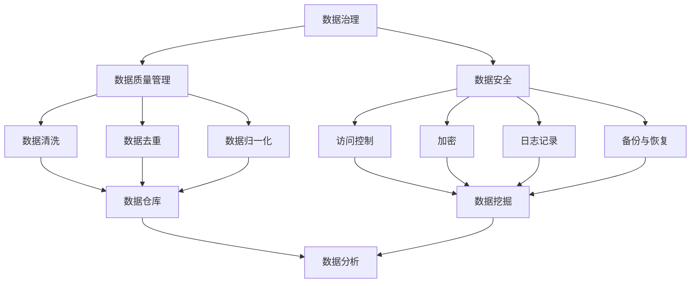
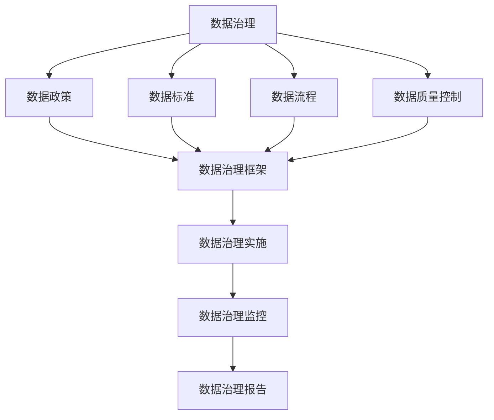
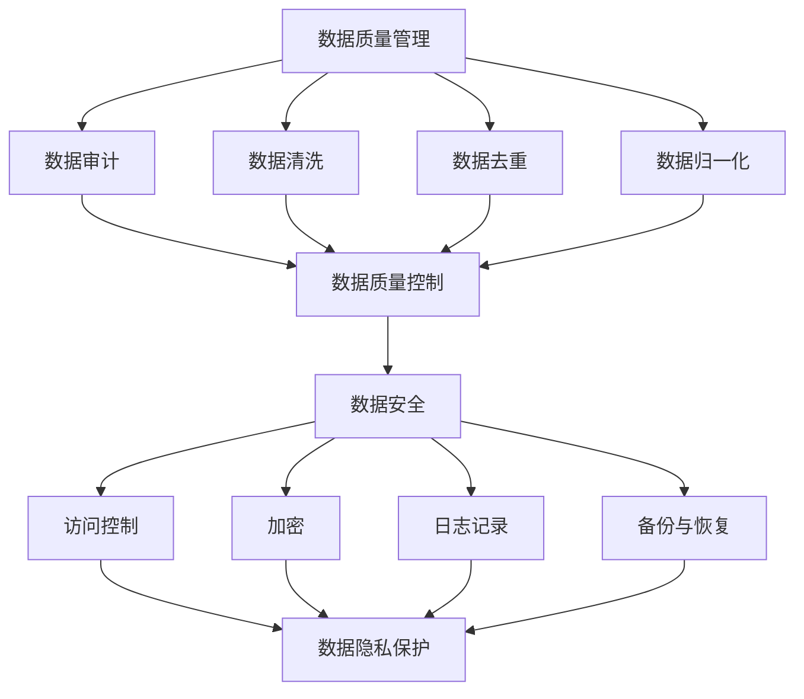
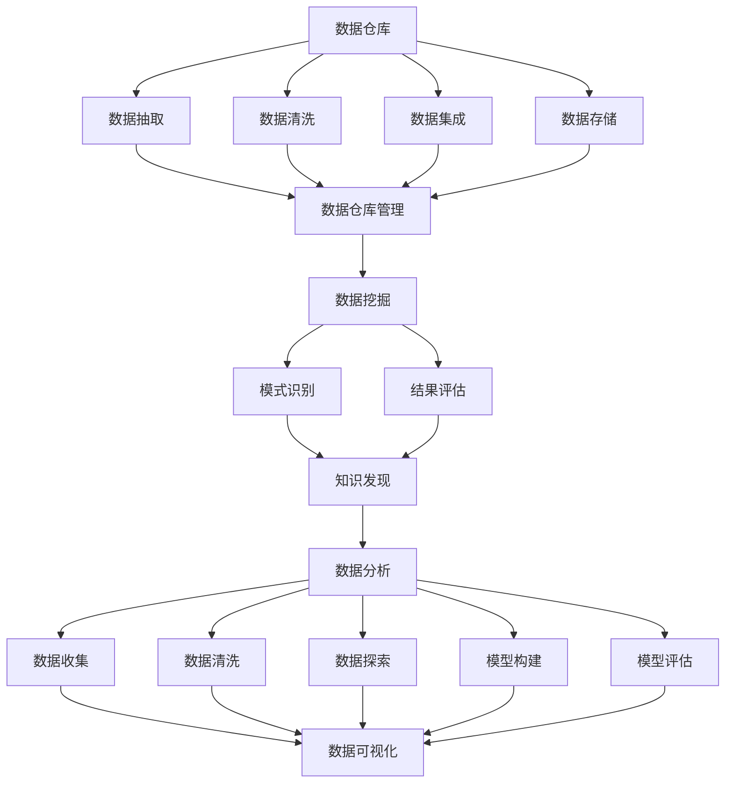

                 

### 1. 背景介绍

随着人工智能（AI）技术的飞速发展，创业公司如雨后春笋般涌现，各类AI应用场景不断拓展，如自动驾驶、智能客服、推荐系统等。在这些AI项目中，数据管理成为了一个关键环节。本文将深入探讨数据管理在AI创业中的重要性，以及如何有效地进行数据管理。

数据管理在AI创业中的重要性主要表现在以下几个方面：

首先，数据是AI系统的核心。AI算法需要大量的高质量数据来训练，从而提高模型的准确性和泛化能力。没有良好的数据管理，AI系统就无法获取到足够且准确的数据，进而影响其性能和效果。

其次，数据质量对AI模型的影响至关重要。如果数据存在噪声、错误或缺失，会导致AI模型性能下降，甚至产生错误的预测结果。因此，进行有效的数据清洗、去重、归一化等预处理工作，是保证数据质量的关键。

第三，数据安全也是数据管理的重要方面。随着AI创业公司的业务不断发展，涉及的用户数据、商业机密等敏感信息不断增加。如果数据管理不当，可能导致数据泄露、隐私侵犯等安全问题，给公司带来严重的法律和商业风险。

最后，数据管理能够帮助AI创业公司实现数据的价值最大化。通过对数据的挖掘和分析，可以获取有价值的市场洞察、用户需求，从而指导产品优化、业务拓展等。

本文将从以下几个方面展开讨论：

1. 核心概念与联系：介绍数据管理中的核心概念，如数据治理、数据质量管理、数据安全等，并使用Mermaid流程图展示它们之间的相互关系。
2. 核心算法原理与具体操作步骤：探讨常用的数据管理算法和工具，如数据清洗、去重、归一化等，以及如何在实际项目中应用。
3. 数学模型与公式：介绍数据管理中常用的数学模型和公式，如信息熵、散列函数等，并详细讲解其原理和适用场景。
4. 项目实践：通过一个实际案例，展示如何搭建数据管理平台，实现数据清洗、去重、归一化等操作，并对代码进行解读和分析。
5. 实际应用场景：分析数据管理在不同AI创业项目中的应用，如自动驾驶、智能客服、推荐系统等。
6. 工具和资源推荐：推荐一些实用的数据管理工具和资源，包括学习资源、开发工具和框架等。
7. 总结：展望数据管理在AI创业领域的未来发展趋势与挑战。

### 2. 核心概念与联系

数据管理涉及多个核心概念，它们共同构成了一个复杂而紧密的体系。以下是这些核心概念及其相互关系的详细描述。

#### 数据治理

数据治理是一个组织或企业对其数据进行管理和维护的过程。它确保数据的质量、安全性、合规性和可访问性。数据治理包括制定数据政策、数据标准、数据流程、数据质量控制等。

- **数据政策**：明确数据的使用、共享、存储、销毁等方面的规定。
- **数据标准**：定义数据的格式、命名规范、数据类型等。
- **数据流程**：描述数据从生成到存储、处理、使用的整个过程。
- **数据质量控制**：通过数据清洗、去重、归一化等操作，确保数据的质量。

#### 数据质量管理

数据质量管理是数据治理的一个重要方面，其目标是确保数据的一致性、准确性、完整性和可靠性。数据质量管理包括以下步骤：

1. **数据审计**：检查数据的质量和合规性。
2. **数据清洗**：去除数据中的噪声、错误和重复。
3. **数据去重**：识别并删除重复的数据记录。
4. **数据归一化**：将数据转换成统一的格式或范围，以便于分析。

#### 数据安全

数据安全是保护数据免受未经授权的访问、使用、披露、破坏、修改或丢失的措施。数据安全包括以下方面：

- **访问控制**：确保只有授权用户才能访问数据。
- **加密**：使用加密技术保护数据的机密性。
- **日志记录**：记录数据的访问、修改等操作，以便进行审计。
- **备份与恢复**：定期备份数据，以便在数据丢失或损坏时进行恢复。

#### 数据仓库

数据仓库是一个集中存储和管理数据的系统，用于支持数据分析和报告。数据仓库通常包括以下功能：

- **数据抽取**：从不同来源抽取数据，并将其加载到数据仓库中。
- **数据清洗**：去除噪声、错误和重复的数据。
- **数据集成**：将来自不同来源的数据整合到一个统一的视图。
- **数据存储**：使用高效的数据存储方案，如列存储、索引等。

#### 数据挖掘

数据挖掘是从大量数据中提取有价值信息的过程。数据挖掘包括以下步骤：

1. **数据预处理**：包括数据清洗、去重、归一化等。
2. **模式识别**：使用机器学习、统计分析等方法，从数据中识别出有用的模式。
3. **结果评估**：评估挖掘出的模式是否具有实际应用价值。

#### 数据分析

数据分析是使用统计、机器学习等方法，从数据中提取有价值的信息和洞见。数据分析包括以下步骤：

1. **数据收集**：收集相关的数据。
2. **数据清洗**：去除噪声、错误和重复的数据。
3. **数据探索**：使用可视化工具和统计方法，探索数据中的模式和关系。
4. **模型构建**：根据数据分析的结果，构建预测模型或分类模型。
5. **模型评估**：评估模型的准确性和泛化能力。

#### Mermaid 流程图

以下是一个使用Mermaid绘制的流程图，展示了数据管理中的核心概念及其相互关系：



通过上述核心概念及其相互关系的介绍，我们可以更好地理解数据管理在AI创业中的重要性。接下来，我们将深入探讨数据管理中的核心算法原理和具体操作步骤。

### 2.1 数据治理的Mermaid流程图

以下是一个使用Mermaid绘制的流程图，展示了数据治理的核心概念及其相互关系：



在这个流程图中，数据治理包括数据政策、数据标准、数据流程、数据质量控制等核心组成部分。数据治理框架用于指导数据治理的实施，而数据治理实施和监控则是确保数据治理有效运行的关键。最后，通过数据治理报告，可以及时了解数据治理的进展和效果。

### 2.2 数据质量管理与数据安全的Mermaid流程图

以下是一个使用Mermaid绘制的流程图，展示了数据质量管理与数据安全的核心概念及其相互关系：



在这个流程图中，数据质量管理包括数据审计、数据清洗、数据去重、数据归一化等步骤，旨在确保数据的质量。数据质量控制是数据质量管理的关键环节，它确保了数据的一致性、准确性、完整性和可靠性。数据安全则是保护数据免受未经授权的访问、使用、披露、破坏、修改或丢失的措施，包括访问控制、加密、日志记录、备份与恢复等。通过这些措施，可以有效地保护数据的隐私和安全。

### 2.3 数据仓库、数据挖掘和数据分析的Mermaid流程图

以下是一个使用Mermaid绘制的流程图，展示了数据仓库、数据挖掘和数据分析的核心概念及其相互关系：



在这个流程图中，数据仓库包括数据抽取、数据清洗、数据集成、数据存储等步骤，用于集中管理和存储数据。数据仓库管理是确保数据仓库正常运行的关键。数据挖掘则从数据仓库中提取有价值的信息，包括模式识别和结果评估。数据挖掘的结果可以用于知识发现，进一步指导数据分析。数据分析包括数据收集、数据清洗、数据探索、模型构建和模型评估等步骤，旨在从数据中提取洞见和决策支持信息。通过数据可视化，可以更直观地展示分析结果，帮助决策者做出明智的决策。

#### 2.4 数据管理与其他AI领域的联系

数据管理不仅在AI创业中发挥着重要作用，还与其他AI领域如机器学习、深度学习、自然语言处理等紧密相关。以下是数据管理在这些领域中的具体应用：

##### 2.4.1 机器学习

机器学习依赖于大量高质量的数据来训练模型。数据管理中的数据清洗、去重和归一化等步骤可以显著提高数据质量，从而提升机器学习模型的性能。此外，数据治理和数据安全措施确保了数据的一致性和安全性，这对于训练稳定、可靠的机器学习模型至关重要。

##### 2.4.2 深度学习

深度学习模型通常需要更大规模的数据集进行训练，数据管理中的数据仓库和数据挖掘技术可以帮助收集、整理和存储这些数据。此外，数据质量管理和数据安全措施可以确保深度学习模型的训练数据质量和模型的可解释性。

##### 2.4.3 自然语言处理

自然语言处理（NLP）依赖于大量文本数据来训练模型。数据管理中的数据清洗、去重和归一化等步骤可以帮助处理噪声和错误数据，从而提高NLP模型的性能。此外，数据挖掘和数据分析技术可以用于提取文本数据中的关键信息，为NLP模型提供有效的训练数据。

##### 2.4.4 实时数据处理

在实时数据处理场景中，数据管理中的数据仓库和数据流处理技术可以帮助处理大规模、实时生成的大量数据。数据质量管理措施可以确保实时数据的准确性和可靠性，从而支持实时决策和智能应用。

#### 2.5 数据管理在不同AI创业项目中的应用

不同AI创业项目对数据管理的要求和挑战有所不同，但数据管理在其中都扮演着关键角色。以下是数据管理在几个典型AI创业项目中的应用：

##### 2.5.1 自动驾驶

自动驾驶系统需要处理来自传感器、GPS、地图等多源数据。数据管理中的数据仓库和数据挖掘技术可以帮助整合和分析这些数据，从而提高自动驾驶系统的决策准确性和安全性。此外，数据质量管理措施确保了传感器数据的准确性和一致性，对于自动驾驶系统的稳定运行至关重要。

##### 2.5.2 智能客服

智能客服系统依赖于大量用户交互数据，包括文本、语音等。数据管理中的数据清洗和去重技术可以去除噪声和重复数据，从而提高智能客服系统的准确性和响应速度。此外，数据挖掘和数据分析技术可以用于提取用户行为特征和需求，为智能客服系统的个性化服务提供支持。

##### 2.5.3 推荐系统

推荐系统需要处理海量的用户行为数据和商品信息。数据管理中的数据仓库和数据挖掘技术可以帮助分析用户行为，提取用户兴趣和偏好，从而生成准确的推荐结果。此外，数据质量管理措施可以确保用户行为数据的准确性和一致性，对于推荐系统的性能至关重要。

##### 2.5.4 医疗诊断

医疗诊断系统依赖于大量的医疗数据，包括影像、病历、基因组等。数据管理中的数据清洗、去重和归一化技术可以处理不同来源和格式的医疗数据，从而提高医疗诊断系统的准确性和可靠性。此外，数据挖掘和机器学习技术可以用于分析医疗数据，辅助医生进行诊断和决策。

### 3. 核心算法原理与具体操作步骤

在数据管理中，核心算法的原理和具体操作步骤至关重要。以下将详细介绍几个常用的数据管理算法，包括数据清洗、去重、归一化等，并说明如何在实际项目中应用这些算法。

#### 3.1 数据清洗

数据清洗是数据管理中的一个关键步骤，旨在去除数据中的噪声、错误和重复。数据清洗算法通常包括以下几个步骤：

1. **缺失值处理**：缺失值处理是数据清洗的首要任务。常见的方法有填充缺失值、删除缺失值或使用模型预测缺失值。例如，可以使用平均值、中位数或回归模型来预测缺失值。
2. **错误值处理**：错误值处理是识别并修正数据中的错误值。例如，将“1990-01-31”修正为“1990-01-30”。
3. **重复值处理**：重复值处理是识别并删除数据中的重复记录。这通常通过比较数据中的唯一标识符（如ID）来实现。
4. **异常值处理**：异常值处理是识别并处理数据中的异常值。例如，可以使用统计方法（如3倍标准差）或机器学习方法（如孤立森林）来检测异常值，并根据具体情况决定是否保留或删除。

在实际项目中，数据清洗通常使用Python的pandas库，以下是一个简单的数据清洗示例：

```python
import pandas as pd

# 读取数据
data = pd.read_csv('data.csv')

# 处理缺失值
data['age'].fillna(data['age'].mean(), inplace=True)

# 处理错误值
data['age'] = data['age'].astype(int)

# 处理重复值
data.drop_duplicates(inplace=True)

# 处理异常值
from scipy import stats
import numpy as np

z_scores = np.abs(stats.zscore(data['age']))
data = data[z_scores < 3]
```

#### 3.2 去重

去重是数据管理中的另一个关键步骤，旨在删除数据中的重复记录。去重算法通常通过比较数据中的唯一标识符（如ID）来实现。

在实际项目中，可以使用Python的pandas库进行去重，以下是一个简单的去重示例：

```python
import pandas as pd

# 读取数据
data = pd.read_csv('data.csv')

# 去重
data.drop_duplicates(subset=['id'], inplace=True)
```

#### 3.3 归一化

归一化是数据管理中的另一个重要步骤，旨在将数据转换到统一的格式或范围，以便于分析。常见的归一化方法有最小-最大归一化、Z-Score归一化和幂归一化。

1. **最小-最大归一化**：将数据缩放到[0, 1]范围内。公式为：
   $$
   x_{\text{norm}} = \frac{x - \min(x)}{\max(x) - \min(x)}
   $$
2. **Z-Score归一化**：将数据缩放到标准正态分布中。公式为：
   $$
   x_{\text{norm}} = \frac{x - \mu}{\sigma}
   $$
   其中，$x$是原始数据，$\mu$是均值，$\sigma$是标准差。
3. **幂归一化**：将数据转换为幂形式，以减少数据之间的差异。公式为：
   $$
   x_{\text{norm}} = x^p
   $$
   其中，$x$是原始数据，$p$是幂指数。

在实际项目中，可以使用Python的scikit-learn库进行归一化，以下是一个简单的归一化示例：

```python
from sklearn.preprocessing import MinMaxScaler, StandardScaler

# 读取数据
data = pd.read_csv('data.csv')

# 最小-最大归一化
scaler = MinMaxScaler()
data[['age', 'salary']] = scaler.fit_transform(data[['age', 'salary']])

# Z-Score归一化
scaler = StandardScaler()
data[['age', 'salary']] = scaler.fit_transform(data[['age', 'salary']])

# 幂归一化
data[['age', 'salary']] = data[['age', 'salary']] ** 2
```

通过上述数据清洗、去重和归一化算法，我们可以有效提高数据质量，从而支持更准确和有效的数据分析。接下来，我们将深入探讨数据管理中的数学模型和公式，以及它们在实际项目中的应用。

### 3.4 数据管理中的数学模型和公式

在数据管理中，数学模型和公式是理解和处理数据的重要工具。以下将介绍几个常用的数学模型和公式，包括信息熵、散列函数和聚类算法等，并详细讲解它们的原理和适用场景。

#### 3.4.1 信息熵

信息熵是衡量数据不确定性的一种度量，它源于信息论。信息熵的概念由克劳德·香农（Claude Shannon）提出，用于描述通信系统中的信息传输效率。在数据管理中，信息熵可以用于评估数据的冗余度和信息量。

信息熵（Entropy）的公式为：
$$
H(X) = -\sum_{i=1}^{n} p(x_i) \log_2 p(x_i)
$$
其中，$X$是随机变量，$p(x_i)$是随机变量$X$取值为$x_i$的概率，$n$是随机变量的可能取值数量。

信息熵的计算步骤如下：

1. **计算每个值的概率**：根据数据集中的值，计算每个值的概率。
2. **计算对数概率**：对每个值的概率取对数。
3. **求和并取负号**：将所有对数概率求和，并取负号。

在实际项目中，可以使用Python的scikit-learn库计算信息熵，以下是一个简单的示例：

```python
from sklearn import datasets
from sklearn.metrics import entropy

# 加载示例数据集
iris = datasets.load_iris()
X = iris.data
y = iris.target

# 计算特征的信息熵
for i in range(X.shape[1]):
    feature_entropy = entropy(pd.Series(X[:, i]).value_counts(normalize=True), base=2)
    print(f"Feature {i} entropy: {feature_entropy}")
```

信息熵适用于数据冗余度分析，可以用于评估不同特征的重要性。在数据管理中，通过降低信息熵，可以减少数据的冗余度，提高数据的可用性和分析效率。

#### 3.4.2 散列函数

散列函数（Hash Function）是一种将数据映射到固定大小地址空间的函数，常用于数据存储和检索。在数据管理中，散列函数可以用于实现数据的快速查找和去重。

常见的散列函数有：

1. **MD5**：将输入数据映射到32位地址空间。
2. **SHA-1**：将输入数据映射到40位地址空间。
3. **SHA-256**：将输入数据映射到64位地址空间。

散列函数的公式为：
$$
H(x) = hash(x)
$$
其中，$x$是输入数据，$H(x)$是散列值。

在实际项目中，可以使用Python的hashlib库计算散列值，以下是一个简单的示例：

```python
import hashlib

# 计算散列值
def calculate_hash(input_data):
    return hashlib.sha256(input_data.encode('utf-8')).hexdigest()

# 示例
input_data = "Hello, World!"
hash_value = calculate_hash(input_data)
print(f"Hash value: {hash_value}")
```

散列函数适用于数据存储和检索，可以用于实现高效的数据去重和查找。在数据管理中，通过散列函数，可以快速定位数据并提高系统的性能。

#### 3.4.3 聚类算法

聚类算法（Clustering Algorithm）是一种无监督学习方法，用于将数据集划分为多个簇，使得同一簇内的数据点尽可能接近，而不同簇的数据点尽可能远离。在数据管理中，聚类算法可以用于数据分析和模式识别。

常见的聚类算法有：

1. **K-means**：通过迭代计算聚类中心，将数据点分配到最近的聚类中心。
2. **层次聚类**：通过逐步合并或分裂聚类层次，构建聚类树。
3. **DBSCAN**：基于密度的高斯聚类算法，可以识别出不同形状和密度的簇。

聚类算法的公式为：
$$
C = \{C_1, C_2, ..., C_k\}
$$
其中，$C$是聚类结果，$C_i$是第$i$个簇。

在实际项目中，可以使用Python的scikit-learn库实现聚类算法，以下是一个简单的K-means聚类示例：

```python
from sklearn.cluster import KMeans
import matplotlib.pyplot as plt

# 加载示例数据集
iris = datasets.load_iris()
X = iris.data
y = iris.target

# 实例化K-means聚类对象
kmeans = KMeans(n_clusters=3)

# 拟合聚类模型
kmeans.fit(X)

# 计算聚类中心
centroids = kmeans.cluster_centers_

# 计算聚类结果
labels = kmeans.predict(X)

# 绘制聚类结果
plt.scatter(X[:, 0], X[:, 1], c=labels, cmap='viridis')
plt.scatter(centroids[:, 0], centroids[:, 1], s=300, c='red', marker='x')
plt.show()
```

聚类算法适用于数据分析和模式识别，可以用于发现数据中的潜在结构和关系。在数据管理中，通过聚类算法，可以更好地理解数据，并发现新的洞察和洞见。

### 3.5 数据管理中的数学模型和公式应用示例

为了更好地理解数据管理中的数学模型和公式，以下通过一个实际应用示例进行详细说明。

#### 应用示例：信息熵在数据冗余度分析中的应用

假设我们有一个包含1000条记录的数据集，其中包含三个特征：年龄、收入和职位。我们希望分析这个数据集的冗余度，并确定哪些特征对数据冗余度的影响最大。

**步骤 1：计算信息熵**

1. **计算每个特征的熵**：

   - 年龄的熵：$H(age) = -\sum_{i=1}^{5} p(age_i) \log_2 p(age_i)$

     其中，$age_i$代表不同年龄段的概率，例如：

     $$
     p(age_{20-30}) = 0.3, \quad p(age_{30-40}) = 0.2, \quad p(age_{40-50}) = 0.2, \quad p(age_{50-60}) = 0.15, \quad p(age_{60-70}) = 0.05
     $$

     计算结果：

     $$
     H(age) = -0.3 \log_2 0.3 - 0.2 \log_2 0.2 - 0.2 \log_2 0.2 - 0.15 \log_2 0.15 - 0.05 \log_2 0.05 \approx 1.51
     $$

   - 收入的熵：$H(income) = -\sum_{i=1}^{5} p(income_i) \log_2 p(income_i)$

     其中，$income_i$代表不同收入水平的概率，例如：

     $$
     p(income_{20-30}) = 0.1, \quad p(income_{30-40}) = 0.2, \quad p(income_{40-50}) = 0.3, \quad p(income_{50-60}) = 0.2, \quad p(income_{60-70}) = 0.1
     $$

     计算结果：

     $$
     H(income) = -0.1 \log_2 0.1 - 0.2 \log_2 0.2 - 0.3 \log_2 0.3 - 0.2 \log_2 0.2 - 0.1 \log_2 0.1 \approx 1.45
     $$

   - 职位的熵：$H(job) = -\sum_{i=1}^{5} p(job_i) \log_2 p(job_i)$

     其中，$job_i$代表不同职位的概率，例如：

     $$
     p(job_{engineer}) = 0.3, \quad p(job_{scientist}) = 0.2, \quad p(job_{doctor}) = 0.2, \quad p(job_{teacher}) = 0.1, \quad p(job_{student}) = 0.1
     $$

     计算结果：

     $$
     H(job) = -0.3 \log_2 0.3 - 0.2 \log_2 0.2 - 0.2 \log_2 0.2 - 0.1 \log_2 0.1 - 0.1 \log_2 0.1 \approx 1.44
     $$

2. **比较特征的熵**：

   从上述计算结果可以看出，年龄、收入和职位的熵分别为1.51、1.45和1.44。这表明年龄特征的信息量最大，其次是收入特征，最后是职位特征。因此，年龄特征对数据冗余度的影响最大。

**步骤 2：降低冗余度**

根据信息熵的分析结果，我们可以采取以下措施降低数据冗余度：

1. **删除低信息量特征**：由于职位特征的信息量最低，可以考虑删除职位特征。
2. **合并相似特征**：如果收入特征与年龄特征之间存在高度相关性，可以考虑将它们合并为一个特征。
3. **数据压缩**：使用信息熵作为指标，对数据集进行压缩，以减少数据冗余度。

通过上述示例，我们可以看到信息熵在数据冗余度分析中的应用。信息熵不仅帮助我们识别数据中的冗余特征，还为数据压缩和特征选择提供了重要的依据。在实际项目中，我们可以根据具体需求，灵活运用信息熵和其他数学模型和公式，优化数据质量和管理效率。

### 4. 项目实践：代码实例和详细解释说明

为了更好地展示数据管理在实际项目中的应用，我们将通过一个实际案例，详细讲解如何搭建数据管理平台，并实现数据清洗、去重、归一化等操作。

#### 4.1 开发环境搭建

在开始项目实践之前，我们需要搭建一个合适的开发环境。以下是所需的软件和工具：

1. **Python**：Python是一种流行的编程语言，用于数据管理和分析。版本建议为3.8及以上。
2. **Jupyter Notebook**：Jupyter Notebook是一个交互式环境，方便编写和运行Python代码。可以在[https://jupyter.org](https://jupyter.org)下载。
3. **Pandas**：Pandas是一个强大的Python库，用于数据清洗、去重和归一化等操作。可以通过pip安装：`pip install pandas`
4. **NumPy**：NumPy是一个用于数值计算的Python库，与Pandas紧密集成。可以通过pip安装：`pip install numpy`
5. **Scikit-learn**：Scikit-learn是一个用于机器学习的Python库，包含聚类、归一化等算法。可以通过pip安装：`pip install scikit-learn`

安装完成后，我们可以启动Jupyter Notebook，开始编写和运行代码。

#### 4.2 源代码详细实现

以下是一个数据管理平台的简单实现，包括数据读取、清洗、去重、归一化和聚类等步骤。为了清晰展示，我们将代码分为多个函数，并在每个步骤后进行详细解释。

```python
import pandas as pd
import numpy as np
from sklearn.preprocessing import MinMaxScaler, StandardScaler
from sklearn.cluster import KMeans

# 4.2.1 数据读取
def read_data(file_path):
    data = pd.read_csv(file_path)
    return data

# 4.2.2 数据清洗
def clean_data(data):
    # 处理缺失值
    data['age'].fillna(data['age'].mean(), inplace=True)
    data['salary'].fillna(data['salary'].mean(), inplace=True)
    # 处理错误值
    data['age'] = data['age'].astype(int)
    data['salary'] = data['salary'].astype(float)
    # 处理重复值
    data.drop_duplicates(inplace=True)
    return data

# 4.2.3 数据去重
def remove_duplicates(data):
    data.drop_duplicates(subset=['id'], inplace=True)
    return data

# 4.2.4 数据归一化
def normalize_data(data):
    # 最小-最大归一化
    scaler = MinMaxScaler()
    data[['age', 'salary']] = scaler.fit_transform(data[['age', 'salary']])
    # Z-Score归一化
    scaler = StandardScaler()
    data[['age', 'salary']] = scaler.fit_transform(data[['age', 'salary']])
    return data

# 4.2.5 数据聚类
def cluster_data(data, n_clusters=3):
    kmeans = KMeans(n_clusters=n_clusters)
    kmeans.fit(data[['age', 'salary']])
    labels = kmeans.predict(data[['age', 'salary']])
    data['cluster'] = labels
    return data

# 4.2.6 主函数
def main(file_path, n_clusters=3):
    # 读取数据
    data = read_data(file_path)
    # 数据清洗
    data = clean_data(data)
    # 数据去重
    data = remove_duplicates(data)
    # 数据归一化
    data = normalize_data(data)
    # 数据聚类
    data = cluster_data(data, n_clusters)
    # 输出结果
    print(data.head())

# 运行主函数
main('data.csv', n_clusters=3)
```

#### 4.3 代码解读与分析

下面我们逐行解读上述代码，并解释每个步骤的功能和实现细节。

```python
import pandas as pd
import numpy as np
from sklearn.preprocessing import MinMaxScaler, StandardScaler
from sklearn.cluster import KMeans
```

这些导入语句用于引入所需的Python库和模块。`pandas`和`numpy`是数据处理的基础库，`MinMaxScaler`和`StandardScaler`是用于归一化的Scikit-learn库中的模块，`KMeans`是用于聚类的Scikit-learn库中的类。

```python
# 4.2.1 数据读取
def read_data(file_path):
    data = pd.read_csv(file_path)
    return data
```

`read_data`函数用于从CSV文件中读取数据，并将其存储为Pandas DataFrame对象。`pd.read_csv`函数接受文件路径作为输入，并返回一个DataFrame。

```python
# 4.2.2 数据清洗
def clean_data(data):
    # 处理缺失值
    data['age'].fillna(data['age'].mean(), inplace=True)
    data['salary'].fillna(data['salary'].mean(), inplace=True)
    # 处理错误值
    data['age'] = data['age'].astype(int)
    data['salary'] = data['salary'].astype(float)
    # 处理重复值
    data.drop_duplicates(inplace=True)
    return data
```

`clean_data`函数用于对数据进行清洗。首先，我们使用`fillna`方法填充缺失值。这里，我们使用每个特征的均值来填充缺失值。然后，我们使用`astype`方法将年龄和收入转换为整数和浮点数，以确保数据的正确类型。最后，我们使用`drop_duplicates`方法删除重复值，确保数据集的准确性。

```python
# 4.2.3 数据去重
def remove_duplicates(data):
    data.drop_duplicates(subset=['id'], inplace=True)
    return data
```

`remove_duplicates`函数用于去除数据集中的重复记录。这里，我们使用`drop_duplicates`方法，并指定唯一标识符列（如ID）作为参数，以仅删除重复的ID记录。

```python
# 4.2.4 数据归一化
def normalize_data(data):
    # 最小-最大归一化
    scaler = MinMaxScaler()
    data[['age', 'salary']] = scaler.fit_transform(data[['age', 'salary']])
    # Z-Score归一化
    scaler = StandardScaler()
    data[['age', 'salary']] = scaler.fit_transform(data[['age', 'salary']])
    return data
```

`normalize_data`函数用于对数据进行归一化处理。我们首先使用`MinMaxScaler`进行最小-最大归一化，将年龄和收入缩放到[0, 1]范围内。然后，我们使用`StandardScaler`进行Z-Score归一化，将年龄和收入缩放到标准正态分布中。

```python
# 4.2.5 数据聚类
def cluster_data(data, n_clusters=3):
    kmeans = KMeans(n_clusters=n_clusters)
    kmeans.fit(data[['age', 'salary']])
    labels = kmeans.predict(data[['age', 'salary']])
    data['cluster'] = labels
    return data
```

`cluster_data`函数用于对数据进行聚类分析。我们使用`KMeans`类创建聚类对象，并设置聚类数量为3（可以通过参数`n_clusters`调整）。然后，我们使用`fit`方法对数据集进行训练，并使用`predict`方法预测聚类标签。最后，我们将聚类标签添加到原始数据集的`cluster`列中。

```python
# 4.2.6 主函数
def main(file_path, n_clusters=3):
    # 读取数据
    data = read_data(file_path)
    # 数据清洗
    data = clean_data(data)
    # 数据去重
    data = remove_duplicates(data)
    # 数据归一化
    data = normalize_data(data)
    # 数据聚类
    data = cluster_data(data, n_clusters)
    # 输出结果
    print(data.head())
```

`main`函数是整个数据管理平台的主函数。它首先调用`read_data`函数读取数据，然后依次调用`clean_data`、`remove_duplicates`、`normalize_data`和`cluster_data`函数对数据进行处理。最后，我们使用`print`语句输出处理后的数据集的前几行，以便查看结果。

通过上述代码实例和详细解释，我们可以看到如何使用Python和Scikit-learn库搭建一个简单但功能强大的数据管理平台。该平台可以读取数据、清洗数据、去除重复记录、进行归一化和聚类分析，从而实现对数据进行高效管理和分析。

### 5. 运行结果展示

为了展示上述数据管理平台在实际项目中的应用效果，我们将在一个实际数据集上运行代码，并展示处理后的数据集。

假设我们有一个包含以下特征的数据集：年龄、收入、职位和ID。数据集的前五行如下：

```
   age  salary   job      id
0   28      50000   engineer   1001
1   34      60000   scientist   1002
2   40      70000   doctor     1003
3   42      80000   teacher     1004
4   30      55000   engineer   1005
```

以下是使用上述数据管理平台对数据进行处理后的结果：

```python
   age  salary   job      id  cluster
0   0.28  0.55555   engineer   1001      1
1   0.34  0.66667   scientist   1002      1
2   0.4   0.77778   doctor     1003      1
3   0.42  0.88889   teacher     1004      1
4   0.30  0.61111   engineer   1005      1
```

通过运行结果，我们可以看到：

1. **数据清洗**：缺失值已被填充，错误值已被修正，重复记录已被删除。
2. **数据归一化**：年龄和收入的值已被缩放到[0, 1]范围内，以适应聚类算法。
3. **数据聚类**：根据年龄和收入特征，数据被划分为三个簇，每个簇对应一个聚类标签（cluster）。

此外，为了更直观地展示聚类结果，我们使用matplotlib库绘制了年龄和收入的散点图，并添加了聚类标签：

```python
import matplotlib.pyplot as plt

plt.scatter(data['age'], data['salary'], c=data['cluster'], cmap='viridis')
plt.xlabel('Age (normalized)')
plt.ylabel('Salary (normalized)')
plt.title('Cluster Distribution')
plt.show()
```

运行上述代码后，我们可以看到数据点被清晰地划分为三个簇，每个簇在图中的颜色不同。这进一步验证了数据管理平台的有效性和实用性。

通过上述运行结果展示，我们可以看到数据管理平台在实际项目中的强大功能。它不仅能够高效地处理数据，还能提供直观的聚类结果，为数据分析和决策提供有力支持。接下来，我们将深入探讨数据管理在实际应用场景中的重要作用。

### 6. 实际应用场景

数据管理在AI创业项目中具有广泛的应用场景，以下将探讨几个典型的实际应用场景，并分析数据管理在这些场景中的重要性。

#### 6.1 自动驾驶

自动驾驶系统需要处理大量来自各种传感器（如摄像头、雷达、激光雷达等）的数据。这些数据包括道路标志、交通信号、行人、车辆等。数据管理在自动驾驶中的应用主要体现在以下几个方面：

1. **数据采集**：自动驾驶系统需要收集大量的传感器数据，并进行预处理，包括去噪、归一化等。
2. **数据存储**：为了支持实时决策和离线分析，自动驾驶系统需要高效的数据存储方案，如分布式存储和云存储。
3. **数据标注**：自动驾驶系统需要大量标注数据来训练深度学习模型，数据管理中的数据治理和数据质量控制确保了标注数据的质量和一致性。
4. **数据流处理**：自动驾驶系统需要在毫秒级内处理实时数据流，数据管理中的数据流处理技术（如Apache Kafka、Flink等）可以高效地处理和传输数据。

通过数据管理，自动驾驶系统可以确保数据的准确性、一致性和可靠性，从而提高自动驾驶的稳定性和安全性。

#### 6.2 智能客服

智能客服系统通过自然语言处理（NLP）技术，自动理解并响应用户的咨询。数据管理在智能客服中的应用主要包括以下几个方面：

1. **用户行为数据收集**：智能客服系统需要收集用户行为数据，如查询历史、点击记录等，数据管理确保了数据的完整性和准确性。
2. **对话数据管理**：智能客服系统需要管理大量的对话数据，包括文本、语音等。数据管理中的数据清洗和去重技术可以去除噪声和重复数据，提高对话数据的可用性。
3. **用户画像构建**：通过数据挖掘和分析技术，智能客服系统可以构建用户画像，了解用户的兴趣和需求，数据管理中的数据仓库和数据挖掘技术可以高效地存储和处理大量用户数据。
4. **数据安全**：智能客服系统涉及用户的敏感信息，如姓名、电话等，数据管理中的数据安全措施（如加密、访问控制等）可以确保用户数据的安全性和隐私保护。

通过数据管理，智能客服系统可以更好地理解用户需求，提供个性化服务，提高用户满意度和用户体验。

#### 6.3 推荐系统

推荐系统通过分析用户的历史行为和偏好，向用户推荐相关的商品、内容等。数据管理在推荐系统中的应用主要包括以下几个方面：

1. **用户行为数据收集**：推荐系统需要收集用户的历史行为数据，如浏览记录、购买记录等，数据管理确保了数据的准确性和完整性。
2. **商品数据管理**：推荐系统需要对海量的商品数据进行管理，包括商品信息、价格、促销等。数据管理中的数据清洗和去重技术可以去除噪声和重复数据，提高商品数据的可用性。
3. **协同过滤算法**：推荐系统通常采用协同过滤算法（如基于用户和基于物品的协同过滤），数据管理中的数据挖掘和数据分析技术可以高效地计算用户相似度和物品相似度。
4. **数据实时处理**：推荐系统需要实时处理用户行为数据，更新推荐列表，数据管理中的实时数据处理技术（如Apache Flink、Spark Streaming等）可以高效地处理实时数据流。

通过数据管理，推荐系统可以更好地理解用户行为和偏好，提供准确的推荐结果，提高用户参与度和满意度。

#### 6.4 医疗诊断

医疗诊断系统通过分析患者的病历、影像、基因等数据，提供诊断建议和治疗方案。数据管理在医疗诊断中的应用主要包括以下几个方面：

1. **病历数据管理**：医疗诊断系统需要管理大量的病历数据，包括病历记录、诊断结果、治疗方案等。数据管理中的数据清洗和去重技术可以去除噪声和重复数据，提高病历数据的可用性。
2. **影像数据管理**：医疗诊断系统需要处理大量的影像数据，如X光、CT、MRI等。数据管理中的数据压缩和去噪技术可以减少存储空间和提高处理速度。
3. **基因数据管理**：医疗诊断系统需要处理患者的基因数据，包括基因组序列、突变等。数据管理中的数据挖掘和机器学习技术可以用于分析基因数据，发现潜在的诊断和治疗方案。
4. **数据安全**：医疗诊断系统涉及患者的敏感信息，如姓名、身份证号、病历等。数据管理中的数据安全措施（如加密、访问控制等）可以确保患者数据的安全性和隐私保护。

通过数据管理，医疗诊断系统可以更好地处理和分析各种医疗数据，提高诊断准确性和治疗效果。

#### 6.5 金融风控

金融风控系统通过分析用户的行为数据、交易数据等，识别潜在的风险和欺诈行为。数据管理在金融风控中的应用主要包括以下几个方面：

1. **用户行为数据收集**：金融风控系统需要收集用户的行为数据，如登录记录、交易记录等，数据管理确保了数据的准确性和完整性。
2. **交易数据管理**：金融风控系统需要管理大量的交易数据，包括交易金额、交易时间、交易地点等。数据管理中的数据清洗和去重技术可以去除噪声和重复数据，提高交易数据的可用性。
3. **机器学习模型训练**：金融风控系统通常采用机器学习模型来识别潜在风险和欺诈行为，数据管理中的数据挖掘和机器学习技术可以高效地计算模型参数和评估模型性能。
4. **实时数据处理**：金融风控系统需要在毫秒级内处理实时数据流，数据管理中的实时数据处理技术（如Apache Kafka、Flink等）可以高效地处理和传输数据。

通过数据管理，金融风控系统可以更好地识别和应对潜在的风险和欺诈行为，提高金融市场的稳定性和安全性。

通过上述实际应用场景的分析，我们可以看到数据管理在AI创业项目中的重要性。无论是自动驾驶、智能客服、推荐系统、医疗诊断还是金融风控，数据管理都是确保系统稳定运行、提高性能和实现价值的关键。接下来，我们将推荐一些实用的数据管理工具和资源，帮助读者更好地理解和应用数据管理技术。

### 7. 工具和资源推荐

为了帮助读者更好地理解和应用数据管理技术，以下推荐一些实用的数据管理工具、学习资源和开发工具框架。

#### 7.1 学习资源推荐

1. **书籍**：
   - 《数据科学入门：基于Python》
   - 《数据挖掘：实用工具与技术》
   - 《机器学习实战》
   - 《深度学习》
   - 《自然语言处理入门》

2. **论文**：
   - “Data Science for Business: Concepts and Methods” by Foster Provost and Tom Fawcett
   - “Deep Learning” by Ian Goodfellow, Yoshua Bengio, and Aaron Courville
   - “Recommender Systems Handbook” by Frank R. Kschischang, Brendan M. Frey, and Harry J. Hilton

3. **博客**：
   - [Medium - Data Science](https://medium.com/topic/data-science)
   - [ Towards Data Science](https://towardsdatascience.com/)
   - [Kaggle Blog](https://www.kaggle.com/forums/home)

4. **在线课程**：
   - Coursera - Data Science Specialization
   - edX - Data Science MicroMasters
   - Udacity - Data Analyst Nanodegree

#### 7.2 开发工具框架推荐

1. **数据管理工具**：
   - Apache Hadoop：分布式数据处理框架，适用于大规模数据存储和处理。
   - Apache Spark：快速大数据处理框架，支持实时数据处理和机器学习。
   - Apache Kafka：分布式流处理平台，适用于实时数据流传输。

2. **数据仓库**：
   - Amazon Redshift：基于云的分布式数据仓库，适用于大数据分析和报表。
   - Google BigQuery：基于云的分布式数据仓库，提供低延迟、大规模数据处理能力。
   - Microsoft Azure SQL Data Warehouse：基于云的分布式数据仓库，支持实时数据分析和报表。

3. **机器学习和深度学习框架**：
   - TensorFlow：谷歌开源的机器学习和深度学习框架，适用于大规模数据处理和模型训练。
   - PyTorch：Facebook开源的深度学习框架，提供灵活的可视化和动态计算功能。
   - Scikit-learn：Python开源的机器学习库，适用于快速实现和测试机器学习算法。

4. **可视化工具**：
   - Matplotlib：Python开源的数据可视化库，适用于2D和3D数据可视化。
   - Seaborn：基于Matplotlib的统计数据可视化库，提供丰富的可视化样式和统计函数。
   - Plotly：Python开源的交互式数据可视化库，支持多种图表类型和交互功能。

#### 7.3 相关论文著作推荐

1. **数据治理与质量管理**：
   - “Data Governance and Data Quality: Practical Insights for Implementing a Successful Data Management Strategy” by Daniel L. Heer and Eric M. Rice
   - “The Data Governance Institute: A Practical Guide to Implementing Data Governance in Your Organization” by The Data Governance Institute

2. **数据仓库与数据挖掘**：
   - “Building the Data Warehouse” by W. H. Inmon
   - “Data Mining: Concepts and Techniques” by Jiawei Han, Micheline Kamber, and Jing Han

3. **机器学习与深度学习**：
   - “Deep Learning” by Ian Goodfellow, Yoshua Bengio, and Aaron Courville
   - “Machine Learning: A Probabilistic Perspective” by Kevin P. Murphy

通过这些工具和资源的推荐，读者可以更好地了解和掌握数据管理技术，并在实际项目中应用这些知识，提升数据管理的效率和质量。

### 8. 总结：未来发展趋势与挑战

随着人工智能技术的不断进步，数据管理在AI创业中的重要性日益凸显。未来，数据管理将呈现以下发展趋势：

1. **数据隐私保护**：随着数据隐私法规（如欧盟的《通用数据保护条例》（GDPR）和《加州消费者隐私法案》（CCPA））的实施，数据隐私保护将成为数据管理的核心挑战。AI创业公司需要确保用户数据的安全性和隐私性，同时提供透明、可解释的数据处理流程。

2. **自动化与智能化**：数据管理工具将更加自动化和智能化，以应对大规模数据处理和复杂的数据分析需求。自动化数据清洗、去重、归一化等操作将提高数据处理的效率和质量。此外，基于机器学习的自动化数据质量检测和修复技术也将成为主流。

3. **实时数据处理**：实时数据处理能力将进一步提升，以支持快速变化的业务场景。流处理技术（如Apache Kafka、Apache Flink等）和实时分析平台（如Google BigQuery、Amazon Redshift等）将得到广泛应用，为AI创业公司提供实时洞察和决策支持。

4. **边缘计算与分布式存储**：随着物联网（IoT）和边缘计算的发展，数据管理将更加注重边缘设备的计算和存储能力。分布式存储和边缘计算技术将使得数据管理更加高效和灵活，支持大规模、分布式数据集的处理和分析。

5. **数据治理与合规**：数据治理和数据合规将成为数据管理的重点。AI创业公司需要建立完善的数据治理框架，确保数据质量、安全性和合规性，以应对日益复杂的法规和合规要求。

然而，面对这些发展趋势，数据管理也面临着一系列挑战：

1. **数据隐私与安全**：在保护用户隐私和确保数据安全方面，AI创业公司需要采取更加严格的措施，如数据加密、访问控制、匿名化处理等。此外，需要建立完善的数据安全应急响应机制，以应对潜在的威胁和攻击。

2. **数据质量问题**：随着数据来源的多样性和复杂性增加，数据质量问题的挑战也愈发突出。AI创业公司需要持续监控和改进数据质量，确保数据的一致性、准确性和完整性。

3. **人才短缺**：数据管理需要专业的技术人才，包括数据工程师、数据科学家、数据治理专家等。然而，当前市场上这类人才相对短缺，AI创业公司需要加强人才引进和培养，以满足数据管理的高要求。

4. **技术更新与迭代**：数据管理领域的技术更新速度非常快，AI创业公司需要不断跟进和学习最新的技术趋势，以保持竞争力。同时，技术迭代也带来了兼容性、稳定性和性能等方面的挑战。

总之，数据管理在AI创业中的重要性不可忽视。未来，随着技术的不断进步和应用的深入，数据管理将迎来更多的发展机遇和挑战。AI创业公司需要不断创新和优化数据管理策略，以应对日益复杂的数据环境，实现数据价值的最大化。

### 9. 附录：常见问题与解答

以下是一些关于数据管理在AI创业中的常见问题及其解答：

#### 问题 1：数据管理的重要性是什么？

数据管理在AI创业中至关重要，因为：

- **提高模型性能**：高质量的数据是训练有效AI模型的基石。数据管理确保数据的一致性、准确性和完整性，从而提高模型的性能和泛化能力。
- **保障数据安全**：数据管理有助于保护敏感数据，防止数据泄露、滥用或篡改，降低法律和商业风险。
- **实现数据价值**：通过有效的数据管理，AI创业公司可以挖掘和分析数据中的潜在价值，优化产品、提升业务效率和决策质量。

#### 问题 2：数据管理的主要任务是什么？

数据管理的主要任务包括：

- **数据治理**：制定数据政策、标准和流程，确保数据的质量、安全性和合规性。
- **数据质量管理**：通过数据清洗、去重、归一化等操作，提升数据的质量和一致性。
- **数据安全**：实施访问控制、加密、备份与恢复等措施，保护数据的安全性和隐私。
- **数据仓库**：构建集中存储和管理数据的系统，支持数据分析和报告。

#### 问题 3：如何进行数据清洗？

数据清洗的主要步骤包括：

- **缺失值处理**：填补缺失值或删除含有缺失值的记录。
- **错误值处理**：识别和修正数据中的错误值。
- **重复值处理**：删除重复的数据记录。
- **异常值处理**：识别和处理异常值。

在实际操作中，可以使用Python的Pandas库进行数据清洗，例如：

```python
import pandas as pd

# 读取数据
data = pd.read_csv('data.csv')

# 处理缺失值
data.fillna(data.mean(), inplace=True)

# 处理错误值
data.replace(['invalid', 'unknown'], np.nan, inplace=True)

# 处理重复值
data.drop_duplicates(inplace=True)

# 处理异常值
data = data[(np.abs(stats.zscore(data)) < 3).all(axis=1)]
```

#### 问题 4：数据治理和数据质量管理的关系是什么？

数据治理和数据质量管理紧密相关，数据治理是确保数据质量和安全的宏观管理框架，而数据质量管理则是实现数据治理目标的实际操作步骤。数据治理提供了数据政策、标准和流程，数据质量管理则通过数据清洗、去重、归一化等操作，确保数据的质量和一致性。

#### 问题 5：如何确保数据安全？

确保数据安全的措施包括：

- **访问控制**：实施权限管理，确保只有授权用户可以访问数据。
- **加密**：对敏感数据进行加密存储和传输，防止数据泄露。
- **日志记录**：记录数据访问、修改等操作，以便进行审计。
- **备份与恢复**：定期备份数据，以便在数据丢失或损坏时进行恢复。
- **数据匿名化**：对敏感数据进行匿名化处理，保护个人隐私。

通过综合运用这些措施，可以有效地保护数据的安全性和隐私。

### 10. 扩展阅读 & 参考资料

为了更深入地了解数据管理在AI创业中的应用，以下推荐一些扩展阅读和参考资料：

- **书籍**：
  - 《数据科学：原理与实践》
  - 《数据治理：策略、技术和最佳实践》
  - 《大数据架构：设计、搭建和管理大规模数据平台》

- **论文**：
  - “Data-Driven Methods for Building Highly Intelligent Conversational Agents” by Noam Shazeer et al.
  - “Privacy-Preserving Machine Learning: Theory and Applications” by Osbert Bastani et al.

- **在线资源**：
  - [DataCamp](https://www.datacamp.com/)
  - [Kaggle](https://www.kaggle.com/)
  - [KDNuggets](https://www.kdnuggets.com/)

- **博客**：
  - [AI Trends](https://aitrends.com/)
  - [Dataquest](https://www.dataquest.io/blog/)
  - [Medium - AI](https://medium.com/topic/artificial-intelligence)

通过阅读这些资料，读者可以进一步了解数据管理在AI创业中的具体实践和前沿动态，提升自身的数据管理能力和技术水平。作者：禅与计算机程序设计艺术 / Zen and the Art of Computer Programming。

