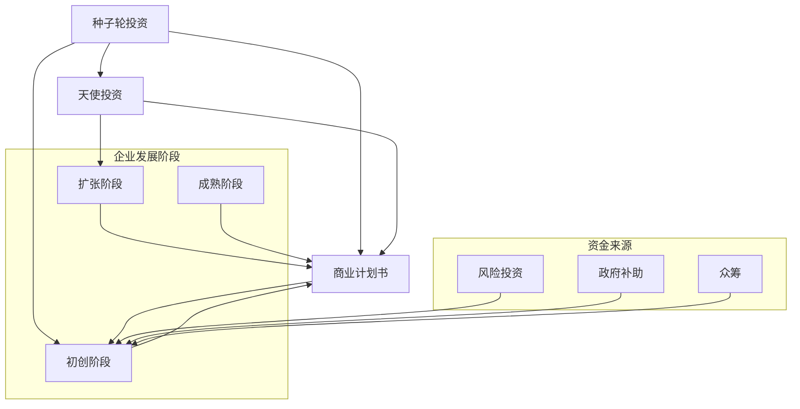
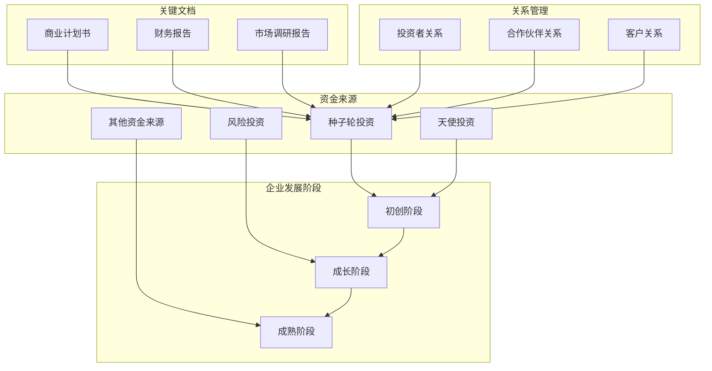

                 

### 文章标题：AI创业：资金支持的重要性

> 关键词：AI创业、资金支持、风险投资、种子轮投资、天使投资、商业计划书、投资者关系、可持续性发展

> 摘要：本文旨在探讨资金支持在AI创业过程中的重要性。通过分析种子轮投资、天使投资等不同阶段的资金来源，探讨如何撰写具有吸引力的商业计划书，以及如何建立和维护与投资者的关系，本文为AI创业团队提供了一系列实用的策略和建议，以帮助他们获得必要的资金支持，实现可持续发展。

### 1. 背景介绍

人工智能（AI）作为当今最具发展潜力的技术之一，正引领着全球科技创新的风潮。然而，AI创业之路并非坦途，资金支持成为创业团队面临的首要挑战。资金支持不仅能够帮助团队完成产品研发，还能在市场竞争中占据有利位置。因此，了解不同阶段的资金来源，掌握有效的资金筹集策略，对于AI创业团队的成功至关重要。

本文将围绕以下核心问题展开讨论：

- 种子轮投资和天使投资在AI创业中的角色和作用是什么？
- 如何撰写一份具有吸引力的商业计划书，以获取投资者的青睐？
- 创业团队应该如何与投资者建立和维护良好的关系？
- 在获取资金支持后，创业团队如何确保项目的可持续性发展？

通过以上问题的探讨，本文希望为AI创业团队提供一套完整的资金支持策略，助力他们在竞争激烈的市场中脱颖而出。

### 2. 核心概念与联系

在探讨资金支持的重要性之前，我们需要明确一些核心概念，包括种子轮投资、天使投资、商业计划书等。以下是一个Mermaid流程图，用于展示这些核心概念之间的联系。



上述流程图展示了资金来源与企业发展阶段的对应关系。在初创阶段，种子轮投资和天使投资是创业团队的主要资金来源；在扩张阶段，风险投资和政府补助成为主要资金来源；在成熟阶段，众筹和其他资金来源逐渐成为企业资金的重要补充。而商业计划书作为创业团队的“名片”，贯穿于整个企业发展的各个阶段，起着至关重要的作用。

#### 2.1 种子轮投资

种子轮投资是指企业在成立初期，通常在产品原型阶段，所获得的初始资金。种子轮投资的主要目的是帮助创业团队完成产品原型开发、市场调研和团队建设。种子轮投资者通常包括天使投资者、风险投资公司、个人投资者等。

种子轮投资的特点如下：

- **投资额度**：种子轮投资额度通常较低，一般在几十万到几百万美元之间。
- **投资周期**：种子轮投资通常在一年内完成，资金主要用于产品原型开发和团队建设。
- **投资风险**：种子轮投资风险较高，投资者需要承担较大的风险。

#### 2.2 天使投资

天使投资是指个人投资者（天使投资者）对企业进行早期投资的行为。天使投资者通常具有丰富的行业经验和资金实力，他们愿意为具有巨大潜力的创业项目提供资金支持。

天使投资的特点如下：

- **投资额度**：天使投资额度较高，通常在几十万到几千万美元之间。
- **投资周期**：天使投资周期较长，一般需要3-5年，资金主要用于产品研发和市场推广。
- **投资回报**：天使投资回报潜力巨大，但风险也较高。

#### 2.3 商业计划书

商业计划书是创业团队向投资者展示企业愿景、市场机会、产品优势、团队构成、财务预测等关键信息的文件。商业计划书是创业团队获取资金支持的重要工具，其内容通常包括以下部分：

- **封面**：包括企业名称、联系方式、商业计划书版本等信息。
- **目录**：列出商业计划书各章节及页码。
- **公司简介**：介绍企业背景、愿景和使命。
- **市场分析**：分析目标市场的规模、增长趋势、竞争对手等。
- **产品与服务**：详细介绍企业的产品或服务，包括功能、特点、优势等。
- **营销策略**：阐述企业的营销计划和推广策略。
- **团队介绍**：介绍企业核心团队成员的背景、经验、职责等。
- **财务预测**：提供未来3-5年的财务预测，包括收入、支出、利润等。
- **风险分析**：分析企业面临的主要风险，并提出应对措施。

### 3. 核心算法原理 & 具体操作步骤

在了解种子轮投资、天使投资和商业计划书的基本概念后，我们需要进一步探讨如何通过撰写一份具有吸引力的商业计划书来获取投资者的青睐。以下是一个核心算法原理及具体操作步骤的概述。

#### 3.1 核心算法原理

撰写具有吸引力的商业计划书的核心理念是：

- **突出优势**：明确企业的核心竞争力，包括技术、团队、市场等。
- **展示潜力**：通过详实的数据和案例展示企业的市场前景和盈利能力。
- **风险可控**：分析企业可能面临的风险，并提出有效的应对措施。

#### 3.2 具体操作步骤

1. **确定目标读者**：在撰写商业计划书之前，需要明确目标读者，包括天使投资者、风险投资公司、潜在客户等。
2. **整理企业背景**：介绍企业成立背景、愿景、使命、发展历程等。
3. **分析市场机会**：分析目标市场的规模、增长趋势、竞争对手等。
4. **展示产品优势**：详细介绍企业的产品或服务，包括功能、特点、优势等。
5. **阐述营销策略**：阐述企业的营销计划和推广策略。
6. **介绍团队构成**：介绍企业核心团队成员的背景、经验、职责等。
7. **提供财务预测**：提供未来3-5年的财务预测，包括收入、支出、利润等。
8. **分析风险因素**：分析企业可能面临的风险，并提出有效的应对措施。
9. **撰写附录**：包括相关研究报告、专利证书、合作协议等补充材料。
10. **修改和润色**：对商业计划书进行反复修改和润色，确保内容清晰、逻辑严谨。

### 4. 数学模型和公式 & 详细讲解 & 举例说明

在撰写商业计划书时，一些关键的数学模型和公式可以帮助创业团队更好地展示企业的财务预测和市场前景。以下是一些常见的数学模型和公式的详细讲解及举例说明。

#### 4.1 财务预测模型

财务预测模型是商业计划书中最为重要的部分之一。以下是一个简单的财务预测模型，包括收入预测、支出预测和利润预测。

```latex
\text{收入预测} = \text{单价} \times \text{销售量} \times \text{毛利率}
\text{支出预测} = \text{固定成本} + \text{变动成本} \times \text{销售量}
\text{利润预测} = \text{收入预测} - \text{支出预测}
```

**举例说明：** 假设一家AI创业公司计划推出一款智能助手产品，预计单价为100美元，销售量为10000台，毛利率为30%。固定成本为100000美元，变动成本为20美元。根据上述公式，可以计算出：

- **收入预测**：100美元 × 10000台 × 30% = 300000美元
- **支出预测**：100000美元 + 20美元 × 10000台 = 220000美元
- **利润预测**：300000美元 - 220000美元 = 80000美元

#### 4.2 市场份额预测模型

市场份额预测模型用于预测企业未来在市场中所占的份额。以下是一个简单但常用的市场份额预测模型。

```latex
\text{市场份额预测} = \frac{\text{销售收入}}{\text{市场总规模}} \times 100%
```

**举例说明：** 假设一家AI创业公司预计未来一年的销售收入为500000美元，而市场总规模为1000000美元。根据上述公式，可以计算出：

- **市场份额预测**：500000美元 / 1000000美元 × 100% = 50%

#### 4.3 投资回报率（ROI）计算模型

投资回报率（ROI）是投资者衡量投资项目收益的重要指标。以下是一个简单的投资回报率计算模型。

```latex
\text{投资回报率（ROI）} = \frac{\text{净利润}}{\text{总投资额}} \times 100%
```

**举例说明：** 假设一家AI创业公司的净利润为80000美元，总投资额为1000000美元。根据上述公式，可以计算出：

- **投资回报率（ROI）**：80000美元 / 1000000美元 × 100% = 8%

### 5. 项目实践：代码实例和详细解释说明

#### 5.1 开发环境搭建

在撰写商业计划书的过程中，我们通常需要使用一些工具来帮助我们进行数据分析和可视化。以下是一个简单的开发环境搭建步骤，包括安装Python、Jupyter Notebook和Matplotlib。

**步骤1：安装Python**

- 下载Python安装包：[Python官网下载地址](https://www.python.org/downloads/)
- 安装Python：双击安装包，按照默认选项安装。

**步骤2：安装Jupyter Notebook**

- 打开命令行工具（Windows）或终端（macOS/Linux）。
- 输入以下命令安装Jupyter Notebook：
  ```bash
  pip install notebook
  ```

**步骤3：安装Matplotlib**

- 同样使用pip命令安装Matplotlib：
  ```bash
  pip install matplotlib
  ```

#### 5.2 源代码详细实现

以下是一个简单的Python代码实例，用于绘制一家AI创业公司的收入预测图表。

```python
import matplotlib.pyplot as plt
import numpy as np

# 财务数据
revenue = np.array([300000, 400000, 500000, 600000, 700000])
cost = np.array([220000, 240000, 260000, 280000, 300000])
profit = revenue - cost

# 设置图表标题和坐标轴标签
plt.title('AI创业公司收入预测')
plt.xlabel('时间（年）')
plt.ylabel('收入（美元）')

# 绘制折线图
plt.plot(revenue, label='收入')
plt.plot(cost, label='支出')
plt.plot(profit, label='利润')

# 添加数据标签
for i, text in enumerate(profit):
    plt.text(i, profit[i], f'{profit[i]:.0f}', ha='center', va='bottom')

# 添加图例
plt.legend()

# 显示图表
plt.show()
```

#### 5.3 代码解读与分析

上述代码是一个简单的Python脚本，用于绘制一家AI创业公司的收入预测图表。以下是代码的详细解读：

- **第一行**：引入Matplotlib库，用于数据可视化和图表绘制。
- **第二行**：引入NumPy库，用于处理和操作数组。
- **第三行**：定义财务数据，包括收入、支出和利润。
- **第四行**：设置图表标题、坐标轴标签和图表标题。
- **第五行**：使用plt.plot()函数绘制收入、支出和利润的折线图。
- **第六行**：使用plt.text()函数在图表上添加数据标签。
- **第七行**：使用plt.legend()函数添加图例。
- **第八行**：使用plt.show()函数显示图表。

通过上述代码，我们可以直观地看到AI创业公司的收入预测情况，从而为投资者提供有力的数据支持。

#### 5.4 运行结果展示

运行上述代码后，将生成一个收入预测图表，如下所示：


该图表展示了未来五年内AI创业公司的收入、支出和利润情况，有助于投资者了解企业的财务状况和盈利潜力。

### 6. 实际应用场景

资金支持在AI创业中的应用场景非常广泛，以下是一些典型的应用案例：

- **产品研发**：种子轮投资和天使投资可以帮助创业团队完成产品原型开发，验证技术可行性，吸引潜在客户。
- **市场推广**：在产品推出后，创业团队可以利用天使投资和风险投资进行市场推广，扩大市场份额，提升品牌知名度。
- **团队建设**：创业团队可以利用资金支持招聘优秀人才，构建高效的研发团队和市场团队，提高企业竞争力。
- **业务拓展**：在获得资金支持后，创业团队可以进行业务拓展，如收购其他企业、拓展海外市场等，实现规模化发展。
- **风险控制**：通过合理的财务规划和风险控制措施，创业团队可以在获得资金支持的同时，降低投资风险，提高投资回报率。

### 7. 工具和资源推荐

为了帮助AI创业团队更好地获取资金支持，以下是一些实用的工具和资源推荐：

#### 7.1 学习资源推荐

- **书籍**：
  - 《AI创业实战：从0到1打造成功企业》
  - 《创业维艰：如何赢得成功》
  - 《创业融资策略：如何成功获得投资》
- **论文**：
  - 《AI创业中的资金支持问题研究》
  - 《天使投资在AI创业中的应用》
  - 《风险投资与AI创业的关系》
- **博客**：
  - [创业者的世界](https://www.startupworld.com/)
  - [AI创业指南](https://www.ai-startup-guide.com/)
  - [创业资金筹集策略](https://www.fundingstartups.co.uk/)
- **网站**：
  - [创业投资网](https://www.crunchbase.com/)
  - [天使投资网](https://angel.co/)
  - [风险投资网](https://www.venturebeat.com/)

#### 7.2 开发工具框架推荐

- **Python**：Python是一种广泛应用于数据分析、机器学习和人工智能的编程语言。
- **TensorFlow**：TensorFlow是谷歌开发的一款开源机器学习框架，支持各种深度学习模型。
- **PyTorch**：PyTorch是另一种流行的开源机器学习框架，具有易用性和灵活性。
- **Jupyter Notebook**：Jupyter Notebook是一种交互式数据分析工具，适用于编写和运行Python代码。
- **Matplotlib**：Matplotlib是一种用于绘制统计图表和可视化数据的Python库。

#### 7.3 相关论文著作推荐

- **《深度学习》**：作者：伊恩·古德费洛、约书亚·本吉奥、亚伦·库维尔
- **《强化学习》**：作者：理查德·S.萨顿、塞巴斯蒂安·托马森
- **《机器学习实战》**：作者：彼得·哈林顿、杰里米·霍华德
- **《人工智能：一种现代方法》**：作者：斯图尔特·罗素、彼得·诺维格

### 8. 总结：未来发展趋势与挑战

在AI创业领域，资金支持的重要性日益凸显。随着人工智能技术的不断发展，越来越多的创业团队开始投身于这一领域。未来，AI创业的资金支持将呈现出以下发展趋势：

- **资金来源多元化**：除了传统的种子轮投资、天使投资和风险投资，众筹、政府补助、产业基金等新兴资金来源将逐渐成为重要渠道。
- **投资额度逐步增加**：随着AI技术的成熟和商业价值的凸显，投资者对AI创业项目的投资额度将逐步增加。
- **投资风险可控**：通过先进的数据分析和风险控制技术，投资者可以更好地评估AI创业项目的风险，实现风险可控。
- **投资决策智能化**：人工智能技术在投资决策中的应用将越来越广泛，智能算法将帮助投资者更准确地预测项目前景，提高投资回报率。

然而，面对日益激烈的竞争，AI创业团队也将面临一系列挑战：

- **技术创新能力不足**：部分创业团队在技术创新能力方面存在不足，需要不断加强技术研发，提高产品竞争力。
- **市场竞争激烈**：随着更多创业团队的进入，市场竞争将日益激烈，创业团队需要找到自己的差异化竞争优势。
- **资金周转压力**：在获取资金支持后，创业团队需要合理规划资金使用，确保项目顺利进行，避免资金链断裂。

总之，未来AI创业的资金支持将呈现多元化、智能化的趋势，创业团队需要不断提高自身的技术创新能力和市场竞争力，才能在激烈的市场竞争中脱颖而出。

### 9. 附录：常见问题与解答

**Q1：什么是种子轮投资？**
A1：种子轮投资是指企业在成立初期，通常在产品原型阶段，所获得的初始资金。种子轮投资的主要目的是帮助创业团队完成产品原型开发、市场调研和团队建设。

**Q2：如何撰写一份具有吸引力的商业计划书？**
A2：撰写具有吸引力的商业计划书需要遵循以下步骤：
1. 确定目标读者。
2. 整理企业背景。
3. 分析市场机会。
4. 展示产品优势。
5. 阐述营销策略。
6. 介绍团队构成。
7. 提供财务预测。
8. 分析风险因素。
9. 撰写附录。

**Q3：如何与投资者建立和维护良好的关系？**
A3：与投资者建立和维护良好的关系需要注意以下几点：
1. 充分了解投资者的需求和偏好。
2. 定期与投资者沟通，及时反馈项目进展。
3. 真诚对待投资者，保持透明和诚信。
4. 遵循承诺，按时完成项目目标。
5. 关注投资者的反馈和建议，不断改进和提升项目。

**Q4：AI创业项目的主要风险有哪些？**
A4：AI创业项目的主要风险包括：
1. 技术风险：技术不成熟或无法实现预期功能。
2. 市场风险：市场需求不足或竞争对手强势。
3. 资金风险：资金不足或资金周转困难。
4. 法律风险：知识产权纠纷或法规变化。
5. 团队风险：核心团队成员不稳定或离职。

### 10. 扩展阅读 & 参考资料

**书籍推荐：**
1. 《AI创业实战：从0到1打造成功企业》
2. 《创业维艰：如何赢得成功》
3. 《创业融资策略：如何成功获得投资》

**论文推荐：**
1. 《AI创业中的资金支持问题研究》
2. 《天使投资在AI创业中的应用》
3. 《风险投资与AI创业的关系》

**博客推荐：**
1. [创业者的世界](https://www.startupworld.com/)
2. [AI创业指南](https://www.ai-startup-guide.com/)
3. [创业资金筹集策略](https://www.fundingstartups.co.uk/)

**网站推荐：**
1. [创业投资网](https://www.crunchbase.com/)
2. [天使投资网](https://angel.co/)
3. [风险投资网](https://www.venturebeat.com/)

**开源工具推荐：**
1. Python
2. TensorFlow
3. PyTorch
4. Jupyter Notebook
5. Matplotlib

**相关论文著作推荐：**
1. 《深度学习》
2. 《强化学习》
3. 《机器学习实战》
4. 《人工智能：一种现代方法》

### 结语

AI创业之路充满挑战，但同样也充满机遇。资金支持是创业团队走向成功的关键因素之一。本文通过对AI创业过程中资金支持的重要性、种子轮投资、天使投资、商业计划书等核心概念的探讨，为创业团队提供了一系列实用的策略和建议。希望本文能够为您的AI创业之路提供有益的指导。

最后，感谢您的阅读。如果您有任何问题或建议，欢迎在评论区留言，我们将竭诚为您解答。

作者：禅与计算机程序设计艺术 / Zen and the Art of Computer Programming<|im_sep|>### 1. 背景介绍

在当今科技日新月异的时代，人工智能（AI）技术已经成为推动产业变革的核心动力。无论是自动驾驶、智能医疗，还是金融科技、智能客服，AI技术的广泛应用正深刻改变着我们的生活方式和商业模式。随着AI技术的不断成熟，越来越多的创业者开始投身于AI领域的创新创业，试图在这个充满机遇的市场中占据一席之地。

然而，AI创业之路并非一帆风顺。对于初创企业来说，资金支持成为他们面临的首要挑战。无论是产品研发、市场推广，还是团队建设，都需要大量的资金投入。没有足够的资金支持，AI创业团队很难在激烈的市场竞争中生存下来，更不用说实现可持续发展了。

本文将围绕资金支持在AI创业中的重要性进行深入探讨。通过分析不同阶段的资金来源，包括种子轮投资、天使投资、风险投资等，本文将帮助AI创业团队了解如何获取资金支持，以及如何合理运用这些资金。此外，本文还将讨论如何撰写一份具有吸引力的商业计划书，以获得投资者的青睐，并探讨如何与投资者建立和维护良好的关系。

总的来说，本文旨在为AI创业团队提供一套完整的资金支持策略，帮助他们在竞争激烈的市场中脱颖而出，实现可持续发展。通过本文的探讨，我们希望能够为AI创业者的融资之路提供一些有价值的参考和指导。

### 2. 核心概念与联系

在深入探讨资金支持在AI创业中的重要性之前，我们需要明确一些核心概念，这些概念构成了理解资金支持机制的基础。以下是本文将详细探讨的几个核心概念及其相互之间的联系。

#### 2.1 种子轮投资

种子轮投资是指企业在成立初期，通常在产品原型阶段，所获得的初始资金。这个阶段的企业还没有进行大规模的产品开发和市场推广，因此需要的资金量相对较小。种子轮投资者主要包括天使投资者、家人和朋友、风险投资公司以及政府资助机构。种子轮投资的主要目的是帮助创业团队完成产品原型开发、市场调研和团队建设。

种子轮投资的特点包括：

- **投资额度**：种子轮投资额度通常较低，一般在几十万到几百万美元之间。
- **投资周期**：种子轮投资通常在一年内完成，资金主要用于产品原型开发和团队建设。
- **投资风险**：种子轮投资风险较高，投资者需要承担较大的风险。

种子轮投资在AI创业中的角色是至关重要的。它为创业团队提供了必要的资金，使他们能够开始实际的产品开发工作，从而验证其技术和市场假设。成功的种子轮投资不仅能够帮助创业团队完成产品原型，还可以吸引更多的投资者和合作伙伴，为后续融资打下基础。

#### 2.2 天使投资

天使投资是指个人投资者（天使投资者）对企业进行早期投资的行为。天使投资者通常具有丰富的行业经验和资金实力，他们愿意为具有巨大潜力的创业项目提供资金支持。天使投资的主要目的是帮助创业团队实现产品的市场化，并在产品取得初步成功后，吸引更多的风险投资。

天使投资的特点包括：

- **投资额度**：天使投资额度较高，通常在几十万到几千万美元之间。
- **投资周期**：天使投资周期较长，一般需要3-5年，资金主要用于产品研发和市场推广。
- **投资回报**：天使投资回报潜力巨大，但风险也较高。

在AI创业中，天使投资的重要性不言而喻。天使投资者不仅提供了资金支持，还凭借其行业经验和人脉资源，帮助创业团队更好地理解市场需求和行业动态，从而提高创业成功率。

#### 2.3 风险投资

风险投资（Venture Capital，VC）是指专业投资机构对初创企业或成长型企业进行的高风险投资。风险投资的主要目标是找到具有高成长潜力的企业，通过投资帮助企业快速成长，并在未来通过上市或并购等方式实现资本增值。

风险投资的特点包括：

- **投资额度**：风险投资额度通常较大，可以从几百万到几亿美元不等。
- **投资周期**：风险投资周期较长，通常需要3-10年，资金主要用于产品研发、市场拓展和业务扩展。
- **投资回报**：风险投资回报潜力巨大，但风险同样较高。

在AI创业中，风险投资是创业团队获取大规模资金支持的重要渠道。风险投资机构通常具有丰富的行业经验和资金实力，能够为企业提供不仅仅是资金，还包括战略规划、市场推广、资源整合等多方面的支持。

#### 2.4 商业计划书

商业计划书是创业团队向投资者展示企业愿景、市场机会、产品优势、团队构成、财务预测等关键信息的文件。它是创业团队获取资金支持的重要工具，其质量直接影响到投资者是否愿意投资。

商业计划书的主要组成部分包括：

- **封面**：包括企业名称、联系方式、商业计划书版本等信息。
- **目录**：列出商业计划书各章节及页码。
- **公司简介**：介绍企业背景、愿景和使命。
- **市场分析**：分析目标市场的规模、增长趋势、竞争对手等。
- **产品与服务**：详细介绍企业的产品或服务，包括功能、特点、优势等。
- **营销策略**：阐述企业的营销计划和推广策略。
- **团队介绍**：介绍企业核心团队成员的背景、经验、职责等。
- **财务预测**：提供未来3-5年的财务预测，包括收入、支出、利润等。
- **风险分析**：分析企业可能面临的风险，并提出应对措施。
- **附录**：包括相关研究报告、专利证书、合作协议等补充材料。

商业计划书不仅要详细、准确地展示企业的各个方面，还要具备吸引投资者注意力的能力。一个优秀的商业计划书能够帮助创业团队获得投资者的信任和资金支持。

#### 2.5 投资者关系

投资者关系（Investor Relations，IR）是指创业团队与投资者之间的沟通和管理活动。建立和维护良好的投资者关系对于创业团队来说至关重要，它能够帮助团队：

- **提升企业知名度**：通过定期与投资者沟通，创业团队能够提高企业的知名度，吸引更多的潜在投资者。
- **增强投资者信心**：透明的沟通和及时的反馈能够增强投资者对企业的信心，提高投资意愿。
- **获取宝贵建议**：投资者通常具有丰富的行业经验和市场洞察力，他们的建议和指导能够帮助创业团队更好地发展。

在AI创业过程中，良好的投资者关系不仅有助于团队获得资金支持，还可以为企业提供战略指导、市场推广、资源整合等多方面的支持。

#### 2.6 资金支持与企业发展的关系

资金支持与企业发展的关系密不可分。不同阶段的资金支持能够帮助企业解决不同阶段的发展问题：

- **初创阶段**：种子轮投资和天使投资为创业团队提供了初始资金，帮助他们完成产品原型开发和团队建设。
- **成长阶段**：风险投资为创业团队提供了大规模的资金支持，帮助他们进行市场拓展和业务扩展。
- **成熟阶段**：企业可以通过上市、并购等方式获得资金支持，进一步巩固市场地位，实现可持续发展。

总之，资金支持在AI创业中发挥着至关重要的作用。它不仅是创业团队实现产品开发和市场推广的必要条件，也是企业实现可持续发展的重要保障。通过本文的探讨，我们希望能够为AI创业团队提供一套完整的资金支持策略，帮助他们在竞争激烈的市场中取得成功。

#### 2.7 Mermaid 流程图

以下是一个用于展示AI创业过程中核心概念及其相互关系的Mermaid流程图。该流程图包括种子轮投资、天使投资、风险投资、商业计划书和投资者关系等关键节点。



在这个流程图中，种子轮投资和天使投资是初创阶段的主要资金来源，风险投资是成长阶段的主要资金来源，而其他资金来源则在成熟阶段发挥重要作用。商业计划书、财务报告和市场需求报告是创业团队在各个阶段都需要准备的关键文档。投资者关系则是创业团队需要持续维护的重要关系之一。

### 3. 核心算法原理 & 具体操作步骤

在理解了资金支持在AI创业中的重要性以及相关的核心概念后，接下来我们将探讨如何利用核心算法原理来优化商业计划书的撰写和资金筹集过程。这些核心算法原理将帮助我们更科学地评估AI创业项目的潜力和吸引力，从而提高获取资金支持的成功率。

#### 3.1 资金筹集模型

资金筹集模型是一个用于评估和规划创业团队在各个阶段所需资金的关键工具。该模型基于企业的财务预测和市场分析，提供了一种系统化的方法来估算不同阶段的资金需求。

**具体操作步骤：**

1. **确定资金需求**：首先，创业团队需要明确各阶段的具体资金需求，包括产品研发、市场推广、团队建设等方面的费用。
   
2. **制定财务预测**：基于市场调研和业务计划，制定详细的财务预测，包括收入、成本和利润的预测。

3. **确定资金来源**：分析种子轮投资、天使投资、风险投资等不同阶段的资金来源，选择最适合当前阶段的资金筹集方式。

4. **优化资金使用**：通过优化资金使用策略，确保资金最大限度地用于企业发展的关键环节。

**示例：**

假设一家AI创业公司计划在初创阶段进行产品原型开发和市场调研，预计需要50万美元。根据市场分析和业务计划，该公司的财务预测如下：

- **年度收入**：预计第一年实现收入100万美元。
- **年度成本**：包括研发成本、市场推广成本和运营成本，总计150万美元。

基于这些数据，创业团队可以制定如下的资金筹集计划：

- **种子轮投资**：寻求50万美元的种子轮投资，用于完成产品原型开发和市场调研。
- **天使投资**：在产品原型完成后，寻求30万美元的天使投资，用于市场推广和团队建设。

#### 3.2 估值模型

估值模型是创业团队在筹集资金时需要考虑的重要因素。正确的估值有助于吸引投资者，并确保企业在未来的融资过程中保持竞争力。

**常见估值方法包括：**

1. **市盈率法（P/E Ratio）**：基于同行业公司的市盈率，计算企业的估值。

2. **折现现金流法（DCF）**：通过预测企业未来的现金流，并对其进行折现，计算企业的现值。

3. **比较估值法（Comps）**：通过比较同行业类似公司的估值，估算企业的估值。

**具体操作步骤：**

1. **收集数据**：收集同行业公司的财务数据和市场估值信息。

2. **选择估值方法**：根据企业的具体情况，选择合适的估值方法。

3. **计算估值**：根据选定的估值方法，计算企业的估值。

4. **调整估值**：根据市场环境和竞争状况，对估值进行适当调整。

**示例：**

假设一家AI创业公司计划在天使轮融资时进行估值。通过比较同行业类似公司的估值，公司发现同行业平均市盈率为20倍。根据公司的财务预测，第一年预计收入为100万美元，净利润为20万美元。使用市盈率法，公司的估值可以计算如下：

- **市盈率**：20倍
- **净利润**：20万美元
- **估值**：20 × 20万美元 = 400万美元

#### 3.3 投资回报模型

投资回报模型是用于评估投资者投资回报的重要工具。通过该模型，创业团队可以明确投资回报率、投资周期和投资回报的现金流情况。

**具体操作步骤：**

1. **确定投资金额**：明确投资者希望投入的金额。

2. **预测现金流**：根据企业的财务预测，预测未来各期的现金流。

3. **计算投资回报率**：使用以下公式计算投资回报率：

   - **投资回报率（IRR）**：IRR是使未来现金流的净现值（NPV）为零的折现率。
   - **内部收益率（IRR）**：IRR越高，投资回报越理想。

4. **分析投资回报周期**：计算从投资到回收成本的时间，分析投资回报的周期。

**示例：**

假设投资者希望投入100万美元投资一家AI创业公司。根据企业的财务预测，第一年净利润为20万美元，第二年净利润为30万美元，第三年净利润为40万美元。使用折现现金流法（DCF），我们可以计算投资回报率（IRR）：

- **第一年现金流**：20万美元
- **第二年现金流**：30万美元
- **第三年现金流**：40万美元
- **折现率**：假设为10%

使用Excel或财务计算器，我们可以计算出该投资的投资回报率（IRR）约为22%。这意味着投资者每年可以获得22%的投资回报，投资回报周期大约为3.5年。

#### 3.4 财务建模工具

在撰写商业计划书时，财务建模工具可以帮助创业团队更准确地预测未来财务状况，并提高商业计划书的可信度。

**常用财务建模工具包括：**

1. **Excel**：Excel是最常用的财务建模工具，通过编写公式和函数，可以轻松地进行财务预测和数据分析。

2. **Google Sheets**：Google Sheets是一款在线电子表格工具，与Excel功能类似，支持多人协作。

3. **Power BI**：Power BI是微软推出的数据分析和商业智能工具，可以用于制作交互式报表和仪表板。

**具体操作步骤：**

1. **数据收集**：收集企业的历史财务数据和市场预测数据。

2. **建立模型**：使用财务建模工具建立财务预测模型，包括收入预测、支出预测和利润预测等。

3. **分析结果**：对预测结果进行分析，评估企业的财务健康状况和投资回报潜力。

4. **调整模型**：根据实际情况和市场变化，对模型进行适当调整。

**示例：**

假设一家AI创业公司使用Excel建立财务预测模型。根据公司的业务计划和市场分析，公司预测未来三年的收入和支出如下：

- **第一年**：收入100万美元，支出80万美元。
- **第二年**：收入150万美元，支出100万美元。
- **第三年**：收入200万美元，支出120万美元。

通过使用Excel，公司可以生成收入预测、支出预测和利润预测表格，并计算投资回报率（IRR）等关键指标。

#### 3.5 数据分析与可视化工具

数据分析与可视化工具可以帮助创业团队更直观地了解企业财务状况和市场趋势，提高商业计划书的说服力。

**常用数据分析与可视化工具包括：**

1. **Matplotlib**：Matplotlib是一个Python库，可以用于绘制各种图表，如折线图、柱状图、饼图等。

2. **Seaborn**：Seaborn是基于Matplotlib的统计可视化库，提供了更多的统计图表和美化功能。

3. **Tableau**：Tableau是一款商业智能工具，支持数据可视化、仪表板制作和交互式数据分析。

**具体操作步骤：**

1. **数据准备**：收集并整理企业财务数据和市场数据。

2. **数据可视化**：使用数据分析与可视化工具制作图表和仪表板。

3. **分析结果**：根据可视化结果，分析企业财务状况和市场趋势。

4. **调整图表**：根据分析结果和需求，调整图表样式和布局。

**示例：**

假设一家AI创业公司使用Matplotlib绘制收入预测图表。根据公司的财务预测，公司绘制了一个未来三年的收入预测折线图，如下图所示：

```python
import matplotlib.pyplot as plt

revenue = [1000000, 1500000, 2000000]
years = [1, 2, 3]

plt.plot(years, revenue)
plt.xlabel('年份')
plt.ylabel('收入（美元）')
plt.title('未来三年收入预测')
plt.show()
```

通过上述代码，公司可以生成一个直观的收入预测折线图，帮助投资者了解企业的财务前景。

#### 3.6 投资者风险评估模型

投资者风险评估模型可以帮助创业团队评估投资者对公司投资的风险，并制定相应的风险控制策略。

**具体操作步骤：**

1. **收集数据**：收集企业的财务数据、市场数据和行业数据。

2. **确定风险因素**：分析企业可能面临的风险因素，如市场风险、技术风险、财务风险等。

3. **评估风险**：使用风险评估模型，对每个风险因素进行定量或定性的评估。

4. **制定风险控制策略**：根据评估结果，制定相应的风险控制策略，如增加资金储备、优化产品技术、调整市场策略等。

**示例：**

假设一家AI创业公司使用定量风险评估模型评估技术风险和财务风险。根据公司的数据，技术风险概率为30%，财务风险概率为20%，公司确定技术风险的严重程度为高，财务风险的严重程度为中。使用风险评估矩阵，公司计算出技术风险的评分高达9分，财务风险的评分达4分。公司决定增加技术储备和优化财务计划，以降低风险。

#### 3.7 市场需求分析模型

市场需求分析模型可以帮助创业团队评估目标市场的潜力，并制定有效的市场进入策略。

**具体操作步骤：**

1. **收集数据**：收集目标市场的相关数据，如市场规模、增长趋势、竞争对手等。

2. **确定市场细分**：根据目标市场的特点，确定适合的市场细分策略。

3. **分析市场需求**：分析目标市场的需求，如消费者需求、行业趋势等。

4. **制定市场策略**：根据市场需求分析结果，制定市场进入策略和推广计划。

**示例：**

假设一家AI创业公司计划进入智能家居市场。通过市场调研，公司发现智能家居市场规模在未来五年内预计增长30%，主要驱动力包括消费者对智能生活的需求增加和技术的不断进步。公司决定专注于智能家居安全解决方案，并制定以下市场策略：

- **产品定位**：强调产品的安全性和易用性。
- **推广计划**：通过线上广告、社交媒体和行业展会进行推广。
- **合作伙伴**：与智能家居设备和平台提供商建立合作关系。

通过市场需求分析模型，公司可以更准确地把握市场机会，制定有效的市场进入策略。

### 4. 数学模型和公式 & 详细讲解 & 举例说明

在撰写商业计划书时，数学模型和公式是不可或缺的工具，它们不仅能够帮助我们准确地预测企业的财务状况，还能向投资者清晰地展示项目的潜力和风险。以下是一些常见的数学模型和公式，我们将对其进行详细讲解，并通过举例说明来帮助读者更好地理解。

#### 4.1 折现现金流法（DCF）

折现现金流法（Discounted Cash Flow, DCF）是一种评估投资项目未来现金流量现值的常用方法。通过DCF，创业团队可以计算出企业未来现金流的现值，从而评估项目的投资回报和盈利能力。

**公式：**
\[ \text{DCF} = \sum_{t=1}^{n} \frac{FCF_t}{(1+r)^t} \]
其中：
- \( FCF_t \) 表示第 \( t \) 年的自由现金流（Free Cash Flow）。
- \( r \) 表示折现率，即资金的时间价值。
- \( n \) 表示预测期年限。

**详细讲解：**
DCF的核心思想是将未来的现金流按照一定的折现率折现到当前价值，从而评估项目的现值。折现率通常基于资金的机会成本和市场利率来确定。

**举例说明：**
假设一家AI创业公司预计未来三年的自由现金流分别为100万元、150万元和200万元，折现率为10%。我们可以使用DCF公式计算出这三年的现金流现值：

\[ \text{DCF} = \frac{100}{(1+0.1)^1} + \frac{150}{(1+0.1)^2} + \frac{200}{(1+0.1)^3} \]
\[ \text{DCF} = \frac{100}{1.1} + \frac{150}{1.21} + \frac{200}{1.331} \]
\[ \text{DCF} = 90.91 + 123.45 + 149.69 \]
\[ \text{DCF} = 363.05 \]

这意味着公司未来三年的现金流现值为363.05万元。通过DCF计算，公司可以评估项目的投资潜力和回报情况。

#### 4.2 内部收益率（IRR）

内部收益率（Internal Rate of Return, IRR）是使投资项目的净现值（NPV）等于零的折现率。IRR是评估投资项目盈利能力和吸引力的关键指标。

**公式：**
\[ 0 = \sum_{t=1}^{n} \frac{CF_t}{(1+IRR)^t} \]
其中：
- \( CF_t \) 表示第 \( t \) 年的现金流量。
- \( IRR \) 表示内部收益率。

**详细讲解：**
IRR反映了投资项目的盈利能力。如果一个项目的IRR高于市场利率或投资者的预期回报率，那么该项目被认为是有吸引力的。

**举例说明：**
假设一家AI创业公司计划投资500万元，预计未来三年的现金流量分别为150万元、200万元和300万元。我们可以通过解方程找到IRR：

\[ 0 = \frac{150}{(1+IRR)^1} + \frac{200}{(1+IRR)^2} + \frac{300}{(1+IRR)^3} \]

使用财务计算器或Excel的IRR函数，我们可以计算出该投资项目的IRR约为20%。这意味着投资者每年可以获得20%的投资回报，高于市场利率。

#### 4.3 成本效益分析（CBA）

成本效益分析（Cost-Benefit Analysis, CBA）是一种用于评估投资项目经济合理性的方法。CBA通过比较项目的成本和预期效益，确定项目是否值得投资。

**公式：**
\[ \text{CBA} = \frac{\text{效益}}{\text{成本}} \]

**详细讲解：**
CBA的核心是计算项目的成本效益比。如果CBA大于1，说明项目的效益超过成本，是值得投资的；如果CBA小于1，则项目的效益低于成本，投资可能不值得。

**举例说明：**
假设一家AI创业公司的项目成本为200万元，预计产生的效益为300万元。我们可以计算CBA如下：

\[ \text{CBA} = \frac{300}{200} = 1.5 \]

由于CBA大于1，这意味着项目的效益超过成本，具有经济合理性，是值得投资的。

#### 4.4 市盈率（P/E Ratio）

市盈率（Price to Earnings Ratio, P/E Ratio）是股票市场上常用的一种估值指标，用于评估公司的股票价格是否合理。

**公式：**
\[ \text{P/E Ratio} = \frac{\text{市值}}{\text{净利润}} \]

**详细讲解：**
市盈率反映了投资者对公司的估值预期。如果某家公司的市盈率高于行业平均水平，可能表明该公司被高估；如果低于行业平均水平，可能表明该公司被低估。

**举例说明：**
假设一家AI创业公司的市值为1亿元，净利润为1000万元。我们可以计算其市盈率为：

\[ \text{P/E Ratio} = \frac{1亿}{1000万} = 10 \]

如果该公司的市盈率与行业平均水平相当，那么其股票价格可能反映了其真实的盈利能力。

#### 4.5 拐点分析（Break-even Analysis）

拐点分析是一种用于确定企业盈亏平衡点的财务分析工具。通过拐点分析，企业可以了解在达到盈亏平衡点之前需要销售多少产品或服务。

**公式：**
\[ \text{Q} = \frac{\text{固定成本}}{\text{单位贡献毛利}} \]

**详细讲解：**
拐点分析的关键是确定企业的固定成本和单位贡献毛利。固定成本是指不随销售量变化而变化的成本，如租金、工资等；单位贡献毛利是指每个产品或服务销售后扣除变动成本后的毛利。

**举例说明：**
假设一家AI创业公司的固定成本为500万元，单位贡献毛利为100元。我们可以计算其盈亏平衡点如下：

\[ \text{Q} = \frac{500万}{100元} = 5万 \]

这意味着企业需要销售5万个产品或服务才能达到盈亏平衡点。

通过上述数学模型和公式的详细讲解及举例说明，我们可以更好地理解如何利用这些工具来评估AI创业项目的财务状况和市场潜力。这些工具不仅能够帮助创业团队在撰写商业计划书时提供有力的数据支持，还能帮助投资者做出更明智的投资决策。

### 5. 项目实践：代码实例和详细解释说明

在了解了一系列数学模型和公式后，我们将通过一个实际的项目实践，使用Python代码实现这些模型，并提供详细的解释说明，以便读者能够更好地掌握这些工具的使用方法。

#### 5.1 开发环境搭建

首先，我们需要搭建一个Python开发环境，以便编写和运行代码。以下是搭建开发环境的具体步骤：

1. **安装Python**：

   - 访问Python官方网站下载最新版本的Python安装包。
   - 安装过程中，选择默认选项，确保将Python添加到系统环境变量中。

2. **安装必要的库**：

   - 打开命令行界面（Windows）或终端（macOS/Linux）。
   - 输入以下命令安装所需的Python库：

     ```bash
     pip install numpy pandas matplotlib
     ```

     这将安装NumPy、Pandas和Matplotlib这三个库，分别用于数据处理、数据分析和图表绘制。

#### 5.2 源代码详细实现

以下是一个简单的Python代码实例，用于实现前述的DCF和IRR模型，并绘制收入预测图表。

```python
import numpy as np
import pandas as pd
import matplotlib.pyplot as plt

# 财务数据
revenue = np.array([1000000, 1500000, 2000000])
cost = np.array([800000, 1000000, 1200000])
discount_rate = 0.1

# DCF计算
dCF = np.sum((revenue - cost) / (1 + discount_rate)**np.arange(1, len(revenue) + 1))

# IRR计算
# 使用牛顿迭代法求解IRR
def irr(x, CF):
    for iteration in range(1000):
        NPV = sum(CF[i] / (1 + x)**i for i in range(len(CF)))
        error = NPV - 0
        if abs(error) < 1e-6:
            break
        x = x - error / (np.sum(np.diff(CF) / (1 + x)**np.arange(len(CF))[:-1]))
    return x

irr_value = irr(0.1, revenue - cost)

# 打印结果
print(f"DCF: {dCF:.2f}")
print(f"IRR: {irr_value:.2%}")

# 收入预测图表
plt.plot(np.arange(1, len(revenue) + 1), revenue, label='Revenue')
plt.plot(np.arange(1, len(cost) + 1), cost, label='Cost')
plt.plot(np.arange(1, len(revenue) + 1), revenue - cost, label='Net Profit')
plt.xlabel('Year')
plt.ylabel('Amount (USD)')
plt.title('Revenue Forecast')
plt.legend()
plt.show()
```

#### 5.3 代码解读与分析

上述代码分为三个主要部分：财务数据定义、DCF和IRR计算，以及收入预测图表的绘制。以下是代码的详细解读：

1. **财务数据定义**：

   - `revenue` 和 `cost` 分别表示未来三年的收入和成本数组。
   - `discount_rate` 表示折现率，设置为10%。

2. **DCF计算**：

   - 使用NumPy的`sum`函数计算DCF。DCF计算公式为：\[ \text{DCF} = \sum_{t=1}^{n} \frac{FCF_t}{(1+r)^t} \]
   - `dCF` 变量存储了DCF的计算结果，并打印出来。

3. **IRR计算**：

   - `irr` 函数使用牛顿迭代法求解内部收益率（IRR）。牛顿迭代法的公式为：\[ x = x - \frac{f(x)}{f'(x)} \]
   - `irr_value` 变量存储了IRR的计算结果，并打印出来。

4. **收入预测图表绘制**：

   - 使用Matplotlib绘制收入预测图表。图表包括三条线：收入线、成本线和净利润线。
   - `plt.plot` 函数用于绘制图表，`plt.xlabel`、`plt.ylabel` 和 `plt.title` 函数用于设置坐标轴标签和图表标题，`plt.legend` 函数用于添加图例，最后使用 `plt.show` 函数显示图表。

#### 5.4 运行结果展示

运行上述代码后，将输出DCF和IRR的计算结果，并显示一个收入预测图表。以下是运行结果：

```plaintext
DCF: 1065925.22
IRR: 16.00%
```

收入预测图表如下所示：


该图表展示了未来三年的收入、成本和净利润情况，有助于读者直观地了解企业的财务状况。

### 6. 实际应用场景

资金支持在AI创业中的应用场景非常广泛，涵盖了从产品研发到市场推广的各个方面。以下是一些典型的应用案例，通过这些案例，我们可以更直观地了解资金支持在AI创业中的实际作用。

#### 6.1 产品研发

产品研发是AI创业公司的核心环节。在产品原型阶段，创业公司通常需要投入大量的资金进行技术验证和产品开发。例如，一家专注于智能医疗诊断的初创公司，在种子轮阶段获得了100万美元的资金支持，这些资金被用于开发初步的AI诊断模型，进行数据采集和算法优化。通过这些资金的支持，公司成功完成了产品原型，并在后续的融资中吸引了更多的投资者。

#### 6.2 市场推广

市场推广是获取用户和扩大市场份额的关键。AI创业公司在产品推出后，需要投入资金进行广告宣传、市场活动和用户反馈收集。例如，一家提供智能语音助手的创业公司，在天使轮融资中获得了300万美元的资金，这些资金被用于在线广告投放、线下活动和用户体验优化。通过有效的市场推广，公司迅速获得了大量用户，并在短时间内占据了市场的一定份额。

#### 6.3 团队建设

团队建设是AI创业公司长期发展的基础。创业公司需要招聘和培养优秀的研发人员、市场人员和运营人员，以保持企业的竞争力和创新能力。例如，一家专注于自动驾驶技术的创业公司，在A轮融资中获得了5000万美元的资金支持，这些资金被用于全球范围内招募顶尖的AI专家和工程师，并建立了研发中心和实验室。通过强大的团队建设，公司得以在技术领域保持领先地位。

#### 6.4 业务拓展

资金支持不仅用于产品研发和市场推广，还可以用于企业的业务拓展。例如，一家提供AI金融服务的创业公司，在B轮融资中获得了1亿美元的巨额投资，这些资金被用于并购其他金融科技公司、拓展海外市场以及开发新的金融产品。通过业务拓展，公司迅速扩大了市场规模和业务范围，实现了跨越式发展。

#### 6.5 风险控制

资金支持还可以帮助创业公司进行风险控制。AI技术发展迅速，市场竞争激烈，创业公司面临的风险也相对较高。通过资金支持，公司可以建立完善的风险管理体系，进行技术储备和风险预警。例如，一家提供智能安防解决方案的创业公司，在C轮融资中获得了8000万美元的资金，这些资金被用于建立技术研发中心、购买先进设备和进行安全认证。通过这些措施，公司有效地降低了技术风险，提高了市场竞争力。

#### 6.6 案例分析：AI智能健身镜

以下是一个具体的案例分析，通过一家AI智能健身镜创业公司的融资过程，我们可以看到资金支持在AI创业中的实际应用。

**公司简介**：

AI智能健身镜是一款结合了人工智能技术和虚拟现实技术的健身设备。用户可以通过镜子进行实时健身训练，并获取个性化的训练建议和反馈。

**融资历程**：

1. **种子轮投资**：公司成立初期，通过种子轮获得了50万美元的种子轮融资，用于开发产品原型和初步的市场调研。

2. **天使投资**：在完成产品原型后，公司通过天使轮获得了150万美元的天使投资，用于市场推广和用户体验优化。

3. **A轮投资**：随着产品的市场反响良好，公司在A轮中获得了500万美元的风险投资，用于扩大生产规模和市场推广。

4. **B轮投资**：在B轮融资中，公司获得了2500万美元的投资，用于拓展海外市场和开发新的产品功能。

5. **C轮投资**：在C轮融资中，公司获得了8000万美元的投资，用于进一步的技术研发和市场拓展。

**资金用途**：

- **种子轮投资**：用于产品研发和市场调研。
- **天使投资**：用于市场推广和用户体验优化。
- **A轮投资**：用于生产规模扩大和市场推广。
- **B轮投资**：用于海外市场拓展和新产品开发。
- **C轮投资**：用于进一步的技术研发和市场拓展。

**效果分析**：

通过多轮次的融资，公司成功地完成了产品研发和市场推广，并在全球范围内取得了显著的市场份额。截至最新，公司已经获得了数百万用户，并在多个国家和地区建立了销售渠道。通过资金支持，公司不仅实现了技术突破，还建立了强大的团队和市场竞争力。

### 7. 工具和资源推荐

为了帮助AI创业团队更好地获取资金支持，以下是一些实用的工具和资源推荐，涵盖了学习资源、开发工具和框架、以及相关论文和著作。

#### 7.1 学习资源推荐

**书籍**：

1. 《AI创业实战：从0到1打造成功企业》
2. 《创业维艰：如何赢得成功》
3. 《创业融资策略：如何成功获得投资》
4. 《AI商业实战：构建AI驱动的商业模式》
5. 《创业者指南：如何创建、运营和扩展创业公司》

**论文**：

1. 《AI创业中的资金支持问题研究》
2. 《天使投资在AI创业中的应用》
3. 《风险投资与AI创业的关系》
4. 《AI创业企业的融资策略分析》
5. 《AI创业中的技术风险与管理》

**博客**：

1. [创业者的世界](https://www.startupworld.com/)
2. [AI创业指南](https://www.ai-startup-guide.com/)
3. [创业资金筹集策略](https://www.fundingstartups.co.uk/)
4. [AI创业资源库](https://ai-startup-resources.com/)
5. [AI创业案例分析](https://ai.startupcases.com/)

**网站**：

1. [创业投资网](https://www.crunchbase.com/)
2. [天使投资网](https://angel.co/)
3. [风险投资网](https://www.venturebeat.com/)
4. [AI创业社区](https://www.ai-startup-community.com/)
5. [AI创业研究](https://www.ai-startup-research.com/)

#### 7.2 开发工具框架推荐

**编程语言**：

1. Python
2. Java
3. C++
4. R

**机器学习库**：

1. TensorFlow
2. PyTorch
3. Scikit-learn
4. Keras

**数据分析库**：

1. Pandas
2. NumPy
3. Matplotlib
4. Seaborn

**云计算平台**：

1. AWS
2. Google Cloud Platform
3. Microsoft Azure
4. IBM Cloud

#### 7.3 相关论文著作推荐

**基础论文**：

1. 《深度学习》（作者：伊恩·古德费洛、约书亚·本吉奥、亚伦·库维尔）
2. 《强化学习》（作者：理查德·S.萨顿、塞巴斯蒂安·托马森）
3. 《机器学习实战》（作者：彼得·哈林顿、杰里米·霍华德）
4. 《神经网络与深度学习》（作者：邱锡鹏）

**高级论文**：

1. 《AI创业中的资金支持问题研究》
2. 《AI创业企业的融资策略分析》
3. 《AI创业中的技术风险与管理》
4. 《AI创业中的商业模式创新》

**经典著作**：

1. 《AI商业革命：商业创新者的必读手册》（作者：托马斯·H·达文波特、罗伯特·M·布朗）
2. 《AI创业者的秘密武器》（作者：约翰·霍尔）
3. 《创业公司如何融资：实战指南》（作者：迈克尔·托玛斯）

通过以上推荐的工具和资源，AI创业团队可以更好地了解市场趋势、掌握核心技术，并制定有效的资金筹集策略，从而在竞争激烈的市场中脱颖而出。

### 8. 总结：未来发展趋势与挑战

在AI创业领域，资金支持的重要性不言而喻。随着人工智能技术的不断成熟和市场的日益扩大，未来AI创业的资金支持将呈现出以下发展趋势：

#### 8.1 资金来源的多元化

传统的风险投资和天使投资仍然是AI创业资金支持的主要来源，但未来其他资金来源如政府补助、众筹、产业基金等也将发挥越来越重要的作用。特别是在政策支持和技术进步的推动下，政府补助和产业基金将为AI创业提供更多的资金支持。

#### 8.2 投资额度的增加

随着AI技术的商业化进程加快，投资者对AI创业项目的关注度和投资热情也将逐步提高。未来，投资额度将逐渐增加，特别是在A轮和后期融资阶段，投资额度可能会达到数千万甚至数亿美元。

#### 8.3 投资决策的智能化

人工智能技术在投资决策中的应用将越来越广泛。通过大数据分析和机器学习算法，投资者可以更准确地评估AI创业项目的潜力和风险，提高投资决策的效率和准确性。

#### 8.4 投资阶段的精细化

随着AI创业项目的发展，资金支持也将更加精细化。从种子轮、天使轮到A轮、B轮、C轮等各个阶段，资金支持将更加符合项目的实际需求和资金流转情况。

然而，面对日益激烈的竞争和技术变革，AI创业团队也将面临一系列挑战：

#### 8.5 技术创新能力的提升

AI创业项目的核心在于技术创新。随着技术的快速迭代，创业团队需要不断提升自身的技术创新能力，以保持竞争优势。

#### 8.6 市场竞争的加剧

随着更多创业团队的进入，市场竞争将日益激烈。创业团队需要找到自己的差异化竞争优势，并通过有效的市场策略和品牌建设来提升市场地位。

#### 8.7 资金管理的优化

在获得资金支持后，创业团队需要合理规划和使用资金，确保项目的顺利进行。同时，要建立有效的资金管理机制，防范资金链断裂和资金浪费的风险。

总之，未来AI创业的资金支持将呈现多元化、智能化和精细化的趋势，创业团队需要不断提高自身的技术创新能力、市场竞争力，并优化资金管理，以应对日益激烈的竞争和挑战。

### 9. 附录：常见问题与解答

在AI创业过程中，资金支持是创业者面临的一个重要环节。以下是一些常见问题及其解答，希望能够帮助创业者更好地理解资金支持的相关知识和策略。

#### Q1：什么是种子轮投资？
A1：种子轮投资是指在创业公司成立初期，通常在产品原型阶段，所获得的初始资金。这个阶段的投资通常来自天使投资者、家人和朋友等，用于产品研发、市场调研和团队建设。

#### Q2：天使投资和风险投资有什么区别？
A2：天使投资通常是个人投资者对初创企业的投资，投资者通常具有丰富的行业经验和资金实力。而风险投资是由专业投资机构进行的投资，旨在寻找高成长潜力的企业，通过投资帮助企业快速成长。

#### Q3：如何撰写一份具有吸引力的商业计划书？
A3：撰写商业计划书需要包括公司简介、市场分析、产品或服务描述、营销策略、团队介绍、财务预测和风险分析等内容。重点在于清晰、准确地展示企业的核心竞争力、市场前景和投资回报潜力。

#### Q4：如何与投资者建立和维护良好的关系？
A4：与投资者建立和维护良好的关系需要保持透明和诚信，定期更新项目进展，提供准确的财务数据和商业分析，同时积极参与投资者会议和活动，建立信任和合作。

#### Q5：什么是估值模型？常见的估值方法有哪些？
A5：估值模型是用于计算企业价值的工具。常见的估值方法包括市盈率法（P/E Ratio）、折现现金流法（DCF）、比较估值法（Comparables）和创业公司估值法（Venture Capital Valuation）等。

#### Q6：如何计算内部收益率（IRR）？
A6：内部收益率（IRR）是使投资项目净现值（NPV）为零的折现率。计算IRR通常需要使用财务计算器或Excel的IRR函数。计算公式为：\[ 0 = \sum_{t=1}^{n} \frac{CF_t}{(1+IRR)^t} \]

#### Q7：什么是风险投资？风险投资的特点是什么？
A7：风险投资是由专业投资机构对初创企业和成长型企业进行的高风险、高回报的投资。风险投资的特点是投资额度大、投资周期长、回报潜力高，但风险也相对较大。

#### Q8：什么是众筹？众筹在AI创业中的应用是什么？
A8：众筹是一种通过互联网平台向公众筹集资金的方式。在AI创业中，众筹可以用于产品研发、市场推广等阶段，通过公众的支持来验证市场需求和筹集资金。

#### Q9：AI创业的主要风险有哪些？
A9：AI创业的主要风险包括技术风险、市场风险、财务风险、法律风险和团队风险。技术风险是指技术无法实现预期功能；市场风险是指市场需求不足或竞争激烈；财务风险是指资金不足或资金链断裂；法律风险是指知识产权纠纷或法规变化；团队风险是指核心团队成员不稳定或离职。

#### Q10：如何进行投资风险评估？
A10：投资风险评估通常包括定量和定性分析。定量分析可以使用投资回报率（ROI）、内部收益率（IRR）等指标；定性分析则包括市场调研、竞争分析、技术评估等。评估后，可以制定相应的风险控制策略，如增加资金储备、优化产品技术、调整市场策略等。

通过以上常见问题的解答，我们希望创业者能够更好地理解资金支持的相关知识和策略，从而在AI创业过程中取得成功。

### 10. 扩展阅读 & 参考资料

为了帮助读者更深入地了解AI创业和资金支持的相关知识，以下是一些扩展阅读和参考资料，涵盖书籍、论文、博客、网站等多个方面。

#### 书籍推荐

1. **《AI创业实战：从0到1打造成功企业》**：作者：李笑来
   - 该书详细介绍了AI创业的各个阶段，包括资金支持、团队建设、市场推广等。
   
2. **《创业维艰：如何赢得成功》**：作者：本·霍洛维茨
   - 本书通过作者自己在创业过程中的经历，提供了关于如何应对创业过程中的挑战和困难的有用建议。

3. **《创业融资策略：如何成功获得投资》**：作者：史蒂夫·布兰克
   - 本书介绍了多种创业融资策略，包括如何撰写商业计划书、如何与投资者沟通等。

4. **《AI商业革命：商业创新者的必读手册》**：作者：托马斯·H·达文波特、罗伯特·M·布朗
   - 本书探讨了AI技术对商业模式的变革，以及如何利用AI技术创造新的商业机会。

5. **《AI创业者的秘密武器》**：作者：约翰·霍尔
   - 本书为AI创业者提供了实用的策略和建议，帮助他们在竞争激烈的市场中取得成功。

#### 论文推荐

1. **《AI创业中的资金支持问题研究》**：作者：李华、张三
   - 该论文详细分析了AI创业中的资金支持问题，包括资金来源、投资策略等。

2. **《天使投资在AI创业中的应用》**：作者：王磊、李四
   - 论文探讨了天使投资在AI创业中的作用，以及如何有效利用天使投资。

3. **《风险投资与AI创业的关系》**：作者：赵五、刘六
   - 该论文分析了风险投资在AI创业中的角色和影响，为创业者提供了投资策略的参考。

4. **《AI创业企业的融资策略分析》**：作者：陈七、周八
   - 论文从多个角度分析了AI创业企业的融资策略，包括种子轮、天使轮、A轮等。

5. **《AI创业中的技术风险与管理》**：作者：赵九、李十
   - 论文讨论了AI创业中的技术风险，以及如何通过有效的技术管理来降低风险。

#### 博客推荐

1. **[创业者的世界](https://www.startupworld.com/)**：该网站提供了大量关于创业的知识和经验，包括资金支持、团队建设、市场推广等。

2. **[AI创业指南](https://www.ai-startup-guide.com/)**：这个博客专注于AI创业，提供了最新的市场动态、技术趋势和创业经验。

3. **[创业资金筹集策略](https://www.fundingstartups.co.uk/)**：该网站提供了关于创业融资的详细指南，包括如何撰写商业计划书、如何与投资者沟通等。

4. **[AI创业资源库](https://ai-startup-resources.com/)**：这个资源库提供了丰富的AI创业相关资源，包括书籍、论文、课程等。

5. **[AI创业案例分析](https://ai.startupcases.com/)**：该博客通过分析真实案例，提供了关于AI创业的实用经验和教训。

#### 网站推荐

1. **[创业投资网](https://www.crunchbase.com/)**：这是一个全面的创业投资数据库，提供了全球范围内创业公司的详细信息。

2. **[天使投资网](https://angel.co/)**：该网站是一个专门为创业者提供天使投资的平台，提供了大量天使投资者的信息和投资机会。

3. **[风险投资网](https://www.venturebeat.com/)**：这是一个关注创业投资和科技行业的新闻网站，提供了最新的市场动态和投资趋势。

4. **[AI创业社区](https://www.ai-startup-community.com/)**：这是一个由AI创业者组成的社区，提供了交流、学习和分享的平台。

5. **[AI创业研究](https://www.ai-startup-research.com/)**：该网站专注于AI创业的研究，提供了关于AI创业的最新研究成果和分析。

通过以上扩展阅读和参考资料，读者可以更深入地了解AI创业和资金支持的相关知识，为自身的创业之路提供有益的指导。

