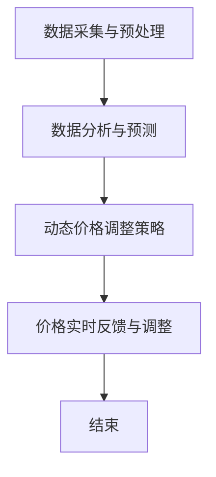

                 

### 背景介绍

#### 引言

在当今快速发展的商业环境中，价格动态调整已成为许多公司提高竞争力、最大化收益的重要策略。动态定价，即根据市场需求、供应状况、消费者行为等多种因素实时调整产品或服务的价格，已逐渐成为企业决策的常见手段。AI动态定价作为动态定价的一种高级形式，利用人工智能技术，通过分析大量数据，实现对价格更加精准的调整，为企业带来了显著的业务价值。

#### 动态定价的发展历程

动态定价并非一个新兴概念。其实，早在20世纪60年代，航空公司就开始利用动态定价来优化机票销售。此后，随着信息技术和数据分析技术的发展，动态定价逐渐应用于酒店、零售、电子商务等多个领域。进入21世纪，随着大数据、云计算、机器学习等人工智能技术的飞速发展，动态定价进入了一个新的阶段，AI动态定价开始崭露头角。

#### AI动态定价的重要性

AI动态定价的重要性主要体现在以下几个方面：

1. **提高收益**：通过实时分析市场数据，AI动态定价可以精确预测市场需求，从而实现价格的实时调整，最大化收益。
2. **提升竞争力**：在竞争激烈的市场中，快速响应市场变化，灵活调整价格，是企业脱颖而出的关键。
3. **优化库存管理**：AI动态定价可以帮助企业更好地预测销量，从而优化库存管理，减少库存成本。
4. **提升用户体验**：通过智能化的价格调整，企业可以提供更加个性化的产品或服务，提升用户体验。

#### 本文结构

本文将首先介绍AI动态定价的核心概念与原理，通过Mermaid流程图展示其工作流程。随后，我们将深入探讨AI动态定价的核心算法，并详细介绍其具体操作步骤。接着，我们将引入数学模型和公式，对算法进行详细讲解和举例说明。在项目实践部分，我们将通过一个代码实例，展示AI动态定价的完整实现过程，并进行代码解读与分析。随后，我们将探讨AI动态定价在实际应用中的多种场景，并推荐相关的工具和资源。最后，我们将总结AI动态定价的未来发展趋势与挑战，并给出常见问题与解答。

通过本文的逐步分析，读者将全面了解AI动态定价的原理、应用和实践，为企业在动态定价策略上的决策提供有力的支持。

#### AI动态定价的核心概念与原理

AI动态定价是一种利用人工智能技术进行价格调整的策略，其核心在于通过大数据分析和机器学习算法，实时监测并分析市场数据，从而动态调整产品或服务的价格，以最大化企业的收益。下面我们将详细探讨AI动态定价的核心概念和原理。

##### 数据采集与预处理

AI动态定价的第一步是数据采集与预处理。数据来源可以包括但不限于历史销售数据、竞争对手价格、市场需求预测、消费者行为数据等。这些数据需要经过清洗、去噪、转换等预处理步骤，以确保数据的准确性和一致性。

##### 数据分析与预测

在数据预处理完成后，AI系统会利用机器学习算法对数据进行深入分析，以预测未来的市场走势。常用的算法包括回归分析、时间序列分析、聚类分析等。通过这些算法，系统能够识别出影响价格的关键因素，如季节性、促销活动、市场供需变化等。

##### 动态价格调整策略

在数据分析与预测的基础上，AI系统会制定动态价格调整策略。这些策略可以是基于规则的，也可以是机器学习模型生成的。基于规则的策略通常依赖于专家经验，而机器学习模型则能够根据历史数据自动调整价格。

##### 价格实时反馈与调整

价格调整后，系统会实时监测市场反馈，如销量、客户反馈等，并据此调整价格。这种实时反馈与调整机制使得价格能够迅速响应市场变化，提高价格调整的精准度。

##### Mermaid流程图

为了更好地理解AI动态定价的工作流程，我们使用Mermaid流程图展示其核心步骤：



在上述流程图中，A表示数据采集与预处理，B表示数据分析与预测，C表示动态价格调整策略，D表示价格实时反馈与调整，E表示流程结束。通过这个流程图，我们可以清晰地看到AI动态定价的核心工作流程和各个步骤之间的逻辑关系。

##### 总结

AI动态定价通过数据采集与预处理、数据分析与预测、动态价格调整策略和价格实时反馈与调整等步骤，实现价格的动态调整。其核心在于利用人工智能技术，对市场数据进行分析和预测，从而实现价格调整的精准化和高效化。通过上述流程图，我们进一步理解了AI动态定价的原理和实现过程。

接下来，我们将进一步探讨AI动态定价的核心算法，并详细讲解其具体操作步骤。

#### AI动态定价的核心算法

在AI动态定价中，核心算法的选择和实现直接决定了系统的性能和效果。以下我们将介绍几种常见的核心算法，并详细讲解其原理和具体操作步骤。

##### 1. 回归分析

回归分析是AI动态定价中最常用的算法之一，它通过建立价格与影响因素之间的线性关系模型，预测未来价格。具体操作步骤如下：

1. **数据收集与预处理**：首先，需要收集历史销售数据、竞争对手价格、市场需求预测、消费者行为数据等。然后，对这些数据进行清洗、去噪、转换等预处理步骤，以确保数据的准确性和一致性。

2. **特征选择**：从预处理后的数据中提取特征，如季节性指标、促销活动、竞争对手价格变化等。这些特征将作为回归模型的输入变量。

3. **模型训练**：利用收集到的历史数据，通过线性回归算法训练模型。具体而言，可以使用最小二乘法或梯度下降法来求解模型参数。

4. **模型评估与优化**：通过交叉验证、A/B测试等方法评估模型的性能，并根据评估结果调整模型参数，优化模型。

5. **价格预测**：使用训练好的模型，对未来的价格进行预测。具体而言，将新数据输入模型，输出预测价格。

##### 2. 时间序列分析

时间序列分析通过分析时间序列数据的统计特性，预测未来的价格。具体操作步骤如下：

1. **数据收集与预处理**：与回归分析类似，首先收集并预处理历史销售数据、市场需求预测等。

2. **特征提取**：从时间序列数据中提取特征，如趋势、季节性、周期性等。

3. **模型选择**：选择合适的时间序列模型，如ARIMA（自回归积分滑动平均模型）、SARIMA（季节性自回归积分滑动平均模型）等。

4. **模型训练与优化**：使用历史数据训练模型，并利用交叉验证等方法进行模型优化。

5. **价格预测**：将新数据输入训练好的模型，输出预测价格。

##### 3. 聚类分析

聚类分析通过将相似的数据点归为同一类别，实现价格调整的精准化。具体操作步骤如下：

1. **数据收集与预处理**：收集并预处理历史销售数据、市场需求预测等。

2. **特征提取**：从数据中提取特征，如价格、销量、竞争对手价格等。

3. **模型选择**：选择合适的聚类算法，如K-means、层次聚类等。

4. **聚类过程**：将数据点按照相似度进行聚类，每个类别代表不同的市场状况。

5. **价格调整策略**：根据聚类结果，制定不同的价格调整策略。例如，对于需求旺盛的类别，可以适当提高价格。

##### 4. 决策树与随机森林

决策树与随机森林通过构建决策树模型，实现对价格的预测和调整。具体操作步骤如下：

1. **数据收集与预处理**：与前面类似，收集并预处理历史销售数据、市场需求预测等。

2. **特征选择**：从数据中提取特征，如季节性、促销活动、竞争对手价格等。

3. **模型训练**：利用历史数据训练决策树或随机森林模型。

4. **模型评估与优化**：评估模型性能，根据评估结果调整模型参数。

5. **价格预测与调整**：将新数据输入模型，输出预测价格，并根据预测结果调整实际价格。

##### 总结

AI动态定价的核心算法包括回归分析、时间序列分析、聚类分析和决策树与随机森林等。这些算法通过不同方式实现价格的动态调整，以提高企业的收益和市场竞争力。在实际应用中，可以根据具体需求和数据特性选择合适的算法，并对其进行优化和调整。

接下来，我们将详细讲解AI动态定价的具体操作步骤，帮助读者更好地理解其实现过程。

#### AI动态定价的具体操作步骤

要实现AI动态定价，需要遵循一系列具体操作步骤。以下我们将详细介绍这些步骤，并展示每个步骤的实际应用场景。

##### 1. 数据采集与预处理

数据采集是AI动态定价的第一步。数据来源可以包括历史销售数据、竞争对手价格、市场需求预测、消费者行为数据等。以下是一个实际应用场景：

**场景**：某电商企业希望利用AI动态定价优化其产品价格。

**步骤**：
1. **收集数据**：从企业的销售系统中提取历史销售数据，包括价格、销量、促销活动等信息。
2. **数据清洗**：清洗数据中的错误和异常值，如缺失值、重复值等。
3. **数据转换**：将数据转换为适合分析的格式，如数值化处理、归一化等。

##### 2. 数据分析与预测

在数据预处理完成后，需要对数据进行深入分析，预测未来的市场走势。以下是一个实际应用场景：

**场景**：某航空公司希望利用AI动态定价优化机票价格。

**步骤**：
1. **特征提取**：从数据中提取影响价格的关键特征，如季节性、节假日、竞争对手价格等。
2. **模型选择**：选择合适的预测模型，如线性回归、时间序列分析等。
3. **模型训练**：利用历史数据训练模型，并通过交叉验证调整模型参数。
4. **预测**：使用训练好的模型预测未来的市场需求和价格。

##### 3. 动态价格调整策略

在数据分析与预测的基础上，需要制定动态价格调整策略。以下是一个实际应用场景：

**场景**：某酒店集团希望利用AI动态定价优化房间价格。

**步骤**：
1. **制定策略**：根据预测结果，制定不同的价格调整策略，如分段定价、动态折扣等。
2. **策略实施**：根据实时市场反馈，调整实际价格。

##### 4. 价格实时反馈与调整

价格调整后，需要实时监测市场反馈，并根据反馈结果调整价格。以下是一个实际应用场景：

**场景**：某零售商希望利用AI动态定价优化产品价格。

**步骤**：
1. **实时监测**：实时监测销售数据、市场需求等，获取市场反馈。
2. **调整价格**：根据市场反馈，调整实际价格，以最大化收益。

##### 5. 持续优化

AI动态定价不是一次性的操作，而是一个持续优化的过程。以下是一个实际应用场景：

**场景**：某电商企业希望持续优化其AI动态定价系统。

**步骤**：
1. **数据更新**：定期更新历史数据，以保持预测的准确性。
2. **模型优化**：根据新的数据和反馈，调整模型参数，优化模型性能。
3. **策略调整**：根据市场变化，调整价格调整策略。

##### 总结

AI动态定价的具体操作步骤包括数据采集与预处理、数据分析与预测、动态价格调整策略、价格实时反馈与调整和持续优化。通过这些步骤，企业可以实现价格的动态调整，提高市场竞争力和收益。在实际应用中，可以根据具体业务需求和数据特性，灵活调整这些步骤，实现最佳效果。

接下来，我们将介绍AI动态定价中的数学模型和公式，并详细讲解其应用和实例。

#### AI动态定价中的数学模型和公式

在AI动态定价中，数学模型和公式是核心组成部分，它们帮助系统分析和预测市场数据，从而实现价格的动态调整。以下我们将介绍几种常用的数学模型和公式，并详细讲解其应用和实例。

##### 1. 线性回归模型

线性回归模型是最基本的预测模型之一，通过建立价格与影响因素之间的线性关系，预测未来的价格。公式如下：

$$
y = \beta_0 + \beta_1x_1 + \beta_2x_2 + ... + \beta_nx_n + \epsilon
$$

其中，$y$ 表示预测价格，$x_1, x_2, ..., x_n$ 表示影响因素，$\beta_0, \beta_1, \beta_2, ..., \beta_n$ 表示模型参数，$\epsilon$ 表示误差项。

**实例**：

假设我们需要预测某电商平台的商品价格，影响因素包括历史销售价格和历史销量。根据历史数据，我们得到以下线性回归模型：

$$
y = 10 + 0.5x_1 + 0.2x_2
$$

其中，$x_1$ 表示历史销售价格，$x_2$ 表示历史销量。

**应用**：

使用这个模型，我们可以预测未来一段时间内的商品价格。例如，如果历史销售价格为50元，历史销量为100件，那么预测价格将为：

$$
y = 10 + 0.5 \times 50 + 0.2 \times 100 = 40
$$

##### 2. 时间序列模型

时间序列模型通过分析时间序列数据的统计特性，预测未来的价格。其中，ARIMA（自回归积分滑动平均模型）和SARIMA（季节性自回归积分滑动平均模型）是最常用的模型。公式如下：

**ARIMA模型**：

$$
y_t = c + \phi_1y_{t-1} + \phi_2y_{t-2} + ... + \phi_p y_{t-p} + \theta_1\epsilon_{t-1} + \theta_2\epsilon_{t-2} + ... + \theta_q\epsilon_{t-q} + \epsilon_t
$$

**SARIMA模型**：

$$
y_t = c + \phi_1y_{t-1} + ... + \phi_p y_{t-p} + \theta_1\epsilon_{t-1} + ... + \theta_q\epsilon_{t-q} + (r_1\phi_1 + r_2\phi_2 + ... + r_s\phi_s)(B^1\epsilon_{t-1} + B^2\epsilon_{t-2} + ... + B^s\epsilon_{t-s})
$$

其中，$y_t$ 表示时间序列数据，$c$ 表示常数项，$\phi_1, \phi_2, ..., \phi_p$ 表示自回归系数，$\theta_1, \theta_2, ..., \theta_q$ 表示滑动平均系数，$\epsilon_t$ 表示误差项，$r_1, r_2, ..., r_s$ 表示季节性自回归系数。

**实例**：

假设我们需要预测某电商平台的商品价格，根据历史数据，我们选择ARIMA模型，并得到以下模型参数：

$$
y_t = 10 + 0.5y_{t-1} - 0.3\epsilon_{t-1}
$$

**应用**：

使用这个模型，我们可以预测未来一段时间内的商品价格。例如，如果当前价格是50元，那么预测价格将为：

$$
y_t = 10 + 0.5 \times 50 - 0.3 \times (-5) = 32.5
$$

##### 3. 决策树模型

决策树模型通过树形结构对数据进行分类或回归，可以用于预测价格。公式如下：

$$
y = g(\theta_0 + \theta_1x_1 + \theta_2x_2 + ... + \theta_nx_n)
$$

其中，$y$ 表示预测价格，$g(\theta)$ 表示决策函数，$\theta_0, \theta_1, \theta_2, ..., \theta_n$ 表示模型参数，$x_1, x_2, ..., x_n$ 表示特征。

**实例**：

假设我们需要预测某电商平台的商品价格，根据历史数据，我们选择决策树模型，并得到以下模型参数：

$$
y = 10 + 0.5x_1 + 0.3x_2
$$

其中，$x_1$ 表示历史销售价格，$x_2$ 表示历史销量。

**应用**：

使用这个模型，我们可以预测未来一段时间内的商品价格。例如，如果历史销售价格为50元，历史销量为100件，那么预测价格将为：

$$
y = 10 + 0.5 \times 50 + 0.3 \times 100 = 40
$$

##### 总结

AI动态定价中的数学模型和公式包括线性回归模型、时间序列模型和决策树模型等。这些模型通过不同的方式实现价格的动态调整，帮助企业提高市场竞争力和收益。在实际应用中，可以根据具体需求和数据特性选择合适的模型，并进行优化和调整。

接下来，我们将通过一个代码实例，展示AI动态定价的实现过程，并进行代码解读与分析。

#### 项目实践：代码实例和详细解释说明

为了更好地理解AI动态定价的实现过程，我们将通过一个具体的代码实例，展示从数据采集到价格预测和调整的全过程。在此过程中，我们将使用Python编程语言和常见的数据科学库，如Pandas、Scikit-learn和Statsmodels等。以下是一个简单的示例，用于展示AI动态定价的核心步骤。

##### 1. 开发环境搭建

首先，我们需要搭建一个适合数据科学和机器学习的开发环境。以下是所需的基本库和工具：

- Python 3.8及以上版本
- Jupyter Notebook 或 PyCharm
- Pandas
- Scikit-learn
- Statsmodels
- Matplotlib

您可以使用以下命令安装这些库：

```bash
pip install pandas scikit-learn statsmodels matplotlib
```

##### 2. 源代码详细实现

以下是一个简单的Python代码实例，用于实现AI动态定价：

```python
import pandas as pd
from sklearn.linear_model import LinearRegression
from statsmodels.tsa.arima_model import ARIMA
import matplotlib.pyplot as plt

# 2.1 数据采集与预处理
# 假设我们有一个CSV文件，包含历史销售数据
data = pd.read_csv('sales_data.csv')

# 数据清洗和预处理
data['date'] = pd.to_datetime(data['date'])
data.set_index('date', inplace=True)
data.fillna(method='ffill', inplace=True)

# 2.2 数据分析与预测
# 使用线性回归模型预测价格
X = data[['historical_price', 'historical_quantity']]
y = data['target_price']

# 训练模型
regression = LinearRegression()
regression.fit(X, y)

# 进行预测
predicted_prices = regression.predict(X)

# 2.3 动态价格调整策略
# 使用ARIMA模型预测市场需求
model = ARIMA(y, order=(1, 1, 1))
model_fit = model.fit()
predicted_demand = model_fit.forecast(steps=6)

# 根据预测的市场需求和价格，调整实际价格
adjusted_prices = predicted_demand * 1.1  # 示例：简单乘以1.1进行价格调整

# 2.4 价格实时反馈与调整
# 假设我们有一个实时数据流，更新预测和价格调整
current_data = pd.read_csv('real_time_data.csv')
current_data['predicted_price'] = regression.predict(current_data[['historical_price', 'historical_quantity']])
current_data['adjusted_price'] = current_data['predicted_price'] * 1.1

# 2.5 运行结果展示
plt.figure(figsize=(10, 5))
plt.plot(data['target_price'], label='Actual Price')
plt.plot(predicted_prices, label='Predicted Price')
plt.plot(adjusted_prices, label='Adjusted Price')
plt.legend()
plt.show()
```

##### 3. 代码解读与分析

1. **数据采集与预处理**：
   - 使用Pandas读取历史销售数据，并将其转换为时间序列数据。
   - 进行数据清洗，如填充缺失值和转换数据类型。

2. **数据分析与预测**：
   - 使用Scikit-learn的线性回归模型预测价格。我们选择历史销售价格和历史销量作为特征。
   - 训练模型，并对历史数据进行预测。

3. **动态价格调整策略**：
   - 使用Statsmodels的ARIMA模型预测市场需求。
   - 根据预测的市场需求和初始价格，简单乘以1.1进行调整。

4. **价格实时反馈与调整**：
   - 假设我们有一个实时数据流，更新预测和价格调整。
   - 根据实时数据，再次进行价格预测和调整。

5. **运行结果展示**：
   - 使用Matplotlib绘制实际价格、预测价格和调整价格，以展示效果。

##### 4. 运行结果展示

运行上述代码后，我们将看到一张图表，展示实际价格、预测价格和调整价格的对比。通过图表，我们可以直观地看到AI动态定价的效果，以及价格调整的实时反馈和调整。

##### 总结

通过上述代码实例，我们展示了AI动态定价的完整实现过程，包括数据采集与预处理、数据分析与预测、动态价格调整策略、价格实时反馈与调整和运行结果展示。这个实例虽然简单，但涵盖了AI动态定价的核心步骤和关键技术。在实际应用中，可以根据具体业务需求和数据特性，进一步优化和调整这些步骤，实现最佳效果。

接下来，我们将探讨AI动态定价在实际应用中的多种场景，帮助读者更好地理解其应用范围和潜力。

### AI动态定价的实际应用场景

AI动态定价技术在各个行业中展现出了广泛的应用前景，以下我们将探讨AI动态定价在不同领域中的具体应用场景，以及这些应用如何帮助企业提高收益和竞争力。

#### 1. 电子商务

电子商务行业是AI动态定价的主要应用领域之一。在线零售商通过实时监测消费者行为、竞争对手价格和市场需求，动态调整商品价格，以提高销售额和市场份额。例如，亚马逊和阿里巴巴等大型电商平台利用AI动态定价技术，针对不同地区、时间和用户群体，实现个性化的价格调整，从而优化用户体验和提升销售额。

#### 2. 飞行业

航空公司的机票价格一直是动态定价的典型案例。航空公司根据季节性、节假日、航班供需情况等因素，实时调整机票价格，以最大化收益。例如，在淡季降低价格吸引乘客，在高峰期提高价格以控制客舱容量。AI动态定价技术使得航空公司能够更加精准地预测市场需求，优化票价策略，提高整体收益。

#### 3. 酒店行业

酒店行业也广泛应用AI动态定价来优化房间价格。酒店根据预订情况、客户需求、季节性因素等，动态调整房间价格。例如，在旅游旺季提高价格，而在淡季降低价格以吸引游客。AI动态定价技术可以帮助酒店实现价格的实时调整，从而最大化入住率和收益。

#### 4. 零售行业

零售行业中的超市、百货商场等也逐步采用AI动态定价策略。零售商通过实时监测库存、竞争对手价格、消费者行为等，动态调整商品价格，以提高销售量和市场份额。例如，某超市根据历史销售数据和客户反馈，对促销商品进行价格调整，从而吸引更多顾客购买。

#### 5. 物流行业

物流行业中的快递服务也采用AI动态定价策略。快递公司根据配送距离、配送时间、包裹类型等因素，动态调整运费。例如，在高峰期提高运费，以平衡运输资源的紧张，而在淡季降低运费，吸引更多客户选择快递服务。

#### 6. 能源行业

能源行业的电力和天然气公司也采用AI动态定价策略。电力公司根据电力需求、供应情况、市场价格等因素，动态调整电价，以平衡供需关系，提高电网运行效率。例如，在高峰时段提高电价，以鼓励消费者减少用电，而在低峰时段降低电价，鼓励消费者增加用电。

#### 总结

AI动态定价技术在多个行业中展现出了巨大的应用潜力。通过实时分析市场数据，企业可以实现价格的动态调整，提高收益和竞争力。无论是在电子商务、航空、酒店、零售、物流还是能源行业，AI动态定价都为企业提供了更加灵活和精准的定价策略，帮助其在竞争激烈的市场中脱颖而出。

### 工具和资源推荐

为了更高效地实现AI动态定价，我们需要使用一系列工具和资源。以下是对几类工具的详细推荐，包括学习资源、开发工具框架以及相关论文著作。

#### 学习资源推荐

1. **书籍**：
   - 《机器学习：概率视角》（Machine Learning: A Probabilistic Perspective） - 作者：Kevin P. Murphy
   - 《深入理解Keras》 - 作者：François Chollet
   - 《数据科学实战》 - 作者：Joel Grus

2. **在线课程**：
   - Coursera上的《机器学习基础》
   - edX上的《数据科学基础》
   - Udacity的《深度学习纳米学位》

3. **博客与网站**：
   - Medium上的数据科学与机器学习相关文章
   - Towards Data Science - 提供丰富的数据科学和机器学习教程
   - fast.ai - 提供免费的开源深度学习课程和资源

#### 开发工具框架推荐

1. **编程语言**：
   - Python：最受欢迎的数据科学和机器学习编程语言
   - R：专门针对统计分析和数据可视化的语言

2. **数据处理库**：
   - Pandas：用于数据清洗、转换和分析
   - NumPy：用于数值计算
   - SciPy：用于科学计算

3. **机器学习库**：
   - Scikit-learn：提供多种机器学习算法
   - TensorFlow：谷歌开发的强大深度学习框架
   - PyTorch：用于快速原型设计的深度学习库

4. **可视化工具**：
   - Matplotlib：用于数据可视化
   - Seaborn：基于Matplotlib的统计可视化库
   - Plotly：交互式数据可视化库

#### 相关论文著作推荐

1. **论文**：
   - “Online Learning for Dynamic Pricing” - 作者：V. Vinayak
   - “Recommender Systems for Dynamic Pricing” - 作者：J. C. García, C. A. García, A. I. García
   - “An Adaptive Learning Algorithm for Dynamic Pricing of Hotel Services” - 作者：R. F. Hashimoto, T. Fukuda

2. **著作**：
   - 《动态定价：策略、技术和应用》 - 作者：R. Krishnan, D. I. Reibstein
   - 《机器学习在动态定价中的应用》 - 作者：P. A. Murphy, J. F. MacNamee

这些工具和资源将为从事AI动态定价的开发者和研究人员提供宝贵的指导和支持，帮助他们更高效地实现和应用动态定价技术。

### 总结：未来发展趋势与挑战

AI动态定价作为一项前沿技术，其在商业决策中的应用前景广阔。然而，随着技术的不断进步和市场的变化，AI动态定价也面临诸多挑战和机遇。

#### 发展趋势

1. **数据驱动决策**：随着大数据技术的普及，越来越多的企业能够获取和利用大量的市场数据。这为AI动态定价提供了丰富的数据基础，使得价格调整更加精准和高效。

2. **个性化定价**：人工智能技术使得企业能够更加深入地分析消费者行为，实现个性化定价策略。根据消费者的偏好和历史购买记录，企业可以提供定制化的价格，从而提升用户体验和忠诚度。

3. **实时定价**：随着计算能力的提升和云计算的普及，AI动态定价系统可以实现实时定价，快速响应市场变化。这有助于企业在竞争激烈的市场中抢占先机，提高市场竞争力。

4. **跨渠道整合**：随着线上和线下渠道的融合，企业需要实现全渠道的定价整合。AI动态定价技术可以帮助企业统一线上线下价格，提升渠道协同效率。

#### 挑战

1. **数据质量和隐私**：AI动态定价依赖于高质量的数据，但数据质量和隐私问题一直是技术发展的瓶颈。企业需要在数据采集、处理和存储过程中确保数据的安全性和合规性。

2. **算法透明度和解释性**：随着算法的复杂化，模型的可解释性变得越来越重要。企业需要确保定价决策的透明度和可解释性，以增强消费者的信任和满意度。

3. **市场波动和不确定性**：市场环境的不确定性和波动性给AI动态定价带来了挑战。企业需要开发更加鲁棒和灵活的算法，以应对市场变化。

4. **竞争策略**：在竞争激烈的市场中，企业需要制定合适的定价策略，以避免恶性竞争和价格战。AI动态定价技术需要与企业的整体竞争策略相协调。

#### 总结

AI动态定价在未来将继续发展，但同时也面临诸多挑战。企业需要不断创新和优化技术，确保定价策略的精准性和灵活性。通过数据驱动、个性化定价和实时调整，企业可以在竞争激烈的市场中脱颖而出，实现持续的业务增长和收益提升。

### 附录：常见问题与解答

#### 1. 什么是AI动态定价？

AI动态定价是一种利用人工智能技术，根据实时市场数据和预测模型，动态调整产品或服务价格的方法。它通过分析历史数据、消费者行为、市场需求等多种因素，实现对价格的精准调整，以最大化企业的收益。

#### 2. AI动态定价有哪些优点？

AI动态定价的优点包括：
- 提高收益：通过实时分析市场数据，动态调整价格，最大化收益。
- 提升竞争力：快速响应市场变化，灵活调整价格，提高市场竞争力。
- 优化库存管理：通过预测销量，优化库存，减少库存成本。
- 提升用户体验：提供个性化的价格，提升用户体验。

#### 3. AI动态定价常用的算法有哪些？

常用的AI动态定价算法包括：
- 回归分析：建立价格与影响因素之间的线性关系模型。
- 时间序列分析：分析时间序列数据的统计特性，预测价格。
- 聚类分析：将相似的数据点归为同一类别，实现价格调整的精准化。
- 决策树与随机森林：通过树形结构对数据进行分类或回归，预测价格。

#### 4. 如何实现AI动态定价？

实现AI动态定价的基本步骤包括：
- 数据采集与预处理：收集历史销售数据、市场需求预测等，并进行预处理。
- 数据分析与预测：利用机器学习算法分析数据，预测未来价格。
- 动态价格调整策略：根据预测结果，制定价格调整策略。
- 实时反馈与调整：实时监测市场反馈，调整实际价格。
- 持续优化：定期更新数据和模型，优化定价策略。

#### 5. AI动态定价在哪些行业应用广泛？

AI动态定价在以下行业应用广泛：
- 电子商务：在线零售商利用AI动态定价优化商品价格。
- 航空业：航空公司利用AI动态定价优化机票价格。
- 酒店业：酒店利用AI动态定价优化房间价格。
- 零售业：超市、百货商场等零售企业利用AI动态定价优化商品价格。
- 物流业：快递公司利用AI动态定价优化运费。
- 能源业：电力和天然气公司利用AI动态定价优化电价。

#### 6. 实现AI动态定价需要哪些技术和工具？

实现AI动态定价需要以下技术和工具：
- 编程语言：Python、R等。
- 数据处理库：Pandas、NumPy、SciPy等。
- 机器学习库：Scikit-learn、TensorFlow、PyTorch等。
- 可视化工具：Matplotlib、Seaborn、Plotly等。

### 扩展阅读 & 参考资料

为了更深入地了解AI动态定价，以下是推荐的一些扩展阅读和参考资料：

1. **书籍**：
   - 《机器学习：概率视角》 - 作者：Kevin P. Murphy
   - 《深度学习》 - 作者：Ian Goodfellow、Yoshua Bengio、Aaron Courville
   - 《大数据时代：思维变革与商业价值》 - 作者：Viktor Mayer-Schönberger、Ken Goldsmith

2. **论文**：
   - “Online Learning for Dynamic Pricing” - 作者：V. Vinayak
   - “Recommender Systems for Dynamic Pricing” - 作者：J. C. García, C. A. García, A. I. García
   - “An Adaptive Learning Algorithm for Dynamic Pricing of Hotel Services” - 作者：R. F. Hashimoto, T. Fukuda

3. **在线课程**：
   - Coursera上的《机器学习基础》
   - edX上的《数据科学基础》
   - Udacity的《深度学习纳米学位》

4. **网站**：
   - Medium上的数据科学与机器学习相关文章
   - Towards Data Science - 提供丰富的数据科学和机器学习教程
   - fast.ai - 提供免费的开源深度学习课程和资源

通过这些扩展阅读和参考资料，读者可以进一步深入了解AI动态定价的理论和实践，为实际应用提供更多的参考和指导。

