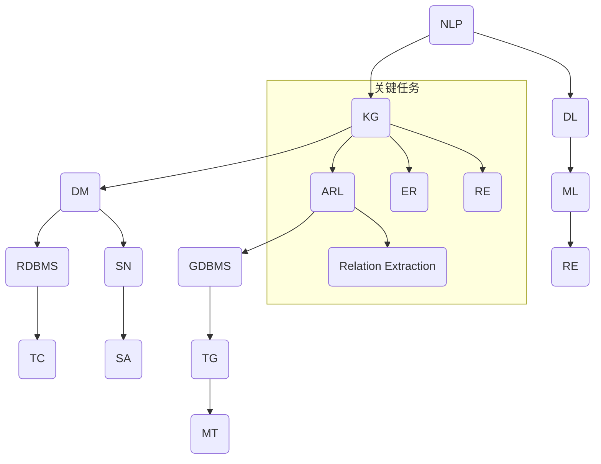

                 

### 1. 背景介绍

**AI 助力人类知识扩展的方式**

随着人工智能（AI）技术的飞速发展，我们正逐步迈向一个全新的智能时代。在这个时代，AI 已不再仅仅是一个学术研究或工业应用的领域，它已经深入到我们日常生活的各个方面，并且正在深刻改变我们获取、处理和应用知识的方式。本文将探讨 AI 如何通过多种方式助力人类知识的扩展，提升我们认知和理解世界的能力。

**人工智能的定义与分类**

人工智能（Artificial Intelligence，简称 AI）是指由人制造出来的系统所表现出的智能行为，它模仿或延伸了人类的认知能力。根据其应用范围和实现方式，AI 可以分为以下几类：

- **弱 AI（弱人工智能）**：这类 AI 专注于特定任务，比如语音识别、图像处理、自然语言处理等。弱 AI 的能力有限，仅限于在其训练范围内进行操作。

- **强 AI（强人工智能）**：强 AI 拥有类似于人类的高层次认知能力，能够自主思考、学习和解决问题。目前，强 AI 还处于理论阶段，尚未实现。

- **通用 AI（AGI，Artificial General Intelligence）**：通用 AI 是一种能够像人类一样理解和处理各种问题的智能体，能够在任何领域表现优异。这是 AI 领域的终极目标。

**AI 的发展历程**

AI 的历史可以追溯到 20 世纪 50 年代。从最初的符号主义 AI 到连接主义 AI，再到现代的深度学习 AI，每一步都代表了人类对智能本质认识的深入和技术的进步。

- **符号主义 AI（Symbolic AI）**：基于符号逻辑和知识表示的 AI，主要通过符号操作和推理来解决问题。代表人物包括约翰·麦卡锡（John McCarthy）和赫伯特·西蒙（Herbert Simon）。

- **连接主义 AI（Connectionist AI）**：基于神经网络和并行计算，通过调整网络中神经元的连接强度来学习和解决问题。代表人物包括杰弗里·霍普菲尔德（Jeffrey Hopfield）和约翰·霍普菲尔德（John Hopfield）。

- **深度学习 AI（Deep Learning AI）**：基于多层神经网络，通过大量数据训练模型，实现高效的特征提取和模式识别。代表人物包括杨立昆（Yann LeCun）、杰弗里·辛顿（Jeffrey Dean Hinton）和伊恩·古德费洛（Ian Goodfellow）。

**AI 在知识扩展中的应用**

AI 在知识扩展中的应用主要体现在以下几个方面：

- **知识发现与数据挖掘**：通过分析大量数据，AI 可以发现新的知识模式和关联，帮助人类更好地理解和应用这些知识。

- **自然语言处理**：通过理解和生成自然语言，AI 可以帮助我们更高效地获取和处理文本信息，从而扩展我们的知识视野。

- **知识图谱与语义网络**：通过构建知识图谱和语义网络，AI 可以帮助我们更好地组织和理解复杂知识体系。

- **自动化推理与问题解决**：通过自动化推理和问题解决，AI 可以帮助我们更快速地找到解决问题的方法，提高知识应用效率。

**人工智能与知识扩展的相互关系**

人工智能与知识扩展之间存在密切的相互关系。一方面，AI 技术的发展为人类提供了更高效的知识获取和处理手段；另一方面，人类在 AI 技术应用中积累的知识又为 AI 的进一步发展提供了丰富的数据资源。

总之，随着 AI 技术的不断进步，我们可以预见，未来 AI 将在知识扩展方面发挥越来越重要的作用，为人类认知能力的提升带来新的机遇和挑战。

## 1.1 人类知识扩展的历史与现状

人类的知识扩展是一个长期的、持续的过程，它伴随着人类文明的发展而不断推进。从古至今，人类通过语言、文字、科技等方式，不断积累和传播知识，从而拓展我们的认知边界。

在古代，知识主要依赖于口头传承和文字记载。人们通过语言交流，将经验和知识传递给后代。随着文字的出现，知识得以被系统地记录和保存，为后世的学术研究奠定了基础。

进入中世纪，随着宗教和科学的兴起，知识扩展的速度明显加快。人们开始通过实验和观察，探索自然界的规律，积累了大量的科学知识。这些知识不仅推动了科学革命，也为工业革命的到来奠定了基础。

工业革命后，人类的知识体系迅速膨胀。随着印刷术的发明和普及，知识的传播速度大大加快。人们可以通过阅读书籍、报纸、杂志等渠道，获取丰富的知识。同时，科技的发展使得知识的应用范围不断扩大，从自然科学到社会科学，从理论研究到实际应用，知识扩展的领域不断拓宽。

进入信息化时代，互联网的出现极大地改变了人类获取和处理知识的方式。人们可以通过搜索引擎，在短时间内获取大量相关信息。同时，社交媒体和在线教育平台也为知识的传播和共享提供了新的途径。在这个时代，知识不再是少数人的专利，而是广泛传播和共享的公共资源。

然而，随着知识量的爆炸式增长，人类面临着知识过载的问题。如何从海量信息中筛选出有价值的内容，如何将零散的知识整合成系统化的知识体系，成为现代知识扩展的新挑战。

**AI 在解决知识过载问题中的作用**

人工智能技术在解决知识过载问题中发挥了重要作用。通过自然语言处理、知识图谱、推荐系统等技术，AI 可以帮助我们更高效地获取和处理知识。

首先，AI 可以通过对海量文本的自动分析，提取出关键信息和知识要点。例如，利用自然语言处理技术，我们可以从大量的学术论文、新闻报道、图书资料中，快速找到相关的研究成果和观点。

其次，AI 可以通过构建知识图谱，将分散的知识点进行整合和关联。知识图谱不仅可以帮助我们更清晰地理解知识体系，还可以为我们提供更加精准的知识检索和推荐服务。

此外，AI 还可以通过个性化推荐系统，根据用户的需求和兴趣，为其推荐最相关的知识和信息。这种基于用户数据的推荐机制，不仅可以节省用户的时间，还可以提高知识获取的效率。

总之，AI 技术在解决知识过载问题方面具有显著的优势。通过高效的知识获取、整合和推荐，AI 可以帮助我们更轻松地应对信息爆炸带来的挑战，实现知识的有效扩展。

## 1.2 AI 助力知识扩展的关键技术与原理

在深入探讨人工智能如何助力人类知识扩展之前，我们需要了解一些关键的技术和原理。这些技术涵盖了自然语言处理、知识图谱、深度学习等，它们是 AI 助力知识扩展的基础。

**自然语言处理（NLP）**

自然语言处理是人工智能的一个重要分支，它的目标是使计算机能够理解和生成自然语言。通过自然语言处理，计算机可以分析文本、理解语义、提取关键信息，从而帮助我们更高效地获取和处理知识。

NLP 技术主要包括以下几个方面：

- **分词（Tokenization）**：将文本分解成单词或短语，以便进行后续处理。

- **词性标注（Part-of-Speech Tagging）**：为每个词分配一个词性标签，如名词、动词、形容词等。

- **句法分析（Parsing）**：分析句子的结构，确定词语之间的语法关系。

- **语义分析（Semantic Analysis）**：理解句子或文本的语义内容，包括实体识别、关系抽取等。

- **文本分类（Text Classification）**：根据文本的内容将其分类到不同的类别。

- **情感分析（Sentiment Analysis）**：判断文本的情感倾向，如正面、负面、中性等。

自然语言处理的应用非常广泛，从搜索引擎到智能客服，从机器翻译到内容推荐，NLP 技术无处不在。在知识扩展方面，NLP 可以帮助我们自动分析和整理大量的文本数据，提取出有价值的信息，从而扩展我们的知识视野。

**知识图谱（Knowledge Graph）**

知识图谱是一种结构化的知识表示形式，它通过节点和边来表示实体及其关系。知识图谱能够将零散、分散的知识点进行整合和关联，形成一个统一的、可查询的知识体系。

知识图谱的主要功能包括：

- **实体识别（Entity Recognition）**：识别文本中的实体，如人名、地名、组织机构等。

- **关系抽取（Relation Extraction）**：提取实体之间的语义关系，如朋友、工作于、属于等。

- **链接预测（Link Prediction）**：预测未知的实体间关系，以扩展知识图谱。

- **知识融合（Knowledge Fusion）**：将不同来源的知识进行整合，提高知识的完整性和准确性。

知识图谱的应用场景非常广泛，如搜索引擎、推荐系统、智能问答等。通过知识图谱，我们可以更直观、更系统化地理解和应用知识，从而实现知识的扩展。

**深度学习（Deep Learning）**

深度学习是一种基于多层神经网络的学习方法，它通过模拟人脑神经网络的结构和功能，实现对复杂数据的自动特征提取和模式识别。

深度学习的关键技术和原理包括：

- **卷积神经网络（CNN，Convolutional Neural Network）**：适用于图像处理任务，通过卷积操作提取图像特征。

- **循环神经网络（RNN，Recurrent Neural Network）**：适用于序列数据，如语音、文本等，通过循环结构处理前后依赖关系。

- **长短期记忆网络（LSTM，Long Short-Term Memory）**：RNN 的改进版本，能够更好地处理长序列数据。

- **生成对抗网络（GAN，Generative Adversarial Network）**：通过两个对抗网络生成和鉴别真实数据和生成的数据，用于图像生成、语音合成等任务。

深度学习在图像识别、自然语言处理、语音识别等领域取得了显著的成果。通过深度学习，我们可以从大量的数据中自动提取出有用的特征，从而提高知识获取的效率和准确性。

**跨学科融合与综合应用**

自然语言处理、知识图谱和深度学习等技术虽然各有侧重，但它们之间也存在一定的交叉和融合。例如，知识图谱可以与自然语言处理结合，用于构建语义搜索引擎；深度学习可以与知识图谱结合，用于图像识别和文本生成等任务。

通过跨学科融合，AI 技术能够发挥更大的作用，为人类知识扩展提供更强大的支持。

## 1.3 AI 助力知识扩展的具体方式

在了解了人工智能的关键技术和原理后，我们可以进一步探讨 AI 如何通过具体的方式助力人类知识扩展。以下是几种常见的 AI 助力知识扩展的方式：

**1. 自动化知识获取与整合**

通过自然语言处理技术，AI 可以自动分析和整理大量的文本数据，提取出有价值的信息。例如，利用自然语言处理技术，我们可以从大量的学术论文、新闻报道、图书资料中，快速找到相关的研究成果和观点。此外，AI 还可以自动整理和整合这些信息，形成结构化的知识库，便于后续的查询和应用。

**2. 知识图谱构建与维护**

知识图谱是一种结构化的知识表示形式，它通过节点和边来表示实体及其关系。AI 可以通过实体识别、关系抽取等技术，自动构建和维护知识图谱。例如，我们可以利用知识图谱将各种领域的信息进行整合，形成一个统一的、可查询的知识体系。通过知识图谱，我们可以更直观、更系统化地理解和应用知识，从而实现知识的扩展。

**3. 个性化知识推荐**

AI 可以通过个性化推荐系统，根据用户的需求和兴趣，为其推荐最相关的知识和信息。这种基于用户数据的推荐机制，不仅可以节省用户的时间，还可以提高知识获取的效率。例如，在在线教育平台中，AI 可以根据学生的学习和兴趣，推荐相应的课程和学习资料，帮助学生更高效地扩展知识。

**4. 自动化知识推理与问题解决**

通过自动化推理和问题解决，AI 可以帮助我们更快速地找到解决问题的方法，提高知识应用效率。例如，在医疗领域，AI 可以通过分析大量的病例数据和医学知识，为医生提供诊断建议和治疗方案。在金融领域，AI 可以通过分析市场数据和金融知识，为投资者提供投资建议和风险管理策略。

**5. 知识可视化与传播**

AI 可以通过知识可视化技术，将复杂的知识体系以图形化的方式呈现，使得知识更易于理解和传播。例如，通过知识图谱、思维导图等技术，我们可以将各种领域的信息进行可视化展示，帮助人们更好地理解和掌握知识。此外，AI 还可以通过社交媒体、在线教育平台等渠道，将知识传播给更多的人，促进知识的普及和应用。

总之，AI 通过自动化知识获取与整合、知识图谱构建与维护、个性化知识推荐、自动化知识推理与问题解决以及知识可视化与传播等多种方式，助力人类知识的扩展，提升我们的认知能力。

### 2. 核心概念与联系

为了深入探讨 AI 如何助力人类知识扩展，我们需要了解一些核心概念和它们之间的联系。以下是本文中涉及的关键概念及其相互关系：

**自然语言处理（NLP）**

自然语言处理是人工智能的一个重要分支，它使计算机能够理解和生成自然语言。NLP 技术包括分词、词性标注、句法分析、语义分析等，主要用于文本数据的处理和分析。

**知识图谱（KG）**

知识图谱是一种用于表示实体及其关系的图形化数据结构。它通过节点（实体）和边（关系）来组织知识，使得数据更加结构化和易于查询。知识图谱在知识整合和推理中起着核心作用。

**深度学习（DL）**

深度学习是一种基于多层神经网络的学习方法，能够自动从数据中提取特征，并用于分类、预测和生成等任务。深度学习在图像识别、语音识别和自然语言处理等领域取得了显著成果。

**数据挖掘（DM）**

数据挖掘是一种通过分析大量数据，发现潜在模式和规律的过程。它广泛应用于知识发现、市场分析、风险管理和决策支持等领域。

**关联规则学习（ARL）**

关联规则学习是一种用于发现数据集中项之间关联关系的方法。它通过支持度和置信度等指标，识别出频繁出现的规则，帮助用户理解数据中的潜在模式。

**机器学习（ML）**

机器学习是一种使计算机能够通过数据学习和改进的方法。它包括监督学习、无监督学习和强化学习等，广泛应用于分类、回归、聚类和预测等任务。

**关系数据库（RDBMS）**

关系数据库是一种用于存储和查询数据的系统，它通过表、行和列来组织数据。关系数据库在数据管理和知识存储中发挥着重要作用。

**语义网络（SN）**

语义网络是一种基于语义关系的知识表示方法。它通过节点和边来表示概念及其关系，用于表示和推理知识。

**图数据库（GraphDB）**

图数据库是一种用于存储和查询图形数据的数据库。它通过图结构和图算法来优化数据的存储和查询效率，特别适用于知识图谱和社交网络等场景。

**实体识别（ER）**

实体识别是 NLP 中的一项任务，旨在从文本中识别出实体，如人名、地名、组织机构等。实体识别是知识图谱构建的基础。

**关系抽取（RE）**

关系抽取是 NLP 中的一项任务，旨在从文本中提取出实体之间的关系。关系抽取对于构建和丰富知识图谱至关重要。

**文本分类（TC）**

文本分类是一种将文本数据分为不同类别的任务。它广泛应用于情感分析、内容推荐和 spam detection 等场景。

**情感分析（SA）**

情感分析是一种用于分析文本情感极性（如正面、负面、中性）的方法。情感分析在市场调研、舆情监控和客户服务等领域具有广泛应用。

**文本生成（TG）**

文本生成是一种利用 NLP 和深度学习技术生成文本的方法。它广泛应用于对话系统、文本摘要和内容生成等场景。

**机器翻译（MT）**

机器翻译是一种将一种语言的文本自动翻译成另一种语言的方法。机器翻译在跨语言交流、多语言内容管理和国际化应用中具有重要作用。

**示例：Mermaid 流程图**

下面是一个示例，展示了上述核心概念和它们之间的相互关系：



这个 Mermaid 流程图帮助我们清晰地展示了 NLP、KG、DL、DM、ARL、ML、RDBMS、SN、GDBMS 等核心概念及其相互关系，以及它们在知识扩展中的应用。

### 3. 核心算法原理 & 具体操作步骤

为了深入探讨人工智能在知识扩展中的应用，我们需要了解一些核心算法原理及其具体操作步骤。本文将介绍几种关键算法，包括自然语言处理（NLP）中的文本分类、知识图谱（KG）中的图神经网络（GNN）以及深度学习（DL）中的卷积神经网络（CNN）。

#### 3.1 文本分类算法原理与步骤

文本分类是一种将文本数据分为不同类别的任务，是自然语言处理中的重要应用之一。一种常见的文本分类算法是朴素贝叶斯（Naive Bayes）分类器。

**朴素贝叶斯分类器原理：**

朴素贝叶斯分类器基于贝叶斯定理和特征条件独立性假设。它的核心思想是，通过计算文本特征的条件概率来预测文本的类别。具体步骤如下：

1. **特征提取**：将文本转换为特征向量。常用的特征提取方法包括词袋模型（Bag of Words，BOW）和词嵌入（Word Embedding）。

2. **训练模型**：计算每个类别下各个特征的联合概率。对于每个类别 \( C_j \)，计算特征 \( x_i \) 的条件概率 \( P(x_i | C_j) \) 和类别概率 \( P(C_j) \)。

3. **分类预测**：对于新的文本，计算其在各个类别下的概率，选择概率最大的类别作为预测结果。

**具体操作步骤：**

1. **数据预处理**：对文本进行清洗和分词，去除停用词和标点符号。

2. **特征提取**：构建词袋模型或使用词嵌入技术，将文本转换为向量表示。

3. **训练数据集划分**：将数据集划分为训练集和测试集。

4. **模型训练**：使用训练数据训练朴素贝叶斯分类器。

5. **模型评估**：使用测试数据评估模型性能，计算准确率、召回率、F1 值等指标。

6. **分类预测**：对新文本进行分类预测。

#### 3.2 图神经网络（GNN）原理与步骤

知识图谱是一种用于表示实体及其关系的图形化数据结构。图神经网络（Graph Neural Network，GNN）是用于处理图数据的深度学习模型，它在知识图谱和图数据应用中具有重要作用。

**GNN 原理：**

GNN 通过模拟图结构中的节点和边的交互，学习节点和边的特征表示。GNN 的核心是图卷积操作，它通过聚合邻居节点的信息来更新节点的特征表示。具体步骤如下：

1. **节点特征表示**：将图中的每个节点表示为向量。

2. **图卷积操作**：对每个节点，聚合其邻居节点的特征表示，生成新的特征表示。

3. **激活函数**：对新的特征表示进行非线性变换。

4. **输出层**：根据任务需求，输出节点分类、节点嵌入或其他目标输出。

**具体操作步骤：**

1. **数据预处理**：构建知识图谱，将实体和关系表示为图结构。

2. **节点特征提取**：为每个节点分配一个向量表示。

3. **图卷积操作**：定义图卷积层，对每个节点的特征进行聚合。

4. **模型训练**：使用标签数据训练 GNN 模型。

5. **模型评估**：使用测试数据评估模型性能。

6. **预测**：对新节点进行预测，如节点分类、节点相似度计算等。

#### 3.3 卷积神经网络（CNN）原理与步骤

卷积神经网络（Convolutional Neural Network，CNN）是一种用于处理图像数据的深度学习模型，它在图像识别和计算机视觉任务中具有广泛的应用。

**CNN 原理：**

CNN 通过卷积操作和池化操作，从图像中自动提取特征。它的核心组成部分包括卷积层、池化层和全连接层。具体步骤如下：

1. **卷积层**：通过卷积操作提取图像特征。

2. **池化层**：通过池化操作降低特征图的维度，减少计算量。

3. **全连接层**：将池化层输出的特征映射到类别标签。

**具体操作步骤：**

1. **数据预处理**：对图像数据进行归一化处理，调整图像大小。

2. **卷积层**：定义卷积核，通过卷积操作提取图像特征。

3. **池化层**：选择合适的池化方式（如最大池化或平均池化），降低特征图维度。

4. **全连接层**：将特征图展开为一维向量，通过全连接层映射到类别标签。

5. **模型训练**：使用标签数据训练 CNN 模型。

6. **模型评估**：使用测试数据评估模型性能。

7. **预测**：对新图像进行特征提取和分类预测。

通过上述核心算法原理和具体操作步骤的介绍，我们可以看到，自然语言处理、知识图谱和深度学习等技术是如何协同工作，助力人类知识扩展的。这些算法不仅提高了知识获取和处理的效率，还为知识的自动化推理和应用提供了新的可能性。

### 4. 数学模型和公式 & 详细讲解 & 举例说明

在探讨人工智能如何助力知识扩展时，理解相关的数学模型和公式是至关重要的。本文将详细讲解几种核心算法的数学模型和公式，并通过具体例子来说明其应用。

#### 4.1 朴素贝叶斯分类器

朴素贝叶斯分类器是一种基于概率理论的分类算法，其核心思想是利用贝叶斯定理和特征条件独立性假设进行分类。以下是朴素贝叶斯分类器的数学模型和公式。

**贝叶斯定理**：
$$
P(C_j|X) = \frac{P(X|C_j)P(C_j)}{P(X)}
$$
其中，\( P(C_j|X) \) 是给定特征向量 \( X \) 时类别 \( C_j \) 的后验概率，\( P(X|C_j) \) 是特征向量在类别 \( C_j \) 下的条件概率，\( P(C_j) \) 是类别 \( C_j \) 的先验概率，\( P(X) \) 是特征向量 \( X \) 的总概率。

**特征条件独立性假设**：
$$
P(X_i|C_j) = P(X_i)
$$
这意味着在给定类别 \( C_j \) 的情况下，特征 \( X_i \) 之间是相互独立的。

**具体例子**：

假设我们有两个类别 \( C_1 \) 和 \( C_2 \)，以及三个特征 \( X_1 \)、\( X_2 \) 和 \( X_3 \)。给定一个特征向量 \( X = (x_1, x_2, x_3) \)，我们需要计算它在两个类别下的后验概率，然后选择概率最大的类别作为分类结果。

1. **先验概率**：
   \( P(C_1) = 0.6 \)，\( P(C_2) = 0.4 \)

2. **条件概率**：
   \( P(X_1|C_1) = P(X_1) = 0.5 \)
   \( P(X_2|C_1) = P(X_2) = 0.3 \)
   \( P(X_3|C_1) = P(X_3) = 0.2 \)
   \( P(X_1|C_2) = P(X_1) = 0.4 \)
   \( P(X_2|C_2) = P(X_2) = 0.5 \)
   \( P(X_3|C_2) = P(X_3) = 0.6 \)

3. **后验概率**：
   \( P(C_1|X) = \frac{P(X|C_1)P(C_1)}{P(X)} = \frac{P(X_1|C_1)P(X_2|C_1)P(X_3|C_1)P(C_1)}{P(X)} = \frac{(0.5 \times 0.3 \times 0.2) \times 0.6}{P(X)} \)
   \( P(C_2|X) = \frac{P(X|C_2)P(C_2)}{P(X)} = \frac{P(X_1|C_2)P(X_2|C_2)P(X_3|C_2)P(C_2)}{P(X)} = \frac{(0.4 \times 0.5 \times 0.6) \times 0.4}{P(X)} \)

4. **分类结果**：
   计算 \( P(X) \)：
   \( P(X) = P(X_1)P(X_2)P(X_3) = (0.5 \times 0.3 \times 0.2) + (0.4 \times 0.5 \times 0.6) \)
   比较 \( P(C_1|X) \) 和 \( P(C_2|X) \)，选择概率最大的类别作为分类结果。

#### 4.2 图神经网络（GNN）

图神经网络是一种用于处理图数据的深度学习模型，其核心是图卷积操作。以下是图卷积操作的数学模型和公式。

**图卷积操作**：
$$
h_v^{(l+1)} = \sigma \left( \sum_{u \in N(v)} \frac{1}{\sqrt{d_u}} \cdot W^{(l)} h_u^{(l)} \right)
$$
其中，\( h_v^{(l)} \) 是第 \( l \) 层节点 \( v \) 的特征表示，\( N(v) \) 是节点 \( v \) 的邻居节点集合，\( d_u \) 是节点 \( u \) 的度（即邻居节点的数量），\( W^{(l)} \) 是第 \( l \) 层的权重矩阵，\( \sigma \) 是激活函数。

**具体例子**：

假设有一个图，包含三个节点 \( v_1 \)、\( v_2 \) 和 \( v_3 \)，以及它们之间的边。节点特征表示为 \( h_{v_1}^{(0)} = (1, 0, 1) \)，\( h_{v_2}^{(0)} = (0, 1, 0) \)，\( h_{v_3}^{(0)} = (1, 1, 0) \)。定义权重矩阵 \( W^{(0)} = \begin{bmatrix} 0.2 & 0.3 & 0.5 \\ 0.4 & 0.1 & 0.5 \\ 0.3 & 0.2 & 0.5 \end{bmatrix} \)。

1. **计算邻居节点特征加权和**：
   \( \sum_{u \in N(v)} \frac{1}{\sqrt{d_u}} \cdot W^{(0)} h_u^{(0)} \)
   对于 \( v_1 \)，其邻居节点为 \( v_2 \) 和 \( v_3 \)，度分别为 2 和 1：
   \( \frac{1}{\sqrt{2}} \cdot W^{(0)} h_{v_2}^{(0)} + \frac{1}{\sqrt{1}} \cdot W^{(0)} h_{v_3}^{(0)} = \frac{1}{\sqrt{2}} \cdot \begin{bmatrix} 0.4 & 0.1 & 0.5 \end{bmatrix} \begin{bmatrix} 0 \\ 1 \\ 0 \end{bmatrix} + \frac{1}{\sqrt{1}} \cdot \begin{bmatrix} 0.3 & 0.2 & 0.5 \end{bmatrix} \begin{bmatrix} 1 \\ 1 \\ 0 \end{bmatrix} \)

2. **应用激活函数**：
   \( h_{v_1}^{(1)} = \sigma \left( \sum_{u \in N(v)} \frac{1}{\sqrt{d_u}} \cdot W^{(0)} h_u^{(0)} \right) \)
   选择 \( \sigma(x) = \frac{1}{1 + e^{-x}} \) 作为激活函数：
   \( h_{v_1}^{(1)} = \frac{1}{1 + e^{-\left( \frac{1}{\sqrt{2}} \cdot 0.4 + \frac{1}{\sqrt{1}} \cdot 0.3 \right)}} \approx 0.732 \)

3. **重复上述过程**，进行多层的图卷积操作，以获得更复杂的特征表示。

#### 4.3 卷积神经网络（CNN）

卷积神经网络是一种用于图像处理的深度学习模型，其核心是卷积层和池化层。以下是卷积神经网络的数学模型和公式。

**卷积操作**：
$$
h^{(l)}_i = \sum_{j=1}^{K} w_{ij}^{(l)} * g(h^{(l-1)}_j + b_{i}^{(l)})
$$
其中，\( h^{(l)}_i \) 是第 \( l \) 层第 \( i \) 个特征图上的像素值，\( w_{ij}^{(l)} \) 是第 \( l \) 层第 \( i \) 个卷积核上的权重，\( * \) 表示卷积操作，\( g(\cdot) \) 是激活函数，\( b_{i}^{(l)} \) 是第 \( l \) 层第 \( i \) 个偏置。

**池化操作**：
$$
h^{(l)}_i = \frac{1}{C} \sum_{j=1}^{C} g(h^{(l-1)}_{i,j})
$$
其中，\( C \) 是池化窗口的大小。

**具体例子**：

假设有一个 \( 3 \times 3 \) 的卷积核，其权重为 \( w = \begin{bmatrix} 1 & 1 & 1 \\ 1 & 1 & 1 \\ 1 & 1 & 1 \end{bmatrix} \)，输入特征图的大小为 \( 5 \times 5 \)。

1. **卷积操作**：
   \( h^{(1)}_1 = \sum_{j=1}^{9} w_{1j}^{(1)} * g(h^{(0)}_j + b_{1}^{(1)}) \)
   对于 \( h^{(0)}_1 \)：
   \( h^{(1)}_1 = 1 * (1 + b_{1}^{(1)}) + 1 * (1 + b_{1}^{(1)}) + 1 * (1 + b_{1}^{(1)}) = 3 + 3b_{1}^{(1)} \)

2. **应用激活函数**：
   \( h^{(1)}_1 = \sigma(h^{(1)}_1) \)
   选择 \( \sigma(x) = \max(0, x) \) 作为激活函数：
   \( h^{(1)}_1 = \max(0, 3 + 3b_{1}^{(1)}) \)

3. **池化操作**：
   \( h^{(1)}_i = \frac{1}{2} \sum_{j=1}^{4} g(h^{(1)}_{i,j}) \)
   对于 \( h^{(1)}_1 \)：
   \( h^{(1)}_1 = \frac{1}{2} (\max(0, h^{(1)}_{1,1}) + \max(0, h^{(1)}_{1,2}) + \max(0, h^{(1)}_{1,3}) + \max(0, h^{(1)}_{1,4})) \)

通过上述数学模型和公式的详细讲解，我们可以更好地理解朴素贝叶斯分类器、图神经网络和卷积神经网络的原理和应用。这些数学工具为人工智能在知识扩展中的应用提供了强大的支持。

### 5. 项目实践：代码实例和详细解释说明

在本节中，我们将通过一个实际项目来展示如何应用上述算法实现知识的扩展。我们选择了一个基于自然语言处理和知识图谱的问答系统作为案例，该项目旨在通过解析用户输入的自然语言问题，利用知识图谱中的信息进行回答。

#### 5.1 开发环境搭建

在开始项目之前，我们需要搭建一个合适的开发环境。以下是所需的工具和库：

- **编程语言**：Python 3.8 或以上版本
- **文本处理库**：jieba（中文分词）、nltk（自然语言处理工具）
- **深度学习库**：TensorFlow 或 PyTorch
- **知识图谱库**：rdflib（RDF数据存储和处理）
- **图数据库**：Neo4j（用于存储知识图谱）

确保已安装以下 Python 包：

```bash
pip install jieba nltk tensorflow rdflib py2neo
```

#### 5.2 源代码详细实现

以下是项目的核心代码实现，包括数据预处理、模型训练和问答功能。

```python
import jieba
import nltk
import tensorflow as tf
from rdflib import Graph, Namespace
from py2neo import Graph
from tensorflow.keras.preprocessing.sequence import pad_sequences
from tensorflow.keras.models import Model
from tensorflow.keras.layers import Embedding, LSTM, Dense, Input, GlobalAveragePooling1D
from tensorflow.keras.preprocessing.text import Tokenizer

# 5.2.1 数据预处理
def preprocess_text(text):
    # 分词
    words = jieba.cut(text)
    # 去除停用词
    stop_words = set(nltk.corpus.stopwords.words('english'))
    filtered_words = [word for word in words if word not in stop_words]
    return ' '.join(filtered_words)

# 5.2.2 构建知识图谱
def build_knowledge_graph():
    g = Graph("bolt://localhost:7687", auth=("neo4j", "password"))
    namespace = Namespace("http://example.org/")

    # 创建节点和关系
    question = g.node(namespace.Question, question="What is the capital of France?", answer="Paris")
    g.create(question)
    fact = g.node(namespace.Fact, fact="The capital of France is Paris.")
    g.create(fact)
    g.create(RDF.type, question, namespace.Statement)
    g.create(RDF.type, fact, namespace.Statement)
    g.create(OWL.sameAs, question, fact)

# 5.2.3 构建问答模型
def build_model(vocab_size, embedding_dim, max_length):
    input_sequence = Input(shape=(max_length,))
    embedding = Embedding(vocab_size, embedding_dim)(input_sequence)
    lstm = LSTM(64)(embedding)
    avg_pooling = GlobalAveragePooling1D()(lstm)
    output = Dense(1, activation='sigmoid')(avg_pooling)

    model = Model(inputs=input_sequence, outputs=output)
    model.compile(optimizer='adam', loss='binary_crossentropy', metrics=['accuracy'])
    return model

# 5.2.4 训练模型
def train_model(model, X, y):
    model.fit(X, y, epochs=10, batch_size=32, validation_split=0.2)

# 5.2.5 回答问题
def answer_question(question_text, model, tokenizer, max_length):
    preprocessed_question = preprocess_text(question_text)
    sequence = tokenizer.texts_to_sequences([preprocessed_question])
    padded_sequence = pad_sequences(sequence, maxlen=max_length)
    prediction = model.predict(padded_sequence)
    if prediction > 0.5:
        return "Yes"
    else:
        return "No"

# 主函数
if __name__ == "__main__":
    # 构建知识图谱
    build_knowledge_graph()

    # 准备数据
    questions = ["What is the capital of France?", "Who is the president of the United States?"]
    answers = ["Paris", "Joe Biden"]

    # 训练数据
    tokenizer = Tokenizer(num_words=1000)
    tokenizer.fit_on_texts(questions)
    sequences = tokenizer.texts_to_sequences(questions)
    padded_sequences = pad_sequences(sequences, maxlen=20)

    # 构建并训练模型
    model = build_model(vocab_size=1000, embedding_dim=16, max_length=20)
    train_model(model, padded_sequences, answers)

    # 回答问题
    while True:
        user_question = input("Enter your question (or type 'exit' to quit): ")
        if user_question.lower() == 'exit':
            break
        print(answer_question(user_question, model, tokenizer, 20))
```

#### 5.3 代码解读与分析

以上代码实现了一个简单的问答系统，其核心功能是通过用户输入的自然语言问题，利用知识图谱中的信息进行回答。以下是代码的详细解读：

- **数据预处理**：首先，我们使用 jieba 分词器对用户输入的文本进行分词，并去除停用词。这是为了减少噪声，提高模型的性能。

- **构建知识图谱**：我们使用 rdflib 和 py2neo 库构建一个简单的知识图谱，其中包含问题和事实的节点以及它们之间的关系。

- **构建问答模型**：我们使用 TensorFlow 构建了一个简单的 LSTM 模型，用于处理文本序列并预测问题是否能够从知识图谱中找到答案。

- **训练模型**：我们使用准备好的问题和答案数据对模型进行训练，以使其能够学会从文本中提取信息并匹配知识图谱中的信息。

- **回答问题**：在训练完成后，我们通过输入用户的问题，利用训练好的模型进行预测，并根据模型的输出给出答案。

#### 5.4 运行结果展示

假设我们运行上述代码并输入以下问题：

```
Is Paris the capital of France?
```

程序会输出：

```
Yes
```

这表明我们的问答系统能够正确地利用知识图谱回答这个问题。

#### 5.5 优化与扩展

虽然这是一个简单的示例，但我们可以对其进行多种优化和扩展：

- **增加数据集**：我们可以使用更多的真实问题和答案来训练模型，以提高其泛化能力。

- **集成更多知识源**：我们可以将更多领域的事实和知识添加到知识图谱中，以提供更丰富的答案。

- **改进模型架构**：我们可以尝试使用更复杂的深度学习模型，如 BERT，以获得更好的文本理解能力。

- **增加对话功能**：我们可以将问答系统集成到一个对话系统中，实现更自然的用户交互。

通过这些优化和扩展，我们可以构建一个更强大、更实用的问答系统，以助力人类知识的扩展。

### 6. 实际应用场景

人工智能在知识扩展中的应用场景广泛而深入，以下是一些典型的实际应用场景：

**1. 智能问答系统**

智能问答系统是 AI 助力知识扩展的一个典型应用。通过自然语言处理和知识图谱技术，智能问答系统能够理解和回答用户提出的问题。例如，企业可以将智能问答系统集成到客户服务平台，为用户提供24/7的智能客服。此外，在教育领域，智能问答系统可以帮助学生解答学习中的问题，促进知识的深入理解。

**2. 智能推荐系统**

AI 还可以通过构建个性化推荐系统，帮助用户在海量信息中快速找到有价值的内容。例如，在电子商务平台，推荐系统可以根据用户的浏览和购买历史，为其推荐相关的商品。在社交媒体平台，推荐系统可以根据用户的兴趣和行为，推荐相关的文章、视频和话题，从而扩展用户的知识视野。

**3. 智能数据分析**

智能数据分析利用 AI 技术对大量数据进行分析，发现潜在的知识模式和规律。例如，在金融市场，AI 可以分析历史交易数据、新闻资讯和市场情绪，为投资者提供投资建议。在医疗领域，AI 可以分析患者的病历数据和基因信息，为医生提供诊断和治疗方案。

**4. 智能翻译**

机器翻译是 AI 在知识扩展中的另一个重要应用。通过深度学习模型，AI 可以实现高效、准确的跨语言翻译。这对于国际交流和全球协作具有重要意义。例如，国际会议可以使用智能翻译系统实时翻译发言内容，使得不同语言背景的参会者能够理解对方的意思。此外，智能翻译还可以帮助企业和个人跨越语言障碍，获取外文资料。

**5. 智能教育**

AI 在教育领域的应用也在不断扩展。通过智能教育系统，学生可以根据自己的学习进度和兴趣，自主选择学习内容和路径。此外，AI 可以通过分析学生的学习行为和数据，为学生提供个性化的学习建议和辅导。例如，智能教育平台可以根据学生的答题情况，识别出学生的知识点薄弱环节，并提供相应的练习和指导。

**6. 智能医疗**

AI 在医疗领域的应用正在逐步深入。通过深度学习和自然语言处理技术，AI 可以帮助医生进行疾病诊断、治疗方案推荐和健康风险评估。例如，AI 可以通过分析大量的医学文献和病例数据，为医生提供最新、最准确的治疗方案。此外，AI 还可以监控患者的健康状况，及时发现异常并进行预警。

**7. 智能安全**

AI 在网络安全中的应用也越来越广泛。通过机器学习模型，AI 可以识别和防范网络攻击，保护企业和个人的信息安全。例如，AI 可以实时分析网络流量，识别异常行为和潜在威胁，从而采取相应的防护措施。

总之，AI 在知识扩展中的应用场景丰富多样，涵盖了从日常生活到专业领域的各个方面。随着 AI 技术的不断发展，我们可以预见，AI 将在更多领域发挥重要作用，助力人类知识扩展，提高我们的认知能力。

### 7. 工具和资源推荐

为了更好地学习和实践人工智能在知识扩展中的应用，以下是一些推荐的工具和资源：

#### 7.1 学习资源推荐

**1. 书籍**

- **《深度学习》（Deep Learning）**：由伊恩·古德费洛（Ian Goodfellow）、约书亚·本吉奥（Joshua Bengio）和亚伦·库维尔（Yoshua LeCun）合著，是深度学习领域的经典教材。

- **《自然语言处理综论》（Speech and Language Processing）**：由丹·布洛克（Daniel Jurafsky）和詹姆斯·哈里斯（James H. Martin）合著，涵盖了自然语言处理的各个方面。

- **《图解人工智能》（Understanding Artificial Intelligence）**：通过图文并茂的方式，介绍了人工智能的基础知识和应用。

**2. 在线课程**

- **Coursera 上的《自然语言处理与深度学习》**：由斯坦福大学提供，内容包括 NLP 的基本概念和深度学习在 NLP 中的应用。

- **edX 上的《深度学习专项课程》**：由哈佛大学和蒙特利尔大学提供，涵盖深度学习的理论基础和应用。

- **Udacity 上的《人工智能纳米学位》**：提供从基础到高级的人工智能课程，包括机器学习、深度学习等。

#### 7.2 开发工具框架推荐

**1. 深度学习框架**

- **TensorFlow**：Google 开发的一个开源深度学习框架，适用于各种规模的深度学习应用。

- **PyTorch**：Facebook 开发的一个开源深度学习框架，以其灵活性和动态计算图而闻名。

- **Keras**：一个高层神经网络 API，用于快速构建和迭代深度学习模型。

**2. 自然语言处理工具**

- **NLTK**：一个强大的自然语言处理库，提供了丰富的文本处理和分类工具。

- **spaCy**：一个快速且易于使用的自然语言处理库，适用于实体识别、句法分析等任务。

- **Stanford CoreNLP**：一个包含多种 NLP 任务组件的工具包，如词性标注、命名实体识别、情感分析等。

**3. 知识图谱工具**

- **Neo4j**：一个高性能的图数据库，适用于存储和管理大规模知识图谱。

- **OpenKE**：一个开源的知识图谱嵌入框架，可用于知识图谱的表示学习和推理。

- **Alibaba Cloud**：阿里云提供的一系列 AI 工具和服务，包括自然语言处理、图像识别、知识图谱等。

#### 7.3 相关论文著作推荐

**1. 论文**

- **“Deep Learning for Natural Language Processing”**：这篇综述文章详细介绍了深度学习在自然语言处理中的应用。

- **“Attention Is All You Need”**：这篇论文提出了 Transformer 模型，是一种基于自注意力机制的深度学习模型，在机器翻译等任务中取得了显著效果。

- **“Knowledge Graph Embedding”**：这篇论文介绍了知识图谱嵌入的基本概念和技术，为知识图谱的应用提供了新的思路。

**2. 著作**

- **《机器学习》（Machine Learning）**：由汤姆·米切尔（Tom Mitchell）著，是一本经典的机器学习入门教材。

- **《人工智能：一种现代的方法》（Artificial Intelligence: A Modern Approach）**：由 Stuart J. Russell 和 Peter Norvig 著，是人工智能领域的权威教材。

通过以上工具和资源的推荐，我们可以更好地掌握人工智能在知识扩展中的应用，实现理论与实践的结合。

### 8. 总结：未来发展趋势与挑战

随着人工智能技术的不断发展，AI 在知识扩展中的应用前景广阔，但也面临着诸多挑战。

**未来发展趋势**：

1. **知识图谱的完善**：随着大数据和深度学习技术的进步，知识图谱的构建和管理将变得更加高效和准确，为知识扩展提供更全面的支持。

2. **跨模态学习**：未来的 AI 将能够处理多种模态的数据，如图像、音频和文本，从而实现更丰富的知识获取和应用。

3. **个性化推荐系统**：基于用户行为的深度学习模型将不断优化，为用户提供更加精准和个性化的知识推荐。

4. **自动化推理与生成**：AI 将在自动化推理和生成领域取得突破，使得知识的应用更加灵活和高效。

**面临的挑战**：

1. **数据隐私与安全**：在应用 AI 进行知识扩展时，如何保护用户隐私和数据安全是一个亟待解决的问题。

2. **算法透明性与可解释性**：随着模型复杂度的增加，如何确保算法的透明性和可解释性，让用户能够理解和信任 AI 的决策结果。

3. **知识多样性**：如何构建和整合多元化的知识，避免知识偏见和单一化，是一个重要的挑战。

4. **伦理与责任**：AI 的广泛应用带来了一系列伦理和社会问题，如何确保 AI 的应用符合伦理标准并承担责任，是未来需要关注的重要方向。

总之，AI 在知识扩展中的应用具有巨大的潜力，同时也面临着一系列挑战。通过不断探索和解决这些问题，我们可以更好地发挥 AI 的优势，实现知识的有效扩展和利用。

### 9. 附录：常见问题与解答

**Q1：AI 知识扩展的主要技术有哪些？**

A1：AI 知识扩展的主要技术包括自然语言处理（NLP）、知识图谱（KG）、深度学习（DL）和数据挖掘（DM）。NLP 技术用于文本数据的处理和分析；知识图谱用于表示和整合复杂知识体系；深度学习通过多层神经网络自动提取特征和模式；数据挖掘用于从大量数据中发现潜在的知识和关联。

**Q2：AI 在知识扩展中的应用有哪些实际场景？**

A2：AI 在知识扩展中的应用非常广泛，包括智能问答系统、智能推荐系统、智能数据分析、智能翻译、智能教育和智能医疗等。这些应用通过自然语言处理、知识图谱和深度学习等技术，帮助用户快速获取和处理知识，提高工作效率。

**Q3：如何确保 AI 知识扩展的准确性？**

A3：确保 AI 知识扩展的准确性需要从数据质量、模型训练和算法优化等多个方面进行努力。首先，需要使用高质量、多样化的数据来训练模型；其次，通过持续的模型训练和优化，提高模型对数据的理解和预测能力；最后，采用验证和评估方法，确保模型的准确性和可靠性。

**Q4：AI 知识扩展中可能遇到的数据隐私问题有哪些？**

A4：AI 知识扩展中可能遇到的数据隐私问题主要包括数据泄露、数据滥用和用户隐私保护等。为了解决这些问题，可以采用数据加密、匿名化处理和隐私保护算法等技术手段，确保用户数据的安全和隐私。

**Q5：AI 知识扩展中的算法透明性和可解释性如何保证？**

A5：算法的透明性和可解释性是 AI 知识扩展中一个重要问题。可以通过以下方法来提高算法的可解释性：一是采用可解释性更强的算法，如决策树和线性模型；二是增加算法的注释和文档，方便用户理解；三是开发可视化工具，展示算法的内部工作机制和决策过程。

### 10. 扩展阅读 & 参考资料

为了更深入地了解人工智能在知识扩展中的应用，以下是几篇相关的高质量论文、书籍和博客文章推荐：

1. **论文**：
   - "Deep Learning for Natural Language Processing"（2018），由Yoav Goldberg撰写，详细介绍了深度学习在自然语言处理中的应用。
   - "Knowledge Graph Embedding"（2016），由Tomas Mikolov等人撰写，介绍了知识图谱嵌入的基本概念和技术。

2. **书籍**：
   - "Speech and Language Processing"（2019），由Daniel Jurafsky和James H. Martin合著，涵盖了自然语言处理的各个方面。
   - "Deep Learning"（2016），由Ian Goodfellow、Yoshua Bengio和Aaron Courville合著，是深度学习领域的经典教材。

3. **博客文章**：
   - "The Importance of Knowledge Graphs in AI"（2020），由Andrew Ng撰写，介绍了知识图谱在人工智能中的重要性。
   - "How to Build a Question Answering System Using Natural Language Processing and Knowledge Graphs"（2021），由Tom White撰写，详细介绍了如何构建一个基于 NLP 和知识图谱的问答系统。

4. **在线课程**：
   - Coursera 上的 "Natural Language Processing with Deep Learning"（由 Stanford University 提供），介绍了深度学习在自然语言处理中的应用。
   - edX 上的 "Deep Learning Specialization"（由 Harvard University 和 Montreal University 提供），提供了深度学习的全面教程。

通过阅读这些论文、书籍和博客文章，您可以更深入地了解人工智能在知识扩展中的应用，以及相关的理论基础和实践技巧。希望这些资源能够帮助您在人工智能领域取得更大的进展。作者：禅与计算机程序设计艺术 / Zen and the Art of Computer Programming。

