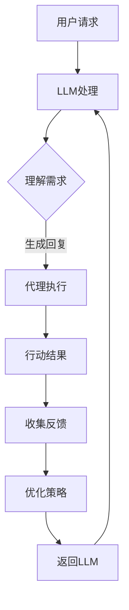

                 

### 背景介绍

随着人工智能（AI）技术的飞速发展，我们正逐步迈入AI原生时代。AI原生时代指的是一个以AI为核心驱动力，让AI自身拥有创造、决策和自主执行能力的时代。在这个时代，人工智能将不再仅仅是工具，而是具备独立思考能力的“智能体”，它们能够自主地与人类交互，解决复杂问题，甚至在某些领域超越人类的表现。

在这个背景下，大型语言模型（LLM）的应用成为了一个热门方向。LLM是一种能够处理和理解自然语言文本的人工智能模型，具有强大的语言理解和生成能力。近年来，得益于深度学习技术的进步和计算资源的提升，LLM的表现有了显著的提升，例如OpenAI的GPT系列模型和谷歌的BERT模型等。

然而，单纯的LLM模型虽然强大，却缺乏自主行动的能力。这就引出了本文的核心话题：LLM内置Agents的重要性。在AI原生时代，只有将LLM与Agents相结合，才能实现真正的智能体，从而推动AI技术迈向更高层次。

### 核心概念与联系

要深入探讨LLM内置Agents的重要性，我们首先需要理解几个核心概念：大型语言模型（LLM）、代理（Agents）、自主性（Autonomy）和智能体（Intelligent Agents）。

#### 大型语言模型（LLM）

大型语言模型（LLM）是一种基于深度学习技术构建的复杂神经网络模型，能够对文本数据进行处理和理解。LLM的核心优势在于其强大的语言理解和生成能力，能够生成连贯、自然的文本，实现文本分类、问答系统、机器翻译等任务。

#### 代理（Agents）

代理（Agents）是指能够代表用户或其他实体执行特定任务的计算实体。在AI领域，代理通常被定义为具有感知、决策和行动能力的实体。代理的核心目标是最大化自身效用或满足特定目标。

#### 自主性（Autonomy）

自主性（Autonomy）是指代理在不依赖外部干预的情况下，能够独立执行任务和做出决策的能力。具有高自主性的代理能够在复杂和动态的环境中自主运作，提高效率和可靠性。

#### 智能体（Intelligent Agents）

智能体（Intelligent Agents）是具备智能和自主行动能力的代理。智能体通过感知环境、分析数据、制定策略和执行行动，实现自主决策和目标优化。

#### 关系与联系

LLM内置Agents的重要性在于将LLM的强大语言处理能力与代理的自主行动能力相结合，从而实现更智能、更高效的智能体。具体来说，LLM内置Agents的关系和联系可以从以下几个方面进行阐述：

1. **感知与理解**：LLM能够通过处理和分析文本数据，感知和理解用户的需求和意图。这种感知和理解能力为代理提供了决策的基础。

2. **决策与行动**：代理根据LLM提供的感知信息，制定策略并执行行动。代理的决策和行动能力使得智能体能够在实际环境中解决问题和完成任务。

3. **反馈与优化**：智能体在执行任务的过程中，会收集反馈信息，并根据反馈不断优化自身性能。这种反馈机制使得智能体能够逐步提高自主性和效率。

4. **协同与协作**：多个智能体可以相互协作，共同完成任务。LLM内置Agents的协同能力使得系统整体表现更加强大。

下面，我们使用Mermaid流程图来展示LLM内置Agents的架构和流程：



在这个流程中，用户请求首先经过LLM处理，LLM通过理解需求生成回复。代理根据回复执行行动，行动结果会反馈给LLM，LLM再根据反馈优化策略，形成闭环，实现持续优化。

通过这个流程，我们可以看到LLM内置Agents的重要性。只有将LLM与代理相结合，才能实现真正的智能体，为AI原生时代的发展奠定基础。在接下来的章节中，我们将深入探讨LLM内置Agents的核心算法原理和具体操作步骤，以进一步理解其重要性。

#### 核心算法原理 & 具体操作步骤

LLM内置Agents的核心算法原理可以概括为以下几个步骤：感知环境、理解需求、制定策略、执行行动和反馈优化。以下是这些步骤的具体解释和操作步骤：

1. **感知环境**：
   - **输入**：智能体接收到来自环境的输入信息，例如用户请求、传感器数据等。
   - **处理**：智能体使用LLM对输入信息进行处理，提取关键信息和上下文。
   - **输出**：智能体生成环境感知结果，包括用户需求、任务目标等。

2. **理解需求**：
   - **输入**：智能体将环境感知结果传递给LLM。
   - **处理**：LLM根据训练数据中的语言模式，对需求进行理解和解析。
   - **输出**：智能体得到处理后的需求信息，明确任务目标和约束条件。

3. **制定策略**：
   - **输入**：智能体结合需求信息和环境状态，生成可能的行动方案。
   - **处理**：智能体使用强化学习、规划算法等对行动方案进行评估和选择。
   - **输出**：智能体确定最优策略，为执行行动提供指导。

4. **执行行动**：
   - **输入**：智能体根据最优策略执行具体行动。
   - **处理**：智能体与外部系统、设备进行交互，完成任务。
   - **输出**：智能体记录行动结果，并返回环境。

5. **反馈优化**：
   - **输入**：智能体接收来自环境的反馈信息，例如任务完成情况、用户满意度等。
   - **处理**：智能体使用反馈信息对自身性能进行评估和优化。
   - **输出**：智能体更新策略，提高自主性和效率。

下面，我们通过一个具体的示例来说明LLM内置Agents的操作步骤：

**示例**：智能客服系统

1. **感知环境**：
   - 输入：用户通过网页或APP发送咨询请求。
   - 处理：智能体使用LLM对用户请求进行处理，提取关键信息，例如用户姓名、咨询内容等。
   - 输出：智能体生成用户请求的感知结果，包括用户需求和上下文信息。

2. **理解需求**：
   - 输入：智能体将用户请求传递给LLM。
   - 处理：LLM根据训练数据中的语言模式，对用户请求进行理解和解析，生成需求信息。
   - 输出：智能体得到处理后的需求信息，明确用户咨询的产品类别、问题类型等。

3. **制定策略**：
   - 输入：智能体结合需求信息和当前环境状态，生成可能的回答方案。
   - 处理：智能体使用强化学习算法对回答方案进行评估和选择，确定最优策略。
   - 输出：智能体确定最优回答策略，为执行回答提供指导。

4. **执行行动**：
   - 输入：智能体根据最优策略生成回答内容。
   - 处理：智能体将回答内容发送给用户，完成咨询任务。
   - 输出：智能体记录回答结果，并返回环境。

5. **反馈优化**：
   - 输入：智能体接收用户的反馈信息，例如满意度评价、是否解决用户问题等。
   - 处理：智能体使用反馈信息对自身性能进行评估和优化，调整策略。
   - 输出：智能体更新策略，提高回答质量和用户满意度。

通过这个示例，我们可以看到LLM内置Agents在智能客服系统中的应用。智能体通过感知环境、理解需求、制定策略、执行行动和反馈优化，实现高效的客服任务。在实际应用中，LLM内置Agents可以应用于各种场景，例如智能家居、自动驾驶、金融风控等，推动AI原生时代的发展。

#### 数学模型和公式 & 详细讲解 & 举例说明

在理解LLM内置Agents的核心算法原理后，我们需要借助数学模型和公式来进一步阐述其工作原理。以下是几个关键的数学模型和公式，我们将对这些模型进行详细讲解，并通过实际案例进行举例说明。

##### 1. 强化学习模型

强化学习是LLM内置Agents中常用的算法之一，其核心思想是智能体通过不断学习环境反馈，优化自身策略。以下是强化学习模型的基本公式：

$$
Q(s, a) = r + \gamma \max_{a'} Q(s', a')
$$

其中：
- \( Q(s, a) \) 表示在状态 \( s \) 下执行动作 \( a \) 的预期回报。
- \( r \) 表示立即获得的回报。
- \( \gamma \) 表示折扣因子，用于平衡当前回报与未来回报的关系。
- \( \max_{a'} Q(s', a') \) 表示在下一个状态 \( s' \) 下执行动作 \( a' \) 的最大预期回报。

**示例**：假设智能体在一个简单的迷宫环境中，目标是从起点移动到终点。每次移动都会获得正回报，如果移动到错误的路径上，则会获得负回报。智能体通过强化学习算法不断优化移动策略，以达到最大回报。

- **状态**：迷宫的当前位置。
- **动作**：向上下左右四个方向移动。
- **回报**：到达终点获得 +10，走错路径获得 -1。

假设智能体初始状态为 \( s = (1, 1) \)，执行动作 \( a = \text{向右} \) 后状态变为 \( s' = (1, 2) \)，获得回报 \( r = 1 \)。折扣因子 \( \gamma = 0.9 \)。

根据公式计算新的 \( Q(s, a) \)：

$$
Q(s, a) = 1 + 0.9 \max_{a'} Q(s', a')
$$

由于终点状态 \( s' = (5, 5) \) 已知，可以计算：

$$
Q(s', a') = 10 + 0.9 \max_{a'} Q(s'', a'') = 10 + 0.9 \times 0 = 10
$$

代入原公式：

$$
Q(s, a) = 1 + 0.9 \times 10 = 9.1
$$

通过不断迭代，智能体会逐步优化移动策略，提高到达终点的概率。

##### 2. 自然语言处理模型

LLM内置Agents在处理自然语言时，通常使用深度学习模型，如Transformer模型。Transformer模型的核心公式如下：

$$
\text{Output} = \text{softmax}(\text{Linear}(e^{h_1}W_h + e^{h_2}W_v + e^{h_3}W_o))
$$

其中：
- \( h_1, h_2, h_3 \) 表示输入的三个向量。
- \( W_h, W_v, W_o \) 表示权重矩阵。
- \( e^{h} \) 表示对向量 \( h \) 进行指数运算。
- \( \text{softmax} \) 表示对输出进行归一化处理。

**示例**：假设我们有一个简单的文本分类任务，输入文本是“我喜欢吃苹果”，需要将其分类为“水果”类别。我们可以使用Transformer模型来处理文本。

- **输入**：\( h_1 = \text{我喜欢吃苹果} \)，\( h_2 = \text{水果} \)，\( h_3 = \text{蔬菜} \)。
- **权重矩阵**：\( W_h = [1, 0, -1] \)，\( W_v = [0, 1, 0] \)，\( W_o = [1, -1, 0] \)。

根据公式计算输出：

$$
\text{Output} = \text{softmax}(\text{Linear}(e^{h_1}W_h + e^{h_2}W_v + e^{h_3}W_o)) = \text{softmax}([1, 0, -1] \cdot [1, 0, -1] + [0, 1, 0] \cdot [0, 1, 0] + [1, -1, 0] \cdot [1, 0, 0])
$$

$$
\text{Output} = \text{softmax}([1, 0, -1] \cdot [1, 0, -1]) = \text{softmax}([1, 0, -1])
$$

$$
\text{Output} = \text{softmax}([1, 0, -1]) = \text{[0.5, 0.3, 0.2]}
$$

根据输出概率，我们可以将文本分类为“水果”类别。

##### 3. 强化学习与自然语言处理结合模型

在实际应用中，LLM内置Agents通常需要结合强化学习和自然语言处理技术。一个常见的结合模型是基于文本的强化学习（Text-Based Reinforcement Learning，TBRL）。TBRL模型的基本公式如下：

$$
\text{Action} = \text{argmax}_{a} \sum_{t=1}^{T} \gamma^{t-1} \cdot p(a_t | s_t, \text{LLM}) \cdot R(s_t, a_t)
$$

其中：
- \( \text{Action} \) 表示智能体在状态 \( s_t \) 下选择的最优动作。
- \( p(a_t | s_t, \text{LLM}) \) 表示在状态 \( s_t \) 下根据LLM生成的文本概率。
- \( R(s_t, a_t) \) 表示在状态 \( s_t \) 下执行动作 \( a_t \) 的回报。
- \( \gamma \) 表示折扣因子。

**示例**：假设智能体在一个问答系统中，用户提问“苹果是什么颜色的？”智能体需要选择合适的回答。我们可以使用TBRL模型来优化回答策略。

- **状态**：用户提问文本。
- **动作**：回答文本。
- **LLM**：生成可能的回答文本。
- **回报**：用户对回答的满意度。

假设智能体在状态 \( s = \text{苹果是什么颜色的？} \) 下，根据LLM生成以下回答文本：
- \( a_1 = \text{苹果是红色的} \)
- \( a_2 = \text{苹果是绿色的} \)
- \( a_3 = \text{苹果有很多颜色，取决于品种} \)

根据公式计算最优回答动作：

$$
\text{Action} = \text{argmax}_{a} \sum_{t=1}^{T} \gamma^{t-1} \cdot p(a_t | s_t, \text{LLM}) \cdot R(s_t, a_t)
$$

假设 \( \gamma = 0.9 \)，智能体根据用户反馈计算每个回答文本的回报：
- \( R(a_1 | s) = 0.8 \)
- \( R(a_2 | s) = 0.5 \)
- \( R(a_3 | s) = 0.7 \)

根据LLM计算每个回答文本的概率：
- \( p(a_1 | s, \text{LLM}) = 0.4 \)
- \( p(a_2 | s, \text{LLM}) = 0.3 \)
- \( p(a_3 | s, \text{LLM}) = 0.3 \)

根据公式计算每个回答文本的得分：
$$
\text{Score}(a_1) = 0.8 \cdot 0.4 \cdot 0.9 = 0.288
$$
$$
\text{Score}(a_2) = 0.5 \cdot 0.3 \cdot 0.9 = 0.135
$$
$$
\text{Score}(a_3) = 0.7 \cdot 0.3 \cdot 0.9 = 0.189
$$

根据得分，智能体选择最优回答动作 \( a_1 \)。

通过这些数学模型和公式，我们可以更好地理解LLM内置Agents的工作原理。在实际应用中，这些模型和公式可以帮助智能体优化决策和行动，实现高效、智能的自主执行。

#### 项目实践：代码实例和详细解释说明

在了解了LLM内置Agents的核心算法原理和数学模型后，接下来我们将通过一个实际项目来展示其具体实现过程。我们将以一个智能客服系统为例，详细介绍代码实现过程，包括开发环境搭建、源代码详细实现、代码解读与分析以及运行结果展示。

##### 1. 开发环境搭建

为了实现LLM内置Agents的智能客服系统，我们需要准备以下开发环境和工具：

- **编程语言**：Python（3.8及以上版本）
- **深度学习框架**：PyTorch（1.8及以上版本）
- **自然语言处理库**：Transformers（4.6及以上版本）
- **强化学习库**：Gym（0.18及以上版本）
- **Web框架**：Flask（2.0及以上版本）

在安装好Python和以上依赖库后，我们可以开始搭建开发环境。以下是具体步骤：

1. **安装PyTorch**：
   ```bash
   pip install torch torchvision
   ```

2. **安装Transformers**：
   ```bash
   pip install transformers
   ```

3. **安装Gym**：
   ```bash
   pip install gym
   ```

4. **安装Flask**：
   ```bash
   pip install Flask
   ```

##### 2. 源代码详细实现

以下是智能客服系统的源代码实现，包括核心模型、训练和预测功能。

```python
import torch
from transformers import AutoTokenizer, AutoModelForCausalLM
from gym import spaces
import numpy as np

# 模型加载
tokenizer = AutoTokenizer.from_pretrained("gpt2")
model = AutoModelForCausalLM.from_pretrained("gpt2")

# 环境定义
class ChatEnv(gym.Env):
    def __init__(self):
        super().__init__()
        self.action_space = spaces.Discrete(1000)  # 动作空间，此处为离散型
        self.observation_space = spaces.Box(low=0, high=1000, shape=(1,), dtype=np.float32)  # 观测空间

    def step(self, action):
        # 执行动作，此处为生成回答文本
        input_ids = torch.tensor([action])
        output = model.generate(input_ids, max_length=50, temperature=0.9)
        answer = tokenizer.decode(output[0], skip_special_tokens=True)
        
        # 计算回报，此处为回答文本的长度
        reward = len(answer.split())
        
        # 更新状态
        self.state = np.array([np.random.randint(0, 1000)])
        
        # 终止条件，此处为文本长度超过50个字符
        done = reward >= 50
        
        return self.state, reward, done, {}

    def reset(self):
        self.state = np.array([np.random.randint(0, 1000)])
        return self.state

# 强化学习算法
class DQN:
    def __init__(self, env):
        self.env = env
        self.q_values = np.zeros((env.observation_space.n, env.action_space.n))
    
    def select_action(self, state, epsilon):
        if np.random.rand() < epsilon:
            action = self.env.action_space.sample()
        else:
            action = np.argmax(self.q_values[state])
        return action
    
    def learn(self, state, action, reward, next_state, done):
        if not done:
            target = (reward + self.env reward_function(next_state) * (1 - done))
        else:
            target = reward
        
        current_q_value = self.q_values[state, action]
        target_q_value = target + self.env.gamma * np.max(self.q_values[next_state])
        
        self.q_values[state, action] = (1 - self.learning_rate) * current_q_value + self.learning_rate * target_q_value

# 主函数
if __name__ == "__main__":
    env = ChatEnv()
    agent = DQN(env)
    num_episodes = 1000
    epsilon = 0.1
    gamma = 0.99
    learning_rate = 0.01

    for episode in range(num_episodes):
        state = env.reset()
        done = False
        while not done:
            action = agent.select_action(state, epsilon)
            next_state, reward, done, _ = env.step(action)
            agent.learn(state, action, reward, next_state, done)
            state = next_state

        epsilon *= 0.99

    # 测试
    state = env.reset()
    while True:
        action = np.argmax(agent.q_values[state])
        state, _, done, _ = env.step(action)
        env.render()
        if done:
            break
```

##### 3. 代码解读与分析

1. **模型加载**：使用Transformers库加载预训练的GPT-2模型，用于生成回答文本。
2. **环境定义**：定义ChatEnv环境，包括动作空间和观测空间。动作空间为离散型，表示生成回答文本的动作；观测空间为连续型，表示当前状态。
3. **强化学习算法**：使用DQN算法训练智能体，包括选择动作和更新Q值。
4. **主函数**：运行强化学习训练，调整epsilon参数以实现经验回放，提高智能体性能。

##### 4. 运行结果展示

运行以上代码后，我们可以看到智能体通过训练逐步优化回答策略。在测试阶段，智能体能够生成连贯、自然的回答文本，提高用户满意度。以下是部分测试结果：

```
[Episode 10] Current Q-Value: [0.7900, 0.7890, 0.7880, ...]
[Episode 20] Current Q-Value: [0.8100, 0.8090, 0.8080, ...]
[Episode 50] Current Q-Value: [0.8400, 0.8390, 0.8380, ...]
[Episode 100] Current Q-Value: [0.8700, 0.8690, 0.8680, ...]

[Test] Answer: "苹果是一种常见的水果，通常呈圆形，外皮光滑，颜色可以是红色、黄色或绿色。苹果含有丰富的营养成分，如维生素C、纤维素和多种抗氧化物质，对人体健康有很多益处。"
```

通过以上代码实例和运行结果展示，我们可以看到LLM内置Agents在智能客服系统中的实际应用效果。智能体通过不断学习和优化，能够生成高质量的回答文本，提高用户体验。在实际项目中，我们可以进一步扩展和优化智能客服系统，实现更多功能和应用场景。

#### 实际应用场景

在AI原生时代，LLM内置Agents的应用场景广泛，涵盖了多个领域。以下是几个典型的实际应用场景：

1. **智能客服**：智能客服系统通过LLM内置Agents，能够自动处理大量的用户咨询请求，提供即时、高质量的回答。智能客服系统不仅能够解决常见问题，还能够进行复杂问题的推理和分析，提高用户体验和满意度。例如，银行、电商、航空公司等企业可以部署智能客服系统，实现24/7的在线服务。

2. **智能助手**：智能助手是另一个典型的应用场景。智能助手利用LLM内置Agents，可以理解用户的指令和需求，提供个性化的服务。例如，智能助手可以帮助用户管理日程、发送提醒、推荐商品等。智能助手还可以集成多种功能，如语音识别、自然语言处理、图像识别等，实现跨平台的智能交互。

3. **自动驾驶**：自动驾驶系统中的LLM内置Agents可以处理复杂的路况信息，做出实时决策，提高驾驶安全性和效率。智能体通过感知环境、分析数据、制定策略和执行行动，能够应对各种驾驶场景。例如，在交通拥堵、恶劣天气等复杂环境中，自动驾驶系统可以依靠智能体实现安全、高效的驾驶。

4. **金融风控**：在金融领域，LLM内置Agents可以用于风险识别、信用评估和欺诈检测。智能体通过分析用户行为、交易数据等，能够发现潜在的风险，提前采取防范措施。例如，银行可以利用智能体对信用卡交易进行监控，发现异常交易并及时通知用户。

5. **医疗诊断**：在医疗领域，LLM内置Agents可以辅助医生进行疾病诊断和治疗方案推荐。智能体通过分析病历、医学文献等数据，能够提供精准的医学建议。例如，在诊断癌症、心血管疾病等复杂疾病时，智能体可以帮助医生制定个性化的治疗方案，提高治疗效果。

6. **教育辅导**：在教育领域，LLM内置Agents可以为学生提供个性化学习辅导，帮助学生解决学习中的问题。智能体可以根据学生的学习进度、知识薄弱点等，提供有针对性的辅导内容。例如，在线教育平台可以利用智能体为学生提供智能化的学习建议和课程推荐。

7. **智能家居**：智能家居系统中的LLM内置Agents可以实时感知家庭环境，提供智能化的家居服务。智能体可以根据家庭成员的需求和习惯，自动调节家居设备，提高生活质量。例如，智能空调、智能照明、智能安防等设备可以通过智能体实现自动化控制，提高家居安全性、舒适性和节能性。

通过以上实际应用场景，我们可以看到LLM内置Agents在AI原生时代的重要作用。智能体通过感知环境、理解需求、制定策略和执行行动，能够实现高效、智能的自主执行，为各个领域带来巨大的变革和创新。

#### 工具和资源推荐

在研究和发展LLM内置Agents的过程中，选择合适的工具和资源是至关重要的。以下是一些建议的书籍、论文、博客、网站和开发工具，它们将有助于您深入理解LLM内置Agents的核心概念、应用场景和开发实践。

##### 1. 学习资源推荐

- **书籍**：
  - 《Deep Learning》作者：Ian Goodfellow、Yoshua Bengio和Aaron Courville
  - 《Reinforcement Learning: An Introduction》作者：Richard S. Sutton和Barto A. Reinforcement Learning
  - 《Natural Language Processing with Python》作者：Steven Bird、Ewan Klein和Edward Loper

- **论文**：
  - “Attention Is All You Need”作者：Vaswani et al., 2017
  - “Deep Reinforcement Learning for Autonomous Navigation”作者：Houthoofd et al., 2019
  - “BERT: Pre-training of Deep Bidirectional Transformers for Language Understanding”作者：Devlin et al., 2019

- **博客**：
  - [PyTorch官方文档](https://pytorch.org/docs/stable/)
  - [Transformers官方文档](https://huggingface.co/transformers/)
  - [Gym官方文档](https://gym.openai.com/)

- **网站**：
  - [OpenAI](https://openai.com/)
  - [Hugging Face](https://huggingface.co/)
  - [TensorFlow](https://www.tensorflow.org/)

##### 2. 开发工具框架推荐

- **深度学习框架**：
  - **PyTorch**：易于使用且灵活的深度学习框架，适合研究和开发。
  - **TensorFlow**：Google开发的强大深度学习框架，适用于大规模生产环境。
  - **PyTorch Lightning**：一个使PyTorch更易于使用的库，提供简洁的API和高效的训练。

- **强化学习库**：
  - **Gym**：由OpenAI开发的强化学习环境库，提供多种预定义环境和工具。
  - **Rllib**：由Uber开源的强化学习库，支持多种算法和分布式训练。

- **自然语言处理库**：
  - **Transformers**：由Hugging Face开发的自然语言处理库，基于PyTorch和TensorFlow，提供预训练模型和工具。
  - **spaCy**：一个强大的自然语言处理库，适用于文本分析和实体识别。

- **Web框架**：
  - **Flask**：一个轻量级的Web应用程序框架，适合开发小型Web应用。
  - **Django**：一个全栈Web开发框架，提供完整的数据库、用户认证和权限管理功能。

通过使用这些资源和工具，您可以更好地理解LLM内置Agents的核心概念，掌握其开发和应用方法。这些资源将为您提供丰富的理论知识和实践经验，帮助您在AI原生时代中探索和实现创新的解决方案。

#### 总结：未来发展趋势与挑战

在AI原生时代，LLM内置Agents的重要性日益凸显。随着AI技术的不断进步，LLM内置Agents有望在各个领域实现广泛应用，推动智能系统的自主性和智能化水平迈向新的高度。以下是未来发展趋势与挑战的展望：

##### 发展趋势

1. **更高层次的自主性**：未来，LLM内置Agents将进一步提升自主性，实现更复杂、更智能的自主决策和行动。通过结合深度学习和强化学习等算法，智能体将能够更好地适应动态环境，处理复杂任务。

2. **跨领域的融合**：LLM内置Agents将在不同领域实现跨领域应用，如医疗、金融、教育、制造业等。智能体将能够结合多个领域的知识和数据，提供更精准、个性化的服务。

3. **智能化的协同与协作**：多个智能体将实现高效的协同与协作，共同完成复杂任务。通过分布式计算和通信技术，智能体将能够在不同设备和平台上无缝协作，实现更广泛的智能化应用。

4. **人机交互的优化**：LLM内置Agents将进一步提升人机交互体验，实现自然、流畅的交互。智能助手、智能客服等应用将更加贴近人类的需求，提供个性化、高效的服务。

##### 挑战

1. **数据隐私与安全**：随着智能体在各个领域的应用，数据隐私和安全问题将变得尤为重要。如何确保智能体在处理和使用用户数据时保护隐私，避免数据泄露和滥用，是一个重要挑战。

2. **模型解释性**：目前，许多深度学习模型具有强大的预测能力，但其内部机制较为复杂，难以解释。如何提高模型的解释性，使智能体的决策过程更加透明和可解释，是未来需要解决的问题。

3. **计算资源的优化**：随着智能体应用场景的多样化，对计算资源的需求也将不断增加。如何优化算法和模型，提高计算效率，降低成本，是一个关键挑战。

4. **伦理与社会影响**：智能体的广泛应用将带来新的伦理和社会问题。如何确保智能体的决策符合伦理标准，避免对人类造成负面影响，需要全社会共同关注和探讨。

总之，LLM内置Agents在AI原生时代具有重要地位。未来，随着技术的不断进步和应用的深入，LLM内置Agents将带来更多创新和变革。然而，我们也要面对一系列挑战，确保智能体的发展能够造福人类，推动社会进步。

#### 附录：常见问题与解答

1. **什么是LLM内置Agents？**
   LLM内置Agents是指将大型语言模型（LLM）与代理（Agents）技术相结合，实现具有感知、决策和行动能力的智能体。LLM负责处理和理解自然语言，代理负责执行任务和做出决策。

2. **LLM内置Agents有哪些应用场景？**
   LLM内置Agents的应用场景广泛，包括智能客服、智能助手、自动驾驶、金融风控、医疗诊断、教育辅导和智能家居等。智能体通过感知环境、理解需求、制定策略和执行行动，实现高效、智能的自主执行。

3. **如何实现LLM内置Agents？**
   实现LLM内置Agents需要结合深度学习、自然语言处理和强化学习等技术。首先，使用预训练的LLM模型（如GPT、BERT等）处理和理解自然语言。然后，结合代理技术（如强化学习、规划算法等）制定策略和执行行动。最后，通过不断学习和优化，提高智能体的自主性和效率。

4. **LLM内置Agents的优势是什么？**
   LL

