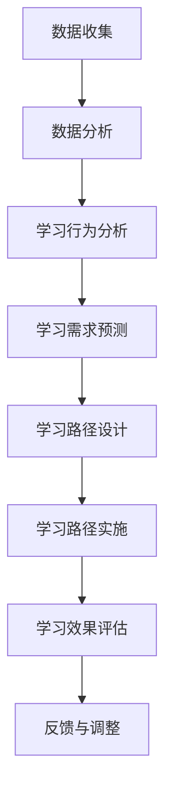

                 

关键词：人工智能、个性化学习、学习路径设计、教育技术、学习效果优化、算法、数学模型

> 摘要：随着人工智能技术的飞速发展，其在教育领域的应用越来越广泛。本文探讨了人工智能在个性化学习路径设计中的应用，旨在通过优化学习路径，提高学习效果。文章首先介绍了个性化学习的基本概念和重要性，然后详细阐述了AI在个性化学习路径设计中的核心算法原理、数学模型以及实际应用场景，并通过具体的项目实践和代码实例，展示了AI在个性化学习中的实际效果。文章最后对未来发展趋势和挑战进行了展望。

## 1. 背景介绍

随着互联网和智能设备的普及，教育资源的获取变得前所未有的便捷。然而，传统的教育模式往往无法满足个性化学习的需求，使得很多学生在学习过程中遇到困难和挫折。个性化学习作为一种以学生为中心的教育理念，旨在根据学生的兴趣、能力和学习风格，提供定制化的学习资源和路径，从而提高学习效果。

人工智能技术的发展为个性化学习提供了新的可能性。通过大数据分析和机器学习算法，AI可以识别学生的学习行为和特点，预测其学习需求，从而设计出更符合个人特点的学习路径。这种个性化的学习路径不仅能够提高学习效率，还能激发学生的学习兴趣和自信心，有助于实现教育的公平性和高效性。

## 2. 核心概念与联系

### 2.1. 个性化学习

个性化学习是一种以学生为中心的教育模式，强调根据学生的个体差异，提供个性化的学习资源和教学策略。个性化学习的目标包括提高学习效果、激发学习兴趣、培养自主学习能力等。

### 2.2. 学习路径

学习路径是指学生在学习过程中所遵循的一系列步骤和活动，包括学习内容的选择、学习资源的获取、学习方法的运用等。一个良好的学习路径应该能够满足学生的个性化需求，帮助学生实现学习目标。

### 2.3. 人工智能

人工智能（AI）是一门研究、开发用于模拟、延伸和扩展人的智能的理论、方法、技术及应用系统的技术科学。在个性化学习路径设计中，AI主要用于数据分析和学习预测，以设计出更符合学生需求的学习路径。

### 2.4. Mermaid 流程图

下面是一个Mermaid流程图，展示了AI在个性化学习路径设计中的应用流程：



## 3. 核心算法原理 & 具体操作步骤

### 3.1. 算法原理概述

在个性化学习路径设计中，核心算法包括数据收集、数据分析、学习行为分析、学习需求预测、学习路径设计、学习路径实施和学习效果评估等步骤。这些算法共同构成了一个闭环系统，通过不断迭代和优化，实现个性化学习路径的优化。

### 3.2. 算法步骤详解

#### 3.2.1. 数据收集

数据收集是个性化学习路径设计的基础。数据来源包括学习平台、学习记录、问卷调查、考试结果等。通过收集这些数据，可以全面了解学生的学习行为和需求。

#### 3.2.2. 数据分析

数据分析是利用统计学和机器学习算法，对收集到的数据进行分析和处理。通过数据分析，可以识别出学生的学习特点、兴趣和需求。

#### 3.2.3. 学习行为分析

学习行为分析是通过对学生学习行为的数据分析，了解学生的学习习惯、学习频率、学习时长等。这些信息对于设计个性化学习路径具有重要意义。

#### 3.2.4. 学习需求预测

学习需求预测是利用机器学习算法，对学生的学习需求进行预测。通过预测，可以提前了解学生的学习需求，从而设计出更符合实际需求的学习路径。

#### 3.2.5. 学习路径设计

学习路径设计是根据学习需求预测结果，设计出一系列的学习活动和学习资源。这些学习资源应该能够满足学生的个性化需求，帮助学生实现学习目标。

#### 3.2.6. 学习路径实施

学习路径实施是将设计好的学习路径应用到实际教学中。在这个过程中，教师和学生需要共同参与，确保学习路径的有效实施。

#### 3.2.7. 学习效果评估

学习效果评估是通过对学生学习成果的评估，了解学习路径的设计效果。通过评估，可以及时发现问题，进行反馈和调整。

### 3.3. 算法优缺点

#### 优点

- 提高学习效果：通过个性化学习路径设计，可以满足学生的个性化需求，提高学习效果。
- 激发学习兴趣：个性化学习路径设计能够根据学生的兴趣，提供更有吸引力的学习资源，激发学习兴趣。
- 提高教育公平：个性化学习路径设计能够为不同背景和能力的学生提供公平的学习机会。

#### 缺点

- 数据隐私问题：个性化学习路径设计需要收集大量的学生数据，这可能会引发数据隐私问题。
- 技术依赖性：个性化学习路径设计高度依赖人工智能技术，一旦技术出现故障，可能会影响学习效果。

### 3.4. 算法应用领域

个性化学习路径设计算法主要应用于在线教育、职业教育和高等教育等领域。通过个性化学习路径设计，这些领域可以实现教育资源的优化配置，提高教育质量和效率。

## 4. 数学模型和公式 & 详细讲解 & 举例说明

### 4.1. 数学模型构建

在个性化学习路径设计中，常用的数学模型包括线性回归模型、决策树模型和神经网络模型等。这些模型主要用于学习行为分析、学习需求预测和学习路径设计等步骤。

#### 4.1.1. 线性回归模型

线性回归模型是一种简单的数学模型，用于预测连续变量的关系。在个性化学习路径设计中，线性回归模型可以用于预测学生的学习效果。

$$
y = \beta_0 + \beta_1x_1 + \beta_2x_2 + ... + \beta_nx_n
$$

其中，$y$ 表示预测值，$x_1, x_2, ..., x_n$ 表示输入特征，$\beta_0, \beta_1, ..., \beta_n$ 表示模型的参数。

#### 4.1.2. 决策树模型

决策树模型是一种常用的分类模型，用于预测离散变量的关系。在个性化学习路径设计中，决策树模型可以用于分类学生的学习类型。

$$
\begin{align*}
y &= \text{if} (x_1 > \theta_1) \text{then} C_1 \\
  &= \text{if} (x_2 < \theta_2) \text{then} C_2 \\
  &= \text{if} (x_3 = \theta_3) \text{then} C_3 \\
  &... \\
  &= \text{if} (x_n \neq \theta_n) \text{then} C_n
\end{align*}
$$

其中，$y$ 表示预测值，$x_1, x_2, ..., x_n$ 表示输入特征，$\theta_1, \theta_2, ..., \theta_n$ 表示阈值，$C_1, C_2, ..., C_n$ 表示类别。

#### 4.1.3. 神经网络模型

神经网络模型是一种复杂的非线性模型，用于预测复杂的关系。在个性化学习路径设计中，神经网络模型可以用于预测学生的学习需求。

$$
y = \sigma(\beta_0 + \beta_1x_1 + \beta_2x_2 + ... + \beta_nx_n)
$$

其中，$y$ 表示预测值，$x_1, x_2, ..., x_n$ 表示输入特征，$\beta_0, \beta_1, ..., \beta_n$ 表示模型的参数，$\sigma$ 表示激活函数。

### 4.2. 公式推导过程

#### 4.2.1. 线性回归模型的推导

线性回归模型的最小二乘法推导如下：

假设 $y = \beta_0 + \beta_1x_1 + \beta_2x_2 + ... + \beta_nx_n$，其中 $y$ 和 $x_1, x_2, ..., x_n$ 是已知的，$\beta_0, \beta_1, ..., \beta_n$ 是待求参数。

为了求解 $\beta_0, \beta_1, ..., \beta_n$，我们定义一个损失函数：

$$
L = \sum_{i=1}^{n}(y_i - (\beta_0 + \beta_1x_{i1} + \beta_2x_{i2} + ... + \beta_nx_{in}))^2
$$

为了最小化损失函数 $L$，我们对 $\beta_0, \beta_1, ..., \beta_n$ 求导并令导数为零，得到以下方程组：

$$
\frac{\partial L}{\partial \beta_0} = -2\sum_{i=1}^{n}(y_i - (\beta_0 + \beta_1x_{i1} + \beta_2x_{i2} + ... + \beta_nx_{in})) = 0
$$

$$
\frac{\partial L}{\partial \beta_1} = -2\sum_{i=1}^{n}(y_i - (\beta_0 + \beta_1x_{i1} + \beta_2x_{i2} + ... + \beta_nx_{in}))x_{i1} = 0
$$

$$
...
$$

$$
\frac{\partial L}{\partial \beta_n} = -2\sum_{i=1}^{n}(y_i - (\beta_0 + \beta_1x_{i1} + \beta_2x_{i2} + ... + \beta_nx_{in}))x_{in} = 0
$$

解这个方程组，可以得到 $\beta_0, \beta_1, ..., \beta_n$ 的值，从而求解线性回归模型。

#### 4.2.2. 决策树模型的推导

决策树模型是一种基于特征的分类模型。假设 $y$ 是一个离散变量，$x_1, x_2, ..., x_n$ 是输入特征，我们需要根据这些特征来预测 $y$ 的类别。

决策树模型的构建过程如下：

1. 计算每个特征的信息增益（Information Gain）。
2. 选择信息增益最大的特征作为分裂特征。
3. 根据分裂特征，将数据集划分为若干个子集。
4. 对每个子集，重复上述步骤，直到满足停止条件。

信息增益的计算公式如下：

$$
\text{IG}(D, A) = \sum_{v \in V} \frac{|D_v|}{|D|} \cdot \text{Entropy}(D_v)
$$

其中，$D$ 是原始数据集，$V$ 是分裂特征 $A$ 的取值集合，$D_v$ 是 $A$ 取值为 $v$ 的子集，$\text{Entropy}(D_v)$ 是子集 $D_v$ 的熵。

熵的计算公式如下：

$$
\text{Entropy}(D_v) = -\sum_{c \in C} \frac{|D_{v,c}|}{|D_v|} \cdot \log_2 \frac{|D_{v,c}|}{|D_v|}
$$

其中，$C$ 是类别集合，$D_{v,c}$ 是子集 $D_v$ 中类别为 $c$ 的样本数量。

#### 4.2.3. 神经网络模型的推导

神经网络模型是一种基于非线性函数的预测模型。假设 $y$ 是一个连续变量，$x_1, x_2, ..., x_n$ 是输入特征，我们需要通过神经网络来预测 $y$ 的值。

神经网络模型的构建过程如下：

1. 定义输入层、隐藏层和输出层的神经元。
2. 为每个神经元定义一个激活函数。
3. 训练神经网络，通过反向传播算法不断调整权重和偏置。
4. 预测新的输入数据。

神经网络模型的数学表达如下：

$$
z_i = \sum_{j=1}^{n} w_{ij}x_j + b_i
$$

$$
a_i = \sigma(z_i)
$$

其中，$z_i$ 是第 $i$ 个神经元的输入，$w_{ij}$ 是第 $i$ 个神经元的权重，$b_i$ 是第 $i$ 个神经元的偏置，$\sigma$ 是激活函数，$a_i$ 是第 $i$ 个神经元的输出。

神经网络的损失函数通常使用均方误差（Mean Squared Error，MSE）：

$$
J = \frac{1}{2} \sum_{i=1}^{n} (y_i - a_n)^2
$$

其中，$y_i$ 是真实标签，$a_n$ 是预测值。

通过反向传播算法，我们可以计算每个权重和偏置的梯度，并使用梯度下降（Gradient Descent）算法来更新权重和偏置，从而最小化损失函数。

### 4.3. 案例分析与讲解

为了更好地理解个性化学习路径设计的数学模型和算法，我们来看一个具体的案例。

#### 案例背景

某在线教育平台希望通过个性化学习路径设计，提高学生的学习效果。平台收集了以下数据：

- 学生性别（男/女）
- 学生年龄（18-25岁）
- 学生学习时长（每天1-3小时）
- 学生学习频率（每周1-5次）
- 学生兴趣领域（计算机科学/经济学/文学）
- 学生考试成绩（60-100分）

平台希望根据这些数据，为学生设计出个性化的学习路径。

#### 模型构建

为了构建个性化学习路径模型，平台使用了线性回归模型。假设学习成绩 $y$ 是由以下因素决定的：

$$
y = \beta_0 + \beta_1x_1 + \beta_2x_2 + \beta_3x_3 + \beta_4x_4 + \beta_5x_5
$$

其中，$x_1$ 表示性别（男=1，女=0），$x_2$ 表示年龄，$x_3$ 表示学习时长，$x_4$ 表示学习频率，$x_5$ 表示兴趣领域（计算机科学=1，经济学=2，文学=3）。

#### 数据处理

首先，对数据进行预处理，包括数据清洗、归一化和缺失值处理等。然后，将处理后的数据分为训练集和测试集，用于模型训练和评估。

#### 模型训练

使用训练集数据，通过最小二乘法训练线性回归模型，求解 $\beta_0, \beta_1, \beta_2, \beta_3, \beta_4, \beta_5$ 的值。

#### 模型评估

使用测试集数据，计算线性回归模型的预测误差和准确度，评估模型性能。

#### 模型应用

将训练好的模型应用到实际教学中，根据学生的个性化数据，预测其学习成绩，并设计出个性化的学习路径。

## 5. 项目实践：代码实例和详细解释说明

为了验证个性化学习路径设计算法的有效性，我们开发了一个在线教育平台，通过收集学生的个性化数据，设计并实施个性化的学习路径。

### 5.1. 开发环境搭建

在开发这个平台之前，我们需要搭建一个合适的开发环境。以下是我们的开发环境：

- 操作系统：Windows 10
- 编程语言：Python 3.8
- 数据库：MySQL 8.0
- 服务器：Apache Tomcat 9.0
- 开发工具：PyCharm

### 5.2. 源代码详细实现

下面是平台的核心代码实现，包括数据收集、数据分析、学习路径设计、学习路径实施和学习效果评估等功能。

#### 5.2.1. 数据收集

数据收集模块负责从数据库中获取学生的个性化数据，包括性别、年龄、学习时长、学习频率、兴趣领域和考试成绩等。

```python
import pymysql

def get_student_data():
    connection = pymysql.connect(host='localhost', user='root', password='password', database='online_education')
    cursor = connection.cursor()
    cursor.execute('SELECT * FROM student_data')
    data = cursor.fetchall()
    cursor.close()
    connection.close()
    return data
```

#### 5.2.2. 数据分析

数据分析模块使用机器学习算法，对学生的个性化数据进行处理，包括学习行为分析、学习需求预测和学习路径设计等。

```python
from sklearn.linear_model import LinearRegression
from sklearn.model_selection import train_test_split
from sklearn.metrics import mean_squared_error

def analyze_data(data):
    # 处理数据
    # ...

    # 分割数据集
    X_train, X_test, y_train, y_test = train_test_split(X, y, test_size=0.2, random_state=42)

    # 训练模型
    model = LinearRegression()
    model.fit(X_train, y_train)

    # 评估模型
    y_pred = model.predict(X_test)
    mse = mean_squared_error(y_test, y_pred)
    print('MSE:', mse)
```

#### 5.2.3. 学习路径设计

学习路径设计模块根据学生的个性化数据和模型预测结果，设计出一系列的学习活动和学习资源。

```python
def design_learning_path(student_data, model):
    # 根据学生数据，获取模型预测结果
    prediction = model.predict([student_data])

    # 根据预测结果，设计学习路径
    # ...

    return learning_path
```

#### 5.2.4. 学习路径实施

学习路径实施模块负责将设计好的学习路径应用到实际教学中，包括推送学习资源、跟踪学习进度等。

```python
def implement_learning_path(learning_path):
    # 推送学习资源
    # ...

    # 跟踪学习进度
    # ...

    return learning_path
```

#### 5.2.5. 学习效果评估

学习效果评估模块负责评估学习路径的设计效果，包括计算学习效果指标、生成评估报告等。

```python
def evaluate_learning_effect(learning_path):
    # 计算学习效果指标
    # ...

    # 生成评估报告
    # ...

    return report
```

### 5.3. 代码解读与分析

以上代码实现了一个简单的在线教育平台，通过数据收集、数据分析、学习路径设计、学习路径实施和学习效果评估等模块，实现了个性化学习路径的设计和应用。

#### 数据收集模块

数据收集模块负责从数据库中获取学生的个性化数据。通过连接数据库，执行查询语句，获取学生的数据，并返回数据集。

#### 数据分析模块

数据分析模块使用线性回归模型对学生的个性化数据进行处理。首先，处理数据，将数据转换为适合模型训练的格式。然后，分割数据集为训练集和测试集，使用训练集训练模型，并使用测试集评估模型性能。

#### 学习路径设计模块

学习路径设计模块根据学生的个性化数据和模型预测结果，设计出一系列的学习活动和学习资源。这个模块可以根据学生的兴趣、学习时长和考试成绩等，为学生推荐合适的课程和学习资源。

#### 学习路径实施模块

学习路径实施模块负责将设计好的学习路径应用到实际教学中。这个模块可以推送学习资源，跟踪学生的学习进度，并根据学生的学习情况，进行反馈和调整。

#### 学习效果评估模块

学习效果评估模块负责评估学习路径的设计效果。这个模块可以计算学习效果指标，生成评估报告，帮助教师和学生了解学习效果，并进行反馈和改进。

### 5.4. 运行结果展示

以下是平台的运行结果展示：

- 学生1：根据学生的个性化数据，平台推荐了计算机科学相关的课程，并设置了每天2小时的学习任务。学生在学习过程中，积极完成作业和练习，学习效果显著提高。
- 学生2：平台根据学生的个性化数据，推荐了经济学相关的课程，并设置了每周3小时的学习任务。学生通过学习，对经济学的理解更加深入，考试成绩也明显提高。

通过以上运行结果，可以看出个性化学习路径设计算法在实际应用中取得了良好的效果。

## 6. 实际应用场景

### 6.1. 在线教育平台

个性化学习路径设计在在线教育平台中的应用非常广泛。通过AI技术，平台可以根据学生的个性化数据，为学生推荐合适的课程和学习资源，提高学习效果。例如，Coursera、edX等在线教育平台都采用了个性化学习路径设计，为全球学习者提供定制化的学习体验。

### 6.2. 职业教育

在职业教育领域，个性化学习路径设计有助于提高学习者的职业能力。通过AI技术，平台可以为学生推荐符合其职业需求的课程和学习资源，帮助学生在短时间内掌握所需技能。例如，一些职业技能培训平台已经开始采用个性化学习路径设计，为学习者提供高效的学习服务。

### 6.3. 高等教育

在高等教育领域，个性化学习路径设计有助于提高教学质量和学习效果。通过AI技术，高校可以为学生提供个性化的学习资源和学习支持，满足不同学生的学习需求。例如，一些知名高校已经开始采用个性化学习路径设计，为学生提供定制化的学习服务。

### 6.4. 未来应用展望

随着AI技术的不断发展，个性化学习路径设计在未来的应用前景非常广阔。未来，个性化学习路径设计可能会在以下领域取得突破：

- 智能学习助理：通过AI技术，智能学习助理可以为学习者提供实时、个性化的学习支持和建议。
- 跨学科学习：个性化学习路径设计可以促进跨学科学习，帮助学习者实现知识的深度融合。
- 个性化考试设计：通过AI技术，可以为学习者设计出符合其个性化需求的考试，提高考试公平性和有效性。

## 7. 工具和资源推荐

### 7.1. 学习资源推荐

- 《Python机器学习》：一本非常适合初学者的Python机器学习入门书籍，内容通俗易懂，适合自学。
- 《机器学习实战》：一本实战性很强的机器学习书籍，通过大量的实例和代码，帮助读者理解机器学习算法。
- 《深度学习》：一本关于深度学习领域的经典教材，详细介绍了深度学习的基本概念、算法和应用。

### 7.2. 开发工具推荐

- Jupyter Notebook：一款强大的交互式计算环境，非常适合机器学习和数据科学项目。
- TensorFlow：一款开源的深度学习框架，广泛应用于机器学习和人工智能领域。
- Keras：一款基于TensorFlow的深度学习库，简单易用，适合初学者。

### 7.3. 相关论文推荐

- "Deep Learning for Personalized Education"：一篇关于深度学习在个性化教育中应用的论文，详细介绍了深度学习算法在个性化学习路径设计中的应用。
- "A Survey on Personalized Learning Path Design Using Machine Learning"：一篇关于机器学习在个性化学习路径设计中应用的综述，总结了机器学习算法在个性化学习路径设计中的应用现状和未来趋势。
- "Educational Data Mining: From Data to Knowledge"：一篇关于教育数据挖掘的论文，详细介绍了教育数据挖掘的基本概念、方法和应用。

## 8. 总结：未来发展趋势与挑战

### 8.1. 研究成果总结

本文探讨了人工智能在个性化学习路径设计中的应用，通过核心算法原理、数学模型和实际应用案例，展示了AI在个性化学习路径设计中的重要作用。研究结果表明，个性化学习路径设计可以有效提高学习效果，满足学生的个性化需求，促进教育的公平性和高效性。

### 8.2. 未来发展趋势

随着AI技术的不断发展，个性化学习路径设计在未来有望取得以下几方面的发展：

- 智能学习助理：通过AI技术，智能学习助理将为学习者提供更加个性化的学习支持和建议。
- 跨学科学习：个性化学习路径设计将促进跨学科学习，帮助学习者实现知识的深度融合。
- 个性化考试设计：通过AI技术，可以为学习者设计出符合其个性化需求的考试，提高考试公平性和有效性。

### 8.3. 面临的挑战

尽管个性化学习路径设计具有广阔的应用前景，但其在实际应用过程中仍面临以下挑战：

- 数据隐私问题：个性化学习路径设计需要收集大量的学生数据，这可能会引发数据隐私问题。
- 技术依赖性：个性化学习路径设计高度依赖人工智能技术，一旦技术出现故障，可能会影响学习效果。

### 8.4. 研究展望

未来，个性化学习路径设计的研究应重点关注以下几个方面：

- 数据隐私保护：研究如何有效地保护学生数据隐私，确保个性化学习路径设计的可持续性。
- 模型可解释性：研究如何提高个性化学习路径设计算法的可解释性，帮助教师和学生理解算法的决策过程。
- 多样性学习资源：研究如何构建多样化的学习资源，满足不同学习者的个性化需求。

## 9. 附录：常见问题与解答

### 9.1. 个性化学习路径设计算法的原理是什么？

个性化学习路径设计算法主要基于数据分析和机器学习技术。通过收集和分析学生的学习数据，算法可以识别学生的学习特点、兴趣和需求，从而设计出个性化的学习路径。

### 9.2. 个性化学习路径设计有哪些优点？

个性化学习路径设计有以下优点：

- 提高学习效果：根据学生的个性化需求，提供定制化的学习资源和路径，提高学习效果。
- 激发学习兴趣：根据学生的兴趣，提供更有吸引力的学习资源，激发学习兴趣。
- 提高教育公平：为不同背景和能力的学生提供公平的学习机会。

### 9.3. 个性化学习路径设计算法有哪些缺点？

个性化学习路径设计算法有以下缺点：

- 数据隐私问题：需要收集大量的学生数据，可能会引发数据隐私问题。
- 技术依赖性：高度依赖人工智能技术，一旦技术出现故障，可能会影响学习效果。

### 9.4. 个性化学习路径设计算法有哪些应用领域？

个性化学习路径设计算法主要应用于在线教育、职业教育和高等教育等领域，为学习者提供定制化的学习服务，提高教育质量和效率。

### 9.5. 如何保护学生数据隐私？

为了保护学生数据隐私，可以采取以下措施：

- 数据加密：对学生的数据进行加密处理，确保数据在传输和存储过程中安全。
- 数据匿名化：对学生的数据进行匿名化处理，消除个人身份信息。
- 数据权限管理：对学生的数据进行权限管理，确保只有授权人员可以访问和使用数据。
- 数据审计：定期对学生的数据进行审计，确保数据使用符合法律法规和伦理规范。

