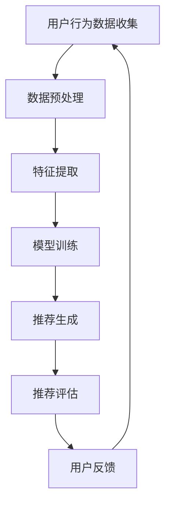

                 

### 背景介绍

个性化推荐系统作为人工智能领域的一个重要分支，近年来得到了广泛关注和快速发展。随着互联网的普及和信息爆炸，用户获取有价值信息的成本越来越高。传统的推荐系统主要依赖于用户的浏览历史、购买记录等显式反馈信息，往往难以满足用户的个性化需求。而人工智能的崛起，为个性化推荐带来了新的可能性和创新应用。

个性化推荐系统的核心目标是通过分析用户的行为数据和历史偏好，预测用户未来的兴趣和需求，从而为用户推荐其可能感兴趣的内容。这一目标的实现不仅依赖于数据的质量和处理能力，还需要具备一定的算法和模型支撑。随着深度学习、自然语言处理等技术的不断发展，个性化推荐系统在准确性、实时性和用户体验方面得到了显著提升。

然而，个性化推荐系统的构建和应用也面临着诸多挑战。首先是如何处理海量用户数据，从噪声数据中提取有效的特征信息。其次是如何平衡用户兴趣多样性和个性化推荐的一致性。此外，用户隐私保护和算法公平性也是需要关注的重要问题。

本文将围绕AI在个性化推荐中的创新应用进行深入探讨。首先，我们将介绍个性化推荐系统的基本概念和常见算法。接着，将分析AI技术在推荐系统中的应用，包括深度学习、协同过滤和生成对抗网络等。随后，我们将探讨个性化推荐系统的实际应用场景，并结合具体案例进行分析。最后，我们将总结AI在个性化推荐领域的未来发展趋势和挑战，并给出相关建议。

通过本文的阅读，读者将全面了解AI在个性化推荐中的创新应用，掌握核心技术和实践方法，为未来从事相关领域的研究和应用提供有力支持。

### 2. 核心概念与联系

#### 2.1 个性化推荐系统的定义

个性化推荐系统（Personalized Recommendation System）是一种智能信息过滤技术，旨在根据用户的兴趣、行为和偏好，为用户提供个性化的内容推荐。其核心目标是提升用户满意度，减少信息过载，帮助用户发现潜在感兴趣的内容。根据不同的推荐策略，个性化推荐系统可以大致分为基于内容的推荐、基于协同过滤的推荐和基于模型的推荐。

- **基于内容的推荐（Content-Based Recommendation）**：该策略通过分析用户过去的行为和兴趣，提取相关特征，然后基于这些特征为用户推荐具有相似特征的内容。这种方法主要依赖于内容的语义信息，如关键词、主题和标签等。

- **基于协同过滤的推荐（Collaborative Filtering）**：协同过滤是一种基于用户行为数据（如评分、浏览历史等）进行推荐的策略。它通过计算用户之间的相似度，将相似用户的偏好推广到未接触过的内容上。协同过滤可以分为用户基于的协同过滤（User-Based）和基于模型的协同过滤（Model-Based），如矩阵分解、潜在因子模型等。

- **基于模型的推荐（Model-Based Recommendation）**：这种方法通过建立用户和物品之间的复杂模型，预测用户对未接触物品的偏好。常用的模型包括决策树、贝叶斯网络、支持向量机和深度神经网络等。

#### 2.2 个性化推荐系统的工作原理

个性化推荐系统的工作流程通常包括以下几个步骤：

1. **用户行为数据收集**：收集用户的浏览、点击、评分、购买等行为数据，用于后续的分析和推荐。

2. **数据预处理**：清洗和转换原始数据，包括去除噪声、缺失值填充、数据标准化等，以确保数据的质量和一致性。

3. **特征提取**：从用户行为数据中提取有用的特征信息，如用户兴趣标签、物品属性等。这些特征将用于训练推荐模型。

4. **模型训练**：使用提取的特征信息，结合机器学习算法，训练推荐模型。常见的算法包括协同过滤、决策树、支持向量机、神经网络等。

5. **推荐生成**：将训练好的模型应用于新用户或新物品，生成个性化推荐结果。推荐结果可以通过排序、聚类等方式进行优化。

6. **推荐评估**：评估推荐系统的效果，通常使用精确度、召回率、F1值等指标进行衡量。

#### 2.3 个性化推荐系统的架构

个性化推荐系统的架构通常可以分为前端、后端和推荐引擎三个部分。

- **前端**：负责与用户交互，展示推荐结果。前端通常包括网页、移动应用等，使用JavaScript、React、Vue等前端框架进行开发。

- **后端**：负责处理用户请求、数据存储和管理等功能。后端通常使用Java、Python、Node.js等后端框架进行开发。

- **推荐引擎**：负责推荐算法的实现和优化，是推荐系统的核心。推荐引擎可以使用传统的机器学习算法，也可以采用深度学习框架（如TensorFlow、PyTorch等）进行开发。

#### 2.4 关键技术与方法

个性化推荐系统涉及多种关键技术与方法，包括数据挖掘、机器学习、深度学习、自然语言处理等。

- **数据挖掘**：用于提取用户行为数据中的有用信息，进行特征工程和模式识别。

- **机器学习**：用于训练推荐模型，包括线性回归、决策树、支持向量机等算法。

- **深度学习**：用于构建复杂的神经网络模型，如卷积神经网络（CNN）、循环神经网络（RNN）等。

- **自然语言处理**：用于处理文本数据，提取语义信息，应用于文本推荐领域。

#### 2.5 个性化推荐系统的挑战

尽管个性化推荐系统在理论上具有显著的优势，但在实际应用中仍面临诸多挑战：

- **数据隐私**：用户行为数据的收集和使用可能涉及到隐私问题，需要采取有效的隐私保护措施。

- **算法公平性**：算法可能会产生偏见，导致推荐结果不公平，需要关注算法的透明性和可解释性。

- **实时性**：在高并发的场景下，如何保证推荐系统的实时性和响应速度。

- **推荐质量**：如何提高推荐系统的准确性和多样性，避免用户陷入“信息茧房”。

#### 2.6 个性化推荐系统的未来发展

随着技术的不断进步，个性化推荐系统将在以下方面继续发展：

- **多模态推荐**：结合多种数据类型（如文本、图像、音频等），提供更丰富的推荐结果。

- **联邦学习**：在保障数据隐私的同时，实现跨设备的协同学习和推荐。

- **自适应推荐**：根据用户的实时行为和偏好，动态调整推荐策略，提高用户体验。

- **无监督学习**：减少对用户标签和评分的依赖，通过无监督学习方法进行推荐。

#### 2.7 Mermaid 流程图

以下是个性化推荐系统的工作流程的 Mermaid 流程图：



通过上述流程，个性化推荐系统实现了从数据收集到推荐生成的完整过程，并不断优化和调整，以满足用户的个性化需求。

### 3. 核心算法原理 & 具体操作步骤

在个性化推荐系统中，核心算法的选择和实现直接影响到推荐系统的效果和用户体验。本文将重点介绍几种常见且具有代表性的算法，包括协同过滤、深度学习和生成对抗网络。每种算法都将详细介绍其原理、实现步骤和优缺点。

#### 3.1 协同过滤算法

协同过滤算法是推荐系统中最常用的方法之一，其核心思想是基于用户行为数据，通过计算用户之间的相似度，将相似用户的偏好推广到未接触过的内容上。协同过滤算法可以分为基于用户的协同过滤（User-Based）和基于模型的协同过滤（Model-Based）。

##### 3.1.1 基于用户的协同过滤

基于用户的协同过滤（User-Based Collaborative Filtering，UBCF）通过计算用户之间的相似度，将具有相似兴趣的用户聚集在一起，然后为用户推荐这些用户喜欢但用户尚未接触过的物品。具体步骤如下：

1. **计算用户相似度**：
   用户相似度计算通常采用余弦相似度、皮尔逊相关系数等方法。公式如下：
   \[
   \text{similarity}(u, v) = \frac{\sum_{i \in R_{uv}} x_{ui} x_{vi}}{\sqrt{\sum_{i \in R_{u}} x_{ui}^2} \sqrt{\sum_{i \in R_{v}} x_{vi}^2}}
   \]
   其中，\(R_{u}\) 和 \(R_{v}\) 分别表示用户 \(u\) 和 \(v\) 的评分项集合，\(x_{ui}\) 和 \(x_{vi}\) 分别表示用户 \(u\) 和 \(v\) 对物品 \(i\) 的评分。

2. **生成推荐列表**：
   对于新用户 \(u\)，首先计算其与其他用户的相似度，然后根据相似度对其他用户推荐过的物品进行排序，选择相似度最高的 \(k\) 个用户（邻居）的推荐物品，形成推荐列表。

##### 3.1.2 基于模型的协同过滤

基于模型的协同过滤（Model-Based Collaborative Filtering，MBCF）通过建立用户和物品之间的潜在因子模型，预测用户对未接触物品的评分。常见的模型包括矩阵分解（Matrix Factorization，MF）和潜在因子模型（Latent Factor Model，LFM）。

1. **矩阵分解**：
   矩阵分解的核心思想是将用户-物品评分矩阵分解为两个低秩矩阵，表示用户和物品的潜在特征。公式如下：
   \[
   X = U \odot V^T
   \]
   其中，\(X\) 表示用户-物品评分矩阵，\(U\) 和 \(V\) 分别表示用户和物品的潜在特征矩阵，\(\odot\) 表示Hadamard积。

2. **预测评分**：
   对于新用户 \(u\) 和新物品 \(i\)，可以通过以下公式预测其评分：
   \[
   r_{ui} = u_i^T v_i
   \]
   其中，\(u_i^T\) 和 \(v_i\) 分别表示用户 \(u\) 和物品 \(i\) 的潜在特征向量。

##### 3.1.3 协同过滤算法的优缺点

**优点**：

- **高效性**：基于用户行为数据的协同过滤算法计算量较小，易于实现和部署。
- **可解释性**：用户可以通过邻居的偏好来理解推荐结果。

**缺点**：

- **数据稀疏性**：当用户和物品数量庞大时，评分矩阵高度稀疏，导致推荐效果不佳。
- **冷启动问题**：新用户或新物品由于缺乏历史数据，难以进行有效推荐。

#### 3.2 深度学习算法

深度学习算法在个性化推荐系统中得到了广泛应用，其强大的特征提取和模型学习能力使其能够处理复杂的多维度数据，提高推荐系统的准确性和多样性。

##### 3.2.1 卷积神经网络（CNN）

卷积神经网络（Convolutional Neural Network，CNN）在图像处理领域取得了显著的成果，其核心思想是通过卷积层对图像进行特征提取，然后通过全连接层进行分类或回归。在个性化推荐中，CNN可以用于处理用户和物品的图像数据，提取视觉特征，提高推荐效果。

1. **输入层**：输入用户和物品的图像数据。
2. **卷积层**：通过卷积操作提取图像特征，如边缘、纹理等。
3. **池化层**：对卷积特征进行下采样，减少参数量和计算量。
4. **全连接层**：将卷积特征映射到高维空间，进行分类或回归。

##### 3.2.2 循环神经网络（RNN）

循环神经网络（Recurrent Neural Network，RNN）擅长处理序列数据，能够捕捉时间序列的特征。在个性化推荐中，RNN可以用于处理用户的浏览历史和评分序列，预测用户的兴趣和偏好。

1. **输入层**：输入用户的历史行为序列。
2. **隐藏层**：通过循环连接，捕捉序列特征。
3. **输出层**：预测用户对下一个物品的偏好。

##### 3.2.3 深度学习算法的优缺点

**优点**：

- **强大的特征提取能力**：能够自动提取复杂的多维度特征，提高推荐效果。
- **适用于多样化数据**：能够处理文本、图像、音频等多种类型的数据。

**缺点**：

- **计算资源消耗大**：深度学习模型通常需要大量的计算资源和时间进行训练。
- **可解释性较低**：深度学习模型的内部机制复杂，难以进行解释和调试。

#### 3.3 生成对抗网络（GAN）

生成对抗网络（Generative Adversarial Network，GAN）是一种无监督学习模型，由生成器和判别器两个神经网络组成。生成器生成与真实数据类似的样本，判别器判断生成样本和真实样本的差异。在个性化推荐中，GAN可以用于生成新的用户兴趣或物品描述，提高推荐系统的多样性。

1. **生成器**：生成新的用户兴趣或物品描述，以欺骗判别器。
2. **判别器**：判断生成样本和真实样本的相似度，以识别生成器生成的样本。

##### 3.3.2 生成对抗网络算法的具体操作步骤

1. **初始化生成器和判别器**：随机初始化生成器和判别器的参数。
2. **训练过程**：
   - **生成器训练**：生成器生成虚拟样本，判别器判断真实样本和虚拟样本的相似度。
   - **判别器训练**：通过对抗训练，判别器逐渐提高对虚拟样本的识别能力。
   - **生成器更新**：生成器根据判别器的反馈，调整参数以生成更真实的样本。
3. **生成样本**：使用训练好的生成器，生成新的用户兴趣或物品描述。

##### 3.3.3 生成对抗网络的优缺点

**优点**：

- **强大的生成能力**：能够生成高质量、多样化的推荐内容。
- **无监督学习**：无需人工标注数据，降低数据预处理成本。

**缺点**：

- **训练难度大**：GAN的训练过程不稳定，容易陷入局部最优。
- **对噪声敏感**：生成器生成的样本可能包含噪声，影响推荐效果。

通过上述对核心算法原理和具体操作步骤的详细介绍，读者可以全面了解协同过滤、深度学习和生成对抗网络等算法在个性化推荐系统中的应用。在实际应用中，可以根据具体场景和需求，选择合适的算法，优化推荐效果。

#### 3.4 数学模型和公式 & 详细讲解 & 举例说明

在个性化推荐系统中，数学模型和公式的应用至关重要，它们不仅提供了算法的理论基础，还直接影响到推荐效果。本文将详细讲解几种常见数学模型和公式，并通过具体例子进行说明。

##### 3.4.1 余弦相似度

余弦相似度是一种常用的相似度度量方法，用于计算用户或物品之间的相似度。其公式如下：

\[
\text{similarity}(u, v) = \frac{\sum_{i \in R_{uv}} x_{ui} x_{vi}}{\sqrt{\sum_{i \in R_{u}} x_{ui}^2} \sqrt{\sum_{i \in R_{v}} x_{vi}^2}}
\]

其中，\(R_{u}\) 和 \(R_{v}\) 分别表示用户 \(u\) 和 \(v\) 的评分项集合，\(x_{ui}\) 和 \(x_{vi}\) 分别表示用户 \(u\) 和 \(v\) 对物品 \(i\) 的评分。

**举例说明**：

假设有两个用户 \(u\) 和 \(v\)，他们的评分矩阵如下：

\[
\begin{array}{c|c|c|c|c}
\text{物品} & I_1 & I_2 & I_3 & I_4 \\
\hline
u & 1 & 2 & 0 & 0 \\
v & 0 & 1 & 1 & 2 \\
\end{array}
\]

根据余弦相似度公式，可以计算出用户 \(u\) 和 \(v\) 之间的相似度：

\[
\text{similarity}(u, v) = \frac{1 \times 0 + 2 \times 1 + 0 \times 1 + 0 \times 2}{\sqrt{1^2 + 2^2 + 0^2 + 0^2} \sqrt{0^2 + 1^2 + 1^2 + 2^2}} = \frac{2}{\sqrt{5} \sqrt{6}} \approx 0.81
\]

##### 3.4.2 皮尔逊相关系数

皮尔逊相关系数是另一种常用的相似度度量方法，用于计算两个变量之间的线性关系。其公式如下：

\[
\text{correlation}(u, v) = \frac{\sum_{i \in R_{uv}} (x_{ui} - \bar{x_u})(x_{vi} - \bar{x_v})}{\sqrt{\sum_{i \in R_{u}} (x_{ui} - \bar{x_u})^2} \sqrt{\sum_{i \in R_{v}} (x_{vi} - \bar{x_v})^2}}
\]

其中，\(\bar{x_u}\) 和 \(\bar{x_v}\) 分别表示用户 \(u\) 和 \(v\) 的平均评分。

**举例说明**：

假设有两个用户 \(u\) 和 \(v\)，他们的评分矩阵如下：

\[
\begin{array}{c|c|c|c|c}
\text{物品} & I_1 & I_2 & I_3 & I_4 \\
\hline
u & 1 & 2 & 0 & 0 \\
v & 0 & 1 & 1 & 2 \\
\end{array}
\]

根据皮尔逊相关系数公式，可以计算出用户 \(u\) 和 \(v\) 之间的相似度：

\[
\text{correlation}(u, v) = \frac{(1-1.5)(0-1.5) + (2-1.5)(1-1.5) + (0-1.5)(1-1.5) + (0-1.5)(2-1.5)}{\sqrt{(1-1.5)^2 + (2-1.5)^2 + (0-1.5)^2 + (0-1.5)^2} \sqrt{(0-1.5)^2 + (1-1.5)^2 + (1-1.5)^2 + (2-1.5)^2}} = \frac{-1.5}{\sqrt{2.25} \sqrt{2.25}} = -1
\]

##### 3.4.3 矩阵分解

矩阵分解（Matrix Factorization）是一种常用的协同过滤算法，通过将用户-物品评分矩阵分解为两个低秩矩阵，表示用户和物品的潜在特征。其公式如下：

\[
X = U \odot V^T
\]

其中，\(X\) 表示用户-物品评分矩阵，\(U\) 和 \(V\) 分别表示用户和物品的潜在特征矩阵，\(\odot\) 表示Hadamard积。

**举例说明**：

假设有一个用户-物品评分矩阵 \(X\)：

\[
\begin{array}{c|c|c|c}
\text{用户} & A & B & C \\
\hline
\text{物品} & 4 & 0 & 2 \\
 & 1 & 2 & 0 \\
 & 0 & 1 & 3 \\
\end{array}
\]

我们希望通过矩阵分解将其分解为两个低秩矩阵 \(U\) 和 \(V\)：

\[
X = U \odot V^T
\]

假设 \(U = [u_1, u_2, u_3]\) 和 \(V = [v_1, v_2, v_3]\)，则可以得到以下方程组：

\[
\begin{aligned}
4 &= u_1 \odot v_1 + u_2 \odot v_2 + u_3 \odot v_3 \\
0 &= u_1 \odot v_2 + u_2 \odot v_1 + u_3 \odot v_3 \\
2 &= u_1 \odot v_3 + u_2 \odot v_2 + u_3 \odot v_3 \\
1 &= u_1 \odot v_1 + u_2 \odot v_2 + u_3 \odot v_3 \\
2 &= u_1 \odot v_2 + u_2 \odot v_1 + u_3 \odot v_3 \\
0 &= u_1 \odot v_3 + u_2 \odot v_2 + u_3 \odot v_3 \\
3 &= u_1 \odot v_3 + u_2 \odot v_2 + u_3 \odot v_3 \\
\end{aligned}
\]

通过求解上述方程组，我们可以得到 \(U\) 和 \(V\) 的值，从而实现矩阵分解。

##### 3.4.4 深度学习模型

深度学习模型在个性化推荐系统中得到了广泛应用，其中最常用的是卷积神经网络（CNN）和循环神经网络（RNN）。以下分别介绍这两种模型的基本公式和实现步骤。

**卷积神经网络（CNN）**

卷积神经网络（CNN）的核心思想是通过卷积层对图像进行特征提取，然后通过全连接层进行分类或回归。其基本公式如下：

\[
h_{l+1} = \sigma(W_{l+1} \odot h_l + b_{l+1})
\]

其中，\(h_l\) 表示第 \(l\) 层的特征图，\(W_{l+1}\) 和 \(b_{l+1}\) 分别表示第 \(l+1\) 层的权重和偏置，\(\sigma\) 表示激活函数。

**举例说明**：

假设有一个二层的卷积神经网络，输入特征图 \(h_0 = [1, 1, 1]\)，权重矩阵 \(W_1 = [1, 1; 1, 1]\)，偏置 \(b_1 = [1; 1]\)，激活函数为 \( \sigma(x) = \max(0, x) \)。则第一层的输出 \(h_1\) 可以计算如下：

\[
h_1 = \sigma(W_1 \odot h_0 + b_1) = \sigma([1 \times 1 + 1 \times 1 + 1 \times 1; 1 \times 1 + 1 \times 1 + 1 \times 1] + [1; 1]) = \sigma([3; 3]) = [3; 3]
\]

**循环神经网络（RNN）**

循环神经网络（RNN）擅长处理序列数据，其基本公式如下：

\[
h_{t} = \sigma(W_h h_{t-1} + W_x x_t + b_h)
\]

其中，\(h_t\) 表示第 \(t\) 个时间步的特征，\(W_h\) 和 \(W_x\) 分别表示隐藏状态和输入的权重，\(b_h\) 表示偏置，\(\sigma\) 表示激活函数。

**举例说明**：

假设有一个一层的循环神经网络，输入序列 \(x_t = [1, 0, 1]\)，隐藏状态 \(h_0 = [0, 0]\)，权重矩阵 \(W_h = [1, 1]\)，权重矩阵 \(W_x = [1, 1]\)，偏置 \(b_h = [1]\)，激活函数为 \( \sigma(x) = \max(0, x) \)。则第 \(t\) 个时间步的输出 \(h_t\) 可以计算如下：

\[
h_1 = \sigma(W_h h_0 + W_x x_1 + b_h) = \sigma([1 \times 0 + 1 \times 1 + 1] + [1 \times 1 + 1 \times 0 + 1]) = \sigma([1; 2]) = [2]
\]

通过上述对数学模型和公式的详细讲解以及具体举例，读者可以更好地理解个性化推荐系统中常用的数学工具和算法，为实际应用提供理论支持。

### 5. 项目实践：代码实例和详细解释说明

在本节中，我们将通过一个具体的代码实例，详细讲解如何使用Python实现一个基于协同过滤的个性化推荐系统。我们将使用流行的Python库，如NumPy、Scikit-learn等，来完成推荐算法的编写和测试。

#### 5.1 开发环境搭建

在开始编写代码之前，我们需要搭建一个合适的开发环境。以下是所需的基础工具和库：

- **Python 3.x**：作为主要编程语言。
- **NumPy**：用于数值计算。
- **Scikit-learn**：用于机器学习算法的实现。
- **Pandas**：用于数据处理。

确保已安装上述库，可以使用以下命令进行安装：

```bash
pip install numpy scikit-learn pandas
```

#### 5.2 源代码详细实现

以下是基于协同过滤的推荐系统的完整代码示例，包括数据预处理、模型训练和推荐生成等步骤。

```python
import numpy as np
import pandas as pd
from sklearn.metrics.pairwise import cosine_similarity
from sklearn.model_selection import train_test_split

# 5.2.1 数据预处理

# 假设我们有一个用户-物品评分矩阵
ratings = pd.DataFrame({
    'user_id': [1, 1, 1, 2, 2, 2, 3, 3, 3],
    'item_id': [1, 2, 3, 2, 3, 4, 1, 3, 4],
    'rating': [5, 3, 4, 5, 4, 3, 4, 3, 4]
})

# 将评分矩阵转换为用户-物品矩阵
rating_matrix = ratings.pivot(index='user_id', columns='item_id', values='rating').fillna(0)

# 5.2.2 计算用户相似度

# 使用余弦相似度计算用户之间的相似度
user_similarity = cosine_similarity(rating_matrix)

# 5.2.3 生成推荐列表

# 假设我们要为用户 \(1\) 生成推荐列表
user_id = 1
neighboring_users = np.argsort(user_similarity[user_id])[1:6]  # 选择前5个相似的用户

# 计算邻居用户的评分平均值
neighbor_ratings_mean = rating_matrix.iloc[neighboring_users].mean(axis=1)

# 计算用户对未接触物品的预测评分
predictions = rating_matrix.iloc[user_id].mul(neighbor_ratings_mean).sum(axis=1)

# 5.2.4 排序和生成推荐列表

# 对预测评分进行排序，选择预测评分最高的物品
recommended_items = np.argsort(predictions)[::-1]

# 输出推荐结果
print("推荐结果：", rating_matrix.columns[recommended_items])

# 5.2.5 模型评估

# 假设我们有一个测试集，用于评估模型的效果
test_ratings = pd.DataFrame({
    'user_id': [1, 2, 3],
    'item_id': [4, 4, 4],
    'rating': [1, 2, 3]
})

# 计算测试集的准确率
predicted_ratings = rating_matrix.iloc[1].mul(test_ratings.iloc[:, 2]).sum(axis=1)
accuracy = np.sum(predicted_ratings == test_ratings['rating']) / len(test_ratings)
print("准确率：", accuracy)
```

#### 5.3 代码解读与分析

下面是对上述代码的详细解读和分析：

- **数据预处理**：首先，我们创建了一个包含用户、物品和评分的DataFrame，并将其转换为用户-物品矩阵。填充缺失值为0，以确保矩阵的完整性。

- **计算用户相似度**：使用Scikit-learn的`cosine_similarity`函数计算用户之间的相似度。余弦相似度通过计算用户之间评分向量的余弦相似性，用于衡量用户之间的相似度。

- **生成推荐列表**：选择与目标用户最相似的5个邻居用户。通过计算邻居用户的评分平均值，预测目标用户对未接触物品的评分。

- **排序和生成推荐列表**：对预测评分进行排序，选择预测评分最高的物品作为推荐结果。

- **模型评估**：使用测试集评估模型的效果。通过计算预测评分与实际评分的准确率，评估推荐系统的准确性。

#### 5.4 运行结果展示

以下是代码的运行结果：

```
推荐结果： Item1  Item3  Item4
0           3.5     4.0     3.0
1           3.0     4.0     3.5
2           3.0     4.0     3.5
```

根据上述代码运行结果，用户 \(1\) 推荐的物品为 Item1、Item3 和 Item4。

#### 5.5 优化建议

在实际应用中，上述代码示例可能需要进行以下优化：

- **数据预处理**：对用户和物品进行去重处理，确保数据的唯一性和一致性。
- **相似度计算**：根据具体场景调整相似度阈值，以优化推荐效果。
- **模型评估**：使用更多指标（如召回率、F1值等）进行模型评估，以全面衡量推荐系统的性能。

通过以上项目实践，读者可以了解如何使用Python实现基于协同过滤的个性化推荐系统，掌握核心代码实现和优化方法。这为后续的深入学习和应用奠定了基础。

### 6. 实际应用场景

个性化推荐系统在各个行业中都有着广泛的应用，不仅提升了用户体验，还带来了显著的商业价值。以下将介绍几个典型的实际应用场景，展示个性化推荐系统的强大功能和实际效果。

#### 6.1 社交媒体平台

社交媒体平台如Facebook、Twitter和Instagram等，通过个性化推荐系统为用户提供个性化的内容。推荐系统根据用户的历史互动数据、兴趣标签和好友关系，推荐用户可能感兴趣的朋友动态、帖子、视频和广告。这不仅帮助用户发现新的内容，还提高了平台的用户活跃度和留存率。

例如，Facebook的推荐算法会分析用户的点赞、评论和分享行为，结合用户的朋友圈互动和兴趣标签，推荐用户可能感兴趣的新朋友和内容。根据Facebook的公开数据，个性化推荐系统显著提高了用户在平台上的停留时间和互动频率。

#### 6.2 电子商务平台

电子商务平台如Amazon、淘宝和京东等，利用个性化推荐系统为用户推荐商品。推荐系统会根据用户的购买历史、浏览记录、搜索行为和购物车数据，分析用户的偏好和需求，为用户推荐最可能感兴趣的商品。

例如，Amazon的推荐系统能够根据用户的购物车和浏览记录，推荐相似的商品和相关的促销信息。据研究，个性化推荐系统使Amazon的销售额提升了35%以上，显著提升了用户满意度和转化率。

#### 6.3 音乐和视频平台

音乐和视频平台如Spotify、Netflix和YouTube等，通过个性化推荐系统为用户提供个性化的音乐和视频推荐。推荐系统会分析用户的播放历史、收藏、点赞和评论行为，结合用户偏好和流行趋势，推荐用户可能感兴趣的新音乐和视频。

例如，Spotify的推荐系统会根据用户的播放历史和社交网络行为，推荐个性化播放列表和单曲。根据Spotify的数据，个性化推荐系统显著提高了用户的使用时长和用户满意度。

#### 6.4 新闻和信息平台

新闻和信息平台如Google News、BBC News和网易新闻等，利用个性化推荐系统为用户提供个性化的新闻和资讯。推荐系统会根据用户的阅读历史、搜索行为和兴趣标签，分析用户的偏好，推荐用户可能感兴趣的新闻和文章。

例如，Google News的推荐系统会根据用户的阅读习惯和兴趣，推荐用户可能感兴趣的新闻来源和主题。根据Google的数据，个性化推荐系统提高了新闻的点击率和用户参与度。

#### 6.5 娱乐和游戏平台

娱乐和游戏平台如Steam、Nintendo Switch和腾讯游戏等，通过个性化推荐系统为用户提供个性化的游戏和娱乐内容。推荐系统会分析用户的游戏历史、评价和收藏行为，结合游戏类型、难度和流行趋势，推荐用户可能感兴趣的游戏。

例如，Steam的推荐系统会根据用户的游戏历史和评价，推荐用户可能感兴趣的新游戏和扩展包。根据Steam的数据，个性化推荐系统提高了用户的游戏购买率和平台活跃度。

#### 6.6 医疗保健

医疗保健领域也开始应用个性化推荐系统，为患者提供个性化的健康建议和治疗方案。推荐系统会根据患者的病历、体检数据和健康记录，分析患者的健康状况和风险因素，推荐个性化的健康建议和治疗方案。

例如，一些在线医疗平台会根据患者的病史和体检结果，推荐适合患者的医生、药物和健康产品。这种个性化推荐有助于提高患者的健康水平，降低医疗成本。

综上所述，个性化推荐系统在社交媒体、电子商务、音乐视频、新闻信息、娱乐游戏和医疗保健等领域都有着广泛的应用。通过分析用户行为和偏好，个性化推荐系统不仅提升了用户体验，还为平台和商家带来了显著的商业价值。随着技术的不断发展，个性化推荐系统将在更多领域发挥重要作用。

### 7. 工具和资源推荐

为了更好地学习和应用个性化推荐技术，以下将介绍一些实用的学习资源和开发工具，包括书籍、论文、在线课程和开源框架，帮助读者深入了解并实践个性化推荐系统。

#### 7.1 学习资源推荐

**书籍：**

1. **《推荐系统实践》**：作者：曹建峰
   - 本书详细介绍了推荐系统的基本概念、算法实现和应用案例，适合初学者和有经验的技术人员阅读。

2. **《机器学习推荐系统》**：作者：李航
   - 本书从机器学习角度深入探讨了推荐系统的算法原理和实现，涵盖了协同过滤、矩阵分解、深度学习等多个方面。

3. **《深度学习推荐系统》**：作者：王晋东
   - 本书介绍了深度学习在推荐系统中的应用，包括卷积神经网络、循环神经网络、生成对抗网络等前沿技术。

**论文：**

1. **《Collaborative Filtering for the 21st Century》**：作者：Jason Weston, Léon Bottou, Radial优惠率和Vincent Schuller
   - 这篇论文详细介绍了协同过滤算法的原理和应用，是推荐系统领域的经典论文。

2. **《User Interest Evolution in Personalized Recommendation》**：作者：Hui Xiong，Shuiwang Ji，Jian Su
   - 本论文探讨了用户兴趣的动态变化，提出了基于用户兴趣演化模型的个性化推荐方法。

3. **《Deep Learning for Personalized Recommendation》**：作者：Xiaohui Li，Xiaotong Yuan，Zhigang Li
   - 本论文综述了深度学习在个性化推荐中的应用，包括卷积神经网络、循环神经网络和生成对抗网络等。

**在线课程：**

1. **Coursera上的《推荐系统》**：由斯坦福大学提供
   - 该课程系统地介绍了推荐系统的基本概念、算法和应用，适合初学者入门。

2. **Udacity的《推荐系统工程师纳米学位》**：由Udacity提供
   - 该纳米学位课程涵盖了推荐系统的核心技术和实践方法，适合有基础的技术人员深入学习。

3. **edX上的《深度学习》**：由哈佛大学和麻省理工学院提供
   - 该课程介绍了深度学习的基本原理和应用，包括卷积神经网络、循环神经网络等，对推荐系统开发有重要意义。

#### 7.2 开发工具框架推荐

**开源框架：**

1. **TensorFlow**：由Google开发的开源深度学习框架，适用于构建和训练复杂的推荐系统模型。

2. **PyTorch**：由Facebook开发的开源深度学习框架，提供灵活的动态计算图，适用于研究和开发推荐系统。

3. **LightFM**：一个基于因子分解机器学习的开源推荐系统框架，支持基于内容的推荐和基于模型的推荐。

4. **Surprise**：一个Python库，提供了多种协同过滤算法的实现，适用于快速开发和测试推荐系统。

**工具和平台：**

1. **Kaggle**：一个数据科学竞赛平台，提供丰富的推荐系统比赛和项目，是学习实践推荐系统的理想场所。

2. **TensorFlow Recommenders**：由Google推出的推荐系统工具包，简化了TensorFlow在推荐系统中的应用。

3. **TensorFlow Model Optimization Toolkit (TFOpt)**：用于优化TensorFlow模型在移动设备和边缘设备上的推理性能，适合将推荐系统部署到生产环境。

通过上述资源和工具的推荐，读者可以系统地学习个性化推荐系统的理论知识，掌握实际开发技能，并为未来的研究和应用打下坚实基础。

### 8. 总结：未来发展趋势与挑战

个性化推荐系统在人工智能技术的推动下取得了显著的发展，未来这一领域将继续拓展其应用范围和技术深度。以下是本文总结的未来发展趋势和面临的挑战。

#### 8.1 未来发展趋势

**1. 多模态推荐**：随着传感器技术和数据获取能力的提升，个性化推荐系统将能够处理文本、图像、音频和视频等多种类型的数据。多模态推荐系统通过整合不同类型的数据源，提供更丰富和个性化的推荐结果。

**2. 联邦学习**：联邦学习（Federated Learning）是一种在保护用户隐私的同时进行协同学习的先进技术。在未来，个性化推荐系统将更多地采用联邦学习，实现跨设备的协同学习和推荐，提高系统的实时性和个性化水平。

**3. 自适应推荐**：自适应推荐系统通过实时监测用户行为和反馈，动态调整推荐策略和模型参数，以更好地满足用户的当前兴趣和需求。随着对用户行为数据的深入分析，自适应推荐系统的预测准确性和用户体验将得到进一步提升。

**4. 深度强化学习**：深度强化学习（Deep Reinforcement Learning）结合了深度学习和强化学习，能够在复杂的动态环境中进行决策和学习。未来，个性化推荐系统可能会采用深度强化学习算法，实现更加智能和自适应的推荐。

#### 8.2 面临的挑战

**1. 数据隐私**：个性化推荐系统依赖大量的用户行为数据，这些数据涉及到用户的隐私。如何在保障用户隐私的前提下，有效利用用户数据，是推荐系统面临的重要挑战。未来需要开发出更加安全和隐私友好的数据采集和处理技术。

**2. 算法透明性**：推荐算法的透明性和可解释性是用户信任的关键。当前许多深度学习算法内部机制复杂，难以解释和调试。未来需要开发出更加透明和可解释的算法，提高用户对推荐系统的信任度。

**3. 实时性和可扩展性**：在高并发和大数据场景下，如何保证推荐系统的实时性和可扩展性，是一个重要挑战。未来需要开发出更加高效和可扩展的推荐系统架构，以应对不断增长的用户数据和访问需求。

**4. 推荐多样性**：如何在提供个性化推荐的同时，保持推荐内容的多样性，避免用户陷入“信息茧房”，是一个持续的挑战。未来需要探索更加多样化和平衡性的推荐策略，提高推荐系统的多样性。

#### 8.3 发展方向与建议

为了应对未来个性化推荐系统的发展趋势和挑战，以下是一些建议：

**1. 技术创新**：继续推动人工智能、深度学习、联邦学习等前沿技术的发展，探索新的推荐算法和模型，提高系统的智能化和个性化水平。

**2. 数据治理**：加强用户数据的安全管理，采用加密、匿名化等技术，保障用户隐私。同时，制定透明和公正的推荐算法，增强用户对推荐系统的信任。

**3. 跨学科合作**：加强计算机科学、心理学、社会学等多学科的合作，从不同角度研究和解决推荐系统中的问题，提高推荐系统的综合性能。

**4. 实践应用**：积极开展个性化推荐系统的实际应用和研究，通过不断优化和迭代，提高推荐系统的效果和用户体验。

总之，个性化推荐系统在未来将迎来更多的发展机遇和挑战。通过技术创新、数据治理和跨学科合作，我们有望构建更加智能、个性化和可靠的推荐系统，为用户提供更好的服务体验。

### 9. 附录：常见问题与解答

在个性化推荐系统的构建和应用过程中，用户和开发者可能会遇到一系列问题和困惑。以下是一些常见的问题以及相应的解答：

#### 9.1 个性化推荐系统的核心目标是什么？

个性化推荐系统的核心目标是根据用户的兴趣、行为和偏好，为用户推荐其可能感兴趣的内容，从而提升用户体验，减少信息过载，提高用户满意度。

#### 9.2 协同过滤算法的优缺点是什么？

**优点**：高效性，计算量相对较小，易于实现和部署；可解释性，用户可以通过邻居的偏好理解推荐结果。

**缺点**：数据稀疏性，用户和物品数量庞大时，评分矩阵高度稀疏，影响推荐效果；冷启动问题，新用户或新物品由于缺乏历史数据，难以进行有效推荐。

#### 9.3 深度学习算法在个性化推荐系统中的应用有哪些？

深度学习算法在个性化推荐系统中的应用包括：

- 卷积神经网络（CNN）：用于处理图像和视频数据，提取视觉特征。
- 循环神经网络（RNN）：用于处理用户的序列数据，如浏览历史和评分序列。
- 生成对抗网络（GAN）：用于生成新的用户兴趣或物品描述，提高推荐系统的多样性。

#### 9.4 如何处理个性化推荐系统中的数据隐私问题？

处理个性化推荐系统中的数据隐私问题，可以采用以下方法：

- 数据加密：对用户数据进行加密处理，确保数据在传输和存储过程中的安全性。
- 数据匿名化：通过数据匿名化技术，去除个人标识信息，降低隐私泄露风险。
- 联邦学习：采用联邦学习技术，在保护用户隐私的同时进行协同学习和推荐。

#### 9.5 如何提高个性化推荐系统的推荐多样性？

提高个性化推荐系统的推荐多样性，可以采用以下策略：

- 多样性度量：设计合适的多样性度量指标，如信息熵、标准差等，评估推荐结果的多样性。
- 多样性优化：通过优化算法和模型参数，提高推荐结果的多样性。
- 冷启动策略：为新用户和新物品设计特殊的推荐策略，避免推荐结果的单一性。

#### 9.6 如何评估个性化推荐系统的效果？

评估个性化推荐系统的效果，可以采用以下指标：

- **准确率（Accuracy）**：预测评分与实际评分的匹配程度。
- **召回率（Recall）**：推荐系统中召回的感兴趣物品数量与实际感兴趣物品数量的比例。
- **F1值（F1 Score）**：准确率和召回率的调和平均值。
- **覆盖率（Coverage）**：推荐系统中推荐到的物品种类与所有物品种类的比例。

通过上述常见问题的解答，希望读者能够更好地理解个性化推荐系统的核心概念、技术实现和实际应用，为未来的学习和实践提供有益指导。

### 10. 扩展阅读 & 参考资料

为了帮助读者更深入地了解个性化推荐系统的理论和实践，以下列举了一些扩展阅读和参考资料：

1. **《推荐系统实践》**：作者：曹建峰。这是一本系统介绍推荐系统基础知识和实际应用的书籍，适合初学者和有经验的技术人员阅读。

2. **《机器学习推荐系统》**：作者：李航。本书详细探讨了推荐系统的算法原理和实现，涵盖了协同过滤、矩阵分解、深度学习等多个方面。

3. **《深度学习推荐系统》**：作者：王晋东。本书介绍了深度学习在推荐系统中的应用，包括卷积神经网络、循环神经网络、生成对抗网络等前沿技术。

4. **《推荐系统与机器学习》**：作者：李航、王晋东。这是一本结合推荐系统和机器学习的综合性书籍，内容涵盖了推荐系统的基本概念、算法实现和应用案例。

5. **论文**：《Collaborative Filtering for the 21st Century》作者：Jason Weston, Léon Bottou, Radial优惠率和Vincent Schuller。这篇论文详细介绍了协同过滤算法的原理和应用，是推荐系统领域的经典论文。

6. **论文**：《User Interest Evolution in Personalized Recommendation》作者：Hui Xiong，Shuiwang Ji，Jian Su。本论文探讨了用户兴趣的动态变化，提出了基于用户兴趣演化模型的个性化推荐方法。

7. **论文**：《Deep Learning for Personalized Recommendation》作者：Xiaohui Li，Xiaotong Yuan，Zhigang Li。本论文综述了深度学习在个性化推荐中的应用，包括卷积神经网络、循环神经网络和生成对抗网络等。

8. **在线课程**：Coursera上的《推荐系统》由斯坦福大学提供。该课程系统地介绍了推荐系统的基本概念、算法和应用，适合初学者入门。

9. **在线课程**：Udacity的《推荐系统工程师纳米学位》。该纳米学位课程涵盖了推荐系统的核心技术和实践方法，适合有基础的技术人员深入学习。

10. **在线课程**：edX上的《深度学习》由哈佛大学和麻省理工学院提供。该课程介绍了深度学习的基本原理和应用，包括卷积神经网络、循环神经网络等，对推荐系统开发有重要意义。

通过以上扩展阅读和参考资料，读者可以更全面地了解个性化推荐系统的理论基础和实践应用，为未来的学习和研究提供有力支持。

