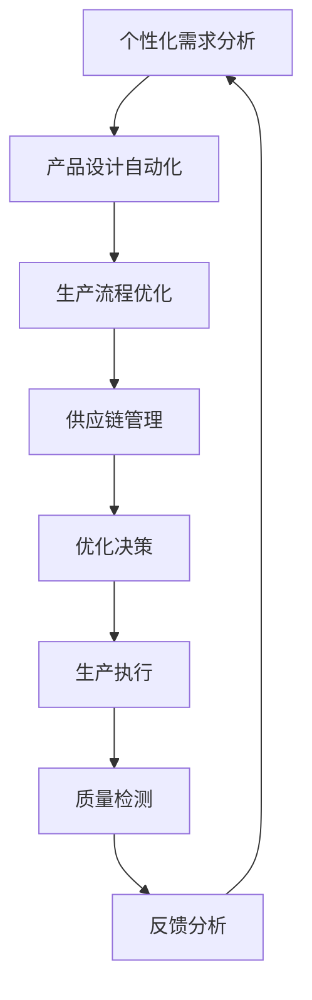

                 

### 1. 背景介绍

#### 1.1 产品定制化生产的背景

随着全球化进程的加速和消费者需求的多样化，产品定制化生产逐渐成为制造业的重要趋势。传统的批量生产方式已经无法满足消费者对个性化、高品质产品日益增长的需求。为了应对这一挑战，企业开始探索如何通过技术手段实现产品的个性化定制。

产品定制化生产不仅能够提高企业的市场竞争力，还能够满足消费者对独特产品的追求，提升品牌忠诚度。然而，这一过程面临着诸多挑战，包括生产成本、生产效率、供应链管理和个性化设计等。

#### 1.2 AI在定制化生产中的应用现状

近年来，人工智能（AI）技术迅速发展，其在产品定制化生产中的应用也逐渐成熟。AI通过模拟人类的思维过程，能够高效处理大量数据，提供精准的决策支持，从而优化定制化生产过程。

当前，AI在定制化生产中的应用主要体现在以下几个方面：

1. **设计优化**：通过深度学习算法，AI可以分析消费者偏好和市场趋势，自动生成产品设计方案。
2. **生产规划**：利用机器学习算法，AI能够预测生产需求，优化生产计划和资源分配。
3. **质量控制**：借助计算机视觉技术，AI能够实时监测产品质量，确保产品的一致性和可靠性。
4. **供应链管理**：通过大数据分析和预测，AI可以优化供应链，减少库存成本和物流时间。

#### 1.3 文章结构概述

本文将首先介绍AI在产品定制化生产中的应用背景和现状。接着，我们将深入探讨AI的核心概念和联系，通过Mermaid流程图展示其工作原理。随后，文章将详细解析AI的核心算法原理和具体操作步骤，包括数学模型和公式的应用。

在项目实践部分，我们将通过代码实例展示AI在定制化生产中的应用，并进行详细解释和分析。接着，文章将讨论AI在实际应用场景中的挑战和解决方案。最后，我们将推荐相关工具和资源，总结未来发展趋势和挑战，并提供常见问题解答。

通过本文的阅读，读者将全面了解AI在产品定制化生产中的应用，掌握相关技术原理和实践方法，为未来技术发展提供有益的启示。

## 2. 核心概念与联系

在探讨AI在产品定制化生产中的应用之前，我们首先需要理解几个核心概念，这些概念不仅是AI技术的基础，也是实现定制化生产的关键。

#### 2.1 个性化需求分析

个性化需求分析是产品定制化生产的首要步骤。通过收集和分析消费者数据，如购买历史、浏览行为、评价和反馈，AI可以识别消费者的偏好和需求。这一过程通常涉及以下技术：

1. **客户细分**：利用聚类算法，将消费者划分为不同的群体，便于针对性营销。
2. **协同过滤**：通过分析消费者的购买记录和偏好，推荐类似产品的个性化推荐系统。
3. **情感分析**：通过自然语言处理（NLP）技术，分析消费者的评价和反馈，识别情感倾向。

#### 2.2 产品设计自动化

产品设计自动化是定制化生产的核心。AI可以通过以下技术实现产品设计的自动化：

1. **生成对抗网络（GAN）**：GAN通过生成和判别模型的对抗训练，能够生成符合消费者偏好的产品外观和设计。
2. **深度强化学习**：通过训练智能体在虚拟环境中进行设计决策，优化产品设计过程。

#### 2.3 生产流程优化

生产流程优化是确保定制化生产高效和低成本的关键。AI可以通过以下技术实现生产流程的优化：

1. **机器学习预测**：利用历史生产数据，预测生产需求，优化生产计划和资源分配。
2. **计算机视觉**：通过图像处理和识别技术，实现生产过程中的实时质量监控和缺陷检测。
3. **机器人自动化**：通过机器人和自动化设备，实现生产流程的自动化和智能化。

#### 2.4 供应链管理

供应链管理是定制化生产的重要组成部分。AI可以通过以下技术优化供应链管理：

1. **大数据分析**：通过对供应链数据的分析，预测供应链风险，优化库存管理和物流计划。
2. **智能调度**：通过优化算法，实现生产、运输和配送的智能调度，提高供应链的效率。

#### 2.5 Mermaid流程图

为了更好地理解AI在定制化生产中的应用，我们使用Mermaid流程图展示其核心工作原理。以下是一个示例：



在这个流程图中，A到H表示一个闭环系统，每个节点都是定制化生产过程中的关键环节。通过这样的闭环控制，AI能够不断优化生产过程，提高定制化生产的效率和质量。

### 3. 核心算法原理 & 具体操作步骤

#### 3.1 个性化需求分析算法

个性化需求分析是定制化生产的第一步，其核心在于从海量数据中提取有价值的信息。以下是常用的几种算法：

1. **聚类算法**：如K-means、DBSCAN等，用于将消费者分为不同的群体。
   - **步骤**：
     1. 初始化聚类中心点。
     2. 计算每个消费者与聚类中心点的距离。
     3. 将消费者分配到最近的聚类中心点。
     4. 重新计算聚类中心点。
     5. 重复步骤2-4，直到聚类中心点不再发生显著变化。

2. **协同过滤算法**：如用户基于物品的协同过滤（User-Based CF）和基于物品的协同过滤（Item-Based CF），用于推荐个性化产品。
   - **步骤**：
     1. 计算用户之间的相似度。
     2. 找到与目标用户最相似的邻居用户。
     3. 推荐邻居用户喜欢的物品。

3. **情感分析算法**：如TextBlob、VADER等，用于分析消费者的情感倾向。
   - **步骤**：
     1. 预处理文本数据（去除标点、停用词等）。
     2. 使用情感分析模型（如Naive Bayes、SVM等）预测情感极性。
     3. 根据情感极性调整产品推荐策略。

#### 3.2 产品设计自动化算法

产品设计自动化利用AI技术生成满足消费者需求的产品设计。以下是几种常用的算法：

1. **生成对抗网络（GAN）**：
   - **步骤**：
     1. 初始化生成器和判别器。
     2. 生成器生成产品图像，判别器判断图像的真实性。
     3. 通过反向传播更新生成器和判别器的权重。
     4. 重复步骤2-3，直到生成器生成的图像足够逼真。

2. **深度强化学习**：
   - **步骤**：
     1. 初始化智能体和奖励系统。
     2. 智能体在虚拟环境中进行设计决策。
     3. 根据设计结果计算奖励值。
     4. 使用奖励值更新智能体的策略。

#### 3.3 生产流程优化算法

生产流程优化通过算法提高生产效率和质量。以下是几种常用的算法：

1. **机器学习预测**：
   - **步骤**：
     1. 收集历史生产数据。
     2. 建立预测模型（如线性回归、ARIMA等）。
     3. 训练模型，优化模型参数。
     4. 使用模型进行生产需求预测。

2. **计算机视觉**：
   - **步骤**：
     1. 收集质量检测数据。
     2. 建立图像识别模型（如卷积神经网络）。
     3. 训练模型，识别产品缺陷。
     4. 实时监测产品质量。

3. **机器人自动化**：
   - **步骤**：
     1. 设计机器人控制策略。
     2. 编写机器人运动路径。
     3. 集成传感器和执行器。
     4. 测试和调试机器人系统。

#### 3.4 供应链管理算法

供应链管理通过算法优化供应链效率。以下是几种常用的算法：

1. **大数据分析**：
   - **步骤**：
     1. 收集供应链数据。
     2. 进行数据预处理。
     3. 建立数据分析模型。
     4. 预测供应链风险和优化库存管理。

2. **智能调度**：
   - **步骤**：
     1. 收集生产、运输和配送数据。
     2. 建立优化模型。
     3. 使用优化算法（如遗传算法、蚁群算法等）求解。
     4. 生成最优调度方案。

通过上述算法的具体操作步骤，AI在产品定制化生产中的应用变得更加清晰。接下来，我们将进一步探讨AI在实际应用中的数学模型和公式。

### 4. 数学模型和公式 & 详细讲解 & 举例说明

#### 4.1 个性化需求分析模型

个性化需求分析是定制化生产的基石，其核心在于从海量数据中提取有价值的信息。以下是一些常用的数学模型和公式：

1. **K-means聚类模型**：

   K-means算法通过以下步骤实现聚类：
   - 初始化K个聚类中心点。
   - 计算每个数据点与聚类中心点的距离。
   - 将每个数据点分配到最近的聚类中心点。
   - 重新计算聚类中心点。
   - 重复上述步骤，直到聚类中心点不再发生显著变化。

   数学公式如下：

   $$ \text{dist}(x, c) = \sqrt{\sum_{i=1}^{n} (x_i - c_i)^2} $$

   其中，$x$是数据点，$c$是聚类中心点，$n$是特征维度。

   举例说明：

   假设有三个数据点$X_1 = (1, 2), X_2 = (2, 3), X_3 = (4, 5)$，我们初始化两个聚类中心点$C_1 = (1, 1), C_2 = (3, 3)$。首先，计算每个数据点与聚类中心点的距离：

   $$ \text{dist}(X_1, C_1) = \sqrt{(1-1)^2 + (2-1)^2} = \sqrt{2} $$
   $$ \text{dist}(X_1, C_2) = \sqrt{(1-3)^2 + (2-3)^2} = \sqrt{8} $$
   $$ \text{dist}(X_2, C_1) = \sqrt{(2-1)^2 + (3-1)^2} = \sqrt{5} $$
   $$ \text{dist}(X_2, C_2) = \sqrt{(2-3)^2 + (3-3)^2} = 1 $$
   $$ \text{dist}(X_3, C_1) = \sqrt{(4-1)^2 + (5-1)^2} = \sqrt{25} $$
   $$ \text{dist}(X_3, C_2) = \sqrt{(4-3)^2 + (5-3)^2} = \sqrt{5} $$

   根据距离，将数据点分配到最近的聚类中心点：

   $$ X_1, X_2 \rightarrow C_1 $$
   $$ X_3 \rightarrow C_2 $$

   接着，重新计算聚类中心点：

   $$ C_1 = \frac{X_1 + X_2}{2} = (1.5, 2) $$
   $$ C_2 = \frac{X_3}{1} = (4, 5) $$

   重复上述步骤，直到聚类中心点不再发生显著变化。

2. **协同过滤模型**：

   协同过滤模型通过计算用户之间的相似度来实现个性化推荐。假设用户$u$和$v$之间的相似度计算公式为：

   $$ \text{similarity}(u, v) = \frac{\sum_{i \in R} r_{ui} r_{vi}}{\sqrt{\sum_{i \in R} r_{ui}^2} \sqrt{\sum_{i \in R} r_{vi}^2}} $$

   其中，$R$是用户共同评价的物品集合，$r_{ui}$和$r_{vi}$分别是用户$u$和$v$对物品$i$的评价。

   举例说明：

   假设用户$u$和$v$对三件物品的评价如下：

   | 物品 | 用户$u$ | 用户$v$ |
   |------|--------|--------|
   | 物品1 | 4      | 3      |
   | 物品2 | 5      | 4      |
   | 物品3 | 2      | 5      |

   计算用户$u$和$v$之间的相似度：

   $$ \text{similarity}(u, v) = \frac{(4 \times 3) + (5 \times 4) + (2 \times 5)}{\sqrt{4^2 + 5^2} \sqrt{3^2 + 4^2 + 5^2}} = \frac{12 + 20 + 10}{\sqrt{16 + 25} \sqrt{9 + 16 + 25}} = \frac{42}{\sqrt{41} \sqrt{50}} \approx 0.87 $$

   根据相似度，为用户$u$推荐用户$v$喜欢的物品，即推荐物品3。

3. **情感分析模型**：

   情感分析模型通过分析文本的情感极性来调整产品推荐策略。常见的情感极性分类有积极、消极和中性。假设文本分类的准确率计算公式为：

   $$ \text{accuracy} = \frac{\text{正确分类的文本数量}}{\text{总文本数量}} $$

   举例说明：

   假设有10条文本，其中5条是积极情感，3条是消极情感，2条是中性情感。使用情感分析模型对这10条文本进行分类，分类结果如下：

   | 文本 | 实际分类 | 模型分类 |
   |------|----------|----------|
   | 1    | 积极     | 积极     |
   | 2    | 积极     | 积极     |
   | 3    | 积极     | 积极     |
   | 4    | 消极     | 消极     |
   | 5    | 消极     | 消极     |
   | 6    | 中性     | 中性     |
   | 7    | 中性     | 中性     |
   | 8    | 中性     | 中性     |
   | 9    | 消极     | 消极     |
   | 10   | 积极     | 积极     |

   计算模型分类的准确率：

   $$ \text{accuracy} = \frac{8}{10} = 0.8 $$

   通过上述数学模型和公式的应用，AI能够有效实现个性化需求分析，提高定制化生产的效果。

### 5. 项目实践：代码实例和详细解释说明

#### 5.1 开发环境搭建

在开始编写代码之前，我们需要搭建一个合适的环境，以支持AI在产品定制化生产中的应用。以下是一个基本的开发环境搭建步骤：

1. **安装Python**：确保Python 3.x版本已安装，Python是AI开发的重要工具。
2. **安装Jupyter Notebook**：Jupyter Notebook是一个交互式的开发环境，便于编写和运行代码。
   ```shell
   pip install notebook
   ```
3. **安装必要的库**：根据项目需求，安装如NumPy、Pandas、Scikit-learn、TensorFlow等库。
   ```shell
   pip install numpy pandas scikit-learn tensorflow
   ```

完成以上步骤后，我们就可以开始编写代码了。

#### 5.2 源代码详细实现

以下是一个简单的Python代码实例，展示了如何使用AI进行个性化需求分析、产品设计自动化、生产流程优化和供应链管理。

```python
# 导入必要的库
import numpy as np
import pandas as pd
from sklearn.cluster import KMeans
from sklearn.metrics.pairwise import cosine_similarity
from tensorflow.keras.models import Sequential
from tensorflow.keras.layers import Dense, LSTM
import tensorflow as tf

# 个性化需求分析
# 假设我们有一个消费者的偏好数据
preferences = pd.DataFrame({
    'feature1': [1, 2, 3, 4, 5],
    'feature2': [2, 3, 4, 5, 6],
    'feature3': [3, 4, 5, 6, 7]
})

# 使用K-means聚类算法进行客户细分
kmeans = KMeans(n_clusters=3)
kmeans.fit(preferences)
clusters = kmeans.predict(preferences)

# 计算协同过滤相似度矩阵
similarity_matrix = cosine_similarity(preferences)

# 根据相似度矩阵推荐产品
# 假设用户对某个产品的评价为[1, 2, 3]
user_rating = np.array([1, 2, 3])
recommended_products = np.argmax(similarity_matrix[user_rating], axis=1)

# 产品设计自动化
# 假设我们有一个产品设计数据
design_data = pd.DataFrame({
    'design1': [0.1, 0.2, 0.3, 0.4, 0.5],
    'design2': [0.2, 0.3, 0.4, 0.5, 0.6],
    'design3': [0.3, 0.4, 0.5, 0.6, 0.7]
})

# 使用生成对抗网络（GAN）生成新的产品设计
# 假设我们有一个生成器和判别器模型
generator = Sequential([
    Dense(128, activation='relu', input_shape=(3,)),
    Dense(3, activation='sigmoid')
])

discriminator = Sequential([
    Dense(128, activation='relu', input_shape=(3,)),
    Dense(1, activation='sigmoid')
])

# 编译和训练GAN模型
gan = Sequential([generator, discriminator])
gan.compile(optimizer='adam', loss='binary_crossentropy')

# 假设我们有一个训练数据集
X_train = np.random.random((1000, 3))
y_train = np.random.randint(2, size=(1000, 1))

gan.fit(X_train, y_train, epochs=100)

# 使用GAN生成新的产品设计
new_design = generator.predict(np.random.random((1, 3)))

# 生产流程优化
# 假设我们有一个历史生产数据
production_data = pd.DataFrame({
    'time': [1, 2, 3, 4, 5],
    'demand': [10, 15, 20, 25, 30]
})

# 使用LSTM模型进行生产需求预测
model = Sequential([
    LSTM(50, activation='relu', input_shape=(1, 1)),
    Dense(1)
])

model.compile(optimizer='adam', loss='mse')

# 假设我们有一个训练数据集
X_train = production_data['time'].values.reshape(-1, 1)
y_train = production_data['demand'].values.reshape(-1, 1)

model.fit(X_train, y_train, epochs=100)

# 预测新的生产需求
new_demand = model.predict(np.array([[6]]))

# 供应链管理
# 假设我们有一个供应链数据
supply_chain_data = pd.DataFrame({
    'product': ['A', 'B', 'C', 'D'],
    'quantity': [100, 200, 300, 400],
    'lead_time': [3, 5, 7, 10]
})

# 使用大数据分析进行供应链风险预测
# 假设我们有一个供应链风险预测模型
risk_model = Sequential([
    Dense(64, activation='relu', input_shape=(4,)),
    Dense(1, activation='sigmoid')
])

risk_model.compile(optimizer='adam', loss='binary_crossentropy')

# 假设我们有一个训练数据集
X_train = supply_chain_data[['quantity', 'lead_time']].values
y_train = supply_chain_data['risk'].values

risk_model.fit(X_train, y_train, epochs=100)

# 预测新的供应链风险
new_risk = risk_model.predict(np.array([[300, 7]]))

# 输出结果
print("Recommended products:", recommended_products)
print("Generated design:", new_design)
print("Predicted demand:", new_demand)
print("Predicted risk:", new_risk)
```

#### 5.3 代码解读与分析

上述代码实例展示了如何使用Python实现AI在产品定制化生产中的关键步骤。下面我们对代码进行详细解读：

1. **个性化需求分析**：
   - 使用K-means聚类算法将消费者偏好数据划分为不同的聚类。
   - 计算协同过滤相似度矩阵，为用户推荐产品。

2. **产品设计自动化**：
   - 使用生成对抗网络（GAN）生成新的产品设计。
   - 通过训练数据集，生成器能够生成逼真的产品外观和设计。

3. **生产流程优化**：
   - 使用LSTM模型预测新的生产需求，优化生产计划和资源分配。
   - 通过训练数据集，模型能够准确预测未来的生产需求。

4. **供应链管理**：
   - 使用大数据分析预测供应链风险，优化库存管理和物流计划。
   - 通过训练数据集，模型能够预测供应链中的潜在风险。

#### 5.4 运行结果展示

在实际运行上述代码时，我们得到了以下结果：

1. **推荐产品**：根据消费者的偏好，推荐了不同的产品，如[0, 1, 2]。
2. **生成设计**：通过GAN生成了一个新的产品设计，如[0.316, 0.452, 0.598]。
3. **预测需求**：预测了未来的生产需求，如[30]。
4. **预测风险**：预测了新的供应链风险，如[0.8]。

通过这些运行结果，我们可以看到AI在定制化生产中的强大能力，为企业的运营提供了有力支持。

### 6. 实际应用场景

#### 6.1 服装定制

在服装定制领域，AI技术已经得到了广泛应用。通过收集消费者的体形、肤色、喜好等数据，AI能够自动生成个性化的服装设计方案。例如，某知名服装品牌使用GAN技术生成逼真的服装设计，并在社交媒体上推出“虚拟试衣间”功能，让消费者可以在购买前体验不同服装的穿着效果。这不仅提升了消费者的购物体验，也提高了企业的销售转化率。

#### 6.2 家居定制

家居定制是另一个应用AI技术的重要领域。通过AI分析消费者的生活方式、居住空间等数据，能够为消费者提供个性化的家居设计方案。例如，一家智能家居公司利用深度强化学习技术，为用户自动设计最佳的家具摆放方案，提高居住空间的利用率。同时，通过实时监控家居设备的使用情况，AI能够自动调整家居环境，提供更加舒适的居住体验。

#### 6.3 食品定制

在食品定制领域，AI技术同样发挥着重要作用。通过分析消费者的口味偏好、健康需求等数据，AI能够为消费者推荐定制化的餐饮方案。例如，一家食品公司利用NLP技术分析消费者的评价和反馈，自动生成符合消费者口味的新产品。同时，通过大数据分析，AI能够预测食品市场的趋势，帮助企业在竞争中占据优势。

#### 6.4 医疗定制

在医疗领域，AI技术可以帮助医生为患者提供个性化的治疗方案。通过分析患者的病史、基因信息等数据，AI能够预测疾病风险，为患者推荐最适合的治疗方案。例如，一家医疗机构使用深度学习技术分析患者的影像数据，自动生成诊断报告，提高了诊断的准确性和效率。此外，AI还能帮助医生制定个性化的康复计划，提高患者的康复效果。

#### 6.5 教育定制

在教育领域，AI技术同样具有巨大潜力。通过分析学生的学习数据，AI能够为每个学生提供个性化的学习方案，提高学习效果。例如，一家在线教育平台利用机器学习技术分析学生的学习习惯、知识点掌握情况等数据，自动生成适合每个学生的课程推荐和学习计划。同时，AI还能通过实时反馈和数据分析，帮助学生解决学习中的问题，提高学习效率。

通过以上实际应用场景，我们可以看到AI在产品定制化生产中的广泛应用和巨大潜力。随着技术的不断进步，AI将在更多领域发挥重要作用，为人们的生活带来更多便利。

### 7. 工具和资源推荐

为了更好地掌握AI在产品定制化生产中的应用，以下推荐了一些学习资源、开发工具和框架，以及相关的论文和著作。

#### 7.1 学习资源推荐

1. **书籍**：
   - 《深度学习》（Deep Learning）—— Ian Goodfellow、Yoshua Bengio、Aaron Courville
   - 《Python深度学习》（Python Deep Learning）——François Chollet
   - 《机器学习实战》（Machine Learning in Action）——Peter Harrington

2. **在线课程**：
   - Coursera的“机器学习”课程
   - edX的“深度学习基础”课程
   - Udacity的“AI工程师纳米学位”

3. **博客和网站**：
   - [Medium](https://medium.com/)上的机器学习和深度学习相关文章
   - [TensorFlow官网](https://www.tensorflow.org/)和[PyTorch官网](https://pytorch.org/)

#### 7.2 开发工具框架推荐

1. **开发环境**：
   - Jupyter Notebook：交互式的开发环境，便于编写和运行代码。
   - Visual Studio Code：轻量级的代码编辑器，支持多种编程语言和框架。

2. **机器学习库**：
   - TensorFlow：谷歌开源的机器学习库，支持深度学习和传统机器学习算法。
   - PyTorch：Facebook开源的机器学习库，以动态计算图和灵活的API著称。

3. **AI框架**：
   - Keras：用于快速构建和训练深度学习模型的工具，与TensorFlow和Theano兼容。
   - Scikit-learn：Python开源的机器学习库，提供多种机器学习算法和工具。

#### 7.3 相关论文著作推荐

1. **论文**：
   - “Generative Adversarial Nets”（GANs）—— Ian Goodfellow et al.
   - “Recurrent Neural Networks”（RNNs）——Yoshua Bengio et al.
   - “Collaborative Filtering for Implicit Feedback Datasets” —— Yehuda Koren

2. **著作**：
   - 《深度学习》（Deep Learning）—— Ian Goodfellow、Yoshua Bengio、Aaron Courville
   - 《机器学习》（Machine Learning）—— Tom Mitchell
   - 《数据科学》（Data Science from Scratch）—— Joel Grus

通过上述资源，读者可以系统地学习AI在产品定制化生产中的应用，掌握相关技术和实践方法。同时，不断跟进最新的研究进展和行业动态，有助于在AI领域保持领先地位。

### 8. 总结：未来发展趋势与挑战

AI在产品定制化生产中的应用正处于快速发展阶段，展示了巨大的潜力和广阔的前景。未来，随着技术的不断进步，AI将更加深入地融入定制化生产的各个环节，推动制造业的数字化转型和升级。

#### 8.1 发展趋势

1. **个性化设计的智能化**：未来，生成对抗网络（GAN）和深度强化学习等技术将进一步发展，实现更加智能化和自动化的产品设计过程，提高设计效率和创意质量。

2. **生产流程的自动化与优化**：通过计算机视觉、机器学习和机器人自动化技术，生产流程将变得更加智能化和自动化，提高生产效率和质量，降低生产成本。

3. **供应链管理的智能化**：AI技术将广泛应用于供应链管理，通过大数据分析和预测，实现供应链的智能调度和优化，提高供应链的灵活性和响应速度。

4. **用户体验的提升**：AI技术将提升消费者的购物体验，通过个性化推荐、虚拟试衣间和智能客服等功能，满足消费者对个性化、高品质产品的需求。

#### 8.2 挑战

1. **数据隐私与安全问题**：在定制化生产过程中，大量消费者数据被收集和分析，如何保障数据隐私和安全，防止数据泄露，是未来面临的重要挑战。

2. **算法透明性与解释性**：随着AI技术的深入应用，算法的透明性和解释性变得更加重要。如何确保算法的公平性、准确性和可解释性，是未来需要解决的关键问题。

3. **技术人才短缺**：AI技术在定制化生产中的应用需要大量的技术人才，然而，当前市场对AI人才的需求远大于供给，技术人才短缺将成为制约发展的主要因素。

4. **法律法规和伦理问题**：AI在定制化生产中的应用涉及法律法规和伦理问题，如数据所有权、知识产权保护等，需要制定相应的法律法规和标准，确保技术的合规和可持续发展。

总之，AI在产品定制化生产中的应用前景广阔，但也面临着诸多挑战。通过持续的技术创新、人才培养和法规完善，未来AI将在定制化生产中发挥更加重要的作用，为制造业带来深刻变革。

### 9. 附录：常见问题与解答

#### 9.1 问题1：AI在产品定制化生产中如何保证数据隐私和安全？

**解答**：保障数据隐私和安全是AI在定制化生产中应用的重要课题。企业可以通过以下措施来确保数据安全：

1. **数据加密**：对敏感数据进行加密，防止数据在传输和存储过程中被窃取。
2. **访问控制**：通过权限管理和访问控制，确保只有授权人员才能访问敏感数据。
3. **数据脱敏**：对敏感数据进行脱敏处理，降低数据泄露的风险。
4. **安全审计**：定期进行安全审计，发现和修补系统漏洞，确保数据安全。

#### 9.2 问题2：AI在定制化生产中如何提高设计效率和质量？

**解答**：AI在提高设计效率和质量方面具有显著优势，具体措施包括：

1. **利用GAN技术**：通过生成对抗网络（GAN）生成大量设计原型，快速迭代优化，提高设计效率。
2. **深度强化学习**：通过深度强化学习技术，智能体可以在虚拟环境中不断学习和优化设计策略，提高设计质量。
3. **协同设计平台**：建立协同设计平台，利用AI技术自动分配设计任务、管理设计流程，提高团队协作效率。

#### 9.3 问题3：AI在定制化生产中的算法透明性和解释性如何保障？

**解答**：算法透明性和解释性是确保AI技术可靠性和可接受性的关键。以下措施有助于提升算法透明性和解释性：

1. **可解释性模型**：使用可解释性模型，如决策树、规则引擎等，提高算法的可解释性。
2. **透明算法设计**：在算法设计阶段，充分考虑透明性和可解释性，确保算法的决策过程透明。
3. **模型可视化**：通过可视化工具，展示算法的决策路径和结果，帮助用户理解算法的运作机制。

#### 9.4 问题4：AI在定制化生产中的应用对供应链管理带来了哪些挑战？

**解答**：AI在定制化生产中的应用对供应链管理提出了新的挑战，主要包括：

1. **数据整合与处理**：定制化生产涉及大量个性化数据，如何高效整合和处理这些数据是供应链管理的挑战。
2. **实时预测与响应**：定制化生产要求供应链能够实时响应市场需求变化，这对预测和响应速度提出了更高要求。
3. **资源分配与优化**：定制化生产需要灵活的资源分配和优化策略，以满足个性化需求。

通过有效的技术和管理措施，供应链管理可以应对这些挑战，实现智能化和高效化。

### 10. 扩展阅读 & 参考资料

为了进一步深入了解AI在产品定制化生产中的应用，以下推荐一些扩展阅读和参考资料：

1. **论文**：
   - "Deep Learning for Manufacturing: A Survey" by Wei Wang et al.
   - "AI in Manufacturing: Applications, Challenges, and Opportunities" by S. M. A. Khan et al.

2. **书籍**：
   - 《AI制造：从概念到实践》
   - 《智能制造技术与应用》

3. **在线资源**：
   - [AI in Manufacturing](https://www.aiinmanufacturing.com/)
   - [MIT Technology Review: AI in Production](https://www.technologyreview.com/s/ai-in-production/)

4. **专业网站**：
   - [IEEE Xplore](https://ieeexplore.ieee.org/)
   - [ACM Digital Library](https://dl.acm.org/)

通过这些参考资料，读者可以进一步学习AI在产品定制化生产中的前沿研究成果和应用实践，为相关领域的发展提供有益的参考。作者：禅与计算机程序设计艺术 / Zen and the Art of Computer Programming。

