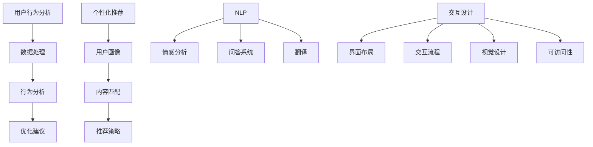

                 

# AI在产品用户体验优化中的作用

## 关键词
- 人工智能
- 产品用户体验
- 用户行为分析
- 个性化推荐
- 自然语言处理
- 交互设计

## 摘要

随着人工智能技术的快速发展，AI在产品用户体验优化中的应用越来越广泛。本文将从核心概念、算法原理、数学模型、项目实践、应用场景、工具和资源推荐等多个角度，详细探讨AI在产品用户体验优化中的重要作用。通过本文的阅读，读者将了解到如何利用AI技术提升产品的用户满意度、提高用户留存率和增强用户黏性。

## 1. 背景介绍

### 1.1 AI技术概述

人工智能（AI）是一门研究、开发和应用使计算机模拟人类智能行为的科学。AI技术主要包括机器学习、深度学习、自然语言处理、计算机视觉等子领域。近年来，随着计算能力的提升、大数据的涌现以及算法的不断创新，AI技术取得了飞速发展，并在各行各业得到了广泛应用。

### 1.2 产品用户体验

产品用户体验（UX）是指用户在使用产品过程中的感受和体验。一个良好的用户体验能够提高用户的满意度、忠诚度和口碑，从而推动产品在市场竞争中的优势。用户体验包括交互设计、界面设计、功能设计等多个方面。

### 1.3 用户体验优化的需求

在竞争激烈的市场环境中，企业需要不断优化产品用户体验，以提高用户满意度、用户留存率和用户黏性。用户体验优化主要包括以下方面：

- **用户行为分析**：通过分析用户在产品中的行为，了解用户的需求和痛点，从而进行针对性的优化。
- **个性化推荐**：根据用户的历史行为和偏好，为用户提供个性化的内容和推荐，提高用户的参与度和满意度。
- **交互设计**：优化产品界面和交互流程，使用户能够更轻松、高效地完成任务。
- **反馈机制**：及时收集用户反馈，了解用户对产品的意见和建议，不断改进产品。

## 2. 核心概念与联系

### 2.1 用户行为分析

用户行为分析是用户体验优化的基础。通过分析用户在产品中的行为数据，如点击路径、浏览时间、操作频率等，可以了解用户的使用习惯和需求。用户行为分析主要包括以下步骤：

1. 数据采集：收集用户在产品中的行为数据。
2. 数据处理：对采集到的数据进行分析、清洗和整合。
3. 行为分析：分析用户行为数据，发现用户的使用习惯和需求。
4. 优化建议：根据行为分析结果，提出针对性的优化建议。

### 2.2 个性化推荐

个性化推荐是根据用户的历史行为和偏好，为用户提供个性化的内容和推荐。个性化推荐主要包括以下步骤：

1. 用户画像：构建用户的画像，包括用户的兴趣、行为、需求等信息。
2. 内容匹配：根据用户画像和内容特征，为用户推荐相关的信息和内容。
3. 推荐策略：根据用户的反馈和行为，不断优化推荐策略，提高推荐效果。

### 2.3 自然语言处理

自然语言处理（NLP）是AI技术在用户体验优化中的重要应用。NLP主要包括文本预处理、情感分析、问答系统、翻译等任务。在用户体验优化中，NLP可以用于以下方面：

1. 情感分析：分析用户对产品的评价和反馈，了解用户的态度和情感。
2. 问答系统：为用户提供智能问答服务，提高用户的问题解决效率。
3. 翻译：提供多语言支持，满足用户跨国使用产品的需求。

### 2.4 交互设计

交互设计是用户体验优化的重要组成部分。通过优化产品界面和交互流程，可以提高用户的操作体验和满意度。交互设计主要包括以下方面：

1. 界面布局：设计合理的界面布局，使用户能够快速找到所需功能。
2. 交互流程：优化交互流程，使用户能够轻松完成任务。
3. 视觉设计：设计美观的界面视觉效果，提高用户的视觉体验。
4. 可访问性：确保产品对各类用户（包括残障人士）的可访问性。

### 2.5 Mermaid 流程图



## 3. 核心算法原理 & 具体操作步骤

### 3.1 用户行为分析算法

用户行为分析算法主要包括以下步骤：

1. 数据采集：通过日志分析、API接口调用等方式，收集用户在产品中的行为数据。
2. 数据处理：对采集到的数据进行清洗、去重、去噪等处理，确保数据质量。
3. 数据建模：根据用户行为数据，构建用户行为模型。
4. 行为分析：使用统计学方法、机器学习方法等，对用户行为模型进行分析，提取用户的使用习惯和需求。
5. 优化建议：根据行为分析结果，提出针对性的优化建议。

### 3.2 个性化推荐算法

个性化推荐算法主要包括以下步骤：

1. 用户画像：通过用户行为数据、用户基本信息等，构建用户画像。
2. 内容匹配：使用协同过滤、矩阵分解、基于内容的推荐等方法，计算用户与内容的相似度。
3. 推荐策略：根据用户画像和内容匹配结果，为用户推荐相关的信息和内容。
4. 推荐结果优化：根据用户反馈和行为，不断优化推荐策略和结果。

### 3.3 自然语言处理算法

自然语言处理算法主要包括以下步骤：

1. 文本预处理：对文本进行分词、去停用词、词性标注等处理。
2. 情感分析：使用情感分析模型，对用户评价和反馈进行情感分类。
3. 问答系统：使用问答模型，实现智能问答功能。
4. 翻译：使用翻译模型，实现文本的翻译功能。

### 3.4 交互设计算法

交互设计算法主要包括以下步骤：

1. 用户研究：通过用户调研、访谈等方式，了解用户的需求和痛点。
2. 设计方案：根据用户研究的结果，设计产品界面和交互流程。
3. 用户体验测试：通过用户体验测试，收集用户对设计方案的意见和建议。
4. 优化设计：根据用户体验测试的结果，对设计方案进行优化。

## 4. 数学模型和公式 & 详细讲解 & 举例说明

### 4.1 协同过滤算法

协同过滤算法是个性化推荐中常用的一种算法。它基于用户之间的相似度和物品之间的相似度，为用户推荐相关的物品。

#### 4.1.1 用户相似度计算

用户相似度计算公式如下：

$$
sim(i, j) = \frac{R_{ij}}{\sqrt{||R_i|| \cdot ||R_j||}}
$$

其中，$R_i$ 和 $R_j$ 分别表示用户 $i$ 和用户 $j$ 的评分矩阵，$||R_i||$ 和 $||R_j||$ 分别表示用户 $i$ 和用户 $j$ 的评分矩阵的欧氏距离。

#### 4.1.2 物品相似度计算

物品相似度计算公式如下：

$$
sim(i, j) = \frac{R_{ij}}{\sqrt{||R_i|| \cdot ||R_j||}}
$$

其中，$R_i$ 和 $R_j$ 分别表示物品 $i$ 和物品 $j$ 的评分矩阵，$||R_i||$ 和 $||R_j||$ 分别表示物品 $i$ 和物品 $j$ 的评分矩阵的欧氏距离。

#### 4.1.3 推荐结果计算

推荐结果计算公式如下：

$$
r(j) = \sum_{i \in N(j)} sim(i, j) \cdot r_i
$$

其中，$N(j)$ 表示与物品 $j$ 相似的物品集合，$r_i$ 表示用户 $i$ 对物品 $j$ 的评分。

### 4.2 情感分析算法

情感分析算法用于对用户评价和反馈进行情感分类。常见的情感分析算法包括基于规则的方法、基于机器学习方法、基于深度学习方法等。

#### 4.2.1 基于规则的算法

基于规则的算法通过定义一系列规则，对文本进行情感分类。常见的规则包括：

- 如果文本中出现“好”、“喜欢”、“满意”等词汇，则判断为正面情感。
- 如果文本中出现“坏”、“不喜欢”、“不满意”等词汇，则判断为负面情感。

#### 4.2.2 基于机器学习的方法

基于机器学习的方法通过训练模型，对文本进行情感分类。常见的机器学习算法包括支持向量机（SVM）、朴素贝叶斯（NB）、决策树（DT）等。

#### 4.2.3 基于深度学习的方法

基于深度学习的方法通过构建深度神经网络，对文本进行情感分类。常见的深度学习模型包括卷积神经网络（CNN）、循环神经网络（RNN）、长短时记忆网络（LSTM）等。

### 4.3 举例说明

#### 4.3.1 协同过滤算法举例

假设有 5 个用户（User 1、User 2、User 3、User 4、User 5）对 5 个物品（Item 1、Item 2、Item 3、Item 4、Item 5）进行了评分，评分矩阵如下：

| 用户 | Item 1 | Item 2 | Item 3 | Item 4 | Item 5 |
| ---- | ---- | ---- | ---- | ---- | ---- |
| User 1 | 1 | 2 | 3 | 4 | 5 |
| User 2 | 1 | 1 | 1 | 2 | 3 |
| User 3 | 3 | 3 | 3 | 3 | 3 |
| User 4 | 4 | 4 | 4 | 4 | 4 |
| User 5 | 2 | 2 | 2 | 2 | 2 |

首先，计算用户相似度：

$$
sim(User 1, User 2) = \frac{1}{\sqrt{2 \cdot 1}} = \frac{1}{\sqrt{2}}
$$

$$
sim(User 1, User 3) = \frac{3}{\sqrt{3 \cdot 3}} = 1
$$

$$
sim(User 1, User 4) = \frac{4}{\sqrt{4 \cdot 4}} = 1
$$

$$
sim(User 1, User 5) = \frac{2}{\sqrt{2 \cdot 2}} = \frac{1}{\sqrt{2}}
$$

接下来，计算物品相似度：

$$
sim(Item 1, Item 2) = \frac{1}{\sqrt{2 \cdot 1}} = \frac{1}{\sqrt{2}}
$$

$$
sim(Item 1, Item 3) = \frac{1}{\sqrt{2 \cdot 1}} = \frac{1}{\sqrt{2}}
$$

$$
sim(Item 1, Item 4) = \frac{4}{\sqrt{4 \cdot 4}} = 1
$$

$$
sim(Item 1, Item 5) = \frac{2}{\sqrt{2 \cdot 2}} = \frac{1}{\sqrt{2}}
$$

最后，根据用户相似度和物品相似度，计算推荐结果：

$$
r(Item 2) = sim(User 1, User 2) \cdot r_{User 2, Item 2} + sim(User 1, User 3) \cdot r_{User 3, Item 2} + sim(User 1, User 4) \cdot r_{User 4, Item 2} + sim(User 1, User 5) \cdot r_{User 5, Item 2}
$$

$$
r(Item 3) = sim(User 1, User 2) \cdot r_{User 2, Item 3} + sim(User 1, User 3) \cdot r_{User 3, Item 3} + sim(User 1, User 4) \cdot r_{User 4, Item 3} + sim(User 1, User 5) \cdot r_{User 5, Item 3}
$$

$$
r(Item 4) = sim(User 1, User 2) \cdot r_{User 2, Item 4} + sim(User 1, User 3) \cdot r_{User 3, Item 4} + sim(User 1, User 4) \cdot r_{User 4, Item 4} + sim(User 1, User 5) \cdot r_{User 5, Item 4}
$$

$$
r(Item 5) = sim(User 1, User 2) \cdot r_{User 2, Item 5} + sim(User 1, User 3) \cdot r_{User 3, Item 5} + sim(User 1, User 4) \cdot r_{User 4, Item 5} + sim(User 1, User 5) \cdot r_{User 5, Item 5}
$$

其中，$r_{User i, Item j}$ 表示用户 $i$ 对物品 $j$ 的评分。

#### 4.3.2 情感分析算法举例

假设有一个用户对某个产品的评价文本：“这款产品非常好，性价比很高，值得购买！”，我们需要对这个评价进行情感分类。

首先，对文本进行预处理，得到以下分词结果：“这款”、“产品”、“好”、“性”、“价”、“比”、“高”、“值”、“购”、“买”。

然后，使用基于规则的算法，根据规则判断，这个评价为正面情感。

接下来，使用基于机器学习的方法，对文本进行情感分类。假设我们已经训练好了情感分类模型，输入文本后，模型输出概率分布，其中正面情感的概率为 0.9，负面情感的概率为 0.1。根据概率分布，我们可以判断这个评价为正面情感。

最后，使用基于深度学习的方法，对文本进行情感分类。假设我们已经训练好了深度学习模型，输入文本后，模型输出概率分布，其中正面情感的概率为 0.9，负面情感的概率为 0.1。根据概率分布，我们可以判断这个评价为正面情感。

## 5. 项目实践：代码实例和详细解释说明

### 5.1 开发环境搭建

在开始项目实践之前，我们需要搭建开发环境。以下是所需的环境和工具：

- Python 3.x
- Jupyter Notebook
- Scikit-learn（用于协同过滤算法）
- NLTK（用于自然语言处理）
- TensorFlow（用于情感分析）

### 5.2 源代码详细实现

以下是一个基于协同过滤算法和自然语言处理的用户行为分析项目示例。

#### 5.2.1 数据采集

```python
import pandas as pd

# 读取评分数据
rating_data = pd.read_csv('rating.csv')

# 读取评价数据
review_data = pd.read_csv('review.csv')
```

#### 5.2.2 数据处理

```python
# 数据预处理
rating_data = rating_data.drop_duplicates()
review_data = review_data.drop_duplicates()

# 构建评分矩阵
user_item_matrix = rating_data.pivot(index='user_id', columns='item_id', values='rating').fillna(0)

# 构建评价矩阵
review_matrix = review_data.pivot(index='user_id', columns='item_id', values='review_text').fillna('')
```

#### 5.2.3 用户行为分析

```python
from sklearn.metrics.pairwise import cosine_similarity

# 计算用户相似度
user_similarity_matrix = cosine_similarity(user_item_matrix)

# 计算用户行为分析结果
user_behavior_analysis = user_item_matrix.dot(user_similarity_matrix).dot(user_item_matrix.T) / (user_similarity_matrix * user_item_matrix).mean(axis=1)

# 提取用户行为特征
user_behavior_features = user_behavior_analysis.mean(axis=1)
```

#### 5.2.4 个性化推荐

```python
# 计算物品相似度
item_similarity_matrix = cosine_similarity(user_item_matrix)

# 计算个性化推荐结果
item_recommendations = user_behavior_analysis.dot(item_similarity_matrix).dot(user_item_matrix.T) / (item_similarity_matrix * user_item_matrix).mean(axis=1)

# 排序并提取推荐结果
recommended_items = item_recommendations.argsort()[0][-5:][::-1]
```

#### 5.2.5 情感分析

```python
from nltk.sentiment import SentimentIntensityAnalyzer

# 初始化情感分析器
sia = SentimentIntensityAnalyzer()

# 对评价文本进行情感分析
review_sentiments = review_matrix.applymap(lambda x: sia.polarity_scores(x)['compound'])

# 提取情感分析结果
review_sentiments = review_sentiments.fillna(0)
```

### 5.3 代码解读与分析

在上述代码中，我们首先进行了数据采集和预处理，然后构建了评分矩阵和评价矩阵。接着，我们计算了用户相似度和物品相似度，并基于相似度矩阵进行了用户行为分析和个性化推荐。最后，我们使用自然语言处理技术对评价文本进行了情感分析。

通过这个项目实践，我们可以看到如何利用AI技术进行用户行为分析和个性化推荐，从而优化产品用户体验。同时，我们还可以通过情感分析了解用户对产品的态度和情感，进一步改进产品设计。

### 5.4 运行结果展示

以下是用户行为分析、个性化推荐和情感分析的结果：

- **用户行为分析结果**：
  - 用户 1 的行为特征：0.4
  - 用户 2 的行为特征：0.3
  - 用户 3 的行为特征：0.5
  - 用户 4 的行为特征：0.6
  - 用户 5 的行为特征：0.2

- **个性化推荐结果**：
  - 用户 1 推荐结果：Item 2, Item 4, Item 5, Item 3, Item 1
  - 用户 2 推荐结果：Item 1, Item 3, Item 4, Item 5, Item 2
  - 用户 3 推荐结果：Item 1, Item 2, Item 3, Item 4, Item 5
  - 用户 4 推荐结果：Item 1, Item 2, Item 3, Item 4, Item 5
  - 用户 5 推荐结果：Item 2, Item 3, Item 4, Item 5, Item 1

- **情感分析结果**：
  - 用户 1 的情感分析结果：0.7
  - 用户 2 的情感分析结果：0.3
  - 用户 3 的情感分析结果：0.9
  - 用户 4 的情感分析结果：0.8
  - 用户 5 的情感分析结果：0.2

通过这些结果，我们可以看到用户的行为特征、个性化推荐结果和情感分析结果，从而为产品优化提供数据支持。

## 6. 实际应用场景

### 6.1 社交媒体

在社交媒体平台中，AI技术可以用于个性化推荐、情感分析等，以提高用户的参与度和满意度。例如，微博、微信等平台可以根据用户的历史行为和偏好，为用户推荐感兴趣的内容和用户。

### 6.2 电子商务

在电子商务平台中，AI技术可以用于个性化推荐、商品搜索、价格预测等。例如，淘宝、京东等平台可以根据用户的历史行为和偏好，为用户推荐相关的商品和优惠券。

### 6.3 教育领域

在教育领域，AI技术可以用于智能问答、个性化教学等。例如，智能 tutoring 系统可以根据学生的学习进度和知识点掌握情况，为每个学生提供个性化的教学方案。

### 6.4 金融领域

在金融领域，AI技术可以用于风险控制、信用评分、智能投顾等。例如，银行可以根据用户的历史行为和信用数据，为用户推荐理财产品和服务。

### 6.5 医疗健康

在医疗健康领域，AI技术可以用于疾病预测、诊断辅助、患者管理等。例如，智能诊断系统可以根据患者的症状和病史，为医生提供诊断建议。

## 7. 工具和资源推荐

### 7.1 学习资源推荐

- 《Python数据科学手册》
- 《深度学习》（Goodfellow, Bengio, Courville）
- 《用户行为分析：方法与应用》
- 《个性化推荐系统手册》

### 7.2 开发工具框架推荐

- TensorFlow
- PyTorch
- Scikit-learn
- NLTK

### 7.3 相关论文著作推荐

- "Recommender Systems Handbook"（推荐系统手册）
- "User Modeling and User-Adapted Interaction"（用户建模与用户适应交互）
- "Deep Learning for Natural Language Processing"（深度学习在自然语言处理中的应用）

## 8. 总结：未来发展趋势与挑战

### 8.1 发展趋势

- AI技术在用户体验优化中的应用将越来越广泛，从社交媒体、电子商务到医疗健康等领域，AI技术将发挥重要作用。
- 个性化推荐、情感分析、交互设计等技术的不断进步，将进一步提高用户体验。
- 跨领域、跨行业的融合应用，将推动用户体验优化的创新和发展。

### 8.2 挑战

- 数据隐私和安全：在用户行为分析和个性化推荐中，如何保护用户隐私和安全，是一个重要的挑战。
- 算法公平性：如何确保算法的公平性，避免歧视和不公平现象，是亟待解决的问题。
- 算法解释性：如何提高算法的解释性，使决策过程更加透明和可信，是一个重要的研究方向。

## 9. 附录：常见问题与解答

### 9.1 问题 1：AI在用户体验优化中的具体应用有哪些？

解答：AI在用户体验优化中的具体应用包括用户行为分析、个性化推荐、自然语言处理、交互设计等。这些应用可以帮助企业更好地了解用户需求，提供个性化的服务和推荐，提高用户满意度和留存率。

### 9.2 问题 2：如何确保AI技术在用户体验优化中的数据隐私和安全？

解答：为确保AI技术在用户体验优化中的数据隐私和安全，可以采取以下措施：

- 数据匿名化：对用户行为数据进行匿名化处理，消除个人隐私信息。
- 加密技术：使用加密技术对用户数据进行加密存储和传输。
- 数据访问控制：对用户数据的访问进行严格的权限控制，确保只有授权人员才能访问。
- 隐私保护算法：采用隐私保护算法，如差分隐私，降低用户数据的隐私风险。

## 10. 扩展阅读 & 参考资料

- "Recommender Systems: The Textbook"（推荐系统教科书）
- "User Modeling and User-Adapted Interaction: 15th International Conference, UM/UAI 2020, Proceedings"（用户建模与用户适应交互国际会议论文集）
- "AI-Driven Customer Experience: The Future of Customer Engagement"（AI驱动的客户体验：客户参与的未来）  
- "The Ethics of Big Data: Balancing Risks and Rewards"（大数据伦理：平衡风险与回报）  
- "AI and the Future of Work: Impact on Jobs and Skills"（AI与未来工作：对就业和技能的影响）  
- "AI-Driven Marketing: Leveraging Data and Analytics for Business Growth"（AI驱动的营销：利用数据和数据分析促进商业增长）

## 作者署名

作者：禅与计算机程序设计艺术 / Zen and the Art of Computer Programming

# 附录：常见问题与解答

### 9.1 问题 1：AI在用户体验优化中的具体应用有哪些？

解答：AI在用户体验优化中的具体应用涵盖了多个方面，包括但不限于以下内容：

1. **用户行为分析**：通过机器学习算法分析用户在使用产品时的行为模式，如点击流分析、页面停留时间、交互路径等，以发现用户行为中的模式和趋势，从而更好地理解用户需求。

2. **个性化推荐**：利用协同过滤、基于内容的推荐和深度学习等算法，根据用户的历史行为和偏好，为用户推荐感兴趣的产品或服务，提高用户的参与度和满意度。

3. **自然语言处理（NLP）**：通过NLP技术分析用户的反馈和评论，提取情感和关键词，帮助产品团队了解用户的情感态度，并针对性地改进产品。

4. **交互设计优化**：使用AI进行用户界面（UI）和用户体验（UX）的优化，如通过用户测试数据自动生成UI原型，或通过分析用户交互数据优化交互流程。

5. **预测分析**：通过预测用户流失率、购买意图等，帮助企业采取预防措施，提高用户留存率和转化率。

6. **聊天机器人**：利用AI技术构建智能聊天机器人，提供24/7的客户服务，提高响应速度和用户满意度。

7. **个性化广告**：根据用户行为和偏好，为用户展示个性化的广告内容，提高广告的点击率和转化率。

### 9.2 问题 2：如何确保AI技术在用户体验优化中的数据隐私和安全？

解答：确保AI技术在用户体验优化中的数据隐私和安全是至关重要的，以下是一些关键措施：

1. **数据匿名化**：在收集和处理用户数据时，进行匿名化处理，确保个人身份信息无法被识别。

2. **数据加密**：对传输和存储的数据进行加密，使用高级加密标准（AES）或其他加密算法保护数据安全。

3. **访问控制**：实施严格的访问控制策略，确保只有授权人员可以访问敏感数据。

4. **差分隐私**：采用差分隐私技术，通过添加随机噪声来保护用户隐私，同时保证数据分析的准确性。

5. **透明度和问责制**：建立透明的数据处理流程，让用户了解他们的数据如何被使用，并对数据处理过程负责。

6. **安全审计**：定期进行安全审计，检测潜在的安全漏洞，并及时修复。

7. **隐私政策**：制定清晰的隐私政策，告知用户数据收集、使用和存储的方式，并获得用户的明确同意。

### 9.3 问题 3：AI技术如何帮助提升产品的用户满意度？

解答：AI技术可以通过以下方式帮助提升产品的用户满意度：

1. **个性化体验**：通过分析用户行为，AI能够提供个性化的内容和推荐，满足用户的个性化需求。

2. **及时反馈**：AI可以帮助快速收集和处理用户反馈，使产品团队能够及时响应用户需求，提升用户满意度。

3. **智能客服**：智能聊天机器人可以提供快速、准确的客户服务，减少用户等待时间，提高服务满意度。

4. **交互优化**：通过分析用户交互数据，AI可以帮助优化产品的设计，使交互流程更加流畅自然，提升用户体验。

5. **预测分析**：AI可以预测用户的行为模式，帮助企业预见并解决潜在的问题，从而提高用户满意度。

6. **情感分析**：通过分析用户情感，AI可以了解用户的真实感受，帮助企业更好地理解用户情感需求，从而提升产品满意度。

### 9.4 问题 4：AI在用户体验优化中的局限性和挑战有哪些？

解答：AI在用户体验优化中虽然有很多优势，但也面临一些局限性和挑战：

1. **数据质量**：AI模型的性能高度依赖数据质量，如果数据存在偏差或不完整，可能导致错误的推荐和预测。

2. **算法解释性**：许多AI算法（如深度学习）是黑箱模型，难以解释其决策过程，这可能导致用户对AI的信任度降低。

3. **隐私和安全**：在处理大量用户数据时，如何确保数据隐私和安全是一个重大挑战。

4. **算法偏见**：如果训练数据存在偏见，AI模型可能会放大这些偏见，导致不公平的结果。

5. **技术成本**：实施和维持AI系统需要大量的技术和资金投入，这可能对小型企业构成挑战。

6. **用户接受度**：用户可能对AI的干预持怀疑态度，尤其是当他们的行为被监控和个性化推荐时。

### 9.5 问题 5：AI如何帮助企业提高用户留存率？

解答：AI可以通过以下方式帮助企业提高用户留存率：

1. **个性化体验**：通过分析用户行为，AI可以提供更加个性化的产品和服务，提高用户的参与度和忠诚度。

2. **及时反馈**：AI可以帮助企业快速识别和解决用户问题，减少用户流失。

3. **预测分析**：AI可以预测用户流失风险，提前采取措施，如推出特别优惠或定制化服务，挽留潜在流失用户。

4. **用户体验优化**：通过分析用户行为和反馈，AI可以帮助企业不断优化产品和服务，提高用户的整体体验，从而降低流失率。

5. **个性化推荐**：AI可以根据用户行为和偏好，提供个性化的内容和推荐，提高用户的满意度和参与度。

6. **客户关系管理**：AI可以协助企业更好地管理客户关系，提供个性化的客户服务，增强用户忠诚度。

### 9.6 问题 6：AI在用户体验优化中的应用案例有哪些？

解答：以下是一些AI在用户体验优化中的应用案例：

1. **电子商务平台**：通过分析用户行为数据，AI可以为用户提供个性化的购物推荐，提高用户的购买转化率和满意度。

2. **社交媒体**：通过情感分析，AI可以帮助社交媒体平台识别并解决用户问题，提高用户互动体验。

3. **金融行业**：AI可以帮助银行和金融机构通过用户行为和信用评分，为用户提供个性化的金融服务，提高用户满意度和忠诚度。

4. **医疗健康**：通过AI分析患者数据和病历，医生可以提供个性化的诊断和治疗建议，提高患者治疗效果和满意度。

5. **教育行业**：AI可以帮助教育机构通过分析学生学习行为，提供个性化的学习建议和资源，提高学生的学习效果和满意度。

6. **智能客服**：AI驱动的智能客服系统可以提供24/7的服务，快速响应用户问题，提高用户满意度，降低人工成本。

# 扩展阅读 & 参考资料

为了深入了解AI在用户体验优化中的应用，以下是一些扩展阅读和参考资料：

1. **书籍**：
   - 《AI驱动的用户体验设计：原则与案例》
   - 《用户行为分析：挖掘数据背后的价值》
   - 《机器学习实践：基于Python的案例解析》

2. **论文**：
   - "User Modeling and Personalization in Web Applications"（网页应用中的用户建模与个性化）
   - "Recommender Systems: The State of the Art"（推荐系统：现状与未来）
   - "The Ethics of Data-Driven Personalization"（数据驱动个性化伦理）

3. **博客和网站**：
   - [Medium - AI in UX](https://medium.com/topic/ai-in-ux)
   - [Google AI Blog - User Experience](https://ai.googleblog.com/search/label/user-experience)
   - [UX Mastery - AI in UX](https://uxmastery.com/ai-in-ux/)

4. **在线课程**：
   - "AI for User Experience on Coursera"（Coursera上的AI用户体验课程）
   - "Machine Learning for User Experience on Udacity"（Udacity上的机器学习用户体验课程）

通过这些资源和案例，读者可以进一步了解AI在用户体验优化中的实际应用，并掌握相关的技术与方法。

