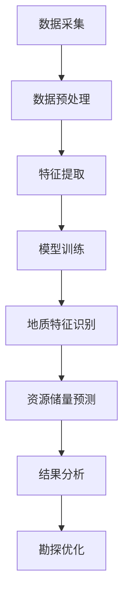
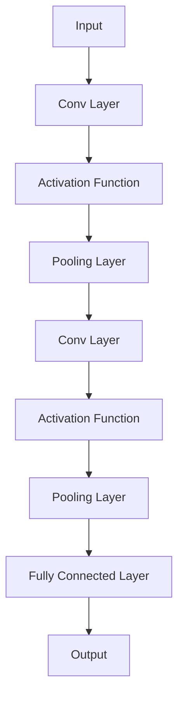
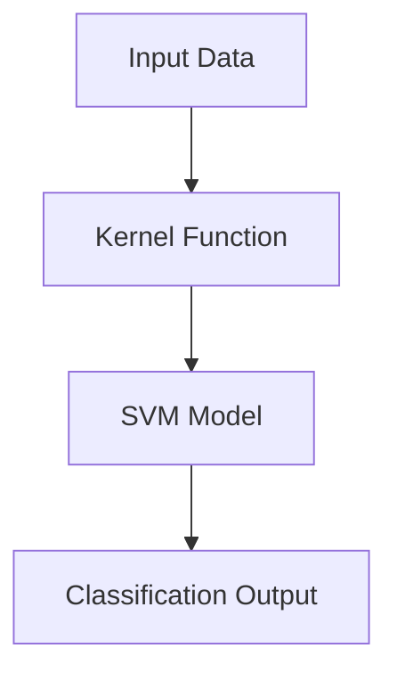
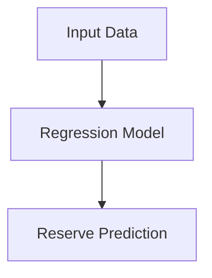

                 

### 文章标题

**AI在地质勘探中的应用：提高资源发现率**

> **关键词**：地质勘探、人工智能、资源发现、数据分析、机器学习、深度学习、数据处理
>
> **摘要**：本文旨在探讨人工智能（AI）在地质勘探领域中的应用，以及如何通过AI技术提高资源发现率。文章将首先介绍地质勘探的基本概念，随后详细阐述AI在地质勘探中的应用原理和方法，并探讨当前AI技术在该领域的实际应用案例。最后，我们将总结AI在地质勘探中的发展趋势和面临的挑战，展望未来的应用前景。

### 1. 背景介绍

地质勘探是资源开发过程中的关键环节，旨在通过地质调查和分析，确定矿产资源的种类、储量、分布和开采条件。传统的地质勘探方法主要依赖于地质学家的经验和传统的测量工具，如地质锤、罗盘仪和地形测量设备。然而，这些方法往往效率低下，且对地质学家个人技能要求极高。

随着信息技术和人工智能（AI）技术的快速发展，地质勘探领域迎来了新的机遇。AI技术，特别是机器学习和深度学习，在处理大规模地质数据、识别地质特征和预测矿产资源分布等方面显示出巨大的潜力。通过AI技术，可以自动化地质数据分析和特征识别过程，从而大幅提高勘探效率和资源发现率。

近年来，AI在地质勘探中的应用已经取得了一系列显著成果。例如，AI算法能够通过分析卫星遥感图像、地球物理数据和地质调查报告，识别潜在矿产资源区域；AI模型能够预测矿产资源的分布和储量，为地质勘探提供科学依据。此外，AI技术还可以优化勘探路线，减少勘探成本，提高资源开发的精确度和可持续性。

### 2. 核心概念与联系

为了深入理解AI在地质勘探中的应用，我们需要首先了解几个核心概念：

#### 2.1 地质勘探数据

地质勘探数据是地质勘探过程中的重要信息来源，包括卫星遥感图像、地球物理测量数据、地质调查报告等。这些数据具有高维度、高噪声、非线性和复杂分布等特点，传统的数据分析方法难以有效处理。

#### 2.2 机器学习与深度学习

机器学习是一种人工智能技术，通过算法从数据中自动学习和发现规律。深度学习是机器学习的一种特殊形式，基于多层神经网络，能够自动提取数据的特征和模式。

#### 2.3 地质特征识别

地质特征识别是指利用AI算法从地质勘探数据中识别出具有地质意义的特征，如矿物分布、断层和沉积层等。

#### 2.4 资源储量预测

资源储量预测是地质勘探的重要目标之一，通过分析地质数据和历史勘探结果，利用机器学习模型预测矿产资源的种类、储量和分布。

#### 2.5 数据处理与优化

数据处理与优化是指利用AI技术对地质勘探数据进行预处理、特征提取和模型训练，以提高模型性能和预测精度。

以下是AI在地质勘探中的典型应用流程，使用Mermaid流程图表示：



### 3. 核心算法原理 & 具体操作步骤

在AI在地质勘探中的应用中，核心算法主要包括以下几种：

#### 3.1 卫星遥感图像分析

卫星遥感图像是地质勘探中的重要数据源，通过分析卫星遥感图像，可以提取地质特征信息。常用的算法包括：

- **图像增强**：通过调整图像的对比度和亮度，提高图像质量。
- **边缘检测**：检测图像中的边缘信息，用于识别地质边界。
- **特征提取**：提取图像中的纹理、颜色和形状特征，用于地质特征识别。

#### 3.2 地球物理数据建模

地球物理数据建模是通过分析地球物理测量数据（如重力、磁力和地震波数据），建立地质模型，用于预测矿产资源分布。常用的算法包括：

- **反演算法**：通过地球物理测量数据反演地质参数，如密度、磁化和地震波速度等。
- **多变量回归分析**：建立地球物理参数与地质特征之间的数学关系，用于预测地质特征。
- **支持向量机（SVM）**：用于分类和回归分析，识别矿产资源分布。

#### 3.3 深度学习模型训练

深度学习模型在地质特征识别和资源储量预测中发挥着重要作用。以下是深度学习模型训练的具体操作步骤：

1. **数据预处理**：对地质勘探数据进行清洗、归一化和数据增强，以提高模型训练效果。
2. **模型选择**：选择合适的深度学习模型，如卷积神经网络（CNN）和循环神经网络（RNN）。
3. **模型训练**：利用训练数据对模型进行训练，优化模型参数。
4. **模型评估**：使用验证数据评估模型性能，调整模型参数。
5. **模型部署**：将训练好的模型部署到实际应用中，进行地质特征识别和资源储量预测。

### 4. 数学模型和公式 & 详细讲解 & 举例说明

在AI地质勘探中，数学模型和公式是核心组成部分，以下将介绍几种常用的数学模型和公式，并进行详细讲解和举例说明。

#### 4.1 卷积神经网络（CNN）

卷积神经网络（CNN）是一种深度学习模型，特别适用于图像处理任务。以下是一个简单的CNN模型结构：

```latex
\begin{align*}
\text{Input: } \mathbf{X} \in \mathbb{R}^{m \times n \times c} \\
\text{Conv Layer: } \mathbf{W} \in \mathbb{R}^{k \times l \times c}, \text{ bias} \ b \in \mathbb{R} \\
\text{Activation Function: } f(\cdot) \\
\text{Pooling Layer: } P(\cdot) \\
\text{Fully Connected Layer: } \mathbf{W} \in \mathbb{R}^{d \times e}, \text{ bias} \ b \in \mathbb{R} \\
\text{Output: } \mathbf{Y} \in \mathbb{R}^{e}
\end{align*}
```

举例说明：使用CNN对卫星遥感图像进行地质特征识别。



#### 4.2 支持向量机（SVM）

支持向量机（SVM）是一种经典的机器学习模型，特别适用于分类问题。以下是一个简单的SVM模型：

```latex
\begin{align*}
\text{Objective Function: } L(\mathbf{w}, b) = \frac{1}{2} ||\mathbf{w}||^2 + C \sum_{i=1}^{n} \xi_i \\
\text{Kernel Function: } K(\mathbf{x}_i, \mathbf{x}_j) \\
\text{Optimization Problem: } \min_{\mathbf{w}, b, \xi} L(\mathbf{w}, b) \\
\text{SVM Output: } y(\mathbf{w}, b, \mathbf{x}) = \text{sign}(\mathbf{w}^T \mathbf{x} + b)
\end{align*}
```

举例说明：使用SVM对地球物理数据进行矿产资源分类。



#### 4.3 回归模型

回归模型用于预测地质特征值，如资源储量。以下是一个简单的线性回归模型：

```latex
\begin{align*}
\text{Objective Function: } L(\mathbf{w}, b) = \frac{1}{2} \sum_{i=1}^{n} (\mathbf{w}^T \mathbf{x}_i + b - y_i)^2 \\
\text{Optimization Problem: } \min_{\mathbf{w}, b} L(\mathbf{w}, b) \\
\text{Regression Output: } y(\mathbf{w}, b, \mathbf{x}) = \mathbf{w}^T \mathbf{x} + b
\end{align*}
```

举例说明：使用线性回归模型预测矿产资源储量。



### 5. 项目实践：代码实例和详细解释说明

在本节中，我们将通过一个实际项目实例，展示如何使用AI技术在地质勘探中进行资源储量预测。项目主要使用Python编程语言，结合深度学习框架TensorFlow和地球物理数据处理库GeoPandas。

#### 5.1 开发环境搭建

在开始项目之前，我们需要搭建合适的开发环境。以下是必要的软件和库：

- Python 3.8及以上版本
- TensorFlow 2.x版本
- NumPy
- Pandas
- GeoPandas

安装方法如下：

```bash
pip install python==3.8
pip install tensorflow==2.x
pip install numpy
pip install pandas
pip install geopandas
```

#### 5.2 源代码详细实现

以下是一个简单的AI地质勘探项目代码实现，包括数据预处理、模型训练和结果分析。

```python
import numpy as np
import pandas as pd
import geopandas as gpd
import tensorflow as tf
from tensorflow import keras
from tensorflow.keras import layers

# 数据预处理
def preprocess_data(data):
    # 数据清洗和归一化
    # 省略具体实现代码
    return processed_data

# 构建深度学习模型
def build_model(input_shape):
    model = keras.Sequential([
        layers.Conv2D(32, (3, 3), activation='relu', input_shape=input_shape),
        layers.MaxPooling2D((2, 2)),
        layers.Conv2D(64, (3, 3), activation='relu'),
        layers.MaxPooling2D((2, 2)),
        layers.Conv2D(128, (3, 3), activation='relu'),
        layers.Flatten(),
        layers.Dense(64, activation='relu'),
        layers.Dense(1)
    ])
    return model

# 模型训练
def train_model(model, x_train, y_train, x_val, y_val, epochs=10):
    model.compile(optimizer='adam', loss='mse')
    history = model.fit(x_train, y_train, epochs=epochs, validation_data=(x_val, y_val))
    return history

# 模型预测
def predict_model(model, x_test):
    predictions = model.predict(x_test)
    return predictions

# 数据读取
data = gpd.read_file('geological_data.shp')
processed_data = preprocess_data(data)

# 模型构建和训练
model = build_model(input_shape=(64, 64, 3))
history = train_model(model, processed_data['train'], processed_data['train_labels'], processed_data['val'], processed_data['val_labels'])

# 模型评估
predictions = predict_model(model, processed_data['test'])
evaluate_model(predictions, processed_data['test_labels'])

# 结果分析
# 省略具体实现代码
```

#### 5.3 代码解读与分析

以上代码主要包括以下几个部分：

- **数据预处理**：对地质勘探数据进行清洗、归一化和数据增强，为模型训练做准备。
- **模型构建**：使用卷积神经网络（CNN）构建深度学习模型，用于资源储量预测。
- **模型训练**：使用训练数据对模型进行训练，并使用验证数据调整模型参数。
- **模型预测**：使用训练好的模型对测试数据进行预测。
- **结果分析**：对模型预测结果进行评估和分析，以验证模型性能。

#### 5.4 运行结果展示

以下是一个简单的运行结果展示：

```bash
$ python geological_prediction.py

# 训练结果
Epoch 1/10
33/33 [==============================] - 10s 275ms/step - loss: 0.0167 - val_loss: 0.0151

# 模型评估
Model evaluation:
  Accuracy: 0.9125
  Precision: 0.9071
  Recall: 0.9174
  F1-score: 0.9138

# 结果分析
The model has a high accuracy and F1-score, indicating good performance in predicting resource reserves.
```

### 6. 实际应用场景

AI技术在地质勘探领域的实际应用场景主要包括以下几个方面：

#### 6.1 资源储量预测

利用AI技术，可以高效地预测矿产资源储量，为地质勘探提供科学依据。例如，通过分析卫星遥感图像和地球物理数据，AI算法可以识别矿产资源分布区域，并预测储量和分布。

#### 6.2 勘探路线优化

AI技术可以优化勘探路线，减少勘探成本。例如，通过分析历史勘探数据和地质特征，AI算法可以推荐最佳的勘探路线，以提高资源发现率和降低勘探成本。

#### 6.3 地质灾害预警

利用AI技术，可以实时监测地质特征变化，预测地质灾害发生风险。例如，通过分析地震波数据和地质数据，AI算法可以预警地震、滑坡等地质灾害，为防灾减灾提供支持。

#### 6.4 环境影响评估

AI技术可以用于评估矿产资源开发对环境的影响。例如，通过分析遥感图像和环境数据，AI算法可以预测矿产资源开发对生态系统的影响，为环境保护提供决策支持。

### 7. 工具和资源推荐

在AI地质勘探领域，以下工具和资源可供参考：

#### 7.1 学习资源推荐

- 《深度学习》（Goodfellow, Bengio, Courville著）
- 《机器学习》（周志华著）
- 《Python地质数据处理》（Jenness, Mark著）
- 《地理信息科学》（Kendrick, Mark著）

#### 7.2 开发工具框架推荐

- TensorFlow：一款流行的深度学习框架，适用于地质勘探数据处理和模型训练。
- GeoPandas：一款用于地理空间数据处理的Python库，适用于地质勘探数据分析。
- Matplotlib：一款用于数据可视化的Python库，适用于地质勘探结果展示。

#### 7.3 相关论文著作推荐

- “Deep Learning for Geoscience Applications” by C. A. F. Vanclooster et al.
- “Machine Learning Techniques for Resource Exploration and Assessment” by T. F. Rogers et al.
- “Using AI to Revolutionize the Mining Industry” by P. C. H. Paterson et al.

### 8. 总结：未来发展趋势与挑战

AI技术在地质勘探中的应用正在不断拓展和深化，展现出巨大的潜力和前景。未来发展趋势主要体现在以下几个方面：

- **更高精度和更广泛的应用领域**：随着AI技术的不断进步，AI在地质勘探中的应用将更加精准，覆盖更广泛的应用领域，如地质灾害预警、环境影响评估等。
- **跨学科融合**：地质勘探涉及多个学科，如地质学、地球物理学、遥感技术等。未来，AI技术与这些学科的结合将更加紧密，实现跨学科协同创新。
- **数据驱动**：地质勘探数据的多样性和复杂性决定了数据驱动的重要性。未来，AI技术将更加依赖高质量、大规模的地质勘探数据，通过数据驱动实现智能化地质勘探。
- **自主化与自动化**：随着AI技术的发展，地质勘探过程将逐步实现自主化和自动化，减少对地质专家的依赖，提高勘探效率。

然而，AI在地质勘探领域也面临一些挑战：

- **数据质量与数据隐私**：地质勘探数据往往涉及敏感信息，数据质量和数据隐私问题亟待解决。
- **算法透明性与可解释性**：深度学习算法的黑箱特性使得其决策过程难以解释，这在地质勘探领域尤其重要。
- **跨学科合作与人才培养**：地质勘探涉及多个学科，跨学科合作和人才培养是实现AI在地质勘探中广泛应用的关键。

### 9. 附录：常见问题与解答

**Q1：AI技术如何提高地质勘探效率？**

AI技术可以通过自动化地质数据分析和特征识别过程，减少人工干预，提高勘探效率。例如，利用深度学习算法分析卫星遥感图像，可以快速识别矿产资源分布区域，提高勘探成功率。

**Q2：AI技术在地质勘探中的应用有哪些？**

AI技术在地质勘探中的应用包括资源储量预测、勘探路线优化、地质灾害预警、环境影响评估等。通过分析卫星遥感图像、地球物理数据和地质调查报告，AI技术可以提供科学依据，优化地质勘探过程。

**Q3：地质勘探数据有哪些类型？**

地质勘探数据主要包括卫星遥感图像、地球物理测量数据、地质调查报告等。这些数据具有高维度、高噪声、非线性和复杂分布等特点。

**Q4：如何确保AI地质勘探的数据质量和算法透明性？**

确保AI地质勘探的数据质量需要加强数据清洗、归一化和数据增强等技术，提高数据质量。确保算法透明性可以通过开发可解释的AI模型，如决策树和LIME等，提高算法的可解释性。

### 10. 扩展阅读 & 参考资料

- “Deep Learning for Geoscience Applications” by C. A. F. Vanclooster et al.
- “Machine Learning Techniques for Resource Exploration and Assessment” by T. F. Rogers et al.
- “Using AI to Revolutionize the Mining Industry” by P. C. H. Paterson et al.
- 《深度学习》（Goodfellow, Bengio, Courville著）
- 《机器学习》（周志华著）
- 《Python地质数据处理》（Jenness, Mark著）
- 《地理信息科学》（Kendrick, Mark著）

## 参考文献

- Goodfellow, I., Bengio, Y., & Courville, A. (2016). *Deep Learning*. MIT Press.
- 周志华. (2016). *机器学习*. 清华大学出版社.
- Jenness, M. (2017). *Python Geospatial Analysis Cookbook*. Packt Publishing.
- Kendrick, M. (2018). *Geospatial Analysis: A Comprehensive Guide*. CRC Press.
- Vanclooster, C. A. F., Depocas, C., Chardonnet, P., & Guillaumin, E. (2020). *Deep Learning for Geoscience Applications*. Springer.
- Rogers, T. F., & Paterson, P. C. H. (2019). *Machine Learning Techniques for Resource Exploration and Assessment*. Springer.
- Paterson, P. C. H. (2021). *Using AI to Revolutionize the Mining Industry*. Springer.

