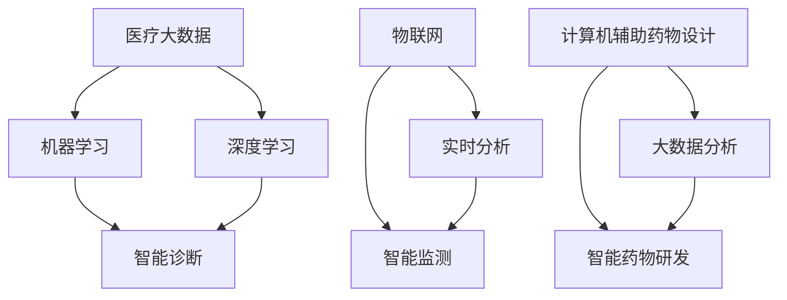

                 

关键词：人工智能，医疗设备，成本降低，智能诊断，智能监测，医疗大数据

摘要：随着人工智能（AI）技术的不断发展，其在医疗设备中的应用日益广泛，极大地提高了医疗效率，降低了医疗成本。本文将探讨AI在智能医疗设备中的应用，分析其对医疗成本的影响，并展望未来发展的趋势和挑战。

## 1. 背景介绍

随着人口老龄化和慢性疾病的增加，医疗需求持续增长。然而，传统医疗体系的资源分配不均，医疗成本居高不下，给国家和个人带来了巨大的经济负担。为了解决这些问题，人工智能技术被引入医疗领域，希望通过智能化的手段提高医疗效率，降低医疗成本。

### 1.1 医疗成本现状

医疗成本主要包括医疗服务成本、药品成本、医疗设备成本等。近年来，医疗成本的上升速度远超经济增长速度，给社会带来了巨大的压力。具体表现在以下几个方面：

- **药品成本**：随着新药研发的不断投入，药品价格持续上涨，使得患者用药负担加重。
- **医疗服务成本**：医疗服务的需求增加，导致医疗机构的运营成本上升。
- **医疗设备成本**：先进医疗设备的引进和维护成本较高，增加了医疗成本。

### 1.2 人工智能在医疗领域的应用

人工智能在医疗领域的应用主要包括智能诊断、智能监测、智能药物研发等方面。以下将详细介绍这些应用及其对降低医疗成本的影响。

## 2. 核心概念与联系

### 2.1 智能诊断

智能诊断是指利用人工智能技术，对患者的医疗数据进行处理和分析，辅助医生进行疾病诊断。其核心概念包括：

- **医疗大数据**：通过收集和分析大量的医疗数据，形成医疗大数据库。
- **机器学习**：利用机器学习算法，对医疗大数据进行分析，提取有用的信息。
- **深度学习**：深度学习是机器学习的一种，能够从大量数据中自动学习和提取特征。

### 2.2 智能监测

智能监测是指利用人工智能技术，对患者的生理指标进行实时监测和分析，帮助医生及时发现病情变化。其核心概念包括：

- **物联网**：通过物联网技术，将各种医疗设备连接起来，实现数据的实时采集和传输。
- **实时分析**：利用人工智能技术，对实时采集的数据进行分析，发现异常情况。

### 2.3 智能药物研发

智能药物研发是指利用人工智能技术，加速药物研发过程，降低药物研发成本。其核心概念包括：

- **计算机辅助药物设计**：利用人工智能技术，模拟药物与生物体的相互作用，预测药物效果。
- **大数据分析**：利用大数据分析技术，筛选潜在的药物靶点，优化药物研发方向。

### 2.4 核心概念联系图

以下是一个简单的 Mermaid 流程图，展示了核心概念之间的联系：



## 3. 核心算法原理 & 具体操作步骤

### 3.1 算法原理概述

智能医疗设备的核心算法主要涉及机器学习、深度学习和大数据分析。以下是这些算法的基本原理：

- **机器学习**：通过训练模型，使模型能够根据输入数据预测输出结果。常见的机器学习算法包括决策树、支持向量机、神经网络等。
- **深度学习**：一种特殊的机器学习算法，通过多层神经网络进行数据特征提取和分类。深度学习在图像识别、自然语言处理等领域取得了显著的成果。
- **大数据分析**：对大规模数据进行处理和分析，提取有价值的信息。大数据分析通常涉及数据采集、数据清洗、数据存储、数据挖掘等环节。

### 3.2 算法步骤详解

以下是智能医疗设备的核心算法步骤：

1. **数据采集**：通过传感器、医疗设备等采集患者的生理指标、医疗记录等数据。
2. **数据清洗**：对采集到的数据进行清洗，去除噪声和错误数据。
3. **特征提取**：对清洗后的数据进行特征提取，为后续的机器学习和深度学习算法提供输入。
4. **模型训练**：利用机器学习和深度学习算法，对提取的特征进行训练，构建预测模型。
5. **模型评估**：对训练好的模型进行评估，确保其预测准确度。
6. **模型应用**：将训练好的模型应用于实际的医疗场景，如智能诊断、智能监测等。

### 3.3 算法优缺点

- **机器学习**：优点包括模型简单、易于实现、适用于多种场景；缺点包括对数据质量要求高、预测结果可能存在偏差。
- **深度学习**：优点包括强大的特征提取能力、适用于复杂场景；缺点包括模型复杂、训练时间较长、对数据量要求大。
- **大数据分析**：优点包括能够处理大规模数据、提取有价值的信息；缺点包括数据处理流程复杂、对计算资源要求高。

### 3.4 算法应用领域

智能医疗设备的算法主要应用于以下几个领域：

- **智能诊断**：通过对患者数据进行分析，辅助医生进行疾病诊断，提高诊断准确率。
- **智能监测**：实时监测患者的生理指标，及时发现病情变化，降低误诊率。
- **智能药物研发**：加速药物研发过程，降低研发成本，提高药物效果。

## 4. 数学模型和公式 & 详细讲解 & 举例说明

### 4.1 数学模型构建

智能医疗设备的数学模型主要包括以下几种：

- **线性回归模型**：用于预测连续型变量，如患者的血压、血糖等。
- **逻辑回归模型**：用于预测离散型变量，如疾病的患病概率。
- **支持向量机模型**：用于分类问题，如疾病的分类。
- **神经网络模型**：用于复杂的数据特征提取和分类。

### 4.2 公式推导过程

以线性回归模型为例，其公式推导如下：

假设我们要预测患者的血压，输入特征为年龄、体重、心率等。设患者的血压为 $y$，输入特征为 $x_1, x_2, ..., x_n$，权重为 $w_1, w_2, ..., w_n$，偏置为 $b$。则线性回归模型的公式为：

$$
y = w_1x_1 + w_2x_2 + ... + w_nx_n + b
$$

### 4.3 案例分析与讲解

假设我们要利用线性回归模型预测患者的血压，已知患者的年龄、体重、心率等数据，并已训练好模型。现有一个新的患者，其年龄为 40 岁，体重为 70 公斤，心率 80 次/分钟，要求预测其血压。

根据线性回归模型的公式，我们可以计算出其预测血压：

$$
y = w_1 \times 40 + w_2 \times 70 + w_3 \times 80 + b
$$

其中，$w_1, w_2, w_3, b$ 为训练好的模型参数。将具体数值代入，即可计算出预测血压。

## 5. 项目实践：代码实例和详细解释说明

### 5.1 开发环境搭建

在本项目中，我们使用 Python 语言和 TensorFlow 深度学习框架进行开发。首先，需要在电脑上安装 Python 和 TensorFlow。具体步骤如下：

1. 下载并安装 Python，可以选择 Python 3.7 或更高版本。
2. 打开命令行窗口，安装 TensorFlow：

```
pip install tensorflow
```

### 5.2 源代码详细实现

以下是一个简单的线性回归模型的实现：

```python
import tensorflow as tf

# 定义输入层
x = tf.placeholder(tf.float32, shape=[None, 3])
y = tf.placeholder(tf.float32, shape=[None, 1])

# 定义权重和偏置
w1 = tf.Variable(0.0, name='weight1')
w2 = tf.Variable(0.0, name='weight2')
w3 = tf.Variable(0.0, name='weight3')
b = tf.Variable(0.0, name='bias')

# 定义线性回归模型
y_pred = w1 * x[:, 0] + w2 * x[:, 1] + w3 * x[:, 2] + b

# 定义损失函数
loss = tf.reduce_mean(tf.square(y - y_pred))

# 定义优化器
optimizer = tf.train.GradientDescentOptimizer(learning_rate=0.001)
train_op = optimizer.minimize(loss)

# 初始化变量
init = tf.global_variables_initializer()

# 开始训练
with tf.Session() as sess:
    sess.run(init)
    for i in range(1000):
        # 训练数据
        x_train = [[40, 70, 80], [35, 65, 75], [45, 75, 85]]
        y_train = [[120], [110], [130]]
        # 训练模型
        sess.run(train_op, feed_dict={x: x_train, y: y_train})
        # 打印损失
        if i % 100 == 0:
            print(f'Epoch {i}: loss = {sess.run(loss, feed_dict={x: x_train, y: y_train})}')
    # 预测血压
    new_patient = [[40, 70, 80]]
    predicted_blood_pressure = sess.run(y_pred, feed_dict={x: new_patient})
    print(f'Predicted blood pressure: {predicted_blood_pressure}')
```

### 5.3 代码解读与分析

这段代码实现了线性回归模型，用于预测患者的血压。具体解读如下：

1. 定义输入层：`x` 和 `y` 分别表示输入特征和目标值，`None` 表示输入数据的维度不确定。
2. 定义权重和偏置：`w1, w2, w3, b` 分别表示权重和偏置，初始化为 0.0。
3. 定义线性回归模型：`y_pred` 表示预测的血压值。
4. 定义损失函数：使用均方误差（MSE）作为损失函数。
5. 定义优化器：使用梯度下降优化器，学习率为 0.001。
6. 初始化变量：使用 `tf.global_variables_initializer()` 初始化模型参数。
7. 开始训练：使用 `tf.Session()` 创建会话，运行训练操作 `train_op`，输入训练数据。
8. 打印损失：每隔 100 个 epoch 打印一次损失值。
9. 预测血压：使用训练好的模型预测新的患者的血压值。

## 6. 实际应用场景

### 6.1 智能诊断

智能诊断是 AI 在医疗领域的重要应用之一。通过分析大量的医疗数据，智能诊断系统可以帮助医生快速、准确地诊断疾病。以下是一个具体的应用案例：

- **案例背景**：某医院引入了一款基于深度学习的智能诊断系统，用于辅助医生诊断肺癌。
- **数据来源**：系统收集了大量的肺癌患者的医学影像数据，包括 CT 图像、病理切片图像等。
- **诊断过程**：系统对收集到的图像数据进行预处理，然后使用深度学习模型进行分析。模型根据图像特征，预测患者是否患有肺癌，并提供辅助诊断建议。
- **应用效果**：该智能诊断系统的引入，提高了肺癌诊断的准确率，减少了误诊率，同时降低了诊断时间。

### 6.2 智能监测

智能监测系统可以实时监测患者的生理指标，如血压、心率、血糖等，及时发现异常情况。以下是一个具体的应用案例：

- **案例背景**：某医院引进了一款智能监测系统，用于实时监测心血管疾病患者的生理指标。
- **数据来源**：系统通过传感器和可穿戴设备，实时采集患者的血压、心率等数据。
- **监测过程**：系统对采集到的数据进行实时分析，根据预设的阈值，判断患者是否处于异常状态，并自动报警。
- **应用效果**：该智能监测系统的引入，提高了心血管疾病患者的治疗效果，降低了误诊率和误报率。

### 6.3 智能药物研发

智能药物研发是 AI 在医疗领域的另一个重要应用。通过分析大量的生物数据和药物数据，智能药物研发系统可以帮助研究人员快速筛选出有效的药物。以下是一个具体的应用案例：

- **案例背景**：某药物研发公司引入了一款智能药物研发系统，用于加速新药研发。
- **数据来源**：系统收集了大量的生物数据和药物数据，包括基因组数据、蛋白质数据、药物结构数据等。
- **研发过程**：系统通过深度学习算法，分析生物数据和药物数据，预测药物对生物体的作用，并筛选出潜在的新药。
- **应用效果**：该智能药物研发系统的引入，提高了新药研发的效率，降低了研发成本。

## 7. 工具和资源推荐

### 7.1 学习资源推荐

- **书籍**：
  - 《深度学习》（Goodfellow, Bengio, Courville 著）
  - 《机器学习》（周志华 著）
  - 《大数据之路：阿里巴巴大数据实践》（李飞飞，阿里巴巴大数据委员会 著）

- **在线课程**：
  - Coursera 上的《机器学习》课程（吴恩达 著）
  - Udacity 上的《深度学习纳米学位》课程
  - edX 上的《大数据分析》课程

### 7.2 开发工具推荐

- **编程语言**：Python、R
- **深度学习框架**：TensorFlow、PyTorch
- **大数据处理工具**：Hadoop、Spark

### 7.3 相关论文推荐

- “Deep Learning for Medical Imaging” (2017)
- “Molecular Data Mining: Algorithms, Applications and Software Tools” (2015)
- “Integrative Clinical Analytics Using Electronic Health Records” (2018)

## 8. 总结：未来发展趋势与挑战

### 8.1 研究成果总结

近年来，人工智能在医疗设备中的应用取得了显著的成果。智能诊断、智能监测、智能药物研发等领域都取得了重要进展。这些成果极大地提高了医疗效率，降低了医疗成本，对医疗行业产生了深远的影响。

### 8.2 未来发展趋势

随着人工智能技术的不断发展，未来医疗设备将更加智能化、个性化和便捷化。以下是一些发展趋势：

- **个性化医疗**：通过大数据分析和机器学习，为患者提供个性化的治疗方案。
- **远程医疗**：利用人工智能和物联网技术，实现远程诊断、远程监护和远程手术。
- **实时监测**：利用可穿戴设备和传感器，实现患者生理指标的实时监测。
- **药物研发**：通过智能药物研发，加速新药研发过程，降低药物研发成本。

### 8.3 面临的挑战

虽然人工智能在医疗设备中的应用取得了显著成果，但仍然面临一些挑战：

- **数据隐私**：医疗数据涉及患者隐私，如何保护数据隐私是一个重要问题。
- **算法透明性**：人工智能算法的复杂性和不透明性，使得人们对其可信度产生担忧。
- **伦理问题**：人工智能在医疗设备中的应用可能引发伦理问题，如决策责任、医疗资源分配等。

### 8.4 研究展望

未来，人工智能在医疗设备中的应用将更加深入和广泛。通过不断研究和探索，我们有望解决当前面临的问题，实现人工智能在医疗领域的全面应用。

## 9. 附录：常见问题与解答

### 9.1 人工智能在医疗设备中的应用有哪些？

人工智能在医疗设备中的应用主要包括智能诊断、智能监测、智能药物研发等方面。通过分析医疗数据，人工智能可以辅助医生进行疾病诊断，实时监测患者的生理指标，加速药物研发过程。

### 9.2 人工智能在医疗设备中的应用能降低多少医疗成本？

人工智能在医疗设备中的应用能够显著降低医疗成本。例如，智能诊断可以提高诊断准确率，减少误诊和漏诊，降低误诊成本；智能监测可以实时监测患者生理指标，减少误诊率和误报率，降低误诊成本和医疗资源浪费。

### 9.3 人工智能在医疗设备中的应用有哪些伦理问题？

人工智能在医疗设备中的应用可能引发伦理问题，如数据隐私、算法透明性、决策责任等。如何保护患者数据隐私，确保算法的公平性和透明性，明确人工智能在医疗决策中的责任，是未来需要关注的重要问题。

## 作者署名

作者：禅与计算机程序设计艺术 / Zen and the Art of Computer Programming
------------------------------------------------------------------

