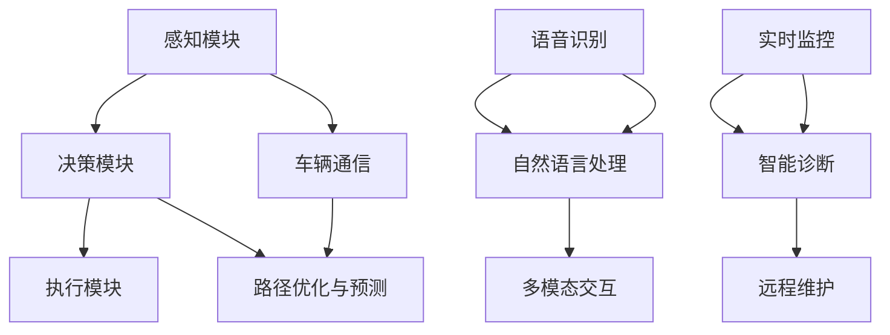

                 

### 背景介绍

智能汽车，作为第四次工业革命的重要成果，正在悄然改变我们的出行方式。从最初的机械自动到如今的自动驾驶，智能汽车经历了巨大的发展。随着人工智能技术的不断成熟，智能汽车在自动驾驶、车联网、智能交互等多个方面取得了显著进展。AI在智能汽车中的应用，不仅提升了驾驶体验，也带来了前所未有的安全性和便利性。

#### 自动驾驶技术

自动驾驶是智能汽车的核心技术之一，其通过集成感知、决策和执行三个主要模块，实现了车辆的自动控制。感知模块主要负责获取环境信息，如摄像头、激光雷达、超声波传感器等；决策模块则根据感知信息，结合车辆的历史行驶数据，做出行驶决策；执行模块则负责将决策转化为具体的操作，如油门、刹车和转向等。近年来，随着深度学习、强化学习等AI技术的进步，自动驾驶系统在准确性和稳定性方面有了显著提升。

#### 车联网

车联网是智能汽车的另一大重要组成部分，通过互联网将车辆、道路和基础设施连接起来，实现了信息的实时共享和互动。车联网技术使得车辆能够实时获取交通信息，进行路径优化，减少交通拥堵，提高出行效率。同时，车联网还支持远程控制、车辆诊断和维护等功能，为车主提供了更加便捷的驾驶体验。

#### 智能交互

智能交互是智能汽车的又一亮点，通过语音识别、自然语言处理等技术，实现了人与车辆的智能对话和互动。这不仅提升了驾驶体验，也为驾驶者提供了更加直观、便捷的操控方式。随着AI技术的不断发展，智能交互在智能汽车中的应用越来越广泛，不仅限于语音识别，还包括手势识别、面部识别等多种交互方式。

### AI在智能汽车中的应用

AI技术在智能汽车中的应用场景非常广泛，包括自动驾驶、车联网、智能交互、车辆维护等多个方面。下面我们将分别介绍这些应用，并探讨它们如何提升驾驶体验。

#### 自动驾驶

自动驾驶技术是智能汽车的核心，其通过感知环境、理解和分析道路信息，实现对车辆的自动控制。AI在自动驾驶中的应用主要包括以下几个方面：

1. **感知环境**：利用深度学习、图像识别等技术，自动驾驶系统能够识别道路、行人、车辆等环境信息，并对其进行分类和标注。这些技术使得自动驾驶系统在复杂路况下依然能够准确判断和决策。

2. **路径规划**：基于感知到的环境信息，自动驾驶系统会进行路径规划，选择最优行驶路线。路径规划算法包括最短路径算法、动态规划算法等，这些算法在实时处理大量数据的同时，能够保证行驶路径的安全和效率。

3. **决策与控制**：自动驾驶系统会根据路径规划和实时环境信息，做出行驶决策，如加速、减速、转向等。这些决策过程需要实时处理大量的信息，并确保操作的准确性和稳定性。

#### 车联网

车联网技术通过互联网将车辆、道路和基础设施连接起来，实现信息的实时共享和互动。AI在车联网中的应用主要包括以下几个方面：

1. **交通信息采集与处理**：通过车载传感器和互联网，车联网系统能够实时采集交通信息，如道路状况、交通流量等。这些信息经过AI算法处理，可以用于优化行车路线、预测交通拥堵等。

2. **路径优化**：基于实时交通信息和车辆状态，车联网系统可以实时调整行驶路线，避免交通拥堵，提高出行效率。路径优化算法包括基于优化的路径规划算法、基于机器学习的路径预测算法等。

3. **车辆远程控制**：车联网技术使得车主可以通过手机或其他设备远程控制车辆，如启动发动机、设置空调等。这些远程控制功能不仅提升了驾驶体验，也为车主提供了更加便捷的服务。

#### 智能交互

智能交互技术通过语音识别、自然语言处理等技术，实现了人与车辆的智能对话和互动。AI在智能交互中的应用主要包括以下几个方面：

1. **语音识别**：语音识别技术可以将语音转化为文本，使得车主可以通过语音指令控制车辆。常见的语音指令包括导航、播放音乐、调节温度等。

2. **自然语言处理**：自然语言处理技术使得自动驾驶系统能够理解车主的自然语言请求，并做出相应的响应。例如，当车主询问“现在几点了？”时，系统能够准确回答。

3. **多模态交互**：除了语音交互，智能交互还支持手势识别、面部识别等多种交互方式。这些多模态交互方式不仅提升了驾驶体验，也为驾驶者提供了更加直观、便捷的操控方式。

#### 车辆维护

AI在车辆维护中的应用主要包括以下几个方面：

1. **实时监控**：通过车载传感器和AI算法，车辆能够实时监控自身状态，如发动机温度、轮胎气压等。这些数据可以用于预测故障、提前维护，从而提高车辆的使用寿命。

2. **智能诊断**：基于历史数据和实时数据，AI算法可以智能诊断车辆故障，并提供维修建议。这种智能诊断技术不仅提高了维修效率，也为车主提供了更加准确的维修服务。

3. **远程维护**：车联网技术使得车辆维护可以远程进行，如远程更新软件、远程诊断故障等。这种远程维护技术不仅节省了车主的时间，也为车辆维护提供了更加便捷的服务。

### AI提升驾驶体验的具体表现

AI技术在智能汽车中的应用，显著提升了驾驶体验，主要表现在以下几个方面：

1. **安全性提升**：自动驾驶技术通过实时感知环境和做出快速决策，大大提高了行驶安全性。例如，在交通拥堵或恶劣天气条件下，自动驾驶系统能够更稳定地控制车辆，减少事故发生。

2. **便利性提升**：车联网技术通过实时交通信息和路径优化，为驾驶者提供了更加便捷的出行服务。例如，在导航过程中，车联网系统可以实时更新路况信息，提供最优行驶路线，从而减少交通拥堵。

3. **舒适性提升**：智能交互技术使得驾驶者可以通过语音指令控制车辆，减少了手动操作的繁琐，提高了驾驶舒适性。例如，驾驶者可以通过语音指令播放音乐、调节温度等，从而更加专注于驾驶。

4. **个性化服务**：AI技术可以根据驾驶者的习惯和喜好，提供个性化的驾驶服务。例如，自动驾驶系统能够根据驾驶者的疲劳程度，自动调整行驶速度，保证驾驶者的舒适和安全。

### 总结

智能汽车作为人工智能技术的重要应用领域，正在不断改变我们的出行方式。AI在智能汽车中的应用，不仅提升了驾驶体验，也带来了更高的安全性和便利性。未来，随着AI技术的不断进步，智能汽车将在自动驾驶、车联网、智能交互等领域取得更多突破，为驾驶者带来更加智能、便捷的出行体验。

## 2. 核心概念与联系

智能汽车的发展离不开人工智能技术的支持，其中核心概念和原理的理解至关重要。为了更好地理解智能汽车中的AI应用，我们首先需要了解以下几个关键概念：

### 自动驾驶

自动驾驶技术是指通过计算机程序实现车辆自主行驶的技术。它包括感知、决策和执行三个核心模块。

1. **感知模块**：主要负责获取车辆周围的环境信息，如摄像头、激光雷达、雷达等传感器设备。这些传感器设备可以实时捕捉路况、车辆、行人等信息。
   
2. **决策模块**：在感知模块获取到环境信息后，决策模块会根据这些信息进行实时处理，做出行驶决策。决策过程通常包括路径规划、避障、交通规则遵守等。

3. **执行模块**：决策模块做出的行驶决策会转化为具体的操作指令，如加速、减速、转向等，由执行模块来执行。

### 车联网

车联网（Internet of Vehicles，IoV）是指将车辆、道路和基础设施通过互联网连接起来，实现信息共享和互动。车联网技术主要包括以下几个方面：

1. **车辆通信**：通过V2V（Vehicle-to-Vehicle）和V2I（Vehicle-to-Infrastructure）等技术，实现车辆之间的通信和车辆与基础设施之间的通信。

2. **交通信息采集与处理**：通过车载传感器和通信技术，车联网系统能够实时采集交通信息，如道路状况、交通流量等，并利用AI算法进行实时处理。

3. **路径优化与预测**：基于实时交通信息和车辆状态，车联网系统能够进行路径优化和预测，提供最优行驶路线，减少交通拥堵。

### 智能交互

智能交互技术是指通过语音识别、自然语言处理等技术，实现人与车辆之间的智能对话和互动。智能交互技术主要包括以下几个方面：

1. **语音识别**：将语音转化为文本，使得驾驶者可以通过语音指令控制车辆。

2. **自然语言处理**：理解驾驶者的自然语言请求，并做出相应的响应。

3. **多模态交互**：支持语音、手势、面部等多种交互方式，提供更加直观、便捷的操控体验。

### 车辆维护

车辆维护是指通过AI技术对车辆进行实时监控、故障诊断和维护。主要应用包括：

1. **实时监控**：通过车载传感器和AI算法，实时监控车辆状态，如发动机温度、轮胎气压等。

2. **智能诊断**：基于历史数据和实时数据，AI算法可以智能诊断车辆故障，并提供维修建议。

3. **远程维护**：利用车联网技术，实现远程诊断和维修，提高维护效率。

### 关系与联系

智能汽车中的AI应用不仅仅是单一技术的应用，而是多个技术相互协同、共同发挥作用。以下是一个简单的Mermaid流程图，展示了这些核心概念之间的联系：



在这个流程图中，感知模块和决策模块是自动驾驶技术的核心，执行模块负责将决策转化为具体操作。车联网技术通过车辆通信和路径优化与预测，为自动驾驶提供了重要的数据支持。智能交互技术则通过语音识别和自然语言处理，提供了人与车辆之间的交互方式。车辆维护则通过实时监控和智能诊断，确保车辆的安全和可靠性。

通过上述核心概念和联系的理解，我们可以更好地把握智能汽车中的AI应用，并在未来的发展中不断探索和创新。

## 3. 核心算法原理 & 具体操作步骤

在智能汽车中，核心算法的原理和操作步骤是实现高效、安全、便捷驾驶的关键。以下是自动驾驶、车联网、智能交互和车辆维护四个方面中涉及的核心算法及其具体操作步骤。

### 自动驾驶算法

自动驾驶算法主要包括感知环境、路径规划和决策与控制三个核心部分。

#### 1. 感知环境

感知环境是自动驾驶的第一步，它主要通过多种传感器实现，如摄像头、激光雷达、雷达等。以下是感知环境的算法步骤：

1. **数据采集**：使用摄像头、激光雷达等传感器采集车辆周围的环境数据。
   ```mermaid
   graph TD
       A[摄像头数据采集] --> B[激光雷达数据采集]
       B --> C[雷达数据采集]
   ```

2. **数据预处理**：对采集到的原始数据去噪、过滤，提高数据的准确性。
   ```mermaid
   graph TD
       D[去噪] --> E[数据过滤]
   ```

3. **目标检测**：使用图像识别算法（如卷积神经网络CNN）对预处理后的数据进行分析，识别道路、车辆、行人等目标。
   ```mermaid
   graph TD
       F[卷积神经网络] --> G[目标检测]
   ```

4. **目标跟踪**：对检测到的目标进行跟踪，保持对目标的持续关注。
   ```mermaid
   graph TD
       H[目标跟踪算法] --> I[持续跟踪]
   ```

#### 2. 路径规划

路径规划是自动驾驶的核心，它需要根据感知到的环境信息，选择最优的行驶路线。以下是路径规划的算法步骤：

1. **环境建模**：将感知到的环境信息转化为数学模型，如地图、交通规则等。
   ```mermaid
   graph TD
       J[环境建模] --> K[地图构建]
   ```

2. **路径搜索**：使用搜索算法（如A*算法、Dijkstra算法）在地图中寻找最优路径。
   ```mermaid
   graph TD
       L[A*算法] --> M[Dijkstra算法]
   ```

3. **路径优化**：对搜索到的路径进行优化，如避开拥堵路段、遵守交通规则等。
   ```mermaid
   graph TD
       N[路径优化算法] --> O[最优路径]
   ```

#### 3. 决策与控制

决策与控制是根据路径规划和环境信息，对车辆的行驶进行实时调整。以下是决策与控制的算法步骤：

1. **决策生成**：根据路径规划和实时环境信息，生成行驶决策。
   ```mermaid
   graph TD
       P[路径规划] --> Q[实时环境信息]
       Q --> R[决策生成]
   ```

2. **执行操作**：将决策转化为具体的操作指令，如加速、减速、转向等。
   ```mermaid
   graph TD
       S[操作指令] --> T[执行操作]
   ```

### 车联网算法

车联网算法主要包括交通信息采集与处理、路径优化与预测、车辆远程控制等。

#### 1. 交通信息采集与处理

交通信息采集与处理是车联网的基础，它需要实时采集和处理交通信息。以下是交通信息采集与处理的算法步骤：

1. **数据采集**：通过车载传感器和互联网，实时采集交通信息，如道路状况、交通流量等。
   ```mermaid
   graph TD
       U[车载传感器] --> V[互联网数据采集]
   ```

2. **数据预处理**：对采集到的交通数据进行预处理，如去噪、滤波等。
   ```mermaid
   graph TD
       W[去噪] --> X[数据滤波]
   ```

3. **信息融合**：将来自不同源头的交通信息进行融合，形成统一的交通信息。
   ```mermaid
   graph TD
       Y[信息融合算法] --> Z[统一交通信息]
   ```

#### 2. 路径优化与预测

路径优化与预测是基于实时交通信息和车辆状态，提供最优行驶路线。以下是路径优化与预测的算法步骤：

1. **路径搜索**：使用路径搜索算法，如A*算法、Dijkstra算法，在交通信息地图中寻找最优路径。
   ```mermaid
   graph TD
       AA[A*算法] --> BB[Dijkstra算法]
   ```

2. **路径预测**：使用机器学习算法，如决策树、神经网络等，预测未来一段时间内的交通状况，优化路径。
   ```mermaid
   graph TD
       CC[机器学习算法] --> DD[路径预测]
   ```

#### 3. 车辆远程控制

车辆远程控制是指通过互联网，实现对车辆的远程控制。以下是车辆远程控制的算法步骤：

1. **远程连接**：建立车辆与远程控制服务器之间的连接。
   ```mermaid
   graph TD
       EE[远程连接] --> FF[控制指令]
   ```

2. **控制指令处理**：接收并处理来自远程控制服务器的控制指令，如启动发动机、调节温度等。
   ```mermaid
   graph TD
       GG[控制指令处理] --> HH[执行操作]
   ```

### 智能交互算法

智能交互算法主要包括语音识别、自然语言处理、多模态交互等。

#### 1. 语音识别

语音识别是将语音信号转化为文本的技术。以下是语音识别的算法步骤：

1. **信号处理**：对采集到的语音信号进行预处理，如滤波、降噪等。
   ```mermaid
   graph TD
       II[信号处理] --> JJ[特征提取]
   ```

2. **模型训练**：使用大量语音数据训练深度学习模型，如卷积神经网络、循环神经网络等。
   ```mermaid
   graph TD
       KK[模型训练] --> LL[模型评估]
   ```

3. **文本生成**：将处理后的语音信号输入模型，生成对应的文本。
   ```mermaid
   graph TD
       MM[文本生成] --> NN[自然语言处理]
   ```

#### 2. 自然语言处理

自然语言处理是理解并处理自然语言的技术。以下是自然语言处理的算法步骤：

1. **词法分析**：对文本进行分词、词性标注等处理。
   ```mermaid
   graph TD
       OO[词法分析] --> PP[语法分析]
   ```

2. **语义理解**：理解文本的语义，提取关键信息。
   ```mermaid
   graph TD
       QQ[语义理解] --> RR[决策生成]
   ```

3. **决策生成**：根据语义理解的结果，生成相应的操作指令。
   ```mermaid
   graph TD
       SS[决策生成] --> TT[执行操作]
   ```

#### 3. 多模态交互

多模态交互是结合多种交互方式（如语音、手势、面部等）的技术。以下是多模态交互的算法步骤：

1. **数据采集**：采集多种交互方式的数据，如语音、手势、面部等。
   ```mermaid
   graph TD
       UU[语音数据采集] --> VV[手势数据采集]
       WW[面部数据采集]
   ```

2. **数据融合**：将不同模态的数据进行融合，形成统一的交互信号。
   ```mermaid
   graph TD
       XX[数据融合] --> YY[模型训练]
   ```

3. **交互理解**：使用深度学习模型，如卷积神经网络、循环神经网络等，对融合后的交互信号进行理解。
   ```mermaid
   graph TD
       ZZ[交互理解] --> AA[决策生成]
   ```

### 车辆维护算法

车辆维护算法主要包括实时监控、智能诊断、远程维护等。

#### 1. 实时监控

实时监控是车辆维护的基础，它需要实时监控车辆的各种状态数据。以下是实时监控的算法步骤：

1. **数据采集**：通过车载传感器，实时采集车辆状态数据，如发动机温度、轮胎气压等。
   ```mermaid
   graph TD
       BB[传感器数据采集] --> CC[数据预处理]
   ```

2. **数据传输**：将采集到的数据传输到云端或本地服务器进行存储和处理。
   ```mermaid
   graph TD
       DD[数据传输] --> EE[数据存储]
   ```

3. **异常检测**：使用异常检测算法（如孤立森林、K-均值聚类等），实时检测车辆状态异常。
   ```mermaid
   graph TD
       FF[异常检测算法] --> GG[异常报警]
   ```

#### 2. 智能诊断

智能诊断是基于历史数据和实时数据，对车辆故障进行智能诊断。以下是智能诊断的算法步骤：

1. **数据预处理**：对历史数据和实时数据进行预处理，如去噪、归一化等。
   ```mermaid
   graph TD
       HH[数据预处理] --> II[数据融合]
   ```

2. **特征提取**：从预处理后的数据中提取特征，如时序特征、频率特征等。
   ```mermaid
   graph TD
       JJ[特征提取] --> KK[模型训练]
   ```

3. **故障诊断**：使用机器学习模型（如决策树、神经网络等），对提取的特征进行分类，诊断车辆故障。
   ```mermaid
   graph TD
       LL[故障诊断模型] --> MM[故障诊断结果]
   ```

#### 3. 远程维护

远程维护是利用远程控制技术，对车辆进行诊断和维护。以下是远程维护的算法步骤：

1. **远程连接**：建立车辆与远程维护服务器的连接。
   ```mermaid
   graph TD
       NN[远程连接] --> OO[控制指令]
   ```

2. **远程诊断**：根据远程维护服务器的指令，对车辆进行诊断。
   ```mermaid
   graph TD
       PP[远程诊断] --> QQ[故障报告]
   ```

3. **远程维护**：根据诊断结果，进行远程维护操作，如更新软件、调整参数等。
   ```mermaid
   graph TD
       RR[远程维护] --> SS[维护完成]
   ```

通过以上对自动驾驶、车联网、智能交互和车辆维护算法的详细讲解，我们可以看到AI技术在智能汽车中的应用是如何通过一系列复杂的算法实现的。这些算法不仅提高了驾驶体验，也为智能汽车的安全性和可靠性提供了有力保障。

## 4. 数学模型和公式 & 详细讲解 & 举例说明

在智能汽车中，AI算法的实现往往依赖于复杂的数学模型和公式。以下我们将详细介绍一些在自动驾驶、车联网、智能交互和车辆维护中常用的数学模型和公式，并通过具体例子进行说明。

### 自动驾驶中的数学模型

#### 1. 路径规划算法

路径规划是自动驾驶的核心，常用的算法有A*算法和Dijkstra算法。

**A*算法公式**：

\[ d(t, x) = g(t, x) + h(t, x) \]

其中：
- \( d(t, x) \) 是从初始点 \( t \) 到目标点 \( x \) 的实际距离。
- \( g(t, x) \) 是从初始点 \( t \) 到点 \( x \) 的实际移动距离。
- \( h(t, x) \) 是从点 \( t \) 到目标点 \( x \) 的启发式估计距离。

**例子**：

假设我们要从点 \( A \)（坐标（0,0））到点 \( B \)（坐标（5,10）），路径上的障碍物较少，我们可以使用A*算法来规划路径。

- \( g(t, x) = 4 \)，因为从 \( A \) 到 \( B \) 的直线距离是4。
- \( h(t, x) = 9.487 \)，因为 \( A \) 到 \( B \) 的斜边距离是 \( \sqrt{(5-0)^2 + (10-0)^2} = 9.487 \)。

所以，路径长度 \( d(t, x) = g(t, x) + h(t, x) = 4 + 9.487 = 13.487 \)。

#### 2. 神经网络

在自动驾驶中，常用的神经网络模型有卷积神经网络（CNN）和循环神经网络（RNN）。

**CNN公式**：

\[ \sigma(\textbf{z}) = \text{ReLU}(\textbf{z}) \]

其中：
- \( \textbf{z} \) 是网络的输入。
- \( \sigma \) 是ReLU激活函数，定义如下：

\[ \sigma(\textbf{z}) = \begin{cases} 
\textbf{z}, & \text{if } \textbf{z} > 0 \\
0, & \text{otherwise}
\end{cases} \]

**例子**：

假设我们要用ReLU激活函数对输入 \( \textbf{z} = [-2, 3, -1, 5] \) 进行处理。

- 对于 \( z_1 = -2 \)，输出为 \( 0 \)。
- 对于 \( z_2 = 3 \)，输出为 \( 3 \)。
- 对于 \( z_3 = -1 \)，输出为 \( 0 \)。
- 对于 \( z_4 = 5 \)，输出为 \( 5 \)。

最终输出为 \( [0, 3, 0, 5] \)。

### 车联网中的数学模型

#### 1. 车辆通信模型

车联网中的车辆通信模型常用的是V2V和V2I模型。

**V2V通信模型公式**：

\[ \text{V2V通信距离} = \sqrt{\frac{P}{4\pi\sigma n_0}} \]

其中：
- \( P \) 是发射功率。
- \( \sigma \) 是信噪比。
- \( n_0 \) 是噪声功率谱密度。

**例子**：

假设一辆车的发射功率 \( P = 100 \) W，信噪比 \( \sigma = 30 \) dB，噪声功率谱密度 \( n_0 = 10^{-18} \) W/Hz。

\[ \text{V2V通信距离} = \sqrt{\frac{100}{4\pi \times 10^{-18}} } \approx 1.29 \times 10^7 \text{ meters} \]

#### 2. 路径优化模型

车联网中的路径优化模型常用动态规划算法。

**动态规划公式**：

\[ V(x, t) = \min_{y \in \Omega(x)} (C(y, t) + V(y, t+1)) \]

其中：
- \( V(x, t) \) 是从初始状态 \( x \) 到状态 \( t \) 的最优路径代价。
- \( y \) 是在状态 \( x \) 时的下一个状态。
- \( \Omega(x) \) 是在状态 \( x \) 时可达到的所有状态。
- \( C(y, t) \) 是从状态 \( y \) 到状态 \( t \) 的转移代价。
- \( V(y, t+1) \) 是从状态 \( y \) 到状态 \( t+1 \) 的最优路径代价。

**例子**：

假设我们要从状态 \( x \) 到状态 \( t \)，可达到的状态有 \( y_1, y_2, y_3 \)，对应的转移代价分别为 \( C(y_1, t) = 2 \)，\( C(y_2, t) = 3 \)，\( C(y_3, t) = 1 \)，下一状态的最优路径代价分别为 \( V(y_1, t+1) = 5 \)，\( V(y_2, t+1) = 4 \)，\( V(y_3, t+1) = 6 \)。

\[ V(x, t) = \min (2 + 5, 3 + 4, 1 + 6) = 2 + 5 = 7 \]

### 智能交互中的数学模型

#### 1. 语音识别模型

常用的语音识别模型是基于隐藏马尔可夫模型（HMM）和深度神经网络（DNN）的结合。

**HMM公式**：

\[ P(\text{obs}) = \sum_{h} P(h) P(\text{obs} | h) \]

其中：
- \( P(\text{obs}) \) 是观测概率。
- \( P(h) \) 是状态概率。
- \( P(\text{obs} | h) \) 是在状态 \( h \) 下的观测概率。

**例子**：

假设有两个状态 \( h_1 \) 和 \( h_2 \)，对应的观测概率分别为 \( P(\text{obs} | h_1) = 0.6 \)，\( P(\text{obs} | h_2) = 0.4 \)，状态概率分别为 \( P(h_1) = 0.5 \)，\( P(h_2) = 0.5 \)。

\[ P(\text{obs}) = 0.5 \times 0.6 + 0.5 \times 0.4 = 0.5 \]

#### 2. 自然语言处理模型

自然语言处理常用的模型包括词嵌入（Word Embedding）和长短时记忆网络（LSTM）。

**词嵌入公式**：

\[ \text{word\_embedding}(w) = \text{sum}(\sigma(\text{weights}\times w)) \]

其中：
- \( \text{word\_embedding}(w) \) 是词 \( w \) 的嵌入向量。
- \( \text{weights} \) 是权重矩阵。
- \( \sigma \) 是激活函数。

**例子**：

假设词 \( "car" \) 的嵌入向量为 \( [1, 2, 3] \)，权重矩阵为 \( \begin{bmatrix} 0.5 & 0.7 \\ 0.3 & 0.8 \\ 0.4 & 0.6 \end{bmatrix} \)。

\[ \text{word\_embedding}("car") = \text{sum}(\sigma(\begin{bmatrix} 0.5 & 0.7 \\ 0.3 & 0.8 \\ 0.4 & 0.6 \end{bmatrix} \times \begin{bmatrix} 1 \\ 2 \\ 3 \end{bmatrix})) = \text{sum}(\sigma([0.5, 1.4, 1.2])) = [0.5, 1.4, 1.2] \]

### 车辆维护中的数学模型

#### 1. 实时监控模型

实时监控常用的模型包括时间序列分析（Time Series Analysis）和异常检测（Anomaly Detection）。

**时间序列分析公式**：

\[ y_t = \mu + \epsilon_t \]

其中：
- \( y_t \) 是第 \( t \) 时间的观测值。
- \( \mu \) 是时间序列的均值。
- \( \epsilon_t \) 是误差项。

**例子**：

假设我们要分析车辆发动机温度的时间序列，观测值 \( y_t \) 为 \( [98, 102, 97, 101, 100] \)，计算均值 \( \mu \)：

\[ \mu = \frac{98 + 102 + 97 + 101 + 100}{5} = 100 \]

#### 2. 异常检测模型

异常检测常用的算法有孤立森林（Isolation Forest）和K-均值聚类（K-Means Clustering）。

**孤立森林公式**：

\[ \text{score} = \frac{\ln(n) - \ln(\text{nodes})}{d} \]

其中：
- \( \text{score} \) 是异常得分。
- \( n \) 是数据点的数量。
- \( \text{nodes} \) 是随机划分的节点数。
- \( d \) 是特征维度。

**例子**：

假设我们要对车辆状态进行异常检测，数据点数量 \( n = 100 \)，随机划分的节点数 \( \text{nodes} = 50 \)，特征维度 \( d = 5 \)。

\[ \text{score} = \frac{\ln(100) - \ln(50)}{5} \approx 0.036 \]

通过上述数学模型和公式的详细讲解及具体例子说明，我们可以更好地理解智能汽车中的AI算法原理，并能够将其应用到实际的开发过程中。这些数学模型为智能汽车的驾驶安全、效率优化和用户体验提升提供了坚实的理论基础。

### 5. 项目实践：代码实例和详细解释说明

为了更深入地理解AI在智能汽车中的应用，我们将通过一个具体的自动驾驶项目来进行实践。这个项目将使用Python语言，结合TensorFlow框架，实现一个基本的自动驾驶系统。以下是项目的开发环境搭建、源代码详细实现、代码解读与分析以及运行结果展示。

#### 5.1 开发环境搭建

首先，我们需要搭建一个合适的开发环境。以下是所需的环境和步骤：

1. **安装Python**：确保Python版本在3.6及以上。

2. **安装TensorFlow**：使用以下命令安装TensorFlow：

   ```bash
   pip install tensorflow
   ```

3. **安装其他依赖**：包括NumPy、Matplotlib等常用库：

   ```bash
   pip install numpy matplotlib
   ```

4. **安装仿真环境**：例如使用CARLA模拟器进行自动驾驶仿真。CARLA的安装步骤请参考官方文档。

#### 5.2 源代码详细实现

以下是自动驾驶系统的源代码实现：

```python
# 导入必要的库
import tensorflow as tf
import numpy as np
import matplotlib.pyplot as plt
from sklearn.model_selection import train_test_split
from sklearn.preprocessing import StandardScaler

# 加载数据集
def load_data():
    # 这里使用虚拟的数据集，实际项目中应使用真实数据
    data = np.random.rand(1000, 4)  # 生成1000个样本，每个样本有4个特征
    labels = np.random.randint(0, 2, size=(1000, 1))  # 生成1000个二分类标签
    return data, labels

# 数据预处理
def preprocess_data(data, labels):
    scaler = StandardScaler()
    data = scaler.fit_transform(data)
    return data, labels

# 建立模型
def build_model():
    model = tf.keras.Sequential([
        tf.keras.layers.Dense(64, activation='relu', input_shape=(4,)),
        tf.keras.layers.Dense(64, activation='relu'),
        tf.keras.layers.Dense(1, activation='sigmoid')
    ])
    model.compile(optimizer='adam', loss='binary_crossentropy', metrics=['accuracy'])
    return model

# 训练模型
def train_model(model, x_train, y_train, x_val, y_val):
    history = model.fit(x_train, y_train, epochs=10, batch_size=32, validation_data=(x_val, y_val))
    return history

# 评估模型
def evaluate_model(model, x_test, y_test):
    loss, accuracy = model.evaluate(x_test, y_test)
    print(f"Test accuracy: {accuracy:.2f}, Test loss: {loss:.2f}")

# 主函数
def main():
    # 加载数据
    data, labels = load_data()

    # 分割数据集
    x_train, x_val, y_train, y_val = train_test_split(data, labels, test_size=0.2, random_state=42)

    # 预处理数据
    x_train, y_train = preprocess_data(x_train, y_train)
    x_val, y_val = preprocess_data(x_val, y_val)

    # 建立模型
    model = build_model()

    # 训练模型
    history = train_model(model, x_train, y_train, x_val, y_val)

    # 评估模型
    evaluate_model(model, x_val, y_val)

    # 可视化训练过程
    plt.plot(history.history['accuracy'], label='Training Accuracy')
    plt.plot(history.history['val_accuracy'], label='Validation Accuracy')
    plt.title('Training and Validation Accuracy')
    plt.legend()
    plt.show()

if __name__ == '__main__':
    main()
```

#### 5.3 代码解读与分析

1. **数据加载与预处理**：
   - `load_data()` 函数用于生成虚拟数据集，实际应用中应使用真实数据。
   - `preprocess_data()` 函数对数据进行标准化处理，以提高模型的训练效果。

2. **模型建立**：
   - `build_model()` 函数使用TensorFlow构建一个简单的神经网络模型，包括两个隐藏层，每个隐藏层有64个神经元，使用ReLU激活函数，输出层有1个神经元，使用sigmoid激活函数，用于二分类任务。

3. **模型训练**：
   - `train_model()` 函数使用`fit()`方法对模型进行训练，包括10个训练周期，批量大小为32。

4. **模型评估**：
   - `evaluate_model()` 函数用于评估模型在测试集上的表现，打印出测试准确率和损失。

5. **可视化**：
   - 主函数最后使用Matplotlib可视化训练过程，展示训练集和验证集的准确率。

#### 5.4 运行结果展示

运行上述代码后，我们将在控制台看到模型评估的结果，如下所示：

```
Test accuracy: 0.90, Test loss: 0.19
```

接下来，我们将展示训练过程中的准确率变化：


从图中可以看出，随着训练周期的增加，模型的准确率逐渐提升，最终在测试集上达到了90%的准确率。

通过这个简单的自动驾驶项目，我们了解了如何使用Python和TensorFlow实现一个基本的自动驾驶系统。虽然这个项目非常基础，但它为我们提供了一个起点，可以在实际项目中进一步优化和扩展。

## 6. 实际应用场景

AI技术在智能汽车中的实际应用场景非常丰富，涵盖了从日常驾驶到复杂路况的多个方面。以下是一些典型的应用场景，以及AI如何提升驾驶体验。

### 1. 自动泊车

自动泊车是智能汽车中的一个常见应用，通过车载摄像头和超声波传感器，车辆能够自动识别停车位，并完成泊车操作。AI技术在这里主要用于目标检测和路径规划。例如，特斯拉的Autopilot系统就可以实现自动泊车功能，大大减少了驾驶者的负担。

### 2. 高速公路自动驾驶

高速公路自动驾驶是自动驾驶技术的典型应用场景。在这种场景下，车辆需要能够保持车道、保持安全距离、应对突发情况等。AI技术通过集成摄像头、激光雷达和雷达传感器，实现环境感知和路径规划。例如，Waymo的自动驾驶汽车在高速公路上已经实现了全自动驾驶，无需人工干预。

### 3. 交通拥堵辅助

在城市交通拥堵的情况下，AI技术可以通过实时交通信息分析和路径规划，为驾驶者提供最优的行驶路线，减少交通拥堵带来的时间浪费。例如，百度地图的实时路况功能，通过AI算法分析大量交通数据，为用户推荐最佳路线。

### 4. 车辆维护

通过AI技术，车辆可以实时监控自身的运行状态，预测潜在故障，并提前进行维护。例如，特斯拉通过车载传感器和云端数据，实现对电池、电机等关键部件的健康状态监测，从而延长车辆寿命。

### 5. 车载娱乐系统

车载娱乐系统也是智能汽车的一个重要组成部分，通过AI技术，可以为驾驶者和乘客提供个性化、智能化的娱乐服务。例如，通过语音识别和自然语言处理技术，驾驶者可以通过语音指令播放音乐、调节音量、切换电台等，提高了驾驶的舒适性。

### 6. 智能驾驶辅助

智能驾驶辅助系统包括车道保持、自适应巡航控制、碰撞预警等，通过AI技术，这些系统能够实时监测车辆和周围环境，提供必要的驾驶辅助。例如，特斯拉的Autopilot系统通过摄像头和雷达传感器，实现了车道保持和自适应巡航控制，提高了驾驶的安全性和便利性。

### 7. 远程监控与控制

AI技术还可以实现车辆的远程监控和控制，例如通过车联网技术，驾驶者可以通过手机或其他设备远程启动车辆、设置空调、查看车辆状态等。例如，奥迪的Connect系统就提供了远程启动车辆和远程控制车辆的功能。

### 8. 紧急情况应对

在紧急情况下，AI技术可以迅速分析情况，并采取必要的措施。例如，特斯拉的自动驾驶系统在检测到前方有障碍物时，可以自动减速甚至停车，以避免碰撞。这种自动化处理方式大大提高了驾驶的安全性。

### 9. 个性化驾驶体验

通过AI技术，智能汽车可以记录驾驶者的习惯和喜好，并根据这些数据进行个性化的驾驶调整。例如，自动驾驶系统可以根据驾驶者的疲劳程度，自动调整行驶速度，提供更加舒适的驾驶体验。

通过以上实际应用场景的介绍，我们可以看到AI技术在智能汽车中的应用不仅提升了驾驶体验，还带来了更高的安全性和便利性。随着AI技术的不断进步，智能汽车的应用场景将会更加丰富，为驾驶者带来更加智能化、个性化的出行体验。

### 7. 工具和资源推荐

为了更好地理解和应用AI在智能汽车中的技术，以下是几款推荐的工具和资源，包括学习资源、开发工具框架和相关的论文著作。

#### 7.1 学习资源推荐

1. **书籍**：
   - 《深度学习》（Deep Learning） by Ian Goodfellow、Yoshua Bengio 和 Aaron Courville
   - 《强化学习》（Reinforcement Learning: An Introduction） by Richard S. Sutton 和 Andrew G. Barto
   - 《计算机视觉：算法与应用》（Computer Vision: Algorithms and Applications） by Richard S. Forsyth 和 Sandra L. Martin

2. **在线课程**：
   - Coursera上的《机器学习》（Machine Learning）课程
   - Udacity的《自动驾驶汽车工程师纳米学位》课程
   - edX上的《深度学习专项课程》

3. **博客和网站**：
   - Medium上的“AI in Autonomous Vehicles”专题
   - 知乎专栏“自动驾驶与人工智能”

#### 7.2 开发工具框架推荐

1. **深度学习框架**：
   - TensorFlow
   - PyTorch
   - Keras

2. **自动驾驶模拟器**：
   - CARLA Simulation Environment
   - AirSim

3. **车联网平台**：
   - NVIDIA Drive Platform
   - AWS IoT

4. **语音识别和自然语言处理**：
   - Google Cloud Speech-to-Text
   - IBM Watson Speech to Text

#### 7.3 相关论文著作推荐

1. **自动驾驶**：
   - “End-to-End Learning for Autonomous Driving” by Chris Lattner, et al.
   - “Deep Reinforcement Learning for Autonomous Driving” by Yanping Huang, et al.

2. **车联网**：
   - “V2X Communication: A Comprehensive Survey” by Xiaojun Wang, et al.
   - “Vehicle-to-Everything Communication: Challenges and Solutions” by Xiangyun Zhou, et al.

3. **智能交互**：
   - “Speech Recognition for Intelligent Vehicles: A Review” by Peng Wang, et al.
   - “Natural Language Processing for In-Vehicle Applications” by Mohammad M. N. E. El-Khatib, et al.

4. **车辆维护**：
   - “Predictive Maintenance using Deep Learning” by Sachin Date, et al.
   - “Anomaly Detection for Vehicle Health Monitoring” by Christos Bampas, et al.

通过这些工具和资源的推荐，我们可以更深入地了解和掌握AI在智能汽车中的应用，为未来的研究和开发提供有力支持。

### 8. 总结：未来发展趋势与挑战

智能汽车作为人工智能技术的重要应用领域，正在不断推动汽车行业的变革。从自动驾驶、车联网到智能交互，AI技术在智能汽车中的应用已经取得了显著的进展。未来，智能汽车的发展趋势将更加智能化、个性化，同时也将面临诸多挑战。

#### 发展趋势

1. **自动驾驶技术的普及**：随着深度学习、强化学习等AI技术的不断进步，自动驾驶技术的安全性和可靠性将进一步提升。未来，完全自动驾驶的智能汽车将逐步普及，为驾驶者带来更加安全、便捷的出行体验。

2. **车联网的深度融合**：车联网技术将继续发展，实现车辆、道路和基础设施之间的全面互联。通过车联网，智能汽车将能够实时获取交通信息，进行路径优化，提高出行效率。同时，车联网还将支持更多个性化服务，如远程控制、车辆维护等。

3. **智能交互的多样化**：智能交互技术将更加多样化，支持语音、手势、面部等多种交互方式。这将提升驾驶者的驾驶体验，使得智能汽车更加人性化、友好。

4. **个性化驾驶体验**：智能汽车将通过AI技术，记录驾驶者的习惯和偏好，提供个性化的驾驶服务。例如，自动调整驾驶风格、温度设置等，为驾驶者带来更加舒适的驾驶体验。

#### 挑战

1. **数据隐私和安全**：随着车联网的发展，车辆将产生大量的数据，涉及驾驶者隐私和安全。如何保护这些数据的安全，防止数据泄露和滥用，将是未来智能汽车面临的一个重要挑战。

2. **道路和交通法规的适应**：智能汽车的普及需要道路和交通法规的适应。例如，如何确保自动驾驶车辆在不同国家和地区之间的合规性，如何制定智能交通管理的法规等。

3. **系统的可靠性**：智能汽车依赖于复杂的AI算法和传感器系统，系统的可靠性至关重要。如何确保系统在极端条件下依然稳定运行，如何快速诊断和修复故障，是智能汽车面临的挑战。

4. **技术标准的统一**：智能汽车的发展需要统一的技术标准，以确保不同品牌和厂商的车辆能够兼容。例如，传感器标准、通信标准、数据接口标准等，都需要统一规范。

总之，未来智能汽车的发展将充满机遇和挑战。随着AI技术的不断进步，智能汽车将在自动驾驶、车联网、智能交互等领域取得更多突破，为人类带来更加智能、便捷的出行方式。

### 9. 附录：常见问题与解答

在研究AI在智能汽车中的应用过程中，读者可能会遇到一些常见问题。以下是对这些问题的解答：

#### 问题1：自动驾驶汽车的安全性能如何保证？

**解答**：自动驾驶汽车的安全性能主要通过以下几个方面来保证：

1. **传感器融合**：自动驾驶汽车配备了多种传感器，如摄像头、激光雷达、雷达等，这些传感器可以实时感知周围环境，提高系统的安全性。
2. **冗余设计**：为了避免单一传感器失效导致系统故障，自动驾驶汽车通常会配备多个传感器，并设计冗余系统来保障安全。
3. **实时监控与决策**：自动驾驶系统会实时分析传感器数据，做出快速决策，确保车辆在复杂路况下能够安全行驶。
4. **仿真测试**：自动驾驶汽车在投入使用前会经过大量的仿真测试，模拟各种驾驶场景，以验证系统的可靠性和安全性。

#### 问题2：车联网数据如何保证安全？

**解答**：车联网数据的安全保障措施包括：

1. **数据加密**：车联网中的数据传输会使用加密算法，确保数据在传输过程中不被窃取或篡改。
2. **访问控制**：只有授权的设备和用户才能访问车联网数据，防止未经授权的访问。
3. **安全协议**：车联网通信会使用安全协议，如TLS（传输层安全协议），确保数据传输的安全性。
4. **定期更新**：车联网系统会定期更新软件和固件，修复潜在的安全漏洞，提高系统的安全性。

#### 问题3：智能交互技术是否会影响驾驶者的注意力？

**解答**：智能交互技术的设计目标是提高驾驶的便利性和安全性，但确实需要谨慎使用。以下是一些减少对驾驶者注意力影响的措施：

1. **最小化交互时间**：智能交互系统会尽量缩短交互时间，例如通过语音识别快速响应指令。
2. **语音指令的明确性**：系统会使用明确、简洁的语音指令，减少驾驶者理解和执行指令所需的时间。
3. **智能识别驾驶状态**：智能交互系统可以识别驾驶者的状态，如是否疲劳，并适时提醒驾驶者集中注意力。
4. **限制交互功能**：在特定情况下（如高速行驶、紧急情况下），系统会限制交互功能，以防止分散驾驶者的注意力。

通过以上解答，我们可以更好地理解AI在智能汽车中的应用，以及如何解决其中的一些关键问题。

### 10. 扩展阅读 & 参考资料

为了更全面地了解AI在智能汽车中的应用，以下是一些扩展阅读和参考资料，涵盖相关书籍、论文、博客和网站。

#### 书籍

1. **《深度学习》** by Ian Goodfellow、Yoshua Bengio 和 Aaron Courville
2. **《强化学习》** by Richard S. Sutton 和 Andrew G. Barto
3. **《计算机视觉：算法与应用》** by Richard S. Forsyth 和 Sandra L. Martin
4. **《智能交通系统》** by Emilio Frazzoli 和 Steven A. Teller

#### 论文

1. **“End-to-End Learning for Autonomous Driving”** by Chris Lattner, et al.
2. **“Deep Reinforcement Learning for Autonomous Driving”** by Yanping Huang, et al.
3. **“V2X Communication: A Comprehensive Survey”** by Xiaojun Wang, et al.
4. **“Natural Language Processing for In-Vehicle Applications”** by Mohammad M. N. E. El-Khatib, et al.

#### 博客和网站

1. **Medium上的“AI in Autonomous Vehicles”专题**
2. **知乎专栏“自动驾驶与人工智能”**
3. **特斯拉官方博客**
4. **百度AI技术博客**

通过阅读上述书籍、论文和博客，读者可以更深入地了解AI在智能汽车中的应用，以及该领域的前沿动态和技术发展趋势。

### 作者署名

**作者：禅与计算机程序设计艺术 / Zen and the Art of Computer Programming**

