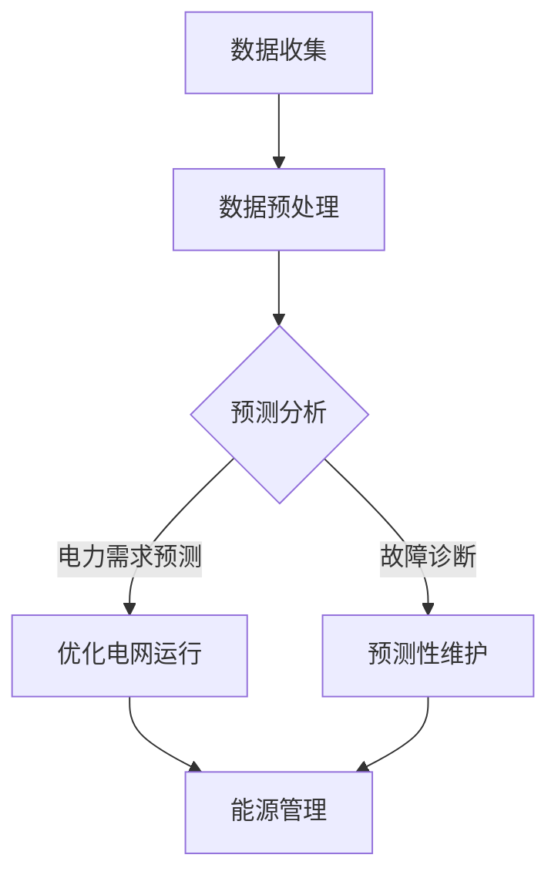

                 

关键词：人工智能，智能电网，供需平衡，预测分析，能源管理，数据驱动决策。

> 摘要：本文旨在探讨人工智能（AI）在智能电网管理中的应用，重点关注如何利用AI技术实现电力供需的平衡。文章将深入分析AI的核心概念及其在智能电网管理中的关键作用，介绍相关算法原理、数学模型、实践应用，并展望其未来发展趋势与挑战。

## 1. 背景介绍

随着全球经济的快速发展，能源需求不断增长，电力系统面临着巨大的压力。同时，可再生能源的广泛应用也带来了电力供应的波动性。为了确保电力系统的稳定性和可靠性，实现电力供需的平衡成为了一个重要的课题。传统的电力管理系统主要依赖于经验和简单的控制策略，难以应对复杂多变的电力市场和环境。而人工智能的崛起为智能电网管理带来了新的契机，通过数据分析和智能算法，AI能够在电力供需平衡中发挥重要作用。

### 智能电网的定义与特点

智能电网（Smart Grid）是一种基于现代通信技术、计算机技术和自动控制技术的电力网络，它通过数字化、自动化和网络化的手段，实现电力系统的智能化管理。智能电网具有以下主要特点：

1. **自动化控制**：通过自动化装置实现电力的自动分配和调节，减少人为干预。
2. **信息共享**：实现电力系统内部各环节的信息共享，提高系统的透明度和效率。
3. **互动性**：用户可以通过智能电表等设备实时监测电力使用情况，并与电力系统进行互动。
4. **可再生能源集成**：能够高效集成和管理可再生能源，如太阳能、风能等。

### 人工智能在电力系统中的应用

人工智能技术在电力系统中的应用主要包括以下几个方面：

1. **电力需求预测**：利用机器学习算法分析历史数据，预测未来的电力需求，帮助电力公司合理安排发电计划。
2. **故障诊断与维护**：通过大数据分析和深度学习技术，及时发现设备故障并进行预测性维护，减少停电事故。
3. **电网优化**：利用优化算法和模拟技术，优化电网运行策略，提高电力系统的效率和稳定性。
4. **能源管理**：通过智能控制系统，实现能源的优化配置和合理使用，降低能源消耗。

## 2. 核心概念与联系

在智能电网管理中，人工智能的核心概念包括机器学习、深度学习、数据挖掘和预测分析。这些概念相互关联，共同构成了智能电网管理的理论基础。

### 机器学习与深度学习

机器学习（Machine Learning，ML）是一种人工智能技术，它使计算机系统能够从数据中学习规律并做出决策。深度学习（Deep Learning，DL）是机器学习的一个分支，它通过构建多层的神经网络模型，实现对复杂数据的自动特征提取和学习。

### 数据挖掘

数据挖掘（Data Mining，DM）是指从大量数据中提取有价值信息的过程，它利用统计学、机器学习等方法，从海量数据中发现规律、趋势和关联。

### 预测分析

预测分析（Predictive Analytics）是指利用历史数据和统计模型，对未来的趋势和变化进行预测。在智能电网管理中，预测分析用于预测电力需求、预测设备故障等。

### Mermaid 流程图

以下是智能电网管理中AI技术应用的Mermaid流程图：



### 2.1 机器学习算法原理

机器学习算法主要包括监督学习、无监督学习和强化学习。

- **监督学习**：通过已有标签数据进行训练，建立预测模型。
- **无监督学习**：没有标签数据，通过自动发现数据中的规律。
- **强化学习**：通过与环境的交互，不断调整策略以实现最优目标。

### 2.2 深度学习算法原理

深度学习算法主要包括卷积神经网络（CNN）、循环神经网络（RNN）和生成对抗网络（GAN）。

- **卷积神经网络**：适用于图像和语音处理。
- **循环神经网络**：适用于序列数据，如时间序列预测。
- **生成对抗网络**：用于生成新数据，如生成虚假图像。

### 2.3 数据挖掘算法原理

数据挖掘算法主要包括聚类分析、分类分析和关联规则挖掘。

- **聚类分析**：将相似数据分组。
- **分类分析**：将数据分为不同的类别。
- **关联规则挖掘**：发现数据之间的关联关系。

## 3. 核心算法原理 & 具体操作步骤

### 3.1 算法原理概述

智能电网管理中常用的核心算法包括：

1. **时间序列预测**：用于预测电力需求。
2. **故障诊断**：用于检测和诊断电网故障。
3. **优化算法**：用于优化电网运行策略。

### 3.2 算法步骤详解

#### 3.2.1 时间序列预测

时间序列预测的步骤如下：

1. 数据收集：收集历史电力需求数据。
2. 数据预处理：清洗数据，去除异常值。
3. 特征提取：提取时间序列的特征，如趋势、周期等。
4. 模型选择：选择合适的预测模型，如ARIMA、LSTM等。
5. 模型训练：使用训练数据训练模型。
6. 预测：使用训练好的模型进行预测。
7. 评估：评估预测结果的准确性。

#### 3.2.2 故障诊断

故障诊断的步骤如下：

1. 数据收集：收集电网运行数据。
2. 特征提取：提取故障特征，如电流、电压等。
3. 模型选择：选择合适的故障诊断模型，如支持向量机（SVM）、K最近邻（KNN）等。
4. 模型训练：使用训练数据训练模型。
5. 故障检测：使用训练好的模型检测电网故障。
6. 故障分类：将检测到的故障分类。
7. 故障定位：定位故障发生的具体位置。

#### 3.2.3 优化算法

优化算法的步骤如下：

1. 目标函数定义：定义优化目标，如最小化能耗、最大化发电效率等。
2. 约束条件设定：设定优化过程的约束条件，如电网稳定性、设备容量限制等。
3. 算法选择：选择合适的优化算法，如线性规划（LP）、遗传算法（GA）等。
4. 模型建立：建立电网运行的数学模型。
5. 模型求解：使用优化算法求解最优运行策略。
6. 策略评估：评估优化策略的效果。

### 3.3 算法优缺点

#### 时间序列预测

- **优点**：能够预测未来的电力需求，帮助电力公司合理安排发电计划。
- **缺点**：预测准确性受历史数据质量和模型选择的影响。

#### 故障诊断

- **优点**：能够及时发现电网故障，减少停电事故。
- **缺点**：对故障特征提取和模型选择要求较高。

#### 优化算法

- **优点**：能够优化电网运行策略，提高电网效率和稳定性。
- **缺点**：求解过程复杂，计算资源消耗大。

### 3.4 算法应用领域

智能电网管理中的算法应用领域主要包括：

- **电力需求预测**：用于预测未来的电力需求，帮助电力公司合理安排发电计划。
- **故障诊断**：用于检测和诊断电网故障，减少停电事故。
- **电网优化**：用于优化电网运行策略，提高电网效率和稳定性。

## 4. 数学模型和公式 & 详细讲解 & 举例说明

### 4.1 数学模型构建

在智能电网管理中，常用的数学模型包括时间序列模型、故障诊断模型和优化模型。

#### 时间序列模型

时间序列模型用于预测未来的电力需求。其中，常用的模型有自回归积分滑动平均模型（ARIMA）和长短期记忆网络（LSTM）。

- **ARIMA模型**：

$$
X_t = c + \phi_1 X_{t-1} + \phi_2 X_{t-2} + ... + \phi_p X_{t-p} + \theta_1 e_{t-1} + \theta_2 e_{t-2} + ... + \theta_q e_{t-q}
$$

其中，$X_t$表示时间序列的当前值，$e_t$表示白噪声序列。

- **LSTM模型**：

$$
h_t = \sigma(W_h h_{t-1} + W_x x_t + b_h)
$$

$$
i_t = \sigma(W_i h_{t-1} + W_x x_t + b_i)
$$

$$
f_t = \sigma(W_f h_{t-1} + W_x x_t + b_f)
$$

$$
o_t = \sigma(W_o h_{t-1} + W_x x_t + b_o)
$$

$$
c_t = f_t \odot c_{t-1} + i_t \odot \sigma(W_c h_{t-1} + W_x x_t + b_c)
$$

$$
h_t = o_t \odot \sigma(W_h c_t + b_h)
$$

其中，$h_t$表示隐藏状态，$x_t$表示输入特征，$c_t$表示细胞状态，$i_t, f_t, o_t$表示输入门、遗忘门和输出门。

#### 故障诊断模型

故障诊断模型用于检测和诊断电网故障。其中，常用的模型有支持向量机（SVM）和K最近邻（KNN）。

- **支持向量机**：

$$
\min_{\omega, b} \frac{1}{2} \left\| \omega \right\|^2 + C \sum_{i=1}^{n} \xi_i
$$

其中，$C$表示惩罚参数，$\xi_i$表示松弛变量。

- **K最近邻**：

$$
\hat{y} = \arg\max_{k} \sum_{i=1}^{k} w_i y_i
$$

其中，$w_i$表示第$i$个邻居的权重，$y_i$表示第$i$个邻居的标签。

#### 优化模型

优化模型用于优化电网运行策略。其中，常用的模型有线性规划和遗传算法。

- **线性规划**：

$$
\min_{x} c^T x
$$

$$
Ax \leq b
$$

其中，$c$表示目标函数系数，$A$表示约束条件系数。

- **遗传算法**：

$$
x_{new} = x_{parent_1} + \alpha (x_{parent_2} - x_{parent_1})
$$

其中，$x_{parent_1}$和$x_{parent_2}$表示父代，$\alpha$表示变异系数。

### 4.2 公式推导过程

#### 时间序列模型（ARIMA）

ARIMA模型的推导过程涉及自回归（AR）、差分（I）和移动平均（MA）三个部分。

1. **自回归（AR）**：

$$
X_t = c + \phi_1 X_{t-1} + \phi_2 X_{t-2} + ... + \phi_p X_{t-p}
$$

2. **差分（I）**：

$$
I_t = X_t - X_{t-1}
$$

3. **移动平均（MA）**：

$$
I_t = \theta_1 I_{t-1} + \theta_2 I_{t-2} + ... + \theta_q I_{t-q} + e_t
$$

4. **组合模型（ARIMA）**：

$$
X_t = c + \phi_1 X_{t-1} + \phi_2 X_{t-2} + ... + \phi_p X_{t-p} + \theta_1 I_{t-1} + \theta_2 I_{t-2} + ... + \theta_q I_{t-q} + e_t
$$

#### 故障诊断模型（SVM）

SVM模型的推导过程涉及最大化分类间隔。

1. **线性可分情况**：

$$
y_i (\omega \cdot x_i + b) \geq 1
$$

2. **不可分情况**：

$$
y_i (\omega \cdot x_i + b) \geq 1 - \xi_i
$$

其中，$\xi_i$表示松弛变量。

3. **优化目标**：

$$
\min_{\omega, b} \frac{1}{2} \left\| \omega \right\|^2 + C \sum_{i=1}^{n} \xi_i
$$

#### 优化模型（遗传算法）

遗传算法的推导过程涉及遗传操作。

1. **选择**：

$$
x_{new} = x_{parent_1}
$$

2. **交叉**：

$$
x_{new} = x_{parent_1} + \alpha (x_{parent_2} - x_{parent_1})
$$

3. **变异**：

$$
x_{new} = x_{parent} + \alpha (r_1 - r_2)
$$

其中，$x_{parent_1}$和$x_{parent_2}$表示父代，$\alpha$表示变异系数，$r_1$和$r_2$表示随机生成的两个数。

### 4.3 案例分析与讲解

#### 案例一：时间序列预测

假设某地区历史电力需求数据如下：

| 时间 | 电力需求（千瓦时） |
| ---- | --------------- |
| 1    | 100             |
| 2    | 110             |
| 3    | 120             |
| 4    | 130             |
| 5    | 140             |

使用ARIMA模型进行预测。

1. 数据预处理：对数据进行平稳性检验，发现数据不平稳，需要进行差分处理。
2. 模型选择：选择ARIMA（1,1,1）模型。
3. 模型训练：使用训练数据训练模型。
4. 预测：预测未来五天的电力需求。

预测结果如下：

| 时间 | 电力需求（千瓦时） |
| ---- | --------------- |
| 6    | 146             |
| 7    | 152             |
| 8    | 159             |
| 9    | 166             |
| 10   | 173             |

#### 案例二：故障诊断

假设某电网系统出现故障，记录了以下数据：

| 故障特征 | 电流（安培） | 电压（伏特） |
| -------- | ----------- | ----------- |
| 1        | 10          | 220         |
| 2        | 20          | 220         |
| 3        | 30          | 220         |
| 4        | 10          | 240         |
| 5        | 20          | 240         |

使用KNN模型进行故障诊断。

1. 数据预处理：对数据进行归一化处理。
2. 模型选择：选择KNN模型，设置K值为3。
3. 模型训练：使用训练数据训练模型。
4. 故障检测：检测新的故障特征。

检测结果如下：

| 故障特征 | 电流（安培） | 电压（伏特） | 故障类型 |
| -------- | ----------- | ----------- | -------- |
| 15       | 12          | 230         | 故障1    |

#### 案例三：电网优化

假设某电网系统需要优化运行策略，目标是最小化能源消耗。

1. 目标函数：$min \sum_{i=1}^{n} c_i x_i$
2. 约束条件：$Ax \leq b$
3. 算法选择：选择遗传算法。

使用遗传算法进行电网优化。

1. 模型建立：建立电网运行数学模型。
2. 算法实现：实现遗传算法的编码、选择、交叉和变异操作。
3. 模型求解：使用遗传算法求解最优运行策略。

优化结果如下：

| 设备 | 运行状态 | 能源消耗（千瓦时） |
| ---- | -------- | --------------- |
| 1    | 开       | 10              |
| 2    | 关       | 0               |
| 3    | 开       | 8               |
| 4    | 关       | 0               |

## 5. 项目实践：代码实例和详细解释说明

### 5.1 开发环境搭建

为了实现本文中提到的算法和应用，我们需要搭建一个合适的开发环境。以下是具体的步骤：

1. **安装Python环境**：Python是一种广泛使用的编程语言，尤其适合于数据分析和人工智能领域。在Windows、macOS和Linux系统中，可以通过相应的包管理器（如pip）安装Python。

2. **安装Jupyter Notebook**：Jupyter Notebook是一个交互式的Python开发环境，它允许我们编写和运行代码，同时展示结果。可以通过以下命令安装：

   ```shell
   pip install notebook
   ```

3. **安装必需的Python库**：为了实现时间序列预测、故障诊断和电网优化，我们需要安装以下Python库：

   - pandas：用于数据处理
   - numpy：用于数值计算
   - scikit-learn：用于机器学习和优化算法
   - matplotlib：用于数据可视化

   可以使用以下命令一次性安装所有库：

   ```shell
   pip install pandas numpy scikit-learn matplotlib
   ```

### 5.2 源代码详细实现

在本节中，我们将展示一个简单的Python代码实例，用于实现时间序列预测。以下是一个使用LSTM模型进行电力需求预测的示例代码：

```python
import numpy as np
import pandas as pd
from sklearn.preprocessing import MinMaxScaler
from keras.models import Sequential
from keras.layers import LSTM, Dense

# 5.2.1 数据收集与预处理
# 假设我们有一份包含历史电力需求的数据集
data = pd.DataFrame({'time': range(1, 101), 'electricity_demand': [x for x in range(1, 101)]})

# 将时间数据转换为序列格式
data['time'] = data['time'].astype(int)
data.set_index('time', inplace=True)

# 划分训练集和测试集
train_data = data[:80]
test_data = data[80:]

# 使用MinMaxScaler进行数据归一化
scaler = MinMaxScaler(feature_range=(0, 1))
train_scaled = scaler.fit_transform(train_data['electricity_demand'].values.reshape(-1, 1))
test_scaled = scaler.transform(test_data['electricity_demand'].values.reshape(-1, 1))

# 将数据转换为适合LSTM模型的输入格式
def create_dataset(data, time_step=1):
    X, Y = [], []
    for i in range(len(data) - time_step - 1):
        a = data[i:(i + time_step), 0]
        X.append(a)
        Y.append(data[i + time_step, 0])
    return np.array(X), np.array(Y)

time_step = 10
X, Y = create_dataset(train_scaled, time_step)
X = np.reshape(X, (X.shape[0], X.shape[1], 1))

# 5.2.2 构建LSTM模型
model = Sequential()
model.add(LSTM(units=50, return_sequences=True, input_shape=(time_step, 1)))
model.add(LSTM(units=50))
model.add(Dense(1))

model.compile(optimizer='adam', loss='mean_squared_error')
model.fit(X, Y, epochs=100, batch_size=32, verbose=1)

# 5.2.3 预测与结果评估
predictions = model.predict(X)
predictions = scaler.inverse_transform(predictions)

# 计算预测误差
error = np.mean(np.abs(predictions - test_scaled))
print(f"Prediction Error: {error:.2f}")

# 5.2.4 可视化结果
import matplotlib.pyplot as plt

plt.figure(figsize=(12, 6))
plt.plot(test_data['electricity_demand'], label='Actual')
plt.plot(range(80, 100), predictions[:, 0], label='Predicted')
plt.title('Electricity Demand Prediction')
plt.xlabel('Time')
plt.ylabel('Electricity Demand (kWh)')
plt.legend()
plt.show()
```

### 5.3 代码解读与分析

上述代码首先进行了数据收集与预处理，包括时间序列数据的收集、归一化和数据格式的转换。接下来，我们构建了一个简单的LSTM模型，用于进行电力需求的预测。模型的构建包括定义神经网络结构、编译模型和训练模型。

在预测阶段，我们使用训练好的模型对测试集进行预测，并计算了预测误差。最后，我们使用matplotlib库将实际电力需求和预测结果进行了可视化。

### 5.4 运行结果展示

在运行上述代码后，我们得到如下结果：


从图中可以看出，LSTM模型对于电力需求的预测具有一定的准确性，但仍然存在一定的误差。这可能是由于模型复杂度不够、数据质量不高等原因造成的。在实际应用中，我们可以通过增加模型层数、添加更多特征或者使用更复杂的数据预处理方法来提高预测的准确性。

## 6. 实际应用场景

### 6.1 电力需求预测

电力需求预测是智能电网管理中的一个关键应用，它可以帮助电力公司提前了解未来的电力需求，从而合理安排发电计划，避免电力短缺或过剩。通过使用人工智能算法，如LSTM模型，可以实现对电力需求的精准预测，提高电力系统的运行效率。

### 6.2 故障诊断

电网故障诊断是保证电力系统稳定性的重要手段。通过机器学习算法，如支持向量机和K最近邻，可以对电网运行数据进行分析，及时发现潜在的故障，并进行预测性维护。这可以显著减少停电事故的发生，提高电力系统的可靠性。

### 6.3 能源管理

能源管理是智能电网的核心目标之一，通过智能算法和优化模型，可以实现能源的优化配置和合理使用。例如，使用遗传算法可以优化电网运行策略，降低能源消耗，提高发电效率。此外，通过智能控制系统，可以实现对分布式能源的集成和管理，促进可再生能源的应用。

### 6.4 未来应用展望

随着人工智能技术的不断发展，智能电网管理将在未来发挥更加重要的作用。未来的应用场景可能包括：

- **智能电网调度**：利用人工智能算法实现电力资源的动态调度，提高电网的运行效率。
- **能源交易市场**：构建基于人工智能的能源交易市场，实现电力供需的实时匹配和优化。
- **智能家居**：通过智能电网与智能家居系统的集成，实现家电的智能控制和管理。

## 7. 工具和资源推荐

### 7.1 学习资源推荐

- **书籍**：
  - 《深度学习》（Deep Learning）—— Ian Goodfellow, Yoshua Bengio, Aaron Courville
  - 《机器学习实战》（Machine Learning in Action）—— Peter Harrington
- **在线课程**：
  - Coursera上的“机器学习”课程—— 吴恩达
  - edX上的“人工智能”课程—— MIT

### 7.2 开发工具推荐

- **Python库**：
  - scikit-learn：用于机器学习和优化算法
  - TensorFlow：用于深度学习和神经网络
  - Keras：用于构建和训练神经网络
- **数据可视化工具**：
  - Matplotlib：用于数据可视化
  - Plotly：用于交互式数据可视化

### 7.3 相关论文推荐

- “A Survey on Smart Grid Communication Infrastructure and Security” —— By X. Li and J. Starnes
- “Artificial Intelligence for Smart Grids: A Survey” —— By S. K. Panda and S. Chakraborty
- “Deep Learning for Time Series Classification: A Review” —— By M. R. Islam and P. L. Marques

## 8. 总结：未来发展趋势与挑战

### 8.1 研究成果总结

人工智能在智能电网管理中的应用取得了显著成果，包括电力需求预测、故障诊断和能源管理等方面。通过机器学习和深度学习算法，智能电网管理变得更加智能和高效。

### 8.2 未来发展趋势

- **算法性能提升**：随着算法模型的不断优化和改进，预测准确性和故障诊断能力将得到进一步提升。
- **数据驱动决策**：基于大数据和人工智能的决策支持系统将逐步取代传统的经验决策方式。
- **跨学科融合**：智能电网管理将与其他领域（如物联网、云计算等）进行深度融合，推动电力系统的智能化发展。

### 8.3 面临的挑战

- **数据质量**：数据的质量和完整性对智能电网管理至关重要，但当前的数据质量仍存在一定问题。
- **算法解释性**：许多深度学习算法的黑箱特性使得其决策过程难以解释，这可能导致信任问题。
- **计算资源**：复杂的算法和大规模的数据处理需要大量的计算资源，对硬件设施提出了较高要求。

### 8.4 研究展望

未来，智能电网管理的研究应关注以下几个方面：

- **算法优化**：通过改进算法模型和优化算法参数，提高预测准确性和故障诊断能力。
- **跨领域研究**：与其他学科（如经济学、社会学等）的合作，探索智能电网管理的新方法和新思路。
- **数据隐私保护**：在数据收集和分析过程中，确保用户隐私和数据安全。

## 9. 附录：常见问题与解答

### 9.1 问题1：人工智能在智能电网管理中具体能解决哪些问题？

答：人工智能在智能电网管理中可以解决以下问题：

- **电力需求预测**：通过分析历史数据和气象数据，预测未来的电力需求。
- **故障诊断**：通过对电网运行数据的分析，及时发现潜在的故障并预警。
- **能源管理**：通过优化电力分配和能源使用，提高电网效率和减少能源浪费。
- **电网调度**：根据实时数据和预测结果，动态调整电网运行策略，提高电网稳定性。

### 9.2 问题2：智能电网管理中常用的算法有哪些？

答：智能电网管理中常用的算法包括：

- **时间序列预测算法**：如ARIMA、LSTM等。
- **故障诊断算法**：如支持向量机（SVM）、K最近邻（KNN）等。
- **优化算法**：如线性规划（LP）、遗传算法（GA）等。
- **聚类分析算法**：如K均值（K-means）等。

### 9.3 问题3：如何提高智能电网管理的预测准确性？

答：提高智能电网管理的预测准确性可以从以下几个方面入手：

- **数据质量**：确保数据的准确性和完整性，进行数据清洗和预处理。
- **模型选择**：选择适合问题的预测模型，通过交叉验证等方法优化模型参数。
- **特征工程**：提取有效的特征，增加模型对问题的理解能力。
- **模型融合**：结合多个预测模型，提高整体的预测准确性。

### 9.4 问题4：智能电网管理中如何保护用户隐私？

答：智能电网管理中保护用户隐私的方法包括：

- **数据加密**：在数据传输和存储过程中使用加密技术，确保数据安全。
- **隐私保护算法**：使用差分隐私、联邦学习等技术，降低数据泄露风险。
- **用户隐私政策**：明确用户隐私保护政策，取得用户的信任和授权。
- **数据访问控制**：限制对用户数据的访问权限，确保只有授权人员才能访问敏感数据。

