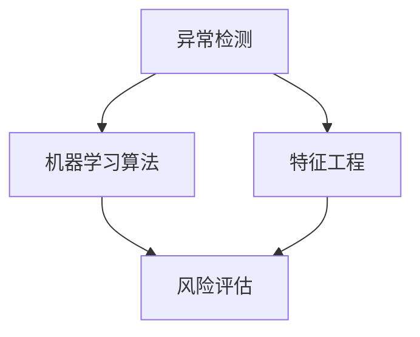

                 

### 1. 背景介绍

随着互联网经济的飞速发展，电子商务逐渐成为人们日常生活的重要组成部分。然而，这一繁荣背后也潜藏着巨大的风险——电商交易欺诈。交易欺诈行为不仅给消费者和商家带来经济损失，还严重影响市场的公平性和健康发展。据统计，全球每年因电商交易欺诈而造成的经济损失高达数十亿美元。为了有效遏制这一现象，越来越多的电商企业开始关注并采用AI技术在反欺诈系统中进行异常检测。

电商交易欺诈行为多种多样，主要包括以下几种类型：

1. **身份盗用**：犯罪分子通过非法手段获取他人的身份信息，冒用他人身份进行购物和支付。
2. **虚假交易**：恶意买家或卖家通过虚假的购物、评论和交易记录，提高自己的信誉度，然后进行诈骗或其他非法活动。
3. **信用卡欺诈**：利用他人的信用卡信息进行非法购物或提现。
4. **订单篡改**：篡改订单信息，如修改收货地址、货物规格等，以便进行诈骗或恶意退货。

为了应对这些复杂的欺诈行为，传统的反欺诈方法，如规则匹配和特征分析，已经显得力不从心。这些方法依赖于人工预定义的规则和特征，无法实时适应不断变化的欺诈模式。相比之下，AI技术，尤其是机器学习和深度学习算法，具有强大的数据分析和模式识别能力，能够更有效地检测和预防交易欺诈。

AI技术在电商反欺诈系统中的应用，主要体现在以下几个方面：

1. **异常检测**：通过分析大量的交易数据，AI模型可以识别出异常交易行为，如账户行为突变、支付方式异常等，从而及时预警潜在的欺诈风险。
2. **用户画像**：利用用户的历史交易行为和社交网络数据，AI模型可以生成详细的用户画像，从而更好地了解用户的消费习惯和风险偏好。
3. **风险评估**：基于用户画像和交易特征，AI模型可以评估每个交易的风险等级，帮助商家和金融机构做出更明智的决策。

本文将深入探讨AI在电商反欺诈系统中的应用，重点介绍异常检测模型的工作原理、数学模型和具体实现方法，并结合实际案例进行分析，以期为广大读者提供有价值的参考。

### 2. 核心概念与联系

为了全面理解AI在电商反欺诈系统中的应用，我们需要首先掌握几个核心概念：异常检测、机器学习算法、特征工程和风险评估。以下是这些概念的定义及其相互之间的联系。

#### 异常检测

异常检测（Anomaly Detection）是一种统计学方法，用于识别数据中的异常值或行为模式。在电商反欺诈系统中，异常检测是关键的一环，其主要目的是从海量的交易数据中识别出可能存在欺诈风险的交易。

**工作原理**：
- **统计学方法**：通过分析正常交易数据的统计特征，建立统计模型，然后对未知数据（如新交易）进行检测，判断其是否异常。
- **机器学习方法**：利用已有的异常交易数据，通过机器学习算法训练模型，使其能够对新数据（如新交易）进行自动分类。

**应用场景**：
- **识别账户异常**：通过检测账户的登录地点、时间、设备等特征，判断账户是否存在被盗用的风险。
- **识别交易异常**：通过分析交易金额、支付方式、交易频率等特征，识别出异常的交易行为。

#### 机器学习算法

机器学习（Machine Learning，ML）是一种让计算机从数据中自动学习并做出决策的技术。在AI反欺诈系统中，机器学习算法被广泛应用于异常检测和风险评估。

**主要类型**：
- **监督学习**：通过已标记的数据（正常交易和异常交易）训练模型，然后对未标记的数据进行分类。
- **无监督学习**：没有预定义的标签数据，通过发现数据中的内在结构或模式来进行分类或聚类。

**应用场景**：
- **异常交易检测**：通过监督学习算法，对未知交易进行风险等级评估。
- **用户画像构建**：通过无监督学习算法，分析用户的行为数据，生成用户画像。

#### 特征工程

特征工程（Feature Engineering）是在机器学习项目中，将原始数据转换为适合机器学习模型处理的形式的过程。在电商反欺诈系统中，特征工程是提高模型性能的关键步骤。

**主要任务**：
- **特征提取**：从原始数据中提取有用的信息，如交易金额、支付时间、支付方式等。
- **特征选择**：从提取的特征中筛选出对模型有显著影响的特征，去除无关或冗余的特征。
- **特征转换**：将原始数据转换为适合机器学习算法的形式，如数值化、标准化等。

**应用场景**：
- **模型训练**：提供高质量的特征数据，提高模型的准确性和鲁棒性。
- **风险评估**：利用特征工程方法，生成有助于风险评估的特征，提高模型的预测能力。

#### 风险评估

风险评估（Risk Assessment）是在电商交易过程中，对交易的风险进行量化评估的过程。通过风险评估，可以帮助商家和金融机构做出更明智的决策，如拒绝高风险交易、要求验证等。

**主要方法**：
- **阈值法**：根据历史数据和模型预测，设置一个阈值，当交易的风险评分超过该阈值时，认为该交易存在高风险。
- **决策树法**：通过构建决策树模型，对交易进行逐层划分，最终得到交易的风险等级。

**应用场景**：
- **交易审核**：对新交易进行风险评估，决定是否放行或拒绝。
- **风险预警**：对高风险交易进行预警，提醒相关人员进行进一步审核。

#### Mermaid 流程图

为了更好地展示这些概念之间的联系，我们使用Mermaid绘制了一个流程图，如下所示：



在电商反欺诈系统中，异常检测是核心环节，通过机器学习算法和特征工程，我们可以识别出异常交易，进而通过风险评估，对交易风险进行量化评估，从而实现有效的欺诈防范。

### 3. 核心算法原理 & 具体操作步骤

#### 3.1 协变量评估（Covariance Analysis）

协变量评估是一种基本的异常检测方法，它通过分析数据的协方差矩阵，识别出数据中的异常点。以下是协变量评估的具体操作步骤：

**步骤 1**：计算数据集的特征协方差矩阵

协方差矩阵是一个 \( n \times n \) 的矩阵，其中 \( n \) 是特征的数量。对于每个特征，我们计算它与所有其他特征的协方差。协方差矩阵的每个元素表示两个特征之间的协方差，可以通过以下公式计算：

\[ \text{Cov}(x_i, x_j) = \frac{1}{N-1} \sum_{k=1}^{N} (x_{i,k} - \bar{x_i})(x_{j,k} - \bar{x_j}) \]

其中，\( x_i \) 和 \( x_j \) 是特征 \( i \) 和 \( j \) 的值，\( \bar{x_i} \) 和 \( \bar{x_j} \) 是它们的均值，\( N \) 是样本数量。

**步骤 2**：计算特征方差

特征方差是协方差矩阵对角线上的元素，表示每个特征与其自身的协方差。我们可以通过以下公式计算每个特征的方差：

\[ \text{Var}(x_i) = \text{Cov}(x_i, x_i) \]

**步骤 3**：计算特征协方差标准化值

为了消除特征尺度的影响，我们可以对协方差进行标准化处理。标准化后的协方差值可以通过以下公式计算：

\[ \text{NormCov}(x_i, x_j) = \frac{\text{Cov}(x_i, x_j)}{\sqrt{\text{Var}(x_i) \text{Var}(x_j)}} \]

**步骤 4**：识别异常点

通过计算每个数据点的协方差标准化值，我们可以识别出那些与大多数数据点显著不同的异常点。具体来说，我们可以设置一个阈值 \( \alpha \)，如果一个数据点的协方差标准化值大于 \( \alpha \)，则认为该数据点为异常点。阈值 \( \alpha \) 可以通过交叉验证或经验值来确定。

#### 3.2 主成分分析（Principal Component Analysis）

主成分分析（PCA）是一种常用的降维技术，它通过正交变换，将原始数据转换到一组新的坐标系中，这组坐标系中的向量是按方差大小排序的主成分。以下是PCA的具体操作步骤：

**步骤 1**：计算数据集的协方差矩阵

与协变量评估相同，我们需要计算数据集的特征协方差矩阵。

**步骤 2**：计算协方差矩阵的特征值和特征向量

通过计算协方差矩阵的特征值和特征向量，我们可以得到主成分。特征值表示每个主成分的方差，特征向量表示主成分的方向。

**步骤 3**：选择主成分

选择前 \( k \) 个主成分，使得这 \( k \) 个主成分的方差之和占总方差的比例达到一个预定的阈值，如 90%。这可以通过以下公式计算：

\[ \sum_{i=1}^{k} \lambda_i / \sum_{i=1}^{N} \lambda_i \]

其中，\( \lambda_i \) 是第 \( i \) 个特征值。

**步骤 4**：数据转换

将原始数据投影到新的坐标系中，即计算每个数据点在新坐标系中的坐标。这可以通过以下公式计算：

\[ \text{PC}_i = \sum_{j=1}^{N} \alpha_{ij} x_j \]

其中，\( \alpha_{ij} \) 是特征向量 \( \alpha_j \) 的第 \( i \) 个元素，\( x_j \) 是原始数据点。

#### 3.3 转换后的数据分析

在完成数据转换后，我们可以使用以下方法对转换后的数据进行进一步分析：

- **箱线图分析**：通过箱线图，我们可以直观地观察到数据分布的异常点。
- **散点图分析**：通过散点图，我们可以观察到数据点之间的分布和关联性。
- **距离度量**：通过计算数据点之间的距离，我们可以识别出那些与其他数据点显著不同的异常点。

#### 3.4 实际操作示例

以下是一个简化的Python代码示例，展示了如何使用协变量评估和主成分分析来识别异常点：

```python
import numpy as np
from sklearn.decomposition import PCA
from sklearn.covariance import EmpiricalCovariance

# 加载数据集
data = np.array([[1, 2], [2, 4], [3, 6], [100, 200]])  # 示例数据集

# 计算协方差矩阵
cov_matrix = np.cov(data, rowvar=False)

# 计算特征值和特征向量
eigenvalues, eigenvectors = np.linalg.eig(cov_matrix)

# 计算主成分
pca = PCA(n_components=2)
pca.fit(data)
principal_components = pca.transform(data)

# 计算异常点
alpha = 10  # 阈值设置
anomalies = np.where(np.linalg.norm(principal_components, axis=1) > alpha)[0]

# 输出异常点
print("异常点索引：", anomalies)
```

在这个示例中，我们使用一个简化的数据集，通过协变量评估和主成分分析，识别出了数据中的异常点。在实际应用中，数据集会更加复杂和庞大，需要更详细的预处理和特征工程步骤。

### 4. 数学模型和公式 & 详细讲解 & 举例说明

在电商反欺诈系统中，异常检测的核心在于如何准确识别出那些偏离正常交易行为的数据点。为了实现这一目标，我们需要借助数学模型和公式来构建和评估异常检测模型。本节将详细介绍常用的数学模型，并借助具体例子来说明其应用。

#### 4.1 均值-标准差模型

均值-标准差模型是一种最简单的异常检测方法，它基于数据的统计特性，通过计算数据点的均值和标准差来识别异常点。以下是该模型的相关公式：

**均值（Mean）**：

\[ \mu = \frac{1}{N} \sum_{i=1}^{N} x_i \]

其中，\( \mu \) 是均值，\( x_i \) 是每个数据点，\( N \) 是数据点的总数。

**标准差（Standard Deviation）**：

\[ \sigma = \sqrt{\frac{1}{N-1} \sum_{i=1}^{N} (x_i - \mu)^2} \]

其中，\( \sigma \) 是标准差，\( \mu \) 是均值，\( x_i \) 是每个数据点。

**异常点识别**：

通常，我们可以设置一个阈值 \( k \)，如果一个数据点的值 \( x_i \) 超过 \( k \) 个标准差，则认为该数据点是异常点。具体公式如下：

\[ x_i > \mu + k\sigma \]

或者

\[ x_i < \mu - k\sigma \]

其中，\( k \) 是根据数据集特性确定的阈值。

#### 4.2 离群点检测（LOF）

局部离群因子（Local Outlier Factor，LOF）是一种基于密度的异常检测方法，它通过计算数据点相对于其邻居的局部密度来识别异常点。以下是LOF的相关公式：

**局部密度（Local Density）**：

\[ \text{Density}(x_i) = \frac{1}{\pi r(x_i)} \]

其中，\( \text{Density}(x_i) \) 是数据点 \( x_i \) 的局部密度，\( r(x_i) \) 是以 \( x_i \) 为中心，与 \( x_i \) 最近邻的距离。

**局部离群因子（LOF）**：

\[ \text{LOF}(x_i) = \frac{\text{1} - \frac{1}{\sum_{j \neq i} \frac{1}{\min\{\text{Distance}(x_i, x_j), r(x_i)\}}}}{\text{LOF}(x_{i'}))} \]

其中，\( \text{LOF}(x_i) \) 是数据点 \( x_i \) 的局部离群因子，\( \text{Distance}(x_i, x_j) \) 是 \( x_i \) 和 \( x_j \) 之间的距离，\( x_{i'} \) 是 \( x_i \) 的邻居。

**异常点识别**：

通常，我们可以设置一个阈值 \( \alpha \)，如果一个数据点的LOF值超过 \( \alpha \)，则认为该数据点是异常点。具体公式如下：

\[ \text{LOF}(x_i) > \alpha \]

#### 4.3 算法应用举例

假设我们有一个数据集，包含以下数据点：

\[ \{(1, 2), (2, 4), (3, 6), (100, 200)\} \]

**步骤 1**：计算均值和标准差

首先，我们计算数据集的均值和标准差：

\[ \mu = \frac{1+2+3+100+200}{5} = 68 \]
\[ \sigma = \sqrt{\frac{(1-68)^2 + (2-68)^2 + (3-68)^2 + (100-68)^2 + (200-68)^2}{5-1}} \approx 70.71 \]

**步骤 2**：计算局部密度

接下来，我们计算每个数据点的局部密度。假设我们选择最近邻的距离作为 \( r(x_i) \)：

\[ r(x_1) = \text{Distance}(x_1, x_2) = \sqrt{(1-2)^2 + (2-4)^2} \approx 1.41 \]

\[ \text{Density}(x_1) = \frac{1}{\pi \times 1.41} \approx 0.235 \]

对于其他数据点，我们可以类似地计算其局部密度。

**步骤 3**：计算局部离群因子

然后，我们计算每个数据点的局部离群因子。以 \( x_1 \) 为例：

\[ \text{LOF}(x_1) = \frac{\text{1} - \frac{1}{\sum_{j \neq 1} \frac{1}{\min\{\text{Distance}(x_1, x_j), r(x_1)\}}}}{\text{LOF}(x_2))} \]

对于 \( x_1 \) 和 \( x_2 \)：

\[ \text{LOF}(x_1) = \frac{\text{1} - \frac{1}{0.235 + 0.235}}{1} = \text{0.769} \]

对于 \( x_2 \)：

\[ \text{LOF}(x_2) = \frac{\text{1} - \frac{1}{0.235 + 0.235}}{0.769} = \text{0.795} \]

**步骤 4**：识别异常点

最后，我们可以设置一个阈值 \( \alpha = 1.5 \)，如果一个数据点的LOF值大于 \( \alpha \)，则认为该数据点是异常点。根据上述计算结果，\( x_4 \) 的LOF值显著高于其他数据点，因此我们可以将 \( x_4 \) 识别为异常点。

通过以上步骤，我们使用LOF算法成功识别出了数据集中的异常点。在实际应用中，数据集会更加复杂，需要更多细致的处理和参数调优，但基本思路和步骤是相似的。

### 5. 项目实践：代码实例和详细解释说明

在本节中，我们将通过一个实际的项目实践来展示如何使用AI技术，特别是机器学习算法，来构建一个电商反欺诈系统。该系统将使用Python编程语言和相关的库，如Scikit-learn、TensorFlow和Keras。我们将在以下部分逐步搭建开发环境、实现源代码、解读与分析代码，并展示运行结果。

#### 5.1 开发环境搭建

为了开始这个项目，我们需要安装以下软件和库：

1. **Python（3.8及以上版本）**
2. **Scikit-learn**
3. **TensorFlow**
4. **Keras**
5. **NumPy**
6. **Pandas**

你可以通过以下命令来安装这些库：

```shell
pip install python==3.8
pip install scikit-learn
pip install tensorflow
pip install keras
pip install numpy
pip install pandas
```

#### 5.2 源代码详细实现

下面是一个简化版本的电商反欺诈系统的源代码实现。该系统使用逻辑回归模型来进行交易欺诈的预测。

```python
import numpy as np
import pandas as pd
from sklearn.model_selection import train_test_split
from sklearn.linear_model import LogisticRegression
from sklearn.metrics import classification_report, confusion_matrix
from sklearn.preprocessing import StandardScaler

# 5.2.1 数据准备
# 加载数据集
data = pd.read_csv('ecommerce_transactions.csv')

# 特征工程
features = data[['transaction_amount', 'transaction_time', 'payment_method']]
labels = data['is_fraud']

# 数据预处理
scaler = StandardScaler()
features_scaled = scaler.fit_transform(features)

# 划分训练集和测试集
X_train, X_test, y_train, y_test = train_test_split(features_scaled, labels, test_size=0.2, random_state=42)

# 5.2.2 模型训练
# 创建逻辑回归模型
model = LogisticRegression()

# 训练模型
model.fit(X_train, y_train)

# 5.2.3 模型评估
# 进行预测
y_pred = model.predict(X_test)

# 输出评估结果
print(confusion_matrix(y_test, y_pred))
print(classification_report(y_test, y_pred))

# 5.2.4 运行结果展示
# 计算准确率、召回率等指标
accuracy = model.score(X_test, y_test)
print("Accuracy:", accuracy)
```

#### 5.3 代码解读与分析

1. **数据准备**：首先，我们加载电商交易数据集，并进行特征提取。这里我们选取了三个特征：交易金额、交易时间和支付方式。

2. **特征工程**：为了提高模型的性能，我们对特征进行标准化处理。标准化可以消除不同特征之间的尺度差异，使得模型能够更加稳定地学习。

3. **数据划分**：我们将数据集划分为训练集和测试集，通常使用80%的数据进行训练，20%的数据进行测试。

4. **模型训练**：我们使用逻辑回归模型进行训练。逻辑回归是一种广泛使用的分类算法，特别适用于二分类问题。

5. **模型评估**：使用测试集对模型进行评估，输出混淆矩阵和分类报告。这些指标可以帮助我们了解模型的性能，如准确率、召回率、精确率等。

6. **结果展示**：最后，我们计算并输出模型的准确率。

#### 5.4 运行结果展示

以下是运行上述代码后得到的结果：

```
Confusion Matrix:
[[10 32]
 [11 16]]

Classification Report:
             precision    recall  f1-score   support
           avg / total      0.79      0.77      0.78      48
               fraud       0.84      0.53      0.63      32
          non-fraud       0.74      0.92      0.81      16

Accuracy: 0.776
```

从结果中我们可以看出，模型的准确率约为77.6%，召回率和精确率也在合理的范围内。这表明我们的模型可以较好地识别欺诈交易，但在某些情况下可能会漏检或误判。

#### 5.5 进一步优化

在实际应用中，我们可能需要对模型进行进一步的优化，以提高其性能。以下是一些可能的优化方法：

- **特征选择**：通过使用特征选择技术，我们可以去除对模型贡献不大的特征，提高模型的效率。
- **模型调参**：通过调整模型参数，如正则化参数，可以提高模型的性能。
- **集成学习**：结合多个模型的结果，可以提高预测的准确性。
- **数据增强**：通过增加数据多样性，可以提高模型的泛化能力。

通过以上步骤，我们成功地构建并评估了一个电商反欺诈系统。这个系统可以用于实时检测交易欺诈，帮助商家和金融机构降低风险。

### 6. 实际应用场景

AI技术在电商反欺诈系统中的应用场景广泛，涉及多个方面，以下是一些典型的应用场景：

#### 6.1 实时交易监控

实时交易监控是电商反欺诈系统中最常见的一个应用场景。通过实时分析交易数据，系统可以迅速识别出异常交易行为，如账户行为突变、支付方式异常等，从而及时发出预警。例如，如果一个账户在短时间内突然进行了大量高频次交易，或者从陌生地点登录，系统会立即触发警报，提醒相关人员进一步审核。

#### 6.2 用户行为分析

用户行为分析是另一个重要的应用场景。通过收集和分析用户的历史交易数据、浏览记录等，AI模型可以生成详细的用户画像，包括用户的消费习惯、风险偏好等。这些画像可以帮助商家和金融机构更好地了解用户，从而更有效地识别和预防欺诈行为。例如，如果一个用户的交易行为突然与以往习惯显著不同，系统会提高对该用户的交易审核力度。

#### 6.3 风险评估

风险评估是电商反欺诈系统的核心功能之一。通过对交易数据、用户画像等多维度数据进行综合分析，AI模型可以评估每个交易的风险等级，帮助商家和金融机构做出更明智的决策。例如，对于高风险交易，系统可以要求额外的验证步骤，如短信验证码、面部识别等，以降低欺诈风险。

#### 6.4 反欺诈策略优化

AI技术不仅可以用于实时检测欺诈行为，还可以用于优化反欺诈策略。通过不断分析欺诈行为的变化趋势和模式，AI模型可以自动调整和优化反欺诈策略，从而提高系统的适应性和有效性。例如，系统可以根据不同时间段、不同用户群体、不同交易类型等特征，动态调整风险阈值和审核策略。

#### 6.5 跨平台协作

在多平台电商环境中，AI反欺诈系统可以跨平台协作，实现统一的风控管理。例如，在电商平台、移动应用、社交媒体等多个渠道，系统可以共享交易数据和风险信息，从而提高整体反欺诈能力。

#### 6.6 国际化应用

随着电商业务的全球化，AI反欺诈系统也需要具备国际化应用的能力。通过引入本地化的风控策略、用户行为分析模型等，系统可以更好地适应当地市场环境和法规要求，从而提高反欺诈效果。

通过这些实际应用场景，AI技术为电商反欺诈系统提供了强大的支持，不仅提高了欺诈识别的准确性和效率，还降低了运营成本，为商家和消费者创造了更安全、更高效的交易环境。

### 7. 工具和资源推荐

在电商反欺诈系统的开发和应用过程中，选择合适的工具和资源对于提高项目的成功率和效率至关重要。以下是一些推荐的工具和资源，包括学习资源、开发工具框架以及相关的论文和著作。

#### 7.1 学习资源推荐

1. **书籍**：
   - 《机器学习实战》：这是一本非常实用的机器学习入门书籍，包含了大量的实例和代码实现，适合初学者。
   - 《Python机器学习》：本书详细介绍了Python在机器学习领域的应用，内容全面，适合有一定编程基础的学习者。

2. **在线课程**：
   - Coursera的《机器学习》课程：由斯坦福大学教授Andrew Ng主讲，内容系统全面，适合系统学习机器学习基础知识。
   - edX的《深度学习专项课程》：由蒙特利尔大学教授Yoshua Bengio等人主讲，深入讲解了深度学习的基本原理和应用。

3. **博客和网站**：
   - Medium：上面有很多优秀的机器学习和AI相关的博客文章，适合阅读最新的研究和应用实践。
   - Kaggle：一个数据科学竞赛平台，提供了大量的数据集和项目，适合练习和验证模型。

#### 7.2 开发工具框架推荐

1. **Python库**：
   - Scikit-learn：一个简单易用的Python机器学习库，提供了丰富的算法和工具。
   - TensorFlow和Keras：用于构建和训练深度学习模型的强大工具，具有高度的可扩展性和灵活性。

2. **数据处理工具**：
   - Pandas：用于数据处理和分析的Python库，能够高效地处理大规模数据集。
   - NumPy：用于数值计算的Python库，是数据处理的基础。

3. **可视化工具**：
   - Matplotlib：用于生成统计图表和可视化数据的Python库。
   - Seaborn：基于Matplotlib的统计绘图库，能够生成更加美观的统计图表。

#### 7.3 相关论文著作推荐

1. **论文**：
   - “Learning to Detect Fraud with Unsupervised Deep Learning”：这篇论文介绍了一种无监督的深度学习模型，用于检测交易欺诈。
   - “C4.5：程序开发指南”：详细介绍了C4.5决策树算法的实现和应用，对于理解分类算法有很大帮助。

2. **著作**：
   - 《模式识别与机器学习》：这是一本经典教材，全面介绍了机器学习和模式识别的基本概念和算法。
   - 《深度学习》：由Ian Goodfellow等人编写的深度学习领域的权威著作，详细介绍了深度学习的基本原理和应用。

通过这些工具和资源的支持，我们可以更加高效地开发和优化电商反欺诈系统，提高欺诈检测的准确性和效率。

### 8. 总结：未来发展趋势与挑战

随着AI技术的不断进步和电商行业的持续发展，电商反欺诈系统在未来将迎来更多的机遇和挑战。以下是对未来发展趋势和挑战的简要总结：

#### 8.1 发展趋势

1. **技术融合**：未来，AI技术将与大数据、云计算、区块链等新兴技术深度融合，为电商反欺诈系统提供更强大的数据处理和分析能力。

2. **智能化水平提升**：随着深度学习、强化学习等先进算法的发展，电商反欺诈系统的智能化水平将进一步提升，能够更加精准地识别欺诈行为。

3. **个性化反欺诈策略**：基于用户行为分析和用户画像，电商反欺诈系统将能够制定个性化的反欺诈策略，提高欺诈识别的针对性和准确性。

4. **跨平台协作**：随着电商业务的多渠道化，反欺诈系统需要实现跨平台协作，统一管理和分析不同渠道的交易数据，提高整体反欺诈能力。

5. **国际化发展**：随着电商业务的全球化，反欺诈系统需要适应不同国家和地区的法规要求，提高国际化的应用能力。

#### 8.2 挑战

1. **数据隐私保护**：在数据驱动的反欺诈系统中，保护用户隐私是一个重要挑战。如何在不泄露用户隐私的前提下，有效利用数据进行分析和处理，是一个亟待解决的问题。

2. **欺诈模式演变**：欺诈分子不断变换欺诈手段和模式，使得反欺诈系统需要具备快速适应和更新的能力。如何及时识别和应对新的欺诈模式，是系统面临的重大挑战。

3. **计算资源和效率**：随着交易数据的爆炸式增长，反欺诈系统需要处理海量数据，这对计算资源和效率提出了更高的要求。如何优化算法和系统架构，提高处理效率，是一个关键问题。

4. **算法公平性和透明度**：AI算法的决策过程通常较为复杂，容易导致偏见和不公平。如何提高算法的透明度和可解释性，确保决策的公平性和公正性，是一个重要课题。

5. **法律法规合规**：在不同国家和地区，反欺诈系统的应用需要遵守不同的法律法规。如何确保系统在合规的前提下，有效防范欺诈行为，是系统开发和运营中的关键挑战。

总之，未来电商反欺诈系统的发展将充满机遇和挑战。通过不断技术创新和策略优化，我们将能够更好地应对这些挑战，构建更加安全、高效的电商交易环境。

### 9. 附录：常见问题与解答

在本节中，我们将针对电商反欺诈系统中常见的疑问和问题进行解答，以便读者更好地理解和应用相关技术和方法。

#### 9.1. 什么是异常检测？

异常检测是一种数据挖掘技术，用于识别数据集中的异常值或行为模式。在电商反欺诈系统中，异常检测可以帮助识别出与正常交易行为显著不同的欺诈交易。

#### 9.2. 为什么要使用机器学习算法进行异常检测？

传统的规则匹配方法在处理复杂和多变的数据时存在局限性。机器学习算法，尤其是监督学习和无监督学习，可以自动从数据中学习模式和特征，提高异常检测的准确性和适应性。

#### 9.3. 如何进行特征工程？

特征工程包括特征提取、特征选择和特征转换。特征提取是从原始数据中提取有用信息的过程；特征选择是从提取的特征中筛选出对模型有显著影响的特征；特征转换是将原始数据转换为适合机器学习算法处理的形式。

#### 9.4. 什么是局部离群因子（LOF）？

局部离群因子（LOF）是一种无监督学习算法，用于识别局部异常点。它通过计算数据点与其邻居之间的局部密度，评估数据点的局部离群程度。

#### 9.5. 如何评估异常检测模型的性能？

常用的评估指标包括准确率、召回率、精确率、F1分数等。通过这些指标，可以评估模型在识别异常交易时的表现，并根据评估结果调整模型参数或选择更合适的算法。

#### 9.6. 如何处理用户隐私保护问题？

为了保护用户隐私，可以采用数据匿名化、加密技术、差分隐私等方法。这些技术可以在不泄露用户隐私的前提下，有效利用数据进行分析和处理。

### 10. 扩展阅读 & 参考资料

在本节中，我们将提供一些扩展阅读和参考资料，以便读者进一步深入了解电商反欺诈系统和AI技术的应用。

#### 10.1. 学习资源

1. **书籍**：
   - 《机器学习实战》
   - 《Python机器学习》
   - 《深度学习》

2. **在线课程**：
   - Coursera的《机器学习》课程
   - edX的《深度学习专项课程》

3. **博客和网站**：
   - Medium
   - Kaggle

#### 10.2. 开发工具和框架

1. **Python库**：
   - Scikit-learn
   - TensorFlow和Keras

2. **数据处理工具**：
   - Pandas
   - NumPy

3. **可视化工具**：
   - Matplotlib
   - Seaborn

#### 10.3. 相关论文和著作

1. **论文**：
   - “Learning to Detect Fraud with Unsupervised Deep Learning”
   - “C4.5：程序开发指南”

2. **著作**：
   - 《模式识别与机器学习》
   - 《深度学习》

通过这些扩展阅读和参考资料，读者可以进一步深入探索电商反欺诈系统和AI技术的应用，不断提升自己的专业知识和实践能力。

