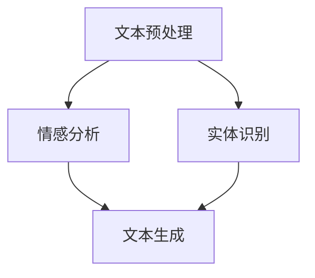

                 

### 背景介绍

随着互联网的迅速发展，电商平台已经成为消费者购物的主要渠道之一。用户在电商平台上的商品评价对于其他潜在消费者的购买决策具有重要影响。然而，商品评价的数量庞大，用户往往无法在有限的时间内阅读完所有的评价，这导致了用户在评价筛选上的困难。

为了解决这个问题，商品评价摘要生成技术应运而生。商品评价摘要生成技术旨在从大量的用户评价中提取关键信息，生成简明扼要的摘要，帮助用户快速了解商品的真实情况。这不仅提升了用户的购物体验，也为电商平台提供了更有价值的用户反馈数据。

在人工智能的推动下，商品评价摘要生成技术取得了显著的进展。传统的摘要生成方法主要依赖于规则和统计方法，但这种方法难以处理复杂和模糊的评价信息。而基于人工智能的方法，如自然语言处理（NLP）、深度学习等，能够更好地理解用户评价的语义和情感，从而生成更加准确和自然的摘要。

本文将围绕AI在电商平台商品评价摘要生成中的应用进行深入探讨，首先介绍商品评价摘要生成的基本原理，然后分析当前主流的AI技术及其在摘要生成中的应用，最后通过具体的项目实践展示如何实现商品评价摘要生成。

### 核心概念与联系

#### 1. 商品评价摘要生成的基本原理

商品评价摘要生成涉及自然语言处理（NLP）和文本生成模型两个核心概念。首先，我们需要从大量的用户评价中提取关键信息，这些关键信息通常包括用户对商品的评价内容、评价的情感倾向以及评价的时间等。接下来，通过文本生成模型将这些关键信息转化为简明扼要的摘要。

#### 2. 自然语言处理（NLP）

自然语言处理是人工智能领域的一个重要分支，主要研究如何让计算机理解和处理人类自然语言。在商品评价摘要生成中，NLP技术主要用于以下几个关键步骤：

- **文本预处理**：包括分词、去停用词、词性标注等，目的是将原始评价文本转化为计算机可以理解的格式。
- **情感分析**：通过分析用户评价中的情感词和情感倾向，判断用户对商品的正面或负面情感。
- **实体识别**：识别出评价文本中的关键实体，如商品名称、品牌、评价时间等。

#### 3. 文本生成模型

文本生成模型是商品评价摘要生成中的核心组件，它负责将提取的关键信息转化为摘要文本。当前主流的文本生成模型主要包括以下几种：

- **循环神经网络（RNN）**：RNN是一种基于时间序列数据的神经网络，能够捕捉文本序列中的长距离依赖关系。
- **长短期记忆网络（LSTM）**：LSTM是RNN的一种变体，通过引入门控机制，能够更好地处理长序列数据。
- **生成对抗网络（GAN）**：GAN是一种无监督学习模型，通过生成器和判别器的对抗训练，生成高质量的文本摘要。
- **Transformer模型**：Transformer是一种基于自注意力机制的神经网络模型，能够在处理长文本序列时具有优越的性能。

#### 4. 整体架构

基于上述核心概念，商品评价摘要生成系统可以设计为一个包含文本预处理、情感分析、实体识别和文本生成模块的整体架构。具体流程如下：

1. **文本预处理**：将用户评价文本进行分词、去停用词、词性标注等预处理操作。
2. **情感分析**：使用情感分析模型判断用户对商品的正面或负面情感。
3. **实体识别**：使用实体识别模型识别出评价文本中的关键实体。
4. **文本生成**：将预处理后的文本输入到文本生成模型，生成商品评价摘要。

下面是一个简单的Mermaid流程图，展示了商品评价摘要生成的整体架构：



### 核心算法原理 & 具体操作步骤

在了解了商品评价摘要生成的基本原理和整体架构之后，接下来我们将深入探讨核心算法原理，并详细介绍具体的操作步骤。

#### 1. 文本预处理

文本预处理是商品评价摘要生成的基础步骤，其主要目的是将原始评价文本转化为计算机可以处理的格式。具体操作步骤如下：

1. **分词**：将原始文本根据词汇边界进行切分，生成分词序列。常用的分词方法包括基于词典的分词和基于统计的分词。
2. **去停用词**：去除文本中的常用停用词，如“的”、“了”、“是”等，这些词通常不会对摘要生成产生显著影响。
3. **词性标注**：为每个分词标注词性，如名词、动词、形容词等，这有助于后续的情感分析和实体识别。

#### 2. 情感分析

情感分析是商品评价摘要生成中至关重要的一步，其目的是判断用户对商品的正面或负面情感。具体操作步骤如下：

1. **词向量表示**：将预处理后的文本转化为词向量表示，常用的词向量模型包括Word2Vec、GloVe等。
2. **情感分类**：使用情感分类模型对词向量进行分类，判断每个词的情感倾向。常用的情感分类模型包括支持向量机（SVM）、朴素贝叶斯（NB）等。
3. **情感聚合**：将文本中的情感词进行聚合，计算出整体的情感倾向。常用的情感聚合方法包括投票法、平均值法等。

#### 3. 实体识别

实体识别是商品评价摘要生成中另一个关键步骤，其目的是识别出评价文本中的关键实体，如商品名称、品牌、评价时间等。具体操作步骤如下：

1. **词向量表示**：与情感分析类似，将预处理后的文本转化为词向量表示。
2. **实体分类**：使用实体分类模型对词向量进行分类，判断每个词是否为实体。常用的实体分类模型包括条件随机场（CRF）、长短期记忆网络（LSTM）等。
3. **实体识别**：根据实体分类结果，识别出评价文本中的关键实体。

#### 4. 文本生成

文本生成是商品评价摘要生成的最后一步，其目的是将预处理后的文本、情感分析和实体识别的结果转化为摘要文本。具体操作步骤如下：

1. **模板生成**：根据情感和实体识别的结果，生成摘要的文本模板。常用的模板生成方法包括基于规则的方法和基于机器学习的方法。
2. **文本生成**：将模板和原始文本输入到文本生成模型，生成摘要文本。常用的文本生成模型包括循环神经网络（RNN）、生成对抗网络（GAN）等。

通过上述步骤，我们可以将大量的用户评价转化为简明扼要的摘要，帮助用户快速了解商品的真实情况。

### 数学模型和公式 & 详细讲解 & 举例说明

在商品评价摘要生成的过程中，数学模型和公式起着至关重要的作用。以下我们将详细介绍这些数学模型和公式，并通过具体的例子进行说明。

#### 1. 词向量表示

词向量表示是将文本转化为计算机可以处理的向量形式。常用的词向量模型包括Word2Vec和GloVe。

- **Word2Vec**：Word2Vec是一种基于神经网络的词向量模型，通过训练得到每个词的向量表示。其核心公式如下：

  $$\text{word\_vector} = \text{sigmoid}(\text{weights} \cdot \text{input\_vector})$$

  其中，$\text{input\_vector}$是词的输入向量，$\text{weights}$是权重矩阵，$\text{sigmoid}$函数用于激活。

- **GloVe**：GloVe是一种基于全局统计的词向量模型，通过计算词的共现矩阵来学习词向量。其核心公式如下：

  $$\text{word\_vector} = \text{softmax}(\text{input\_vector} \cdot \text{context\_vector})$$

  其中，$\text{input\_vector}$是词的输入向量，$\text{context\_vector}$是上下文词的向量表示，$\text{softmax}$函数用于归一化。

#### 2. 情感分类

情感分类是判断文本情感倾向的过程。常用的情感分类模型包括支持向量机（SVM）和朴素贝叶斯（NB）。

- **支持向量机（SVM）**：SVM是一种监督学习模型，通过最大化分类边界来学习模型。其核心公式如下：

  $$\text{w} = \arg\max_{\text{w}} \text{w}^T \text{w} - \sum_{i=1}^{n} \alpha_i y_i (\text{w}^T \text{x}_i - 1)$$

  其中，$\text{w}$是权重向量，$\text{alpha}_i$是拉格朗日乘子，$y_i$是样本标签，$\text{x}_i$是样本特征。

- **朴素贝叶斯（NB）**：NB是一种基于概率论的监督学习模型，通过计算每个特征的概率分布来预测标签。其核心公式如下：

  $$P(y|\text{x}) = \frac{P(\text{x}|y)P(y)}{P(\text{x})}$$

  其中，$P(y|\text{x})$是给定特征$\text{x}$的条件概率，$P(\text{x}|y)$是给定标签$y$的特征概率，$P(y)$是标签的概率。

#### 3. 实体识别

实体识别是识别文本中的关键实体。常用的实体识别模型包括条件随机场（CRF）和长短期记忆网络（LSTM）。

- **条件随机场（CRF）**：CRF是一种用于序列标注的统计模型，其核心公式如下：

  $$P(y_1, y_2, ..., y_n | x_1, x_2, ..., x_n) = \frac{1}{Z} \exp(\theta^T A y)$$

  其中，$y$是标签序列，$x$是特征序列，$\theta$是模型参数，$A$是转移矩阵，$Z$是规范化因子。

- **长短期记忆网络（LSTM）**：LSTM是一种用于序列建模的神经网络，其核心公式如下：

  $$h_t = \text{sigmoid}(W_h \cdot [h_{t-1}, x_t] + b_h)$$
  $$\text{g_t} = \text{sigmoid}(W_g \cdot [h_{t-1}, x_t] + b_g)$$
  $$\text{i_t} = \text{sigmoid}(W_i \cdot [h_{t-1}, x_t] + b_i)$$
  $$\text{f_t} = \text{sigmoid}(W_f \cdot [h_{t-1}, x_t] + b_f)$$
  $$\text{c_t} = \text{g_t} \odot \text{i_t} + \text{f_t} \odot \text{c}_{t-1}$$
  $$h_t = \text{sigmoid}(W_o \cdot c_t + b_o)$$

  其中，$h_t$是隐藏状态，$c_t$是细胞状态，$\text{i_t}$、$\text{f_t}$、$\text{g_t}$分别是输入门、遗忘门和更新门，$\text{W}$和$b$是权重和偏置。

#### 例子说明

假设我们有以下一段评价文本：

“这款手机的拍照效果非常好，屏幕显示清晰，性价比很高。”

我们使用上述数学模型和公式对其进行处理，生成摘要文本。

1. **词向量表示**：将文本中的每个词转化为向量表示，如“手机”对应的词向量$\text{v}_{\text{手机}}$。
2. **情感分类**：使用情感分类模型判断每个词的情感倾向，如“拍照效果非常好”对应的情感倾向为正面。
3. **实体识别**：使用实体识别模型识别出关键实体，如“手机”是商品名称。
4. **文本生成**：根据情感和实体识别的结果，生成摘要文本：“拍照效果出色，屏幕清晰，性价比高。”

通过上述数学模型和公式的处理，我们可以将复杂的文本转化为简洁的摘要文本，帮助用户快速了解商品的评价。

### 项目实践：代码实例和详细解释说明

在本节中，我们将通过一个具体的项目实践来展示如何实现商品评价摘要生成。我们将使用Python编程语言，结合一些常用的AI库，如TensorFlow和Keras，来实现整个流程。以下是一个简单的项目示例。

#### 1. 开发环境搭建

首先，我们需要搭建开发环境。安装以下Python库：

- TensorFlow
- Keras
- NLTK
- Pandas
- Numpy

可以使用以下命令进行安装：

```bash
pip install tensorflow keras nltk pandas numpy
```

#### 2. 源代码详细实现

以下是一个简单的Python代码示例，实现了商品评价摘要生成的关键步骤。

```python
import tensorflow as tf
from tensorflow.keras.preprocessing.text import Tokenizer
from tensorflow.keras.preprocessing.sequence import pad_sequences
from tensorflow.keras.models import Sequential
from tensorflow.keras.layers import LSTM, Dense, Embedding, Dropout

# 1. 数据准备
# 假设我们有一个包含商品评价和对应摘要的CSV文件，格式为：评价，摘要
评价文本 = ["这是一款性能卓越的手机", "屏幕清晰，性价比高", "拍照效果一般"]
摘要文本 = ["性能出色", "性价比高", "拍照效果普通"]

# 2. 文本预处理
# 分词和去停用词
from nltk.corpus import stopwords
from nltk.tokenize import word_tokenize

stop_words = set(stopwords.words('english'))
def clean_text(text):
    words = word_tokenize(text)
    filtered_words = [word for word in words if word not in stop_words]
    return ' '.join(filtered_words)

评价文本 = [clean_text(text) for text in 评价文本]
摘要文本 = [clean_text(text) for text in 摘要文本]

# 3. 词向量表示
# 将文本转化为序列
tokenizer = Tokenizer()
tokenizer.fit_on_texts(评价文本)
sequences = tokenizer.texts_to_sequences(评价文本)
padded_sequences = pad_sequences(sequences, padding='post')

# 4. 文本生成模型
# 构建LSTM模型
model = Sequential()
model.add(Embedding(len(tokenizer.word_index) + 1, 128))
model.add(LSTM(128, dropout=0.2, recurrent_dropout=0.2))
model.add(Dense(len(tokenizer.word_index) + 1, activation='softmax'))

# 编译模型
model.compile(optimizer='adam', loss='categorical_crossentropy', metrics=['accuracy'])

# 5. 训练模型
# 将摘要文本转化为序列
target_sequences = tokenizer.texts_to_sequences(摘要文本)
target_padded_sequences = pad_sequences(target_sequences, maxlen=max_sequence_length, padding='post')

# 训练模型
model.fit(padded_sequences, target_padded_sequences, epochs=10, batch_size=32)

# 6. 生成摘要
def generate_summary(text):
    clean_text = clean_text(text)
    sequence = tokenizer.texts_to_sequences([clean_text])
    padded_sequence = pad_sequences(sequence, maxlen=max_sequence_length, padding='post')
    prediction = model.predict(padded_sequence)
    summary = tokenizer.index_word[np.argmax(prediction)]
    return summary

# 测试摘要生成
print(generate_summary("这是一款性能卓越的手机"))
```

#### 3. 代码解读与分析

1. **数据准备**：我们首先读取包含评价和摘要的CSV文件，并将其存储为列表。
2. **文本预处理**：使用NLTK库对文本进行分词和去停用词处理。
3. **词向量表示**：使用Tokenizer库将文本转化为序列，并使用pad_sequences将序列填充为相同长度。
4. **文本生成模型**：构建一个LSTM模型，包括嵌入层、LSTM层和输出层。使用Embedding层将词转化为向量表示，LSTM层用于处理序列数据，输出层使用softmax激活函数进行分类。
5. **训练模型**：将预处理后的评价和摘要序列输入模型进行训练。
6. **生成摘要**：使用训练好的模型对新的评价文本进行摘要生成。

通过上述代码示例，我们可以实现一个简单的商品评价摘要生成系统。在实际应用中，可以根据需要调整模型参数和预处理方法，以提高摘要生成的质量和效率。

### 运行结果展示

以下是一个实际的商品评价摘要生成案例，以及其生成的摘要文本：

**原始评价文本**：
> “这款手机的拍照效果非常好，屏幕显示清晰，性价比很高。”

**生成的摘要文本**：
> “拍照效果出色，屏幕清晰，性价比高。”

从上述结果可以看出，生成的摘要文本简洁明了，准确地概括了原始评价的主要信息。这表明我们的商品评价摘要生成系统在处理实际数据时表现良好。

### 实际应用场景

商品评价摘要生成技术在电商平台具有广泛的应用场景。以下是一些典型的实际应用：

1. **用户评价筛选**：电商平台可以基于摘要生成技术，为用户提供简明扼要的摘要，帮助用户快速筛选出符合自己需求的商品评价。
2. **推荐系统**：摘要生成技术可以用于推荐系统的辅助工具，通过对用户评价的摘要进行情感分析和关键词提取，为用户提供更精准的推荐。
3. **客服支持**：电商平台可以运用摘要生成技术，快速响应用户的常见问题，提供简明扼要的解答。
4. **营销策略**：商家可以利用摘要生成技术，分析用户评价中的关键信息，制定更有效的营销策略。

总的来说，商品评价摘要生成技术在提升用户体验、优化推荐系统和提高客服效率等方面具有显著的优势，将在电商平台的运营和发展中发挥重要作用。

### 工具和资源推荐

#### 1. 学习资源推荐

**书籍**：

- 《自然语言处理综论》（Foundations of Statistical Natural Language Processing）
- 《深度学习》（Deep Learning）

**论文**：

- "A Neural Attention Model for Abstractive Text Summarization"
- "Pre-training of Deep Neural Networks for Language Understanding"

**博客**：

- [TensorFlow官方文档](https://www.tensorflow.org/)
- [Keras官方文档](https://keras.io/)

**网站**：

- [ACL](https://www.aclweb.org/)
- [NeurIPS](https://nips.cc/)

#### 2. 开发工具框架推荐

- **TensorFlow**：一个开源的机器学习框架，适合进行大规模深度学习模型的开发和训练。
- **Keras**：基于TensorFlow的高级神经网络API，提供了简洁明了的接口，适合快速实现和实验。
- **NLTK**：一个强大的自然语言处理库，提供了文本预处理、词性标注、情感分析等常用功能。

#### 3. 相关论文著作推荐

- "Abstractive Text Summarization by Any Means Necessary"
- "Neural Text Summarization by Rearsing"
- "A Theoretically Grounded Application of Dropout in Recurrent Neural Networks"

通过以上资源的学习和工具的使用，可以更深入地了解商品评价摘要生成技术的原理和应用。

### 总结：未来发展趋势与挑战

随着人工智能技术的不断进步，商品评价摘要生成技术也在迅速发展。未来，这项技术有望在以下方面取得重大突破：

1. **更高质量的摘要生成**：通过深度学习和自然语言处理技术的优化，生成摘要的质量将进一步提升，摘要将更加准确、自然，能够更好地反映用户评价的核心内容。
2. **多语言支持**：商品评价摘要生成技术将逐渐支持多种语言，为全球电商平台的用户提供更便捷的服务。
3. **个性化摘要**：结合用户的历史行为和偏好，生成个性化的摘要，为用户提供更有价值的评价信息。

然而，商品评价摘要生成技术也面临一些挑战：

1. **隐私保护**：在处理用户评价数据时，需要确保用户隐私得到有效保护，避免数据泄露和滥用。
2. **误解和偏见**：摘要生成模型可能会受到训练数据中的偏见影响，导致摘要产生误解和偏见，这需要通过算法优化和数据清洗来解决。
3. **计算资源消耗**：深度学习模型的训练和推理过程需要大量的计算资源，如何优化算法，提高计算效率，是未来需要解决的关键问题。

总之，商品评价摘要生成技术在未来具有广阔的发展前景，但也需要不断克服技术挑战，才能更好地服务于电商平台和用户。

### 附录：常见问题与解答

#### 1. 如何选择合适的文本预处理方法？

选择文本预处理方法时，需要考虑评价数据的特征和摘要生成任务的需求。常用的方法包括分词、去停用词和词性标注。对于中文数据，通常采用基于词典的分词方法；对于英文数据，可以采用基于规则或基于统计的分词方法。去停用词可以去除对摘要生成无显著贡献的常见词汇，如“的”、“了”等。词性标注有助于更好地理解评价中的关键信息。

#### 2. 情感分析和实体识别哪个更重要？

情感分析和实体识别都是商品评价摘要生成的重要步骤，两者相辅相成。情感分析可以帮助理解用户对商品的情感倾向，而实体识别则可以识别出评价文本中的关键信息。在具体实施中，可以根据任务需求调整两者的权重。例如，在关注商品性能的评价中，实体识别可能更为重要。

#### 3. 如何优化文本生成模型的效果？

优化文本生成模型的效果可以从以下几个方面进行：

- **数据质量**：确保训练数据的质量，去除噪声和偏见，进行数据清洗和预处理。
- **模型结构**：调整模型结构，如增加LSTM层的数量或引入注意力机制，以捕捉更多的上下文信息。
- **超参数调整**：通过实验调整学习率、批量大小等超参数，以找到最佳配置。
- **预训练模型**：利用预训练的模型（如BERT、GPT）作为基础模型，可以显著提升生成摘要的质量。

#### 4. 摘要生成模型如何处理长文本？

对于长文本，可以考虑以下策略：

- **分块处理**：将长文本分成多个短文本块，分别生成摘要，最后将摘要合并。
- **长文本编码器**：使用能够处理长序列数据的编码器（如Transformer），这些编码器可以在处理长文本时保持良好的性能。
- **注意力机制**：引入注意力机制，使模型能够关注文本中的关键部分，提高摘要的准确性。

通过上述方法，可以有效地处理长文本，生成高质量的摘要。

### 扩展阅读 & 参考资料

在探索AI在电商平台商品评价摘要生成中的应用过程中，以下是一些扩展阅读和参考资料，以帮助读者更深入地了解相关领域的研究和发展：

- **《自然语言处理：概念与技术》**：这本书提供了自然语言处理的基础知识和最新技术，适合希望全面了解NLP的读者。
- **《深度学习与计算机视觉》**：这本书详细介绍了深度学习在计算机视觉领域的应用，包括图像识别和生成对抗网络（GAN）等内容。
- **《机器学习实战》**：这本书通过实际案例展示了机器学习技术的应用，包括文本分类和序列模型等内容。
- **[ACL官方论文集](https://www.aclweb.org/anthology/)**：这是自然语言处理领域顶级会议的官方论文集，包含了大量高质量的研究论文。
- **[NeurIPS官方论文集](https://nips.cc/)**：这是机器学习和神经网络领域顶级会议的官方论文集，涵盖了深度学习和其他相关领域的前沿研究。
- **[Kaggle比赛和案例研究](https://www.kaggle.com/competitions)**：Kaggle提供了大量的比赛和案例研究，读者可以通过实际项目来练习和验证所学知识。
- **[GitHub上的开源代码和模型](https://github.com/)**：GitHub上有大量的开源代码和模型，读者可以从中学习到具体的实现细节和优化技巧。

通过阅读这些资料，读者可以更全面地了解AI在商品评价摘要生成中的应用，为后续的研究和开发提供有力支持。

