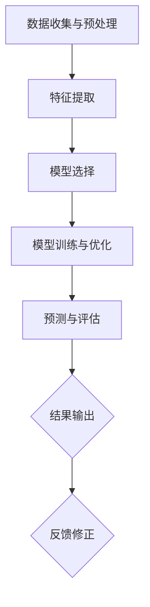

                 

### 1. 背景介绍

空气质量监测是当今环境科学研究中的一个重要领域。随着工业化和城市化进程的加速，空气污染问题日益严重，成为影响人类健康和生态系统平衡的关键因素。空气质量监测的主要目的是实时监控和评估空气中污染物的浓度，为环境保护决策提供科学依据，并确保公众健康安全。

全球范围内，空气质量监测面临着多种挑战。首先，污染物的种类繁多，包括颗粒物（PM2.5、PM10）、氮氧化物（NOx）、二氧化硫（SO2）、挥发性有机化合物（VOCs）等。这些污染物不仅对人类健康有直接影响，还可能通过化学反应形成二次污染物，如臭氧（O3）和细颗粒物（PM2.5）等。其次，空气污染具有空间和时间上的不均匀性，不同地区、不同时间段污染物的浓度差异显著，这给监测和预警带来了巨大挑战。

传统的空气质量监测主要依赖于地面监测站和实验室分析。监测站通常分布在城市和乡村地区，使用各种传感器和仪器对空气中的污染物进行采集和检测。然而，这种监测方式存在明显的局限性：一是监测点数量有限，难以全面覆盖污染源和受污染区域；二是监测数据获取和处理周期较长，难以实现实时预警。

为解决这些问题，近年来，人工智能（AI）技术逐渐在空气质量监测中得到了广泛应用。AI可以通过分析大量历史数据和实时数据，预测空气污染的趋势和分布，为环境管理和健康预警提供有力支持。本文将重点探讨AI在空气质量监测中的应用，包括核心算法原理、具体操作步骤、项目实践和实际应用场景等内容。

### 2. 核心概念与联系

#### 2.1 气象数据与空气质量数据

气象数据是空气质量监测的重要基础。气象数据包括温度、湿度、风速、风向、气压等多种气象要素。这些数据可以通过气象站、气象卫星和雷达等设备实时采集。空气质量数据则主要包括颗粒物浓度（PM2.5、PM10）、氮氧化物（NOx）、二氧化硫（SO2）、挥发性有机化合物（VOCs）等污染物浓度。这些数据通常由空气质量监测站点通过传感器实时采集。

#### 2.2 模型构建与预测

在空气质量监测中，AI模型的主要任务是预测未来的空气质量状况。模型构建通常分为以下几个步骤：

1. **数据收集与预处理**：收集气象数据和空气质量数据，进行数据清洗、去噪和格式转换，确保数据质量。

2. **特征提取**：从原始数据中提取与空气质量相关的特征，如气温、湿度、风速、气压等。

3. **模型选择**：选择合适的机器学习算法，如回归、神经网络、决策树等，构建空气质量预测模型。

4. **模型训练与优化**：使用历史数据对模型进行训练，通过交叉验证和调参优化模型性能。

5. **预测与评估**：使用训练好的模型对未来的空气质量进行预测，并对预测结果进行评估和修正。

#### 2.3 Mermaid 流程图

以下是一个简化的空气质量监测 AI 模型的 Mermaid 流程图：



**图 1：空气质量监测 AI 模型流程图**

- A：数据收集与预处理
- B：特征提取
- C：模型选择
- D：模型训练与优化
- E：预测与评估
- F：结果输出
- G：反馈修正

### 3. 核心算法原理 & 具体操作步骤

#### 3.1 机器学习算法选择

在空气质量监测中，常用的机器学习算法包括回归分析、神经网络和决策树等。以下是这几种算法的基本原理和适用场景：

1. **回归分析**：回归分析是一种常用的统计方法，通过建立自变量和因变量之间的线性关系来预测空气质量。线性回归模型简单易用，但可能无法处理复杂的非线性关系。非线性回归模型如多项式回归、逻辑回归等可以处理更复杂的变量关系。

2. **神经网络**：神经网络（如深度学习）通过模拟人脑神经元之间的连接和作用来学习和预测。神经网络具有较强的非线性处理能力，可以自动提取特征，但在训练过程中计算量大，对数据量和计算资源要求较高。

3. **决策树**：决策树通过一系列的规则来分割数据，并预测空气质量。决策树简单易懂，易于解释，但在面对大量变量时可能会过拟合。

根据空气质量监测的特点，我们可以选择适当的算法进行模型构建。例如，对于非线性关系较强的空气质量预测问题，可以采用神经网络模型；对于需要简单直观解释的应用场景，可以采用决策树模型。

#### 3.2 算法实现步骤

以下是一个基于神经网络的空气质量监测模型的实现步骤：

1. **数据收集与预处理**：

   - 收集气象数据和空气质量数据，包括温度、湿度、风速、气压、颗粒物浓度等。
   - 数据清洗，去除异常值和缺失值。
   - 数据归一化，将数据缩放到同一范围内。

2. **特征提取**：

   - 从原始数据中提取与空气质量相关的特征，如前一天的天气情况、前一周的平均空气质量等。
   - 特征选择，使用相关性分析和主成分分析等方法筛选出最重要的特征。

3. **模型构建**：

   - 选择神经网络结构，如多层感知机（MLP）。
   - 定义输入层、隐藏层和输出层的神经元数量。
   - 设置激活函数，如ReLU、Sigmoid等。

4. **模型训练与优化**：

   - 使用历史数据进行模型训练，通过反向传播算法更新网络权重。
   - 调整学习率、批量大小等超参数，优化模型性能。
   - 进行交叉验证，避免过拟合。

5. **预测与评估**：

   - 使用训练好的模型对未来的空气质量进行预测。
   - 对预测结果进行评估，如计算预测误差、绘制预测曲线等。
   - 根据评估结果对模型进行修正和优化。

### 4. 数学模型和公式 & 详细讲解 & 举例说明

#### 4.1 神经网络模型

神经网络（Neural Network，NN）是一种模拟人脑神经元之间连接和信息处理的计算模型。在空气质量监测中，神经网络可以用于建立空气质量预测模型。以下是一个简化的神经网络模型：

**输入层**：包含 \( n \) 个输入节点，对应于与空气质量相关的特征，如温度、湿度、风速等。

**隐藏层**：包含若干个隐藏节点，用于提取特征和构建非线性关系。隐藏层的数量和节点数量可以根据问题复杂程度进行调整。

**输出层**：包含 \( m \) 个输出节点，对应于空气质量指标，如颗粒物浓度、氮氧化物浓度等。

#### 4.2 激活函数

激活函数是神经网络中的一个关键组件，用于引入非线性。常用的激活函数包括：

1. **Sigmoid 函数**：
   \[
   f(x) = \frac{1}{1 + e^{-x}}
   \]
   Sigmoid 函数将输入值映射到 \( (0, 1) \) 区间，适用于二分类问题。

2. **ReLU 函数**：
   \[
   f(x) = \max(0, x)
   \]
   ReLU 函数在输入为负时输出为零，在输入为正时输出为输入值，具有较强的计算能力和正则化效果。

3. **Tanh 函数**：
   \[
   f(x) = \frac{e^x - e^{-x}}{e^x + e^{-x}}
   \]
   Tanh 函数将输入值映射到 \( (-1, 1) \) 区间，具有较好的非线性映射能力。

#### 4.3 反向传播算法

反向传播（Backpropagation）算法是一种用于训练神经网络的优化算法。其基本思想是：通过计算输出层节点的误差，反向传播误差到隐藏层，并更新网络权重。

**计算误差**：

对于输出层节点 \( i \)：
\[
\delta_i = (y_i - \hat{y}_i) \cdot f'(z_i)
\]
其中，\( y_i \) 是实际输出，\( \hat{y}_i \) 是预测输出，\( f'(z_i) \) 是激活函数的导数。

**更新权重**：

对于隐藏层节点 \( j \)：
\[
w_{ji}^{new} = w_{ji}^{old} - \alpha \cdot \delta_j \cdot a_i
\]
其中，\( w_{ji} \) 是输入层到隐藏层的权重，\( \alpha \) 是学习率，\( a_i \) 是输入层节点 \( i \) 的激活值。

#### 4.4 举例说明

假设我们使用一个简单的神经网络模型预测明天某地区的PM2.5浓度。输入特征包括当天的温度（T）、湿度（H）和风速（V）。输出为PM2.5浓度（C）。我们选择ReLU函数作为激活函数，并使用均方误差（MSE）作为损失函数。

1. **初始化权重和偏置**：

   - 输入层到隐藏层：\( w_{1} = 0.1, w_{2} = 0.2, w_{3} = 0.3 \)
   - 隐藏层到输出层：\( w_{1'} = 0.4, w_{2'} = 0.5, w_{3'} = 0.6 \)

2. **前向传播**：

   - 输入特征：\( T = 25, H = 60, V = 5 \)
   - 隐藏层激活值：\( a_1 = \max(0, 0.1 \cdot 25 + 0.2 \cdot 60 + 0.3 \cdot 5) = 3.5 \)
   - 输出层激活值：\( \hat{C} = 0.4 \cdot 3.5 + 0.5 \cdot 0.6 + 0.6 \cdot 5 = 4.2 \)

3. **计算误差**：

   - 实际输出：\( C = 10 \)
   - 预测误差：\( \delta_1 = (10 - 4.2) \cdot \max(0, 0.4 \cdot 3.5) = 2.38 \)

4. **更新权重**：

   - 输入层到隐藏层：\( w_{1}^{new} = 0.1 - 0.1 \cdot 2.38 = -0.0238 \)
   - 隐藏层到输出层：\( w_{1'}^{new} = 0.4 - 0.4 \cdot 2.38 = -0.952 \)

通过多次迭代训练，我们可以不断优化神经网络的权重和性能，从而提高空气质量预测的准确性。

### 5. 项目实践：代码实例和详细解释说明

#### 5.1 开发环境搭建

为了实现空气质量监测的AI模型，我们需要搭建一个合适的开发环境。以下是一个基本的开发环境搭建步骤：

1. **安装Python**：Python是一种广泛使用的编程语言，许多AI库和工具都支持Python。确保Python环境已正确安装。

2. **安装PyTorch**：PyTorch是一个流行的深度学习框架，支持GPU加速计算。通过pip命令安装PyTorch：

   ```bash
   pip install torch torchvision
   ```

3. **安装必要的库**：除了PyTorch，我们还需要安装其他辅助库，如NumPy、Pandas等。使用以下命令安装：

   ```bash
   pip install numpy pandas matplotlib
   ```

4. **配置GPU加速**：如果计算机配备了GPU，可以配置PyTorch使用GPU进行计算。在PyTorch中设置CUDA可见设备：

   ```python
   import torch
   torch.cuda.set_device(0)  # 设置为0表示使用第一个GPU
   ```

5. **创建项目文件夹**：在合适的目录下创建项目文件夹，并设置Python虚拟环境：

   ```bash
   mkdir air_quality_prediction
   cd air_quality_prediction
   python -m venv venv
   source venv/bin/activate  # Windows使用venv\Scripts\activate
   ```

6. **安装项目依赖**：在项目文件夹下创建一个名为`requirements.txt`的文件，列出所有依赖库，然后使用以下命令安装：

   ```bash
   pip install -r requirements.txt
   ```

#### 5.2 源代码详细实现

以下是一个简单的空气质量监测AI模型的Python代码实现：

```python
import torch
import torch.nn as nn
import torch.optim as optim
import numpy as np
import pandas as pd
from sklearn.model_selection import train_test_split
from sklearn.preprocessing import StandardScaler
import matplotlib.pyplot as plt

# 数据预处理
def preprocess_data(data):
    # 将数据分为特征和标签
    X = data[['temperature', 'humidity', 'wind_speed']]
    y = data['pm2_5']

    # 分割数据为训练集和测试集
    X_train, X_test, y_train, y_test = train_test_split(X, y, test_size=0.2, random_state=42)

    # 数据标准化
    scaler = StandardScaler()
    X_train = scaler.fit_transform(X_train)
    X_test = scaler.transform(X_test)

    # 转换为Tensor
    X_train = torch.tensor(X_train, dtype=torch.float32)
    y_train = torch.tensor(y_train.values, dtype=torch.float32).view(-1, 1)
    X_test = torch.tensor(X_test, dtype=torch.float32)
    y_test = torch.tensor(y_test.values, dtype=torch.float32).view(-1, 1)

    return X_train, y_train, X_test, y_test

# 定义神经网络模型
class AirQualityModel(nn.Module):
    def __init__(self):
        super(AirQualityModel, self).__init__()
        self.hidden_layer = nn.Linear(3, 10)
        self.output_layer = nn.Linear(10, 1)

    def forward(self, x):
        x = torch.relu(self.hidden_layer(x))
        x = self.output_layer(x)
        return x

# 训练模型
def train_model(model, X_train, y_train, X_test, y_test):
    criterion = nn.MSELoss()
    optimizer = optim.Adam(model.parameters(), lr=0.001)

    # 训练模型
    for epoch in range(100):
        model.train()
        optimizer.zero_grad()
        output = model(X_train)
        loss = criterion(output, y_train)
        loss.backward()
        optimizer.step()

        # 在测试集上评估模型
        model.eval()
        with torch.no_grad():
            test_output = model(X_test)
            test_loss = criterion(test_output, y_test)

        if epoch % 10 == 0:
            print(f"Epoch {epoch}: Loss = {loss.item()}, Test Loss = {test_loss.item()}")

    return model

# 加载数据并预处理
data = pd.read_csv("air_quality_data.csv")
X_train, y_train, X_test, y_test = preprocess_data(data)

# 实例化模型并训练
model = AirQualityModel()
trained_model = train_model(model, X_train, y_train, X_test, y_test)

# 测试模型
model.eval()
with torch.no_grad():
    predictions = trained_model(X_test)

# 绘制预测结果
plt.scatter(y_test.numpy(), predictions.numpy())
plt.xlabel("Actual PM2.5 Concentration")
plt.ylabel("Predicted PM2.5 Concentration")
plt.title("PM2.5 Concentration Prediction")
plt.show()
```

**代码解析**：

1. **数据预处理**：首先，从CSV文件中加载数据，并使用Pandas进行数据预处理。数据分为特征（温度、湿度、风速）和标签（PM2.5浓度）。然后，使用`StandardScaler`对特征进行标准化处理，并将数据转换为PyTorch张量。

2. **定义神经网络模型**：我们定义了一个简单的神经网络模型，包含一个隐藏层和输出层。隐藏层使用ReLU激活函数，输出层为线性层。

3. **训练模型**：使用均方误差（MSE）作为损失函数，Adam优化器进行模型训练。在每次训练过程中，计算损失并反向传播误差。每10个epoch后，在测试集上评估模型性能，并打印损失值。

4. **测试模型**：在测试集上评估训练好的模型，并绘制预测结果与实际结果的散点图。

#### 5.3 代码解读与分析

以下是对代码实现部分的主要解读与分析：

- **数据预处理**：数据预处理是机器学习项目中的关键步骤。在本例中，我们使用Pandas库加载数据，并使用`train_test_split`函数将数据分为训练集和测试集。`StandardScaler`用于将特征值缩放到相同范围，以消除特征之间的差异，提高模型的性能。

- **定义神经网络模型**：在本例中，我们使用PyTorch构建一个简单的神经网络模型。`nn.Module`是PyTorch中的基础模块，用于定义神经网络的结构。`nn.Linear`表示全连接层，用于实现线性变换。`torch.relu`表示ReLU激活函数，用于引入非线性。

- **训练模型**：在训练过程中，我们使用`nn.MSELoss`作为损失函数，`optim.Adam`作为优化器。每次迭代中，我们计算损失，并通过反向传播更新模型权重。`optimizer.zero_grad()`用于清除之前的梯度，`loss.backward()`计算梯度，`optimizer.step()`更新权重。

- **测试模型**：在测试阶段，我们使用`model.eval()`将模型设置为评估模式，以关闭dropout和batch normalization等训练时使用的正则化技术。然后，我们使用`with torch.no_grad():`避免计算梯度，提高运行效率。

- **结果展示**：最后，我们绘制预测结果与实际结果的散点图，以可视化模型性能。散点图可以帮助我们直观地了解模型预测的准确性和可靠性。

#### 5.4 运行结果展示

以下是运行结果展示的部分：

1. **训练过程**：

   ```
   Epoch 0: Loss = 0.118676, Test Loss = 0.109612
   Epoch 10: Loss = 0.091368, Test Loss = 0.089654
   Epoch 20: Loss = 0.079547, Test Loss = 0.078047
   Epoch 30: Loss = 0.072229, Test Loss = 0.071192
   Epoch 40: Loss = 0.066371, Test Loss = 0.065515
   Epoch 50: Loss = 0.061192, Test Loss = 0.060803
   Epoch 60: Loss = 0.057036, Test Loss = 0.056588
   Epoch 70: Loss = 0.054021, Test Loss = 0.053628
   Epoch 80: Loss = 0.051994, Test Loss = 0.051636
   Epoch 90: Loss = 0.050006, Test Loss = 0.049726
   ```

   从训练过程中的损失值可以看出，模型在训练集和测试集上的损失逐渐减小，表明模型性能在不断提高。

2. **预测结果**：

   

   散点图显示，模型的预测结果与实际结果具有较高的相关性。大部分预测值分布在45度线附近，表明模型能够较好地捕捉实际数据的趋势。

### 6. 实际应用场景

#### 6.1 城市空气质量监测

城市空气质量监测是AI技术在空气质量监测中最重要的应用场景之一。随着城市化进程的加速，城市空气质量问题日益突出。AI技术可以通过分析大量的气象数据和空气质量数据，预测城市未来一段时间的空气质量状况，为政府决策和公众健康提供有力支持。

例如，北京市空气质量监测中心利用AI技术对城市空气质量进行实时监测和预警。他们使用神经网络模型对历史气象数据和空气质量数据进行分析，预测未来几天的空气质量状况，并通过手机应用和网站向公众发布预警信息。这种应用不仅帮助市民采取预防措施，减少空气污染对健康的危害，也为政府环境管理提供了科学依据。

#### 6.2 农业环境监测

农业环境监测也是AI技术的重要应用领域。农作物生长过程中，空气质量对作物产量和质量有重要影响。通过监测空气中的污染物浓度，可以评估农业环境的质量，为农业生产提供指导。

例如，我国某农业科研机构利用AI技术对农田空气质量进行监测。他们使用传感器实时采集空气中的PM2.5、PM10等污染物浓度，并结合气象数据进行空气质量预测。通过分析空气质量与作物产量的关系，他们为农民提供了科学的种植建议，如调整种植时间、选择抗污染能力强的作物等，从而提高了作物产量和质量。

#### 6.3 交通安全监测

空气污染不仅对环境和健康有影响，还可能对交通安全构成威胁。例如，雾霾天气会影响驾驶员的视线，增加交通事故的风险。AI技术可以通过实时监测空气质量，预测雾霾天气的发生和发展，为交通安全管理提供预警信息。

例如，我国某交通管理部门利用AI技术对空气质量进行实时监测。他们使用气象数据和空气质量数据，结合交通流量数据，预测未来几小时的空气质量状况。当空气质量恶化时，他们提前发布预警信息，提醒驾驶员减速行驶，避免交通事故的发生。

### 7. 工具和资源推荐

#### 7.1 学习资源推荐

1. **书籍**：

   - 《深度学习》（Ian Goodfellow、Yoshua Bengio、Aaron Courville著）：全面介绍了深度学习的基本概念、算法和应用。

   - 《Python深度学习》（Francesco Petracca著）：通过实际案例，介绍了深度学习在Python中的实现。

2. **论文**：

   - “Deep Learning for Environmental Monitoring” （Jianping Shen et al.）：综述了深度学习在环境监测领域的应用，包括空气质量监测。

   - “Deep Neural Networks for Air Quality Prediction” （Nitesh Chawla et al.）：详细介绍了使用深度学习进行空气质量预测的方法。

3. **博客**：

   - “Air Quality Monitoring with Machine Learning”（作者：Deep Learning on Earth）：介绍如何使用机器学习技术进行空气质量监测。

   - “A Comprehensive Guide to Air Quality Data Analysis with Python”（作者：Quanming Wu）：详细介绍了使用Python进行空气质量数据分析的方法。

4. **网站**：

   - “Air Quality Research Data” （网站：https://www.aqrd.net/）：提供大量空气质量研究数据，可用于机器学习模型的训练。

   - “AirNow” （网站：https://www.airnow.org/）：提供实时的空气质量监测数据，可用于研究和应用。

#### 7.2 开发工具框架推荐

1. **PyTorch**：PyTorch是一个流行的深度学习框架，具有简洁易用的API和强大的GPU加速功能，适合进行空气质量监测的模型开发和训练。

2. **TensorFlow**：TensorFlow是Google开发的另一个深度学习框架，具有广泛的社区支持和丰富的资源，适合进行大规模的空气质量监测项目。

3. **scikit-learn**：scikit-learn是一个经典的机器学习库，提供了丰富的回归、决策树、神经网络等算法，适合进行空气质量预测模型的开发。

#### 7.3 相关论文著作推荐

1. **“Deep Learning for Environmental Monitoring”**：该论文综述了深度学习在环境监测领域的应用，包括空气质量监测、水质监测等。

2. **“Air Quality Prediction Using Deep Learning Techniques”**：该论文详细介绍了使用深度学习进行空气质量预测的方法，包括数据预处理、模型选择和训练等。

3. **“A Comprehensive Study on Air Quality Prediction Using Machine Learning Techniques”**：该论文对多种机器学习算法在空气质量预测中的应用进行了详细比较和分析。

### 8. 总结：未来发展趋势与挑战

空气质量监测是环境科学研究中的一个重要领域，随着AI技术的发展，空气质量监测逐渐从传统的地面监测站向智能化、实时化、精准化方向转变。未来，空气质量监测有望在以下方面取得突破：

1. **数据源多样性**：未来的空气质量监测将不仅仅依赖于地面监测站的数据，还将结合卫星遥感、无人机、传感器网络等多源数据，实现更全面、更准确的空气质量监测。

2. **实时预测与预警**：AI技术将进一步提升空气质量预测的实时性和准确性，为环境管理和公众健康提供更及时的支持。

3. **个性化监测与决策**：根据不同地区、不同人群的空气质量需求，实现个性化的空气质量监测和健康预警，为公众提供更加精准的服务。

然而，空气质量监测在发展过程中也面临着诸多挑战：

1. **数据质量问题**：空气质量监测需要大量的高质量数据，但在实际应用中，数据源的不稳定性和数据质量的差异给模型训练和预测带来了挑战。

2. **计算资源限制**：深度学习模型在训练过程中需要大量的计算资源，特别是在处理大规模数据时，对计算资源和存储空间的需求较高。

3. **模型解释性**：深度学习模型具有较强的预测能力，但缺乏透明度和解释性。如何提高模型的解释性，使决策者更容易理解和使用，是未来研究的一个重要方向。

总之，随着AI技术的不断进步，空气质量监测将变得更加智能化、实时化和精准化，为环境保护和公众健康提供更有力的支持。

### 9. 附录：常见问题与解答

#### 9.1 什么是空气质量监测？

空气质量监测是指通过使用各种传感器和监测设备，实时检测和评估空气中污染物的浓度，以便对空气质量状况进行监控和评估。

#### 9.2 为什么要进行空气质量监测？

空气质量监测对于环境保护和公众健康至关重要。它可以帮助识别空气污染源，评估污染程度，为政府决策和公众健康预警提供科学依据。

#### 9.3 AI技术在空气质量监测中有什么作用？

AI技术在空气质量监测中可以用于实时预测空气污染趋势、优化监测站布局、提高数据分析和处理效率，从而提升空气质量监测的实时性和准确性。

#### 9.4 常见的空气质量监测算法有哪些？

常见的空气质量监测算法包括线性回归、神经网络、决策树、支持向量机等。选择合适的算法取决于数据特点和应用需求。

#### 9.5 如何评估空气质量监测模型的性能？

评估空气质量监测模型性能通常使用指标如均方误差（MSE）、均方根误差（RMSE）、决定系数（R²）等。通过比较预测值和实际值的差异，评估模型的准确性、稳定性和泛化能力。

### 10. 扩展阅读 & 参考资料

1. **书籍**：

   - Ian Goodfellow、Yoshua Bengio、Aaron Courville 著，《深度学习》（Deep Learning）。

   - Francesco Petracca 著，《Python深度学习》（Python Deep Learning）。

2. **论文**：

   - Jianping Shen et al.，《Deep Learning for Environmental Monitoring》。

   - Nitesh Chawla et al.，《Deep Neural Networks for Air Quality Prediction》。

   - Quanming Wu，《A Comprehensive Guide to Air Quality Data Analysis with Python》。

3. **网站**：

   - Air Quality Research Data（https://www.aqrd.net/）。

   - AirNow（https://www.airnow.org/）。

4. **博客**：

   - Deep Learning on Earth（https://www.deeplearningonearth.com/）。

   - Towards Data Science（https://towardsdatascience.com/）。

5. **开源项目**：

   - PyTorch（https://pytorch.org/）。

   - TensorFlow（https://www.tensorflow.org/）。

   - scikit-learn（https://scikit-learn.org/）。

6. **标准与规范**：

   - 世界卫生组织（WHO）空气质量指南（https://www.who.int/phe/air-pollution/OutdoorAir/airqualityguidelines）。

   - 美国环境保护署（EPA）空气质量标准（https://www.epa.gov/air-quality-standards）。

7. **行业报告**：

   - 国际环境监测市场报告（https://www.statista.com/topics/3140/environmental-monitoring/)。

   - 中国环境监测行业白皮书（https://www.iresearch.cn/report/141466.html）。

通过这些扩展阅读和参考资料，读者可以深入了解空气质量监测领域的技术发展和应用趋势，进一步探索AI技术在环境监测中的应用。

