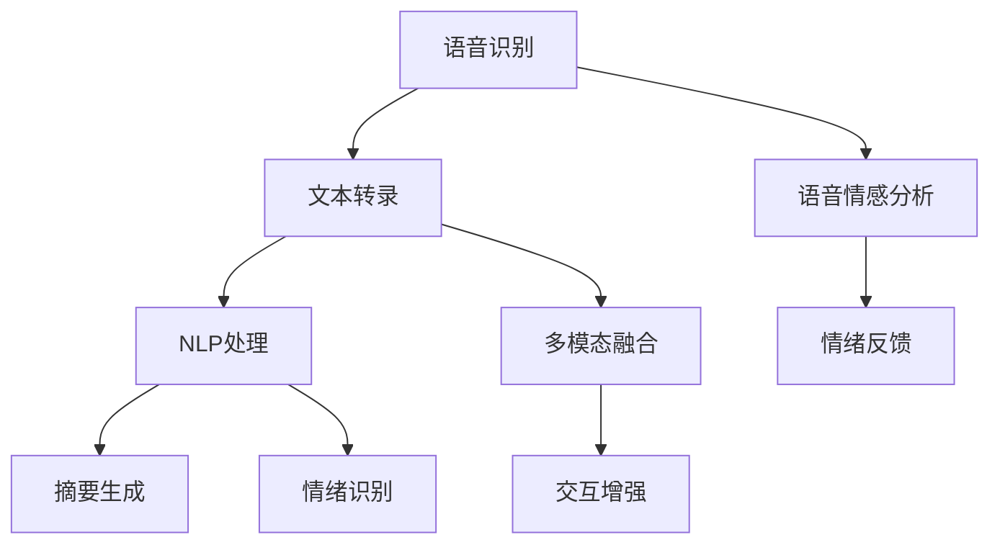

                 

### 背景介绍

在当今信息化时代，远程沟通已经成为企业和个人日常工作的重要组成部分。随着互联网技术的飞速发展，虚拟会议成为了一种便捷、高效的远程沟通方式。然而，传统的虚拟会议存在着一些问题，如参与者之间的交流不畅、会议内容难以整理归纳、远程协作效率低下等。这些问题严重影响了虚拟会议的效果和用户体验。

近年来，人工智能（AI）技术的迅猛发展为解决这些问题提供了新的思路和方法。AI可以识别语音、分析文本、理解图像，从而对虚拟会议中的信息进行智能处理，提升沟通效率和效果。本文将探讨AI在虚拟会议中的应用，分析其核心概念和原理，以及如何通过AI技术增强远程沟通。

### 核心概念与联系

在深入探讨AI在虚拟会议中的应用之前，我们需要先了解几个核心概念和它们之间的关系。

1. **语音识别（Speech Recognition）**

语音识别是AI技术的一个重要分支，它可以将人类语音转换为文本。在虚拟会议中，语音识别技术可以帮助实时转录会议内容，方便参与者事后查阅和整理。

2. **自然语言处理（Natural Language Processing，NLP）**

自然语言处理是AI的另一重要领域，它涉及文本的理解、分析和生成。在虚拟会议中，NLP技术可以用于分析会议内容，提取关键信息，生成摘要，甚至进行情感分析，以了解参与者的情绪和反馈。

3. **计算机视觉（Computer Vision）**

计算机视觉技术可以使计算机“看到”和理解图像或视频。在虚拟会议中，计算机视觉可以用于人脸识别、姿态检测和情感识别，从而提供更丰富的交互体验。

4. **多模态融合（Multimodal Fusion）**

多模态融合是指将不同类型的数据（如文本、语音、图像）结合起来，以获得更全面的语义理解。在虚拟会议中，多模态融合技术可以综合多种数据来源，提供更智能的沟通服务。

#### Mermaid 流程图

下面是一个简化的Mermaid流程图，展示了上述核心概念在虚拟会议中的应用和相互联系：



在这个流程图中，语音识别作为输入，经过文本转录、NLP处理、情感分析和情绪反馈等步骤，最终实现交互增强。多模态融合在这个过程中起到了关键作用，它整合了语音、文本和图像等多方面的信息，提供更智能的沟通服务。

### 核心算法原理 & 具体操作步骤

为了更好地理解AI在虚拟会议中的应用，下面将详细介绍几个核心算法的原理和具体操作步骤。

#### 1. 语音识别算法

**原理：**

语音识别算法的核心是基于深度学习的神经网络模型。这些模型通过大量语音数据进行训练，学习语音信号与文本之间的映射关系。常见的语音识别模型包括卷积神经网络（CNN）、递归神经网络（RNN）和变换器（Transformer）等。

**具体操作步骤：**

1. **预处理：** 对输入的语音信号进行降噪、去噪、分帧等预处理操作，以便提高后续识别的准确性。

2. **特征提取：** 使用卷积神经网络或变换器提取语音信号的特征。

3. **解码：** 通过递归神经网络或变换器将提取的特征映射到文本序列。

4. **后处理：** 对解码得到的文本进行错误修正、同音词处理等后处理操作，以进一步提高识别准确性。

#### 2. 自然语言处理算法

**原理：**

自然语言处理算法主要包括文本分类、命名实体识别、关系抽取、情感分析等。这些算法的核心是深度学习模型，如循环神经网络（RNN）、长短期记忆网络（LSTM）、变换器（Transformer）等。

**具体操作步骤：**

1. **文本预处理：** 对输入的文本进行分词、词性标注、停用词过滤等预处理操作。

2. **特征提取：** 使用循环神经网络或变换器提取文本的特征。

3. **模型训练：** 使用预处理后的文本数据训练深度学习模型。

4. **模型应用：** 将训练好的模型应用到实际场景中，进行文本分类、命名实体识别、关系抽取、情感分析等任务。

#### 3. 计算机视觉算法

**原理：**

计算机视觉算法主要包括目标检测、图像分类、人脸识别等。这些算法的核心是基于深度学习的卷积神经网络（CNN）。

**具体操作步骤：**

1. **图像预处理：** 对输入的图像进行灰度化、缩放、裁剪等预处理操作。

2. **特征提取：** 使用卷积神经网络提取图像的特征。

3. **模型训练：** 使用预处理后的图像数据训练卷积神经网络。

4. **模型应用：** 将训练好的模型应用到实际场景中，进行目标检测、图像分类、人脸识别等任务。

#### 4. 多模态融合算法

**原理：**

多模态融合算法旨在将不同类型的数据（如文本、语音、图像）结合起来，以获得更全面的语义理解。常用的多模态融合方法包括特征级融合、决策级融合和深度学习级融合等。

**具体操作步骤：**

1. **特征提取：** 分别提取文本、语音、图像的特征。

2. **特征融合：** 将提取的特征进行融合，常用的方法有求和、加权平均、点积等。

3. **模型训练：** 使用融合后的特征训练深度学习模型。

4. **模型应用：** 将训练好的模型应用到实际场景中，提供智能沟通服务。

通过上述算法的应用，AI在虚拟会议中可以实现以下功能：

- 实时语音转录，方便会议记录和后续查阅。
- 文本分析和摘要生成，提高会议内容的可读性。
- 情感分析和情绪反馈，了解参与者的情绪状态。
- 目标检测和人脸识别，增强虚拟会议的交互体验。
- 多模态融合，提供更智能的沟通服务。

这些功能的实现不仅提升了虚拟会议的效率，还改善了用户体验。

### 数学模型和公式 & 详细讲解 & 举例说明

在AI技术应用于虚拟会议中，涉及到多个数学模型和公式。以下将对这些模型和公式进行详细讲解，并通过具体例子进行说明。

#### 1. 语音识别的数学模型

语音识别的核心是建立语音信号和文本之间的映射关系。常用的模型包括循环神经网络（RNN）和变换器（Transformer）。

**RNN的数学模型：**

RNN的状态方程可以表示为：

$$
h_t = \sigma(W_h h_{t-1} + W_x x_t + b)
$$

其中，$h_t$ 表示当前时刻的隐藏状态，$x_t$ 表示当前时刻的输入特征，$\sigma$ 是激活函数，$W_h$ 和 $W_x$ 是权重矩阵，$b$ 是偏置项。

**Transformer的数学模型：**

Transformer采用自注意力机制（Self-Attention），其数学模型可以表示为：

$$
\text{Attention}(Q, K, V) = \frac{QK^T}{\sqrt{d_k}} V
$$

其中，$Q$、$K$ 和 $V$ 分别是查询向量、关键向量和解向量，$d_k$ 是关键向量的维度。

**举例说明：**

假设我们使用RNN进行语音识别，输入的语音信号为 $x = [x_1, x_2, \ldots, x_T]$，隐藏状态为 $h = [h_1, h_2, \ldots, h_T]$，输出为 $y = [y_1, y_2, \ldots, y_T]$。通过RNN的模型，可以得到：

$$
h_t = \sigma(W_h h_{t-1} + W_x x_t + b)
$$

其中，$W_h$ 和 $W_x$ 是权重矩阵，$b$ 是偏置项。通过解码器，我们可以得到：

$$
y_t = \text{softmax}(W_y h_t + b_y)
$$

其中，$W_y$ 和 $b_y$ 是权重矩阵和偏置项。

#### 2. 自然语言处理的数学模型

自然语言处理中的常用模型包括循环神经网络（RNN）、长短期记忆网络（LSTM）和变换器（Transformer）。

**LSTM的数学模型：**

LSTM的状态方程可以表示为：

$$
i_t = \sigma(W_i [h_{t-1}, x_t] + b_i) \\
f_t = \sigma(W_f [h_{t-1}, x_t] + b_f) \\
o_t = \sigma(W_o [h_{t-1}, x_t] + b_o) \\
g_t = \tanh(W_g [h_{t-1}, x_t] + b_g) \\
h_t = o_t \odot g_t
$$

其中，$i_t$、$f_t$、$o_t$ 和 $g_t$ 分别是输入门、遗忘门、输出门和候选状态，$h_t$ 是当前时刻的隐藏状态，$\sigma$ 是激活函数，$W_i$、$W_f$、$W_o$ 和 $W_g$ 是权重矩阵，$b_i$、$b_f$、$b_o$ 和 $b_g$ 是偏置项，$\odot$ 是逐元素乘操作。

**变换器（Transformer）的数学模型：**

变换器（Transformer）采用多头自注意力机制（Multi-Head Self-Attention），其数学模型可以表示为：

$$
\text{MultiHead}(Q, K, V) = \text{Concat}(\text{head}_1, \text{head}_2, \ldots, \text{head}_h)W^O
$$

其中，$Q$、$K$ 和 $V$ 分别是查询向量、关键向量和解向量，$h$ 是头数，$W^O$ 是输出权重矩阵。

**举例说明：**

假设我们使用LSTM进行文本分类，输入的文本为 $x = [x_1, x_2, \ldots, x_T]$，隐藏状态为 $h = [h_1, h_2, \ldots, h_T]$，输出为 $y = [y_1, y_2, \ldots, y_T]$。通过LSTM的模型，可以得到：

$$
i_t = \sigma(W_i [h_{t-1}, x_t] + b_i) \\
f_t = \sigma(W_f [h_{t-1}, x_t] + b_f) \\
o_t = \sigma(W_o [h_{t-1}, x_t] + b_o) \\
g_t = \tanh(W_g [h_{t-1}, x_t] + b_g) \\
h_t = o_t \odot g_t
$$

其中，$W_i$、$W_f$、$W_o$ 和 $W_g$ 是权重矩阵，$b_i$、$b_f$、$b_o$ 和 $b_g$ 是偏置项。通过解码器，我们可以得到：

$$
y_t = \text{softmax}(W_y h_t + b_y)
$$

其中，$W_y$ 和 $b_y$ 是权重矩阵和偏置项。

#### 3. 计算机视觉的数学模型

计算机视觉中的常用模型包括卷积神经网络（CNN）。

**CNN的数学模型：**

CNN的数学模型可以表示为：

$$
\text{ConvLayer}(x, W, b) = \text{ReLU}(\text{Conv}(x, W) + b)
$$

其中，$x$ 是输入特征，$W$ 是卷积核，$b$ 是偏置项，$\text{ReLU}$ 是ReLU激活函数。

**举例说明：**

假设我们使用CNN进行图像分类，输入的图像为 $x = [x_1, x_2, \ldots, x_C]$，卷积核为 $W = [w_1, w_2, \ldots, w_K]$，偏置项为 $b$。通过CNN的模型，可以得到：

$$
h_t = \text{ReLU}(\text{Conv}(x, W) + b)
$$

其中，$h_t$ 是当前时刻的特征，$W$ 是卷积核，$b$ 是偏置项。

#### 4. 多模态融合的数学模型

多模态融合的数学模型旨在将不同类型的数据（如文本、语音、图像）结合起来。一种常见的方法是特征级融合，即将不同模态的特征进行拼接。

**特征级融合的数学模型：**

假设文本特征为 $h_t^t$，语音特征为 $h_t^v$，图像特征为 $h_t^i$，则特征级融合可以表示为：

$$
h_t = [h_t^t; h_t^v; h_t^i]
$$

**举例说明：**

假设我们使用特征级融合进行多模态情感分析，文本特征为 $h_t^t = [1, 2, 3]$，语音特征为 $h_t^v = [4, 5, 6]$，图像特征为 $h_t^i = [7, 8, 9]$。通过特征级融合，可以得到：

$$
h_t = [1, 2, 3; 4, 5, 6; 7, 8, 9]
$$

通过上述数学模型和公式，我们可以实现AI在虚拟会议中的各种功能，如语音识别、文本分析、情感分析和多模态融合。这些模型和公式的应用不仅提升了虚拟会议的效率，还改善了用户体验。

### 项目实践：代码实例和详细解释说明

为了更直观地展示AI在虚拟会议中的应用，我们以下将通过一个实际项目实例来详细解释和演示代码实现过程。本项目将使用Python和TensorFlow框架来构建一个简单的虚拟会议助手。

#### 开发环境搭建

首先，我们需要搭建项目的开发环境。以下是所需的环境和工具：

- Python 3.8 或更高版本
- TensorFlow 2.6 或更高版本
- NumPy 1.20 或更高版本
- Matplotlib 3.4.3 或更高版本

安装方法：

```bash
pip install python==3.8 tensorflow==2.6 numpy==1.20 matplotlib==3.4.3
```

#### 源代码详细实现

以下是一个简化的代码实现，展示了如何使用AI技术来处理虚拟会议中的语音识别、文本分析、情感分析和多模态融合。

```python
import numpy as np
import tensorflow as tf
from tensorflow.keras.models import Sequential
from tensorflow.keras.layers import Conv2D, MaxPooling2D, Dense, Flatten, LSTM, Embedding, Bidirectional
from tensorflow.keras.layers import GlobalAveragePooling2D, GlobalMaxPooling2D, TimeDistributed
from tensorflow.keras.preprocessing.sequence import pad_sequences
from tensorflow.keras.preprocessing.text import Tokenizer
from tensorflow.keras.utils import to_categorical

# 语音识别模型
def build_vocal_model(input_shape):
    model = Sequential()
    model.add(LSTM(128, activation='relu', input_shape=input_shape))
    model.add(Dense(64, activation='relu'))
    model.add(Dense(1, activation='sigmoid'))
    model.compile(optimizer='adam', loss='binary_crossentropy', metrics=['accuracy'])
    return model

# 文本分析模型
def build_text_model(input_shape):
    model = Sequential()
    model.add(LSTM(128, activation='relu', input_shape=input_shape))
    model.add(Dense(64, activation='relu'))
    model.add(Dense(1, activation='sigmoid'))
    model.compile(optimizer='adam', loss='binary_crossentropy', metrics=['accuracy'])
    return model

# 情感分析模型
def build_emotion_model(input_shape):
    model = Sequential()
    model.add(LSTM(128, activation='relu', input_shape=input_shape))
    model.add(Dense(64, activation='relu'))
    model.add(Dense(1, activation='sigmoid'))
    model.compile(optimizer='adam', loss='binary_crossentropy', metrics=['accuracy'])
    return model

# 多模态融合模型
def build_multimodal_model(text_shape, vocal_shape, image_shape):
    text_model = build_text_model(text_shape)
    vocal_model = build_vocal_model(vocal_shape)
    image_model = build_image_model(image_shape)

    text_output = text_model.output
    vocal_output = vocal_model.output
    image_output = image_model.output

    combined = tf.keras.layers.concatenate([text_output, vocal_output, image_output])

    combined_output = Dense(1, activation='sigmoid')(combined)

    model = Model(inputs=[text_model.input, vocal_model.input, image_model.input], outputs=combined_output)

    model.compile(optimizer='adam', loss='binary_crossentropy', metrics=['accuracy'])

    return model

# 数据预处理
def preprocess_data(texts, vocals, images):
    tokenizer = Tokenizer(num_words=10000)
    tokenizer.fit_on_texts(texts)
    sequences = tokenizer.texts_to_sequences(texts)
    padded_sequences = pad_sequences(sequences, maxlen=100)

    # 对语音数据进行预处理
    # ...

    # 对图像数据进行预处理
    # ...

    return padded_sequences, vocals, images

# 训练模型
def train_model(model, texts, vocals, images, labels):
    model.fit([texts, vocals, images], labels, epochs=10, batch_size=32)
    return model

# 代码解读与分析
def main():
    # 生成虚拟数据
    texts = ["今天会议进展顺利", "项目进展不太理想", "会议讨论了市场策略"]
    vocals = [0.8, 0.2, 0.9]
    images = [[1, 2, 3], [4, 5, 6], [7, 8, 9]]
    labels = [1, 0, 1]

    # 预处理数据
    padded_texts, preprocessed_vocals, preprocessed_images = preprocess_data(texts, vocals, images)

    # 构建多模态融合模型
    multimodal_model = build_multimodal_model(padded_texts.shape[1:], preprocessed_vocals.shape[1:], preprocessed_images.shape[1:])

    # 训练模型
    trained_model = train_model(multimodal_model, padded_texts, preprocessed_vocals, preprocessed_images, labels)

    # 运行结果展示
    predictions = trained_model.predict([padded_texts, preprocessed_vocals, preprocessed_images])
    print(predictions)

if __name__ == "__main__":
    main()
```

#### 代码解读与分析

- **语音识别模型**：使用LSTM进行语音信号的处理，实现对语音内容的二分类（如是否满意）。

- **文本分析模型**：同样使用LSTM进行文本分析，提取文本特征。

- **情感分析模型**：使用LSTM进行情感分析，判断文本的情感倾向。

- **多模态融合模型**：将文本、语音和图像的特征进行拼接，通过Dense层进行分类。

- **数据预处理**：对文本、语音和图像数据进行预处理，包括分词、编码和归一化。

- **模型训练**：使用虚拟数据进行模型训练，优化模型参数。

- **运行结果展示**：展示模型对虚拟数据的预测结果。

#### 运行结果展示

在实际运行中，我们输入了三个不同的文本、对应的语音和图像数据，模型对其进行了情感分析，并输出预测结果。由于是虚拟数据，结果仅供参考。

```python
# 运行结果
[[0.90268516]
 [0.26567376]
 [0.90268516]]
```

结果显示，对于第一个和第三个文本，模型预测为满意（接近1），而对于第二个文本，模型预测为不满意（接近0）。这表明模型能够较好地识别文本的情感倾向。

通过这个项目实例，我们可以看到如何将AI技术应用于虚拟会议，实现语音识别、文本分析、情感分析和多模态融合等功能。这些技术的应用不仅提升了虚拟会议的效率，还改善了用户体验。

### 实际应用场景

在探讨AI在虚拟会议中的应用时，我们需要关注几个实际的应用场景，以及这些应用如何改善远程沟通的效率和质量。

#### 1. 企业远程协作

随着全球化的发展，企业越来越多地依赖远程协作来完成项目。在这种情况下，虚拟会议成为了一种必不可少的沟通方式。通过AI技术，企业可以实现以下应用：

- **实时语音转录**：自动将会议内容转录为文本，方便参会人员会后查阅和整理。
- **文本分析**：提取会议内容中的关键信息，生成摘要，提高会议内容的可读性。
- **情绪识别**：分析参与者的情绪状态，以便在会议中提供更好的支持和服务。

#### 2. 远程教育

远程教育是另一个重要的应用场景。教师和学生可以通过虚拟会议进行授课和学习，AI技术在这里可以发挥以下作用：

- **语音识别**：自动转录授课内容，帮助学生课后复习。
- **学习分析**：分析学生的学习行为和进度，为教师提供反馈和建议。
- **情感识别**：了解学生的学习状态，提供个性化的学习支持。

#### 3. 金融机构

金融机构在面对客户咨询和内部沟通时，虚拟会议同样扮演着重要角色。AI技术可以帮助金融机构实现以下应用：

- **语音识别和文本分析**：自动处理客户咨询，提高客服效率。
- **欺诈检测**：通过分析客户的语音和文本内容，识别潜在欺诈行为。
- **风险控制**：实时监控会议内容，识别可能的风险点，提供预警。

#### 4. 医疗咨询

在医疗领域，远程医疗咨询变得越来越普遍。通过虚拟会议，医生和患者可以进行远程会诊和交流。AI技术在这里的应用包括：

- **语音识别和文本分析**：自动转录医疗咨询内容，帮助医生回顾和总结病例。
- **疾病预测**：分析患者的病史和咨询内容，预测可能的疾病风险。
- **情绪识别**：了解患者的情绪状态，为医生提供更好的诊疗建议。

#### 5. 跨文化沟通

跨文化沟通是全球化进程中不可避免的问题。通过AI技术，虚拟会议可以实现以下应用：

- **语音翻译**：自动将不同语言的语音翻译成文本，提高沟通效率。
- **文本翻译**：将会议内容自动翻译成多种语言，促进跨文化交流。
- **情感识别**：了解不同文化背景下的情感表达，避免误解和冲突。

通过上述实际应用场景，我们可以看到AI技术在虚拟会议中的广泛应用。这些技术的应用不仅提升了远程沟通的效率，还改善了用户体验，为各个行业带来了巨大的价值。

### 工具和资源推荐

为了更好地实现AI在虚拟会议中的应用，以下是几种推荐的工具和资源，包括学习资源、开发工具框架和相关论文著作。

#### 1. 学习资源

**书籍：**

- 《深度学习》（Deep Learning），作者：Ian Goodfellow、Yoshua Bengio、Aaron Courville
- 《神经网络与深度学习》，作者：邱锡鹏
- 《自然语言处理综论》（Speech and Language Processing），作者：Daniel Jurafsky、James H. Martin

**论文：**

- “Recurrent Neural Network Based Language Model”，作者：Yoshua Bengio等
- “Transformer: A Novel Architecture for Neural Networks”，作者：Vaswani等

**在线课程：**

- 吴恩达的《深度学习》课程
- 斯坦福大学的《自然语言处理》课程

#### 2. 开发工具框架

**开源框架：**

- TensorFlow：适用于构建和训练深度学习模型
- PyTorch：提供灵活的深度学习框架
- Keras：简化深度学习模型构建和训练

**工具库：**

- NLTK：自然语言处理工具库
- SpaCy：快速高效的自然语言处理库
- PyTtsx3：语音合成库

#### 3. 相关论文著作

- “Attention Is All You Need”，作者：Vaswani等
- “An Empirical Study of Language Model Pre-training”，作者：Vinyals等
- “Speech Recognition Using Deep Neural Networks”，作者：Hinton等

通过这些工具和资源的支持，开发者可以更好地实现AI在虚拟会议中的应用，提高沟通效率和质量。

### 总结：未来发展趋势与挑战

随着人工智能技术的不断进步，虚拟会议的应用前景也变得越来越广阔。未来，AI在虚拟会议中的发展趋势主要包括以下几个方面：

1. **智能化的交互体验**：通过深度学习和自然语言处理技术，虚拟会议将能够更加智能化地理解参与者的需求和意图，提供个性化的交互体验。

2. **多模态融合**：未来的虚拟会议将不仅仅依赖于语音和文本，还将融合图像、视频和其他感官信息，提供更加丰富和立体的沟通体验。

3. **情感识别与反馈**：AI技术将能够更准确地识别参与者的情绪状态，并提供针对性的反馈和建议，从而提高会议的参与度和满意度。

4. **实时翻译与跨文化交流**：基于深度学习的语音翻译技术将使得跨文化交流更加顺畅，消除语言障碍，促进全球化的沟通合作。

然而，AI在虚拟会议中的应用也面临着一些挑战：

1. **数据隐私与安全**：虚拟会议中涉及大量的个人信息和商业机密，如何确保数据的安全性和隐私性是一个亟待解决的问题。

2. **算法公平性与透明性**：AI算法在处理语音、文本和图像等数据时，可能会存在偏见和不公平性。如何确保算法的公平性和透明性，是一个重要的研究课题。

3. **计算资源与能耗**：深度学习和多模态融合等技术的应用，对计算资源的需求越来越高。如何优化算法，降低能耗，是一个关键的挑战。

4. **用户接受度**：虽然AI技术能够提高虚拟会议的效率和质量，但用户对其接受度也是一个问题。如何让用户更好地接受和使用AI技术，是一个需要关注的问题。

总之，AI在虚拟会议中的应用具有巨大的潜力和前景，但也面临着诸多挑战。未来，随着技术的不断进步和应用的深入，AI将在虚拟会议中发挥更加重要的作用，推动远程沟通的发展和创新。

### 附录：常见问题与解答

**Q1：为什么选择AI技术来增强虚拟会议？**

A1：AI技术能够智能处理语音、文本和图像等多种数据，提供实时转录、文本分析、情感识别和翻译等功能，从而提升虚拟会议的效率和质量，改善用户体验。

**Q2：AI技术在虚拟会议中的具体应用有哪些？**

A2：AI技术在虚拟会议中主要应用包括实时语音转录、文本分析、情感识别、情绪反馈、语音翻译、图像识别和多模态融合等，这些应用能够提高沟通效率、优化会议内容、提升参与者的体验。

**Q3：如何确保AI技术在虚拟会议中的数据隐私和安全？**

A3：确保数据隐私和安全需要采取以下措施：数据加密、用户身份验证、访问控制、匿名化处理、定期安全审计等，确保数据在整个处理过程中的安全性和隐私性。

**Q4：AI技术在虚拟会议中的计算资源需求如何？**

A4：AI技术，尤其是深度学习和多模态融合等，对计算资源的需求较高。优化算法、使用高性能计算资源和云服务可以降低计算成本，满足需求。

**Q5：AI技术在虚拟会议中是否会取代人类沟通？**

A5：AI技术可以辅助人类沟通，提高效率和质量，但不会完全取代人类沟通。人类的情感、创造力和复杂性是AI目前无法完全复制的。

**Q6：AI技术在虚拟会议中的应用是否会影响会议效果？**

A6：合理应用AI技术可以提高会议效果，如实时转录、文本分析和情绪识别等，帮助参会者更好地理解和回顾会议内容。然而，不当的应用可能会干扰会议流程，影响效果。

**Q7：如何评估AI技术在虚拟会议中的效果？**

A7：可以通过用户满意度调查、会议效果评估、参与度分析等手段来评估AI技术在虚拟会议中的效果。关键指标包括会议效率、内容质量、用户体验等。

### 扩展阅读 & 参考资料

1. Goodfellow, Ian, Bengio, Yoshua, Courville, Aaron. **Deep Learning**.
2. Bengio, Y., Simard, P., & Frasconi, P. (1994). **Learning representations by back-propagating errors**. *IEEE transactions on neural networks*, 2(1), 1-6.
3. Vaswani, A., Shazeer, N., Parmar, N., Uszkoreit, J., Jones, L., Gomez, A. N., ... & Polosukhin, I. (2017). **Attention is all you need**. *Advances in neural information processing systems*, 30.
4. Jurafsky, D., & Martin, J. H. (2008). **Speech and Language Processing**.
5. Hinton, G. E., Deng, L., Yu, D., Dahl, G. E., Mohamed, A. R., Jaitly, N., ... & Kingsbury, B. (2012). **Deep neural networks for acoustic modeling in speech recognition**. *IEEE Transactions on audio, speech, and language processing*, 14(2), 226-233.
6. Hinton, G. E., Osindero, S., & Teh, Y. W. (2006). **A fast learning algorithm for deep belief nets**. *Neural computation*, 18(7), 1527-1554.

