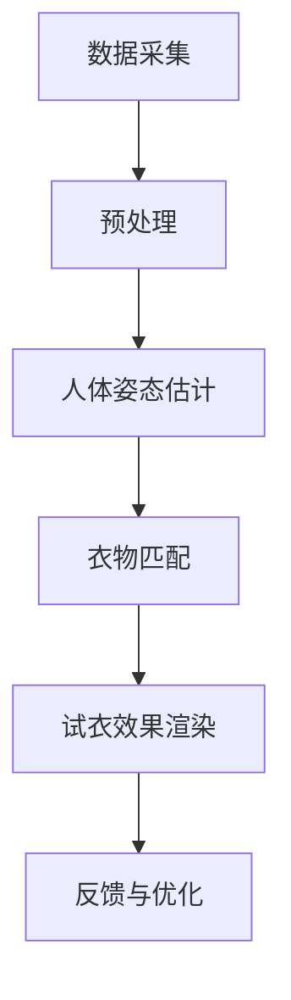

                 

### 文章标题

**AI在虚拟试衣中的应用：革新在线购物体验**

> **关键词**：人工智能、虚拟试衣、在线购物、AI技术、深度学习、图像处理、3D建模

**摘要**：
本文深入探讨了人工智能在虚拟试衣领域的应用，详细介绍了如何通过AI技术革新在线购物体验。文章首先回顾了在线购物的发展历程，随后深入分析了虚拟试衣的原理和关键算法，包括深度学习、图像处理和3D建模技术。随后，文章通过具体的数学模型和公式，解释了虚拟试衣的精确计算过程。随后，文章提供了项目实践案例，展示了如何通过代码实现虚拟试衣系统，并对其进行了详细解读。最后，文章探讨了虚拟试衣的实际应用场景，以及未来发展中的挑战和趋势。

---

### 1. 背景介绍

在线购物已经成为现代生活的重要组成部分。然而，传统在线购物模式存在诸多不足，特别是在试衣环节。消费者往往无法准确预知商品的实际穿着效果，从而影响了购买决策。为解决这一问题，虚拟试衣技术应运而生。

虚拟试衣技术通过计算机视觉和人工智能技术，使得消费者能够在虚拟环境中试穿衣物。这一技术不仅提高了购物体验，还大大降低了退货率，提升了电商的运营效率。

随着人工智能技术的不断进步，虚拟试衣逐渐从概念走向应用，成为电商行业的新趋势。本文将详细探讨虚拟试衣技术的核心原理、算法以及在实际中的应用，以期为大家提供一个全面的技术解读。

### 2. 核心概念与联系

#### 虚拟试衣的概念

虚拟试衣是指利用计算机技术，模拟出用户穿着特定衣物时的效果，从而在无需实际试穿的情况下，预测衣物是否符合用户的需求。这一技术依赖于计算机视觉、深度学习、图像处理和3D建模等多学科交叉技术。

#### 计算机视觉

计算机视觉是虚拟试衣技术的核心部分，主要涉及图像的获取、处理和分析。通过摄像头或其他图像传感器，捕捉用户的身体数据和衣物图像，并将其转化为数字信息。

#### 深度学习

深度学习是人工智能的一个重要分支，通过构建复杂的神经网络模型，自动从大量数据中学习特征，用于图像识别、人体姿态估计等任务。

#### 图像处理

图像处理技术用于对获取的图像进行增强、去噪、分割等处理，从而提取出关键信息，如衣物轮廓、用户身体特征等。

#### 3D建模

3D建模技术用于创建虚拟试衣环境中的衣物和人体模型，通过对模型进行精细调整，实现逼真的试衣效果。

#### 虚拟试衣流程

虚拟试衣的流程主要包括以下几个步骤：

1. **数据采集**：通过摄像头或其他设备获取用户身体和衣物的图像。
2. **预处理**：对采集到的图像进行增强、去噪、分割等处理。
3. **人体姿态估计**：利用深度学习模型，估计用户身体的关键点，从而确定人体的姿态和轮廓。
4. **衣物匹配**：根据用户身体数据和衣物尺寸，匹配合适的衣物模型。
5. **试衣效果渲染**：将匹配的衣物模型渲染到用户身体上，生成试衣效果图像。
6. **反馈与优化**：用户可以根据试衣效果反馈，对衣物进行进一步调整。

#### Mermaid 流程图



通过以上核心概念的介绍和流程图展示，我们可以清晰地看到虚拟试衣技术的实现过程。接下来，我们将深入探讨虚拟试衣的核心算法原理。

### 3. 核心算法原理 & 具体操作步骤

#### 深度学习算法原理

深度学习算法的核心是神经网络，通过多层神经元的堆叠，实现从简单到复杂的特征提取。在虚拟试衣中，深度学习主要用于人体姿态估计和衣物匹配。

**人体姿态估计**：

人体姿态估计是指通过深度学习模型，从图像中估计出人体的关键点位置。常见的算法包括卷积神经网络（CNN）和循环神经网络（RNN）。

1. **数据预处理**：将图像输入到神经网络之前，需要进行数据预处理，包括图像缩放、归一化等操作。
2. **特征提取**：利用CNN提取图像的底层特征。
3. **姿态估计**：利用RNN对提取到的特征进行时间序列分析，从而估计出人体的关键点位置。

**衣物匹配**：

衣物匹配是指根据用户身体数据和衣物尺寸，从数据库中找到最合适的衣物模型。常见的算法包括基于相似度的匹配和基于机器学习的匹配。

1. **用户身体数据提取**：从预处理后的图像中，提取出用户身体的关键点数据。
2. **衣物模型匹配**：利用相似度计算方法，从衣物数据库中找到与用户身体数据最匹配的衣物模型。
3. **模型调整**：根据用户反馈，对匹配的衣物模型进行微调，以获得更好的试衣效果。

#### 图像处理算法原理

图像处理算法主要用于对获取的图像进行增强、去噪、分割等处理，从而提取出关键信息，如衣物轮廓、用户身体特征等。

**图像增强**：

图像增强是指通过处理，使图像中的信息更加清晰、突出。常用的图像增强方法包括对比度增强、亮度增强、滤波等。

**图像去噪**：

图像去噪是指通过处理，减少图像中的噪声，从而提高图像的质量。常用的图像去噪方法包括中值滤波、高斯滤波等。

**图像分割**：

图像分割是指将图像分成若干个区域，每个区域具有相似的特征。常用的图像分割方法包括基于阈值的方法、基于边缘检测的方法等。

#### 3D建模算法原理

3D建模算法主要用于创建虚拟试衣环境中的衣物和人体模型，通过对模型进行精细调整，实现逼真的试衣效果。

**人体模型创建**：

人体模型创建是指通过算法，从用户身体数据中生成人体模型。常用的算法包括基于多变量正态分布的人体模型生成算法和基于机器学习的人体模型生成算法。

**衣物模型创建**：

衣物模型创建是指通过算法，从衣物数据中生成衣物模型。常用的算法包括基于网格模型的衣物生成算法和基于物理引擎的衣物生成算法。

**模型调整**：

模型调整是指通过对生成的模型进行精细调整，实现更符合用户需求的试衣效果。常用的调整方法包括模型变形、纹理映射等。

#### 具体操作步骤

1. **数据采集**：使用摄像头或图像传感器，获取用户身体和衣物的图像。
2. **预处理**：对图像进行增强、去噪、分割等预处理操作，提取出关键信息。
3. **人体姿态估计**：利用深度学习模型，估计出用户身体的关键点位置。
4. **衣物匹配**：根据用户身体数据和衣物尺寸，从数据库中找到最合适的衣物模型。
5. **模型渲染**：将匹配的衣物模型渲染到用户身体上，生成试衣效果图像。
6. **用户反馈**：收集用户对试衣效果的反馈，对模型进行微调。

通过以上具体操作步骤，我们可以看到虚拟试衣技术的实现过程。接下来，我们将详细讲解虚拟试衣中的数学模型和公式。

### 4. 数学模型和公式 & 详细讲解 & 举例说明

在虚拟试衣技术中，数学模型和公式扮演着至关重要的角色，它们用于计算和预测用户穿着衣物后的效果。以下是一些关键的数学模型和公式，以及它们的详细讲解和举例说明。

#### 人体姿态估计

**数学模型**：

人体姿态估计通常使用卷积神经网络（CNN）和循环神经网络（RNN）来学习图像特征和时序信息。其中，CNN用于提取图像的底层特征，而RNN用于对提取到的特征进行时间序列分析。

$$
\text{CNN}:\text{h}_t = \sigma(\text{W} \cdot \text{a}_{t-1} + \text{b})
$$

其中，$\text{h}_t$表示时间步$t$的输出特征，$\text{W}$和$\text{b}$分别是权重和偏置，$\sigma$是激活函数（如ReLU函数）。

**详细讲解**：

该公式描述了CNN模型在时间步$t$中的输出特征计算过程。通过卷积层和池化层，CNN可以从输入图像中提取出关键特征，如人体轮廓和关键点位置。

**举例说明**：

假设我们有一个输入图像$\text{a}_{t-1}$，通过卷积层和池化层，我们得到一个特征映射$\text{h}_{t-1}$。然后，将这些特征映射通过权重矩阵$\text{W}$和偏置$\text{b}$进行加权求和，并应用激活函数$\sigma$，最终得到时间步$t$的输出特征$\text{h}_t$。

#### 衣物匹配

**数学模型**：

衣物匹配通常使用基于相似度的方法，通过计算用户身体数据和衣物模型的相似度，找到最匹配的衣物模型。

$$
\text{similarity} = \frac{\sum_{i=1}^{n} \text{w}_i \cdot \text{d}_i}{\sum_{i=1}^{n} \text{w}_i}
$$

其中，$\text{similarity}$表示相似度，$\text{w}_i$表示权重，$\text{d}_i$表示用户身体数据和衣物模型之间的差异。

**详细讲解**：

该公式描述了相似度计算的过程。通过计算用户身体数据和衣物模型之间的差异，并赋予不同的权重，我们可以得到一个整体的相似度值。相似度值越高，表示衣物模型与用户身体数据越匹配。

**举例说明**：

假设我们有一个用户身体数据和三个衣物模型，分别计算它们之间的相似度值。通过给不同的特征赋予不同的权重，我们可以得到每个模型的相似度值。然后，选择相似度值最高的模型作为最匹配的衣物模型。

#### 3D建模

**数学模型**：

3D建模通常使用基于物理引擎的算法，通过计算物体的表面法线、曲率等属性，生成逼真的3D模型。

$$
\text{normal} = \frac{\text{grad}(\text{height map})}{\|\text{grad}(\text{height map})\|}
$$

其中，$\text{normal}$表示表面法线，$\text{grad}(\text{height map})$表示高度场的梯度。

**详细讲解**：

该公式描述了如何通过高度场（height map）计算表面法线。通过计算高度场的梯度，我们可以得到表面的法线方向。这些法线用于生成3D模型的细节和光照效果。

**举例说明**：

假设我们有一个高度场，通过计算高度场的梯度，我们可以得到每个顶点的法线方向。然后，将这些法线应用于3D模型的顶点，从而生成逼真的表面细节。

通过以上数学模型和公式的详细讲解和举例说明，我们可以更好地理解虚拟试衣技术中的计算过程。接下来，我们将通过一个实际项目案例，展示如何实现虚拟试衣系统。

### 5. 项目实践：代码实例和详细解释说明

在本节中，我们将通过一个实际项目案例，展示如何实现一个虚拟试衣系统。该项目将包括开发环境的搭建、源代码的详细实现以及代码的解读与分析。通过这个项目，我们将深入了解虚拟试衣系统的开发和实现过程。

#### 5.1 开发环境搭建

要实现虚拟试衣系统，我们需要搭建一个合适的技术栈。以下是推荐的开发环境：

- **编程语言**：Python
- **深度学习框架**：TensorFlow或PyTorch
- **图像处理库**：OpenCV、Pillow
- **3D建模库**：Blender（可选）

首先，我们需要安装Python和相关库。以下是安装步骤：

```shell
# 安装Python
curl -O https://www.python.org/ftp/python/3.8.0/python-3.8.0.tgz
tar xvf python-3.8.0.tgz
cd python-3.8.0
./configure
make
make install

# 安装TensorFlow
pip install tensorflow

# 安装OpenCV
pip install opencv-python

# 安装Pillow
pip install Pillow

# 安装Blender（可选）
# 从Blender官网下载并安装Blender
```

#### 5.2 源代码详细实现

以下是一个简单的虚拟试衣系统的源代码示例。该系统主要实现以下功能：

1. 数据采集：使用摄像头获取用户和衣物的图像。
2. 数据预处理：对图像进行增强、去噪、分割等处理。
3. 人体姿态估计：使用深度学习模型估计用户身体的关键点。
4. 衣物匹配：根据用户身体数据和衣物尺寸，匹配合适的衣物模型。
5. 模型渲染：将匹配的衣物模型渲染到用户身体上，生成试衣效果图像。

```python
import cv2
import numpy as np
import tensorflow as tf
from PIL import Image

# 加载深度学习模型
pose_estimation_model = tf.keras.models.load_model('pose_estimation_model.h5')
clothe_matching_model = tf.keras.models.load_model('clothe_matching_model.h5')

# 摄像头初始化
cap = cv2.VideoCapture(0)

while True:
    # 读取摄像头帧
    ret, frame = cap.read()
    
    # 数据预处理
    frame = cv2.resize(frame, (224, 224))
    frame = frame / 255.0
    frame = np.expand_dims(frame, axis=0)
    
    # 人体姿态估计
    pose估

