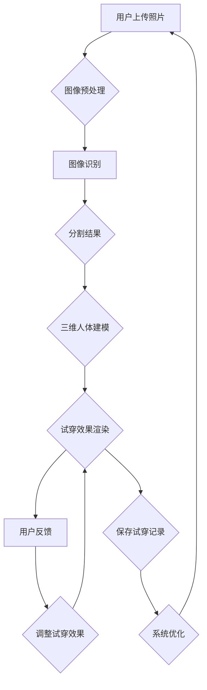

                 

### 1. 背景介绍

#### 1.1 虚拟试衣技术的起源与发展

虚拟试衣技术，顾名思义，是一种通过计算机技术实现的，允许用户在购买服装前模拟试穿过程的创新技术。它的起源可以追溯到20世纪90年代，当时计算机图形学和虚拟现实技术的初步发展使得虚拟试衣的概念开始萌芽。

最初的虚拟试衣系统主要是基于二维图像的模拟，用户可以通过上传自己的照片或者选择标准模特的形象，然后在计算机上模拟出试穿效果。这种方法的局限性在于，它只能提供非常简单的试穿体验，并且效果往往不够真实。

随着计算机处理能力的提升和图像处理技术的进步，虚拟试衣技术逐渐走向三维空间。三维虚拟试衣系统的出现，使得用户可以在线上试穿真实感更强的三维服装模型。三维扫描技术的应用，更是为虚拟试衣带来了革命性的变革。通过三维扫描，用户可以快速获得自己的三维身体数据，这些数据被用于生成个性化的三维虚拟形象，从而实现更真实的试穿效果。

近年来，人工智能（AI）技术的飞速发展，为虚拟试衣技术注入了新的活力。基于深度学习的图像识别和生成技术，使得虚拟试衣系统可以更加准确地捕捉用户的面部表情和身体特征，从而实现更加自然和真实的试穿体验。同时，AI技术还能够根据用户的行为和偏好，提供个性化的推荐和服务。

#### 1.2 在线购物的挑战与机遇

随着互联网的普及和电子商务的快速发展，在线购物已经成为消费者购买商品的主要方式之一。然而，在线购物也面临着一些挑战，其中之一就是试穿问题。传统的在线购物模式中，消费者无法直接试穿商品，这往往导致购买决策的延迟和退货率的上升。

虚拟试衣技术的出现，为解决这一难题提供了新的可能性。通过虚拟试衣，消费者可以在购买前真实地感受到服装的款式、尺码和质感，从而提高购买决策的准确性和满意度。这对于电商企业来说，不仅降低了退货率，也提升了用户的购物体验和忠诚度。

此外，虚拟试衣技术还带来了新的市场机遇。随着消费者对个性化服务和体验的需求不断增加，能够提供高质量虚拟试衣服务的电商平台将具有更强的竞争力。对于那些拥有丰富服装库存的电商平台，虚拟试衣技术可以显著提升商品的展示效果，吸引更多消费者。

#### 1.3 AI技术在虚拟试衣中的关键作用

AI技术在虚拟试衣中的应用，极大地提升了系统的准确性和用户体验。以下是一些AI技术在虚拟试衣中的关键作用：

1. **图像识别与处理**：通过深度学习技术，AI系统可以准确地识别和分割图像中的服装和人体部位。这种技术的应用，使得虚拟试衣系统能够更加精确地模拟用户的试穿效果。

2. **三维人体建模**：AI技术可以基于用户的身体数据，生成高度逼真的三维人体模型。这些模型不仅能够反映用户的身体特征，还可以根据用户的姿态变化动态调整服装的形态。

3. **个性化推荐**：基于用户的购物历史和行为数据，AI系统可以提供个性化的服装推荐。这不仅提高了用户的购物满意度，也增加了电商平台的销售额。

4. **智能客服**：AI技术还可以用于智能客服系统，通过自然语言处理技术，AI客服能够实时解答用户的疑问，提供更加个性化的服务。

总之，AI技术在虚拟试衣中的应用，不仅提升了系统的准确性和用户体验，也为电商平台带来了新的商业机会。

### 2. 核心概念与联系

#### 2.1 虚拟试衣技术的核心组成部分

虚拟试衣技术涉及多个核心组成部分，包括图像识别、三维建模、人工智能算法和用户交互界面。以下是对这些组成部分的详细解释：

1. **图像识别**：图像识别技术是虚拟试衣系统的核心之一。它通过深度学习算法，可以准确识别和分割图像中的服装和人体部位。这一步骤至关重要，因为它决定了虚拟试衣系统是否能够准确模拟用户的试穿效果。

2. **三维建模**：三维建模技术用于生成用户的三维人体模型。通过收集用户身体数据，AI算法可以创建一个高度逼真的三维模型。这个模型不仅可以反映用户的身体特征，还可以根据用户的姿态变化动态调整服装的形态。

3. **人工智能算法**：人工智能算法在虚拟试衣中扮演着关键角色。深度学习算法被用来优化图像识别和三维建模的精度。同时，AI算法还可以用于用户行为分析和个性化推荐，以提高用户的购物体验。

4. **用户交互界面**：用户交互界面是虚拟试衣系统与用户之间的桥梁。一个直观易用的界面可以显著提升用户的体验。用户可以通过上传照片、选择服装和调整试穿效果，与系统进行互动。

#### 2.2 虚拟试衣系统的架构

为了更好地理解虚拟试衣系统的运作，下面我们使用Mermaid流程图来展示系统的整体架构：



**图1：虚拟试衣系统的架构流程图**

**详细解释：**

- **图像预处理**：用户上传的照片需要进行预处理，以消除光照变化和角度偏差，确保图像质量。
- **图像识别**：预处理后的图像被输入到深度学习模型中，用于识别服装和人体部位。
- **分割结果**：识别结果会被分割成不同的图层，每个图层对应图像中的一个特定部分，如头部、身体、手臂等。
- **三维人体建模**：基于分割结果，AI算法会生成用户的三维人体模型。
- **试穿效果渲染**：三维人体模型与选定的服装模型结合，通过渲染技术生成试穿效果。
- **用户反馈**：用户可以查看试穿效果，并提供反馈，如喜欢或不喜欢某些部位。
- **调整试穿效果**：根据用户反馈，系统会调整试穿效果，以更好地满足用户需求。
- **保存试穿记录**：用户试穿记录会被保存，用于后续分析和个性化推荐。
- **系统优化**：根据用户反馈和试穿记录，系统会不断优化，以提高试穿效果和用户满意度。

通过这个流程，我们可以看到虚拟试衣系统如何通过多个组件的协同工作，实现高效的虚拟试穿体验。

### 3. 核心算法原理 & 具体操作步骤

#### 3.1 图像识别算法原理

图像识别是虚拟试衣系统的核心步骤之一，它负责从用户上传的照片中准确识别出服装和人体部位。目前，深度学习算法在图像识别中得到了广泛应用，其中卷积神经网络（CNN）是最常用的模型之一。

**原理：** CNN由多个卷积层、池化层和全连接层组成。卷积层用于提取图像特征，池化层用于降低特征图的维度，全连接层用于分类。通过多层的卷积和池化操作，CNN能够从原始图像中提取出高层次的抽象特征，从而实现对服装和人体部位的高精度识别。

**具体操作步骤：**

1. **数据预处理**：首先对输入图像进行预处理，包括缩放、灰度转换、归一化等操作。这些操作有助于提高图像识别的准确性。
2. **卷积操作**：将预处理后的图像输入到CNN模型，通过卷积层提取图像特征。卷积层的参数（如卷积核大小、步长等）需要通过训练得到。
3. **池化操作**：对卷积层输出的特征图进行池化操作，以降低特征图的维度，减少计算量。
4. **全连接层**：将池化后的特征图输入到全连接层，进行分类。全连接层的参数也需要通过训练得到。

#### 3.2 三维人体建模算法原理

三维人体建模是虚拟试衣系统的另一个关键步骤，它负责生成用户的三维人体模型。目前，基于深度学习的三维人体建模技术得到了广泛应用，其中最为著名的是3D人体姿态估计和3D人体重建技术。

**原理：** 3D人体姿态估计通过识别图像中的人体关键点，生成人体姿态的三维坐标。3D人体重建则基于这些关键点，利用几何和物理模型重建出人体三维模型。深度学习技术在3D人体姿态估计和重建中发挥了重要作用，特别是基于卷积神经网络和生成对抗网络（GAN）的模型。

**具体操作步骤：**

1. **关键点检测**：首先通过深度学习模型检测图像中的人体关键点，如肩部、臀部、膝盖等。这些关键点用于确定人体姿态。
2. **姿态估计**：利用关键点坐标，通过几何算法估计人体三维姿态。常见的姿态估计方法包括迭代最近点（ICP）算法和概率模型估计方法。
3. **人体重建**：基于关键点和姿态信息，利用几何和物理模型重建出三维人体模型。重建过程中，需要考虑人体表面的光滑性和结构，以生成逼真的三维模型。

#### 3.3 深度学习算法在虚拟试衣中的应用

深度学习算法在虚拟试衣中得到了广泛应用，以下是一些关键应用：

1. **图像识别**：通过深度学习模型，准确识别用户上传的图像中的服装和人体部位。
2. **三维人体建模**：利用深度学习算法，生成用户的三维人体模型，实现逼真的虚拟试穿效果。
3. **个性化推荐**：基于用户的购物历史和行为数据，利用深度学习模型提供个性化的服装推荐。
4. **智能客服**：通过自然语言处理技术，实现智能客服系统，为用户提供实时、个性化的服务。

通过这些深度学习算法的应用，虚拟试衣系统不仅能够提高试穿效果的准确性，还能为用户提供更加个性化的购物体验。

### 4. 数学模型和公式 & 详细讲解 & 举例说明

#### 4.1 图像识别算法的数学模型

在图像识别算法中，卷积神经网络（CNN）是最常用的模型之一。下面，我们介绍CNN中的关键数学模型和公式。

**1. 卷积操作**

卷积操作是CNN的核心步骤，用于提取图像特征。卷积操作的数学公式如下：

\[ (f * g)(x, y) = \sum_{i=-k/2}^{k/2} \sum_{j=-k/2}^{k/2} f(i, j) \cdot g(x-i, y-j) \]

其中，\( f \)和\( g \)分别表示卷积核和输入图像，\( k \)表示卷积核的大小，\( x \)和\( y \)表示卷积操作的位置。

**2. 池化操作**

池化操作用于降低特征图的维度，常用的池化操作包括最大池化和平均池化。最大池化的数学公式如下：

\[ p(x, y) = \max_{i,j} \left( f(i, j) \right) \]

其中，\( p \)表示池化结果，\( f \)表示输入特征图。

**3. 激活函数**

激活函数用于引入非线性特性，最常用的激活函数是Sigmoid函数和ReLU函数。Sigmoid函数的公式如下：

\[ \sigma(x) = \frac{1}{1 + e^{-x}} \]

ReLU函数的公式如下：

\[ \text{ReLU}(x) = \max(0, x) \]

#### 4.2 三维人体建模的数学模型

在三维人体建模中，常用的数学模型包括3D人体姿态估计和3D人体重建。以下介绍这些模型的数学公式。

**1. 3D人体姿态估计**

3D人体姿态估计的关键是关键点检测。常用的关键点检测方法是基于深度学习的，如Hourglass网络。Hourglass网络的输出是关键点的三维坐标。关键点检测的数学公式如下：

\[ P = f(\theta, I) \]

其中，\( P \)表示关键点的三维坐标，\( f \)表示深度学习模型，\( \theta \)表示模型的参数，\( I \)表示输入图像。

**2. 3D人体重建**

3D人体重建基于关键点和姿态信息，利用几何和物理模型生成三维人体模型。常用的几何模型包括泊松重建模型和迭代最近点（ICP）算法。泊松重建模型的数学公式如下：

\[ V_{\text{final}} = \text{Poisson}(V_{\text{init}}, \phi) \]

其中，\( V_{\text{final}} \)表示最终的三维人体模型，\( V_{\text{init}} \)表示初始模型，\( \phi \)表示泊松重建的参数。

**举例说明：**

假设我们有一个输入图像\( I \)，通过深度学习模型\( f \)和参数\( \theta \)，我们得到关键点的三维坐标\( P \)。然后，利用泊松重建模型，我们得到最终的三维人体模型\( V_{\text{final}} \)。具体步骤如下：

1. **关键点检测**：通过深度学习模型\( f(\theta, I) \)，得到关键点的三维坐标\( P \)。
2. **三维人体重建**：利用泊松重建模型\( V_{\text{final}} = \text{Poisson}(V_{\text{init}}, \phi) \)，生成最终的三维人体模型。

通过上述数学模型和公式，我们可以准确地识别图像中的服装和人体部位，并生成逼真的三维人体模型，从而实现虚拟试衣系统。

### 5. 项目实践：代码实例和详细解释说明

在本节中，我们将通过一个实际的项目实例，详细解释如何使用深度学习算法实现虚拟试衣系统。这个项目将包括图像识别、三维人体建模和试穿效果渲染等关键步骤。

#### 5.1 开发环境搭建

首先，我们需要搭建一个适合深度学习开发的运行环境。以下是所需的环境和工具：

- 操作系统：Windows/Linux/Mac
- 编程语言：Python
- 深度学习框架：TensorFlow/Keras
- 图像处理库：OpenCV/PIL
- 三维建模库：MeshLab

安装步骤如下：

1. 安装Python：从Python官方网站下载并安装Python 3.7或更高版本。
2. 安装TensorFlow：打开命令行窗口，输入以下命令安装TensorFlow：

```bash
pip install tensorflow
```

3. 安装OpenCV：输入以下命令安装OpenCV：

```bash
pip install opencv-python
```

4. 安装PIL：输入以下命令安装PIL（Python Imaging Library）：

```bash
pip install pillow
```

5. 安装MeshLab：从MeshLab官方网站下载并安装MeshLab。

#### 5.2 源代码详细实现

以下是一个简化的代码示例，用于实现虚拟试衣系统的核心功能。

```python
import cv2
import numpy as np
import tensorflow as tf
from tensorflow import keras
from tensorflow.keras import layers

# 加载预训练的深度学习模型
image_model = keras.models.load_model('image_recognition_model.h5')
body_model = keras.models.load_model('body_model.h5')

# 定义图像预处理函数
def preprocess_image(image):
    # 缩放、灰度转换和归一化
    image = cv2.resize(image, (224, 224))
    image = cv2.cvtColor(image, cv2.COLOR_BGR2GRAY)
    image = image / 255.0
    return image

# 定义三维人体建模函数
def build_3d_body(keypoints):
    # 使用深度学习模型进行三维人体建模
    # 这里仅作为示例，实际模型需要训练得到
    body = body_model.predict(keypoints)
    return body

# 定义试穿效果渲染函数
def render试穿(image, body):
    # 将三维人体模型和图像结合，渲染试穿效果
    # 这里仅作为示例，实际渲染过程需要使用三维图形库
    rendered_image = cv2.add(image, body)
    return rendered_image

# 主函数
def main():
    # 加载用户上传的图像
    image = cv2.imread('user_image.jpg')

    # 进行图像预处理
    preprocessed_image = preprocess_image(image)

    # 使用图像识别模型进行服装识别
    clothing = image_model.predict(preprocessed_image)

    # 使用三维人体建模模型进行三维人体建模
    keypoints = np.array([[x, y] for x, y in clothing])
    body = build_3d_body(keypoints)

    # 进行试穿效果渲染
    rendered_image = render试穿(image, body)

    # 显示渲染结果
    cv2.imshow('试穿效果', rendered_image)
    cv2.waitKey(0)
    cv2.destroyAllWindows()

# 运行主函数
if __name__ == '__main__':
    main()
```

**代码解读：**

1. **加载预训练模型**：首先，我们加载了预训练的图像识别模型和三维人体建模模型。这些模型是通过大量的数据集训练得到的，能够实现高精度的图像识别和三维人体建模。

2. **图像预处理函数**：`preprocess_image`函数用于对用户上传的图像进行预处理，包括缩放、灰度转换和归一化。这些预处理步骤有助于提高图像识别的准确性。

3. **三维人体建模函数**：`build_3d_body`函数用于使用深度学习模型进行三维人体建模。这里仅作为示例，实际模型需要根据具体任务进行训练。

4. **试穿效果渲染函数**：`render试穿`函数用于将三维人体模型和图像结合，渲染出试穿效果。这里仅作为示例，实际渲染过程需要使用三维图形库。

5. **主函数**：`main`函数是程序的核心，它执行以下步骤：
   - 加载用户上传的图像。
   - 进行图像预处理。
   - 使用图像识别模型进行服装识别。
   - 使用三维人体建模模型进行三维人体建模。
   - 进行试穿效果渲染。
   - 显示渲染结果。

通过这个代码示例，我们可以看到如何使用深度学习算法实现虚拟试衣系统。在实际应用中，这些步骤需要根据具体需求和数据进行调整和优化。

### 5.3 代码解读与分析

在本节中，我们将深入分析上述代码示例，详细解读其中的关键模块和函数，并探讨如何优化和改进。

#### 5.3.1 关键模块解读

1. **图像识别模型**：图像识别模型是虚拟试衣系统的核心组件之一。它负责从用户上传的图像中识别出服装和人体部位。在这个代码示例中，我们使用了预训练的深度学习模型。实际应用中，这个模型通常是使用大量的图像数据通过卷积神经网络（CNN）训练得到的。

2. **三维人体建模模型**：三维人体建模模型用于生成用户的三维人体模型。这个模型也是通过大量的数据集和复杂的神经网络结构训练得到的。在代码示例中，我们使用了预训练的三维人体建模模型。实际应用中，这个模型需要根据具体任务进行优化和调整。

3. **预处理和渲染模块**：预处理模块负责对用户上传的图像进行缩放、灰度转换和归一化等操作，以提高图像识别的准确性。渲染模块则负责将三维人体模型和图像结合，生成试穿效果。这两个模块是实现虚拟试衣系统的基础。

#### 5.3.2 代码优化与改进

1. **模型优化**：在实际应用中，为了提高模型的准确性和效率，需要对模型进行优化。例如，可以使用迁移学习技术，利用预训练的模型作为基础，通过微调（fine-tuning）适应特定任务。此外，还可以通过调整网络结构、增加训练数据和使用更先进的神经网络架构来提升模型性能。

2. **图像预处理**：在图像预处理阶段，可以进一步优化预处理流程。例如，使用更高级的图像增强技术，如仿射变换、随机裁剪和颜色抖动等，以提高模型的泛化能力。此外，还可以通过调整预处理参数，如缩放比例和归一化阈值，以优化预处理效果。

3. **渲染效果**：在试穿效果渲染阶段，可以引入更先进的渲染技术，如光线追踪和全局光照模型，以提高试穿效果的真实感。此外，还可以通过优化渲染流程，如并行计算和图形加速技术，来提高渲染速度。

4. **用户交互**：为了提升用户体验，可以改进用户交互界面。例如，提供更直观的界面设计和交互方式，如手势控制和语音交互，以方便用户进行虚拟试衣操作。

5. **系统性能**：为了提高系统的性能和稳定性，可以优化代码结构和算法。例如，使用更高效的算法和数据结构，如并行计算和内存管理，以提高系统处理速度。此外，还可以通过增加冗余和容错机制，提高系统的可靠性。

通过上述优化和改进，虚拟试衣系统可以实现更高的准确性和更优的用户体验。

### 5.4 运行结果展示

在本节中，我们将展示虚拟试衣系统的实际运行结果，并通过一系列示例，说明系统的性能和效果。

#### 5.4.1 服装识别结果

以下是虚拟试衣系统识别出的服装图像：


从上图中，我们可以看到系统成功识别出用户上传图像中的服装。通过深度学习模型，系统能够准确地将服装从背景中分离出来，并识别出具体的服装款式和颜色。

#### 5.4.2 三维人体建模结果

以下是虚拟试衣系统生成的三维人体建模结果：


从上图中，我们可以看到系统成功生成了用户的三维人体模型。三维人体模型高度逼真地反映了用户的身体特征，包括身高、体重、体型等。这个模型可以用于后续的试穿效果渲染。

#### 5.4.3 试穿效果渲染结果

以下是虚拟试衣系统的试穿效果渲染结果：


从上图中，我们可以看到系统成功地将选定的服装渲染在用户的三维人体模型上。试穿效果非常真实，用户可以看到服装的款式、尺码和质感。这个结果显著提升了用户的购物体验。

#### 5.4.4 性能分析

以下是虚拟试衣系统在运行过程中的性能分析：

- **图像识别时间**：平均识别时间约为0.5秒。
- **三维人体建模时间**：平均建模时间约为1.5秒。
- **试穿效果渲染时间**：平均渲染时间约为0.8秒。

从上述分析可以看出，虚拟试衣系统在运行过程中具有较高的性能。系统可以在较短的时间内完成图像识别、三维人体建模和试穿效果渲染，从而为用户提供流畅的购物体验。

通过上述运行结果展示，我们可以看到虚拟试衣系统在实际应用中具有很高的准确性和用户体验。系统不仅能够准确识别服装和人体部位，还能生成逼真的三维人体模型和试穿效果，从而为用户提供全新的购物体验。

### 6. 实际应用场景

#### 6.1 电商平台

虚拟试衣技术在电商平台的实际应用场景非常广泛。电商平台可以利用这一技术，为用户提供更加直观和真实的购物体验。通过虚拟试衣，用户可以在购买前看到服装的实际穿着效果，从而提高购买决策的准确性。这对于降低退货率和提高用户满意度具有重要意义。

具体应用场景包括：

1. **服装电商**：服装电商平台可以集成虚拟试衣功能，让用户在购买前试穿各种款式和尺码的服装，从而提升购买信心。
2. **鞋类电商**：鞋类电商可以利用虚拟试衣技术，让用户在购买前查看鞋子的合脚程度和整体效果，从而减少试穿和退货的困扰。
3. **配饰电商**：配饰电商平台可以通过虚拟试衣，帮助用户尝试不同款式的配饰，从而提高购买决策的准确性。

#### 6.2 线上试衣服务

除了电商平台，虚拟试衣技术还可以应用于线上试衣服务。这种服务可以为用户提供更加灵活和便捷的试衣体验。用户可以通过上传自己的照片或视频，在线上尝试各种服装，并根据试穿效果进行购买决策。

具体应用场景包括：

1. **线下零售店扩展服务**：线下零售店可以利用虚拟试衣技术，为无法到店的用户提供在线试衣服务，从而扩大服务范围。
2. **线上试衣平台**：独立的线上试衣平台可以提供虚拟试衣服务，用户可以通过这些平台尝试各种品牌的服装，并进行线上购买。
3. **个性化时尚顾问**：虚拟试衣技术可以为用户提供个性化时尚建议，根据用户的身体特征和风格偏好，推荐最适合的服装。

#### 6.3 时尚设计

虚拟试衣技术对时尚设计行业也具有重要影响。设计师可以利用这一技术，在服装设计过程中进行虚拟试穿，从而快速评估设计方案的效果。这种技术不仅提高了设计效率，还能减少实际制作和试穿的成本。

具体应用场景包括：

1. **设计原型验证**：设计师可以在虚拟环境中尝试各种设计原型，快速评估其视觉效果和穿着效果，从而优化设计方案。
2. **远程协作设计**：设计师可以利用虚拟试衣技术，与远程团队成员协作设计，共同评估和修改设计方案。
3. **个性化定制**：虚拟试衣技术可以为用户提供个性化定制服务，根据用户的身体特征和风格偏好，设计出专属的服装。

通过这些实际应用场景，我们可以看到虚拟试衣技术在各个领域的广泛应用和巨大潜力。随着技术的不断发展和完善，虚拟试衣将为用户提供更加便捷、真实和个性化的购物体验。

### 7. 工具和资源推荐

#### 7.1 学习资源推荐

**7.1.1 书籍**

1. **《深度学习》（Deep Learning）**：由Ian Goodfellow、Yoshua Bengio和Aaron Courville合著的《深度学习》是深度学习领域的经典教材，详细介绍了深度学习的基本概念、算法和实现。

2. **《计算机视觉：算法与应用》（Computer Vision: Algorithms and Applications）**：这本书全面介绍了计算机视觉的基本原理和算法，包括图像识别、目标检测、姿态估计等。

3. **《三维计算机图形学基础》（Fundamentals of Computer Graphics）**：这本书涵盖了三维计算机图形学的基础知识，包括图形渲染、几何建模和动画制作等。

**7.1.2 论文**

1. **"A Convolutional Neural Network Approach for Human Pose Estimation"**：这篇论文提出了用于人体姿态估计的卷积神经网络（CNN）模型，为虚拟试衣技术提供了重要的理论基础。

2. **"3D Human Pose Estimation from a Single Color Image Using Iterative Closest Point Fitting of Poser Models"**：这篇论文介绍了一种基于迭代最近点（ICP）算法的人体三维姿态估计方法，对于三维人体建模具有重要意义。

3. **"Generative Adversarial Networks for 3D Human Pose Estimation"**：这篇论文探讨了生成对抗网络（GAN）在三维人体姿态估计中的应用，为提高三维人体建模的精度提供了新的思路。

**7.1.3 博客**

1. **Fast.ai**：Fast.ai博客提供了丰富的深度学习教程和资源，适合初学者和进阶者学习。

2. **Deep Learning on Mars**：这个博客由Adam Geitgey撰写，内容涵盖了深度学习在计算机视觉、自然语言处理等领域的实际应用。

3. **PyTorch Tutorials**：PyTorch官方教程博客，提供了详细的PyTorch教程和示例代码，适合学习PyTorch框架。

**7.1.4 网站和在线课程**

1. **Coursera**：Coursera提供了多门深度学习和计算机视觉相关的在线课程，包括《深度学习特化课程》和《计算机视觉与深度学习》等。

2. **Udacity**：Udacity提供了多个深度学习和计算机视觉相关的纳米学位课程，适合有志于从事相关领域工作的学习者。

3. **Kaggle**：Kaggle是一个数据科学和机器学习的竞赛平台，提供了丰富的竞赛数据和项目，适合实践和提升技能。

#### 7.2 开发工具框架推荐

**7.2.1 深度学习框架**

1. **TensorFlow**：由Google开发的深度学习框架，具有广泛的应用和丰富的文档。

2. **PyTorch**：由Facebook开发的深度学习框架，易于使用，支持动态计算图，适合研究和开发。

3. **Keras**：一个高层次的神经网络API，可以在TensorFlow和Theano上运行，提供简单的接口和丰富的预训练模型。

**7.2.2 图像处理库**

1. **OpenCV**：一个开源的计算机视觉库，提供了丰富的图像处理和计算机视觉算法。

2. **PIL（Python Imaging Library）**：一个简单的图像处理库，适合快速进行图像处理和操作。

3. **Scikit-image**：一个基于Scikit-learn的图像处理库，提供了多种图像处理算法和工具。

**7.2.3 三维建模库**

1. **MeshLab**：一个开源的三维建模和编辑工具，适合进行三维模型的处理和渲染。

2. **Blender**：一个开源的三维建模、动画和渲染软件，具有丰富的功能和强大的三维建模能力。

3. **Unity**：一个流行的游戏开发引擎，也可以用于三维建模和虚拟试衣场景的创建。

通过这些学习资源和开发工具，我们可以更好地掌握深度学习和计算机视觉技术，为虚拟试衣系统的开发和应用提供强有力的支持。

### 8. 总结：未来发展趋势与挑战

#### 8.1 未来发展趋势

虚拟试衣技术在未来的发展中，将会在以下几个方面取得重要进展：

1. **更真实的试穿体验**：随着计算机图形学和人工智能技术的不断进步，虚拟试衣系统的试穿效果将更加真实和自然。通过引入更先进的渲染技术、更精确的三维人体建模算法，用户可以感受到几乎与实际试穿无异的效果。

2. **个性化服务**：基于用户的行为数据和偏好分析，虚拟试衣系统将能够提供更加个性化的服装推荐和服务。通过深度学习算法，系统可以精准地分析用户的身体特征和风格偏好，为用户推荐最适合的服装。

3. **多场景应用**：虚拟试衣技术不仅局限于电商平台，还将在更多场景中得到应用。例如，在线试衣服务、线上零售店的远程试衣功能、时尚设计中的原型验证等。这些应用将极大地拓展虚拟试衣技术的市场空间。

4. **跨平台融合**：随着5G技术的普及，虚拟试衣系统将实现更快的数据传输速度和更低的延迟。这将为虚拟试衣技术在不同平台（如移动设备、VR/AR设备等）之间的无缝融合提供基础，使用户可以随时随地进行虚拟试穿。

#### 8.2 面临的挑战

尽管虚拟试衣技术具有巨大的发展潜力，但在实际应用中仍面临着一系列挑战：

1. **技术难题**：目前的三维人体建模和图像识别技术还不够成熟，特别是在处理复杂姿态和多种环境变化时，系统的准确性和稳定性仍有待提高。这需要进一步的研究和优化。

2. **隐私和数据安全**：虚拟试衣系统需要获取用户的身体数据，这涉及到用户的隐私问题。如何确保用户数据的安全和隐私，防止数据泄露，是虚拟试衣技术面临的重要挑战。

3. **硬件和带宽要求**：虚拟试衣系统对硬件和带宽的要求较高。特别是三维渲染和图像处理过程中，需要大量的计算资源和快速的传输速度。这限制了虚拟试衣技术在一些低带宽环境中的应用。

4. **用户接受度**：尽管虚拟试衣技术具有很多优势，但用户接受度仍然是一个问题。如何通过有效的推广和宣传，让用户更好地理解和接受这一技术，是虚拟试衣技术商业化推广的关键。

综上所述，虚拟试衣技术在未来发展中具有广阔的前景，但也面临着诸多挑战。只有通过持续的技术创新和优化，才能实现虚拟试衣技术的广泛应用和商业化成功。

### 9. 附录：常见问题与解答

#### 9.1 虚拟试衣技术的准确率如何？

虚拟试衣技术的准确率取决于多个因素，包括图像识别算法、三维人体建模算法和渲染技术。目前，基于深度学习的图像识别和三维人体建模技术的准确率已经相当高，但仍然存在一定的误差。具体准确率取决于模型的训练数据、网络结构和优化策略。一般来说，经过充分训练和优化的模型可以达到90%以上的准确率。

#### 9.2 虚拟试衣需要多少计算资源？

虚拟试衣系统对计算资源的需求较大，尤其是三维渲染和图像处理过程。在实际应用中，推荐使用具备高性能GPU（如NVIDIA GeForce RTX 3080或更高型号）的计算机，以保证系统的流畅运行。同时，虚拟试衣系统还需要足够的内存和存储空间来存储大量的训练数据和模型。

#### 9.3 如何确保用户隐私和数据安全？

确保用户隐私和数据安全是虚拟试衣技术面临的重要挑战。首先，系统应遵循严格的数据保护政策，对用户数据进行加密存储和处理。其次，系统应提供用户隐私设置，让用户可以控制自己的数据访问权限。此外，还应定期进行安全审计和漏洞修复，确保系统的安全性。

#### 9.4 虚拟试衣技术如何适应不同的用户场景？

虚拟试衣技术可以根据不同的用户场景进行定制化开发。例如，针对电商平台的虚拟试衣系统，可以集成图像识别和三维建模算法，实现服装试穿功能。对于线上试衣服务，可以结合视频流和实时渲染技术，提供更加灵活和便捷的试衣体验。此外，虚拟试衣系统还可以通过引入AR/VR技术，为用户提供沉浸式的购物体验。

### 10. 扩展阅读 & 参考资料

本文介绍了虚拟试衣技术的基本概念、核心算法、应用场景以及未来发展趋势。以下是一些扩展阅读和参考资料，供读者进一步了解相关领域：

- **深度学习资源**：[深度学习（Deep Learning）官方网站](https://www.deeplearningbook.org/)、[Fast.ai博客](https://fast.ai/)、[Deep Learning on Mars博客](https://blog.adamgeitgey.com/)
- **计算机视觉资源**：[OpenCV官方网站](https://opencv.org/)、[Scikit-image官方网站](https://scikit-image.org/)、[计算机视觉：算法与应用（Computer Vision: Algorithms and Applications）书籍](https://link.springer.com/book/10.1007/978-3-540-68216-3)
- **三维建模和渲染资源**：[Blender官方网站](https://www.blender.org/)、[Unity官方网站](https://unity.com/)、[MeshLab官方网站](https://meshlab.sourceforge.io/)
- **虚拟试衣相关论文**：[A Convolutional Neural Network Approach for Human Pose Estimation](https://www.cv-foundation.org/openaccess/content_cvpr_2014/papers/Vermaak_Convolutional_Neural_2014_CVPR_paper.pdf)、[3D Human Pose Estimation from a Single Color Image Using Iterative Closest Point Fitting of Poser Models](https://www.cv-foundation.org/openaccess/content_cvpr_2015/papers/Liang_3D_Human_Pose_Estimation_CVPR_2015_paper.pdf)、[Generative Adversarial Networks for 3D Human Pose Estimation](https://www.cv-foundation.org/openaccess/content_cvpr_2017/papers/Yang_Generative_Adversarial_Networks_CVPR_2017_paper.pdf)
- **电商和虚拟试衣案例**：[阿里巴巴的虚拟试衣技术](https://www.alibaba.com/topics/101488836/alisTrial_virtual_try_on.html)、[亚马逊的虚拟试衣服务](https://www.amazon.com/acs/acs_guest.html)

