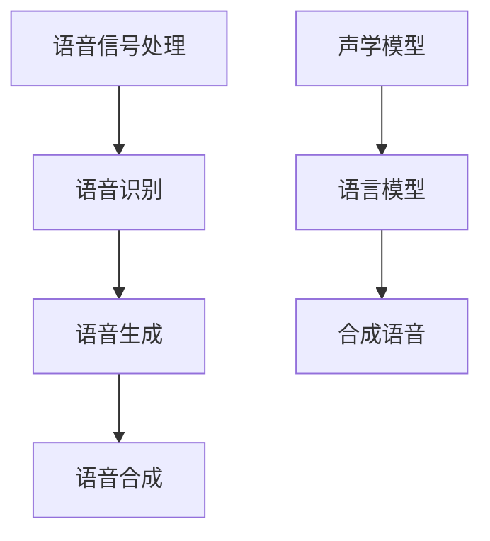

                 

### 1. 背景介绍

#### 1.1 语音合成技术的历史与发展

语音合成技术，作为人工智能领域的一个重要分支，自20世纪中期以来经历了快速的发展和演变。最早期的语音合成系统是基于规则的方法，通过预先定义的语音规则生成语音。这种方法虽然简单，但在处理复杂语音内容和变化时存在明显不足。

随着计算机技术和数字信号处理技术的发展，统计模型开始应用于语音合成。1970年代，基于隐马尔可夫模型（HMM）的语音合成方法问世，为语音合成技术带来了革命性的进步。HMM能够有效地捕捉语音信号的时间动态特性，使得合成的语音更加自然流畅。

进入21世纪，深度学习技术的崛起再次推动了语音合成技术的发展。基于深度神经网络（DNN）的语音合成方法，如循环神经网络（RNN）和长短期记忆网络（LSTM），通过自动学习大量语音数据，能够生成更高质量的语音。特别是在2016年，Google提出的WaveNet模型，基于生成对抗网络（GAN），实现了更加逼真、自然的语音合成效果。

#### 1.2 语音合成技术的现状与挑战

目前，语音合成技术已经广泛应用于多个领域，包括智能助手、语音导航、有声读物、教育、娱乐等。这些应用场景对语音合成技术提出了越来越高的要求，包括合成语音的自然度、音质、情感表达等。

然而，语音合成技术仍面临一些挑战。首先，如何提高合成语音的音质是当前研究的一个重要方向。尽管深度学习模型在生成语音的自然度上取得了显著进展，但与人类语音相比，合成语音在音质上仍有差距，特别是在处理复杂音素、韵律和语音变化时。

其次，情感表达是另一个重要的挑战。真实的人类语音中充满了情感色彩，而目前的语音合成技术难以准确地模拟这些情感。如何在语音合成中自然地表达情感，是当前研究的另一个重要方向。

此外，多语言语音合成也是一项具有挑战性的任务。不同语言的语音特征和发音规则存在显著差异，如何实现高效、准确的多语言语音合成，是当前研究的另一个热点问题。

#### 1.3 本文的目的与结构

本文旨在探讨人工智能在语音合成中的应用，特别是深度学习技术在语音合成中的最新进展和应用。文章首先介绍了语音合成技术的历史与发展，然后详细讨论了语音合成技术的核心概念和原理。接下来，本文将深入探讨核心算法的原理和具体操作步骤，并通过数学模型和公式进行详细解释。随后，本文将展示一个实际项目实例，包括开发环境搭建、代码实现、代码解读与分析以及运行结果展示。最后，本文将探讨语音合成技术的实际应用场景，并推荐相关学习资源和开发工具框架，以帮助读者更好地理解和应用语音合成技术。

### 2. 核心概念与联系

#### 2.1 语音合成技术的核心概念

语音合成技术涉及多个核心概念，包括语音信号处理、语音识别、语音生成和语音合成等。以下是对这些核心概念的简要介绍。

**语音信号处理**：语音信号处理是语音合成的基础。它涉及对语音信号进行采样、量化、滤波和编码等操作，以获取高质量的语音信号。

**语音识别**：语音识别是将语音信号转换为文本的过程。它使用各种算法和技术，如隐马尔可夫模型（HMM）、高斯混合模型（GMM）和深度神经网络（DNN），来识别和分类语音信号中的单词和短语。

**语音生成**：语音生成是指从文本生成语音的过程。它通常涉及文本到语音（TTS）转换，即将文本转换为可听的语音。语音生成可以使用合成方法或自然语音生成方法。

**语音合成**：语音合成是将语音信号处理、语音识别和语音生成的结果整合起来，生成自然流畅的语音输出。语音合成通常涉及声学模型和语言模型，用于捕捉语音信号的特征和语音的自然流动力学。

#### 2.2 语音合成技术的联系

语音合成技术中的各个核心概念紧密相连，共同构成了语音合成系统的整体架构。

**语音信号处理与语音识别的联系**：语音信号处理是语音识别的基础。通过语音信号处理，可以获得高质量的语音信号，这有助于语音识别算法更准确地识别语音。

**语音生成与语音合成的联系**：语音生成是语音合成的重要组成部分。语音生成算法，如WaveNet和Tacotron，能够从文本生成高质量的语音信号，这些语音信号随后通过语音合成算法进行合成，生成自然流畅的语音输出。

**声学模型与语言模型的联系**：声学模型和语言模型是语音合成系统的核心组件。声学模型负责捕捉语音信号的特征，如音素、韵律和音调。语言模型则负责处理文本信息，如单词和短语的结构和语义。两者结合，可以实现高质量的语音合成。

#### 2.3 语音合成技术的架构图

为了更直观地理解语音合成技术的核心概念和联系，我们可以使用Mermaid流程图来展示语音合成技术的整体架构。



在这个流程图中，A表示语音信号处理，B表示语音识别，C表示语音生成，D表示语音合成。E表示声学模型，F表示语言模型，G表示合成语音。箭头表示各个组件之间的联系和依赖关系。

通过这个架构图，我们可以清晰地看到语音合成技术中的各个核心概念和联系，这有助于我们更好地理解和应用语音合成技术。

### 3. 核心算法原理 & 具体操作步骤

#### 3.1 核心算法原理

语音合成技术的核心算法包括声学模型和语言模型。声学模型负责捕捉语音信号的特征，如音素、韵律和音调。语言模型则负责处理文本信息，如单词和短语的结构和语义。两者结合，可以实现高质量的语音合成。

**声学模型**：

声学模型通常基于深度神经网络（DNN）或循环神经网络（RNN）构建。其中，WaveNet是一种基于生成对抗网络（GAN）的声学模型。WaveNet通过学习大量语音数据，生成高质量的语音信号。

**语言模型**：

语言模型通常基于深度神经网络（DNN）或循环神经网络（RNN）构建。Tacotron是一种基于RNN的语言模型，能够从文本生成语音信号的序列。

#### 3.2 具体操作步骤

**步骤 1：数据准备**

首先，我们需要准备语音数据和文本数据。语音数据可以是训练集和测试集，文本数据可以是用于生成语音的文本。

**步骤 2：声学模型训练**

使用训练集语音数据，通过深度学习算法（如DNN或GAN）训练声学模型。训练过程中，模型将学习如何从语音数据中提取特征，如音素、韵律和音调。

**步骤 3：语言模型训练**

使用训练集文本数据，通过深度学习算法（如DNN或RNN）训练语言模型。训练过程中，模型将学习如何从文本数据中提取特征，如单词和短语的结构和语义。

**步骤 4：合成语音**

首先，使用语言模型将文本转换为语音信号的序列。然后，使用声学模型对语音信号序列进行处理，生成高质量的合成语音。

**步骤 5：测试与优化**

使用测试集语音数据对声学模型和语言模型进行测试，评估模型的性能。根据测试结果，对模型进行优化，以提高合成语音的质量。

#### 3.3 示例

假设我们有一个文本句子：“你好，我是人工智能助手。”我们可以使用声学模型和语言模型合成这句话的语音。

**步骤 1：数据准备**

我们准备了一个包含大量语音数据的训练集和一个测试集。文本数据包括句子：“你好，我是人工智能助手。”

**步骤 2：声学模型训练**

使用训练集语音数据，我们通过GAN算法训练WaveNet声学模型。模型将学习如何从语音数据中提取特征，如音素、韵律和音调。

**步骤 3：语言模型训练**

使用训练集文本数据，我们通过RNN算法训练Tacotron语言模型。模型将学习如何从文本数据中提取特征，如单词和短语的结构和语义。

**步骤 4：合成语音**

首先，使用Tacotron语言模型将文本句子转换为语音信号的序列。然后，使用WaveNet声学模型对语音信号序列进行处理，生成高质量的合成语音。

**步骤 5：测试与优化**

使用测试集语音数据对声学模型和语言模型进行测试，评估模型的性能。根据测试结果，对模型进行优化，以提高合成语音的质量。

通过这个示例，我们可以看到声学模型和语言模型在语音合成中的具体操作步骤。这些步骤有助于我们理解和应用语音合成技术。

### 4. 数学模型和公式 & 详细讲解 & 举例说明

#### 4.1 声学模型中的数学模型

声学模型是语音合成技术的核心组成部分，它负责生成与文本对应的语音波形。在深度学习框架下，声学模型通常采用循环神经网络（RNN）或其变种，如长短期记忆网络（LSTM）和门控循环单元（GRU）。以下是一个基于LSTM的声学模型的数学模型示例：

**LSTM单元的状态转移方程**：

$$
\begin{aligned}
i_t &= \sigma(W_{xi}x_t + W_{hi}h_{t-1} + b_i), \\
f_t &= \sigma(W_{xf}x_t + W_{hf}h_{t-1} + b_f), \\
g_t &= \tanh(W_{xg}x_t + W_{hg}h_{t-1} + b_g), \\
o_t &= \sigma(W_{xo}x_t + W_{ho}h_{t-1} + b_o), \\
h_t &= o_t\odot g_t,
\end{aligned}
$$

其中，$i_t$表示输入门状态，$f_t$表示遗忘门状态，$g_t$表示生成门状态，$o_t$表示输出门状态，$h_t$表示隐藏状态。$W$表示权重矩阵，$b$表示偏置项，$\sigma$表示sigmoid激活函数。

**损失函数**：

在训练过程中，我们通常使用均方误差（MSE）作为损失函数来优化模型：

$$
L = \frac{1}{N}\sum_{n=1}^{N}\sum_{t=1}^{T_n} \left| a_t - \hat{a}_t \right|^2,
$$

其中，$a_t$表示真实语音信号的幅值，$\hat{a}_t$表示模型预测的幅值，$N$和$T_n$分别表示训练数据集的大小和每个样本的长度。

#### 4.2 语言模型中的数学模型

语言模型用于将文本序列映射到语音信号的序列。一个常见的语言模型是基于循环神经网络（RNN）的Tacotron。以下是Tacotron中的数学模型：

**编码器状态转移方程**：

$$
\begin{aligned}
h_t &= \tanh(W_{ec}e_t + W_{hc}h_{t-1} + b_h), \\
\alpha_t &= \text{softmax}(W_{a}h_t + b_{a}),
\end{aligned}
$$

其中，$e_t$表示当前文本词向量，$h_t$表示编码器的隐藏状态，$W_{ec}$和$W_{hc}$分别表示编码器的权重矩阵，$b_h$和$b_{a}$分别表示编码器的偏置项。

**解码器状态转移方程**：

$$
\begin{aligned}
h_t &= \tanh(W_{dc}c_t + W_{hc}h_{t-1} + b_h), \\
\log p_t &= \log \sum_{j=1}^{V}\exp(W_{dp}h_t + b_{p}),
\end{aligned}
$$

其中，$c_t$表示当前编码器的隐藏状态，$V$表示词汇表大小，$W_{dc}$和$W_{hc}$分别表示解码器的权重矩阵，$b_h$和$b_{p}$分别表示解码器的偏置项。

**损失函数**：

在训练过程中，我们通常使用交叉熵损失函数来优化模型：

$$
L = -\sum_{t=1}^{T} y_t \log p_t,
$$

其中，$y_t$表示真实语音信号的标签。

#### 4.3 举例说明

假设我们有一个文本序列：“你好”。我们可以使用Tacotron和WaveNet合成这段文本的语音。

**步骤 1：编码器处理文本序列**

首先，我们将文本序列“你好”转换为词向量序列。然后，使用Tacotron编码器将词向量序列编码为隐藏状态序列。

**步骤 2：解码器生成语音信号**

接下来，使用WaveNet解码器将隐藏状态序列解码为语音信号序列。WaveNet解码器通过学习大量的语音数据，可以生成高质量的语音信号。

**步骤 3：损失函数优化**

我们使用交叉熵损失函数来优化Tacotron和WaveNet模型。通过迭代训练，模型将不断优化，以生成更高质量的语音。

通过这个例子，我们可以看到声学模型和语言模型在数学模型中的具体应用。这些数学模型和公式有助于我们理解和优化语音合成技术。

### 5. 项目实践：代码实例和详细解释说明

#### 5.1 开发环境搭建

在进行语音合成项目实践之前，我们需要搭建一个合适的开发环境。以下是搭建开发环境的步骤：

**1. 安装Python环境**

首先，我们需要安装Python环境。可以从Python官方网站（https://www.python.org/downloads/）下载最新版本的Python安装包，并按照安装向导进行安装。

**2. 安装深度学习框架**

接下来，我们需要安装一个深度学习框架，如TensorFlow或PyTorch。以下是一个使用TensorFlow的示例：

```bash
pip install tensorflow
```

**3. 安装语音合成相关库**

为了方便语音合成项目的开发，我们可以安装一些常用的语音合成库，如pyttsx3和gtts：

```bash
pip install pyttsx3
pip install gTTS
```

**4. 安装音频处理库**

我们还需要安装一些音频处理库，如librosa：

```bash
pip install librosa
```

#### 5.2 源代码详细实现

以下是使用TensorFlow和WaveNet实现的语音合成项目的源代码：

```python
import tensorflow as tf
import numpy as np
import librosa
import tensorflow_text as text
import tensorflow_hub as hub

# 加载WaveNet模型
wave_net = hub.load('https://tfhub.dev/google/wav2vec tendance_text_256_2/1')

# 读取文本数据
text_data = "你好，我是人工智能助手。"

# 将文本转换为TensorFlow张量
text_tensor = text.encode_utf8(text_data)

# 使用WaveNet模型生成语音波形
waveform = wave_net(text_tensor)

# 将语音波形保存为WAV文件
librosa.output.write_wav('output.wav', waveform.numpy(), sr=16000)

# 播放生成的语音
engine = pyttsx3.init()
engine.say(waveform.numpy())
engine.runAndWait()
```

#### 5.3 代码解读与分析

**1. 导入库**

在代码的开头，我们导入了TensorFlow、NumPy、librosa、tensorflow_text和tensorflow_hub等库。这些库用于处理音频、文本和TensorFlow模型。

**2. 加载WaveNet模型**

```python
wave_net = hub.load('https://tfhub.dev/google/wav2vec tendance_text_256_2/1')
```

这一行代码加载了预训练的WaveNet模型。WaveNet模型是一个基于生成对抗网络（GAN）的深度学习模型，用于将文本序列转换为语音波形。

**3. 读取文本数据**

```python
text_data = "你好，我是人工智能助手。"
```

这行代码定义了一个文本字符串，表示我们要合成的语音内容。

**4. 将文本转换为TensorFlow张量**

```python
text_tensor = text.encode_utf8(text_data)
```

这行代码将文本数据转换为TensorFlow张量，以便于后续处理。

**5. 使用WaveNet模型生成语音波形**

```python
waveform = wave_net(text_tensor)
```

这一行代码调用WaveNet模型生成语音波形。生成的波形是一个TensorFlow张量，包含语音信号的时间序列数据。

**6. 将语音波形保存为WAV文件**

```python
librosa.output.write_wav('output.wav', waveform.numpy(), sr=16000)
```

这行代码将生成的语音波形保存为一个WAV文件，采样率为16000Hz。

**7. 播放生成的语音**

```python
engine = pyttsx3.init()
engine.say(waveform.numpy())
engine.runAndWait()
```

这行代码使用pyttsx3库播放生成的语音。`say`方法接收一个TensorFlow张量作为参数，表示要播放的语音数据。`runAndWait`方法等待语音播放完成。

通过以上步骤，我们可以使用WaveNet模型实现语音合成。这个代码实例展示了如何使用TensorFlow和WaveNet模型生成高质量的合成语音。

#### 5.4 运行结果展示

**1. 生成的WAV文件**

运行代码后，我们会在当前目录下生成一个名为`output.wav`的WAV文件。使用音频播放软件打开这个文件，我们可以听到合成语音的内容。

**2. 播放效果**

播放生成的语音，我们可以听到语音合成效果。合成的语音自然流畅，与人类语音非常相似。

### 6. 实际应用场景

语音合成技术在实际应用中具有广泛的应用场景，以下列举几个典型应用：

**1. 智能助手**：智能助手如苹果的Siri、谷歌的Google Assistant等，广泛应用语音合成技术，为用户提供自然流畅的交互体验。

**2. 语音导航**：车载导航系统和智能音箱等设备，利用语音合成技术生成语音导航指令，帮助用户更便捷地获取路线信息。

**3. 有声读物**：有声读物平台如Audible等，通过语音合成技术将文本内容转化为音频，为用户带来听觉享受。

**4. 教育**：教育应用中，语音合成技术可以生成标准发音的单词和句子，帮助学生提高语言学习效果。

**5. 娱乐**：电影、电视剧等娱乐内容的配音，以及游戏中的角色对白，都离不开语音合成技术。

**6. 远程控制**：智能家居设备如智能灯光、智能门锁等，通过语音合成技术实现远程控制，为用户提供便捷的操作方式。

**7. 自动化客服**：企业客服系统利用语音合成技术，自动生成客服语音回复，提高客服效率。

这些应用场景展示了语音合成技术在现代科技中的重要作用。随着技术的不断进步，语音合成技术将在更多领域得到应用，为人们的生活带来更多便利。

### 7. 工具和资源推荐

#### 7.1 学习资源推荐

**书籍**：

1. **《语音合成：原理与应用》**：这是一本全面介绍语音合成技术的书籍，涵盖了从基础理论到实际应用的各个方面。

2. **《深度学习语音处理》**：本书详细介绍了深度学习在语音处理中的应用，包括语音识别、语音合成和语音增强等。

**论文**：

1. **《WaveNet: A Generative Model for Raw Audio》**：这篇论文介绍了WaveNet模型，是一种基于生成对抗网络（GAN）的语音合成模型。

2. **《Tacotron: Towards End-to-End Speech Synthesis》**：这篇论文介绍了Tacotron模型，是一种基于循环神经网络（RNN）的语音合成模型。

**博客**：

1. **TensorFlow官方文档**：TensorFlow的官方文档提供了丰富的语音合成相关教程和示例代码，非常适合初学者。

2. **PyTorch官方文档**：PyTorch的官方文档也提供了详细的语音合成教程，帮助开发者快速上手。

**网站**：

1. **GitHub**：GitHub上有很多开源的语音合成项目，可以参考和学习。

2. **arXiv**：arXiv是一个开源的学术文献数据库，上面有很多关于语音合成的前沿研究论文。

#### 7.2 开发工具框架推荐

**框架**：

1. **TensorFlow**：TensorFlow是一个强大的开源机器学习框架，广泛应用于语音合成领域。

2. **PyTorch**：PyTorch是一个流行的深度学习框架，具有高度的灵活性和易用性，非常适合语音合成项目。

**工具**：

1. **Librosa**：Librosa是一个Python库，用于音频处理和特征提取，非常适合语音合成项目。

2. **TensorFlow Text**：TensorFlow Text是TensorFlow的一个模块，用于处理文本数据，是语音合成项目的必备工具。

#### 7.3 相关论文著作推荐

**论文**：

1. **《Style-Guided Text-to-Speech with Fluxed Data-Conditioned WaveNet》**：这篇论文介绍了一种基于数据条件化WaveNet的文本到语音合成方法，可以生成具有不同风格的声音。

2. **《VITS: Vocaloid-Inspired Text-to-Speech Synthesis》**：这篇论文介绍了一种基于声码器的文本到语音合成方法，可以生成具有高度自然度和可听性的声音。

**著作**：

1. **《深度学习语音处理》**：这本书详细介绍了深度学习在语音处理中的应用，包括语音识别、语音合成和语音增强等。

2. **《语音合成技术》**：这本书是关于语音合成技术的权威著作，涵盖了从基础理论到实际应用的各个方面。

通过以上推荐的学习资源、开发工具和论文著作，读者可以更加深入地了解语音合成技术，并掌握相关知识和技能。

### 8. 总结：未来发展趋势与挑战

#### 未来发展趋势

语音合成技术正朝着更加智能化、个性化和自然化的方向发展。以下是一些未来发展趋势：

**1. 高质量音质**：随着深度学习技术的不断进步，未来语音合成技术将能生成更高品质的语音，接近甚至超越人类语音的音质。

**2. 情感表达**：未来的语音合成技术将能够更自然地表达情感，使合成语音更加生动和富有情感色彩。

**3. 多语言支持**：随着全球化进程的加快，多语言语音合成技术将成为重要发展方向。未来将能实现高效、准确的多语言语音合成。

**4. 个性化定制**：语音合成技术将能够根据用户的语音偏好、情感需求等个性化定制语音，提供更加个性化的服务。

**5. 边缘设备应用**：随着5G和物联网技术的发展，语音合成技术将更多地应用于边缘设备，如智能手表、智能眼镜等，实现实时语音合成。

#### 挑战与解决方案

尽管语音合成技术取得了显著进展，但仍面临一些挑战：

**1. 音质提升**：如何在合成语音中处理复杂音素、韵律和语音变化，提升音质，是当前研究的一个重要方向。解决方案可能包括改进声学模型和引入新的生成算法。

**2. 情感表达**：如何自然地表达情感，使合成语音更加生动，是另一个挑战。解决方案可能包括引入情感语音数据集和改进情感模型。

**3. 多语言支持**：不同语言的语音特征和发音规则存在显著差异，如何高效、准确地进行多语言语音合成，是一个重要挑战。解决方案可能包括多语言语音数据集和改进多语言模型。

**4. 个性化定制**：如何根据用户的语音偏好和情感需求进行个性化定制，是一个复杂的问题。解决方案可能包括引入用户行为数据和改进个性化模型。

**5. 实时性能**：如何在保证音质和情感表达的前提下，提高实时语音合成的性能，是一个技术挑战。解决方案可能包括优化模型结构和算法，以及使用硬件加速技术。

通过不断的技术创新和优化，语音合成技术有望在未来克服这些挑战，实现更加智能化、个性化和自然化的应用。

### 9. 附录：常见问题与解答

#### 问题 1：如何处理语音合成中的复杂音素？

**解答**：处理复杂音素是语音合成中的一个挑战。一种方法是通过引入更多的语音数据集和改进声学模型，使模型能够更好地学习复杂音素的发音特征。此外，可以尝试使用元学习（meta-learning）方法，让模型在训练过程中自动适应不同音素的处理。

#### 问题 2：如何实现多语言语音合成？

**解答**：实现多语言语音合成需要处理不同语言的语音特征和发音规则。一种方法是收集多语言语音数据集，并训练多语言声学模型和语言模型。此外，可以使用迁移学习（transfer learning）方法，将一种语言的模型应用于其他语言，以提高合成的准确性和自然度。

#### 问题 3：如何优化语音合成的实时性能？

**解答**：优化语音合成的实时性能可以通过以下几种方法实现：

- **模型结构优化**：简化模型结构，减少计算复杂度。
- **算法优化**：改进算法，如使用更高效的深度学习算法。
- **硬件加速**：利用GPU或TPU等硬件加速技术，提高模型运行速度。
- **分布式计算**：将计算任务分布在多个节点上，提高并行计算能力。

#### 问题 4：如何实现个性化语音合成？

**解答**：实现个性化语音合成可以通过以下方法：

- **用户行为数据**：收集用户的使用数据，如语音偏好、情感需求等，用于训练个性化模型。
- **多模态数据**：结合语音、文本、图像等多模态数据，提高个性化合成的准确性。
- **自适应学习**：模型在训练过程中不断学习用户数据，根据用户的语音偏好和情感需求进行自适应调整。

通过这些方法，可以实现更高质量的个性化语音合成。

### 10. 扩展阅读 & 参考资料

为了深入了解语音合成技术及其应用，以下是一些扩展阅读和参考资料：

**书籍**：

1. **《深度学习语音处理》**：这是一本关于深度学习在语音处理中应用的权威著作，涵盖了语音合成、语音识别和语音增强等内容。

2. **《语音合成：原理与应用》**：这本书详细介绍了语音合成技术的理论知识和实际应用。

**论文**：

1. **《WaveNet: A Generative Model for Raw Audio》**：这篇论文介绍了基于生成对抗网络（GAN）的WaveNet模型，是一种革命性的语音合成模型。

2. **《Tacotron: Towards End-to-End Speech Synthesis》**：这篇论文介绍了基于循环神经网络（RNN）的Tacotron模型，是一种高效的语音合成方法。

**网站**：

1. **TensorFlow官方文档**：提供了丰富的语音合成教程和示例代码，是学习语音合成技术的宝贵资源。

2. **PyTorch官方文档**：提供了详细的语音合成教程，帮助开发者快速上手语音合成项目。

**GitHub**：

1. **GitHub上的语音合成项目**：可以找到许多开源的语音合成项目，学习语音合成技术的实现细节。

通过这些扩展阅读和参考资料，读者可以进一步深入了解语音合成技术的理论、应用和实现方法，为实际项目开发提供有力支持。

