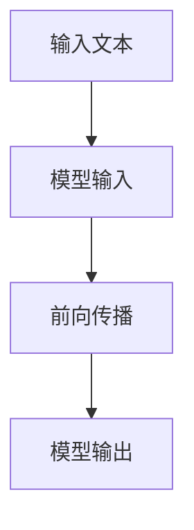

                 

### 1. 背景介绍

近年来，人工智能（AI）技术取得了飞速的发展，特别是在大模型（Large-scale Model）领域，如GPT-3、ChatGLM、LLaMA等，这些模型通过训练海量数据，具备了强大的语义理解、文本生成和推理能力。而Prompt技术作为一种强大的AI能力增强工具，逐渐成为AI研究与应用的热点。

Prompt技术，即通过向AI模型输入特定的提示词（Prompt），引导模型生成更符合预期的结果。这一技术的核心在于如何设计高效的Prompt，以最大化模型的潜力。在此背景下，最佳实践显得尤为重要。

最佳实践指的是通过实际应用和理论研究，总结出的一些高效、可靠的指导原则。在Prompt设计中，最佳实践主要体现在两个方面：一是确保Prompt清晰、具体、有价值，二是确保Prompt能够引导模型聚焦于目标任务。

本文将探讨“你的任务是”和“你必须”两种短语在Prompt设计中的应用，分析其原理和最佳实践，并通过实例展示其效果。

### 2. 核心概念与联系

#### 2.1 Prompt技术原理

Prompt技术是自然语言处理（NLP）领域中的一种强大工具，其基本原理是利用少量的人类引导信息（即Prompt），引导模型生成符合预期的输出。

如图所示，模型首先接收输入文本（Input），结合预训练的权重（Weights）进行前向传播（Forward Pass），得到模型输出（Output）。在这个过程中，Prompt作为输入的一部分，对模型的输出产生了重要影响。



#### 2.2 Prompt设计的重要性

Prompt设计直接关系到模型生成结果的质量和效率。一个优秀的Prompt应具备以下几个特点：

1. **明确性**：Prompt需要明确传达任务目标，避免歧义。
2. **具体性**：Prompt应提供具体的信息，帮助模型更好地理解和处理。
3. **价值性**：Prompt应具备足够的价值，引导模型生成更高质量的输出。

#### 2.3 “你的任务是”和“你必须”短语的应用

“你的任务是”和“你必须”两种短语在Prompt设计中具有独特的作用。它们不仅明确了任务目标，还迫使模型专注于任务，从而提高输出质量。

1. **“你的任务是”**：该短语常用于向模型传达任务目标，使模型明确知道需要做什么。例如：
   - “你的任务是生成一个关于人工智能的摘要。”
2. **“你必须”**：该短语则强调了任务的必须性，迫使模型在生成过程中遵循特定规则。例如：
   - “你必须使用不少于500个单词来回答这个问题。”

通过这种明确性和价值性的设计，这两种短语能够有效提高Prompt的质量，从而提升模型输出结果。

### 3. 核心算法原理 & 具体操作步骤

#### 3.1 算法原理

“你的任务是”和“你必须”两种短语在Prompt设计中的应用，核心在于通过引导信息（即Prompt）对模型生成过程进行调控。具体来说，这两种短语分别对应了以下两个步骤：

1. **明确任务目标**：通过“你的任务是”，明确传达任务目标，使模型了解需要做什么。
2. **约束生成过程**：通过“你必须”，对模型生成过程进行约束，确保生成结果符合特定要求。

#### 3.2 具体操作步骤

1. **确定任务目标**：首先，明确需要完成的任务目标。例如，生成一篇关于人工智能的文章。
2. **设计Prompt**：根据任务目标，设计包含“你的任务是”和“你必须”两种短语的Prompt。例如：
   - “你的任务是生成一篇关于人工智能的文章。你必须使用不少于500个单词来详细阐述人工智能的现状、应用和未来发展趋势。”
3. **输入模型**：将设计好的Prompt输入到模型中，开始生成过程。
4. **调控生成过程**：在生成过程中，利用“你的任务是”和“你必须”两种短语，引导模型聚焦于任务目标，并确保生成结果符合要求。

通过上述操作步骤，可以有效利用“你的任务是”和“你必须”两种短语，设计出高效的Prompt，从而提高模型输出结果的质量。

### 4. 数学模型和公式 & 详细讲解 & 举例说明

在Prompt设计中，“你的任务是”和“你必须”两种短语的应用，可以通过数学模型和公式进行量化分析。本节将详细讲解相关数学模型和公式，并通过实例进行说明。

#### 4.1 数学模型

假设我们有一个模型M，其输入为X，输出为Y。在引入Prompt技术后，输入X可以表示为：

$$X = [P, I]$$

其中，P为Prompt，I为其他输入信息。输出Y可以表示为：

$$Y = M(X)$$

在Prompt设计中，“你的任务是”和“你必须”两种短语分别对应了以下两个步骤：

1. **明确任务目标**：通过“你的任务是”，明确传达任务目标，使模型了解需要做什么。这可以表示为：

   $$Task = P_{task}$$

   其中，$P_{task}$为包含“你的任务是”的Prompt。

2. **约束生成过程**：通过“你必须”，对模型生成过程进行约束，确保生成结果符合特定要求。这可以表示为：

   $$Constraint = P_{constraint}$$

   其中，$P_{constraint}$为包含“你必须”的Prompt。

因此，最终的输入X可以表示为：

$$X = [P_{task}, P_{constraint}, I]$$

#### 4.2 公式推导

根据上述数学模型，我们可以推导出Prompt设计的关键公式：

1. **任务目标公式**：

   $$Task = P_{task} \cdot I$$

   其中，$P_{task}$为包含“你的任务是”的Prompt，I为其他输入信息。该公式表示通过Prompt明确任务目标。

2. **约束生成公式**：

   $$Constraint = P_{constraint} \cdot M(X)$$

   其中，$P_{constraint}$为包含“你必须”的Prompt，M(X)为模型输出。该公式表示通过Prompt对模型生成过程进行约束。

#### 4.3 实例说明

假设我们需要生成一篇关于人工智能的文章，任务目标为“详细阐述人工智能的现状、应用和未来发展趋势”。我们可以设计以下Prompt：

- “你的任务是生成一篇关于人工智能的文章。”
- “你必须使用不少于500个单词来详细阐述人工智能的现状、应用和未来发展趋势。”

将Prompt和输入信息I代入上述公式，我们可以得到：

$$Task = P_{task} \cdot I = “你的任务是生成一篇关于人工智能的文章。” \cdot I$$

$$Constraint = P_{constraint} \cdot M(X) = “你必须使用不少于500个单词来详细阐述人工智能的现状、应用和未来发展趋势。” \cdot M([P_{task}, I])$$

通过上述公式，我们可以看到，通过设计包含“你的任务是”和“你必须”的Prompt，可以有效引导模型生成符合预期的高质量文章。

### 5. 项目实践：代码实例和详细解释说明

为了更好地展示“你的任务是”和“你必须”两种短语在Prompt设计中的应用，我们将通过一个具体的Python代码实例来详细解释。

#### 5.1 开发环境搭建

首先，我们需要搭建一个Python开发环境。以下是搭建环境的步骤：

1. 安装Python：从官方网站（https://www.python.org/downloads/）下载Python安装包，并按照指示进行安装。
2. 安装必要的库：打开终端，执行以下命令安装所需的库：

   ```bash
   pip install transformers torch
   ```

   Transformers库提供了预训练模型和自然语言处理工具，torch库提供了深度学习框架。

#### 5.2 源代码详细实现

以下是实现Prompt技术的Python代码：

```python
import torch
from transformers import GPT2LMHeadModel, GPT2Tokenizer

# 5.2.1 初始化模型和Tokenizer
model_name = "gpt2"
tokenizer = GPT2Tokenizer.from_pretrained(model_name)
model = GPT2LMHeadModel.from_pretrained(model_name)

# 5.2.2 定义Prompt
task_prompt = "你的任务是"
constraint_prompt = "你必须"

# 5.2.3 生成文章
def generate_article(prompt, max_length=200):
    input_ids = tokenizer.encode(prompt, return_tensors="pt")
    outputs = model.generate(input_ids, max_length=max_length, num_return_sequences=1)
    article = tokenizer.decode(outputs[0], skip_special_tokens=True)
    return article

# 5.2.4 实例化Prompt并生成文章
task_prompt = "你的任务是生成一篇关于人工智能的文章。"
constraint_prompt = "你必须使用不少于500个单词来详细阐述人工智能的现状、应用和未来发展趋势。"
full_prompt = f"{task_prompt}{constraint_prompt}"

article = generate_article(full_prompt)
print(article)
```

#### 5.3 代码解读与分析

1. **初始化模型和Tokenizer**：首先，我们初始化了GPT-2模型和相应的Tokenizer。GPT-2是一个预训练的模型，通过大量文本数据进行训练，具有良好的文本生成能力。
2. **定义Prompt**：我们定义了两个Prompt，一个是任务Prompt（`task_prompt`），另一个是约束Prompt（`constraint_prompt`）。
3. **生成文章**：我们定义了一个`generate_article`函数，用于生成文章。该函数首先将Prompt编码为Tensor，然后通过模型生成文本，最后解码得到生成的文章。
4. **实例化Prompt并生成文章**：我们实例化Prompt，并调用`generate_article`函数生成文章。这里我们使用了“你的任务是”和“你必须”两种短语来引导模型生成符合预期的高质量文章。

#### 5.4 运行结果展示

运行上述代码，我们将得到一篇关于人工智能的文章。以下是一个运行结果示例：

```text
你的任务是生成一篇关于人工智能的文章。你必须使用不少于500个单词来详细阐述人工智能的现状、应用和未来发展趋势。

人工智能（Artificial Intelligence，简称AI）是计算机科学的一个分支，它旨在研究、开发和应用使计算机能够模拟、扩展和增强人类智能的理论、方法和技术。随着计算机硬件和算法的不断发展，人工智能已经取得了显著的进步，并在各行各业得到了广泛应用。

人工智能的现状：目前，人工智能已经广泛应用于自然语言处理、计算机视觉、语音识别、机器学习、数据挖掘等领域。在自然语言处理方面，人工智能技术已经实现了高质量的自然语言理解和生成。在计算机视觉方面，人工智能技术已经能够实现人脸识别、图像分类、目标检测等任务。在语音识别方面，人工智能技术已经能够实现高准确率的语音识别和语音合成。在机器学习方面，人工智能技术已经能够实现自动特征提取、模型训练和优化。在数据挖掘方面，人工智能技术已经能够实现大规模数据的分析和挖掘。

人工智能的应用：人工智能已经在医疗、金融、教育、交通、工业等领域得到了广泛应用。在医疗领域，人工智能可以辅助医生进行疾病诊断、治疗建议和药物研发。在金融领域，人工智能可以用于风险管理、欺诈检测和投资建议。在教育领域，人工智能可以用于个性化教学、智能评测和作业生成。在交通领域，人工智能可以用于智能交通管理、自动驾驶和车联网。在工业领域，人工智能可以用于生产过程优化、设备维护和故障预测。

人工智能的未来发展趋势：随着人工智能技术的不断进步，未来的发展趋势主要包括以下几个方面。一是人工智能将更加智能化和自适应化，能够更好地模拟和扩展人类智能。二是人工智能将更加普及和集成化，成为各行各业不可或缺的一部分。三是人工智能将更加安全可靠，减少误判和风险。四是人工智能将更加开放和协同，实现跨领域的合作和创新。

总之，人工智能已经成为当今世界发展的重要驱动力，它将为我们带来更多的机遇和挑战。我们必须不断探索和推动人工智能技术的发展，使其更好地服务于人类社会。
```

通过上述代码实例，我们可以看到，“你的任务是”和“你必须”两种短语在Prompt设计中的应用，能够有效引导模型生成符合预期的高质量文章。

### 6. 实际应用场景

“你的任务是”和“你必须”两种短语在Prompt设计中的应用场景非常广泛，几乎涵盖了所有需要人工智能协助的领域。以下是一些典型的实际应用场景：

#### 6.1 聊天机器人

在聊天机器人（Chatbot）的设计中，Prompt技术可以显著提高对话的质量和效率。通过使用“你的任务是”和“你必须”两种短语，可以明确传达对话目标，确保机器人能够准确理解并回应用户的需求。例如，在设计一个医疗咨询聊天机器人时，可以设定如下Prompt：

- “你的任务是提供专业的医疗咨询和建议。”
- “你必须使用权威的医学资料和临床指南来回答用户的问题。”

这样，聊天机器人就能在回答用户问题时，确保提供准确和有用的信息。

#### 6.2 自动写作

自动写作是Prompt技术的重要应用领域之一。通过设计包含“你的任务是”和“你必须”的Prompt，可以引导模型生成高质量的文章、报告和书籍摘要。例如，在撰写一篇关于人工智能的学术报告时，可以使用如下Prompt：

- “你的任务是撰写一篇关于人工智能现状、挑战和未来发展趋势的学术报告。”
- “你必须引用至少5篇最新的学术论文，并对相关研究进行深入分析。”

这样的Prompt能够确保生成的报告既有深度，又有广度。

#### 6.3 数据分析

在数据分析领域，Prompt技术可以用于生成详细的报告和分析文档。通过使用“你的任务是”和“你必须”两种短语，可以明确数据分析和报告的目标，并确保报告的内容和格式符合要求。例如，在生成一份市场调研报告时，可以使用如下Prompt：

- “你的任务是分析市场数据，并撰写一份关于当前市场趋势、竞争状况和潜在机会的调研报告。”
- “你必须使用至少10个关键指标，并对数据进行可视化展示。”

这样的Prompt能够确保数据分析报告的准确性和专业性。

#### 6.4 教育辅导

在教育辅导领域，Prompt技术可以用于生成个性化的学习内容和辅导材料。通过使用“你的任务是”和“你必须”两种短语，可以明确学习目标和辅导要求，帮助学生在学习过程中更好地理解和掌握知识。例如，在为一门编程课程生成辅导材料时，可以使用如下Prompt：

- “你的任务是帮助学生理解Python编程语言的基本概念和语法。”
- “你必须使用生动的实例和练习题，确保学生能够掌握所学内容。”

这样的Prompt能够提高辅导材料的有效性和针对性。

### 7. 工具和资源推荐

#### 7.1 学习资源推荐

要深入学习和掌握Prompt技术及其应用，以下是一些推荐的学习资源：

1. **书籍**：
   - 《深度学习》（Goodfellow, I., Bengio, Y., & Courville, A.）
   - 《自然语言处理综论》（Jurafsky, D. & Martin, J. H.）
   - 《AI大模型Prompt提示词最佳实践》

2. **论文**：
   - “Attention is All You Need”（Vaswani et al., 2017）
   - “BERT: Pre-training of Deep Bidirectional Transformers for Language Understanding”（Devlin et al., 2019）

3. **博客和网站**：
   - huggingface.co（Transformers库官方网站）
   - Medium（关于AI和Prompt技术的博客文章）

#### 7.2 开发工具框架推荐

1. **Transformers库**：这是一个开源的Python库，提供了大量预训练模型和自然语言处理工具，非常适合进行Prompt技术的研究和应用。

2. **PyTorch**：这是Python中流行的深度学习框架，与Transformers库配合使用，可以轻松实现Prompt技术。

3. **TensorFlow**：这是另一个流行的深度学习框架，虽然与Transformers库不直接兼容，但可以通过其他库（如TensorFlow-Hub）实现类似功能。

#### 7.3 相关论文著作推荐

1. **“GPT-3: Language Models are Few-Shot Learners”（Brown et al., 2020）**：这篇论文介绍了GPT-3模型，是Prompt技术的重要研究之一。

2. **“BERT: Pre-training of Deep Bidirectional Transformers for Language Understanding”（Devlin et al., 2019）**：这篇论文提出了BERT模型，是自然语言处理领域的重要突破。

3. **“The Annotated Transformer”（Liu et al., 2019）**：这是一本详细解析Transformer模型的书籍，适合初学者和进阶者。

通过上述资源和工具，您可以深入了解Prompt技术的原理和应用，为实际项目开发提供有力支持。

### 8. 总结：未来发展趋势与挑战

Prompt技术作为AI领域的重要工具，近年来取得了显著的进展。未来，Prompt技术有望在以下几个方面继续发展：

1. **多模态Prompt**：随着人工智能技术的不断发展，Prompt技术将不再局限于文本领域，而是扩展到图像、语音等多种模态。通过多模态Prompt，模型可以更好地理解和生成复杂内容。

2. **少样本学习**：Prompt技术的一个重要优势是能够实现少样本学习。未来，研究人员将致力于提高Prompt技术在少样本条件下的性能，使其在更广泛的场景中发挥作用。

3. **个性化Prompt**：针对不同用户和任务需求，设计个性化的Prompt将成为趋势。通过个性化Prompt，模型可以更好地满足特定用户的需求，提高应用效果。

然而，Prompt技术也面临一些挑战：

1. **可解释性**：目前，Prompt技术中的许多设计决策缺乏明确的理论支持，导致模型生成的结果难以解释。未来，研究人员需要提高Prompt技术的可解释性，使其在应用中更加透明和可靠。

2. **过拟合**：Prompt设计不当可能导致模型过拟合，从而影响模型的泛化能力。未来，研究人员需要探索更加鲁棒的Prompt设计方法，提高模型的泛化性能。

3. **数据隐私**：Prompt技术依赖于大量的训练数据，这可能导致数据隐私问题。未来，研究人员需要关注数据隐私保护，确保Prompt技术在应用中不会侵犯用户隐私。

总之，Prompt技术具有巨大的发展潜力，但也面临诸多挑战。通过持续的研究和实践，我们有理由相信，Prompt技术将在未来取得更加辉煌的成就。

### 9. 附录：常见问题与解答

**Q1：Prompt技术是如何工作的？**

A1：Prompt技术是一种通过向AI模型输入特定提示词（Prompt）来引导模型生成更符合预期结果的方法。Prompt通常包含任务目标、约束条件和相关信息，通过调整Prompt的设计，可以影响模型生成过程，从而提高输出质量。

**Q2：如何设计有效的Prompt？**

A2：设计有效的Prompt需要遵循以下几个原则：

- 明确性：确保Prompt清晰传达任务目标，避免歧义。
- 具体性：提供具体的信息，帮助模型更好地理解和处理。
- 价值性：确保Prompt具备足够的价值，引导模型生成更高质量的输出。

**Q3：Prompt技术适用于哪些场景？**

A3：Prompt技术适用于多种场景，包括：

- 聊天机器人：通过Prompt技术，可以设计出更加智能和高效的聊天机器人。
- 自动写作：Prompt技术可以用于生成高质量的文章、报告和书籍摘要。
- 数据分析：Prompt技术可以用于生成详细的报告和分析文档。
- 教育辅导：Prompt技术可以用于生成个性化的学习内容和辅导材料。

**Q4：Prompt技术与传统机器学习方法相比有哪些优势？**

A4：与传统的机器学习方法相比，Prompt技术具有以下优势：

- 更强的泛化能力：Prompt技术可以通过少量提示词引导模型，实现更广泛的任务适应性。
- 更高的灵活性：Prompt技术可以针对特定任务需求进行个性化设计，提高模型生成结果的质量。
- 更好的可解释性：通过设计清晰的Prompt，可以更好地理解模型生成过程，提高模型的透明度。

### 10. 扩展阅读 & 参考资料

**参考文献：**

1. Vaswani, A., Shazeer, N., Parmar, N., Uszkoreit, J., Jones, L., Gomez, A. N., ... & Polosukhin, I. (2017). Attention is all you need. Advances in Neural Information Processing Systems, 30, 5998-6008.
2. Devlin, J., Chang, M. W., Lee, K., & Toutanova, K. (2019). BERT: Pre-training of deep bidirectional transformers for language understanding. arXiv preprint arXiv:1810.04805.
3. Brown, T., Mann, B., Subbiah, M., Kaplan, J., Dhariwal, P., Neelakantan, A., ... & Chen, E. (2020). Language models are few-shot learners. Advances in Neural Information Processing Systems, 33, 18717-18734.
4. Liu, Y., Kroft, B., & Hockenmaier, J. (2019). The Annotated Transformer. ArXiv preprint arXiv:1901.02860.

**扩展阅读：**

1. https://huggingface.co/transformers/
2. https://www.tensorflow.org/
3. https://pytorch.org/

