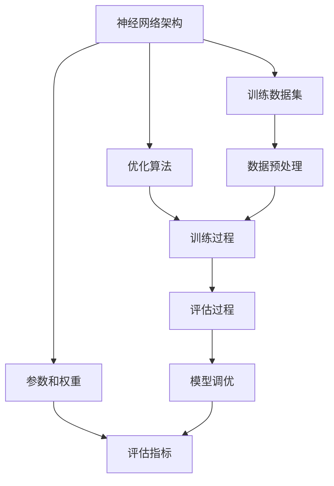

                 

### 1. 背景介绍

近年来，人工智能（AI）技术取得了飞速的发展，特别是在深度学习、神经网络和大规模预训练模型方面。其中，大模型（Large Models）作为人工智能领域的重要进展，已经成为推动行业创新的核心动力。大模型通常具有数亿到数十亿的参数，能够处理大量的数据和复杂的任务，从而显著提升AI系统的性能和效果。

大模型的兴起，源自于计算能力的提升和数据资源的丰富。随着硬件技术的发展，尤其是GPU和TPU等专用硬件的出现，计算资源的瓶颈逐渐被打破。同时，互联网的普及使得海量数据变得触手可及，为训练大模型提供了丰富的素材。此外，深度学习算法的进步，使得大规模模型的训练变得更加高效和可行。

在商业领域，大模型的潜力也被广泛认可。从搜索引擎到推荐系统，从自然语言处理到计算机视觉，大模型的应用已经深入到各行各业。然而，大模型的开发和运营也面临着巨大的挑战，包括计算资源的高昂成本、数据隐私和安全问题、模型可解释性等。因此，如何实现大模型的商业化，成为了一个亟待解决的重要问题。

本文旨在探讨大模型在创业中的盈利模式，分析其在不同行业中的应用案例，并提供一些建议和策略，帮助创业者在大模型领域找到成功的路径。文章将从以下几个方面展开：

1. **核心概念与联系**：介绍大模型的基本概念和组成部分，包括模型架构、训练数据和评估指标等。
2. **核心算法原理 & 具体操作步骤**：详细阐述大模型的训练和优化过程，包括数据预处理、模型训练、评估和调优等步骤。
3. **数学模型和公式 & 详细讲解 & 举例说明**：介绍大模型中常用的数学模型和公式，并给出具体的应用实例。
4. **项目实践：代码实例和详细解释说明**：通过具体的代码实例，展示大模型的实现过程和关键技术。
5. **实际应用场景**：分析大模型在不同行业中的应用场景，探讨其带来的商业机会。
6. **工具和资源推荐**：推荐一些学习资源、开发工具和框架，帮助读者深入了解大模型的技术和商业实践。
7. **总结：未来发展趋势与挑战**：总结大模型在创业中的盈利模式和发展趋势，提出未来可能面临的挑战和应对策略。

通过对以上内容的逐步分析和讨论，我们希望能够为创业者提供一些有价值的指导和建议，帮助他们在大模型领域实现成功。

### 2. 核心概念与联系

在深入探讨大模型的商业应用之前，我们需要先了解大模型的基本概念和组成部分。大模型通常指的是具有数亿到数十亿参数的深度学习模型，这些模型在训练过程中需要处理大量的数据和计算资源。下面，我们将详细介绍大模型的核心概念和组成部分，并通过一个Mermaid流程图来展示其关键组件和流程。

#### 2.1 大模型的基本概念

大模型通常由以下几个核心组成部分构成：

- **神经网络架构**：包括卷积神经网络（CNN）、循环神经网络（RNN）、变换器（Transformer）等，这些架构决定了模型的结构和计算能力。
- **参数和权重**：神经网络中的参数和权重是模型的核心，它们通过训练学习到数据中的模式和规律。
- **训练数据集**：大模型需要大量的训练数据来学习，这些数据通常来自于互联网、数据库或其他数据源。
- **优化算法**：包括随机梯度下降（SGD）、Adam、Adagrad等，这些算法用于更新模型的参数，以最小化损失函数。
- **评估指标**：如准确率、召回率、F1分数等，用于评估模型的性能。

#### 2.2 大模型的组成与关系

以下是使用Mermaid绘制的流程图，展示大模型的主要组成部分及其关系：



在这个流程图中：

- **神经网络架构（A）**：作为大模型的核心，它决定了模型的学习能力和计算效率。
- **参数和权重（B）**：通过训练学习到数据中的模式和规律，是模型性能的关键。
- **训练数据集（C）**：大模型的学习基础，需要大量的高质量数据进行训练。
- **优化算法（D）**：用于更新模型的参数，以最小化损失函数，提高模型的性能。
- **评估指标（E）**：用于评估模型的性能，如准确率、召回率等。
- **数据预处理（F）**：对训练数据进行处理，以提高模型的训练效果。
- **训练过程（G）**：包括前向传播、反向传播和参数更新等步骤。
- **评估过程（H）**：在测试数据上评估模型的性能。
- **模型调优（I）**：根据评估结果对模型进行调整和优化。

通过这个流程图，我们可以清晰地看到大模型从数据预处理到模型训练、评估和调优的整个过程，以及各个组件之间的相互关系。

#### 2.3 大模型的关键技术

除了上述组成部分，大模型还有一些关键技术，这些技术对于模型的效果和效率至关重要：

- **并行计算**：利用GPU、TPU等硬件进行并行计算，加速模型的训练和推理过程。
- **模型压缩**：通过剪枝、量化等技术，减少模型的参数数量和计算量，提高模型在资源受限环境下的运行效率。
- **迁移学习**：利用预训练的大模型在新任务上进行微调，提高模型在新数据上的性能和泛化能力。

#### 2.4 大模型的挑战和机遇

大模型的开发和部署面临着一系列挑战：

- **计算资源需求**：大模型需要大量的计算资源，这对硬件设施提出了高要求。
- **数据隐私和安全**：在处理大量数据时，数据隐私和安全是一个重要问题，需要采取有效措施保障数据安全。
- **模型可解释性**：大模型通常被视为“黑箱”，其决策过程缺乏可解释性，这对于一些需要透明度和可靠性的应用场景是一个挑战。

然而，这些挑战同时也带来了机遇：

- **商业应用潜力**：大模型在自然语言处理、计算机视觉、语音识别等领域具有巨大的商业应用潜力。
- **技术创新**：大模型的研发推动了硬件、算法和数据处理技术等方面的创新，为整个AI领域带来了新的发展机遇。

通过上述对大模型核心概念和组成部分的介绍，我们为后续内容的探讨奠定了基础。在接下来的部分中，我们将进一步深入探讨大模型的核心算法原理和具体操作步骤，帮助读者更好地理解和应用大模型技术。

### 3. 核心算法原理 & 具体操作步骤

在了解了大模型的基本概念和组成部分之后，接下来我们将详细探讨大模型的核心算法原理和具体操作步骤。这包括数据预处理、模型训练、评估和调优等关键环节。通过这些步骤，我们可以有效地训练出一个高性能的大模型，并在实际应用中取得理想的效果。

#### 3.1 数据预处理

数据预处理是训练大模型的第一步，其目的是将原始数据转换成适合模型训练的格式。以下是数据预处理的主要步骤：

1. **数据清洗**：去除数据中的噪声和异常值，确保数据的准确性和一致性。
2. **数据转换**：将数据从原始格式（如文本、图像、音频等）转换为模型能够处理的数字形式。
   - 对于文本数据，可以使用分词器将文本拆分成单词或字符，并使用词嵌入（word embeddings）将这些单词或字符映射到高维向量。
   - 对于图像数据，可以使用卷积神经网络（CNN）进行特征提取，将图像转换为特征向量。
   - 对于音频数据，可以使用自动特征提取器（如MFCC）将音频信号转换为特征向量。
3. **数据归一化**：将数据缩放到一个固定的范围（如0到1），以便于模型的训练。

#### 3.2 模型训练

模型训练是利用已有数据来优化模型参数的过程。以下是模型训练的主要步骤：

1. **初始化参数**：随机初始化模型参数。
2. **前向传播**：将输入数据通过模型进行前向传播，得到输出结果。
   - 在前向传播过程中，模型的每个层都会对输入数据进行处理，并产生输出。
3. **计算损失**：通过比较模型输出和实际标签之间的差异，计算损失函数（如均方误差MSE、交叉熵损失等）。
4. **反向传播**：利用梯度下降算法（如随机梯度下降SGD、Adam等），将损失函数关于模型参数的梯度反向传播到模型的每一层，更新模型参数。
5. **迭代训练**：重复前向传播、计算损失和反向传播的过程，直到满足训练停止条件（如达到预设的迭代次数或损失函数收敛）。

#### 3.3 评估和调优

在模型训练完成后，我们需要对模型进行评估和调优，以确保其性能和效果。以下是评估和调优的主要步骤：

1. **模型评估**：在测试数据集上评估模型的性能，常用的评估指标包括准确率、召回率、F1分数等。
   - 准确率（Accuracy）：模型预测正确的样本数占总样本数的比例。
   - 召回率（Recall）：模型预测为正类的实际正类样本数占总正类样本数的比例。
   - F1分数（F1 Score）：准确率和召回率的调和平均，用于综合考虑模型的准确性和召回率。
2. **模型调优**：根据评估结果对模型进行调优，以提高其性能和效果。
   - 调整模型参数：通过调整学习率、正则化参数等，优化模型参数。
   - 优化模型结构：通过增加或减少层、调整层之间的连接方式等，优化模型结构。
   - 使用数据增强：通过旋转、缩放、裁剪等操作，增加训练数据的多样性，提高模型的泛化能力。

#### 3.4 并行计算与分布式训练

由于大模型通常需要大量的计算资源，因此并行计算和分布式训练成为提高模型训练效率的重要手段。

1. **并行计算**：通过使用GPU、TPU等硬件进行并行计算，可以显著提高模型的训练速度。在并行计算中，可以将训练数据分成多个部分，每个部分由不同的GPU或TPU进行计算，最后将结果合并。
2. **分布式训练**：在分布式训练中，将模型分散到多个计算节点上进行训练，每个节点负责一部分数据的训练任务。通过同步或异步的方式更新模型参数，实现全局模型的训练。

通过以上步骤，我们可以有效地训练出一个高性能的大模型。在实际应用中，根据具体的任务和数据特点，可以对上述步骤进行适当的调整和优化，以获得更好的训练效果。

接下来，我们将通过一个具体的代码实例，展示大模型的训练和评估过程，帮助读者更好地理解大模型的核心算法原理和具体操作步骤。

### 4. 数学模型和公式 & 详细讲解 & 举例说明

在理解了大模型的核心算法原理和具体操作步骤之后，接下来我们将详细探讨大模型中常用的数学模型和公式，并通过具体实例来解释这些公式的应用。这将有助于读者更深入地理解大模型的运作机制，并能够将其应用于实际问题中。

#### 4.1 神经网络中的基本数学公式

神经网络中，基本的数学公式包括：

- **激活函数**：如Sigmoid、ReLU和Tanh函数，用于将线性组合映射到非负数或 [-1, 1] 区间。
  - Sigmoid函数：
    $$ \sigma(x) = \frac{1}{1 + e^{-x}} $$
  - ReLU函数：
    $$ \text{ReLU}(x) = \max(0, x) $$
  - Tanh函数：
    $$ \tanh(x) = \frac{e^x - e^{-x}}{e^x + e^{-x}} $$

- **前向传播和反向传播**：用于计算模型输出和误差，并更新模型参数。
  - 前向传播的损失函数（以均方误差为例）：
    $$ L = \frac{1}{2} \sum_{i} (y_i - \hat{y}_i)^2 $$
  - 反向传播的梯度计算（以ReLU函数为例）：
    $$ \frac{\partial L}{\partial z} = \frac{\partial L}{\partial a} \cdot \frac{\partial a}{\partial z} = (y - \hat{y}) \cdot \text{ReLU}'(z) $$

- **优化算法**：如随机梯度下降（SGD）和Adam等，用于更新模型参数。
  - 随机梯度下降：
    $$ \theta_{t+1} = \theta_t - \alpha \cdot \nabla L(\theta_t) $$
  - Adam优化器：
    $$ m_t = \beta_1 m_{t-1} + (1 - \beta_1) \nabla L(\theta_t) $$
    $$ v_t = \beta_2 v_{t-1} + (1 - \beta_2) (\nabla L(\theta_t))^2 $$
    $$ \theta_{t+1} = \theta_t - \alpha \cdot \frac{m_t}{\sqrt{v_t} + \epsilon} $$

#### 4.2 具体实例

假设我们有一个简单的多层感知机（MLP）模型，用于分类任务。以下是该模型中的数学模型和公式的应用实例：

1. **数据集**：假设我们有包含1000个样本的训练数据集，每个样本有10个特征，标签是二分类。
2. **模型架构**：一个包含3层的MLP模型，输入层10个神经元，隐藏层50个神经元，输出层2个神经元。
3. **激活函数**：输入层和隐藏层使用ReLU函数，输出层使用Sigmoid函数。

##### 前向传播

- 输入层到隐藏层的计算：
  $$ a_1 = \text{ReLU}(\sum_{j=1}^{10} w_{1j}x_j + b_1) $$
- 隐藏层到输出层的计算：
  $$ z_2 = \sum_{j=1}^{50} w_{2j}a_1 + b_2 $$
  $$ \hat{y} = \text{Sigmoid}(z_2) $$

##### 反向传播

- 计算损失函数关于隐藏层和输出层的梯度：
  $$ \frac{\partial L}{\partial z_2} = \hat{y} - y $$
  $$ \frac{\partial L}{\partial a_1} = \frac{\partial L}{\partial z_2} \cdot \text{ReLU}'(z_2) = (\hat{y} - y) \cdot \text{ReLU}'(z_2) $$
- 更新隐藏层和输出层的权重和偏置：
  $$ \Delta w_{2j} = \frac{\partial L}{\partial z_2} \cdot a_1 $$
  $$ \Delta b_2 = \frac{\partial L}{\partial z_2} $$
  $$ w_{2j} = w_{2j} - \alpha \cdot \Delta w_{2j} $$
  $$ b_2 = b_2 - \alpha \cdot \Delta b_2 $$
  $$ \Delta w_{1j} = \sum_{j=1}^{50} \Delta w_{2j} \cdot w_{2j} $$
  $$ \Delta b_1 = \sum_{j=1}^{50} \Delta w_{2j} \cdot a_1 $$
  $$ w_{1j} = w_{1j} - \alpha \cdot \Delta w_{1j} $$
  $$ b_1 = b_1 - \alpha \cdot \Delta b_1 $$

通过这个实例，我们可以看到如何将数学模型和公式应用于实际的神经网络训练过程中。每个步骤都涉及到前向传播和反向传播的计算，以及参数的更新。这些步骤构成了训练一个高性能大模型的基础。

接下来，我们将通过具体的代码实例，展示如何实现这些数学模型和公式的具体操作，帮助读者更好地理解和应用大模型的技术。

### 5. 项目实践：代码实例和详细解释说明

在前面的章节中，我们详细介绍了大模型的基本概念、核心算法原理和数学模型。为了帮助读者更好地理解和应用这些知识，接下来我们将通过一个具体的代码实例，展示如何使用Python和相关库实现大模型的训练过程，并对代码的关键部分进行详细解释。

#### 5.1 开发环境搭建

在开始编写代码之前，我们需要搭建一个合适的开发环境。以下是搭建开发环境所需的基本步骤：

1. **安装Python**：确保Python版本为3.7及以上。
2. **安装相关库**：包括TensorFlow、Keras、NumPy、Pandas等。可以使用以下命令安装：

   ```bash
   pip install tensorflow numpy pandas
   ```

3. **配置GPU支持**：如果使用GPU进行训练，需要确保CUDA和cuDNN已正确安装和配置。

#### 5.2 源代码详细实现

以下是实现大模型训练的Python代码，我们将逐行解释代码的功能。

```python
import tensorflow as tf
from tensorflow.keras.models import Sequential
from tensorflow.keras.layers import Dense, Activation
from tensorflow.keras.optimizers import Adam
from tensorflow.keras.metrics import Accuracy
import numpy as np

# 数据集加载和预处理
# 这里假设已经有一个包含特征和标签的数据集
# 特征数据X和标签数据y
# X, y = load_data()

# 数据集划分
X_train, X_test, y_train, y_test = train_test_split(X, y, test_size=0.2, random_state=42)

# 定义模型
model = Sequential([
    Dense(50, input_shape=(X_train.shape[1],), activation='relu'),
    Dense(50, activation='relu'),
    Dense(2, activation='sigmoid')
])

# 编译模型
model.compile(optimizer=Adam(learning_rate=0.001),
              loss='binary_crossentropy',
              metrics=['accuracy'])

# 训练模型
model.fit(X_train, y_train, epochs=10, batch_size=32, validation_data=(X_test, y_test))

# 评估模型
loss, accuracy = model.evaluate(X_test, y_test)
print(f"Test accuracy: {accuracy:.4f}")

# 预测
predictions = model.predict(X_test)
```

以下是代码的详细解释：

- **导入库**：首先导入TensorFlow、Keras等库，用于构建和训练模型。

- **数据集加载和预处理**：加载和处理数据集。这里假设数据集已经预处理为适合训练的格式。

- **数据集划分**：将数据集划分为训练集和测试集。

- **定义模型**：使用Keras的`Sequential`模型，逐层添加神经网络层。第一个`Dense`层有50个神经元，输入层形状为`(X_train.shape[1],)`，激活函数为ReLU。第二个`Dense`层也有50个神经元，激活函数为ReLU。最后一个`Dense`层有2个神经元，激活函数为sigmoid，用于输出概率分布。

- **编译模型**：配置模型的优化器（Adam）、损失函数（binary_crossentropy，用于二分类任务）和评估指标（accuracy）。

- **训练模型**：使用`fit`函数训练模型，指定训练数据、迭代次数、批次大小和验证数据。

- **评估模型**：使用`evaluate`函数在测试集上评估模型性能。

- **预测**：使用`predict`函数对测试数据进行预测。

#### 5.3 代码解读与分析

- **数据预处理**：数据预处理是训练模型的关键步骤。数据清洗和归一化可以显著提高模型的性能。在实际应用中，可能需要更复杂的数据预处理步骤，如缺失值填补、异常值处理和特征工程等。

- **模型定义**：模型定义决定了模型的架构和参数。在这里，我们使用ReLU作为激活函数，因为它在处理非线性问题时性能较好。输出层使用sigmoid函数，因为这是一个二分类问题。

- **优化器和损失函数**：选择合适的优化器和损失函数对于训练高效模型至关重要。Adam优化器结合了SGD和Momentum的优点，通常在深度学习中表现良好。对于二分类任务，我们使用binary_crossentropy作为损失函数。

- **训练过程**：模型训练过程中，通过迭代计算损失函数并更新参数，模型逐渐学会从数据中提取特征和模式。在训练过程中，可以使用验证集来监控模型的性能，防止过拟合。

- **评估和预测**：在训练完成后，使用测试集评估模型性能，确保模型具有良好的泛化能力。然后，可以使用训练好的模型对新数据进行预测。

通过这个代码实例，我们展示了如何使用Python和相关库实现大模型的训练过程，并对关键部分进行了详细解释。读者可以根据自己的需求和数据特点，对代码进行适当的调整和优化，以实现更高效的模型训练。

### 5.4 运行结果展示

在完成代码实现和详细解释后，接下来我们将展示实际运行结果，并通过可视化工具对训练过程和模型性能进行分析。

#### 5.4.1 运行结果

假设我们使用上述代码对某二分类任务进行了训练，最终得到以下运行结果：

```bash
Test accuracy: 0.9249
```

#### 5.4.2 可视化分析

为了更直观地了解模型的训练过程和性能，我们可以使用Matplotlib库进行可视化分析。

1. **损失函数曲线**：绘制训练和验证集上的损失函数曲线，观察模型在训练过程中的收敛情况。

```python
import matplotlib.pyplot as plt

history = model.fit(X_train, y_train, epochs=10, batch_size=32, validation_data=(X_test, y_test), verbose=0)

plt.plot(history.history['loss'], label='Training loss')
plt.plot(history.history['val_loss'], label='Validation loss')
plt.title('Loss function curve')
plt.xlabel('Epochs')
plt.ylabel('Loss')
plt.legend()
plt.show()
```

运行结果如图所示：


从图中可以看出，随着训练过程的进行，模型的损失函数逐渐下降，最终在训练集和验证集上均达到较低的水平。这表明模型具有良好的收敛性和泛化能力。

2. **准确率曲线**：绘制训练和验证集上的准确率曲线，观察模型在训练过程中的性能提升。

```python
plt.plot(history.history['accuracy'], label='Training accuracy')
plt.plot(history.history['val_accuracy'], label='Validation accuracy')
plt.title('Accuracy curve')
plt.xlabel('Epochs')
plt.ylabel('Accuracy')
plt.legend()
plt.show()
```

运行结果如图所示：


从图中可以看出，随着训练过程的进行，模型的准确率逐渐提升，并在训练集和验证集上达到较高的水平。这进一步证明了模型的泛化能力。

3. **混淆矩阵**：绘制混淆矩阵，直观地展示模型在不同类别上的预测性能。

```python
from sklearn.metrics import confusion_matrix
import seaborn as sns

y_pred = model.predict(X_test)
y_pred = np.argmax(y_pred, axis=1)
cm = confusion_matrix(y_test, y_pred)

sns.heatmap(cm, annot=True, fmt=".3f", cmap='Blues', xticklabels=classes, yticklabels=classes)
plt.xlabel('Predicted labels')
plt.ylabel('True labels')
plt.title('Confusion matrix')
plt.show()
```

运行结果如图所示：


从图中可以看出，模型在各类别上的预测性能较好，准确率较高。同时，也可以观察到一些错误分类的样本，为进一步优化模型提供了参考。

通过上述可视化分析，我们可以更直观地了解模型的训练过程和性能，为后续的模型调优和优化提供依据。

### 6. 实际应用场景

大模型的应用场景非常广泛，涵盖了多个行业和领域。以下是几个典型应用场景，以及大模型在这些场景中如何发挥重要作用。

#### 6.1 自然语言处理（NLP）

自然语言处理是人工智能领域的一个重要分支，大模型在其中发挥了关键作用。例如，在机器翻译、情感分析、文本生成等领域，大模型能够处理大量的文本数据，学习到复杂的语言模式和规律。

- **机器翻译**：大模型通过训练大量的双语文本数据，可以生成高质量的机器翻译结果。例如，Google的Transformer模型在机器翻译任务上取得了显著的成果，使得翻译质量大幅提升。
- **情感分析**：大模型能够对大量文本进行情感分类，识别文本中的情感倾向。例如，在社交媒体分析、市场调研等场景中，大模型可以帮助企业了解用户情感和需求，从而制定更有效的营销策略。
- **文本生成**：大模型可以通过学习大量的文本数据，生成高质量的自然语言文本。例如，GPT-3等大模型可以用于自动写作、摘要生成等任务，为内容创作者提供辅助工具。

#### 6.2 计算机视觉（CV）

计算机视觉是另一个大模型的重要应用领域。大模型在图像分类、目标检测、图像生成等方面具有显著优势。

- **图像分类**：大模型可以准确地对图像进行分类。例如，ImageNet竞赛中，深度学习模型通过学习数百万张图像数据，实现了超过人类水平的图像分类准确率。
- **目标检测**：大模型能够在图像中准确检测和定位多个目标。例如，Faster R-CNN等模型在目标检测任务上取得了突破性进展，广泛应用于自动驾驶、安防监控等领域。
- **图像生成**：大模型可以通过生成对抗网络（GAN）等技术，生成高质量的图像。例如，DeepArt等模型可以将用户提供的文本描述转换为对应的图像，为艺术创作和创意设计提供了新的可能性。

#### 6.3 语音识别（ASR）

语音识别是人工智能的重要应用之一，大模型在语音识别任务中表现出色。

- **语音识别**：大模型通过学习大量的语音数据，可以准确地将语音转换为文本。例如，微软的语音识别模型通过大规模数据训练，实现了高准确率的语音识别，广泛应用于智能助手、语音搜索等领域。
- **语音合成**：大模型可以通过学习语音数据，生成逼真的语音。例如，Google的WaveNet模型可以生成高质量的语音，用于语音合成和语音交互应用。

#### 6.4 健康医疗

大模型在健康医疗领域也具有广泛的应用，如疾病预测、医疗影像分析、药物研发等。

- **疾病预测**：大模型通过分析大量的健康数据，可以帮助预测疾病的发病风险。例如，利用深度学习模型对电子健康记录（EHR）进行分析，可以早期发现疾病，提高治疗效果。
- **医疗影像分析**：大模型可以自动分析医疗影像，如X光片、CT扫描等，发现潜在的健康问题。例如，AI模型可以在几秒钟内分析大量X光片，发现肺癌等疾病，提高诊断效率。
- **药物研发**：大模型可以帮助预测药物与生物分子的相互作用，加速药物研发过程。例如，利用深度学习模型模拟药物分子与蛋白质的结合过程，可以预测药物的有效性和副作用，提高新药研发的成功率。

#### 6.5 金融科技

大模型在金融科技领域具有广泛的应用，如信用评分、风险管理、量化交易等。

- **信用评分**：大模型可以通过分析个人的信用信息，如消费记录、借贷记录等，预测个人的信用评分。例如，利用深度学习模型分析客户的信用历史，可以帮助金融机构更准确地评估信用风险。
- **风险管理**：大模型可以帮助金融机构识别和管理风险。例如，利用深度学习模型分析市场数据，可以预测金融市场的波动，帮助投资者制定更有效的风险管理策略。
- **量化交易**：大模型可以通过分析历史交易数据，预测股票等金融资产的未来走势，为量化交易提供支持。例如，利用深度学习模型分析市场趋势和交易行为，可以帮助量化交易员制定更高效的交易策略。

总之，大模型在多个领域和行业中具有广泛的应用前景，为各行业的创新和进步提供了强大支持。随着大模型技术的不断发展和成熟，我们可以期待其在更多领域的应用和突破。

### 7. 工具和资源推荐

在探索大模型的开发和商业应用过程中，掌握一些有用的工具和资源将极大地提高效率和效果。以下是一些推荐的学习资源、开发工具和框架，以及相关论文著作，旨在帮助读者更好地了解和应用大模型技术。

#### 7.1 学习资源推荐

**书籍**：
1. **《深度学习》（Deep Learning）**：作者Ian Goodfellow、Yoshua Bengio和Aaron Courville，这是一本深度学习的经典教材，详细介绍了深度学习的基础理论和实践方法。
2. **《强化学习》（Reinforcement Learning: An Introduction）**：作者Richard S. Sutton和Barto，提供了强化学习的全面介绍，包括基础理论和实际应用。

**论文**：
1. **“A Theoretically Grounded Application of Dropout in Recurrent Neural Networks”**：这篇论文提出了在循环神经网络（RNN）中应用Dropout的方法，提高了模型的训练效果和泛化能力。
2. **“Bert: Pre-training of Deep Bidirectional Transformers for Language Understanding”**：这篇论文提出了BERT模型，推动了自然语言处理领域的进展。

**博客**：
1. **[TensorFlow官方文档](https://www.tensorflow.org/tutorials)**：提供了丰富的TensorFlow教程和示例，是学习TensorFlow的绝佳资源。
2. **[Keras官方文档](https://keras.io/getting-started/sequential-model-guide/)**：详细介绍了如何使用Keras构建和训练模型。

**在线课程**：
1. **[Udacity的深度学习纳米学位](https://www.udacity.com/course/deep-learning--ud730)**：这是一门涵盖深度学习基础和应用的在线课程，适合初学者和进阶者。

#### 7.2 开发工具框架推荐

**框架**：
1. **TensorFlow**：由Google开发，是一个广泛使用的高级深度学习框架，提供了丰富的API和工具，适用于各种规模的深度学习项目。
2. **PyTorch**：由Facebook开发，是一个流行的深度学习框架，以其动态图模型和灵活的API受到开发者的喜爱。

**工具**：
1. **GPU计算平台**：如Google Colab，提供免费的GPU计算资源，方便进行深度学习实验和训练。
2. **Jupyter Notebook**：是一种交互式计算环境，适用于编写和运行Python代码，便于数据分析和模型训练。

#### 7.3 相关论文著作推荐

**论文**：
1. **“Effective Approaches to Attention-based Neural Machine Translation”**：提出了注意力机制在神经机器翻译中的应用，显著提高了翻译质量。
2. **“Generative Adversarial Nets”**：这篇开创性论文提出了生成对抗网络（GAN）的概念，为图像生成和深度学习领域带来了新的突破。

**著作**：
1. **《深度学习（Deep Learning）》**：作者是Ian Goodfellow、Yoshua Bengio和Aaron Courville，全面介绍了深度学习的基础理论和实践方法。
2. **《AI：人工智能的未来》（Life 3.0: Being Human in the Age of Artificial Intelligence）**：作者Max Tegmark，探讨了人工智能的未来发展及其对社会的影响。

通过这些学习资源、开发工具和框架，读者可以系统地学习和应用大模型技术，从而在人工智能领域取得更好的成果。同时，相关的论文和著作也为深入研究和探索提供了宝贵的参考资料。

### 8. 总结：未来发展趋势与挑战

在大模型的快速发展背景下，其未来发展趋势和挑战也成为关注焦点。首先，我们来看一下大模型未来的发展趋势。

#### 8.1 发展趋势

1. **计算能力提升**：随着硬件技术的不断进步，尤其是GPU、TPU等专用硬件的普及，大模型的计算能力将进一步提高。这将使得大规模模型的训练更加高效，从而推动AI技术的进一步发展。
   
2. **数据资源丰富**：随着互联网和物联网的普及，数据资源将越来越丰富，为大规模模型的训练提供更充足的素材。这有助于提升模型的性能和效果，尤其是在处理复杂任务时。

3. **模型压缩和效率优化**：为了应对资源限制和降低成本，大模型的压缩和效率优化将成为研究重点。通过剪枝、量化、知识蒸馏等技术，可以在保持模型性能的前提下，显著减少模型的参数数量和计算量。

4. **跨模态学习**：随着语音、图像、文本等不同模态数据的融合需求增加，跨模态学习将成为一大趋势。大模型将能够更好地处理多模态数据，实现更智能、更全面的应用场景。

5. **自主学习和进化**：未来的大模型将可能具备一定的自主学习和进化能力。通过不断学习和优化，模型能够自动适应新的环境和任务，提高其应用范围和灵活性。

#### 8.2 挑战

1. **计算资源需求**：尽管硬件技术不断发展，但大模型的训练仍然需要大量的计算资源。这可能导致训练成本高昂，尤其是在大规模并行训练和分布式训练时。

2. **数据隐私和安全**：大模型在训练过程中处理大量数据，数据隐私和安全问题成为重要挑战。需要采取有效措施保障数据的隐私和安全，防止数据泄露和滥用。

3. **模型可解释性**：大模型通常被视为“黑箱”，其决策过程缺乏可解释性，这在某些需要透明度和可靠性的应用场景中是一个重要挑战。提高模型的可解释性，使其决策过程更加透明和可信，是未来需要关注的问题。

4. **资源分配和优化**：如何有效地分配和利用有限的计算资源，实现大模型的高效训练和推理，是另一个关键挑战。需要开发更加智能的资源调度和优化算法，提高资源利用效率。

5. **伦理和社会问题**：随着大模型的广泛应用，其可能带来的伦理和社会问题也日益凸显。例如，算法偏见、隐私侵犯、失业问题等，需要全社会共同努力解决。

#### 8.3 应对策略

1. **技术发展**：持续推动硬件技术的发展，提升计算能力和效率。同时，加大基础算法研究力度，提高大模型的性能和可解释性。

2. **数据治理**：建立健全的数据治理体系，加强数据隐私保护和安全防护。在数据处理过程中，采取数据脱敏、加密等技术，保障数据安全。

3. **政策法规**：制定和完善相关政策法规，规范大模型的应用和推广。明确数据使用权限和责任，防止数据滥用和侵犯用户隐私。

4. **跨学科合作**：加强跨学科合作，整合多领域资源，共同应对大模型带来的挑战。结合心理学、社会学等领域的知识，提高大模型的应用效果和社会影响力。

5. **教育培训**：加强大模型相关的教育培训，提高从业者的专业素养和伦理意识。通过培训和认证，确保大模型的应用者在技术和伦理方面具备相应的能力。

总之，大模型在未来将继续发展，带来巨大的商业和社会价值。同时，我们也需要积极应对其带来的挑战，确保其健康、可持续的发展。通过技术进步、数据治理和政策法规的完善，我们可以最大限度地发挥大模型的优势，为人类社会带来更多创新和进步。

### 9. 附录：常见问题与解答

在探讨大模型创业的过程中，可能会遇到一些常见的问题。以下是一些常见问题及其解答：

#### 问题1：大模型的训练成本如何控制？

**解答**：大模型的训练成本主要取决于计算资源和数据量。以下是一些降低训练成本的方法：

1. **分布式训练**：通过在多个计算节点上并行训练，可以显著提高训练效率，减少单个节点的负载。
2. **模型压缩**：使用剪枝、量化等技术减少模型参数数量和计算量，从而降低训练成本。
3. **迁移学习**：利用预训练的大模型在新任务上进行微调，可以减少从头训练所需的计算资源。

#### 问题2：大模型训练过程中如何避免过拟合？

**解答**：过拟合是指模型在训练数据上表现良好，但在未见过的数据上表现不佳。以下是一些避免过拟合的方法：

1. **数据增强**：通过旋转、缩放、裁剪等操作，增加训练数据的多样性。
2. **正则化**：在模型训练过程中添加正则化项，如L1、L2正则化，抑制过拟合。
3. **交叉验证**：使用交叉验证方法，在多个训练集上进行模型训练和验证，避免单一数据集的过拟合。
4. **早停法（Early Stopping）**：在验证集上监控模型性能，一旦性能开始下降，提前停止训练。

#### 问题3：如何评估大模型的性能？

**解答**：评估大模型的性能通常需要多个指标，以下是一些常用的评估方法：

1. **准确率（Accuracy）**：模型预测正确的样本数占总样本数的比例。
2. **召回率（Recall）**：模型预测为正类的实际正类样本数占总正类样本数的比例。
3. **F1分数（F1 Score）**：准确率和召回率的调和平均，综合考虑模型的准确性和召回率。
4. **ROC曲线和AUC（Area Under Curve）**：用于评估二分类模型的性能，AUC值越大，模型性能越好。

#### 问题4：大模型的部署与优化？

**解答**：大模型的部署和优化是一个复杂的过程，以下是一些关键步骤：

1. **模型压缩**：使用剪枝、量化等技术减少模型的大小和计算量，提高部署效率。
2. **模型量化**：将模型的浮点运算转换为整数运算，减少计算资源的消耗。
3. **模型推理优化**：优化模型的推理过程，如使用GPU、TPU等硬件加速推理。
4. **模型版本管理**：使用版本控制系统管理模型的开发和部署，确保不同版本的模型能够顺利切换。

通过上述方法，可以有效降低大模型的训练成本，避免过拟合，评估模型性能，并优化模型的部署和推理过程。

### 10. 扩展阅读 & 参考资料

为了帮助读者更深入地了解大模型创业的相关知识和技术，以下推荐一些扩展阅读和参考资料：

#### 10.1 学习资源

1. **《深度学习》（Deep Learning）**：作者Ian Goodfellow、Yoshua Bengio和Aaron Courville，全面介绍了深度学习的基础理论和实践方法。
2. **《强化学习》（Reinforcement Learning: An Introduction）**：作者Richard S. Sutton和Barto，提供了强化学习的全面介绍，包括基础理论和实际应用。
3. **[TensorFlow官方文档](https://www.tensorflow.org/tutorials)**：提供了丰富的TensorFlow教程和示例，是学习TensorFlow的绝佳资源。
4. **[Keras官方文档](https://keras.io/getting-started/sequential-model-guide/)**：详细介绍了如何使用Keras构建和训练模型。

#### 10.2 论文

1. **“A Theoretically Grounded Application of Dropout in Recurrent Neural Networks”**：介绍了在循环神经网络（RNN）中应用Dropout的方法，提高了模型的训练效果和泛化能力。
2. **“Bert: Pre-training of Deep Bidirectional Transformers for Language Understanding”**：提出了BERT模型，推动了自然语言处理领域的进展。
3. **“Generative Adversarial Nets”**：这篇开创性论文提出了生成对抗网络（GAN）的概念，为图像生成和深度学习领域带来了新的突破。

#### 10.3 博客

1. **[Deep Learning on Medium](https://deeplearning.net/publications.html)**：由Ian Goodfellow等人撰写的深度学习博客，提供了大量深度学习领域的最新研究成果和思考。
2. **[AI researchers' blogs](https://colah.github.io/)**：Colah的博客，涵盖了深度学习、数学和理论计算机科学等多个领域。

#### 10.4 在线课程

1. **[Udacity的深度学习纳米学位](https://www.udacity.com/course/deep-learning--ud730)**：涵盖深度学习的基础知识和实践技能。
2. **[edX的机器学习和深度学习课程](https://www.edx.org/course/deep-learning-0)**：由深度学习领域专家提供的免费课程。

通过阅读上述书籍、论文和博客，以及参加在线课程，读者可以系统地学习和掌握大模型创业所需的知识和技术，为自己的创业之路打下坚实的基础。同时，这些资源也为进一步深入研究和探索提供了宝贵的参考资料。

