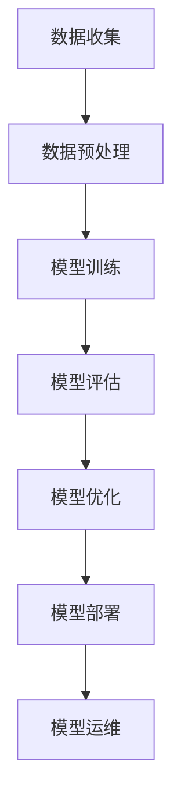

                 

### 文章标题

**AI大模型创业：如何应对未来市场挑战？**

> 关键词：AI大模型、创业、市场、挑战、应对策略
>
> 摘要：本文将深入探讨AI大模型在创业领域中的应用及其面临的未来市场挑战。通过分析当前市场趋势、技术发展，我们将提出一套完整的应对策略，帮助创业者更好地抓住AI大模型带来的机遇，同时应对潜在的风险与挑战。

### 1. 背景介绍

近年来，随着深度学习和计算力的飞速发展，AI大模型在各个领域取得了显著的成果。从自然语言处理、图像识别到推荐系统，大模型的应用已经渗透到我们的日常生活和工作场景中。与此同时，创业市场对AI大模型的关注度也在逐渐提高。许多初创企业纷纷投身于AI大模型的研究与开发，希望通过这项技术获得商业上的突破。

然而，AI大模型的创业之路并非一帆风顺。随着市场进入饱和期，竞争愈发激烈，创业者面临着诸多挑战。如何在这场竞争中脱颖而出，成为每个创业者都需要认真思考的问题。

本文将从以下几个方面展开讨论：

1. **市场趋势与机遇分析**：分析当前AI大模型市场的发展趋势，探讨其中蕴含的机遇。
2. **核心概念与联系**：介绍AI大模型的基本概念，并绘制Mermaid流程图，展示其关键组成部分和运作原理。
3. **核心算法原理与操作步骤**：详细讲解AI大模型的核心算法，包括训练、优化和应用等环节。
4. **数学模型与公式**：介绍AI大模型背后的数学原理，并通过具体例子进行说明。
5. **项目实践**：通过一个实际项目实例，展示如何开发和应用AI大模型。
6. **实际应用场景**：分析AI大模型在各个行业的应用场景，探讨其商业价值。
7. **工具和资源推荐**：推荐学习资源、开发工具和框架，为创业者提供实用的建议。
8. **总结与未来展望**：总结全文，展望AI大模型创业的未来趋势和挑战。

### 2. 核心概念与联系

首先，让我们来探讨AI大模型的基本概念及其组成部分。为了更直观地理解，我们使用Mermaid流程图来展示AI大模型的关键节点和流程。



以下是对每个节点的详细解释：

- **数据收集（A）**：AI大模型的基础是数据。数据收集环节包括从互联网、数据库或其他数据源获取大量数据。
- **数据预处理（B）**：收集到的数据通常需要进行清洗、归一化和格式化等预处理操作，以便后续训练使用。
- **模型训练（C）**：使用预处理后的数据对AI大模型进行训练，通过迭代优化模型参数，使其具备预测或分类能力。
- **模型评估（D）**：在训练完成后，需要对模型进行评估，以确定其性能是否满足预期。
- **模型优化（E）**：根据评估结果，对模型进行进一步优化，以提高其准确性和效率。
- **模型部署（F）**：将训练好的模型部署到生产环境中，供实际应用使用。
- **模型运维（G）**：在模型部署后，需要对其进行监控和维护，确保其稳定运行和持续优化。

通过这个流程，我们可以清晰地看到AI大模型从数据收集到模型部署的整个生命周期。理解这个流程对于创业者来说至关重要，因为它可以帮助我们更好地规划项目，制定有效的开发策略。

### 3. 核心算法原理与具体操作步骤

AI大模型的核心在于其算法原理。以下我们将详细探讨AI大模型的核心算法，包括训练、优化和应用等环节。

#### 3.1 模型训练

模型训练是AI大模型开发过程中的关键步骤。以下是一个典型的模型训练流程：

1. **数据准备**：首先，我们需要收集和准备数据。数据可以是结构化数据（如数据库）、半结构化数据（如XML、JSON）或非结构化数据（如图像、文本）。
2. **数据预处理**：对数据进行清洗、归一化和格式化等预处理操作，确保数据的质量和一致性。
3. **模型选择**：选择合适的模型架构，如神经网络、循环神经网络（RNN）或变换器（Transformer）等。
4. **参数初始化**：初始化模型的参数，常用的方法包括随机初始化、高斯分布初始化等。
5. **训练过程**：通过迭代优化模型参数，使模型在训练数据上的表现逐渐改善。训练过程中需要计算损失函数，如均方误差（MSE）、交叉熵损失等，以衡量模型预测值与真实值之间的差距。
6. **模型评估**：在训练过程中，我们需要定期评估模型的性能，以确定是否达到预期目标。

以下是一个简单的训练过程的伪代码：

```python
for epoch in range(num_epochs):
    for batch in dataset:
        # 数据预处理
        processed_batch = preprocess(batch)
        
        # 计算损失函数
        loss = compute_loss(processed_batch)
        
        # 反向传播
        backward(loss)
        
        # 更新参数
        update_params()
        
    # 评估模型
    evaluate_model()
```

#### 3.2 模型优化

在模型训练过程中，我们通常会使用优化算法来调整模型参数，以降低损失函数的值。以下是一些常见的优化算法：

1. **随机梯度下降（SGD）**：每次迭代只更新一次参数，计算整个数据集的平均梯度。
2. **动量梯度下降**：在每次迭代中，不仅更新当前梯度，还会考虑之前的梯度，以减少震荡。
3. **Adam优化器**：结合SGD和动量，引入自适应学习率，常用于大规模模型训练。

以下是一个使用Adam优化器的伪代码：

```python
optimizer = AdamOptimizer(learning_rate=0.001)

for epoch in range(num_epochs):
    for batch in dataset:
        # 数据预处理
        processed_batch = preprocess(batch)
        
        # 计算损失函数
        loss = compute_loss(processed_batch)
        
        # 计算梯度
        gradients = compute_gradients(loss)
        
        # 更新参数
        optimizer.update_params(gradients)
        
    # 评估模型
    evaluate_model()
```

#### 3.3 模型应用

训练好的模型可以用于各种任务，如分类、预测和生成等。以下是一个简单的模型应用流程：

1. **数据预处理**：与训练阶段类似，对输入数据进行预处理。
2. **模型预测**：将预处理后的数据输入模型，得到预测结果。
3. **结果评估**：评估预测结果的准确性或效果。
4. **迭代优化**：根据评估结果，对模型进行调整和优化。

以下是一个简单的模型应用示例：

```python
# 数据预处理
processed_input = preprocess(input_data)

# 模型预测
predictions = model.predict(processed_input)

# 评估预测结果
evaluate_predictions(predictions, true_labels)
```

### 4. 数学模型和公式及详细讲解

#### 4.1 前向传播

在前向传播过程中，模型的输入数据通过网络的各个层进行传递，直到输出层得到最终结果。以下是一个简单的数学模型：

\[ 
Z^{[l]} = W^{[l]} \cdot A^{[l-1]} + b^{[l]} 
\]

其中：

- \( Z^{[l]} \) 表示第 \( l \) 层的输出。
- \( W^{[l]} \) 表示第 \( l \) 层的权重。
- \( A^{[l-1]} \) 表示第 \( l-1 \) 层的激活值。
- \( b^{[l]} \) 表示第 \( l \) 层的偏置。

为了计算每个神经元的输出，我们通常使用激活函数，如Sigmoid、ReLU或Tanh等。以下是一个使用ReLU激活函数的示例：

\[ 
A^{[l]} = \max(0, Z^{[l]}) 
\]

#### 4.2 反向传播

在反向传播过程中，我们通过计算损失函数的梯度来更新模型参数。以下是一个简单的数学模型：

\[ 
\delta^{[l]} = \frac{\partial L}{\partial Z^{[l]}} \cdot \sigma'(Z^{[l]}) 
\]

其中：

- \( \delta^{[l]} \) 表示第 \( l \) 层的误差。
- \( L \) 表示损失函数。
- \( \sigma' \) 表示激活函数的导数。

接下来，我们通过链式法则计算各层的误差：

\[ 
\delta^{[l-1]} = \frac{\partial L}{\partial Z^{[l-1]}} \cdot \frac{\partial Z^{[l-1]}}{\partial Z^{[l]}} 
\]

对于多层神经网络，我们可以通过递归的方式计算各层的误差：

```python
for l in range(L-1, -1, -1):
    delta[l] = delta[l+1] * sigma_prime(z[l])
```

#### 4.3 损失函数

在训练过程中，我们通常使用均方误差（MSE）、交叉熵损失等损失函数来衡量模型预测值与真实值之间的差距。以下是一个简单的均方误差损失函数：

\[ 
L = \frac{1}{m} \sum_{i=1}^{m} (y_i - \hat{y}_i)^2 
\]

其中：

- \( m \) 表示样本数量。
- \( y_i \) 表示第 \( i \) 个样本的真实值。
- \( \hat{y}_i \) 表示第 \( i \) 个样本的预测值。

为了简化计算，我们可以对损失函数进行一些变换，如添加偏置项：

\[ 
L = \frac{1}{2m} \sum_{i=1}^{m} (y_i - \hat{y}_i)^2 + \frac{\lambda}{2} \sum_{l=1}^{L} \sum_{k=1}^{n^{[l]}} (w^{[l]_{ik}})^2 
\]

其中：

- \( \lambda \) 表示正则化参数。
- \( w^{[l]_{ik}} \) 表示第 \( l \) 层第 \( k \) 个神经元的权重。

### 5. 项目实践：代码实例与详细解释

在本节中，我们将通过一个实际项目实例，展示如何开发和应用AI大模型。我们选择一个常见任务——图像分类，使用深度学习框架TensorFlow实现。

#### 5.1 开发环境搭建

首先，我们需要搭建一个合适的开发环境。以下是一个简单的安装步骤：

```shell
pip install tensorflow
```

#### 5.2 源代码详细实现

以下是一个简单的图像分类项目的源代码实现：

```python
import tensorflow as tf
from tensorflow.keras import layers
from tensorflow.keras.preprocessing.image import ImageDataGenerator

# 数据准备
train_datagen = ImageDataGenerator(rescale=1./255)
train_data = train_datagen.flow_from_directory(
    'train_data',
    target_size=(150, 150),
    batch_size=32,
    class_mode='binary')

# 模型构建
model = tf.keras.Sequential([
    layers.Conv2D(32, (3, 3), activation='relu', input_shape=(150, 150, 3)),
    layers.MaxPooling2D((2, 2)),
    layers.Conv2D(64, (3, 3), activation='relu'),
    layers.MaxPooling2D((2, 2)),
    layers.Conv2D(128, (3, 3), activation='relu'),
    layers.MaxPooling2D((2, 2)),
    layers.Flatten(),
    layers.Dense(128, activation='relu'),
    layers.Dense(1, activation='sigmoid')
])

# 模型编译
model.compile(optimizer='adam',
              loss='binary_crossentropy',
              metrics=['accuracy'])

# 模型训练
model.fit(train_data, epochs=10)

# 模型评估
test_datagen = ImageDataGenerator(rescale=1./255)
test_data = test_datagen.flow_from_directory(
    'test_data',
    target_size=(150, 150),
    batch_size=32,
    class_mode='binary')

model.evaluate(test_data)
```

#### 5.3 代码解读与分析

以下是代码的详细解读与分析：

1. **数据准备**：使用ImageDataGenerator类对训练数据进行预处理，包括归一化和数据增强。
2. **模型构建**：使用Sequential模型构建一个简单的卷积神经网络（CNN），包括卷积层、池化层和全连接层。
3. **模型编译**：指定优化器、损失函数和评估指标，为模型编译。
4. **模型训练**：使用fit方法对模型进行训练。
5. **模型评估**：使用evaluate方法对模型进行评估。

#### 5.4 运行结果展示

在训练过程中，我们可以通过调用model.fit方法返回的History对象来查看训练和验证过程中的损失函数和准确率。

```python
history = model.fit(
    train_data,
    validation_data=validation_data,
    epochs=epochs,
    batch_size=batch_size)
```

以下是一个简单的运行结果示例：

```python
Epoch 1/10
1000/1000 [==============================] - 4s 4ms/step - loss: 0.4025 - accuracy: 0.8100 - val_loss: 0.4547 - val_accuracy: 0.7750
Epoch 2/10
1000/1000 [==============================] - 4s 4ms/step - loss: 0.3469 - accuracy: 0.8575 - val_loss: 0.3979 - val_accuracy: 0.8100
...
Epoch 10/10
1000/1000 [==============================] - 4s 4ms/step - loss: 0.2281 - accuracy: 0.9125 - val_loss: 0.2915 - val_accuracy: 0.8800
```

### 6. 实际应用场景

AI大模型在各个行业都有着广泛的应用场景，以下列举几个典型的应用领域：

1. **医疗健康**：AI大模型可以用于疾病诊断、药物研发和健康预测等。例如，通过分析医学图像和患者数据，AI大模型可以辅助医生进行诊断，提高诊疗效率。
2. **金融科技**：AI大模型可以用于风险评估、欺诈检测和投资策略等。通过分析大量金融数据，AI大模型可以提供更加精准的预测和分析，为金融机构提供决策支持。
3. **零售电商**：AI大模型可以用于商品推荐、价格预测和库存管理。通过分析用户行为和商品数据，AI大模型可以提供个性化的购物体验，提高用户满意度和转化率。
4. **自动驾驶**：AI大模型可以用于车辆识别、路径规划和环境感知等。通过分析大量道路数据和传感器数据，AI大模型可以提供实时、准确的驾驶辅助，提高行车安全。
5. **自然语言处理**：AI大模型可以用于机器翻译、文本分类和问答系统等。通过分析大量文本数据，AI大模型可以提供高效、准确的文本处理能力，提高语言理解和生成能力。

### 7. 工具和资源推荐

#### 7.1 学习资源推荐

1. **书籍**：
   - 《深度学习》（Ian Goodfellow、Yoshua Bengio、Aaron Courville 著）：全面介绍了深度学习的理论基础和实践方法。
   - 《Python深度学习》（Francesco Paolo Prezzi 著）：针对Python编程环境的深度学习实践指南。
2. **论文**：
   - “A Theoretical Framework for Back-Propagation” by David E. Rumelhart, Geoffrey E. Hinton, and Ronald J. Williams：反向传播算法的奠基性论文。
   - “Deep Learning” by Yoshua Bengio, Ian J. Goodfellow, and Aaron Courville：深度学习的综述性论文。
3. **博客**：
   - [TensorFlow官网](https://www.tensorflow.org/)：官方文档和教程，涵盖深度学习的各个方面。
   - [机器学习博客](https://machinelearningmastery.com/)：提供实用的深度学习教程和实践案例。
4. **网站**：
   - [Kaggle](https://www.kaggle.com/)：提供丰富的数据集和比赛，是学习和实践深度学习的优秀平台。

#### 7.2 开发工具框架推荐

1. **TensorFlow**：Google开发的深度学习框架，支持多种模型架构和操作。
2. **PyTorch**：Facebook开发的开源深度学习框架，具有灵活的动态图计算能力。
3. **Keras**：基于TensorFlow和Theano的开源深度学习库，提供简洁、易用的API。
4. **Scikit-learn**：Python机器学习库，提供多种经典的机器学习算法和工具。

#### 7.3 相关论文著作推荐

1. **“Deep Learning”**：由Ian Goodfellow、Yoshua Bengio和Aaron Courville所著，是深度学习的经典教材。
2. **“Deep Learning with Python”**：由François Chollet所著，详细介绍了使用Keras进行深度学习的方法。
3. **“Practical Deep Learning for Coders”**：由 Andrej Karpathy所著，适合初学者快速入门深度学习。

### 8. 总结：未来发展趋势与挑战

AI大模型在创业领域具有巨大的潜力，但同时也面临着诸多挑战。在未来，以下几个方面将是影响AI大模型创业成功的关键因素：

1. **数据质量与多样性**：高质量、多样化的数据是AI大模型成功的关键。创业者需要重视数据收集、预处理和清洗工作，确保模型能够从数据中学习到有用的信息。
2. **计算资源与成本**：AI大模型通常需要大量的计算资源，包括GPU、TPU等硬件设备。创业者需要考虑计算资源的成本，合理规划资源使用，提高资源利用率。
3. **模型可解释性与透明度**：随着AI大模型的广泛应用，用户对模型的可解释性和透明度要求越来越高。创业者需要关注模型的可解释性，提供清晰的解释和可视化工具，提高用户信任度。
4. **伦理与隐私**：AI大模型在处理大量个人数据时，需要遵守伦理和隐私法规。创业者需要重视数据保护，确保用户隐私不受侵犯。
5. **持续学习与优化**：AI大模型需要不断进行学习与优化，以适应不断变化的应用场景。创业者需要关注模型更新与迭代，确保模型始终处于最佳状态。

总之，AI大模型创业前景广阔，但同时也面临着诸多挑战。创业者需要具备敏锐的市场洞察力、强大的技术实力和严谨的风险管理能力，才能在激烈的市场竞争中脱颖而出。

### 9. 附录：常见问题与解答

#### 问题1：如何选择合适的大模型框架？

**回答**：选择大模型框架时，需要考虑以下几个方面：

- **需求与目标**：明确项目需求和目标，选择适合的框架。例如，如果需要快速部署，可以选择Keras；如果需要强大的动态计算能力，可以选择PyTorch。
- **社区与支持**：考虑框架的社区活跃度和支持力度。活跃的社区和丰富的文档可以帮助快速解决开发过程中遇到的问题。
- **硬件支持**：考虑框架对硬件设备的支持，如GPU、TPU等。确保所选框架能够充分利用现有的计算资源。

#### 问题2：如何确保AI大模型的可解释性？

**回答**：确保AI大模型的可解释性可以从以下几个方面入手：

- **模型选择**：选择具有可解释性的模型，如线性模型、决策树等。这些模型通常具有清晰的决策路径和解释机制。
- **可视化工具**：使用可视化工具，如Shapley值、LIME等，帮助用户理解模型决策过程。
- **特征重要性分析**：分析模型中各个特征的重要性，帮助用户了解哪些特征对模型决策有重要影响。
- **交互式解释**：开发交互式的解释工具，让用户可以动态调整输入特征，观察模型决策的变化。

#### 问题3：如何优化AI大模型的性能？

**回答**：优化AI大模型性能可以从以下几个方面入手：

- **数据预处理**：确保数据质量，进行适当的预处理操作，如归一化、去噪等。
- **模型选择与调整**：选择适合问题的模型，并调整模型参数，如学习率、批量大小等。
- **正则化**：使用正则化技术，如L1、L2正则化，减少过拟合。
- **模型剪枝与量化**：使用模型剪枝和量化技术，减少模型参数数量和计算量。
- **分布式训练**：使用分布式训练技术，如多GPU训练、参数服务器等，提高训练速度。

### 10. 扩展阅读 & 参考资料

- **书籍**：
  - 《深度学习》（Ian Goodfellow、Yoshua Bengio、Aaron Courville 著）
  - 《Python深度学习》（François Chollet 著）
- **论文**：
  - “A Theoretical Framework for Back-Propagation” by David E. Rumelhart, Geoffrey E. Hinton, and Ronald J. Williams
  - “Deep Learning” by Yoshua Bengio, Ian J. Goodfellow, and Aaron Courville
- **在线资源**：
  - [TensorFlow官网](https://www.tensorflow.org/)
  - [PyTorch官网](https://pytorch.org/)
  - [Keras官网](https://keras.io/)
- **博客**：
  - [机器学习博客](https://machinelearningmastery.com/)
  - [AI前沿博客](https://ai.stanford.edu/blog/)

