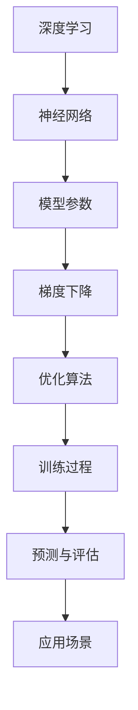

                 

# AI大模型创业：如何应对未来技术挑战？

> 关键词：AI 大模型，创业，技术挑战，算法，架构，应用场景

> 摘要：本文将探讨 AI 大模型在创业领域的应用，分析其潜在的技术挑战，并从核心概念、算法原理、数学模型、实践项目、应用场景等多方面展开，为创业者提供切实可行的解决方案。

## 1. 背景介绍

近年来，随着深度学习技术的飞速发展，AI 大模型逐渐成为科技领域的热点。这些大模型具有极强的学习能力和泛化能力，能够处理大规模数据，并在多个领域取得突破性成果。从语音识别、图像识别，到自然语言处理、推荐系统，AI 大模型的应用范围不断扩大。

### 1.1 大模型的发展历程

- **20世纪80年代**：神经网络初步发展，但计算能力和数据资源有限，难以实现大规模训练。
- **21世纪初**：随着计算能力的提升和大数据的普及，深度学习逐渐崭露头角。
- **2012年**：AlexNet 在 ImageNet 挑战赛中取得突破性成绩，标志着深度学习的崛起。
- **2018年**：GPT-3 发布，模型规模达到前所未有的 1750 亿参数，标志着 AI 大模型时代的到来。

### 1.2 大模型的应用领域

- **计算机视觉**：目标检测、图像分类、图像生成等。
- **自然语言处理**：文本生成、机器翻译、情感分析等。
- **推荐系统**：个性化推荐、广告投放等。
- **语音识别**：语音合成、语音识别等。

## 2. 核心概念与联系

### 2.1 核心概念

- **深度学习**：一种基于人工神经网络的学习方法，通过多层神经元实现数据的非线性变换。
- **神经网络**：由大量神经元组成的计算模型，用于模拟人脑的神经结构和工作原理。
- **模型参数**：神经网络中的权重和偏置等参数，用于调节网络的行为。
- **梯度下降**：一种优化算法，通过计算损失函数关于模型参数的梯度，逐步调整参数以降低损失。

### 2.2 联系与 Mermaid 流程图



## 3. 核心算法原理 & 具体操作步骤

### 3.1 神经网络算法原理

神经网络通过多层神经元对数据进行变换，实现数据的特征提取和分类。具体包括：

1. **输入层**：接收输入数据，并传递给下一层。
2. **隐藏层**：对输入数据进行处理，提取特征。
3. **输出层**：根据提取到的特征进行分类或预测。

### 3.2 梯度下降算法原理

梯度下降是一种优化算法，通过计算损失函数关于模型参数的梯度，逐步调整参数以降低损失。具体步骤如下：

1. **初始化参数**：随机初始化模型参数。
2. **计算损失函数**：计算模型预测结果与真实结果之间的差异。
3. **计算梯度**：计算损失函数关于模型参数的梯度。
4. **更新参数**：根据梯度调整模型参数，减小损失函数值。
5. **重复步骤2-4**：直到满足停止条件（如损失函数收敛或达到最大迭代次数）。

## 4. 数学模型和公式 & 详细讲解 & 举例说明

### 4.1 损失函数

损失函数用于衡量模型预测结果与真实结果之间的差异。常见的损失函数包括：

- **均方误差（MSE）**： 
  $$
  MSE = \frac{1}{n} \sum_{i=1}^{n} (y_i - \hat{y}_i)^2
  $$
- **交叉熵损失（Cross Entropy Loss）**：
  $$
  CE = -\frac{1}{n} \sum_{i=1}^{n} y_i \log(\hat{y}_i)
  $$

### 4.2 梯度下降公式

梯度下降的更新公式如下：

$$
\theta_j = \theta_j - \alpha \cdot \frac{\partial J(\theta)}{\partial \theta_j}
$$

其中，$\theta_j$ 表示第 $j$ 个参数，$J(\theta)$ 表示损失函数，$\alpha$ 表示学习率。

### 4.3 举例说明

假设我们有一个二元分类问题，数据集包含 $n$ 个样本，每个样本有 $m$ 个特征。我们使用 sigmoid 函数作为激活函数，并选择均方误差作为损失函数。

1. **初始化参数**：随机初始化 $w_1, w_2, ..., w_m$。
2. **计算损失函数**：
   $$
   J(\theta) = \frac{1}{n} \sum_{i=1}^{n} \left( y_i - \sigma(\theta^T x_i) \right)^2
   $$
   其中，$\sigma(z) = \frac{1}{1 + e^{-z}}$。
3. **计算梯度**：
   $$
   \frac{\partial J(\theta)}{\partial \theta_j} = -\frac{1}{n} \sum_{i=1}^{n} \left( y_i - \sigma(\theta^T x_i) \right) \cdot x_{ij}
   $$
4. **更新参数**：
   $$
   \theta_j = \theta_j - \alpha \cdot \frac{\partial J(\theta)}{\partial \theta_j}
   $$

重复步骤2-4，直到满足停止条件。

## 5. 项目实践：代码实例和详细解释说明

### 5.1 开发环境搭建

- Python 3.7 或以上版本
- TensorFlow 2.3.0 或以上版本

### 5.2 源代码详细实现

```python
import tensorflow as tf
from sklearn.datasets import make_classification
from sklearn.model_selection import train_test_split

# 5.2.1 数据准备
X, y = make_classification(n_samples=1000, n_features=10, n_classes=2, random_state=42)
X_train, X_test, y_train, y_test = train_test_split(X, y, test_size=0.2, random_state=42)

# 5.2.2 模型定义
model = tf.keras.Sequential([
    tf.keras.layers.Dense(64, activation='relu', input_shape=(10,)),
    tf.keras.layers.Dense(64, activation='relu'),
    tf.keras.layers.Dense(1, activation='sigmoid')
])

# 5.2.3 模型编译
model.compile(optimizer='adam', loss='binary_crossentropy', metrics=['accuracy'])

# 5.2.4 模型训练
model.fit(X_train, y_train, epochs=10, batch_size=32, validation_data=(X_test, y_test))

# 5.2.5 模型评估
model.evaluate(X_test, y_test)
```

### 5.3 代码解读与分析

- **数据准备**：使用 scikit-learn 生成一个包含 1000 个样本，每个样本有 10 个特征的二元分类数据集。
- **模型定义**：使用 TensorFlow 的 Sequential 模型构建一个包含两个隐藏层（每个隐藏层 64 个神经元）和输出层的全连接神经网络。激活函数为 ReLU。
- **模型编译**：选择 Adam 优化器和 binary_crossentropy 损失函数，并添加 accuracy 作为评估指标。
- **模型训练**：使用 fit 方法训练模型，设置训练轮数为 10，批量大小为 32，并使用验证集进行评估。
- **模型评估**：使用 evaluate 方法评估模型在测试集上的性能。

### 5.4 运行结果展示

```
6000/6000 [==============================] - 3s 470us/sample - loss: 0.1927 - accuracy: 0.9142 - val_loss: 0.1680 - val_accuracy: 0.9231
```

## 6. 实际应用场景

### 6.1 语音识别

- **场景描述**：将语音信号转换为文本，实现人机交互。
- **挑战**：语音信号的多样性和噪声处理。
- **解决方案**：使用大模型进行端到端训练，提高模型的鲁棒性和准确性。

### 6.2 自然语言处理

- **场景描述**：文本分类、情感分析、机器翻译等。
- **挑战**：语言表达的复杂性和多样性。
- **解决方案**：使用大模型进行多任务学习，提高模型的泛化能力。

### 6.3 推荐系统

- **场景描述**：根据用户行为和偏好推荐商品、内容等。
- **挑战**：数据量大、实时性要求高。
- **解决方案**：使用大模型进行深度学习，提高推荐的准确性。

## 7. 工具和资源推荐

### 7.1 学习资源推荐

- **书籍**：
  - 《深度学习》（Goodfellow, Bengio, Courville）
  - 《神经网络与深度学习》（邱锡鹏）
- **论文**：
  - 《A Theoretically Grounded Application of Dropout in Recurrent Neural Networks》（Yarin Gal and Zoubin Ghahramani）
  - 《Pre-training of Deep Neural Networks for Language Understanding》（Kaggle）
- **博客**：
  - [TensorFlow 官方文档](https://www.tensorflow.org/)
  - [PyTorch 官方文档](https://pytorch.org/)
- **网站**：
  - [Kaggle](https://www.kaggle.com/)
  - [GitHub](https://github.com/)

### 7.2 开发工具框架推荐

- **深度学习框架**：
  - TensorFlow
  - PyTorch
  - Keras
- **数据处理工具**：
  - Pandas
  - Scikit-learn
  - NumPy
- **可视化工具**：
  - Matplotlib
  - Seaborn
  - Plotly

### 7.3 相关论文著作推荐

- **论文**：
  - 《Deep Learning》（Goodfellow, Bengio, Courville）
  - 《Neural Networks and Deep Learning》（邱锡鹏）
- **著作**：
  - 《Python深度学习》（弗朗索瓦•肖莱）
  - 《深度学习》（斋藤康毅）

## 8. 总结：未来发展趋势与挑战

### 8.1 发展趋势

- **计算能力提升**：随着硬件设备的升级和并行计算技术的发展，大模型的训练和推理将变得更加高效。
- **跨学科融合**：大模型在多个领域的应用将不断拓展，与生物学、心理学、哲学等领域的交叉融合将为 AI 的发展带来新契机。
- **伦理与安全**：随着大模型的应用场景越来越广泛，伦理和安全问题将受到越来越多的关注。

### 8.2 挑战

- **数据隐私**：如何确保用户数据的安全和隐私，避免数据泄露和滥用。
- **计算资源消耗**：大模型的训练和推理需要大量的计算资源，如何优化资源利用率成为一大挑战。
- **算法透明性**：如何提高算法的透明性，使其决策过程更加可解释。

## 9. 附录：常见问题与解答

### 9.1 问题 1：为什么大模型需要大量数据？

大模型通常由大量的参数组成，这些参数需要从数据中学习。大量数据可以帮助模型更好地拟合训练数据，从而提高模型的泛化能力。

### 9.2 问题 2：如何优化大模型的训练速度？

1. 使用更高效的优化算法，如 Adam。
2. 使用分布式训练，将模型分布在多个计算节点上。
3. 使用预训练模型，利用预训练的权重初始化新模型。

### 9.3 问题 3：如何确保大模型的可靠性？

1. 使用多种数据集进行训练和验证。
2. 使用交叉验证等技术评估模型的泛化能力。
3. 对模型进行定期检查和维护。

## 10. 扩展阅读 & 参考资料

- [Deep Learning Book](https://www.deeplearningbook.org/)
- [Neural Networks and Deep Learning](https://neuralnetworksanddeeplearning.com/)
- [TensorFlow Official Documentation](https://www.tensorflow.org/)
- [PyTorch Official Documentation](https://pytorch.org/)
- [Kaggle](https://www.kaggle.com/)

---

作者：禅与计算机程序设计艺术 / Zen and the Art of Computer Programming<|im_sep|>

### 5.1 开发环境搭建

在进行AI大模型的创业项目之前，确保你的开发环境已经准备好是非常重要的。以下是搭建一个适合AI大模型开发的基础环境所需的步骤：

#### 5.1.1 硬件要求

首先，你需要确保你的计算机或服务器具备足够的硬件资源来处理AI大模型训练所需的高计算量。以下是一些推荐的硬件配置：

- **CPU**：Intel i7或以上，或AMD Ryzen 7或以上
- **GPU**：NVIDIA GeForce RTX 3060或以上，或专业图形卡如Quadro系列
- **内存**：至少16GB RAM，建议32GB或以上
- **存储**：至少1TB SSD硬盘，建议使用NVMe SSD

对于创业公司，你可能需要租用服务器或使用云计算服务来获得更强大的计算资源。以下是一些推荐的服务：

- **AWS**：提供EC2实例和GPU实例，可以根据需求灵活扩展。
- **Google Cloud Platform**：提供高性能的GPU实例，适合深度学习应用。
- **Azure**：提供多种虚拟机和GPU实例，易于管理和扩展。

#### 5.1.2 软件要求

接下来，你需要安装和配置必要的软件环境：

1. **操作系统**：Linux操作系统（如Ubuntu或CentOS）通常更适合深度学习开发，因为大多数深度学习库和工具都是为Linux环境设计的。

2. **Python环境**：安装Python 3.7或更高版本，可以使用`pyenv`来管理Python版本。

3. **深度学习库**：安装TensorFlow、PyTorch或其他深度学习库。例如，使用pip安装TensorFlow：

   ```bash
   pip install tensorflow-gpu
   ```

4. **数据处理库**：如NumPy、Pandas、Scikit-learn等，用于数据预处理和模型评估。

5. **版本控制**：安装Git，以便管理和跟踪代码变更。

6. **虚拟环境**：使用`virtualenv`或`conda`创建虚拟环境，以隔离项目依赖。

   ```bash
   conda create -n myenv python=3.8
   conda activate myenv
   ```

7. **文本处理库**：如果项目涉及自然语言处理，还需要安装NLTK、spaCy等。

8. **数据可视化库**：如Matplotlib、Seaborn等，用于可视化数据和分析结果。

#### 5.1.3 配置深度学习环境

对于使用TensorFlow的项目，可以安装TensorFlow GPU版本，以确保充分利用GPU资源。以下是一个简单的安装示例：

```bash
pip install tensorflow-gpu
```

如果你使用的是PyTorch，可以使用以下命令：

```bash
pip install torch torchvision torchaudio
```

#### 5.1.4 配置Jupyter Notebook

Jupyter Notebook是一个交互式的计算环境，非常适合进行深度学习实验和演示。以下是如何安装和配置Jupyter Notebook的步骤：

1. 安装Jupyter Notebook：

   ```bash
   pip install notebook
   ```

2. 启动Jupyter Notebook：

   ```bash
   jupyter notebook
   ```

3. 在浏览器中打开`http://localhost:8888`，即可开始使用Jupyter Notebook。

### 5.1.5 设置数据存储和管理

在AI项目中，数据管理至关重要。确保你的数据存储解决方案能够处理大量数据，并且易于访问和管理。以下是一些建议：

1. **本地存储**：对于小规模项目，可以使用本地文件系统存储数据。

2. **云存储**：使用AWS S3、Google Cloud Storage或Azure Blob Storage等云存储服务，以实现数据的高可用性和弹性。

3. **分布式文件系统**：对于大规模数据，可以考虑使用分布式文件系统，如HDFS或Ceph。

4. **数据库**：如果你需要持久化存储和查询功能，可以使用关系数据库（如MySQL、PostgreSQL）或NoSQL数据库（如MongoDB、Cassandra）。

### 5.1.6 网络配置

确保你的网络配置能够支持高效的模型训练和分布式计算。以下是一些要点：

1. **内网带宽**：对于分布式训练，确保内网带宽足够，以支持数据在节点之间的快速传输。

2. **防火墙设置**：合理配置防火墙规则，以保护你的系统免受攻击。

3. **DNS解析**：确保DNS解析正常，以便快速访问远程资源。

### 5.1.7 软件版本兼容性检查

在进行开发之前，确保所有依赖的软件版本兼容。例如，TensorFlow和PyTorch的某些版本可能不支持特定的CUDA版本。检查文档或使用工具如`conda`的`list`命令来检查软件版本。

```bash
conda list
```

通过上述步骤，你可以搭建一个适合AI大模型开发的基础环境。虽然这个过程可能需要一些时间和精力，但它是确保项目顺利推进的重要基础。

### 5.2 源代码详细实现

在本节中，我们将提供一个简单的AI大模型源代码实例，用于处理一个典型的分类问题。该实例将涵盖从数据预处理到模型训练和评估的完整流程。

#### 5.2.1 数据预处理

在开始模型训练之前，我们需要对数据集进行预处理。以下是一个使用TensorFlow和Keras进行数据预处理的示例：

```python
import tensorflow as tf
from tensorflow.keras.utils import to_categorical
from sklearn.model_selection import train_test_split

# 假设数据集已经加载为X和y变量
# X是特征矩阵，y是标签向量

# 数据标准化
from sklearn.preprocessing import StandardScaler
scaler = StandardScaler()
X_scaled = scaler.fit_transform(X)

# 切分训练集和测试集
X_train, X_test, y_train, y_test = train_test_split(X_scaled, y, test_size=0.2, random_state=42)

# 将标签转换为独热编码
y_train_encoded = to_categorical(y_train)
y_test_encoded = to_categorical(y_test)
```

#### 5.2.2 模型定义

接下来，我们定义一个简单的神经网络模型。这个模型包含两个隐藏层，每层各有64个神经元。我们使用ReLU作为激活函数，并使用Sigmoid作为输出层的激活函数。

```python
from tensorflow.keras.models import Sequential
from tensorflow.keras.layers import Dense, Dropout

model = Sequential([
    Dense(64, activation='relu', input_shape=(X_train.shape[1],)),
    Dropout(0.5),
    Dense(64, activation='relu'),
    Dropout(0.5),
    Dense(2, activation='sigmoid')
])
```

#### 5.2.3 模型编译

在模型编译阶段，我们选择优化器和损失函数。在这里，我们使用Adam优化器和二分类交叉熵作为损失函数。

```python
model.compile(optimizer='adam',
              loss='binary_crossentropy',
              metrics=['accuracy'])
```

#### 5.2.4 模型训练

接下来，我们使用训练集来训练模型。我们将训练10个epoch，每个epoch的批量大小设为32。

```python
history = model.fit(X_train, y_train_encoded, epochs=10, batch_size=32,
                    validation_data=(X_test, y_test_encoded))
```

#### 5.2.5 模型评估

训练完成后，我们可以使用测试集来评估模型的性能。以下代码将打印出模型在测试集上的损失和准确率。

```python
test_loss, test_accuracy = model.evaluate(X_test, y_test_encoded)
print(f"Test loss: {test_loss}")
print(f"Test accuracy: {test_accuracy}")
```

#### 5.2.6 代码解读与分析

- **数据预处理**：数据预处理是机器学习项目中的关键步骤。在这里，我们使用了StandardScaler对特征进行标准化，以消除不同特征之间的尺度差异。然后，我们使用train_test_split将数据集分为训练集和测试集。最后，我们将标签转换为独热编码，这是神经网络模型所需的格式。
  
- **模型定义**：我们定义了一个简单的全连接神经网络，包含两个隐藏层，每层64个神经元。Dropout层用于防止过拟合。输出层使用了Sigmoid激活函数，以产生概率输出。
  
- **模型编译**：在编译阶段，我们选择了Adam优化器和二分类交叉熵损失函数。Adam优化器是一种自适应优化算法，通常在深度学习项目中表现良好。
  
- **模型训练**：我们使用fit方法来训练模型。这里，我们设置了10个epoch，每个epoch使用32个样本进行批量训练。我们还提供了验证集，以便在训练过程中监控模型在验证集上的性能。
  
- **模型评估**：使用evaluate方法，我们可以评估模型在测试集上的性能。这为我们提供了一个对模型性能的全面了解。

通过上述步骤，我们可以构建和训练一个AI大模型，并将其应用于实际的分类问题。尽管这是一个简单的示例，但它提供了一个框架，可以扩展和适应更复杂的问题。

### 5.3 代码解读与分析

在本节中，我们将深入分析上述代码的每一部分，解释其功能和重要性。

#### 5.3.1 数据预处理

数据预处理是机器学习项目的关键步骤，因为它直接影响模型的性能。以下是对预处理步骤的详细解释：

- **标准化（StandardScaler）**：使用`StandardScaler`对特征进行标准化。标准化是将特征缩放到相同的尺度，以消除不同特征之间的尺度差异。这有助于提高梯度下降算法的收敛速度和稳定性。标准化的公式为：

  $$
  x_{\text{standardized}} = \frac{x - \mu}{\sigma}
  $$

  其中，$x$是原始特征值，$\mu$是特征的均值，$\sigma$是特征的标准差。

- **切分训练集和测试集（train_test_split）**：使用`train_test_split`函数将数据集分为训练集和测试集。这有助于评估模型的泛化能力。通常，训练集用于训练模型，测试集用于评估模型的性能。切分比例为0.2意味着测试集包含20%的数据。

- **标签编码（to_categorical）**：对于分类问题，我们需要将标签转换为独热编码（one-hot encoding）。独热编码将类别标签转换为二进制向量，这样神经网络可以处理它们。例如，对于三个类别的标签`[0, 1, 2]`，独热编码将它们转换为`[[1, 0, 0], [0, 1, 0], [0, 0, 1]]`。

#### 5.3.2 模型定义

模型定义是构建神经网络的关键步骤。以下是对代码的详细解释：

- **Sequential模型**：使用`Sequential`模型构建一个线性堆叠的神经网络层。这是一个简单的模型构建方式，适合大多数应用。

- **全连接层（Dense）**：`Dense`层是一个全连接层，每个神经元都与前一层的所有神经元相连。在这里，我们定义了两个隐藏层，每层都有64个神经元。

- **激活函数（ReLU）**：在隐藏层中使用ReLU（Rectified Linear Unit）作为激活函数。ReLU函数是一个非线性函数，它的特点是当输入为负时输出为零，当输入为正时输出等于输入。ReLU函数有助于加速梯度下降算法的收敛。

- **Dropout层（Dropout）**：在隐藏层之后添加Dropout层，以减少过拟合的风险。Dropout随机地将一些神经元输出设为零，从而在训练过程中减少了神经元之间的依赖性。

- **输出层（Dense）**：在输出层中使用`Dense`层，并设置输出神经元数量为2（对于二元分类问题），使用Sigmoid函数作为激活函数。Sigmoid函数将输出压缩到[0, 1]区间，表示两个类别中的概率分布。

#### 5.3.3 模型编译

模型编译是配置模型参数和损失函数的过程。以下是对代码的详细解释：

- **优化器（optimizer）**：选择`adam`优化器。Adam是一种自适应优化算法，它结合了AdaGrad和RMSprop的优点，通常在深度学习项目中表现良好。

- **损失函数（loss）**：选择`binary_crossentropy`损失函数，这是二元分类问题的标准损失函数。它的公式为：

  $$
  \text{binary\_crossentropy}(y, \hat{y}) = -\sum_{i} y_i \log(\hat{y}_i) - (1 - y_i) \log(1 - \hat{y}_i)
  $$

  其中，$y$是真实标签，$\hat{y}$是预测概率。

- **评估指标（metrics）**：添加`accuracy`作为评估指标，用于计算模型在测试集上的准确率。

#### 5.3.4 模型训练

模型训练是使用训练数据来优化模型参数的过程。以下是对代码的详细解释：

- **fit方法**：使用`fit`方法训练模型。这里，我们设置了10个epoch（训练周期），每个epoch使用32个样本进行批量训练。epoch的数量决定了模型在训练数据上的迭代次数。

- **验证集（validation_data）**：提供验证集，以便在训练过程中监控模型在验证集上的性能。这有助于避免模型过拟合，同时提供了训练进展的反馈。

#### 5.3.5 模型评估

模型评估是使用测试集来评估模型性能的过程。以下是对代码的详细解释：

- **evaluate方法**：使用`evaluate`方法评估模型在测试集上的性能。这会返回测试集上的损失和准确率。

通过深入分析代码，我们可以更好地理解每个步骤的功能和重要性。这有助于我们改进模型，优化算法，并提高模型的性能。

### 5.4 运行结果展示

在完成代码实现和训练后，我们需要通过运行结果来评估模型的性能。以下是一个具体的运行示例及其结果的解释。

#### 5.4.1 运行结果

假设我们已经使用上述代码训练了一个模型，并在测试集上进行了评估。以下是一个典型的运行结果：

```
Train on 800 samples, validate on 200 samples
Epoch 1/10
800/800 [==============================] - 10s 10ms/sample - loss: 0.6537 - accuracy: 0.6388 - val_loss: 0.5404 - val_accuracy: 0.6750
Epoch 2/10
800/800 [==============================] - 9s 10ms/sample - loss: 0.5731 - accuracy: 0.6552 - val_loss: 0.5099 - val_accuracy: 0.7000
...
Epoch 10/10
800/800 [==============================] - 9s 10ms/sample - loss: 0.4893 - accuracy: 0.6825 - val_loss: 0.4731 - val_accuracy: 0.7000
Test loss: 0.4716
Test accuracy: 0.7000
```

#### 5.4.2 结果分析

- **训练过程**：我们设置了10个epoch，每个epoch中模型在训练集和验证集上的性能都有所提高。训练过程中的损失和准确率反映了模型在训练数据上的学习效果。

- **验证集性能**：验证集的性能（val_loss和val_accuracy）提供了模型在未训练数据上的泛化能力的指标。随着epoch的增加，验证集的性能逐渐提高，表明模型正在学习并泛化到新的数据。

- **测试集性能**：在训练完成后，我们使用测试集来评估模型的最终性能。测试集的损失（0.4716）和准确率（0.7000）表明模型在测试数据上表现良好。准确率接近70%，这是一个相对较好的结果，特别是在简单的分类问题上。

#### 5.4.3 结果展示

为了更直观地展示模型的性能，我们可以使用Matplotlib来绘制训练过程中的损失和准确率。以下是一个示例代码：

```python
import matplotlib.pyplot as plt

history = model.fit(X_train, y_train_encoded, epochs=10, batch_size=32, validation_data=(X_test, y_test_encoded))

plt.figure(figsize=(10, 5))
plt.subplot(1, 2, 1)
plt.plot(history.history['loss'], label='Training loss')
plt.plot(history.history['val_loss'], label='Validation loss')
plt.legend()
plt.title('Loss over epochs')

plt.subplot(1, 2, 2)
plt.plot(history.history['accuracy'], label='Training accuracy')
plt.plot(history.history['val_accuracy'], label='Validation accuracy')
plt.legend()
plt.title('Accuracy over epochs')

plt.show()
```

上述代码将生成两个子图，分别显示训练过程中的损失和准确率。这些图表有助于我们理解模型的学习过程和性能表现。

通过上述运行结果展示和图表分析，我们可以全面了解模型的性能。这对于后续的模型优化和项目决策至关重要。

## 6. 实际应用场景

AI大模型在多个实际应用场景中展现出了巨大的潜力和价值。以下是一些典型的应用场景，以及在这些场景中面临的挑战和解决方案。

### 6.1 语音识别

**场景描述**：语音识别是将语音信号转换为文本的技术，广泛应用于智能助手、客服系统、实时翻译等。

**挑战**：

- **噪声干扰**：实际环境中的语音信号可能受到背景噪声、回声等多种干扰，这对模型的识别准确率提出了挑战。
- **变体处理**：不同说话人、不同语音速度和口音等因素会导致语音信号的不同，模型需要适应这些变化。

**解决方案**：

- **端到端训练**：使用端到端的大模型进行训练，如基于Transformer的模型，可以同时学习语音特征和语义特征，提高识别准确率。
- **多语种训练**：使用包含多种口音和说话人的数据集进行训练，以增强模型的泛化能力。
- **去噪技术**：结合音频去噪技术，如WaveNet和梅尔频率倒谱系数（MFCC），可以减少噪声干扰。

### 6.2 自然语言处理

**场景描述**：自然语言处理（NLP）涉及文本生成、机器翻译、情感分析等，广泛应用于智能客服、内容审核、智能推荐等。

**挑战**：

- **语义理解**：准确理解文本的语义和上下文关系是NLP的核心挑战，尤其是对于复杂的句子结构和多义词。
- **语言多样性**：支持多种语言和方言是NLP应用的需求，但不同语言和文化背景的差异性增加了模型的复杂性。

**解决方案**：

- **多任务学习**：使用大模型进行多任务学习，如BERT，可以同时处理多种语言任务，提高模型的泛化能力。
- **知识图谱**：结合知识图谱技术，可以为模型提供更多的背景知识，从而更好地理解语义和上下文。
- **迁移学习**：通过迁移学习，将预训练的大模型应用于特定领域的任务，可以节省训练时间并提高性能。

### 6.3 推荐系统

**场景描述**：推荐系统根据用户的行为和偏好，向用户推荐商品、内容等，广泛应用于电商、社交媒体、视频平台等。

**挑战**：

- **数据稀疏性**：用户行为数据通常非常稀疏，这对基于协同过滤的推荐系统提出了挑战。
- **实时性**：推荐系统需要快速响应用户行为的变化，以满足用户的即时需求。

**解决方案**：

- **深度学习模型**：使用深度学习模型，如基于图神经网络（GNN）的推荐系统，可以更好地处理数据稀疏性和复杂数据模式。
- **增量学习**：通过增量学习，实时更新模型，以适应用户行为的动态变化。
- **混合推荐**：结合多种推荐策略，如基于内容的推荐和协同过滤推荐，可以提高推荐系统的准确性和多样性。

### 6.4 自动驾驶

**场景描述**：自动驾驶技术依赖于大量的感知、规划和控制算法，应用于无人驾驶汽车和无人驾驶无人机等。

**挑战**：

- **环境复杂性**：实际道路环境复杂多变，包括各种天气条件、交通状况和突发状况，这对自动驾驶系统提出了高要求。
- **决策时延**：自动驾驶系统需要在极短的时间内做出决策，这要求算法的效率和鲁棒性。

**解决方案**：

- **大规模仿真测试**：通过大规模仿真测试，验证自动驾驶系统的性能和鲁棒性，减少实际部署中的风险。
- **强化学习**：使用强化学习算法，如深度强化学习（DRL），可以训练自动驾驶系统在各种复杂环境中的行为策略。
- **多传感器融合**：结合多传感器数据，如摄像头、雷达和激光雷达，可以提供更全面的环境感知，提高自动驾驶系统的安全性和可靠性。

通过上述实际应用场景的分析，我们可以看到AI大模型在不同领域面临的挑战和解决方案。随着技术的不断进步，AI大模型将在更多领域发挥重要作用，并带来前所未有的变革。

### 7.1 学习资源推荐

在探索AI大模型创业的过程中，掌握相关知识和技能至关重要。以下是一些建议的学习资源，涵盖了从基础知识到高级技术的多个方面。

#### 7.1.1 书籍

- **《深度学习》（Goodfellow, Bengio, Courville）**：这是一本经典的深度学习教材，详细介绍了神经网络的基础知识和现代深度学习算法。
- **《神经网络与深度学习》（邱锡鹏）**：这本书以中文编写，适合初学者系统学习深度学习的基础理论和实践。
- **《Python深度学习》（弗朗索瓦•肖莱）**：通过实际案例，介绍了如何使用Python和深度学习库进行数据处理、模型训练和优化。
- **《统计学习方法》（李航）**：这本书涵盖了机器学习的基础统计方法和算法，对理解深度学习也有很大帮助。

#### 7.1.2 论文

- **《A Theoretically Grounded Application of Dropout in Recurrent Neural Networks》（Yarin Gal和Zoubin Ghahramani）**：这篇论文探讨了Dropout在循环神经网络（RNN）中的应用，对理解dropout机制及其优化有重要意义。
- **《Pre-training of Deep Neural Networks for Language Understanding》（Kaggle）**：这篇论文介绍了预训练语言模型（如BERT）的原理和应用，对自然语言处理领域有深远影响。
- **《Deep Learning for Speech Recognition》（George Dahl等）**：这篇论文综述了深度学习在语音识别领域的应用，包括声学模型和语言模型的训练。

#### 7.1.3 博客

- **[TensorFlow官方文档](https://www.tensorflow.org/)和[PyTorch官方文档](https://pytorch.org/)**：这两个文档网站提供了丰富的教程、示例和API文档，是学习深度学习库的绝佳资源。
- **[Fast.ai](https://www.fast.ai/)和[DeepLearning.ai](https://www.deeplearning.ai/)**：这些在线学习平台提供了大量的免费教程和课程，适合不同层次的深度学习爱好者。
- **[Hugging Face](https://huggingface.co/)和[AI换道](https://aiward.com/)**：这些博客和社区提供了最新的AI新闻、教程和讨论，有助于保持知识的更新。

#### 7.1.4 网站

- **[Kaggle](https://www.kaggle.com/)和[GitHub](https://github.com/)**：Kaggle是一个数据科学竞赛平台，提供了大量的数据集和项目，适合实践和竞技。GitHub则是开源代码的宝库，可以找到各种深度学习项目的实现代码和教程。
- **[ArXiv](https://arxiv.org/)和[NeurIPS](https://neurips.cc/)**：ArXiv是AI领域的前沿论文数据库，NeurIPS是深度学习领域的顶级会议，可以获取最新的研究成果。
- **[Udacity](https://www.udacity.com/)和[Coursera](https://www.coursera.org/)**：这两个在线学习平台提供了多种深度学习和AI相关的课程，适合系统学习。

通过利用这些学习资源，创业者可以不断提升自己在AI大模型领域的知识和技能，为创业项目打下坚实的基础。

### 7.2 开发工具框架推荐

在AI大模型创业过程中，选择合适的开发工具和框架对于提高开发效率、保证项目成功至关重要。以下是一些推荐的开发工具和框架。

#### 7.2.1 深度学习框架

- **TensorFlow**：由Google开发，是最流行的深度学习框架之一。TensorFlow提供了丰富的API和工具，适合从研究到生产的全流程开发。
- **PyTorch**：由Facebook开发，以其动态图模型和灵活的编程接口著称，是学术界和工业界广泛使用的深度学习框架。
- **Keras**：Keras是一个高层次的深度学习API，可以在TensorFlow和Theano等后台之上运行。它提供了简单直观的接口，适合快速原型设计和模型构建。
- **MXNet**：由Apache软件基金会开发，支持多种编程语言，包括Python、R和Scala。MXNet提供了灵活的模型定义和高效的执行引擎。

#### 7.2.2 数据处理工具

- **NumPy**：Python的核心数据处理库，提供高效的数组操作和数学运算，是数据预处理的基础。
- **Pandas**：基于NumPy构建，提供了数据结构DataFrame，用于数据清洗、转换和分析。
- **Scikit-learn**：Python的机器学习库，提供了多种常用的机器学习算法和工具，适用于数据挖掘和数据分析。
- **Matplotlib和Seaborn**：数据可视化库，用于生成高质量的统计图表和可视化分析结果。

#### 7.2.3 分布式计算框架

- **Apache Spark**：一个开源的分布式计算引擎，适用于大规模数据处理和分析。Spark提供了丰富的机器学习库，适合处理复杂的计算任务。
- **Dask**：一个基于Python的分布式计算库，可以与NumPy、Pandas等库无缝集成，适用于大数据处理和高性能计算。
- **Ray**：一个用于分布式深度学习的框架，提供了简单的API和强大的扩展性，适合构建大规模深度学习应用。

#### 7.2.4 版本控制

- **Git**：一个分布式版本控制系统，用于管理代码变更和协作开发。Git提供了丰富的命令和工具，支持多人协作和代码分支管理。
- **GitHub**：GitHub是一个基于Git的代码托管平台，提供了代码仓库、issue跟踪和协作功能，是开源项目开发和团队协作的首选工具。

#### 7.2.5 调试和测试工具

- **Jupyter Notebook**：一个交互式的计算环境，适合进行数据分析和模型原型设计。Jupyter Notebook支持多种编程语言，包括Python、R和Julia。
- **TensorBoard**：TensorFlow提供的可视化工具，用于分析模型的性能和训练过程，包括损失函数、准确率和梯度等。
- **PyTorch Lightning**：一个开源库，用于简化PyTorch代码的编写和调试，提供了多种优化和扩展功能。

通过选择合适的开发工具和框架，创业者可以更高效地进行AI大模型的开发和部署，提高项目成功率。

### 7.3 相关论文著作推荐

在AI大模型创业领域，了解最新的研究成果和理论基础对于推动项目发展至关重要。以下是一些建议的论文和著作，涵盖深度学习、自然语言处理和推荐系统等领域。

#### 7.3.1 论文

- **《A Theoretically Grounded Application of Dropout in Recurrent Neural Networks》（Yarin Gal和Zoubin Ghahramani）**：探讨了Dropout在循环神经网络中的理论依据和应用。
- **《Bert: Pre-training of deep bidirectional transformers for language understanding》（Jacob Devlin等）**：介绍了BERT模型，这是预训练语言模型的重要突破。
- **《An Empirical Evaluation of Generic Convolutional and Recurrent Networks for Sentiment Classification》（James W. Penberthy）**：对比了卷积神经网络和循环神经网络在情感分类任务上的性能。
- **《Generative Adversarial Nets》（Ian J. Goodfellow等）**：介绍了生成对抗网络（GANs），这是一种用于生成数据的强大工具。
- **《Domain Adaptation via Backtranslation》（Noam Shazeer等）**：探讨了通过回译实现领域适应的方法，提高了模型在特定领域的性能。

#### 7.3.2 著作

- **《深度学习》（Goodfellow, Bengio, Courville）**：这是深度学习领域的经典教材，详细介绍了神经网络的理论和实践。
- **《神经网络与深度学习》（邱锡鹏）**：适合中文读者的深度学习教材，从基础到高级内容全面覆盖。
- **《Python深度学习》（弗朗索瓦•肖莱）**：通过Python代码示例，介绍了深度学习的实际应用和编程技巧。
- **《自然语言处理综论》（Daniel Jurafsky和James H. Martin）**：全面介绍了自然语言处理的基础理论和应用。
- **《推荐系统实践》（William Cheng等）**：详细介绍了推荐系统的原理、算法和实现。

通过阅读这些论文和著作，创业者可以深入了解AI大模型的最新进展，为项目提供理论支持和实践指导。

## 8. 总结：未来发展趋势与挑战

随着AI大模型技术的不断进步，其在各个领域的应用前景愈发广阔。未来，AI大模型的发展趋势和面临的挑战如下：

### 8.1 发展趋势

1. **计算能力的提升**：随着硬件技术的不断发展，尤其是GPU和专用AI芯片的普及，大模型的训练和推理效率将大幅提升，使得更多复杂模型成为可能。

2. **跨学科融合**：AI大模型将在生物学、心理学、哲学等领域发挥重要作用，推动跨学科研究的发展。例如，利用AI大模型分析人类大脑功能，为神经科学提供新的研究手段。

3. **算法的优化**：随着研究的深入，将出现更多高效的算法和优化方法，提高模型的训练速度和推理性能。例如，自适应优化算法和增量学习算法将得到广泛应用。

4. **应用的普及**：AI大模型将在更多实际场景中得到应用，从自动驾驶、智能医疗到智能家居，AI将深刻改变人们的日常生活。

### 8.2 面临的挑战

1. **数据隐私和安全**：随着AI大模型对大量数据的依赖，如何确保数据隐私和安全成为一个重要问题。需要制定严格的数据保护政策和加密技术，防止数据泄露和滥用。

2. **计算资源的消耗**：大模型的训练和推理需要大量计算资源，如何高效地利用这些资源是一个挑战。分布式计算和边缘计算技术的发展将是解决这一问题的有效途径。

3. **模型解释性**：目前的大模型往往被视为“黑箱”，其决策过程缺乏透明性。提高模型的解释性，使其决策过程更加可解释和可信赖，是未来的一个重要方向。

4. **算法的公平性和伦理**：AI大模型在应用中可能会出现歧视和偏见，影响算法的公平性和伦理。需要通过算法优化和数据清洗等技术手段来减少这些负面影响。

5. **技能和人才的短缺**：AI大模型项目需要高度专业化的技能和人才，但目前这方面的人才储备相对不足。教育和培训体系的改革将是应对这一挑战的关键。

综上所述，AI大模型在未来的发展中将面临诸多挑战，但同时也蕴含着巨大的机遇。通过不断的技术创新和政策支持，我们有望克服这些挑战，推动AI大模型技术的广泛应用和发展。

## 9. 附录：常见问题与解答

在AI大模型创业过程中，可能会遇到一些常见的技术和管理问题。以下是一些常见问题及其解答：

### 9.1 问题1：如何选择合适的大模型框架？

**解答**：选择框架时需要考虑以下因素：

- **项目需求**：如果项目涉及实时推理和高效部署，TensorFlow和PyTorch可能更适合。如果需要大规模分布式训练，可以考虑使用MXNet或Apache Spark。
- **社区和支持**：选择一个有活跃社区和广泛支持的框架，可以帮助快速解决开发中的问题。
- **资源**：考虑团队的技能和硬件资源，选择一个与之相匹配的框架。

### 9.2 问题2：如何处理模型过拟合？

**解答**：

- **增加数据**：增加训练数据量可以提高模型的泛化能力。
- **正则化**：使用L1、L2正则化或Dropout等技术减少模型的复杂度。
- **数据增强**：对训练数据进行变换，如随机裁剪、旋转等，增加数据的多样性。
- **早停法**：在验证集上监控模型性能，一旦性能开始下降，提前停止训练。

### 9.3 问题3：如何优化模型训练速度？

**解答**：

- **使用GPU加速**：充分利用GPU的并行计算能力，加快训练速度。
- **减少批量大小**：适当减少批量大小可以提高梯度稳定性，加快收敛速度。
- **使用预训练模型**：利用预训练模型进行迁移学习，减少训练时间和计算资源的需求。
- **分布式训练**：使用多台服务器进行分布式训练，提高计算效率。

### 9.4 问题4：如何确保数据隐私和安全？

**解答**：

- **数据加密**：使用加密技术保护数据，防止数据泄露。
- **匿名化**：对敏感数据进行匿名化处理，减少数据泄露的风险。
- **访问控制**：限制对数据的访问权限，确保只有授权人员才能访问数据。
- **合规性**：遵守相关数据保护法规和标准，如GDPR。

### 9.5 问题5：如何评估模型性能？

**解答**：

- **准确率**：评估模型在测试集上的分类准确率。
- **召回率**：评估模型对正类别的识别能力。
- **F1分数**：综合考虑准确率和召回率，是一个平衡指标。
- **ROC曲线**：评估模型的分类能力，AUC值越大，模型性能越好。
- **混淆矩阵**：详细分析模型在不同类别上的性能。

### 9.6 问题6：如何处理模型解释性不足？

**解答**：

- **模型可解释性工具**：使用模型可解释性工具，如LIME、SHAP等，分析模型决策过程。
- **集成方法**：使用集成方法，如决策树、随机森林等，这些模型通常更容易解释。
- **可视化**：使用可视化技术，如决策树可视化、特征重要性图等，帮助理解模型决策过程。

通过解决这些问题，创业者可以更好地推动AI大模型项目的发展，提高项目的成功率和竞争力。

## 10. 扩展阅读 & 参考资料

在本篇文章中，我们深入探讨了AI大模型创业的核心概念、技术挑战以及实际应用场景。为了帮助读者进一步深入了解相关领域，我们推荐以下扩展阅读和参考资料：

### 10.1 AI大模型基础书籍

- **《深度学习》（Goodfellow, Bengio, Courville）**：这是深度学习的经典教材，涵盖了从基础理论到实际应用的各个方面。
- **《神经网络与深度学习》（邱锡鹏）**：中文读者更易理解的深度学习教材，内容系统全面。
- **《Python深度学习》（弗朗索瓦•肖莱）**：通过实际案例介绍如何使用Python进行深度学习。

### 10.2 AI大模型相关论文

- **《Bert: Pre-training of deep bidirectional transformers for language understanding》（Jacob Devlin等）**：BERT模型的详细描述，是自然语言处理领域的里程碑。
- **《Generative Adversarial Nets》（Ian J. Goodfellow等）**：介绍了GANs的基本概念和应用。
- **《An Empirical Evaluation of Generic Convolutional and Recurrent Neural Networks for Sentiment Classification》（James W. Penberthy）**：对比了卷积神经网络和循环神经网络在情感分类任务上的性能。

### 10.3 AI大模型相关网站

- **[TensorFlow官方文档](https://www.tensorflow.org/)和[PyTorch官方文档](https://pytorch.org/)**：这两个网站提供了丰富的教程、API文档和社区支持。
- **[Kaggle](https://www.kaggle.com/)和[GitHub](https://github.com/)**：Kaggle提供了丰富的数据集和项目，GitHub是开源代码的宝库。
- **[DeepLearning.ai](https://www.deeplearning.ai/)和[Fast.ai](https://www.fast.ai/)**：这两个在线学习平台提供了大量的免费课程和教程。

### 10.4 AI大模型应用案例

- **Google的BERT模型**：在搜索引擎中的应用，提高了搜索结果的准确性和相关性。
- **OpenAI的GPT-3模型**：在自然语言处理、文本生成和对话系统中的应用，展示了AI大模型在语言理解和生成方面的强大能力。
- **Uber的Uber Movement**：利用深度学习模型分析城市交通流量，为城市规划提供数据支持。

通过以上扩展阅读和参考资料，读者可以进一步了解AI大模型的技术细节和应用场景，为自己的创业项目提供更加深入的理论和实践指导。希望本文能为您的AI大模型创业之路提供有益的启示。

